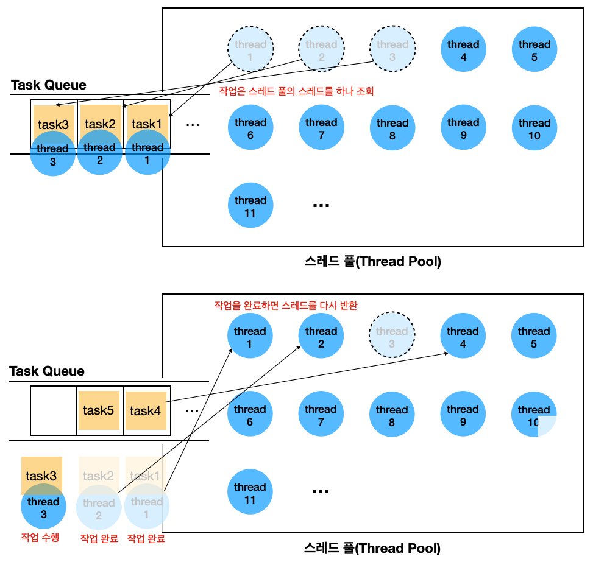
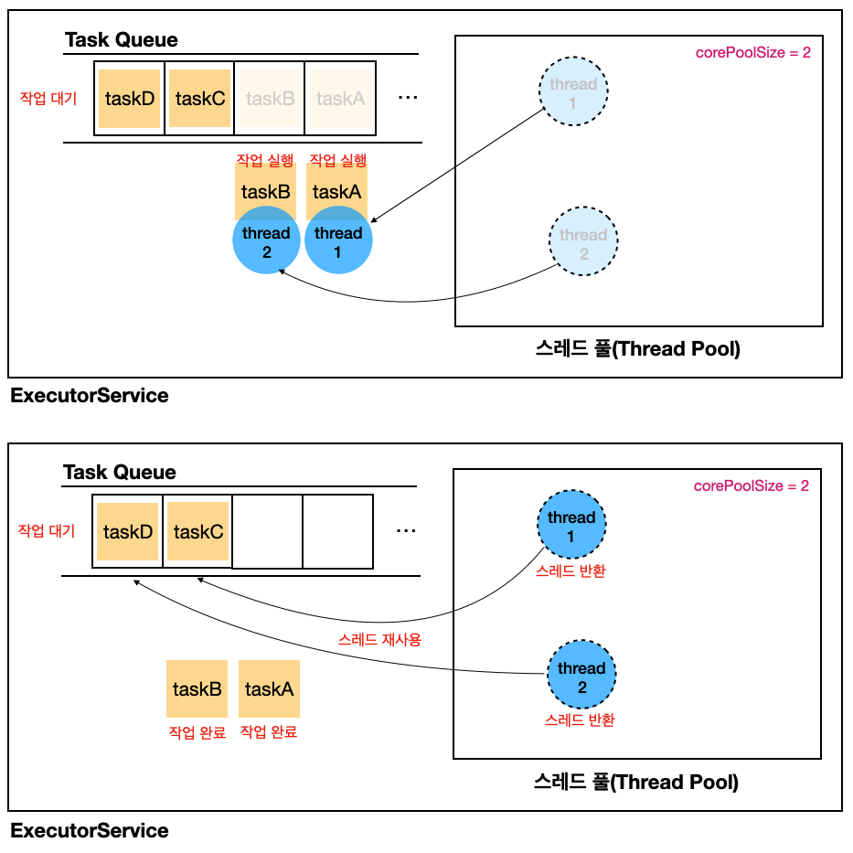
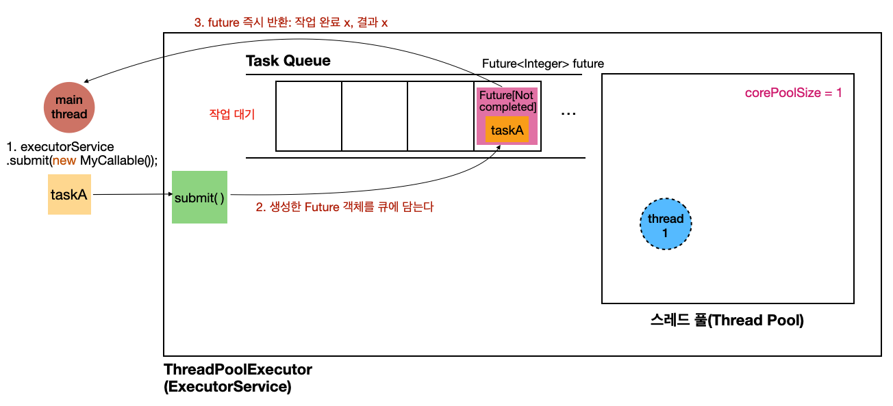
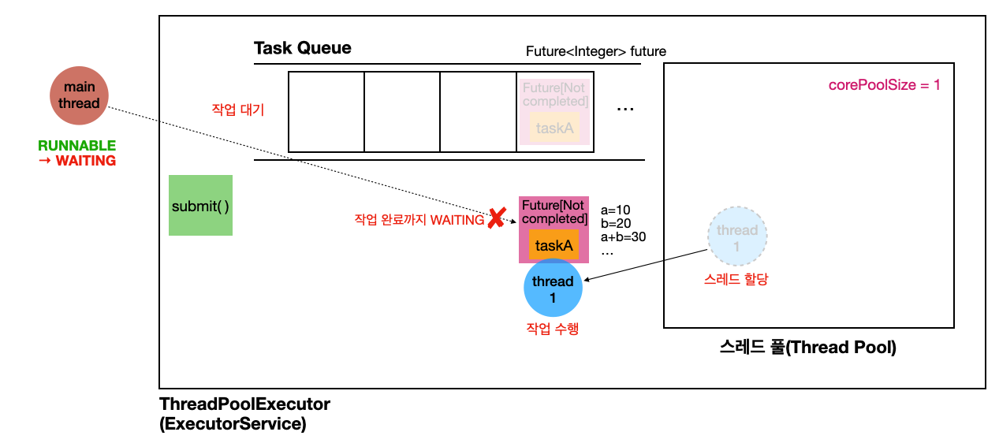
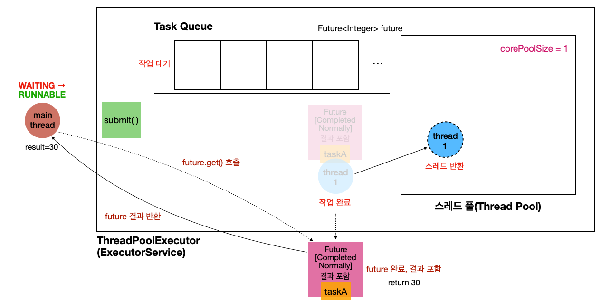
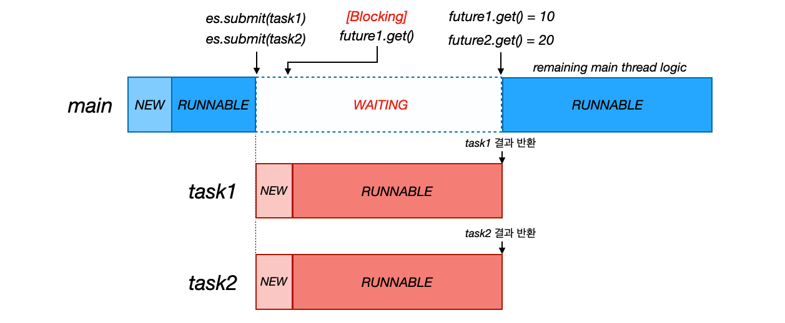
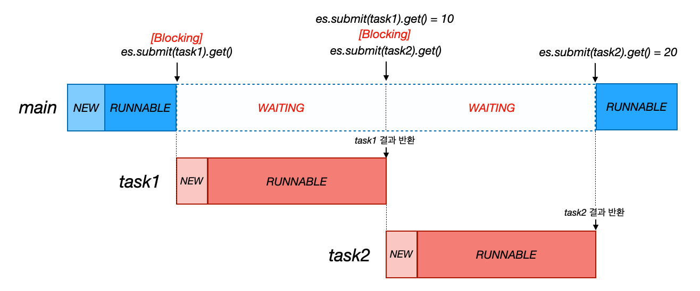

---

> 2024-07-18 업데이트
{: .prompt-warning }

> **해당 포스트는 Lombok과 `@Slf4j`(Logback)를 사용한다**
>
> 로그는 `logstash-logback-encoder`를 통해 JSON 형태로 파싱하고 있다. 편의상 `version`, `level`, `levelValue` 필드를 제외하고 사용했다.
>
> 만약 로깅에 익숙하지 않다면 로깅 대신 `System.out`을 사용하면 된다.
{: .prompt-warning }

---

## 1. Executor

### 직접 스레드를 생성하는 것은 비효율적이다

스레드를 **직접 생성해서 사용하는 경우 다음의 문제점**이 있다.

1. **스레드 생성 비용은 비싸다**
   * 스레드를 사용하기 위해서는 스레드를 생성해야 한다. 그러나 스레드의 생성 비용은 생각보다 비싸다.
     * 스레드는 자신만의 호출 스택(call stack)을 가지고 있어야 한다. 그러기 위해서 **호출 스택을 위한 메모리를 할당**해줘야 한다.
     * 실제 스레드의 생성 자체는 커널 레벨(kernel level)에서 이루어지며, 이는 **CPU와 메모리 자원을 소모**한다.
     * 새롭게 생성된 스레드는 운영체제의 스케쥴러를 통해서 관리되고, 이를 스케쥴 알고리즘에 포함하기 위한 오버헤드가 발생할 수 있다.
   * 아주 가벼운 작업이라면, 스레드의 생성 시간이 작업의 실행 시간보다 긴 상황이 발생할 수 있다
2. **스레드를 관리하는 것은 어렵다**
   * **스레드 수 관리의 어려움**: 직접 스레드를 생성할 때, 몇 개의 스레드를 생성해야 할지, 언제 스레드를 생성하거나 종료할지를 결정하는 것이 어렵다. 너무 많은 스레드를 생성하면 오버헤드가 발생하고, 너무 적게 생성하면 병렬 처리가 제대로 이루어지지 않아 성능이 떨어질 수 있다. 최적의 스레드 수를 관리하는 것은 어려운 과제이다.
   * **자원 관리의 어려움**: 무제한으로 스레드를 생성하게 되면, 시스템의 스레드 자원 한계를 초과할 수 있다. 이는 메모리 부족(`OutOfMemoryError`), 등의 심각한 문제를 초래할 수 있다.
   * **스레드 생명 주기 관리의 복잡성**: 스레드를 생성한 후에는 그 스레드의 생명 주기를 관리해야 한다. 즉, 스레드가 언제 종료되어야 할지를 결정하고, 불필요한 스레드가 계속 실행되지 않도록 해야 한다. 스레드의 생명 주기를 잘못 관리하면, 종료되지 않은 스레드가 리소스를 계속 점유하여 리소스 누수가 발생할 수 있다.
3. **`Runnable` 인터페이스는 불편하다**
   * **결과 반환의 어려움**: `Runnable` 인터페이스는 작업을 수행할 수 있는 `run()` 메서드를 정의하지만, 결과를 반환할 수 있는 방법을 제공하지 않는다. 작업이 완료된 후 결과를 받아야 하는 경우, `Runnable`은 직접적인 방법을 제공하지 않으므로, 추가적인 로직이 필요하다.
   * **예외 처리의 어려움**: `Runnable`의 `run()` 메서드는 예외를 던질 수 없다. 만약 작업 도중 예외가 발생하면, 이를 `try-catch` 블록으로 처리해야 한다. 이로 인해 코드가 복잡해질 수 있으며, 일관된 예외 처리가 어렵다.
   * **자원 관리와 동기화의 어려움**: `Runnable`은 스레드의 생성과 실행만을 담당하고, 자원 관리와 동기화는 사용자가 직접 처리해야 한다.

<br>

---

### 스레드 풀(ThreadPool)

스레드 생성 비용이 비싼 문제와 스레드의 관리를 용이하게 하기 위해서 **스레드 풀(Thread Pool)**이라는 개념을 사용한다.

스레드 풀(Thread Pool)은 **다수의 스레드를 미리 생성하여 재사용하는 패턴**으로, 스레드 생성과 관리의 오버헤드를 줄이고, 자원 사용을 최적화하는 데 도움을 준다. 스레드 풀을 사용하면 **스레드를 반복적으로 생성하고 종료하는 대신, 필요할 때 이미 생성된 스레드를 재사용**할 수 있다. 이를 통해 애플리케이션의 성능과 응답성을 향상시킬 수 있다.

<br>

_Thread Pool_

* **스레드 미리 생성**: 스레드 풀은 일정 수의 스레드를 미리 생성하고, 작업이 들어올 때마다 이러한 스레드 중 하나를 할당하여 작업을 실행한다.
* **작업 큐**: 작업을 스레드 풀에 제출하면, 스레드 풀은 작업을 작업 큐(task queue)에 저장하거나, 즉시 사용할 수 있는 스레드에 할당하여 실행한다. 스레드가 작업을 완료하면, 작업 큐에서 새로운 작업을 가져와서 처리한다.
  * 보통 `BlockingQueue`로 구현된다
* **스레드 재사용**: 스레드 풀에서 사용된 스레드는 작업이 끝난 후 종료되지 않고 다시 풀로 돌아간다. 이로 인해 스레드를 반복적으로 생성하거나 종료하는 오버헤드를 줄일 수 있다.
* **스레드 수 관리**: 스레드 풀은 기본적으로 두 가지 중요한 스레드 수를 관리한다
  * **Core Pool Size (기본 스레드 수)**: 스레드 풀이 항상 유지하고자 하는 최소 스레드 수
  * **Maximum Pool Size (최대 스레드 수)**: 스레드 풀이 동시에 유지할 수 있는 최대 스레드 수

<br>

---

### Executor 프레임워크 소개

`Executor` 프레임워크는 Java에서 제공하는 고수준의 동시성 프로그래밍을 위한 프레임워크로, **스레드를 직접 생성하고 관리하는 번거로움을 줄이고, 효율적으로 스레드를 사용할 수 있도록 도와**준다. 이 프레임워크는 자바 5에서 처음 도입되었으며, 주요 구성 요소로는 `Executor`, `ExecutorService`, `ScheduledExecutorService`, `ThreadPoolExecutor` 등이 있다.

`Executor` 프레임워크는 **스레드 생성과 관리를 추상화**하여 동시성 프로그래밍을 더 간단하고 안전하게 만들어 준다. `Executor` 프레임워크는 **스레드 풀을 활용하면서 자원 관리, 예외 처리, 코드 유지보수성, 그리고 확장성 측면에서 많은 이점을 제공**하며, 멀티코어 시스템에서의 효율적인 성능 발휘에 기여한다. 이러한 이유들로 인해, **Java 애플리케이션에서 복잡한 멀티스레딩 작업을 수행할 때 `Executor` 프레임워크를 사용하는 것이 권장**된다.

쉽게 말해서 **작업 실행의 관리 및 스레드 풀 관리를 효율적으로 처리해서 개발자가 직접 스레드를 생성하고 관리하는 복잡함을 줄여준다**.

<br>

**`Executor` 인터페이스**: `Executor`는 `Executor` 프레임워크의 가장 기본적인 인터페이스로, 단순히 작업을 실행하는 방법을 정의한다

```java
public interface Executor {
    /**
     * Executes the given command at some time in the future.  The command
     * may execute in a new thread, in a pooled thread, or in the calling
     * thread, at the discretion of the {@code Executor} implementation.
     *
     * @param command the runnable task
     * @throws RejectedExecutionException if this task cannot be
     * accepted for execution
     * @throws NullPointerException if command is null
     */
    void execute(Runnable command);
}
```

* 이 인터페이스는 작업 실행에 대한 개념적 추상화를 제공한다
  * 쉽게 말해서, 작업 실행에 대한 간단한 인터페이스로, 스레드 관리의 세부 사항을 숨긴다

<br>

**`ExecutorService` 인터페이스**:  `ExecutorService`는 `Executor`를 확장한 인터페이스로, 다양한 기능을 제공한다.

```java
public interface ExecutorService extends Executor, AutoCloseable {

    void shutdown();
    List<Runnable> shutdownNow();

    boolean isShutdown();
    boolean isTerminated();

    boolean awaitTermination(long timeout, TimeUnit unit)
        throws InterruptedException;

    <T> Future<T> submit(Callable<T> task);
    <T> Future<T> submit(Runnable task, T result);

    Future<?> submit(Runnable task);

    <T> List<Future<T>> invokeAll(Collection<? extends Callable<T>> tasks)
        throws InterruptedException;

    <T> List<Future<T>> invokeAll(Collection<? extends Callable<T>> tasks, long timeout, TimeUnit unit)
        throws InterruptedException;

    <T> T invokeAny(Collection<? extends Callable<T>> tasks) 
        throws InterruptedException, ExecutionException;

    <T> T invokeAny(Collection<? extends Callable<T>> tasks, long timeout, TimeUnit unit)
        throws InterruptedException, ExecutionException, TimeoutException;

    @Override
    default void close() {
        //...
    }
}
```

* **`Future<?> submit(Runnable task)`**: 비동기적으로 `Runnable` 작업을 실행하고, `Future` 객체를 반환하여 작업의 완료 상태를 추적할 수 있게 한다
* **`<T> Future<T> submit(Callable<T> task)`**: `Callable` 작업을 비동기적으로 실행하고, 작업의 결과를 반환할 수 있는 `Future<T>` 객체를 반환한다
* **`void shutdown()`**: 새로운 작업 제출을 중단하고, 기존 작업이 완료될 때까지 기다린다
* 이외에도 다양한 메서드를 지원한다
* `Executor` 프레임워크는 대부분 `ExecutorService` 인터페이스를 통해서 사용한다

<br>

**`ThreadPoolExecutor` 클래스**는 `ExecutorService` 인터페이스의 가장 기본적인 구현체이다. 이 클래스는 다양한 설정 옵션을 제공하여 스레드 풀의 크기, 작업 큐의 종류, 작업 처리 방식 등을 세밀하게 제어할 수 있다.

<br>

---

## 2. Executor 프레임워크 사용하기

### ExecutorService 예시

`ExecutorService`를 사용하는 아주 간단한 예시를 살펴보자.

먼저 `ExecutorService`의 상태를 출력하는 유틸을 만들자.

```java
@Slf4j
public class ExecutorUtils {
    public static void printState(ExecutorService executorService) {
        if (executorService instanceof ThreadPoolExecutor poolExecutor) { // ThreadPoolExecutor 구현체가 넘어오는 경우
            int pool = poolExecutor.getPoolSize(); // 스레드 풀에서 관리되는 스레드의 숫자
            int active = poolExecutor.getActiveCount(); // 작업을 수행하는 스레드의 숫자
            int queuedTasks = poolExecutor.getQueue().size(); // 큐에 대기중인 작업의 숫자
            long completedTask = poolExecutor.getCompletedTaskCount(); // 완료된 작업의 숫자
            log.info("[pool = {}, active = {}, queuedTasks = {}, completedTasks = {}", pool, active, queuedTasks, completedTask);
        } else {
            // ThreadPoolExecutor 구현체가 아닌 경우 인스턴스 자체 출력
            log.info("executorService = {}", executorService);
        }
    }
}
```

<br>

기본적으로 `1000ms` 대기하고, 시간을 지정해서 대기 할 수 있는 작업을 만들자.

```java
@Slf4j
public class RunnableTask implements Runnable {
    private final String name;
    private int sleepTime = 1000;

    public RunnableTask(String name) {
        this.name = name;
    }

    public RunnableTask(String name, int sleepTime) {
        this.name = name;
        this.sleepTime = sleepTime;
    }

    @Override
    public void run() {
        log.info("{} 시작", name);
        ThreadUtils.sleep(sleepTime);
        log.info("{} 완료", name);
    }
}
```

<br>

실행 코드를 만들고, 실행해보자.

```java
@Slf4j
public class ExecutorBasicExMain {
    public static void main(String[] args) {
        ExecutorService es = new ThreadPoolExecutor(
                2,
                2,
                0,
                TimeUnit.MILLISECONDS,
                new LinkedBlockingQueue<>());

        log.info("----초기 상태----");
        ExecutorUtils.printState(es);
        es.execute(new RunnableTask("task-A"));
        es.execute(new RunnableTask("task-B"));
        es.execute(new RunnableTask("task-C"));
        es.execute(new RunnableTask("task-D"));
        log.info("----작업 수행 중----");
        ExecutorUtils.printState(es);

        ThreadUtils.sleep(3000);
        log.info("----작업 수행 완료----");
        ExecutorUtils.printState(es);
        
        // 현재 자바 >= 자바19 : close() 사용
        // < 자바19 : shutdown() 사용
        es.close();
        log.info("---- shutdown ----");
        ExecutorUtils.printState(es);
    }
}
```

* **`ExecutorService es = new ThreadPoolExecutor(2, 2, 0, TimeUnit.MILLISECONDS, new LinkedBlockingQueue<>())`**
  * `ThreadPoolExecutor(corePoolSize, maximumPoolSize, keepAliveTime, timeUnit, taskQueue0)`
  * `corePoolSize`: 스레드 풀에서 관리되는 기본 스레드 수
  * `maximumPoolSize`: 스레드 풀에서 관리되는 최대 스레드 수
  * `keepAliveTime`: 기본 스레드 수를 초과해서 만들어진 스레드가 생존할 수 있는 대기 시간. 해당 시간 동안 작업이 없으면 초과 스레드는 제거된다.
  * `taskQueue`: 작업을 보관할 `BlockingQueue`
    * 현재의 예시는 `LinkedBlockingQueue<>()`를 사용한다. 이 블로킹 큐는 작업을 무한대로 저장할 수 있다
* **`es.execute(new RunnableTask("task-A"))`**
  * `RunnableTask("task-A")`의 인스턴스가 작업 큐(`BlockingQueue`)에 보관된다

<br>

실행 결과.

```json
{"@timestamp":"2024-07-19T23:17:29.746282+09:00","message":"----초기 상태----","thread_name":"main"}
{"@timestamp":"2024-07-19T23:17:29.749917+09:00","message":"[pool = 0, active = 0, queuedTasks = 0, completedTasks = 0","thread_name":"main"}
{"@timestamp":"2024-07-19T23:17:29.751051+09:00","message":"task-B 시작","thread_name":"pool-1-thread-2"}
{"@timestamp":"2024-07-19T23:17:29.751479+09:00","message":"----작업 수행 중----","thread_name":"main"}
{"@timestamp":"2024-07-19T23:17:29.751015+09:00","message":"task-A 시작","thread_name":"pool-1-thread-1"}
{"@timestamp":"2024-07-19T23:17:29.751716+09:00","message":"[pool = 2, active = 2, queuedTasks = 2, completedTasks = 0","thread_name":"main"}
{"@timestamp":"2024-07-19T23:17:30.756997+09:00","message":"task-B 완료","thread_name":"pool-1-thread-2"}
{"@timestamp":"2024-07-19T23:17:30.757393+09:00","message":"task-A 완료","thread_name":"pool-1-thread-1"}
{"@timestamp":"2024-07-19T23:17:30.758187+09:00","message":"task-C 시작","thread_name":"pool-1-thread-2"}
{"@timestamp":"2024-07-19T23:17:30.758207+09:00","message":"task-D 시작","thread_name":"pool-1-thread-1"}
{"@timestamp":"2024-07-19T23:17:31.75885+09:00","message":"task-D 완료","thread_name":"pool-1-thread-1"}
{"@timestamp":"2024-07-19T23:17:31.761998+09:00","message":"task-C 완료","thread_name":"pool-1-thread-2"}
{"@timestamp":"2024-07-19T23:17:32.756942+09:00","message":"----작업 수행 완료----","thread_name":"main"}
{"@timestamp":"2024-07-19T23:17:32.758092+09:00","message":"[pool = 2, active = 0, queuedTasks = 0, completedTasks = 4","thread_name":"main"}
{"@timestamp":"2024-07-19T23:17:32.760263+09:00","message":"---- shutdown ----","thread_name":"main"}
{"@timestamp":"2024-07-19T23:17:32.760526+09:00","message":"[pool = 0, active = 0, queuedTasks = 0, completedTasks = 4","thread_name":"main"}
```

<br>

동작을 그림으로 살펴보면 다음과 같다.

<br>

_ExecutorService_

<br>

---

### Runnable의 불편함

이전에 `Runnable` 인터페이스가 불편한 이유를 다음과 같이 설명했다.

* **결과 반환의 어려움**
  * `Runnable` 인터페이스는 작업을 수행할 수 있는 `run()` 메서드를 정의하지만, 결과를 반환할 수 있는 방법을 제공하지 않는다.
  * 작업이 완료된 후 결과를 받아야 하는 경우, `Runnable`은 직접적인 방법을 제공하지 않으므로, 추가적인 로직이 필요하다.
* **예외 처리의 어려움** 
  * `Runnable`의 `run()` 메서드는 예외를 던질 수 없다.
  * 작업 도중 예외가 발생하면, 이를 `try-catch` 블록으로 처리해야 한다. 이로 인해 코드가 복잡해질 수 있으며, 일관된 예외 처리가 어렵다.
* **자원 관리와 동기화의 어려움**
  * `Runnable`은 스레드의 생성과 실행만을 담당하고, 자원 관리와 동기화는 사용자가 직접 처리해야 한다.

<br>

코드를 통해 살펴보자.

```java
@Slf4j
public class RunnableMain {

    private static int result; // 계산 결과를 저장하는 외부 변수

    public static void main(String[] args) throws InterruptedException {
        Runnable task = new Runnable() {
            @Override
            public void run() {
                log.info("---Runnable 시작---");
                int a = 10;
                int b = 20;
                result = a + b; // 결과를 외부 변수에 저장
                log.info("task.result = {}", result);
                log.info("---Runnable 완료---");
            }
        };

        Thread thread = new Thread(task, "Thread-0");
        thread.start();
        thread.join(); // 스레드가 끝날 때까지 기다림
        
        // 결과 출력
        log.info("result = {}", result);
    }
    
}
```

```json
{"@timestamp":"2024-07-20T14:07:48.85537+09:00","message":"---Runnable 시작---","thread_name":"Thread-0"}
{"@timestamp":"2024-07-20T14:07:48.858774+09:00","message":"task.result = 30","thread_name":"Thread-0"}
{"@timestamp":"2024-07-20T14:07:48.859269+09:00","message":"---Runnable 완료---","thread_name":"Thread-0"}
{"@timestamp":"2024-07-20T14:07:48.859379+09:00","message":"result = 30","thread_name":"main"}
```

* `Runnable`로 정의한 작업은 `a+b`를 `result`라는 외부 변수에 저장하는 작업
* `main` 스레드에서 이 값을 얻어오기 위해서는 `Thread-0` 스레드가 끝날 때 까지 `join()`으로 대기하고 있어야 한다
* 이후에 `result`를 통해 값에 접근해서 사용할 수 있다

<br>

여기서 `Runnable`을 사용해서 불편한 점은 다음과 같다.

* **외부 변수 필요**
  * 외부 변수 `result`에 값을 보관하고 있다가 꺼내서 사용한다
  * `result`를 작업 안에서 정의해도 상황은 똑같다. `main`에서 `task.result` 같은 형태로 꺼내서 사용해야 한다.
* **join() 필요**
  * 값을 저장했다가, `Thread-0`가 끝날 때 까지 `main` 스레드를 `join()`으로 대기시키고, 이후에 보관된 값을 다시 꺼내는 일련의 과정이 너무 복잡하다
* **동기화 필요**
  * 위에서 다루진 않았지만, 여러 스레드가 동시에 결과를 읽고 기록한다면, 해당 멀티 스레드에 대한 동기화 과정도 필요하다

<br>

만약 **작업 스레드에서 `return`을 통해 결과값을 반환**하고, 해당 반환값을 바로 받을 수 있다면 훨씬 간편할 것이다.

지금부터 알아볼 **`Callable`과 `Future`라는 인터페이스는 이를 가능**하게 한다. 

<br>

---

## 3. Future, Callable 인터페이스

### Callable 소개

`Callable`은 `Runnable`과 유사한 인터페이스로, 비동기 작업을 정의하는 데 사용된다. 하지만 `Runnable`과는 달리 `Callable`은 작업이 완료된 후 결과를 반환할 수 있으며, 작업 도중 예외를 던질 수 있다.

```java
public interface Callable<V> {
    V call() throws Exception;
}
```

* **`call()`의 반환 타입은 `V`**: 값 반환이 가능하다
* **`throws Exception`**: `Exception`그 하위 예외를 모두 던지는 것이 가능하다

<br>

예시는 다음과 같다.

```java
public class MyCallable implements Callable<Integer> {
    @Override
    public Integer call() throws Exception {
        // 작업 수행
        int sum = 0;
        for (int i = 1; i <= 10; i++) {
            sum += i;
        }
        return sum; // 결과 반환이 가능하다
    }
}
```

<br>

---

### Future 소개

`Future`는 비동기 작업의 결과를 나타내는 인터페이스이다. `Future`는 `Callable` 또는 `Runnable`이 제출된 후 작업의 상태를 조회하고, 작업이 완료된 후 결과를 가져오며, 작업이 완료될 때까지 기다릴 수 있는 메서드를 제공한다.

<br>

`Future` 인터페이스

```java
public interface Future<V> {

    /**
     * Attempts to cancel execution of this task.  This method has no
     * effect if the task is already completed or cancelled, or could
     * not be cancelled for some other reason.  Otherwise, if this
     * task has not started when {@code cancel} is called, this task
     * should never run.  If the task has already started, then the
     * {@code mayInterruptIfRunning} parameter determines whether the
     * thread executing this task (when known by the implementation)
     * is interrupted in an attempt to stop the task.
     */
    boolean cancel(boolean mayInterruptIfRunning);

    /**
     * Returns {@code true} if this task was cancelled before it completed
     * normally.
     */
    boolean isCancelled();

    /**
     * Returns {@code true} if this task completed.
     */
    boolean isDone();

    /**
     * Waits if necessary for the computation to complete, and then
     * retrieves its result.
     */
    V get() throws InterruptedException, ExecutionException;

    /**
     * Waits if necessary for at most the given time for the computation
     * to complete, and then retrieves its result, if available.
     */
    V get(long timeout, TimeUnit unit)
        throws InterruptedException, ExecutionException, TimeoutException;

    /**
     * Returns the computed result, without waiting.
     * @since 19
     */
    default V resultNow() {
        //...
    }

    /**
     * Returns the exception thrown by the task, without waiting.
     * @since 19
     */
    default Throwable exceptionNow() {
        //...
    }

    /**
     * Represents the computation state.
     * @since 19
     */
    enum State {
        RUNNING,
        SUCCESS,
        FAILED,
        CANCELLED
    }

    /**
     * {@return the computation state}
     * @since 19
     */
    default State state() {
        //...
    }
}
```

* **`boolean cancel(boolean mayInterruptIfRunning)`**
  - 이미 실행 중인 작업을 취소할 수 있는 메서드
  - `mayInterruptIfRunning`이 `true`로 설정된 경우, 실행 중인 스레드가 중단될 수 있다
  - 작업이 이미 완료되었거나, 이미 취소되었거나, 또는 다른 이유로 취소할 수 없는 상태라면 `false`를 반환한다
  - 성공적으로 취소되면 `true`를 반환한다
* **`boolean isCancelled()`**
  - 작업이 성공적으로 취소되었는지 여부를 확인한다
  - `cancel()` 메서드가 성공적으로 호출되어 작업이 취소된 경우 `true`를 반환한다
* **`boolean isDone()`**
  - 작업이 완료되었는지 확인하는 메서드
  - 작업이 정상적으로 완료되었거나, 예외로 인해 종료되었거나, 취소되었을 경우 `true`를 반환한다
* **`V get()`**
  - 작업이 완료될 때까지 기다렸다가 결과를 반환하는 메서드
  - 작업이 완료되기 전까지 현재 스레드를 차단(block)한다
  - 작업이 완료되면 결과를 반환한다
  - 작업이 예외를 발생시키며 종료된 경우 `ExecutionException`이 발생한다
  - 작업이 취소된 경우 `CancellationException`이 발생한다
  - 인터럽트가 발생할 경우 `InterruptedException`이 발생할 수 있다
* **`V get(long timeout, TimeUnit unit)`**
  - `get()` 메서드와 유사하지만, 주어진 시간 동안만 대기하는 메서드
  - 지정된 시간 내에 작업이 완료되지 않으면 `TimeoutException`을 발생시킨다

<br>

---

### Future 예시 1

`Future`와 `Callable`을 사용하는 간단한 예시를 살펴보자. 이전에 `Runnable`을 통해서 구현한 `a+b`의 결과를 얻어오는 것을 구현해보자.

```java
@Slf4j
public class CallableEx1Main {
    public static void main(String[] args) throws ExecutionException, InterruptedException {
        ExecutorService es = Executors.newFixedThreadPool(1); // 스레드 풀 사이즈 1의 간단한 ExecutorService 생성
        Future<Integer> future = es.submit(new MyCallable());
        Integer result = future.get();
        log.info("future.get() = {}", result);
        es.close();
    }

    private static class MyCallable implements Callable<Integer> { // 반환 타입 Integer
        @Override
        public Integer call() {
            log.info("---Callable 시작---");
            ThreadUtils.sleep(2000);
            int a = 10;
            int b = 20;
            int result = a + b;
            log.info("Callable result = {}", result);
            log.info("---Callable 종료---");
            return result; // Runnable과 달리 결과를 반환할 수 있다
        }
    }
}
```

```json
{"@timestamp":"2024-07-20T14:51:07.346122+09:00","message":"---Callable 시작---","thread_name":"pool-1-thread-1"}
{"@timestamp":"2024-07-20T14:51:09.354881+09:00","message":"Callable result = 30","thread_name":"pool-1-thread-1"}
{"@timestamp":"2024-07-20T14:51:09.359162+09:00","message":"---Callable 종료---","thread_name":"pool-1-thread-1"}
{"@timestamp":"2024-07-20T14:51:09.363006+09:00","message":"future.get() = 30","thread_name":"main"}
```

* **`MyCallable implements Callable<Integer>`**: 제네릭 타입을 `<Integer>`로 선언했다(숫자 반환)
  * `Runnable`과 달리 결과를 반환할 수 있다

* **`ExecutorService es = Executors.newFixedThreadPool(1)`**: 스레드 풀 사이즈 1의 간단한 `ExecutorService` 생성
* **`Future<Integer> future = es.submit(new MyCallable())`**: `ExecutorService`의 `submit()`을 통해서 `Callable`을 전달한다
  * `new MyCallable()`을 통해 생성된 인스턴스가 작업 큐에 전달되고, 스레드 풀의 스레드 하나를 받아서 해당 작업을 실행한다
  * 작업 처리의 결과는 `Future`라는 인터페이스를 통해서 반환된다
* **`Integer result = future.get()`**: `.get()`을 통해서 해당 작업의 `call()`이 반환한 결과를 받을 수 있다
  * `Runnable`과 달리 따로 결과를 보관할 필드는 만들지 않아도 된다

<br>

위 코드의 특징을 한번 정리해보자.

* `Callable`을 사용하면 `Runnable`과 달리 결과를 반환할 수 있다
  * `Runnable`과 달리 따로 결과를 보관할 필드는 만들지 않아도 된다
* 스레드를 생성하는 코드가 없다. 처음에 `ExecutorService`만 생성하면 된다.
* `join()`을 사용해서 스레드를 제어하는 코드가 없다.

<br>

---

### 동작 과정 살펴보기: 작업 중간에 get()

> **로그 포맷 변경**
>
> 가독성을 위해 `prettyprint`를 적용하고, `timestamp`를 제외했다.
{: .prompt-warning }

<br>

이전 코드에서 `future.get()`을 통해서 스레드가 완료한 작업의 결과를 반환 받았다. 그러면 작업을 완료하지 못했다면 어떻게 되는 것일까?

이전 예시의 코드를 통해서 `Future`의 동작 과정을 살펴보자. 이전 코드에서 `future.get()`을 기준으로 앞뒤로 로그를 찍으면서 `future`의 값을 확인해보자.

```java
@Slf4j
public class CallableEx2Main {
    public static void main(String[] args) throws ExecutionException, InterruptedException {
        ExecutorService es = Executors.newFixedThreadPool(1);
        log.info("submit() 호출");
        Future<Integer> future = es.submit(new MyCallable());
        log.info("future 즉시 반환, future = {}", future);

        log.info("future.get(): 블로킹 메서드 호출 시작 -> 메인 스레드는 WAITING");
        Integer result = future.get();
        log.info("future.get(): 블로킹 메서드 호출 완료 -> 메인 스레드는 RUNNABLE");

        log.info("future 완료, future = {}", future);
        log.info("future.get() = {}", result);

        es.close();
    }

    private static class MyCallable implements Callable<Integer> {
        @Override
        public Integer call() {
            // Ex1과 동일...
        }
    }
}
```

```json
{
  "message" : "submit() 호출",
  "thread_name" : "main"
}
{
  "message" : "---Callable 시작---",
  "thread_name" : "pool-1-thread-1"
}
{
  "message" : "future 즉시 반환, future = java.util.concurrent.FutureTask@6692b6c6[Not completed, task = de.executor_ex.CallableEx2Main$MyCallable@5456afaa]",
  "thread_name" : "main"
}
{
  "message" : "future.get(): 블로킹 메서드 호출 시작 -> 메인 스레드는 WAITING",
  "thread_name" : "main"
}
{
  "message" : "Callable result = 30",
  "thread_name" : "pool-1-thread-1"
}
{
  "message" : "---Callable 종료---",
  "thread_name" : "pool-1-thread-1"
}
{
  "message" : "future.get(): 블로킹 메서드 호출 완료 -> 메인 스레드는 RUNNABLE",
  "thread_name" : "main"
}
{
  "message" : "future 완료, future = java.util.concurrent.FutureTask@6692b6c6[Completed normally]",
  "thread_name" : "main"
}
{
  "message" : "future.get() = 30",
  "thread_name" : "main"
}
```

* **`future.get()` 이전**
  * **`future` 즉시 반환**: `Not completed`를 확인할 수 있다
* **`future.get()` 이후**
  * **`future` 완료**: `Completed normally`를 확인할 수 있다

<br>

생각해보면 `Future<Integer> future = es.submit(new MyCallable());`에서 `MyCallable`이 즉시 실행되어 결과를 반환하는 것이 아니다. 해당 작업이 작업 큐로 전해지고, **미래의 어느 시점에서 스레드 풀의 스레드 하나를 할당받아서 작업을 수행**한다. 이런 이유로 결과가 즉시 `Integer` 형태로 반환되는 것이 아니라 `Future` 객체를 대신 제공해주는 것이다. `Future`라는 전달한 작업의 미래 결과를 담는다고 보면 된다.

쉽게 말해서, `Future`는 비동기적으로 수행되는 작업의 **결과를 나중에 제공**할 "미래의 객체"로 보면 된다. 이를 통해 작업이 완료되었을 때 결과를 가져오거나, 작업이 아직 완료되지 않은 경우 기다리거나, 작업을 취소하는 등의 기능을 제공한다.

<br>

그림을 통해서 작동 과정을 더 자세히 살펴보자.

<br>

_Future 객체 생성_

* `main` 스레드에서 `submit(new MyCallable())`를 호출한다
  * `new MyCallable()`에 해당하는 작업을 `taskA`라고 하자
* `ThreadPoolExecutor`에서 `taskA`에 대한  `Future` 객체를 생성하고 작업 큐에 전달한다
  * 해당 `Future` 객체 내부에는 작업의 완료 여부, 결과 값, 등을 포함한다
* 작업은 완료되지 않았기 때문에 당연히 `Not completed` 상태이다. 이 상태에서 `future`를 반환 받으면 결과 값은 없다.
* 여기서 **중요한 점은 값만 받을 수 없을 뿐이지, `future`를 즉시 반환 받을 수 있다는 것이다.**

<br>

_작업 수행_

* 작업 큐의 `Future` 객체를 꺼내서 스레드 풀의 `thread1`을 할당받는다. 해당 작업을 수행한다.
  * `Runnable`의 `run()`을 통해 `call()`을 호출하는 방식으로 수행된다
* **`main` 스레드에서 작업의 결과를 얻기 위해서 `future.get()`을 호출한다**
  * **`Future` 완료 상태**: 대기할 필요 없이 즉시 결과를 반환 받을 수 있다
  * **`Future` 작업 수행 상태**: `main` 스레드는 작업이 완료될 때 까지 기다린다(`main` 스레드 블로킹 중)
    * 작업이 수행되는 동안 `main` 스레드의 상태는 **WAITING** 상태이다

<br>

_future 결과 반환_

* 작업이 완료되었다
  * `Completed Normally`: `Future`는 완료 상태가 된다, 완료 되었으니 당연히 결과를 포함하고 있다
  * `main` 스레드는 **RUNNABLE** 상태로 변경된다
  * `thread1`은 스레드 풀로 다시 반환한다
* `main` 스레드에서 결과를 받는다
  * `result = 30`

<br>

---

### Future 예시 2

이번에는 스레드 수가 2개인 스레드 풀을 만들고, 각 스레드가 `10`, `20`이라는 결과를 반환한다고 해보자. 각 작업은 `3초`가 소요 된다고 하자.

```java
@Slf4j
public class FutureEx3Main {
    public static void main(String[] args) throws ExecutionException, InterruptedException {
        // 2개의 스레드를 가진 스레드 풀 생성
        ExecutorService executor = Executors.newFixedThreadPool(2);

        // 첫 번째 작업 정의: 10 반환
        Callable<Integer> task1 = () -> {
            log.info("---Callable task1 시작, 수행 3초---");
            Thread.sleep(3000); // 작업을 시뮬레이션
            int result = 10;
            log.info("---Callable task1 종료, result = {}---", result);
            return result; 
        };

        // 두 번째 작업 정의: 20 반환
        Callable<Integer> task2 = () -> {
            log.info("---Callable task2 시작, 수행 3초---");
            Thread.sleep(3000); // 작업을 시뮬레이션
            int result = 20;
            log.info("---Callable task2 종료, result = {}---", result);
            return result;
        };

        Future<Integer> future1 = executor.submit(task1);
        Future<Integer> future2 = executor.submit(task2);

        log.info("future1.get() 호출 - Main: WAITING, 작업 기다림");
        Integer result1 = future1.get();
        log.info("future2.get() 호출 - Main: RUNNABLE, 즉시 반환 받는 것 가능");
        Integer result2 = future2.get();

        log.info("future1.get() = {}", result1);
        log.info("future2.get() = {}", result2);

        int result = result1 + result2;
        log.info("result = {}", result);
        log.info("main thread end");

        executor.close();
    }
}
```

```json
{
      "message" : "---Callable task1 시작, 수행 3초---",
      "thread_name" : "pool-1-thread-1"
}
{
      "message" : "---Callable task2 시작, 수행 3초---",
      "thread_name" : "pool-1-thread-2"
}
{
      "message" : "future1.get() 호출 - Main: WAITING, 작업 기다림",
      "thread_name" : "main"
}
{
      "message" : "---Callable task2 종료, result = 20---",
      "thread_name" : "pool-1-thread-2"
}
{
      "message" : "---Callable task1 종료, result = 10---",
      "thread_name" : "pool-1-thread-1"
}
{
    "message" : "future2.get() 호출 - Main: RUNNABLE, 즉시 반환 받는 것 가능",
    "thread_name" : "main"
}
{
    "message" : "future1.get() = 10",
    "thread_name" : "main"
}
{
    "message" : "future2.get() = 20",
    "thread_name" : "main"
}
{
    "message" : "result = 30",
    "thread_name" : "main"
}
{
    "message" : "main thread end",
    "thread_name" : "main"
}
```

* 만약 `ExecutorService`와 `Callable`을 사용하지 않았다면, `join()`과 같은 메서드를 사용하면서 코드가 복잡해졌을 것이다.

<br>

다음 그림을 통해서 시간 흐름에 따른 동작을 살펴보자.

<br>

_시간에 따른 동작_

* `es.submit(task1)`, `es.submit(task2)`로 `task1`, `task2`는 동시에 수행된다
* 중간에 `task1`이 끝나지 않았는데 `future1.get()`을 호출하면 요청 스레드(`main`)는 `task1`이 완료될 때 까지 기다린다(**WAITING** 상태)
* 이후에 `future2.get()`를 호출한다, 그 동안 작업이 모두 끝났기 때문에 결과를 즉시 반환 받을 수 있다
  * 이 시점에 대기하고 있는 `future1.get()`도 결과를 반환 받는다

<br>

---

### Future의 잘못된 사용법

`Future`를 잘못 활용하는 케이스를 살펴보자.

`잘못된 활용 1`

```java
Future<Integer> future1 = es.submit(task1); // non-blocking 
Integer sum1 = future1.get(); // blocking, 2초 대기
Future<Integer> future2 = es.submit(task2); // non-blocking 
Integer sum2 = future2.get(); // blocking, 2초 대기
```

<br>

`잘못된 활용 2`

```java
Integer sum1 = es.submit(task1).get(); // get()에서 블로킹 
Integer sum2 = es.submit(task2).get(); // get()에서 블로킹
```

<br>

두 케이스 모두 작업을 하나 요청 후 바로 결과를 반환 받는 것을 시도하고 있다. `task1 시작` - `task1 결과 요청` - `task2 시작` - `task2 결과 요청`

이 경우, 다음 그림 처럼 동작하게 된다.

<br>

_future 잘못된 사용법_

<br>

마치 싱글 스레드 처럼 동작하게 된다. 이는 바람직하지 않다.

<br>

---

## Reference

1. [이것이 자바다!](https://www.google.co.kr/books/edition/%EC%9D%B4%EA%B2%83%EC%9D%B4_%EC%9E%90%EB%B0%94%EB%8B%A4_%EA%B0%9C%EC%A0%95%ED%8C%90/SLWGEAAAQBAJ?hl=ko&gbpv=0)
1. [김영한: 실전 자바 로드맵](https://www.inflearn.com/roadmaps/744)


