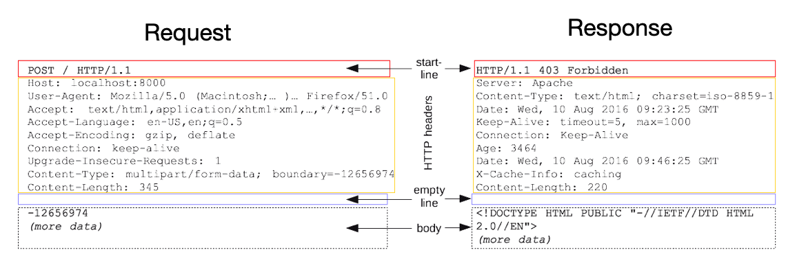

---


## HTTP 소개

HTTP(HyperText Transfer Protocol)에 대해 알아보자.

요즘 대부분의 통신은 HTTP를 통해서 이루어진다.

* HTML, text
* 이미지, 음성, 영상 파일
* **JSON, XML (API)**
* 거의 모든 형태의 데이터 전송 가능
* 서버간 데이터를 주고 받을 때도 많은 경우 HTTP 사용
* TCP를 직접 이용해서 연결하는 경우는 게임서버와 같은 특수한 경우

<br>

현재 대부분 HTTP/1.1을 사용한다

* HTTP/1.0 이하
* HTTP/1.1
  * 가장 많이 사용
  * 기반 프로토콜 : TCP


* HTTP/2
  * 성능 개선
  * 기반 프로토콜 : TCP


* HTTP/3
  * 성능 개선
  * 기반 프로토콜 : UDP

<br>

HTTP의 특징은 다음과 같다.

* 클라이언트-서버 구조
* Stateless protocol(무상태 프로토콜)
* 비연결성(connectionless)
* HTTP 메세지를 이용해서 통신
* 단순하고 확장 가능

<br>

---

## 클라이언트-서버(Client - Server)

HTTP는 기본적으로 클라이언트-서버 구조를 따른다.

* request response (요청-응답) 구조
* 클라이언트는 서버에 요청을 보내고 응답을 대기한다
* 서버는 받은 요청에 대한 결과를 만들어서 응답을 보낸다
* 비즈니스 로직은 오로지 서버만 다룬다

<br>

---

## 무상태(Stateless)

HTTP는 무상태(stateless) 프로토콜을 지향한다. Stateless(무상태)와 Stateful(상태유지)에 대해서 알아보자.

Stateless라는 것은 다음과 같다.

* **서버가 클라이언트의 상태를 보존하지 않는다**
* 장점 : 서버의 확장성이 높다(scale-out)
* 단점 : 클라이언트가 추가 데이터를 전송해야 한다

<br>

Stateless와 Stateful에 대해 예시를 이용해서 알아보자.

고객이 마트에 가서 노트북을 구매하는 상황이라고 가정하자.

1. 
   * 고객 : 이 **품목 : 노트북** 얼마인가요?
   * 점원A : 100만원 입니다. (**품목: 노트북 상태유지**)
2. 
   * 고객 : **수량 : 2개**를 구매하겠습니다.
   * 점원A : 200만원 입니다. **수단 : 신용카드, 현금**중 어느 걸로 구매 하시겠어요?(**품목 : 노트북, 수량 : 2개 상태 유지**)
3. 
   * 고객 : **수단 : 신용카드**로 구매하겠습니다.
   * 점원A : 200만원 결제 완료되었습니다. (**품목 : 노트북, 수량 : 2개, 수단 : 신용카드 상태 유지**)

<br>

위의 예시에서 볼 수 있듯이 점원은 고객과의 대화에서 이전 대화의 문맥(context)을 알고 있다. 이것이 상태유자(stateful)이다.

다음은 무상태(stateless)에 대한 예시이다.

<br>

1. 
   * 고객 : 이 **품목 : 노트북** 얼마인가요?
   * 점원A : 100만원 입니다.
2. 
   * 고객 : **품목 : 노트북**을 **수량 : 2개** 구매하겠습니다.
   * 점원B : 200만원 입니다. **수단 : 신용카드, 현금**중 어느 걸로 구매 하시겠어요?
3. 
   * 고객 : **품목 : 노트북** **수량 : 2개**를 **수단 : 신용카드**로 구매하겠습니다.
   * 점원C : 200만원 결제 완료되었습니다.

<br>

무상태의 경우 이전 상황에 대한 문맥을 유지하지 않는다. 점원이 계속 바뀌는 상황이라고 볼 수 있다. 점원끼리 서로 내용을 공유하지 않는 이상 고객이 이전 점원과 했던 내용을 알수 없다. 그래서 고객은 새로운 점원을 만날때 마다 이전의 내용(context)를 전부 포함해서 구매를 진행하고 있다. 

<br>

그러면 상태유지에서 점원이 바뀌면 어떻게 될까? 점원은 당연히 이전의 대화 내용을 모르기 때문에 구매의 진행이 불가능 하다. 반면에 stateless에서는 고객이 점원이 바뀔때 마다 필요한 정보를 다 주기 때문에 구매의 진행이 가능하다.

<br>

정리하자면 다음과 같다.

* **Stateful(상태 유지)** : 중간에 다른 점원으로 바뀌면 안된다
  * 만약에 바뀐다면 해당 대화 내용(상태 정보, context)를 다음 점원에게 미리 알려줘야 한다


* **Stateless(무상태)** : 중간에 다른 점원으로 바뀌어도 OK
  * 이런 경우의 장점은 갑자기 고객이 증가해도 새로운 점원들을 대거 투입 가능하다
  * → 갑자기 클라이언트 요청이 증가해도 서버를 대거 투입 가능하다
  * 쉽게 말해서 무상태에서는 응답 서버를 쉽게 바꾸는 것이 가능하다 → 서버 증설이 쉽다

<br>


<p align='center'>Stateless</p>

<br>

이렇게 좋아보이는 stateless도 한계가 존재한다.

* 무상태로 설계가 불가능한 경우도 존재한다
* 무상태(stateless)
  * 예) 로그인이 필요 없는 단순한 서비스 소개 화면
  * 무상태의 단점은 상태 유지에 비해서 데이터를 너무 많이 보내야하는 경우들이 발생한다


* 상태유지(stateful)
  * 예) 로그인


* 로그인한 사용자의 경우 로그인 했다는 상태를 서버에 유지

<br>

일반적으로 상태유지가 필요한 경우 브라우저 쿠기, 서버 세션, 등을 사용해서 상태 유지를 한다. 상태 유지는 최소한만 사용하는 것이 좋다.

<br>

---

## 비연결성(Connectionless)

비연결성(connectionless)에 대해서 알아보자.

만약 클라이언트와 서버가 연결을 계속 유지하는 모델이면 어떤 일이 일어날까? 클라이언트 1,2,3이 서버와 연결한 상황이라고 가정하자.


<p align='center'>연결 유지</p>

* 서버가 계속 연결을 유지하기 때문에 서버는 자원을 지속적으로 소모한다

<br>

그럼 클라이언트와 서버가 연결을 유지하지 않는 모델은 어떨까?


<p align='center'>Connectionless</p>

* HTTP는 기본이 연결을 유지하지 않는 모델이다
* 일반적으로 초 단위 이하의 빠른 속도로 응답


* 예) 1시간 동안 수천명이 서비스를 사용해도 실제 서버에서 동시에 처리하는 요청은 수십개 이하로 적다
  * 이유 : 사용자가 웹 브라우저에서 계속 연속해서 검색 버튼을 누리지는 않는다


* 서버 자원을 연결 유지에 비해서 효율적으로 사용할 수 있다

<br>

이런 비연결성(connectionless) 방식도 한계가 존재한다.

* TCP/IP 연결을 새로 맺어야 한다 (three way handshake에 대한 시간 추가)
* 웹 브라우저로 사이트를 요청하면 HTML 뿐만 아니라 Js, css, 추가 이미지 등 수 많은 자원이 함께 다운로드된다

<br>

이런 단점을 극복하기 위해서 지금은 HTTP **지속 연결(persistent connection)로 문제를 해결**하고 있다. 

이런 HTTP의 커넥션 관리에 대해서 조금 더 자세히 알아보자.

<br>


<p align='center'>HTTP 커넥션 관리</p>

* 초기의 HTTP는 단기 커넥션(short-lived connection)을 이용했다 
  * 각각의 HTTP 요청이 직렬화(serialized)된 형태로 연결과 종료를 맺는다
    * 쉽게 말해서, 요청이 생길때 마다 TCP handshake를 이용해서 연결을 맺고 종료하는 것을 반복 했음
  * 이는 매우 비효율적이다
  * HTTP 1.0 에서 쓰던 방식


* **현재 HTTP는 지속 연결(persistent connection)을 이용한다**
  * 특정 시간 동안 연결을 유지해서 새로운 handshake를 할 필요 없이 요청과 응답이 진행된다
    * 특정 시간은 내부 메커니즘 마다 다름
  * HTTP 2,3 은 이를 더 효율적으로 개선 했음
    * HTTP pipelining, multiplexing 

<br>

---

## HTTP Message

이전에도 봤던 HTTP 요청 메세지와 응답 메세지에 대해서 알아보자.



<p align='center'>요청과 응답 메세지의 구조</p>

* 요청 메세지도 body 본문을 가질 수 있음

<br>

HTTP 메세지의 공식 스펙은 다음과 같다. (rfc7230)

```
HTTP-message = start-line
							 *( header-field CRLF)
							 CRLF
							 [ message-body ]
```

<br>

HTTP 메세지의 구성 요소를 더 자세히 살펴보자.

```
GET /search?q=hello&hl=ko HTTP/1.1
Host: www.google.com
```

<br>

* **요청 시작 라인(start-line)**
  * ```start-line = request-line / status-line```
  * 요청 메세지의 경우 ```request-line```
  *  ```request-line = method 공백 request-target 공백 HTTP-version CRLF```
  * HTTP 메서드(이후 포스트인 [HTTP Method]() 참고)
    * GET, POST, PUT, DELETE...
    * 서버가 수행해야 할 동작을 지정한다
      * GET : 리소스 조회
      * POST : 요청 내역 처리
  * 요청 대상(request-target)
    * ```절대경로[?query]```
    * ```/```로 시작하는 경로
  * HTTP Version
    * 많은 경우 HTTP 1.1

<br>

```
HTTP/1.1 200 OK
Content-Type: text/html;charset=UTF-8
Content-Length: 3423

<html>
	<body>...</body>
</html>
```

<br>

* **응답 시작 라인**
  * 응답 메세지의 경우 ```status-line```
  * ```status-line = HTTP-version 공백 status-code 공백 reason-phrase CRLF```
  * HTTP version
  * HTTP 상태코드(status-code) : 요청 성공, 실패 등의 상태를 나타냄
    * 200 : 성공
    * 400 : 클라이언트 요청 오류
    * 500 : 서버 내부 오류
  * 이유 문구(reason phrase)
    * 짧은 상태 코드 설명 글
    * 예) 200 OK → OK는 대충 성공이라는 뜻

<br>

* **HTTP 헤더**
  * ```header-field = field-name : OWS field-value OWS```
    * OWS(optional whitespace) : 띄어쓰기 허용
  * HTTP 헤더의 용도는 HTTP 전송에 필요한 모든 부가정보를 제공하기 위함
    * 예) 메세지 바디의 내용, 크기, 압축, 인증, 요청 클라이언트 정보, 캐시 관리 정보, 등...
  * 필요시 임의의 헤더 추가 가능
  * 이후 [HTTP Header]() 포스트 참고

<br>

* **HTTP 메세지 바디**
  * 실제 전송할 데이터가 들어감
  * 예) HTML, 이미지, 영상, JSON 등.. byte로 표현할 수 있는 모든 데이터를 전송 가능

---

## Reference

1. [인프런 - 모든 개발자를 위한 HTTP 웹 기본 지식](https://www.inflearn.com/course/http-%EC%9B%B9-%EB%84%A4%ED%8A%B8%EC%9B%8C%ED%81%AC/dashboard)
2. [널널한 개발자 - 네트워크 기초](https://www.youtube.com/watch?v=k1gyh9BlOT8&list=PLXvgR_grOs1BFH-TuqFsfHqbh-gpMbFoy)
3. HTTP 완벽 가이드
4. 네트워크 하향식 접근(Computer Networking a Top-Down Approach)
