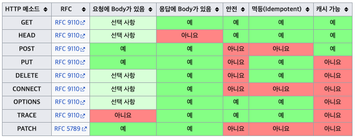

---

## HTTP API 설계 소개

HTTP API를 설계 해보면서 HTTP 메서드에 대해 알아보자.

회원 정보 관리 API를 설계한다고 해보자. 요구 사항은 다음과 같을때, 해당 요구 사항에 맞게 이름을 한번 지어보자.

* 회원 목록 조회 /read-member-list
* 회원 조회 /read-member-by-id
* 회원 등록 /create-member
* 회원 수정 /update-member
* 회원 삭제 /delete-member

<br>

위와 같이 URI를 설계하는 것은 좋은 설계일까? **URI를 설계할 때 가장 중요한것은 리소스(resource)의 식별**이다. 리소스의 의미에 대해 생각해보자.

* 리소스의 의미
  * 회원 등록, 수정, 조회하는 것이 리소스가 아니다
  * 회원이라는 개념 자체가 리소스이다

<br>

그러면 이런 리소스를 어떻게 식별하는 것이 좋을까?

* 등록, 수정, 조회하는 것을 모두 배제한다
* 회원이라는 리소스만 식별 → **회원 리소스 자체를 URI에 매핑한다**

<br>

그러면 일단 URI에 적용해보자.

* 회원 목록 조회 /members
* 회원 조회 /members/{id}
* 회원 등록 /members/{id}
* 회원 수정 /members/{id}
* 회원 삭제 /members/{id}

<br>

이때 많은 경우 난감할 것이다. 왜냐하면 회원 조회, 등록, 수정, 삭제를 구분할 수 없기 때문이다. 여기서 HTTP 메서드가 중요한 역할을 한다.

* **URI로 리소스만 식별한다**
* 리소스와 해당 리소스를 사용하는 행위를 분리 해야한다
  * 리소스 : 회원(members)
  * 행위 : 조회, 등록, 수정, 삭제
* **이 행위를 HTTP 메서드를 이용해서 구분하는 것이다!**

<br>

> 리소스라고 사용은 했지만, 최근에는 Representation이라는 표현을 사용한다.
>
> REST API → Representational State Transfer API

<br>

---

## GET, POST

* ```GET``` : 리소를 조회
* ```POST``` : 요청 데이터 처리, 주로 등록에 사용

```PUT```, ```PATCH```. ```DELETE```은 뒤에서 더 자세히 알아볼 예정. 

<br>

### GET

* 리소스 조회
* 서버에 전달하고 싶은 데이터는 쿼리(query string)를 통해서 전달
* 메세지 바디를 이용해서 데이터를 전달할 수 있지만, 권장하지 않는다 (쉽게 말해서 GET 요청은 페이로드를 담지 말아라)

<br>


<p align='center'>GET 요청</p>

<br>

---

### POST

* 요청 데이터 처리
* 메세지 바디를 통해 서버로 요청 데이터 전달


* 서버는 요청 데이터를 처리
  * 메세지 바디를 통해 들어온 데이터를 처리하는 모든 기능을 수행한다


* 주로 전달된 데이터로 신규 리소스 등록, 프로세스 처리에 사용한다
  * 예) 회원 가입에 필요한 데이터 전달 → 서버는 받은 데이터로 회원 가입을 처리(수행)


* 신규 리소스의 식별자는 서버가 생성한다
  * 예) ```/members``` → ```/members/100``` : 100이라는 식별자는 서버에서 부여한다


<br>


<p align='center'>POST 요청</p>

<br>

```POST```의 요청 데이터를 처리한다는 것은 정확히 어떤 뜻일까?

* POST specification(스펙) 

  * > The ```POST``` method requests that the [target resource](https://www.rfc-editor.org/rfc/rfc9110#target.resource) process the representation enclosed in the request according to the resource's own specific semantics. (rfc9110)

  * ```POST``` 메서드는 대상 리소스(representation)가 리소스 고유한 의미 체계에 따라 요청에 포함 된 표현을 처리하도록 요청한다 

<br>

예를 들자면 다음과 같은 기능에 사용한다.

* Providing a block of data, such as the fields entered into an HTML form, to a data-handling process;
  * HTML 폼에 입력 된 필드와 같은 데이터 블록을 데이터 처리 프로세스에 제공
  * 예) HTML form에 입력한 정보로 회원 가입, 주문 등에 사용


* Posting a message to a bulletin board, newsgroup, mailing list, blog, or similar group of articles;
  * 게시판, 뉴스, 메일링 리스트, 블로그 또는 유사한 뉴스 그룹에 메세지 게시
  * 예) 게시판 글쓰기, 댓글 달기


* Creating a new resource that has yet to be identified by the origin server;
  * 서버가 아직 식별하지 않은 새 리소스 생성
  * 예) 신규 주문 생성


* Appending data to a resource's existing representation(s).
  * 기존 자원에 데이터 추가
  * 예) 한 문서 끝에 내용 추가하기

<br>

결론적으로 리소스 URI에 POST 요청이 오면 요청 데이터를 어떻게 처리할지 리소스 마다 정해야 한다.

POST를 사용하는 경우를 정리해보면 다음과 같다.

* 새 리소스 등록(생성)


* 요청 데이터를 처리
  * 단순히 데이터를 생성, 변경하는 것을 넘어서 **특정 프로세스를 처리해야 하는 경우**
    * 예) 주문 : 결제완료 → 배달시작 → 배달완료 처럼 단순히 값 변경을 넘어 프로세스의 상태가 변경되는 경우
  * POST의 결과로 새 리소스가 생성되지 않을 수도 있음
    * 어쩔 수 없이 리소스만으로 설계가 안되기 때문에 행위를 포함해서 URI를 설계하는 경우도 있다
    * 예) ```POST /orders/{orderId}/start-delivery``` **(컨트롤 URI)**


* 다른 메서드로 처리하기 애매한 경우
  * 예) JSON으로 조회 데이터를 넘겨야 하는데 GET 메서드를 사용하기 어려운 경우
  * 웬만해서 애매하면 POST 사용하면 됨

<br>

---

## PUT, PATCH, DELETE

* ```PUT``` : 리소스를 대체, 해당 리소스가 없다면 생성
* ```PATCH``` : 리소소를 부분 변경
* ```DELETE``` : 리소스 삭제

이외에도 ```HEAD```, ```OPTIONS```, ```CONNECT```, ```TRACE``` 등의 HTTP 메서드도 존재한다.

<br>

조금 더 자세히 알아보자.

1. ```PUT```
   * 리소스를 대체
     * 리소스가 존재하면 완전히 대체
       * 기존의 것을 완전히 지우고 생성
     * 리소스가 없으면 생성
     * 덮어버린다고 생각하면 쉬움
     * 예) ```PUT /members/100``` 으로 요청을 넣는 경우 존재하면 완전히 대체하고, 없다면 새로 생성한다
   * **클라이언트가 리소스를 식별한다**
     * 클라이언트가 리소스 위치를 알고 URI 지정한다
     * ```POST```에서는 리소스 위치를 몰라도 됨


2. ```PATCH```
   * 리소스 부분 변경
   * ```PUT```과는 다르게 리소스의 필드를 부분적으로 변경할 수 있다
   * ```PATCH```를 지원하지 않는 서버의 경우 그냥 ```POST```를 사용하면 됨


3. ```DELETE```
   * 리소스 제거

<br>

---

## HTTP 메서드의 속성

HTTP 메서드의 속성에 대해서 알아보자.



<p align='center'>https://ko.wikipedia.org/wiki/HTTP</p>

<br>

---

### 안전(Safe)

* HTTP 메서드가 서버의 상태를 변경하지 않으면 그 메서드는 안전하다


* 쉽게 말해서, 호출해도 리소스를 변경하지 않으면 안전하다
  * ```GET```은 안전함
  * ```POST```, ```PUT```, ```PATCH```, ```DELETE``` 같은 메서드는 안전하지 않음


* 안전하다는 것은 멱등성(Idempotency)을 보장하지만, 그 반대는 아니다

<br>

---

### 멱등성(Idempotency)

* 동일한 요청을 한 번 보내는 것과 여러 번 연속으로 보내는 것이 같은 효과를 지니고, 서버의 상태도 동일하게 남을 때, 해당 HTTP 메서드는 멱등(Idempotent)하다
* **쉽게 말해서 한 번 호출하든, 100번 호출하든 결과가 똑같아야 멱등하다**고 할 수 있다
* 멱등 메서드는 통계기록을 제외하면 어떠한 부수효과(side-effect)를 가져선 안된다


* **멱등은 외부 요인으로 인해 중간에 리소스가 변경되는 것 까지 고려하지는 않는다**
  * 예) 잔액을 조회했을 때 10000원 조회 → 다른 사람이 10000원 이체 → 다시 조회하면 20000원


* 멱등 메서드
  * ```GET``` : 한 번 조회하든, 100번 조회하든 같은 결과가 조회된다
  * ```PUT``` : 결과를 대체한다. 같은 요청을 여러번 해도 최종 결과는 똑같다
  * ```DELETE``` : 결과를 삭제한다. 같은 요청을 여러 번 해도 삭제된다는 결과는 똑같다


* 멱등하지 않은 메서드
  * ```POST``` : 두 번 호출하면 같은 결제가 중복해서 발생할 수 있다.

<br>

---

### 캐시 가능(Cacheable)

* 한 응답은 캐시할 수 있는 HTTP 응답으로, 나중에 검색하고 사용하기 위해 저장하여 새 요청을 서버에 저장한다
  * 모든 HTTP 응답을 캐시할 수 있는 것은 아니다


* **쉽게 말해서 응답 결과 리소를 캐시해서 사용해도 되는지에 대한 여부이다**
  * 예) 이미지를 요청 → 다시 요청하는 것은 비효율적이기 때문에 브라우저에서 이미지 저장(캐시)해서 사용


* ```GET```, ```HEAD```, ```POST```, ```PATCH``` 캐시 가능
* **실제로는** ```GET```, ```HEAD``` **정도만 캐시로 사용한다**
  * 캐시를 사용하기 위해서 
  * ```POST```, ```PATCH```는 본문 내용까지 캐시 키로 고려해야한다 → 구현이 쉽지 않다다


* 캐시에 대한 것은, [캐시에 대한 포스트]() 참고

<br>

---

## HTTP 메서드의 활용

HTTP 메서드는 어떤식으로 활용되는지, 다음의 경우에 대해서 알아보자.

* 클라이언트에서 서버로 데이터 전송
* HTTP API 설계

<br>

---

### 클라이언트 → 서버 데이터 전송

데이터 전달 방식을 크게 2가지로 나눌 수 있다.

* 쿼리를 통한 데이터 전송
  * ```GET```
  * 주로 정렬 필터(검색어)


* 메세지 바디를 통한 데이터 전송
  * ```POST```, ```PUT```, ```PATCH```
  * 리소스 등록, 리소스 변경
    * 예) 회원 가입, 상품 주문

<br>

그러면 클라이언트에서 서버로 데이터 전송을 하는 몇가지 상황에 대해서 알아보자.

1. **정적 데이터 조회**
   * 이미지, 정적 텍스트(문서) 같은 데이터를 조회하는 경우
   * 쿼리 파라미터 미사용
   * ```GET /static/star.jpg HTTP1.1```
   * 단순히 URI 경로만으로 조회가 가능하다

<br>

2. **동적 데이터 조회**
   * 검색, 게시판 목록에서 정렬 필터
   * ```GET /search?q=hello&hl=ko HTTP1.1```
   * 쿼리 파라미터 사용(쿼리를 통해 데이터를 전달)

<br>

3. **HTML Form을 통한 데이터 전송**
   * 회원 가입, 상품 주문, 데이터 변경
   * 폼에 데이터를 입력해서 전송하면```Content-Type: application/x-www-form-urlencoded```으로 보낸다
   * 데이터를 쿼리 스트링과 유사하게 서버에 전송함
   * 전송 데이터를 url encoding 처리
   * ```GET```을 이용할 수는 있지만, ```GET```을 사용하면 쿼리로 바꿔서 보냄
   * 주의 : ```GET```은 조회할 때만 사용하자!
   * 파일 전송할 때 ```Content-Type: multipart/form-data``` 사용
     * 파일 업로드와 같은 바이너리 데이터 전송시 사용한다
     * 다른 종류의 여러 파일과 폼의 내용을 함께 전송 가능하다
   * HTML Form 전송은 ```GET```, ```POST```만 지원한다

<br>

4. **HTTP API를 통한 데이터 전송**
   * 회원 가입, 상품 주문, 데이터 변경
   * server-to-server, 앱 클라이언트, 웹 클라이언트(AJAX)
   * 만약 JSON으로 데이터를 넘기고 싶으면
     * ```Content-Type: application/json```으로 넘기면 됨
     * JSON 데이터 전송
   * 서버-to-서버 (백엔드 시스템 통신)
   * 앱 클라이언트 (아이폰, 안드로이드)
   * 웹 클라이언트
     * HTML에서 폼 전송 대신 자바 스크립트를 통한 통신에 사용 (AJAX)
     * 예) React와 같은 웹 클라이언트와 API 통신
     * ```POST```, ```PUT```, ```PATCH``` : 메세지 바디를 통해 데이터 전송
     * ```GET``` : 조회, 쿼리로 데이터 전달
     * ```Content-Type: application/json``` 을 사실상 표준(Defacto)으로 사용

<br>

---

### HTTP API 설계

HTTP API 설계 예시를 통해 HTTP 메서드 활용을 알아보자.

이전의 [HTTP API 설계 소개]()에서 사용한 예시를 그대로 사용해보자. 회원 관리 시스템의 API를 설계하는 것이다.

* 회원 목록 조회 /members → ```GET```
* 회원 조회 /members/{id} → ```GET```
* 회원 등록 /members/{id} → ```POST```
* 회원 수정 /members/{id} → ```PATCH, PUT, POST``` 
  * 어떤 메서드를 사용할 것인지 고민해야 한다
  * 회원 수정의 경우 ```PATCH```를 사용하는 것이 베스트
  * 애매하면 ```POST```
* 회원 삭제 /members/{id} → ```DELETE```

<br>

리소스를 식별하고 행위는 HTTP 메서드를 통해서 구분한다!

<br>

---

#### POST - 신규 자원 등록

```POST```를 이용한 신규 자원 등록의 특징은 다음과 같다.

* 클라이언트는 등록될 리소스의 URI를 모른다

  * 회원 등록 ```/members``` 에서 ```POST``` 메서드 사용
  * ```POST /members``` (클라이언트에서 어떤 식별자를 부여하는 것이 아님)


* 서버가 새로 등록된 리소스 URI를 생성해준다

  * ```
    HTTP/1.1 201 Created 
    Location: /members/100
    ```

  * 서버에서 식별자 ```100```을 부여


* Collection

  * 서버가 관리하는 리소스 디렉토리
  * 서버가 리소스의 URI를 생성하고 관리한다
  * 예) ```/members```가 컬렉션에 해당

<br>

---

#### PUT - 신규 자원 등록

```PUT``` 기반의 등록을 살펴보자. 여기서는 파일 관리 시스템의 API를 설계한다고 가정해보자.

* 파일 목록 /files → ```GET```
* 파일 조회 /files/{filename} → ```GET```
* 파일 등록 /files/{filename} → ```PUT```
* 파일 삭제 /files/{filename} → ```DELETE```
* 파일 대량 등록 /files → ```POST```

<br>

이 경우에는 파일을 등록할 때 ```PUT```을 사용한다. ```PUT```의 특징은 기존 리소스를 완전히 대체한다는 것이다. 파일 업로드의 경우 기존 파일을 지우고 다시 업로드하기 때문에 ```PUT```이 알맞다.

```PUT```를 이용한 신규 자원 등록의 특징은 다음과 같다.

* 클라이언트가 리소스 URI를 알고 있어야 한다.
  * 파일 등록 /files/{filename} → ```PUT```
  * ```PUT /files/star.jpg```


* 클라이언트가 직접 리소스의 URI를 지정한다


* Store
  * 클라이언트가 관리하는 리소스 저장소
  * 클라이언트가 리소스의 URI를 알고 관리
  * 예) ```/files```가 스토어 해당

<br>

> 대부분의 경우에는 ```POST``` 기반을 사용한다.

<br>

---

#### HTML Form 사용

* ```GET, POST```만 지원
  * 제약이 있음
* AJAX 같은 기술을 사용해서 해결은 가능
* 현재의 예시에서는 순수히 HTML Form만 사용하는 경우를 다룬다

<br>

그러면 회원 등록에서 HTML 폼을 사용하는 경우의 API 설계를 한다고 가정해보자.

* 회원 목록 /members → ```GET```
* 회원 조회 /members/{id} → ```GET```
* 회원 등록 폼 /members/new → ```GET``` (폼을 가져오는 경우)
* 회원 등록 /members/new → ```POST``` (실제로 등록하는 경우)
* 회원 수정 폼 /members/{id}/edit → ```GET```
* 회원 수정 /members/{id}/edit → ```POST```
* 회원 삭제 /members/{id}/delete → ```POST```

<br>

위의 예시에서 볼 수 있듯이 HTML Form은 ```GET, POST```만 사용 가능하기 때문에 제약이 있다. 이런 제약을 해결하기 위해서 **컨트롤 URI를 사용**한다. 

*  **컨트롤 URI**(Control URI)
  * ```POST```의 ```/new, /edit, /delete```
  * 동사로 된 리소스 경로를 사용하는 것
  * HTTP 메서드로 해결하기 어렵거나 애매한 경우에 사용한다(HTTP API 포함)

<br>

> 참고하면 좋은 URI 설계 개념 : [https://restfulapi.net/resource-naming/](https://restfulapi.net/resource-naming/)

---

## Reference

1. [인프런 - 모든 개발자를 위한 HTTP 웹 기본 지식](https://www.inflearn.com/course/http-%EC%9B%B9-%EB%84%A4%ED%8A%B8%EC%9B%8C%ED%81%AC/dashboard)
2. [널널한 개발자 - 네트워크 기초](https://www.youtube.com/watch?v=k1gyh9BlOT8&list=PLXvgR_grOs1BFH-TuqFsfHqbh-gpMbFoy)
3. HTTP 완벽 가이드
4. 네트워크 하향식 접근(Computer Networking a Top-Down Approach)