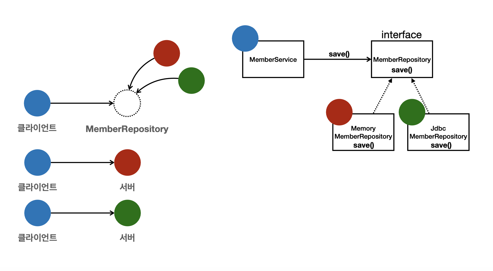

---

## 1. 객체 지향 설계(Object Oriented Design)

**SOLID**란 객체 지향 설계의 5가지 원칙이다. 각 원칙은 다음과 같다.

1. Single Responsibility Principle(SRP) : 단일 책임 원칙
1. Open Close Principle(OCP) : 개방 폐쇄 원칙
1. Liskov Substitution Principle(LSP) : 리스코프 치환 원칙
1. Interface Segragation Principle(ISP) : 인터페이스 분리 원칙
1. Dependency Inversion Principle(DIP) : 의존관계 역전 원칙

<br>

---

### 1.1 SRP (단일 책임 원칙)

* **하나의 클래스는 하나의 책임만 가진다**
* 책임이라는 것은 무엇일까?
* 이 **책임의 범위라는 것은 문맥과 상황에 따라 다를 수 있다** → 적절히 밸런스를 맞추는 것이 중요
* 어떤 변경이 있을 때 파급 효과가 적다면 SRP를 잘 따른 것
  * 예) 객체의 생성과 사용의 분리

책임의 범위라는 것을 예를 들어 설명하자면, ```Shape```라는 클래스가 존재한다고 하자.

```python
# 이번 예시는 파이썬 사용
class Shape:
    def draw(self):
        # draw the shape

    def resize(self):
        # resize the shape

    def calculate_area(self):
        # calculate the area of the shape
```

```Shape``` 라는 클래스는 ```draw```, ```resize``` 등 여러가지 메서드를 통해 여러 작업이 가능하기 때문에, 좁은 범위의 SRP에서는 위의 클래스는 SRP를 위반하는 것일 수 있다. 그러나 넓은 범위로 SRP를 해석하는 경우, ```Shape```라는 클래스는 어떤 모양(도형)을 나타내고 조정하는 하나의 단일 책임을 나타내기 때문에 SRP를 잘 따른다고 볼 수도 있는 것이다.

이 처럼 SRP에서 책임의 범위를 상황에 따라 잘 정해서, 특정 변경이 있을 때 파급 효과가 적도록 설계한다면 SRP를 잘 따른다고 생각하면 편하다.

<br>

---

### 1.2 OCP (개방 폐쇄 원칙)

* **소프트웨어 요소는 확장에 열려있으나 변경에는 닫혀 있어야 한다**
* 새로운 기능이나 요소를 추가할 때 기존의 코드 변경 없이 추가가 가능해야 한다 
* 다형성을 활용하면 된다!
  * 다형성을 통해서 클라이언트를 변경하지 않고 서버의 구현된 기능을 유연하게 변경 가능해야 한다
* 인터페이스를 구현한 새로운 클래스를 만들어서 새로운 기능을 구현하거나 추가한다
* 역할과 구현의 분리를 생각하면 된다 (물론 이것만으로 OCP를 지켰다고 볼 수는 없다)
  * 예) 역할 : 도형 / 구현 : 원, 사각형, 삼각형 등
  * 역할과 구현의 분리를 위해서 인터페이스를 안정적으로 잘 설계하는 것이 중요하다

<br>

이전의 [Spring 소개](https://github.com/seungki1011/Data-Engineering/blob/main/spring/notes/(001)Spring%20Introduction.md)에서의 [회원 관리 기능 예제](https://github.com/seungki1011/Data-Engineering/blob/main/spring/notes/(001)Spring%20Introduction.md#4-%ED%9A%8C%EC%9B%90-%EA%B4%80%EB%A6%AC-%EA%B8%B0%EB%8A%A5-%EA%B0%9C%EB%B0%9C-i)에서 레포지토리의 인터페이스를 바탕으로 클래스를 구현해서 갈아 끼우듯이 사용한 것을 떠올려보자. 

```java
public class MemberService {
    // private MemberRepository memberRepository = new MemoryMemberRepository(); // 기존 코드
    private MemberRepository memberRepository = new JDBCMemberRepository(); // 새로운 코드로 변경
    /*
     * ...
     */
}
```



<p align='center'>인프런 - 스프링 핵심 원리 : 기본편</p>

위의 경우에 다형성을 사용했지만 OCP 원칙을 완변히 지켰다고 볼 수는 없다. 왜냐하면 ```MemberService``` 클라이언트가 구현 클래스를 직접 선택하고 있기 때문이다. 구현 객체를 변경하기 위해서는 클라이언트 코드를 변경해야하는 경우 인것이다. 이 **문제를 해결하기 위해서는 객체를 생성하고, 연관관계를 맺어주는 별도의 조립, 설정자가 필요하다.** (이것을 해결하기 위해 스프링의 DI, IoC 컨테이너 등을 사용한다고 볼 수 있다) 

<br>

---

### 1.3 LSP (리스코프 치환 원칙)

* 프로그램의 객체는 프로그램의 정확성을 깨드리지 않으면서 하위 타입의 인스턴스로 바꿀 수 있어야 한다
  * objects of a superclass should be able to be replaced with objects of a subclass without affecting the correctness of the program
  * in simpler terms, if a class is a subtype of another class, it should be usable wherever its parent class is used


* LSP를 지킨다는 것은 다형성에서 하위 클래스는 인터페이스 규약을 다 지켜야 한다는 것
  * 예) 자동차 인터페이스의 엑셀 기능은 앞으로 가는 기능이다, 만약에 엑셀을 통해서 뒤로 갈 수 있도록 구현을 하게되면 LSP를 위반한 것임


* 인터페이스를 구현한 구현체를 믿고 사용하기 위한 원칙이라고 볼 수 있음

<br>

---

### 1.4 ISP (인터페이스 분리 원칙)

* 자신이 사용하지 않는 메서드에 의존하지 않는다
  * 쉽게 말해서 클래스는 사용하지 않을 인터페이스는 구현하지 않아야 한다는 원칙이다


* 특정 클라이언트를 위한 인터페이스 여러개가 범용적인 인터페이스 하나보다 낫다
  * 예) 자동차 인터페이스 → 운전 인터페이스, 정비 인터페이스 등으로 분리
  * 예) 사용자 클라이언트 → 운전자 클라이언트, 정비사 클라이언트 등으로 분리
  * 인터페이스를 분리하면 정비 인터페이스 자체가 변해도 운전자 클라이언트에 영향을 주지 않음


* 분리하면 인터페이스가 명확해지고, 대체 가능성이 높아진다

<br>

ISP 원칙이라는 것은 결국 인터페이스가 너무 광범위하면 인터페이스를 구현하는 클래스들이 사용하지도 않을 메서드를 오버라이딩 해야하는 상황이 발생한다. 이를 방지하기 위해서 인터페이스는 지나치게 많은 기능을 구현하면 안되고, 인터페이스를 사용하는 객체 기준으로 적당히 분리되어야 한다.

<br>

---

### 1.5 DIP (의존관계 역전 원칙)

* 추상화에 의존 해야하고, 구체화에 의존하면 안된다 → 의존성 주입은 이 원칙을 따르는 방법 중 하나다


* 쉽게 이야기해서 구현 클래스에 의존하지 말고 인터페이스에 의존하라는 뜻이다
  * 클라이언트가 인터페이스에 의존해야 유연하게 구현체를 변경할 수 있다


* 역할과 구현에서 "역할"을 바라보고 의존해야 한다는 것 

<br>

이전의 **OCP**에서 사용한 예시를 가져와보자.

```java
public class MemberService {
    // private MemberRepository memberRepository = new MemoryMemberRepository(); // 기존 코드
    private MemberRepository memberRepository = new JDBCMemberRepository(); // 새로운 코드로 변경
    /*
     * ...
     */
}
```

<br>

```MemberService```는 ```MemoryMemberRepository```에 대해 알고 있다. 알고 있다는 것은 의존한다는 것과 같다. 이것은 **DIP 원칙을 위반**한다는 뜻. ```MemberRepository```만 의존해야하는데, 그 구현체인 ```MemoryMemberRepositor```와 ```JDBCMemberRepository```에도 의존하고 있다. 

<br>

---

### 1.6 요약

* 객체 지향의 핵심은 다형성
* 다형성만 가지고 구현 객체를 변경할 때 클라이언트 코드도 함께 변경된다
* **다형성만으로 OCP, DIP 원칙을 지킬 수 없다** 

<br>

다형성외에 추가적으로 필요한 요소를 스프링에서 찾아보자.

<br>

---

### 1.7 객체 지향 설계와 스프링

스프링은 결국 의존성 주입(DI)와 DI 컨테이너 등의 기술을 지원해서 **다형성에 OCP, DIP를 가능하게 해준다**. 이를 통해 스프링을 이용하면 클라이언트 코드의 변경 없이 기능 확장이 가능하다. 

<br>

스프링이 나오게 된 배경은 결국 다음과 같다.

* 순수하게 자바로만 OCP, DIP 원칙을 통해 개발을 하면 너무 어려움(할 일이 너무 많음)
* 스프링 없이 OCP, DIP를 구현하려고 하면 결국에는 스프링 프레임워크(정확하게는 DI 컨테이너의 개념)를 만들어서 개발을 하게 되는 방향성으로 흘러감

<br>

> 실무에서의 고민
>
> * 인터페이스 도입에는 추상화라는 비용이 발생
> * 기능 확장의 가능성이 없다면, 구체 클래스를 직접 사용하고 향후에 필요한 경우 리팩토링해서 인터페이스를 구현하는 것도 방법
{: .prompt-tip }

<br>

---

## 2. 알아두면 좋은 것들

### 2.1 스프링, 스프링 부트(Spring, Spring Boot)

**스프링(Spring)**

- 스프링은 Java 애플리케이션을 만들기 위한 프레임워크
- 컴포넌트 관리, 데이터베이스 액세스 관리, 웹 개발 단순화, 트랜잭션 관리 등 많은 기능을 제공한다

<br>

**스프링 부트(Spring Boot)**

- 스프링 부트는 스프링으로 애플리케이션을 만드는 것을 쉽게해주는 프레임워크
- 밑바닥 부터 모든 걸 할 필요 없이 setup과 configuration의 많은 부분을 처리해줌
  - 많은 기능을 자동화 한다(데이터소스 설정, JPA 관련 설정, 등)
  - 의존성 자동 관리
- 웹 앱을 위한 템플릿 엔진 등, 여러 툴 제공

<br>

스프링 프레임워크가 자바 애플리케이션을 쉽게 만들 수 있게 도구를 많이 제공해주는 툴박스라면, 스프링 부트는 그런 스프링 프레임워크를 이용한 프로젝트를 쉽게 시작할 수 있도록 해주고 많은 기능을 자동화 시켜주는 마법같은 도구로 생각하면 편하다.

<br>

---

### 2.2 Gradle

- 빌드 자동화 툴
- 프로젝트의 dependency(의존관계) 관리, 프로젝트 빌드 등을 해준다
- `build.gradle` 파일로 설정 관리

Gradle이 Maven보다 유연하고 성능이 좋다. (요즘에는 `Gradle`을 사용해서 프로젝트를 진행하는 경우가 많다)

그래도 Maven의 사용법을 알아두는 것도 좋다.

<br>

---

### 2.3 MVC 패턴

MVC 패턴은 Model-View-Controller의 3가지 컴포넌트로 구성된 소프트웨어 디자인 패턴이다. 웹 개발의 많은 경우 이 MVC 패턴을 이용해서 개발된다. (스프링 뿐만 아니라 다른 프레임워크들도 MVC라는 명칭이 아니라도 비슷한 컨셉의 패턴을 이용해서 개발하는 경우가 많다.)

<br>


_Spring MVC Pattern_

**Model**

- 모델은 필요한 데이터가 무엇인지 정의한다

**View**

- 사용자에게 보여지는 부분을 책임진다(UI)

**Controller**

- 모델과 뷰 사이를 이어주는 중개(intermediary)의 역할
- 요청에 따라 모델/뷰를 업데이트하는 로직을 포함한다

<br>

예시를 들어보겠다.

1. 요청(Request)
   - 유저가 링크를 클릭하거나 폼을 작성하는 작업 등으로 나의 웹 애플리케이션으로 요청을 보낸다.
2. 컨트롤러(Controller)
   - 컨트롤러는 요청을 받고, 유저가 정확히 요구하는 것이 무엇인지 그리고 모델의 어느 부분이 필요한것인지 판단한다
3. 모델(Model)
   - 모델에서 필요한 데이터가 무엇인지 정의한다
4. 뷰(View)
   - 컨트롤러는 모델에서 통지 받고 뷰에서 해당 결과물을 보여준다
5. 응답(Response)
   - 마지막 결과(응답)를 유저가 받는다

<br>

---

## Reference

1. [:star:인프런 : (김영한) 스프링 완전 정복](https://www.inflearn.com/roadmaps/373)
2. [Udemy - Spring Boot 3, Spring 6 & Hibernate](https://www.udemy.com/course/spring-hibernate-tutorial/?couponCode=ST8MT40924)
3. [쉬운 코드 - 유튜브](https://www.youtube.com/@ez.)
4. [스프링 아카데미](https://spring.academy/paths/spring-certified-professional-2023)

