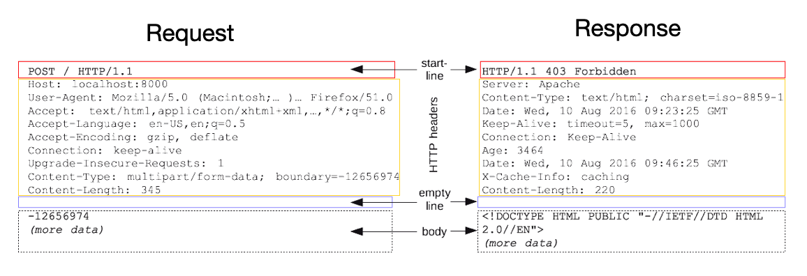
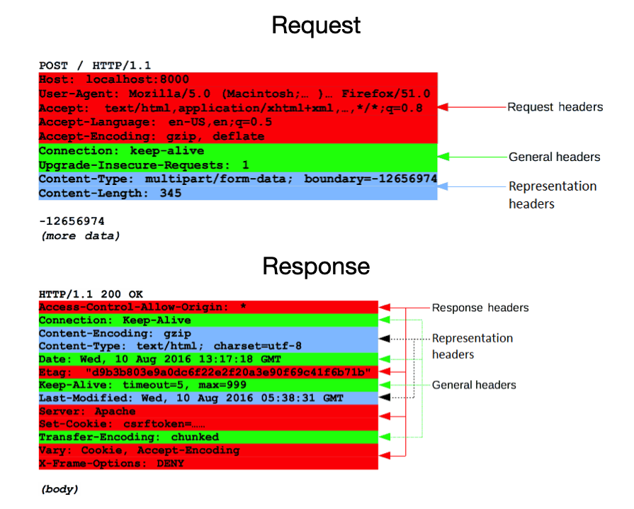

---

## HTTP 헤더 소개

이전에 봤던 HTTP 메세지에서 헤더 부분을 살펴보자.



* HTTP 헤더는 HTTP 전송에 필요한 모든 부가정보를 담고 있다
  * 예) 메세지 바디의 내용, 크기, 압축, 인증, 요청 클라이언트 정보, 캐시 관리 정보, 등
* 표준 헤더가 굉장히 많음
* 필요시 임의의 헤더도 추가 가능하다

<br>



<p align='center'>요청, 응답 메세지</p>

<br>

과거(rfc2616)의 헤더 분류와 오늘날(rfc723x)의 헤더 분류의 변화를 알아보자.

* 엔티티(entity) → 표현(representation)으로 변화
* 메세지 본문 = 페이로드(payload)
* 메세지 본문을 통해 표현(representation) 데이터를 전달
* 표현은 요청이나 응답에서 전달할 실제 데이터


* General header : 메세지 전체에 적용되는 정보
  * 예) Connection


* Request header : 요청 정보
  * 예) User-Agent


* Response header : 응답 정보
  * 예) Server


* Representation header :  표현 데이터를 해석할 수 있는 정보를 제공한다
  * 데이터 유형, 데이터 길이, 압축 정보 등

<br>

---

## 표현 헤더(Representation Header)

표현 헤더에 대해 알아보자.

* ```Content-Type``` : 표현 데이터의 형식
  * 예) text/html, application/json


* ```Content-Encoding``` : 표현 데이터의 압축 방식
  * 표현 데이터를 압축하기 위해서 사용
  * 데이터를 전달하는 곳에서 압축 후 인코딩 헤더 추가
  * 데이터를 읽는 쪽에서 인코딩 헤더를 바탕으로 압축 해제
  * 예) gzip


* ```Content-Language``` : 표현 데이터의 언어


* ```Content-Length``` : 표현 데이터의 길이 (실제로는 페이로드 헤더에 가깝다)
  * Transfer-Encoding(전송 인코딩)을 사용하는 경우 ```Content-Length``` 사용 안함


* 표현 헤더는 요청, 응답 둘다에서 사용된다

<br>

---

## 컨텐츠 협상(Content Negotiation)

콘텐츠 협상(Content negotiation)이란 동일한 URI에서 리소스의 서로 다른 버전을 제공하기 위해 사용하는 메커니즘으로, 사용자 에이전트가 사용자에게 제일 잘 맞는 것이 무엇인지(예를 들어, 문서의 언어, 이미지 포맷 혹은 컨텐츠 인코딩에 있어 어떤 것이 적절한지)를 명시할 수 있다.

쉽게 말해서 클라이언트가 선호하는 표현을 서버에게 요청하는 것이다.

* ```Accept``` : 클라이언트가 선호하는 미디어 타입 전달
* ```Accept-Charset``` : 클라이언트가 선호하는 문자 인코딩
* ```Accept-Encoding``` : 클라이언트가 선호하는 압축 인코딩
* ```Accept-Language``` : 클라이언트가 선호하는 언어
* 협상 헤더는 요청시에만 사용된다

<br>

협상에서의 우선순위에 대해서 알아보자.

* Quality Values(q) 값 사용
* 범위 : 0 ~ 1
  * 클수록 높은 우선순위를 가진다
* 생략시 1


* 예) ```Accept-Language: ko-KR, ko;q=0.9,en-US;q=0.8,en;q=0.7```
  * 우선 순위는 다음과 같다(높을 수록 먼저)
  * ```ko-KR``` : q 생략이기 때문에 q=1
  * ```ko;q=0.9```
  * ```en-US;q=0.8```
  * ```en;q=0.7```


* 항상 구체적인 것이 우선된다
  * 예) 보통 와일드 카드(*)를 사용하는 것이 제일 낮은 우선순위

<br>

---

## HTTP 전송 방식

전송방식에 대해서 알아보자.

전송방식은 다음과 같이 나눌 수 있다.

* 단순 전송
  * ```Content-Length```를 정확히 알고 있을 때, 해당 길이를 요청하고 한번에 받음
* 압축 전송
  * ```Content-Encoding```을 통해서 압축 방식을 명시하고 압축해서 받음
* 분할 전송
  * ```Transfer-Encoding```을 명시한다
  * ```Transfer-Encoding: chunked```데이터를 덩어리로 쪼개서 보냄
  * ```Content-Length```를 명시하면 안된다
* 범위 전송
  * ```Range```를 통해서 요청하고 싶은 범위를 지정
  * 응답에서 ```Content-Range``` 에 범위와 끝 길이를 알려주고 보냄

<br>

---

## 헤더 종류

### 일반 정보

이중에서 일반 정보를 포함하는 헤더들에 대해서 알아보자.

* ```From``` 
  * User-Agent의 이메일 정보
  * 잘 사용 안함
  * 검색 엔진에서 주로 사용
  * 요청에서 사용


* **`Referer`**
  * **현재 요청된 페이지의 이전 웹 페이지의 주소**
  * A → B로 이동하는 경우 B를 요청할 때 ```Referer: A```를 포함해서 요청
  * `Referer`를 사용해서 **유입 경로를 분석**할 수 있다
  * 요청에서 사용


* `User-Agent` 
  * 유저 에이전트 애플리케이션 정보(웹 브라우저 정보 등)
  * 예) `User-Agent: Mozilla/5.0 (Macintosh; Intel Mac OS X 10_15_7) AppleWebKit/537.36 Chrome/86.0.4240.183 Safari/537.36`
  * 통계 정보로 사용
  * 어떤 종류의 브라우저에서 장애가 발생했는지 파악이 가능
  * 요청에서 사용


* `Server` 
  * 요청을 처리하는 ORIGIN 서버의 소프트웨어 정보
    * 오리진 서버 : 중간에 거치는 프록시 서버들이 아니라, 실제로 요청을 처리해주는 서버
  * 예) `Server: Apache/2.2.22 (Debian)`
  * 응답에서 사용


* `Date`
  * 메세지가 생성된 날짜
  * 응답에서 사용

<br>

---

### 특별 정보

특별한 정보를 포함하는 헤더들에 대해서 알아보자.

* `Host`
  * 요청한 호스트(도메인) 정보
  * **필수**
  * 하나의 서버(하나의 IP 주소)가 여러 도메인을 처리해야 할 때가 있음
    * 만약 호스트 정보가 없다면 어느 도메인에 들어가야 할지 구분을 못함
  * 요청에서 사용


* `Location`
  * 페이지 리다이렉션에 사용
  * 201 Created의 경우 `Location` 값은 요청에 의해 생성된 리소스 URI
  * 3xx Redirection의 경우 자동 리다이렉션을 위한 대상 리소스 URI


* `Allow`
  * 허용 가능한 HTTP 메서드
  * 405(Method Not Allowed)에서 응답에 포함해야 한다
  * 예) `Allow: GET, HEAD, PUT`
  * 구현되어 있는 경우는 많지는 않음


* `Retry-After`
  * 503 (Service Unavailable)에서 서비스가 언제까지 불능인지 알려줄 수 있다

<br>

---

### 인증 정보

인증에 관한 헤더를 알아보자.

* `Authorization`
  * 클라이언트의 인증 정보를 서버에 전달
  * 인증에 관한 메커니즘은 종류가 굉장히 많음


* `WWW-Authenticate`
  * 리소스 접근시 필요한 인증 방법 정의
  * 401 Unauthorized 응답과 함께 사용

---

## Reference

1. [인프런 - 모든 개발자를 위한 HTTP 웹 기본 지식](https://www.inflearn.com/course/http-%EC%9B%B9-%EB%84%A4%ED%8A%B8%EC%9B%8C%ED%81%AC/dashboard)
2. [널널한 개발자 - 네트워크 기초](https://www.youtube.com/watch?v=k1gyh9BlOT8&list=PLXvgR_grOs1BFH-TuqFsfHqbh-gpMbFoy)
3. HTTP 완벽 가이드
4. 네트워크 하향식 접근(Computer Networking a Top-Down Approach)