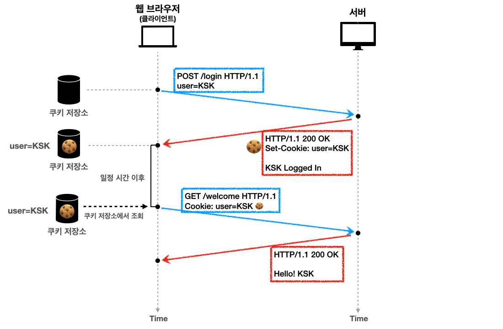

---

## 쿠키(Cookie) 소개

쿠키 헤더에 대해서 알아보자.

HTTP 쿠키(웹 쿠키, 브라우저 쿠키)는 서버가 사용자의 웹 브라우저에 전송하는 작은 데이터 조각이다. 브라우저는 그 데이터 조각들을 저장해 놓았다가, 동일한 서버에 재요청 시 저장된 데이터를 함께 전송한다. **쿠키는 두 요청이 동일한 브라우저에서 들어왔는지 아닌지를 판단할 때 주로 사용**한다. 이를 이용하면 **사용자의 로그인 상태를 유지**할 수 있다. 상태가 없는(stateless) HTTP 프로토콜에서 상태 정보를 기억시켜주기 때문이다.

<br>

우리가 이전에 다루었던 stateless를 다시 복습해보자.

* HTTP는 무상태(stateless) 프로토콜
* 클라이언트와 서버가 요청과 응답을 주고 받으면 연결이 끊어진다
* 서버는 이전 요청을 기억하지 못한다
* 클라이언트와 서버는 서로 상태를 유지하지 않는다

 <br>

* ```Set-Cookie``` : 서버에서 클라이언트로 쿠키를 전달한다(응답)
* `Cookie` : 클라이언트가 서버에서 받은 쿠키를 쿠키 저장소에 저장하고, HTTP 요청시 서버로 전달한다

<br>

쿠키는 쉽게 말해서 상태 유지를 위해 사용하는 데이터 조각이다. 서버는 쿠키를 클라이언트한테 응답으로 전송하고, 브라우저는 쿠키를 쿠키 저장소에 저장 해놓는다. 이후 상태 유지를 위해 쿠키 저장소의 쿠키를 사용할 수 있다.

<br>



<p align='center'>쿠키</p>

* 유저=KSK로 로그인하는 상황이다
  1. ```user=KSK```로 로그인 (```POST``` 요청)
  2. 서버는 ```Set-Cookie```를 통해서 ```user=KSK```이라는 정보를 쿠키에 포함 그리고 응답과 함께 전송
  3. 웹 브라우저의 쿠키 저장소에 받은 쿠키를 저장
  4. 웹 브라우저에서 서버에 요청을 보낼때 마다 쿠키를 찾아서 ```Cookie: user=KSK```를 사용해서 요청을 보낸다
     * 서버는 유저가 KSK임을 알 수 있게 된다


* 여기서 쿠키에 ```user=KSK```를 담았지만, 이건 위험한 방법임 → 세션키 등을 이용함 (뒤에서 자세히 알아보자)
* 쿠키가 있으면 모든 요청에 쿠키 정보를 자동으로 포함해서 보낸다 → 보안 문제 등을 방지하기 위해서 쿠키를 제약하는 방법들이 존재한다

<br>

쿠키에 대해서 다시한번 정리하고, 쿠키에 적용할 수 있는 제약에 대해 알아보자.

* 예) `set-cookie: sessionId=abcde1234; expires=Sat, 26-Dec-2024 00:00:00 GMT; path=/; domain=.google.com; Secure`


* 쿠키의 사용처
  * 사용자 로그인 세션 관리
  * 광고 정보 트래킹


* 쿠키의 정보는 항상 서버에 전송된다
  * 네트워크 트래픽 추가 유발한다는 단점이 있다
  * 최소한의 정보만 사용하는 것을 권장한다(세션 id, 인증 토큰)
  * 만약 요청할 때 마다 서버에 전송하지 않고 쿠키와 비슷하게 사용하고 싶으면?
    * 웹 스토리지 (localStorage, sessionStorage 참고)


* 쿠키에는 보안에 민감한 데이터를 절대 저장하면 안된다!
  * 예) 주민번호, 신용카드 정보

<br>

---

## Cookie - Expiration

쿠키의 생명주기에 대해서 알아보자. (```expires```, ```max-age```)

* ```Set-Cookie: expires=Sat, 26-Dec-@024 04;39;21 GMT``` 
  * 만료일이 되면 쿠키를 삭제한다


* ```Set-Cookie: max-age=3600``` 
  * 쿠키 수명 3600초
  * 0이나 음수를 지정하면 쿠키 삭제


* 세션 쿠키 : 만료 날짜를 생략하면 브라우저 종료시 까지만 쿠키를 유지한다
* 영속 쿠키 : 만료 날짜를 입력하면 해당 날짜까지 유지

<br>

---

## Cookie - Domain

* 예) ```domain=example.org```


* **도메인을 명시하는 경우 → 명시한 문서 기준 도메인 + 서브 도메인 포함해서 쿠키 접근**
  * ```domain=example.org```를 지정해서 쿠키 생성
    * 명시한 도메인 : ```example.org``` 
    * 서브 도메인 : ```dev.example.org``` 


* **도메인을 생략하는 경우 → 현재 문서 기준 도메인만 쿠키 접근**

<br>

---

## Cookie - Path

* 예) ```path=/home```
* 이 경로를 포함한 하위 경로 페이지만 쿠키 접근
* 일반적으로 ```path=/```로 지정


* 예) ```path=/home```
  * `/home` 가능
  * `/home/l1` 가능
  * `/home/l1/l2` 가능
  * `/hello` 불가능

<br>

---

## Cookie - Secure

* ```Secure```
  * 원래 쿠키는 http, https를 구분하지 않고 전송한다
  * `Secure`를 사용하면 https인 경우만 전송


* `HttpOnly`
  * XSS 공격 방지
  * 자바스크립트에서 접근 불가
  * HTTP 전송에만 사용


* `SameSite`
  * XSRF 공격 방지
  * 요청 도메인과 무키에 설정된 도메인이 같은 경우만 쿠키 전송

---

## Reference

1. [인프런 - 모든 개발자를 위한 HTTP 웹 기본 지식](https://www.inflearn.com/course/http-%EC%9B%B9-%EB%84%A4%ED%8A%B8%EC%9B%8C%ED%81%AC/dashboard)
2. [널널한 개발자 - 네트워크 기초](https://www.youtube.com/watch?v=k1gyh9BlOT8&list=PLXvgR_grOs1BFH-TuqFsfHqbh-gpMbFoy)
3. HTTP 완벽 가이드
4. 네트워크 하향식 접근(Computer Networking a Top-Down Approach)