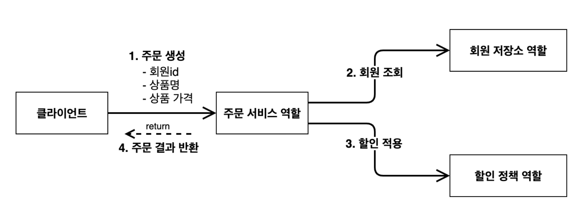

---

## 1. 프로젝트 생성

스프링에 대해 들어가기 전에, 스프링 없이 순수하게 자바만으로 애플리케이션을 구현해보자.  (프로젝트 생성은 스프링 부트 사용)

[https://start.spring.io/](https://start.spring.io/)에서 프로젝트 생성하기

<br>


* 스프링이나 자바 필요에 맞게 스테이블(stable) 버전을 선택해서 사용하면 된다
* Generate로 생성 후  ```build.gradle``` 파일을 통해 프로젝트 오픈

<br>


* Mac : 위의 탭으로 가서 ```File``` → ```Project Structure``` 선택

<br>


* 위의 탭으로 가서 ```IntelliJIDEA``` → ```Settings``` 에서 ```Gradle``` 설정으로 들어간다
* Build and Run 설정은 ```IntelliJ IDEA``` 사용
* **필수 아님!** ```IntelliJ IDEA```로 빌드와 런하는 것이 프로젝트 설정, 규모에 따라 빠를수도 있음

<br>

---

## 2. 비즈니스 요구 사항과 설계

프로젝트의 비즈니스 요구 사항이 무엇이고, 어떻게 설계할 것인지 알아보자.

먼저 **비즈니스 요구 사항**에 알아보자.

* **회원**
  * 회원 가입과 조회가 가능하다
  * 회원 등급에는 일반과 VIP 등급이 존재한다
  * 회원 데이터를 위해 자체 DB를 구축할 수 있고, 외부 시스템을 사용할 수도 있다 (미정)


* **주문과 할인 정책**
  * 회원은 상품 주문이 가능하다
  * 회원 등급에 따라 할인 정책이 다르게 적용될 수 있다
  * 할인 정책에서 VIP는 1000원을 할인해주는 고정 금액 할인을 적용한다 (나중에 변경 가능)
  * 할인 정책은 변경 가능성이 높다
    * 회사의 기본 할인 정책은 정해지지 않았다 (미정)
    * 서비스 개시 전 까지 고민하고, 최악의 경우 할인 적용이 없을 수도 있다 (미정)

<br>

인터페이스를 만들어서 구현체를 언제든지 변경할 수 있는 객체 지향적 설계를 시도 해보자.

<br>

---

## 3. 회원 도메인 설계

비즈니스 요구 사항을 들었으니 회원 도메인에 대한 설계를 해보자. 들어가기에 앞서 회원 도메인에 대한 요구사항 다시 한번 살펴보자.

* **회원 도메인**
  * 회원 가입과 조회가 가능하다
  * 회원 등급에는 일반과 VIP 등급이 존재한다
  * 회원 데이터를 위해 자체 DB를 구축할 수 있고, 외부 시스템을 사용할 수도 있다 (미정)

<br>

이제 회원 도메인에 대한 설계를 해보자.

<br>


<p align='center'>회원 도메인의 협력 관계도</p>

* 클라이언트가 회원 서비스를 호출한다, 이때 회원 서비스는 다음의 두 가지 기능을 제공해주는 레이어다
  * 회원 가입
  * 회원 조회


* 회원 저장소 인터페이스를 만들 것이다


* 회원 저장소 인터페이스의 구현체는 다음의 3가지 구현체를 만들 것
  * 메모리 회원 저장소 : 로컬 내의 메모리에 데이터를 저장하는 저장소 (오로지 개발용)
  * DB 회원 저장소
  * 외부 시스템 연동 회원 저장소 

<br>


<p align='center'>회원 클래스 다이어그램</p>

* 실제 구현은 위의 다이어그램대로 구현할 예정
* 외부 시스템 연동 회원 저장소도 추가 될 가능성이 있음

<br>


<p align='center'>회원 객체 다이어그램</p>

* 실제 서버에 올라갈 때 객체간의 참조는 다음과 같이 된다
  * 클라이언트 → 회원 서비스(```MemberServiceImpl```) → 메모리 회원 저장소 (```MemoryMemberRepository```)

<br>

---

## 4. 회원 도메인 개발

이전 설계를 바탕으로 회원 도메인에 대한 개발을 시작해보자.

<br>

`Grade` : 회원 등급 상수 정의

```java
public enum Grade {
    BASIC,
    VIP
}
```

<br>

`Member`

```java
public class Member {
    private Long id;
    private String name;
    private Grade grade;

    public Member(Long id, String name, Grade grade) {
        this.id = id;
        this.name = name;
        this.grade = grade;
    }

    // Getter and Setter
    public Long getId() { return id; }
    public void setId(Long id) { this.id = id; }
    public String getName() { return name; }
    public void setName(String name) { this.name = name; }
    public Grade getGrade() { return grade; }
    public void setGrade(Grade grade) { this.grade = grade; }
}
```

<br>

`MemberRepository` : 회원 도메인의 레포지토리 인터페이스

```java
public interface MemberRepository {
    // 회원 저장
    void save(Member member);
    // 회원 아이디로 회원 찾기
    Member findById(Long memberId);
}
```

<br>

```MemoryMemberRepository``` : 회원 도메인의 레포지토리 구현체(서버의 메모리를 사용한다)

```java
public class MemoryMemberRepository implements MemberRepository{
    // 간단한 예시라서 동시성 고려 없이 구현 (Concurrent HashMap 사용 x)
    private static Map<Long, Member> store = new HashMap<>();
  
    @Override
    public void save(Member member) {
        store.put(member.getId(), member);
    }

    @Override
    public Member findById(Long memberId) {
        return store.get(memberId);
    }
```

* 원래 인터페이스에 대한 구현체는 다른 패키지에 관리하는 것을 권장하지만, 간단한 예시이므로 같은 패키지에서 개발

<br>

```MemberService``` : 회원 도메인의 서비스 인터페이스

```java
public interface MemberService {
    // 회원 가입
    void join(Member member);
    // 회원 조회
    Member findMember(Long memberId);
}
```

<br>

`MemberServiceImpl`

```java
public class MemberServiceImpl implements MemberService{
    // 구현 객체를 선택해야 함
    private final MemberRepository memberRepository = new MemoryMemberRepository();
    
    @Override
    public void join(Member member) {
        memberRepository.save(member);
    }

    @Override
    public Member findMember(Long memberId) {
        return memberRepository.findById(memberId);
    }
}
```

* 단일 구현체인 경우 관례상 이름에 ```Impl```을 붙여주는 경우가 많다

<br>

---

## 5. 회원 도메인 실행과 테스트

회원 도메인이 정상적으로 동작하는지 테스트 코드로 확인해보자.

<br>

`MemberServiceTest`

```java
public class MemberServiceTest {

    MemberService memberService = new MemberServiceImpl();

    @Test
    void join() {
        // given - 주어진 상황(데이터, 등)
        Member member = new Member(1L, "messi", Grade.VIP); // 멤버 생성

        // when - 이것을 실행할 때
        memberService.join(member); // 생성한 멤버를 회원 가입 시킨다
        Member findMember = memberService.findMember(1L); // 아이디 1로 멤버를 찾음

        // then - 이런 결과가 나와야 한다(검증)
        Assertions.assertThat(member).isEqualTo(findMember); // 생성한 멤버와 찾은 멤버가 동일한지 확인 
    }
}
```

* `given, when, then` 으로 테스트 코드를 짜는 것은 공식은 아니다
  * 상황에 따라서 적용하는 일종의 가이드 처럼 생각하는게 편함

<br>

지금까지 개발한 회원 도메인에서 문제가 존재한다. `MemberServiceImpl`에서 추상화(`MemberRepository`)에도 의존하고 구현체(`MemoryMemberRepository`)에도 의존하고 있음. 즉 DIP를 위반하고 있다.

<br>

>  알고 있다는 것은 곧 의존한다는 것!
{: .prompt-warning }

<br>

---

## 6. 주문과 할인 도메인 설계

주문과 할인 도메인을 설계 해보자. 들어가기에 앞서 주문과 할인 정책에 대한 요구사항을 다시 한번 살펴보자.

* **주문과 할인 정책**
  * 회원은 상품 주문이 가능하다
  * 회원 등급에 따라 할인 정책이 다르게 적용될 수 있다
  * 할인 정책에서 VIP는 1000원을 할인해주는 고정 금액 할인을 적용한다 (나중에 변경 가능)
  * 할인 정책은 변경 가능성이 높다
    * 회사의 기본 할인 정책은 정해지지 않았다 (미정)
    * 서비스 오픈 전 까지 고민하고, 최악의 경우 할인 적용이 없을 수도 있다 (미정)

<br>

이제 주문과 할인 도메인에 대한 설계를 해보자.

<br>



<p align='center'>주문 도메인의 관계, 역할, 책임</p>

* **주문 생성** : 클라이언트는 주문 서비스에 주문 생성을 요청할 수 있다
  * 간단한 예제를 위해서 그냥 상품의 정보 자체를 넘김
  * 실제로 개발할 때는 아이템이라는 객체를 만들어서  사용함


* **회원 조회** : 할인을 위해서는 회원 등급이 필요하기 때문에 주문 서비스는 회원 저장소에서 회원을 조회한다
  * 회원 정보에서 등급과 같은 정보를 조회 


* **할인 적용** : 주문 서비스는 회원 등급에 따른 할인 여부를 할인 정책에 위임한다 
* **주문 결과 반환** : 주문 서비스는 할인 결과를 포함한 주문 결과를 반환한다
* 간단한 예시를 위해 주문 데이터를 DB에 저장하는 과정은 생략 

<br>

이제 구현에 대한 내용까지 포함한 다이어그램을 살펴보자.

<br>


<br>


<p align='center'>주문 도메인의 구현체</p>

**역할과 구현의 분리**를 통해서 구현 객체의 조립이 자유로워진다. 

<br>

---

## 7. 주문과 할인 도메인 개발

이전 설계를 바탕으로 주문과 할인 도메인에 대한 개발을 진행하자.

<br>

```DiscountPolicy``` : 할인 정책에 대한 인터페이스, 나중에 할인 정책 변경시 더 쉽게 변경 가능

```java
public interface DiscountPolicy {
    /**
     * @return 할인 대상 금액 (호출시 할인 금액을 리턴)
     */
    int discount(Member member, int price);
}
```

<br>

```FixDiscountPolicy``` : 고정 할인 정책

```java
public class FixDiscountPolicy implements DiscountPolicy {
    
  	private int discountFixAmount = 1000; // 고정 할인값 : 1000원
  
    @Override
    public int discount(Member member, int price) {
        if (member.getGrade() == Grade.VIP) { // enum은 "==" 사용해도 됨
            return discountFixAmount;
        } else {
            return 0;
        }
    }
}
```

<br>

```Order``` : 주문

```java
public class Order {
    private Long memberId;
    private String itemName;
    private int itemPrice;
    private int discountPrice;

    public Order(Long memberId, String itemName, int itemPrice, int discountPrice) {
        this.memberId = memberId;
        this.itemName = itemName;
        this.itemPrice = itemPrice;
        this.discountPrice = discountPrice;
    }

    // 계산 로직 (최종 가격 계산)
    public int calculatePrice() {
        return itemPrice - discountPrice;
    }

		/**
		 * Getter and Setter 구현
		 */

    // 객체 출력시 toString의 결과가 나옴
    @Override
    public String toString() {
        return "Order{" +
                "memberId=" + memberId +
                ", itemName='" + itemName + '\'' +
                ", itemPrice=" + itemPrice +
                ", discountPrice=" + discountPrice +
                '}';
    }
}
```

<br>

```OrderService``` : 주문 도메인의 서비스 인터페이스

```java
public interface OrderService {
    // 주문 생성
    Order createOrder(Long memberId, String itemName, int itemPrice);
}
```

<br>

```OrderServiceImpl``` : 주문 도메인의 서비스 구현체

```java
public class OrderServiceImpl implements OrderService{
    /*
     * OrderService는 할인에 대한 변경을 건들 필요가 없음!(단일 책임의 원칙)
     * 할인에 대한 내용은 DiscountPolicy가 담당
     */
    private final MemberRepository memberRepository = new MemoryMemberRepository();
    private final DiscountPolicy discountPolicy = new FixDiscountPolicy();
    @Override
    public Order createOrder(Long memberId, String itemName, int itemPrice) {
        Member member = memberRepository.findById(memberId);
        int discountPrice = discountPolicy.discount(member, itemPrice);
        // 최종 생성되는 주문 반환
        return new Order(memberId, itemName, itemPrice, discountPrice);
    }
}
```

<br>

---

## 8. 주문과 할인 도메인 실행과 테스트

개발한 주문과 할인 도메인에 대해 테스트를 하자.

<br>

`OrderServiceTest`

```java
public class OrderServiceTest {

    MemberService memberService = new MemberServiceImpl();
    OrderService orderService = new OrderServiceImpl();

    @Test
    void createOrder() {
        Long memberId = 1L;
        Member member = new Member(memberId, "messi", Grade.VIP);
        memberService.join(member);

        Order order = orderService.createOrder(memberId, "pizza", 18000);
        Assertions.assertThat(order.getDiscountPrice()).isEqualTo(1000);
    }
}
```

<br>

---

## 9. 정리

현재의 코드는 겉보기에는 다형성을 지키면서 잘 설계한 것 처럼 보이지만, 몇 가지 문제들이 존재한다.

다음 코드를 살펴보자.

<br>

```java
public class OrderServiceImpl implements OrderService{

    private final MemberRepository memberRepository = new MemoryMemberRepository();
    private final DiscountPolicy discountPolicy = new FixDiscountPolicy();
  
    @Override
    public Order createOrder(Long memberId, String itemName, int itemPrice) {
        Member member = memberRepository.findById(memberId);
        int discountPrice = discountPolicy.discount(member, itemPrice);

        return new Order(memberId, itemName, itemPrice, discountPrice);
    }
}
```

<br>

만약 할인 정책을 고정 할인(`FixDiscountPolicy`)가 아니라, 새로운 할인 정책을 만들어서 적용하고 싶으면 해당 코드를 수정해야 한다.

할인 정책뿐만 아니라, 만약 레포지토리를 `MemoryMemberRepository`가 아니라 다른 특정 DB 접근 기술을 사용해서 레포지토리를 사용하고 싶으면, 해당 코드 또한 수정해야 한다.

결론부터 말하자면 DIP, OCP 원칙을 위배하는 코드이다. 다음 포스트에서는 이를 해결하기 위해서 코드에 객체 지향적 설계를 적용해보는 과정을 살펴보자.

---

## Reference

1. [:star:인프런 : (김영한) 스프링 완전 정복](https://www.inflearn.com/roadmaps/373)
2. [Udemy - Spring Boot 3, Spring 6 & Hibernate](https://www.udemy.com/course/spring-hibernate-tutorial/?couponCode=ST8MT40924)
3. [쉬운 코드 - 유튜브](https://www.youtube.com/@ez.)
4. [스프링 아카데미](https://spring.academy/paths/spring-certified-professional-2023)
