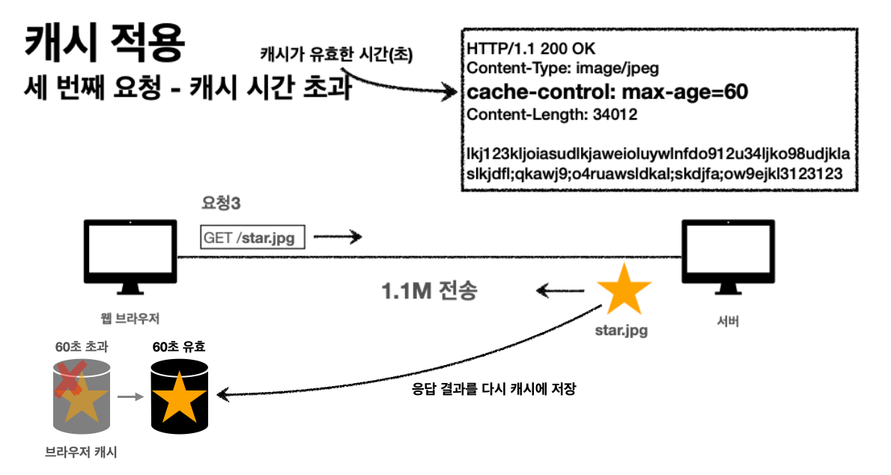
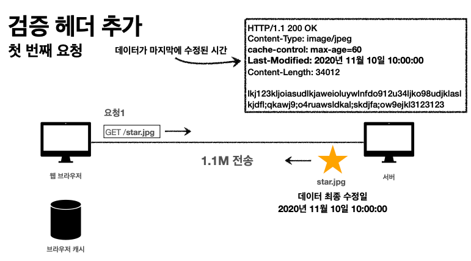
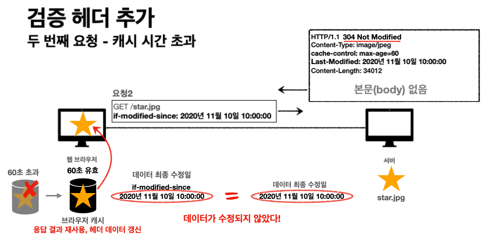

---

## 캐시(Cache) 소개

> 캐싱은 주어진 리소스의 복사본을 저장하고 있다가 요청 시에 그것을 제공하는 기술이다. 웹 캐시가 자신의 저장소 내에 요청된 리소스를 가지고 있다면, 요청을 가로채 원래의 서버로부터 리소스를 다시 다운로드하는 대신 리소스의 복사본을 반환한다. 이것은 다음과 같은 몇 가지 목표를 달성하게 해줍니다: 모든 클라이언트를 서비스할 필요가 없어지므로 서버의 부하를 완화하고, (캐시가 원래 서버에 비해서) 클라이언트에 더 가까이에 있으므로 성능이 향상된다. 즉, 리소스를 회신하는데 더 적은 시간이 들게 되는것이다. 웹 사이트에서 캐싱은 높은 성능을 달성하는 데에 주요한 요소이다. 반면에 모든 리소스가 영원히 변하지 않는 것은 아니므로 리소스가 변하기 전까지만 캐싱하고 변한 이후에는 더이상 캐싱하지 않는 것이 중요하다.

<br>

캐시를 사용하지 않을 때는 다음과 같은 문제들이 있다.

* 데이터가 변경되지 않아도 계속 네트워크를 통해서 데이터를 다운로드 받아야 한다
  * 인터넷 네트워크는 비싸다
  * 브라우저 로딩 속도가 느려진다
  * 느린 사용자 경험

<br>

캐시를 적용하면, 응답 결과를 캐시에 저장해서 캐시의 유효기간 동안 해당 복사본을 사용할 수 있다. 그러나 만약 캐시의 유효 기간이 지나는 경우(캐시 시간 초과)에는 어떻게 될까?



<p align='center'>캐시 시간 초과</p>

1. `cache-contol: max-age=60`을 통해서 캐시에 유효 시간 60초를 부여할 수 있다
2. 캐시 시간 초과로 인해 캐시가 유효하지 않은 겨우 → 다음 요청에서 응답 결과를 다시 캐시에 저장(캐시 갱신)

단순히 캐시 시간 초과할 때 마다 다시 다운로드하는 것은 효율적이지 않을 수 있다!

<br>

---

## 캐시 검증 헤더(Last-Modified, If-Modified-Since)

검증 헤더와 조건부 요청에 대해 알아보자.

캐시 유효 시간이 초과해서 서버에 다시 요청하면 다음의 두 가지 상황이 나타난다.

* 서버에서 기존 데이터를 변경했음
  * 이 경우에는 캐시를 갱신하는 것이 맞음


* **서버에서 기존 데이터를 변경하지 않았음**
  * 이 경우 캐시 갱신을 위한 다운로드는 비효율적임(굳이 다운로드 할 필요가 없는 상황)

<br>

서버에서 기존 데이터를 변경하지 않았을 경우 캐시 갱신을 위해 다시 다운로드하는 비효율적 문제를 해결할 방법이 필요하다.

* 잘 생각해보면 기존에 저장해 두었던 캐시를 재사용하는 방도가 있음
* 그러나 클라이언트의 데이터 = 서버의 데이터를 확인할 방법이 필요함

<br>

이를 위해 사용할 수 있는 것이 검증 헤더(validation header)를 추가하는 것이다. 검증 헤더를 추가해서 사용하는 과정을 다음 예시를 통해 살펴보자.

<br>



<p align='center'>첫 번째 요청</p>


1. 첫 번째 요청 : `GET /star.jpg`
   * 응답에서 `cache-contol: max-age=60`을 통해서 캐시 유효 시간 부여
   * `Last-Modified: 2020년 10월 10일 10:00:00`을 통해서 데이터가 마지막에 수정된 시간을 캐시에 부여

<br>



2. 60초가 지나면 캐시 시간이 초과되서 기존의 캐시는 유효하지 않게 됨
3. 두 번째 요청 : `GET /star.jpg`, `if-modified-since: 2020년 11월 10일 10:00:00`
   * 첫 번째 요청에서 받은 응답의 `Last-Modified`을 통해서 `if-modified-since`라는 캐시가 가지고 있는 데이터 최종 수정일을 두 번째 요청에서 서버로 넘긴다
4.  이때 `if-modified-since`이라는 최종 수정일과 서버의 `star.jpg`의 최종 수정일이 동일하면 `304 Not Modified`를 본문(body) 없이 응답으로 전송한다 (캐시로 리다이렉트)
5. 브라우저는 그러면 헤더 데이터를 갱신하고, 기존 캐시를 재사용

만약 최종 수정일이 서버의 데이터 최종 수정일 이전이면, 응답으로 200 OK를 주고 변경된 데이터를 전부 응답으로 보내준다.

<br>

정리하면 다음과 같다.

* 캐시 유효 시간이 초과해도, 서버의 데이터가 갱신되지 않았다면 → `304 Not Modified` + 본문(body) 없이 응답
* 클라이언트는 서버가 보낸 응답 헤더 정보로 캐시의 메타 정보를 갱신
* 클라이언트는 캐시에 저장되어 있는 데이터 재활용
* 결과적으로 네트워크 다운로드는 용량이 적은 헤더 정보만 다운로드하기 때문에 네트워크 부하 감소

<br>

---

## Cache Validation(ETag)

이전에 알아보았던 `Last-Modfied`, `If-Modified-Since`방식의 단점은 다음과 같다.

* 1초 미만 단위로 캐시 조정이 불가능하다
* 날짜 기반의 로직을 사용한다
* 데이터를 수정해서 날짜가 다르지만, 같은 데이터를 수정해서 데이터 결과가 똑같은 경우를 판단하지 못한다

<br>

이 떄 ```ETag```(entity-tag)를 사용하면 

* 서버에서 별도의 캐시 로직을 사용할 수 있다
  * 예) 스페이스나 주석의 변경처럼, 크게 의미가 없는 변경에서 캐시를 유지하고 싶은 경우

<br>

```ETag``` 사용은 간단하다. 그냥 ```ETag```가 같으면 304, 다르면 200을 응답으로 주면 된다.

`ETag`의 장점은 다음과 같다.

* 사용법이 단순하다
  * `ETag`를 서버에 보내서 같으면 유지, 다르면 다시 받기


* 캐시 제어 로직을 서버에서 완전히 관리할 수 있다
* 클라이언트는 단순히 `ETag`값을 서버에 제공한다(클라이언트는 캐시 매커니즘을 알 수 없다)
* 더 자세히 알아보기 : [https://developer.mozilla.org/en-US/docs/Web/HTTP/Caching#etagif-none-match](https://developer.mozilla.org/en-US/docs/Web/HTTP/Caching#etagif-none-match)

<br>

---

## Cache-Control

* `Cache-Control: max-age`
  * 캐시 유효 시간(초 단위)


* `Cache-Control: no-cache`
  * 데이터는 캐시해도 되지만, 항상 오리진(origin) 서버에 검증하고 사용


* `Cache-Control: no-store`
  * 데이터에 민감한 정보가 있기 때문에 저장하면 안됨
  * 메모리에서 사용하고 최대한 빨리 삭제

<br>

확실한 캐시의 무효화를 위해서는 다음과 같이 사용해야 한다.

* ```Cache-Control: no-cache, no-store, must-revalidate```
* `Pragme: no-cache` 
  * HTTP 1.0 하위 호환

<br>

* ```Cache-Control: must-revalidate```
  * 캐시 만료후 최초 조회시 오리진 서버에 검증해야 한다
  * 오리진 서버 접근 실패시 반드시 오류가 발생해야 한다 - 504(Gateway Timeout)
  * 캐시 유효 시간이라면 캐시를 사용함

---

## Reference

1. [인프런 - 모든 개발자를 위한 HTTP 웹 기본 지식](https://www.inflearn.com/course/http-%EC%9B%B9-%EB%84%A4%ED%8A%B8%EC%9B%8C%ED%81%AC/dashboard)
2. [널널한 개발자 - 네트워크 기초](https://www.youtube.com/watch?v=k1gyh9BlOT8&list=PLXvgR_grOs1BFH-TuqFsfHqbh-gpMbFoy)
3. HTTP 완벽 가이드
4. 네트워크 하향식 접근(Computer Networking a Top-Down Approach)