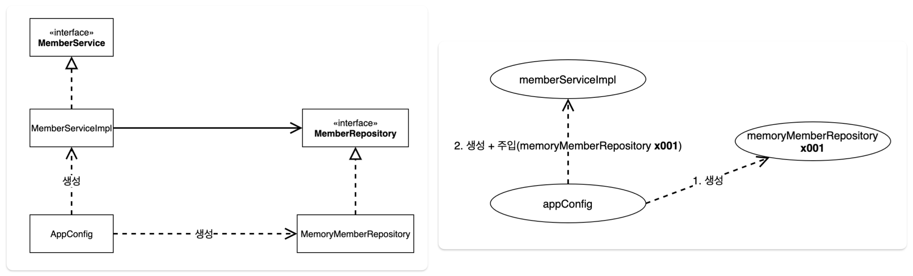

---

## 1. 기존 예제의 할인 정책 변경

이전 프로젝트에 객체 지향적 설계를 적용해보자.

기존의 고정 할인 정책을 정률 할인으로 바꾼다고 해보자.

* 예) 20000원에 10% 할인 적용 → 2000원 할인

<br>

먼저 기존의 ```FixDiscountPolicy```를 ```RateDiscountPolicy```로 변경해서 개발하면 된다. (구현체 추가)

<br>

`RateDiscountPolicy`

```java
public class RateDiscountPolicy implements DiscountPolicy{

    private int discountPercent = 10; // 정률 할인 비율 : 10% 할인

    @Override
    public int discount(Member member, int price) {
        if (member.getGrade() == Grade.VIP) {
            return price * discountPercent / 100;
        } else {
            return 0;
        }
    }
}
```

* 인텔리제이 : 오버라이드한 메서드 위에 ```ctrl + shift + t``` 단축키로 테스트 코드를 위한 패키지와 클래스 생성 해줌

<br>

테스트 코드도 작성해보자.

<br>

`RateDiscountPolicyTest`

```java
class RateDiscountPolicyTest {
    RateDiscountPolicy discountPolicy = new RateDiscountPolicy();

    @Test
    @DisplayName("VIP는 10% 할인 적용")
    void vip_o() {
        // given
        Member member = new Member(1l, "mbappeVip", Grade.VIP);
        // when
        int discount = discountPolicy.discount(member, 20000);
        // then
        Assertions.assertThat(discount).isEqualTo(2000); // Assertions 스태틱 임포트 권장
    }

    // 실패하는 경우도 테스트
    @Test
    @DisplayName("VIP가 아닌 경우 할인 없음")
    void vip_x() {
        // given
        Member member = new Member(2l, "ronaldoBasic", Grade.BASIC);
        // when
        int discount = discountPolicy.discount(member, 20000);
        // then
        Assertions.assertThat(discount).isEqualTo(2000);
    }
}
```

<br>

이제 ```RateDiscountPolicy```를 적용해보자.

<br>

`OrderServiceImpl`

```java
public class OrderServiceImpl implements OrderService{

    private final MemberRepository memberRepository = new MemoryMemberRepository();
  	
  //private final DiscountPolicy discountPolicy = new FixDiscountPolicy();
    private final DiscountPolicy discountPolicy = new RateDiscountPolicy();

	  // 기존 구현
}
```

* 할인 정책 변경을 위해서는 클라이언트 코드인 ```OrderServiceImpl```를 고쳐야 한다
* 지금 상태의 코드는 다형성을 활용해서 인터페이스와 구현 객체를 분리했지만 **OCP, DIP를 준수했다고 보기는 어렵다**
  * DIP : 인터페이스인 ```DiscountPolicy``` 뿐만 아니라, 구현체인 ```FixDiscountPolicy```와 ```RateDiscountPolicy```에도 의존하고 있다
  * OCP : 현재의 코드에 기능을 확장하려면 결국 클라이언트 코드를 변경해줘야 한다

<br>

 

<p align='center'>OCP 위반</p>

<br>
 DIP와 OCP 위반을 해결하기 위한 방법은 무엇일까?

먼저 DIP 위반은 추상(인터페이스) 계층에만 의존하도록 변경해야 한다.

<br>

그러면 인터페이스에만 의존하도록 설계를 바꿔보자.

<br>

`OrderServiceImpl`

```java
public class OrderServiceImpl implements OrderService{

    private final MemberRepository memberRepository = new MemoryMemberRepository();
    
    private DiscountPolicy discountPolicy; // 인터페이스에만 의존!
 // private final DiscountPolicy discountPolicy = new FixDiscountPolicy();
 // private final DiscountPolicy discountPolicy = new RateDiscountPolicy();

    // 나머지 구현 부분 동일
}
```

* ```discountPolicy```에 아무것도 할당 되어있지 않기 때문에 ```NullPointerException```
* 이 문제를 해결하기 위해서는 누군가 클라이언트인 ```OrdserServieImpl```에 ```DiscountPolicy```의 **구현 객체를 대신 생성하고 주입해줘야 한다!**

<br>

---

## 2. 관심사의 분리

관심사를 분리하자! 그런데 관심사를 분리한다는 건 뭔 뜻일까?

관심사의 분리라는 것은 `"구현 객체는 딱 본인의 역할(책임)에 집중을 해야한다"`는 설계 원칙 아래서, 구현 객체에게 맡겨지지 않은 책임은 다른 곳으로 분리하는 행위를 말한다.

<br>

책임을 분리하기 위해서 ```AppConfig```라는 클래스를 도입해보자.

<br>

`AppConfig`

```java
public class AppConfig {
    // 생성자 주입을 통해서 구현체 선택
    public MemberService memberService() {
        return new MemberServiceImpl(new MemoryMemberRepository());
    }

    public OrderService orderService() {
        return new OrderServiceImpl(
                new MemoryMemberRepository(), new FixDiscountPolicy()
        );
    }
}
```

* ```AppConfig```는 애플리케이션의 전체 동작 방식을 설정(구성)하기 위해서, 구현 객체를 생성하고 연결해주는 책임을 가지는 별도의 클래스이다

<br>

* ```AppConfig```는 동작에 필요한 구현 객체를 생성 해준다
  * ```MemberServiceImpl```
  * ```MemoryMemberRepository```
  * ```OrderServiceImpl```
  * ```FixDiscountPolicy```

<br>

* 생성한 인스턴스의 참조를 생성자를 통해 주입(연결) 해준다
  * ```MemberServiceImpl```→```MemoryMemberRepository```
  * ```OrderServiceImpl```→```MemoryMemberRepository```, ```FixDiscountPolicy```

<br>

`MemberServiceImpl`

```java
public class MemberServiceImpl implements MemberService{

    // 오로지 인터페이스에만 의존!
    private MemberRepository memberRepository;

    // 생성자를 통해서 구현체를 선택할 것이다 (주입)
    public MemberServiceImpl(MemberRepository memberRepository) {
        this.memberRepository = memberRepository;
    }

		/**
		 * 나머지 구현 부분
		 */
}
```

<br>

```OrderServiceImpl```

```java
public class OrderServiceImpl implements OrderService{
    
    // 오로지 인터페이스에만 의존!
    private final MemberRepository memberRepository;
    private final DiscountPolicy discountPolicy;
    
    // 생성자를 통해 주입
    public OrderServiceImpl(MemberRepository memberRepository, DiscountPolicy discountPolicy) {
        this.memberRepository = memberRepository;
        this.discountPolicy = discountPolicy;
    }
  
    /**
     * 나머지 구현 부분 동일
     */
}
```

* 이제는 어떤 구현 객체를 주입하는지는 오로지 ```AppConfig```가 결정하기 때문에 ```MemberServiceImpl```, ```OrderServiceImpl```은 실행에만 집중하면 된다
*  객체를 생성하고 연결(주입)하는 책임 그리고 실행하는 책임이 분리되었기 때문에 관심사를 분리했다고 볼 수 있다
* 이제 추상(인터페이스)에만 의존하기 때문에 DIP를 준수한다 

<br>

 

* 클라이언트인 ```memberServiceImpl``` 입장에서는 의존관계(Dependecy)를 마치 외부에서 주입해주는 것 같다고 해서 DI(Dependency Injection, 의존성 주입)라고 한다

<br>

그럼 ```AppConfig```를 사용하도록 테스트 코드를 수정해보자.

<br>

`OrderServiceTest`

```java
public class OrderServiceTest {

    MemberService memberService;
    OrderService orderService;

    // MemberService memberService = new MemberServiceImpl(memberRepository);
    // OrderService orderService = new OrderServiceImpl(memberRepository, discountPolicy);

    @BeforeEach
    public void beforeEach() {
        AppConfig appConfig = new AppConfig();
        memberService = appConfig.memberService();
        orderService = appConfig.orderService();
    }

    @Test
    /**
     * 기존 구현
     */
}
```

* ```MemberServiceTest```도 동일하게 ```AppConfig```를 사용하도록 변경하면 된다

<br>

이제 ```AppConfig```를 리팩토링 해보자. 현재 ```AppConfig```의 문제점은 역할에 따른 구현이 잘 안보인다는 것이다.

<br>

`AppConfig`

 ```java
 public class AppConfig {
   
     public MemberService memberService() {
         return new MemberServiceImpl(memberRepository());
     }
 
     // 추후에 변경시 이 부분만 수정하면 됨
     public MemberRepository memberRepository() {
         return new MemoryMemberRepository();
     }
 
     public OrderService orderService() {
         return new OrderServiceImpl(memberRepository(), discountPolicy());
     }
 
     // 추후에 변경시 이 부분만 수정하면 됨
     public DiscountPolicy discountPolicy() {
         return new FixDiscountPolicy();
     }
 
 }
 ```

* 인텔리제이 : ```cmd + option + m``` 으로 메서드 추출

<br>

---

## 3. 새로운 구조와 할인 정책 적용

정액 할인 정책(```FixedDiscoutPolicy```)을 정률 할인 정책(```RateDiscountPolicy```)로 변경해보자.

<br>

  

<p align='center'>할인 정책 변경</p>

* 구성 영역만 변경하면 되고, 사용 영역은 전혀 영향을 받지 않는다

<br>

```AppConfig```를 수정하자.

```java
public class AppConfig {
  
		/**
		 * 기존 구현
		 */

    // 추후에 변경시 이 부분만 수정하면 됨 -> 이제 여기를 수정하면 된다
    public DiscountPolicy discountPolicy() {
        // return new FixDiscountPolicy();
      	return new RateDiscountPolicy(); // FixDiscount-> RateDiscount로 변경
    }
}
```

* 정액 할인 정책(```FixedDiscoutPolicy```)을 정률 할인 정책(```RateDiscountPolicy```)로 변경했다
* 아주 간단하게 ```AppConfig```의 일부만 수정해서 할인 정책을 변경했다
  * 사용 영역은 그 어떤 부분도 건들지 않았음!

<br>

이제 코드는 OCP와 DIP를 전부 준수하는 코드이다.

지금까지의 코드에 SRP, DIP, OCP를 적용했다.

* SRP
  * 단일 책임의 원칙을 따르면서 관심사를 분리
  * ```AppConfig```를 통해서 관심사를 분리
  * ```AppConfig```는 구현 객체를 생성하고 연결해주는 책임을 가짐
  * 클라이언트는 실행하는 책임만 가짐


* DIP
  * ```AppConfig```가 구현체를 생성하고 클라이언트 코드에 주입해주기 때문에, 클라이언트 코드는 추상(인터페이스)만 의존한다


* OCP
  * 다형성을 사용하면서 DIP도 준수
  * 사용 영역과 구성 영역(```AppConfig```)으로 나눔
  * 새로운 요소를 추가해도 사용 영역은 닫혀 있음 (코드 변경 안해도 됨)

<br>

---

## 4. IoC, DI, 컨테이너

IoC(제어의 역전, Inversion of Control), DI(Dependecny Injection) 그리고 컨테이너(Container)에 대해서 알아보자.

<br>

### 4.1 IoC(제어의 역전)

말 그대로 제어의 역전을 의미한다. 프로그래머가 작성한 프로그램이 프레임워크의 흐름 제어를 받게 되는 소프트웨어 디자인 패턴을 말한다. 

줄여서 **IoC**(Inversion of Control)이라고 부른다. 

전통적인 프로그램에서의 흐름은 프로그래머가 작성한 프로그램이 라이브러리의 코드를 호출해 이용한다. 하지만 제어의 역전이 적용된 구조에서는 프레임워크의 코드가 프로그래머가 작성한 코드를 호출한다.

<br>

* 기존에는 클라이언트 구현 객체가 스스로 필요한 서버 구현 객체를 생성, 연결, 실행했음 → 즉, 구현 객체가 프로그램의 제어 흐름을 컨트롤
* 제어의 역전(**IoC**)이라는 것은 구현 객체가 자신의 로직을 실행하는 역할만 담당하고, 제어의 흐름은 외부에서 컨트롤 되는 것을 말한다
* 우리의 코드를 예시로 들자면, ```AppConfig```가 프로그램의 제어 흐름을 컨트롤 해주고, ```OrderServiceImpl```은 자신의 로직만을 실행한다

<br>

---

### 4.2 DI(의존성 주입)

의존성 주입은 프로그램 디자인이 [결합도](https://ko.wikipedia.org/wiki/%EA%B2%B0%ED%95%A9%EB%8F%84)를 느슨하게 되도록하고 [의존관계 역전 원칙](https://ko.wikipedia.org/wiki/%EC%9D%98%EC%A1%B4%EA%B4%80%EA%B3%84_%EC%97%AD%EC%A0%84_%EC%9B%90%EC%B9%99)과 단일 책임 원칙(SRP)을 따르도록 클라이언트의 생성에 대한 의존성을 클라이언트의 행위로부터 분리하는 것이다.

의존성 주입의 의도는 객체의 생성과 사용의 관심을 분리하는 것이다.

<br>

* 의존관계는 정적인 클래스의 의존관계와. 실행 시점에 결정되는 동적인 객체(인스턴스)의 의존관계를 분리해서 생각해야 한다


* **정적인 클래스 의존관계** : 클래스가 사용하는 ```import``` 코드만 보고 의존관계를 판단할 수 있다
  * 예) ```OrderServiceImpl```은 ```MemberRepository```, ```DiscountPolicy```에 의존하는 것을 알 수 있다
  * 이 의존관계 만으로는 실제 어떤 객체가 주입될지는 모른다 


* **동적인 객체(인스턴스) 의존관계** : 애플리케이션의 실행 시점(runtime)에 실제 생성된 객체의 참조가 연결된 의존 관계
  * 실행이 되어야 ```MemoryMemberRepository```, ```RateDiscountPolicy```를 의존한다는 것을 알 수 있다


* 애플리케이션 실행 시점(runtime)에 외부에서 실제 구현 객체를 생성하고 클라이언트에 전달해서 클라이언트와 서버의 실제 의존관계가 연결되는 것을 **의존관계 주입**(Dependency Injection)이라고 한다

<br>

---

### 4.3 IoC, DI 컨테이너

* 객체를 생성하고 의존관계를 연결해주는 역할을 해주는 것을 **IoC 컨테이너** 또는 **DI 컨테이너**라고 한다
  *  예) ```AppConfig```가 이 역할을 수행 해준다고 볼 수 있다


* 최근에는 DI 컨테이너로 주로 불리며(의존 관계 주입에 초점을 맞춤), 오브젝트 팩토리(Object Factory)라고 부르기도 한다

<br>

---

## 5. 스프링으로 전환하기

지금까지 순순하게 자바 코드만으로 DI를 적용한 것을 스프링을 이용하도록 전환해보자.

<br>

`AppConfig`

```java
@Configuration 
public class AppConfig {

    @Bean
    public MemberService memberService() {
        return new MemberServiceImpl(memberRepository());
    }

    @Bean
    public OrderService orderService() {
        return new OrderServiceImpl(memberRepository(), discountPolicy());
    }

    @Bean
    public MemberRepository memberRepository() {
        return new MemoryMemberRepository();
    }

    @Bean
    public DiscountPolicy discountPolicy() { return new RateDiscountPolicy(); }
}
```

* ```@Configuration``` : 스프링 컨테이너에 설정에 관한 메타 데이터 제공
  * 한 개 이상의 ```@Bean```을 정의
  * 쉽게 말해서 스프링 컨테이너는 ```@Configuration```이 붙은 클래스를 설정 정보로 이용한다


* ```@Bean``` : 스프링 컨테이너는 ```@Bean```이 붙은 메서드를 호출해서 반환된 객체를 전부 스프링 컨테이너에 등록
  * 스프링 컨테이너에서 빈(Bean)을 관리

<br>

`MemberApp`

```java
public class MemberApp {
    public static void main(String[] args) {

        // AppConfigJava appConfig = new AppConfigJava();
        // MemberService memberService = appConfig.memberService();

        ApplicationContext applicationContext = new AnnotationConfigApplicationContext(AppConfig.class);
        MemberService memberService = applicationContext.getBean("memberService", MemberService.class);

				/**
		 		 * 기존 구현
		 		 */
    }
}
```

<br>

`OrderApp`

```java
public class OrderApp {
    public static void main(String[] args) {
        
        // AppConfig appConfig = new AppConfig();
        // MemberService memberService = appConfig.memberService();
        // OrderService orderService = appConfig.orderService();

        ApplicationContext applicationContext = new AnnotationConfigApplicationContext(AppConfig.class);
        MemberService memberService = applicationContext.getBean("memberService", MemberService.class);
        OrderService orderService = applicationContext.getBean("orderService", OrderService.class);

				/**
		 		 * 기존 구현
		 		 */
    }
}
```

* ```getBean``` : 해당 빈의 인스턴스를 얻을 수 있다

<br>

다음 포스트 부터는 스프링의 동작원리를 자세히 살펴보자.

---

## Reference

1. [:star:인프런 : (김영한) 스프링 완전 정복](https://www.inflearn.com/roadmaps/373)
2. [Udemy - Spring Boot 3, Spring 6 & Hibernate](https://www.udemy.com/course/spring-hibernate-tutorial/?couponCode=ST8MT40924)
3. [쉬운 코드 - 유튜브](https://www.youtube.com/@ez.)
4. [스프링 아카데미](https://spring.academy/paths/spring-certified-professional-2023)