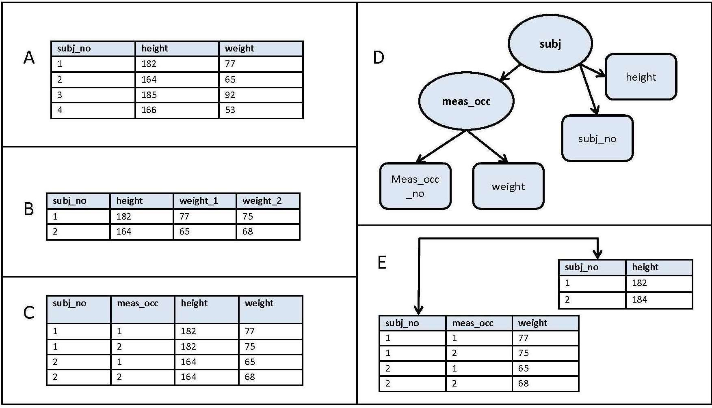

---

## 1. 데이터베이스(Database) 소개

### 1.1 데이터베이스(Database, DB)의 정의

우리가 흔히 듣는 데이터베이스(Database)란 무엇일까? 일단 데이터베이스의 정의를 찾아보면 다음과 같다.

 

> 데이터베이스는 컴퓨터 시스템에 전자적으로 저장되는 구조화된 정보 또는 데이터의 조직화된 집합이다.
{: .prompt-info }

 

여기서 말하는 조직화된 집합(organized collection)은 혼돈 상태로 존재하는 데이터를 분류하고 질서를 부여한 상태를 말한다. 예를 들어 뒤에서 설명할 관계형 데이터베이스(Relational Database)는 관련된 데이터들이 테이블과 인덱스를 이용해서 논리적으로 모여있다.

 

datawiz - data organization

 

---

### 1.2 데이터베이스 관리 시스템(Database Management System, DBMS)

그러면 데이터베이스와 함께 항상 거론되는 데이터베이스 관리 시스템(DBMS)는 무엇일까? DBMS의 정의는 다음과 같다.

 

> *사용자에게 데이터베이스를 정의하고 관리하는 기능을 제공하는 소프트웨어 시스템. 데이터베이스 자체 또는 데이터베이스 내의 데이터에 여러가지 작업을 할 수 있는 기능을 제공한다.*

 

DBMS가 제공해주는 기능에는 다음이 포함될 수 있다.

* 데이터베이스의 구조, 스키마(Schema)를 정의 할 수 있다
* 데이터 쿼리 사용(Querying) : 데이터에 대해서 우리가 흔히 말하는 CRUD 등의 작업이 가능하다
* 동시성 제어(Concurrency Control) : 동시에 실행되는 여러 개의 트랜잭션(Transaction)들이 성공적으로 마칠 수 있도록 제어를 지원한다
* 재해에 대비한 데이터 복구 및 백업을 지원한다

 

이외에도 쿼리 최적화(Query Optimization), 데이터의 무결성(Data Integrity) 보장, 보안 등 여러가지 기능을 지원할 수 있다.

 

> * 위에서 언급하는 쿼리, 스키마, 동시성 등의 내용은 뒤에서 다룰 예정이다.
>
> * SQL(Structured Query Language)은 관계형 데이터베이스(RDBMS)와 상호작용을 가능하게 해주는 언어이다.
{: .prompt-warning }

 

DBMS는 크게 두 갈래로 구분할 수 있다. 

1. **관계형 데이터베이스(RDBMS)**
   * 관계형 데이터 모델(Relation Model)을 이용하는 데이터베이스
   * 대부분 SQL을 이용한다
   * 대표적인 예시 : MySQL, Oracle Database, PostgreSQL 등
2. **NoSQL 데이터베이스**
   * SQL을 사용하지 않는다는 `"No SQL"`을 의미하는 것이 아니라 `"Not Only SQL"`을 의미 한다
   * NoSQL은 그 안에서도 Document-Oriented, Key-Value Storage, Graph DB 등 여러가지 종류로 구분할 수 있다 
   * 대표적인 예시 : MongoDB, Cassandra, Redis 등

 

참고로 DB와 DBMS는 다른 개념이지만, 보통 둘을 혼용해서 DB라는 표현으로 사용하는 경우가 많다. 뭘 지칭하는지는 상황에 맞게 판단하면 된다.

 

---

### 1.3 Metadata

데이터조직의 입장에서 메타데이터(Metadata)란 무엇일까? 메타 데이터의 정의를 찾아보면 다음과 같다.

 

> 메타데이터(Metadata)는 데이터에 관한 데이터이다. 데이터에 관한 구조화된 데이터이고, 다른 데이터를 설명해주는 데이터이다.

 

우리가 DB를 정의하다보면 데이터에 대한 부가적인 데이터가 계속 발생한다. 여기서 발생하는 부가적인 데이터가 메타 데이터이다. 이 부가적인 데이터는 DB를 정의하거나 기술하는 데이터인 경우가 많다. 메타데이터 또한 DB에 저장/관리 된다. 이 처럼 다른 데이터에 대한 정보를 제공하는 메타데이터는 다음과 같은 유형으로도 분류가 가능하다. 

 

1. **기술 메타데이터(Technical Metadata)**
   * **데이터의 구조나 기술적인 측면을 중점에 둔다**
   * 예시
     * 데이블의 이름이나 행, 열에 대한 정보를 기록하는 테이블
     * 데이터 웨어하우스에 존재하는 데이터베이스의 이름
     * 각 열이 가지는 데이터 타입을 기록한 데이터 카탈로그(Data Catalog)

2. **운영 메타 데이터(Operational Metadata)**
   * 문제 해결 및 워크 플로우 최적화에 유용
   * 예시
     * 시스템의 프로세스를 설명
     * 작업의 시작 및 종료 시간
     * 디스크 사용량
     * 데이터 이동 및 사용자의 액세스 추적에 대한 기록

3. **비즈니스 메타데이터(Business Metadata)**
   * 비즈니스적인 관점에서 관련된 메타데이터
   * 기술적인 메타데이터가 데이터의 구조와 형식에 집중한다면, 비즈니스 메타데이터는 비즈니스에 의미가 있는 데이터에 집중한다
   * 예시
     * 데이터 획득, 데이터간 또는 데이터와 소스간 연결에 대한 정보
     * 고객, 매출, 프로덕트 코드 등과 같은 용어
     * 데이터 웨어하우스 시스템에 대한 문서

 

위에서 설명 기술, 운영, 비즈니스 데이터 등과 같은 분류는 사실 회사마다 다르게 해석하거나 사용할 수 있다. 그냥 *"대충 이렇게 분류할 수 있고, 이런 의미를 가질수 있구나~"* 정도로만 받아들이면 될 것 같다.

 

> 카탈로그(Catalog)는 조직화된 메타데이터의 모음 또는 관리하는 도구로 생각해도 편하다.
{: .prompt-info }

 

---

## 2. Modeling

### 2.1 데이터 모델링(Data Modeling)의 정의

데이터 모델링(Modeling)이라는 것은 무엇일까?

 

> 데이터 모델링은 조직의 정보 수집과 관리 시스템을 정의하는 시각적 표현 또는 청사진을 생성하는 프로세스입니다. 이 청사진 또는 데이터 모델은 데이터 분석자, 과학자, 엔지니어와 같은 다양한 이해관계자들이 조직의 데이터에 대한 통일된 개념을 생성할 수 있게 돕습니다.

 

데이터 모델링은 다음과 같이 설명을 할 수도 있다.

* 현실세계의 데이터에 대해 약속된 표기법에 의해 표현하는 과정
* 데이터베이스를 구축하기 위한 분석/설계의 과정
* 정보 시스템을 구축하기 위한 데이터 관점의 업무 분석 기법

 

DB 구조를 추상화해서 표현할 수 있는 데이터 모델(Data Model)을 만들어가는 것을 데이터 모델링이라고 할 수 있다.

**위의 어려운 말들을 쉽게 이야기 하자면, 데이터를 어떤식으로 DB에 저장할지 정하는 모든 과정을 데이터 모델링이라고 생각하면 편하다.**

 

---

### 2.2 데이터 모델링의 3단계

현실 세계에서 데이터베이스까지 만들어지는 과정은 시간에 따라 진행되는 과정을 추상화해서 표현하면 다음과 같이 **개념적(Conceptual) →논리적(Logical, Represential) → 물리적(Physical, Low-level) 데이터 모델링**으로 표현할 수 있다. 

 

SQL 전문가 가이드

 

1. 개념적 데이터 모델링(Conceptual, High-level)
   * 추상화 수준이 높고 업무중심적이고 포괄적인 수준의 모델링을 진행한다
   * 일반 사용자들도 이해할 수 있는 개념으로 이루어지고, 보통 비즈니스 요구사항을 추상화하여 기술할 때 사용
   * 이 단계의 주요한 활동은 핵심 엔티티(Entity)와 그들 간의 관계를 발견하고, 그것을 표현하기 위한 엔티티-관계 다이어그램(Entity-Relation Diagram) 생성

2. 논리적 데이터 모델링(Logical, Represential)
   * 시스템으로 구축하고자 하는 업무에 대해 Key, Attribute, Relation 등을 정확하게 표현
   * 종류에는 relational data model, object data model, object-relational data model 등이 있다
   * 이 단계에서 수행하는 중요한 활동 중 하나는 정규화(Normalization)
     * 정규화를 간단하게 설명하자면 데이터 모델의 일관성을 확보, 데이터 중복 제거, 속성을 적절히 배치하는 작업 등을 통해 신뢰성있는 데이터 구조를 얻는 것이 목표이다

3. 물리적 데이터 모델링(Physical, Low-level)
   * 실제로 데이터베이스에 이식할 수 있도록 성능, 저장 등의 물리적인 환경을 고려하고 설계한다
   * 이 단계에서는 테이블, 칼럼 등으로 표현되는 물리적인 저장구조와 사용될 저장 장치, 자료를 추출하기 위해 사용될 접근 방법 등이 결정된다

 

많은 경우 개념적 데이터 모델링과 논리적 데이터 모델링은 한꺼번에 같이 수행되며, 논리적 데이터 모델링으로 수행된다.

 

---

### 2.3 데이터 독립성(Data Independence)

대이터 모델링에서의 데이터 독립성(Data Independence)에 대해 알아보자. 데이터 독립성의 정의를 찾아보면 다음과 같다.

 

> 데이터베이스 내의 데이터와 이들을 사용하는 응용 프로그램이 서로 영향을 받지 않는 것. 데이터가 바뀌더라도 프로그램이 바뀌지 않도록 하고, 응용 프로그램이 바뀌더라도 저장된 데이터 구조가 영향을 받지 않도록 해서 데이터가 여러 사람에 의해 다른 방법으로 사용될 수 있도록 한다.

 

간단하게 말하자면 **데이터 독립성은 데이터베이스 구조와 데이터가 서로 영향을 미치지 않는 것**을 의미한다. 그러면 데이터 독립성은 왜 필요한 것일까?

 

https://www.geeksforgeeks.org/introduction-of-3-tier-architecture-in-dbms-set-2/

 

위의 3-tier 아키텍쳐를 살펴보자. 이 아키텍쳐의 목적은 유저 애플리케이션 계층으로 부터 물리적인 데이터베이스(Physical Database)를 분리해서 데이터 독립성을 얻는 것이다.

 

1. 외부 스키마(External Schema)
   * 실제 사용자들이 바라보는 스키마
   * user view로도 불림
   * 특정 유저들이 필요로 하는 데이터만 표현하고, 알려줄 필요가 없는 데이터는 숨긴다
   * 논리적 데이터 모델을 통해서 표현한다

2. 개념적 스키마(Conceptual Schema)
   * 전체 데이터베이스에 대한 구조를 기술한다
   * 데이터베이스에 저장되는 데이타와 그들간의 관계를 표현한다
   * 내부적 스키마를 한번 추상화 시킨 스키마이고, 물리적인 저장 구조에 대한 내용은 숨긴다

3. 내부적 스키마(Internal Schema)
   * 물리적으로 데이터가 어떻게 저장되어 있는지 물리적 데이터 모델을 통해서 표현
   * 데이터 스토리지, 데이터 구조 등의 실체가 있는 내용을 기술한다
   * 실제로 데이터가 존재하는 곳은 internal level

 

이런 아키텍쳐를 통해서 각 단계의 독립성을 유지하고, 단순히 매핑(Mapping)을 바꿔주는 것으로 계층별 View에 영향을 주지 않고 변경하는 것이 용이하다.

아주 옛날의 데이터베이스들은 개념적 스키마(Conceptual Schema)가 없는 경우가 많았다. 대체로 물리적인 저장 구조와 그 디테일에만 집중을 했고, 데이터 독립성이 거의 없었던 만큼 데이터베이스 스키마 또는 물리적 저장소에 변경이 일어나는 경우 유저 애플리케이션에도 영향을 미쳤다.

 

> * 대부분 DBMS에서 three-level이 완벽하게 나뉘어지지는 않는다.
>
> * 데이터베이스의 스키마(Schema)는 데이터베이스 전체 또는 일부의 논리적인 구조를 표현하는 것으로 데이터베이스 내에서 데이터가 어떤 구조로 저장되는지 나타낸다.
{: .prompt-info }

---

## Reference

1. [한국 데이터 산업 진흥원 - SQL 전문가 가이드](https://dataonair.or.kr/db-tech-reference/d-guide/sql/)
2. [인프런 쉬운코드 - 데이터베이스](https://www.inflearn.com/course/%EB%B0%B1%EC%97%94%EB%93%9C-%EB%8D%B0%EC%9D%B4%ED%84%B0%EB%B2%A0%EC%9D%B4%EC%8A%A4-%EA%B0%9C%EB%A1%A0/dashboard)
3. [javatpoint - what is rdbms](https://www.javatpoint.com/what-is-rdbms)

