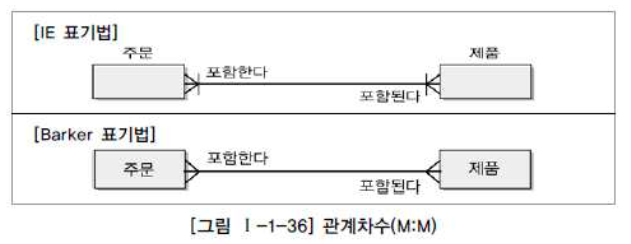

---

> 이번 포스트는 책에서는 어떤식으로 용어를 정의하는지 알아보기 위해서 정리한 내용이다. 실제 개발시 사용하는 내용과 괴리감이 존재할 수 있기 때문에 훑어 보는 정도로 넘어가면 될 것 같다.

---

## 1. Entity, Attribute, Relationship

### 1.1 엔티티(Entity) 

엔티티를 정의하자면 다음과 같다.

<br>

> * 엔티티(Entity)는 **"업무에 필요하고 유용한 정보를 저장하고 관리하기 위한 집합적인 것(Thing)"**이다. 
> * 엔티티는 업무 활동상 지속적인 관심을 가지고 있어야 하는 대상으로서 그 대상들 간에 동질성을 지닌 인스턴스들이나 그들이 행하는 행위의 집합으로 정의할 수 있다

<br>

엔티티는 다음과 같은 특징들을 가질 수 있다.

* 반드시 해당 업무에서 필요하고 관리하고자 하는 정보이어야 한다
* 유일한 식별자(Unique Indentifier)에 의해 식별이 가능해야 한다
* 영속적으로 존재하는 인스턴스의 집합이어야 한다
* 반드시 속성(Attribute)이 있어야 한다
* 다른 엔티티와 최소 한 개 이상의 관계(Relationship)가 있어야 한다

<br>

엔티티를 유형과 무형에 따라서 분류를 하면 다음과 같이 분류할 수 있다.

1. 유형 엔티티(Tangible Entity) : 물리적 형태를 가지며 지속적인 엔티티
   * 제품, 고객 등
2. 개념 엔티티(Conceptual Entity) : 물리적 형태는 존재하지 않고 관리해야할 개념적 정보로 구분되는 엔티티
   * 부서, 보험 상품, 강의 등
3. 사건 엔티티(Event Entity) : 비즈니스 프로세스에 따라 발생되는 엔티티
   * 구매, 판매 등

<br>

---

### 1.2 속성(Attribute)

속성(attribute)을 정의하자면 다음과 같다.

<br>

> 데이터 모델링 관점에서 속성을 정의하자면, **"업무에서의 엔티티의 정보를 나타내고 의미상 더 이상 분리되지 않는 최소의 데이터 단위"**이다. 엔티티의 분류, 상태, 이름, 특성 등을 나타내는 항목으로 생각하면 편하다. 

<br>

다시 한번 속성의 정의를 정리하자면

* 업무에서 필요함
* 의미상 더 이상 분리되지 않음(atomic)
* 엔티티를 설명하고 인스턴스의 구성요소가 됨

<br>

속성의 특징은 다음과 같다.

* 해당 업무에서 관리하고 필요로하는 정보이어야 함
* 하나의 속성에는 하나의 값만 갖는다
  * 만약 하나의 속성에 다중값이 존재하면 별도의 엔터리를 이용하여 분리한다
* 동일 의미의 여러 속성이 있으면 안됨
* 주식별자에게 함수적으로 종속된다 → 기본키가 달라지면 속성의 값도 변경이 될 수 있다

<br>

_entity, attribute, instance_

* 위에서 표현한 instance는 튜플(tuple), 로우(row)라는 명칭으로 더 많이 사용한다

<br>

특성에 따라 속성을 분류하면 다음과 같다.

1. 기본 속성
   * 비즈니스 프로세스에서 도출한 본래의 속성
   * ID, 연락처, 등록일 등
2. 설계 속성
   * 데이터 모델링 과정에서 발생되는 속성
   * 상품코드 등
3. 파생 속성
   * 다른 속성에 의해서 만들어지는 속성
   * 합계, 평균, 표준편차 등

<br>

---

### 1.3 관계(Relationship)

관계를 정의하자면 다음과 같다.

<br>

> 엔티티의 인스턴스 사이의 논리적인 연관성으로서 존재의 형태로서나 행위로서 서로에게 연관성이 부여된 상태

<br>

관계는 엔티티와 엔티티 간 연관성을 표현하기 때문에 엔티티의 정의에 따라 영향을 받기도 하고, 속성 정의 및 관계 정의에 따라서도 다양하게 변할 수 있다. 두 개의 엔티티 사이에 관계를 정의할 때 다음 사항을 체크할 수 있다.

* 두 엔티티 사이에 관심있는 연관규칙이 존재하는가?
* 두 엔티티 사이에 정보의 조합이 발생하는가?
* 관계 연결에 대한 규칙이 서술되어 있는가?
* 관계 연결을 가능하게 하는 동사가 있는가?

<br>

관계명을 정할 때 다음과 같은 기준을 적용한다.

* 관계에 엔티티가 참여하는 형태를 정의한다
* 애매한 동사를 피한다
  * "관계된다", "관련이 있다" 등은 두 엔티티간 어떤 상태가 존재하는지 파악 불가능
* 현재형으로 표현한다
  * "수강 신청한다", "강의를 한다" 처럼 현재형으로 표현해야한다

<br>




<p align='center'>SQL 전문가 가이드</p>

<br>


<p align='center'>ER Diagram (보통은 IE표기법으로 표현한다)</p>

<br>

정리하면,

* 엔티티(Entity)는 데이터 모델링을 사용하기 위한 객체이며, 제품(Product) 처럼 눈에 보이는(Tangible) 개념일 수도 있고, 주문(Order) 처럼 눈에 보이지 않는 개념이 될 수도 있다. (데이터베이스의 테이블로 생각하면 편함)
* 속성(Attribute)은 업무에서 필요한 엔티티의 분류, 상태, 이름, 특성 등을 나타내는 항목으로 생각하면 편하다. (이때 의미상 더이상 분리되지 말아야한다)
* 관계(Relationship)는 엔티티와 엔티티 간의 연관성을 표현한 것.

<br>

---

## 2. 식별자(Identifier)

### 2.1 식별자의 정의

식별자는 다음과 같다.

<br>

> 식별자(Identifier)란 하나의 엔티티에 구성되어 있는 여러 개의 속성 중에 엔티티를 대표할 수 있는 속성을 의미한다. 엔티티를 구성하는 인스턴스들을 구분해주는 구분자를 식별자라고 할 수 있다. 
>
> 하나의 엔티티는 반드시 하나의 유일한 식별자(Unique Identifier)가 존재해야 한다. (유일 식별자는 다중속성으로 이루어질 수 있음)

<br>


<p align='center'>SQL 전문가 가이드</p>

<br>

여기서 짚고 넘어가야할 것은 키(Key)와 식별자(Identifier)라는 용어는 업무적으로 구분이 되어 있다. **식별자는 논리 데이터 모델링 단계에서 사용되고, 키는 데이터베이스 테이블에 접근을 위한 매개체로서 물리 데이터 모델링 단계에서 사용된다.** 

<br>

---

### 2.2 식별자의 분류

식별자는 다음과 같이 분류할 수 있다.

1. 대표성 여부
   * **주식별자 : 엔티티 내에서 각 인스턴스를 구분할 수 있는 구분자이며, 타 엔티티와 참조관계를 연결할 수 있다**
   * 보조 식별자 : 엔티티 내에서 각 인스턴스를 구분할 수 있는 구분자이지만, 대표성을 가지지 못해서 타 엔티티와 참조관계를 연결하지 못한다
2. 스스로 생성 여부
   * 내부 식별자 : 엔티티 내부에서 스스로 만들어지는 식별자
   * 외부 식별자 : 타 엔티티와의 관계를 통해 타 엔티티로부터 받아오는 식별자(물리 모델링 단계의 Foreign Key)
3. 단일 속성 여부
   * 단일 식별자 : 하나의 속성으로 구성된 식별자
   * 복합 식별자 : 다중 속성으로 구성된 식별자
4. 대체 여부
   * 본질 식별자 : 업무에 의해 만들어지는 식별자
   * 인조 식별자 : 업무적으로 만들어지지는 않지만 원조식별자가 복잡한 구성을 가지고 있기 때문에 인위적으로 만든 식별자

<br>

---

### 2.3 주식별자의 특징

이때 **주식별자**의 경우 다음의 특징을 만족한다.

* 유일성 : 주식별자에 의해 엔티티내에 모든 인스턴스들을 유일하게 구분함
  * 예시) 사원번호가 주식별자가 모든 직원들에 대해 개인별로 고유하게 부여된다

 

* 최소성 : 주식별자를 구성하는 속성의 수는 유일성을 만족하는 최소의 수가 되어야 함
  * 예시) 사원번호만으로도 고유한 구조인데 사원분류코드+사원번호 구조로 식별자를 구성하면 부적절하다

 

* 불변성 : 주식별자가 한 번 특정 엔티티에 지정되면 그 식별자의 값을 변하지 않아야 함
  * 예시) 사원번호의 값이 변한다는 의미는 이전기록이 말소되는 개념임


* 존재성 : 주식별자가 지정되면 반드시 데이터 값이 존재(Null 불가능)
  * 예시) 사원번호가 없는 사원은 존재할 수 없음

<br>

**주식별자를 도출하는 기준**은 다음을 권장한다.

* 해당 없무에서 자주 이용되는 속성을 주식별자로 지정한다
* 명칭, 내역 등과 같이 이름으로 기술되는 것들은 주식별자로 지정하지 않도록 한다
* 주식별자의 속성이 복합으로 구성되어 있을 경우, 속성의 수가 너무 많지 않도록 한다 → 너무 많은 경우 인조식별자를 생성하는 것이 더 효율적일 수 있음

<br>

---

### 2.4 식별자와 비식별자 관계

비식별자 관계는 다음과 같다.

> 부모 엔티티로부터 속성을 받았지만 자식 엔티티의 주식별자로 사용하지 않고 일반적인 속성으로만 사용하면 *비식별자 관계(Non-Identifying Relationship)*라고 한다

[더 알아보기](https://dataonair.or.kr/db-tech-reference/d-guide/sql/?mod=document&uid=329)

<br>

---

## 3. 테이블(Table), 키(Key)

### 3.1 테이블(Table)

> 데이터는 관계형 데이터베이스의 기본 단위인 테이블 형태로 저장된다. 모든 자료는 테이블에 등록이 되고, 우리는 테이블로부터 원하는 자료를 꺼내 올 수 있다.

<br>


<p align='center'>SQL 전문가 가이드</p>

<br>

테이블은 특정한 주제와 목적으로 만들어지는 일종의 데이터 집합이다. 데이터베이스의 관점에서 설명하자면, 테이블은 데이터를 저장하는 객체(Object)로서 관계형 데이터베이스(RDBMS)의 기본 단위이다.

<br>


<p align='center'>javatpoint - what is rdbms</p>

* 열(Column) : 테이블에서 세로 방향으로 이루어진 하나하나의 특정 속성(Attribute)
* 행(Row) : 테이블에서 가로 방향으로 이루어진 연결된 데이터. 튜플(Tuple)이라고도 한다. (Record로 표현하기도 함)
* 도메인(Domain)은 특정 속성이 가져야하는 값의 범위로 보면 편하다 

<br>

> 데이터를 저장할 때 모든 데이터를 하나의 테이블에 저장하지는 않는다. 보통은 여러 테이블로 분할하면서 불필요한 중복값을 제거한다. 이 과정을  정규화(Normalization)라고 한다. 정규화는 뒤에서 더 자세히 알아볼 예정이다.

> 테이블을 릴레이션(Relation)이라고 표현하기도 한다.

<br>

---

### 3.2 키(Key)의 정의

> 데이터베이스에서 키(Key)는 조건에 만족하는 튜플(Tuple)을 찾거나, 순서대로 정렬할 때 다른 튜플들과 구분할 수 있는 기준이 되는 속성이다.
>
> 키는 속성 하나(single attribute)로만 이루어지지 않고 다중 속성(multiple attributes)으로 이루어진 속성들의 집합(attribute set)일 수 있다.

<br>

위의 식별자에서도 언급했지만 **식별자는 논리 데이터 모델링 단계에서 사용되고, 키는 데이터베이스 테이블에 접근을 위한 매개체로서 물리 데이터 모델링 단계에서 사용된다.** 

<br>

키의 종류를 살피기 전에 유일성과 최소성의 개념을 다시 살펴보자.

* 유일성(uniqueness): 하나의 키로 튜플을 유일하게 식별
* 최소성(minimality): 키를 구성하는 속성들 중 필요한 최소한의 속성들로 키를 구성

<br>

---

### 3.3 키(Key)의 종류


<p align='center'>EMPLOYEE라는 테이블과 그 속성들</p>

<br>

키의 종류는 다음과 같다.

1. 슈퍼 키(Super Key)

   * 튜플을 유일(unique)하게 식별할 수 있는 키 (**유일성 만족**)
   * 예) ```{employee_id}```, ```{employee_id, name, department}```, ```{name, email}```
     * ```{employee_id}``` 이나 ```{name, email}``` 처럼 튜플을 유일하게 식별해주는 속성의 집합(attribute set)

   * 다른 테이블로 예시를 들면
     * 예) ```{team_name}``` + ```{back_number}``` 

2. 복합 키(Composite Key)

   * 2개 이상의 속성을 이용하는 키

3. 후보 키(Candidate Key)

   * 슈퍼키 중에서 어느 한 속성이라도 제거하면 유일하게 튜플을 식별할 수 없는 키
   * 예) ```{employee_id}``` 
   * 예) ```{team_name, back_number}```에서 ```team_name```이든 ```back_number```든 하나라도 제거하면 유일 식별 불가능

4. **기본 키(Primary Key)**

   * **튜플을 유일하게 식별하기 위해 선택된 후보 키**
   * **유일성, 최소성** 만족
   * 보통 최소성에 의해 속성의 수가 적은 후보 키를 고름
   * 예) ```{employee_id}```

5. 대체 키(Alternate Key)

   * 후보 키 중에서 기본 키로 선택되지 않은 키
6. 외래 키(Foreign Key)

   * 다른 테이블의 PK(Primary Key, 기본키)를 참조하는 키
   * 예) 아래 그림의 {팀 코드}

<br>


<p align='center'>SQL 전문가 가이드</p>

<br>

> 기본키(PK)는 테이블에 밑줄 쳐서 표시하기도 한다.
{: .prompt-tip }

---

## Reference

1. [한국 데이터 산업 진흥원 - SQL 전문가 가이드](https://dataonair.or.kr/db-tech-reference/d-guide/sql/)

2. [인프런 쉬운코드 - 데이터베이스](https://www.inflearn.com/course/%EB%B0%B1%EC%97%94%EB%93%9C-%EB%8D%B0%EC%9D%B4%ED%84%B0%EB%B2%A0%EC%9D%B4%EC%8A%A4-%EA%B0%9C%EB%A1%A0/dashboard)