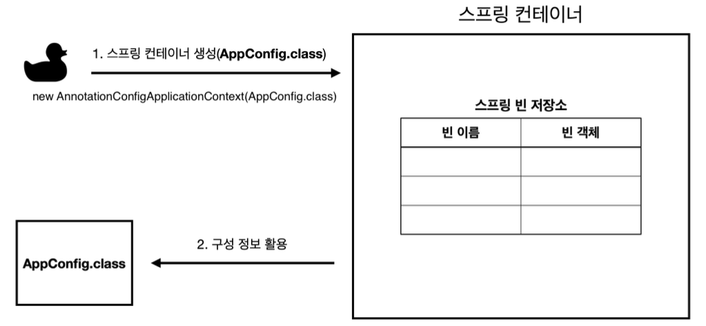
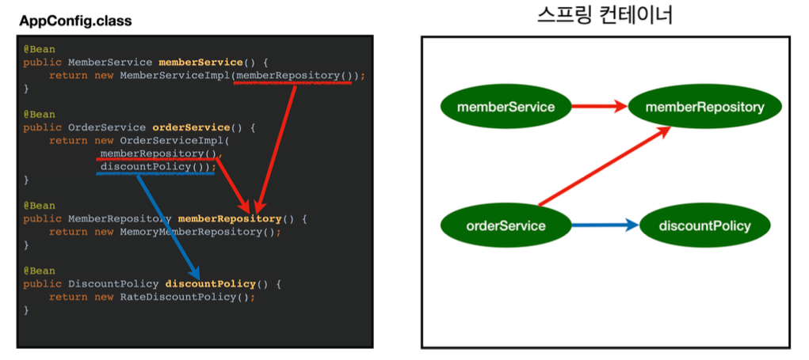
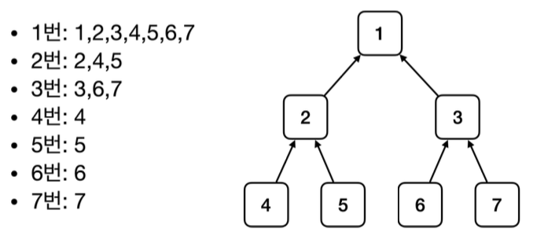
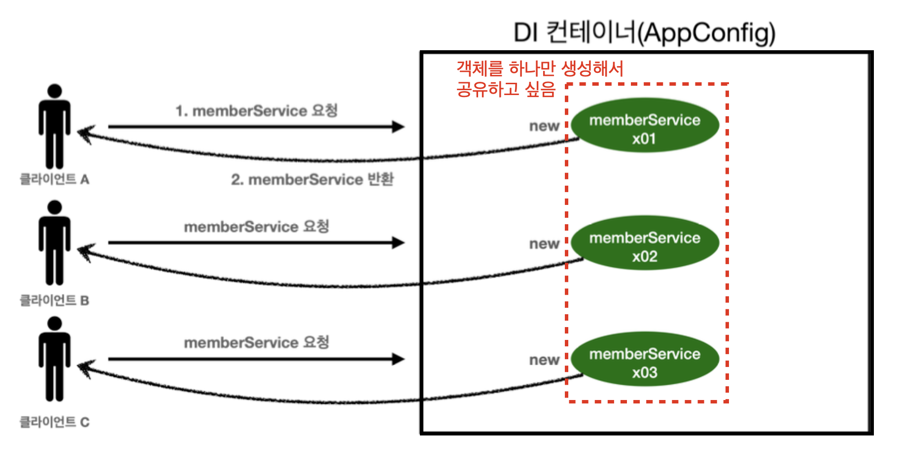
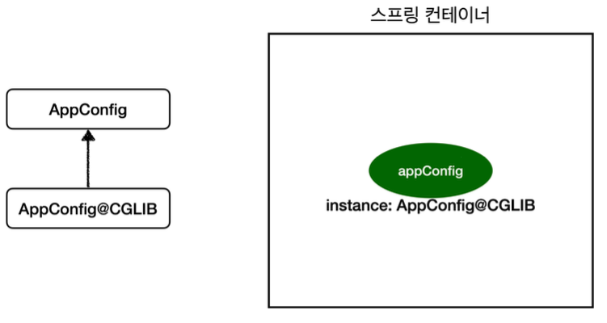

---

## 1. Spring Container & Bean

스프링 컨테이너와 스프링 빈에 대해서 알아보자.

<br>

### 1.1 스프링 컨테이너

```java
ApplicationContext applicationContext = new AnnotationConfigApplicationContext(AppConfig.class);
```

* 스프링 컨테이너 생성
* ```ApplicationContext``` : 스프링의 컨테이너를 나타내는 인터페이스
  * 빈의 수명주기, 의존관계, 설정 등을 관리


* ```AnnotationConfigApplicationContext``` : ```@Configuration```을 이용해서 스프링 컨테이너에 설정을 제공해주고 싶을 때 사용하는 ```ApplicationContext```의 구현체


* ```AppConfig.class```를 넘겨줘서 해당 설정을 사용한다 

<br>

> 스프링 컨테이너는 ```BeanFactory```와 ```ApplicationContext```를 구분해서 이야기 한다.

<br>

스프링에서 컨테이너가 생성되는 과정을 살펴보자.

<br>

  

<p align='center'>스프링 컨테이너 생성</p>

* 스프링 컨테이너를 생성할 때 구성 정보를 지정해야 한다

<br>

  

<p align='center'>스프링 빈 등록</p>

* 컨테이너는 파라미터로 넘어온 설정 클래스 정보를 이용해서 스프링 빈을 등록한다
* ```@Bean```이 붙은 메서드를 전부 호출해서 반환된 객체를 등록한다
* **빈 이름의 경우 항상 다른 이름을 부여해야 한다**

<br>

  

<p align='center'>스프링 빈 의존관계 설정</p>

* 스프링 컨테이너는 설정 정보를 참고해서 의존관계 주입(DI)
* 여기서 코드로 스프링 빈을 등록할 때 생성자를 호출하면서 DI도 한꺼번에 처리된다
  * 위의 경우 이해를 돕기 위해 개념적으로 나누어서 설명하고 있다
* 스프링 컨테이너에서 DI에 관한 내용은 [`@Autowired`](https://seungki1011.github.io/posts/springbasic-5-component-scan-autowired/#2-%EC%9D%98%EC%A1%B4%EA%B4%80%EA%B3%84-%EC%9E%90%EB%8F%99-%EC%A3%BC%EC%9E%85autowired)에서 더 자세하게 다룸

<br>

---

### 1.2 스프링 빈 조회

이제 스프링 컨테이너에서 데이터를 조회해보자.

<br>

#### 1.2.1 컨테이너에 등록된 모든 빈 확인

컨테이너에 등록된 모든 빈들을 확인해보자.

<br>

`ApplicationContextInfoTest`

```java
public class ApplicationContextInfoTest {
    AnnotationConfigApplicationContext ac = new AnnotationConfigApplicationContext(AppConfig.class);

    @Test
    @DisplayName("Print All Beans")
    void findAllBean() {
        String[] beanDefinitionNames = ac.getBeanDefinitionNames();
        for (String beanDefinitionName : beanDefinitionNames) {
            Object bean = ac.getBean(beanDefinitionName);
            System.out.println("name = "+beanDefinitionName + " object = "+ bean);
        }
    }
}
```

```
name = org.springframework.context.annotation.internalConfigurationAnnotationProcessor object = org.springframework.context.annotation.ConfigurationClassPostProcessor@46b61c56
name = org.springframework.context.annotation.internalAutowiredAnnotationProcessor object = org.springframework.beans.factory.annotation.AutowiredAnnotationBeanPostProcessor@2e48362c
... 생략
name = appConfig object = de.springbasic1.AppConfig$$SpringCGLIB$$0@12d2ce03
name = memberService object = de.springbasic1.member.MemberServiceImpl@7e5c856f
name = orderService object = de.springbasic1.order.OrderServiceImpl@413f69cc
name = memberRepository object = de.springbasic1.member.MemoryMemberRepository@1f53a5dc
name = discountPolicy object = de.springbasic1.discount.RateDiscountPolicy@1b75c2e3
```

<br>

모든 빈이 아니라 애플리케이션의 빈만 출력하고 싶으면 다음을 추가하면 된다.

```java
@Test
@DisplayName("Print All Application Beans")
void findApplicationBean() {
    String[] beanDefinitionNames = ac.getBeanDefinitionNames();
    for (String beanDefinitionName : beanDefinitionNames) {
        BeanDefinition beanDefinition = ac.getBeanDefinition(beanDefinitionName);

        if (beanDefinition.getRole() == BeanDefinition.ROLE_APPLICATION) {
            Object bean = ac.getBean(beanDefinitionName);
            System.out.println("name = "+beanDefinitionName + " object = "+ bean);
        }
    }
}
```

```
name = appConfig object = de.springbasic1.AppConfig$$SpringCGLIB$$0@2e48362c
name = memberService object = de.springbasic1.member.MemberServiceImpl@1efe439d
name = orderService object = de.springbasic1.order.OrderServiceImpl@be68757
name = memberRepository object = de.springbasic1.member.MemoryMemberRepository@7d446ed1
name = discountPolicy object = de.springbasic1.discount.RateDiscountPolicy@12d2ce03
```

* ```ac.getBeanDefinitionNames()``` : 스프링에 등록된 모든 빈 이름을 조회한다
* ```ac.getBean()``` : 빈 이름으로 빈 인스턴스(객체)를 조회한다 
* ```ROLE_APPLICATION``` : 직업 등록한 애플리케이션 빈
* ```ROLE_INFRASTRUCTURE``` : 스프링 내부에서 사용하는 빈

<br>

---

#### 1.2.2 빈 조회하기

스프링 빈을 조회하는 방법들에 대해 알아보자.

* ```ac.getBean(빈이름, 타입)```
* ```ac.getBean(타입)```
* 만약 조회 대상이 없다면 예외 발생

<br>

다음은 기본적인 스프링 빈을 조회하는 방법들이다.

<br>

`ApplicationContextBasicFindTest`

```java
public class ApplicationContextBasicFindTest {
    AnnotationConfigApplicationContext ac = new AnnotationConfigApplicationContext(AppConfig.class);

    @Test
    @DisplayName("Find with Bean Name")
    void findBeanByName() {
        MemberService memberService = ac.getBean("memberService", MemberService.class);

        System.out.println("memberService = " + memberService);
        // System.out.println("memberService.getClass() = " + memberService.getClass());
        Assertions.assertThat(memberService).isInstanceOf(MemberServiceImpl.class);
    }

    @Test
    @DisplayName("Find with Bean Type")
    void findBeanByType() {
        MemberService memberService = ac.getBean(MemberService.class); // 타입으로만 조회

        System.out.println("memberService = " + memberService);
        Assertions.assertThat(memberService).isInstanceOf(MemberServiceImpl.class);
    }

    @Test
    @DisplayName("Find with Specific Type, 구체 타입으로 조회") // 권장하지 않음
    void findBeanBySpecificType() {
        MemberService memberService = ac.getBean("memberService", MemberServiceImpl.class);

        Assertions.assertThat(memberService).isInstanceOf(MemberServiceImpl.class);
    }

    // 실패 테스트
    @Test
    @DisplayName("Find with Bean Name Failed")
    void findBeanByNameFail() {
        // MemberService memberService = ac.getBean("memberService", MemberService.class);
      
        // 오른쪽의 로직을 실행하면 왼쪽의 예외가 터져야 성공!
        org.junit.jupiter.api.Assertions.assertThrows(NoSuchBeanDefinitionException.class, () ->
                ac.getBean("xxxxx", MemberService.class)); // 스태틱 임포트 권장
    }
}
```

```
memberService = de.springbasic1.member.MemberServiceImpl@46b61c56
memberService.getClass() = class de.springbasic1.member.MemberServiceImpl
```

<br>

이번에는 동일한 타입이 둘 이상 존재하는 경우 스프링 빈을 조회하는 경우를 살펴보자.

* 타입으로 조회시 같은 타입의 빈이 둘 이상이면 오류가 발생한다 → 이때 빈 이름을 지정하자
* ```ac.getBeansOfType()```을 사용하면 해당 타입의 모든 빈을 조회할 수 있다

<br>

`ApplicationContextSameBeanFindTest`

```java
public class ApplicationContextSameBeanFindTest {
    // AppConfig 대신 아래에서 만든 SameBeanConfig를 사용
    AnnotationConfigApplicationContext ac = new AnnotationConfigApplicationContext(SameBeanConfig.class);

    // 1. 타입으로 빈 조회시 같은 타입이 둘 이상 존재하면 중복 오류 발생
    @Test
    @DisplayName("Find Bean with identical name - 중복 오류")
    void findBeanByDuplicate() {
        // MemberRepository bean = ac.getBean(MemberRepository.class);
        Assertions.assertThrows(NoUniqueBeanDefinitionException.class, () -> ac.getBean(MemberRepository.class));
    }

    // 2. 중복 오류가 발생하면 빈 이름을 지정하면 됨
    @Test
    @DisplayName("빈 이름 지정")
    void findBeanBYName () {
        // 조회하고 싶은 빈의 이름을 직접 지정하면 된다
        MemberRepository memberRepository = ac.getBean("memberRepository1", MemberRepository.class);
        assertThat(memberRepository).isInstanceOf(MemberRepository.class);
    }
    
    // 기존 AppConfig 수정하지 않기 위해서 SameBeanConfig을 새로 만들어서 사용
    @Configuration
    static class SameBeanConfig {
        @Bean
        public MemberRepository memberRepository1() {
            return new MemoryMemberRepository();
        }

        @Bean
        public MemberRepository memberRepository2() {
            return new MemoryMemberRepository();
        }
    }
}
```

<br>

중복 오류의 발생은 다음 처럼 나타난다.

```
org.springframework.beans.factory.NoUniqueBeanDefinitionException: No qualifying bean of type 'de.springbasic1.member.MemberRepository' available: expected single matching bean but found 2: memberRepository1,memberRepository2
```

<br>

만약 특정 타입을 모두 조회하고 싶으면 다음 처럼 조회하면 된다.

```java
// 3. 특정 타입 모두 조회하기
@Test
@DisplayName("Find all Beans of specific type")
void findAllBeanByType() {
    Map<String, MemberRepository> beansOfType =
            ac.getBeansOfType(MemberRepository.class);
        
    for (String key : beansOfType.keySet()) {
        System.out.println("key = " + key + " value = " +
                beansOfType.get(key));
    }

    System.out.println("beansOfType = " + beansOfType);
    assertThat(beansOfType.size()).isEqualTo(2); // 등록 된 빈 2개, 원래는 더 자세하게 검증함
}
```

```
key = memberRepository1 value = de.springbasic1.member.MemoryMemberRepository@d771cc9
key = memberRepository2 value = de.springbasic1.member.MemoryMemberRepository@36b4091c
beansOfType = {memberRepository1=de.springbasic1.member.MemoryMemberRepository@d771cc9, memberRepository2=de.springbasic1.member.MemoryMemberRepository@36b4091c}
```

<br>

---

#### 1.2.3 상속 관계의 빈 조회

* 부모 타입으로 조회하는 경우, 자식 타입도 함께 조회한다
* 자바 객체의 최고 부모인 ```Object``` 타입으로 조회하면 모든 스프링 빈을 조회한다

<br>

   

<p align='center'>상속 관계의 빈 조회</p>

* 예) ```2```번 빈을 조회하면 그 자식 타입인 ```4```, ```5```도 함께 조회
* 부모 타입으로 조회시 자식이 둘 이상 있으면 중복 오류가 발생한다 → 이때 빈 이름을 지정하자
* 특정 하위 타입으로 조회하는 방법도 있지만 권장하지는 않는다

<br>

---

### 1.3 BeanFactory, ApplicationContext

```BeanFactory```와 ```ApplicationContext```에 대하여 알아보자.

<br>

   

<p align='center'>BeanFactory, ApplicationContext</p>

* ```BeanFactory```
  * 스프링 컨테이너의 최상위 인터페이스
  * 스프링 빈을 조회하고 관리하는 역할을 담당한다
    * ```getBean()``` 제공
  * 지금까지 사용해왔던 대부분의 기능을 ```BeanFactory```가 제공했음
  * 지연 로딩(Lazy-loading) : 빈 사용의 요청을 받았을 때 빈을 로딩


* ```ApplicationContext```
  * ```BeanFactory```의 기능을 모두 상속받아서 제공한다
  * ```ApplicationContext```의 경우 빈을 관리하고 조회하는 기능을 포함해서 수 많은 부가기능을 제공한다
    *  ```MessageSource```를 이용한 국제화 기능
    *  ```EnvironmentCapable``` 을 이용한 환경변수 처리 기능
    *  ```ApplicationEventPublisher```를 이용한 애플리케이션 이벤트 기능
    *  ```ResourceLoader```를 이용한 리소스 조회 기능
    *  AOP
    *  위의 기능 외에도 여러가지 부가 기능
  * 즉시 로딩(Eager-loading) : 런타임 시작시 모든 빈을 미리 로딩

<br>

```ApplicationContext``` 는 ```BeanFactory```가 제공하는 기능을 포함해서 편리한 부가 기능을 지원한다. 대부분의 경우 ```ApplicationContext```를 사용한다. ```BeanFactory```, ```ApplicationContext```를 스프링 컨테이너라 부른다

<br>

> 스프링 컨테이너는 우리가 자바 코드로 설정 정보를 넘겼던 방법 외에도, XML 형식을 포함한 여러가지 형식의 설정 정보를 받아드릴 수 있다
>
> * ```AnnotationConfigApplicationContext``` : 우리가 사용했던 ```AppConfig.class```
> * XML을 이용하는 경우 ```GenericXmlApplicationContext```
>   * XML을 이용하는 레거시 프로젝트들이 아직 남아 있다
>   * XML 사용시 컴파일 없이 XML 파일을 변경하는 것 만으로도 빈 설정 변경이 가능 
> * 사용자가 정의한 형식을 사용하는것도 가능하다다
{: .prompt-info }


<br>

---

## 2. Singleton Container

싱글톤(Singleton) 컨테이너에 대해 알아보자.

<br>

### 2.1 스프링 없는 순수한 DI 컨테이너

싱글톤에 대해 들어가기 전에 스프링 없이 DI 컨테이너를 구현하는 경우의 문제점을 한번 보고 가자.

<br>

   

<p align='center'>싱글톤을 적용하지 않은 DI 컨테이너</p>

* 스프링이 없는 순수한 DI 컨테이너의 경우 요청을 할 때 마다 객체를 새로 생성한다
  * 1000개의 요청이 있으면 1000개의 객체가 생성된다 → 메모리 낭비가 심하다!


* 해당 객체가 딱 1개만 생성되도록 하고, 공유하도록 설계하면 어떨까? → 이것이 **싱글톤(Singleton)** 패턴

<br>

---

### 2.2 싱글톤 패턴(Singleton Pattern)

* 싱글톤 패턴은 클래스의 인스턴스가 딱 1개 생성되는 디자인 패턴이다
* 인스턴스가 2개 이상 생성되지 못하도록 막아야한다 → ```private``` 생성자를 사용해서 외부에서 임의로 ```new```를 사용하지 못하도록 막는다

<br>

코드로 한번 살펴보자.

<br>

```SingletonService``` - 동작원리 확인만 할 것이기 때문에 ```test``` 위치에 생성하자

```java
public class SingletonService {
    // 1. static 영역에 객체를 딱 1개만 생성
    private static final SingletonService instance = new SingletonService();

    // 2. public으로 열어서 인스턴스가 필요하면 이 static 메서드를 통해서만 조회하도록 허용
    public static SingletonService getInstance() {
        return instance;
    }

    // 3. 생성자를 private으로 선언해서 외부에서 new를 사용하지 못하도록 막는다
    private SingletonService() {}

    public void logic() {
        System.out.println("싱글톤 객체 로직 호출");
    }
}
```

<br>

`SingletonTest`

```java
public class SingletonTest {

    @Test
    @DisplayName("싱글톤 패턴을 적용한 객체 사용")
    public void singletonServiceTest() {
        // private으로 생성자를 막아두었다
        // new 사용시 컴파일 오류가 발생
        // new SingletonService();

        //1. 조회: 호출할 때 마다 같은 객체를 반환
        SingletonService singletonService1 = SingletonService.getInstance();
        //2. 조회: 호출할 때 마다 같은 객체를 반환
        SingletonService singletonService2 = SingletonService.getInstance();

        //참조값이 같은 것을 확인
        System.out.println("singletonService1 = " + singletonService1);
        System.out.println("singletonService2 = " + singletonService2);

        // singletonService1 == singletonService2
        assertThat(singletonService1).isSameAs(singletonService2);
        singletonService1.logic();
    }
}
```

```
singletonService1 = de.springbasic1.singleton.SingletonService@6156496
singletonService2 = de.springbasic1.singleton.SingletonService@6156496
싱글톤 객체 로직 호출
```

* ```SingletonService```에 대한 인스턴스가 오로지 1 개만 생성되며, 반복적으로 호출해도 같은 객체 인스턴스를 반환한다는 것을 확인할 수 있다
* 싱글톤 패턴 구현에는 여러 방법이 존재한다

<br>

---

### 2.3 스프링의 싱글톤 컨테이너

싱글톤 패턴은 만들어진 객체를 공유해서 효율적으로 사용할 수 있다는 장점을 가지고 있지만 다음과 같은 단점들도 존재한다.

* 싱글톤 패턴 구현 코드가 많이 들어간다
* 의존 관계상 클라이언트가 구체 클래스에 의존한다 → DIP 위반, OCP 위반 가능성이 높다
* 테스트가 어렵다
* 내부 속성의 변경이나 초기화가 어렵다
* ```private```으로 인한 자식 클래스 생성이 어렵다
* 유연성이 떨어진다

<br>

**스프링 컨테이너는 이런 싱글톤 패턴의 문제점들을 해결하면서, 객체 인스턴스를 싱글톤으로 관리한다. (스프링 빈이 싱글톤으로 관리된다.)**

* 스프링 컨테이너는 객체 인스턴스를 싱글톤으로 관리한다


* 스프링 컨테이너가 싱글톤 컨테이너의 역할을 한다
  * 싱글톤 객체를 생성하고 관리하는 기능을 싱글톤 레지스트리라고 한다


* 스프링 컨테이너의 이러한 기능 덕분에 싱글턴 패턴의 단점들을 해결하면서 객체를 싱글톤으로 유지할 수 있다
  * 싱글톤 패턴을 위한 지저분한 코드 불필요
  * DIP, OCP, ```private``` 생성자로 부터 자유롭게 싱글톤 사용

<br>

   

<p align='center'>싱글톤 컨테이너를 적용 후</p>

* 스프링 컨테이너의 빈 등록은 디폴트 스코프(Scope)가 싱글톤 방식이지만, 싱글톤 방식만 지원하는 것은 아니다 → 요청할 때 마다 새로운 객체를 생성해서 반환하는 것도 가능하다

<br>

---

### 2.4 싱글톤 방식의 주의점

싱글톤 방식을 사용할 때의 주의점에 대해서 알아보자.

* 싱글톤 패턴을 사용하든, 싱글톤 컨테이너 방식을 사용하든, 객체 인스턴스를 하나만 생성해서 공유하는 싱글톤 방식은 여러 클라이언트가 하나의 같은 객체 인스턴스를 공유하기 때문에 **싱글톤 객체는 상태를 유지(stateful)하게 설계하면 안된다**


* **무상태(stateless)하게  설계해야 한다**
  * 특정 클라이언트에 의존적인 필드가 있으면 안된다
  * 틀정 클라이언트가 값을 변경할 수 있는 필드가 있으면 안된다
  * 가급적 읽기만 가능해야 한다
  * 필드 대신에 자바에서 공유되지 않는 지역변수, 파라미터, ```ThreadLocal```등을 사용해야 한다
    * [```ThreadLocal```](https://seungki1011.github.io/posts/java-25-thread/#8-threadlocal) 포스트 보러가기
      *  thread-local 변수를 제공해주는 클래스
      * 간단히 말하자면 각 쓰레드에 로컬한 변수를 만들 수 있도록 해준다


* Stateless하다는 것을 쉽게 설명하자면 다음과 같다
  * 싱글톤으로 생성된 하나의 인스턴스를 어떤 직원이라고 생각하자. 이 직원이 "stateless" 하다는 것은 하나의 작업에서 다음 작업으로 옮겨갈 때 아무것도 기억하지 않는다는 뜻이다. 즉, 새로운 작업을 할 때 마다 마치 새로고침 당한것 처럼 이전 작업에 대한 기록이나 기억이 없는 것이다.
  * 이런 stateless 상태의 장점은 서로 다른 요청들에 대한 혼란 없이 간단하고 안전하게 요청을 수행할 수 있다는 것이다


* **스프링 빈의 필드에 공유 값을 성정하면 큰 장애가 발생 할 수 있다!**

<br>

코드로 한번 살펴보자.

<br>

`StatefulService`

```java
public class StatefulService {
    private int price; // 상태를 유지하는 필드

    public void order(String name, int price) {
        System.out.println("name = " + name + " price = " + price);
        this.price = price; // 문제 발생!
    }

    public int getPrice() {
        return price;
    }
}
```

<br>

`StatefulServiceTest`

```java
class StatefulServiceTest {

    @Test
    void statefulServiceSingleton() {

        ApplicationContext ac = new AnnotationConfigApplicationContext(TestConfig.class);

        StatefulService statefulService1 = ac.getBean("statefulService", StatefulService.class);
        StatefulService statefulService2 = ac.getBean("statefulService", StatefulService.class);

        // ThreadA: A사용자 10000원 주문
        statefulService1.order("userA", 10000);
        // ThreadB: B사용자 20000원 주문
        statefulService2.order("userB", 20000);
        // ThreadA: 사용자A 주문 금액 조회
        int price = statefulService1.getPrice();

        //ThreadA: 사용자A는 10000원을 기대했지만, 기대와 다르게 20000원 출력
        System.out.println("price = " + price);
        Assertions.assertThat(statefulService1.getPrice()).isEqualTo(20000);
    }
  
        static class TestConfig {
            @Bean
            public StatefulService statefulService() {
                return new StatefulService();
            }
        }
}
```

* 위 코드에서 실제 쓰레드는 사용하지 않았음
* ```ThreadA```가 사용자 A의 코드를 호출하고 ```ThreadB```가 사용자 B의 코드를 호출
* ```StatefulService```의 ```price``` 필드는 공유되는 필드이지만 특정 클라이언트가 값을 변경할 수 있음
* 사용자 A의 주문 금액이 10000원 → 20000원으로 결과가 나옴
* 공유필드를 조심하자

<br>

무상태(Stateless)하게 설계하는 것을 간단하게 코드로 보여주면 다음과 같이 수정하면 된다.

```java
public class StatefulService {
    // private int price; // 상태를 유지하는 필드 -> 공유 필드 없앰

    public int order(String name, int price) {
        System.out.println("name = " + name + " price = " + price);
        // this.price = price; // 문제 발생!
      	return price;
    }

    //public int getPrice() {
    //    return price;
    //}
}
```

<br>

---

### 2.5 @Configuration

```@Configuration```과 싱글톤에 대한 내용을 알아보자.

<br>

먼저 이전에 우리가 사용했던 ```AppConfig```의 코드를 한번 살펴보자.

```java
@Configuration
public class AppConfig {

    @Bean
    public MemberService memberService() {
        return new MemberServiceImpl(memberRepository());
    }

    @Bean
    public OrderService orderService() {
        return new OrderServiceImpl(memberRepository(), discountPolicy());
    }

    @Bean
    public MemberRepository memberRepository() {
        return new MemoryMemberRepository();
    }

    @Bean
    public DiscountPolicy discountPolicy() { return new RateDiscountPolicy(); }
}
```

* ```memberService``` 빈을 만드는 코드는 ```memberRepository()```를 호출 → ```new MemoryMemberRepository()```를 호출
* ```orderService``` 빈을 만드는 코드도 ```memberRepository()```를 호출 → ```new MemoryMemberRepository()```를 호출

<br>

위에서 볼 수 있듯이 2개의 ```MemoryMemberRepository```가 생성되면서 싱글톤이 깨지는 것 보인다. 그러면 정말로 싱글톤이 깨진 것일까? 결론적으로 말하자면 아니다. 이전에도 설명했듯이 스프링 컨테이너는 싱글톤을 보장해준다. 코드로 확인해보면 ```memberRepository``` 인스턴스는 모두 같은 인스턴스가 공유되어 사용된다. 실제로 확인해보면 ```memberRepository()```의 호출은 단 한번만 호출된다. 

<br>

> `memberRepository()`는 다음과 같이 3번 호출되어야 할 것 처럼 보인다.
>
> 1. 스프링 컨테이너가 스프링 빈에 등록하기 위해 @Bean이 붙어있는 `memberRepository()` 호출
> 2. `memberService()` 로직에서 `memberRepository()` 호출
> 3. `orderService()` 로직에서 `memberRepository()` 호출
>
> 그러나 예상과는 다르게 1번만 호출된다.
{: .prompt-warning }

<br>

분명 자바 코드대로 라면 3번 호출이 되어야 하는게 맞다. 그러나 스프링 컨테이너는 싱글톤 레지스트리이다, 그렇기 때문에 싱글톤을 보장해주어야 한다. 

그러면 스프링은 어떻게 싱글톤을 보장하는 것일까? 

정답은 **스프링은 클래스의 바이트코드를 조작하는 라이브러리를 사용한다**는 것이다. ```@Configuration```을 적용한 ```AppConfig```의 비밀에 대해서 알아보자. 

<br>

코드를 통해 ```AppConfig``` 스프링 빈을 조회해서 클래스 정보를 출력해보자.

```java
@Test
void configurationDeep() {
     ApplicationContext ac = new AnnotationConfigApplicationContext(AppConfig.class);
     
     // AppConfig도 스프링 빈으로 등록된다.
     AppConfig bean = ac.getBean(AppConfig.class);
     System.out.println("bean = " + bean.getClass());
     // 출력: bean = class hello.core.AppConfig$$EnhancerBySpringCGLIB$$bd479d70 
}
```

```
 bean = class hello.core.AppConfig$$EnhancerBySpringCGLIB$$bd479d70
```

* 순수한 클래스였다면 다음과 같이 출력되어야 한다 : ```class hello.core.AppConfig```
* 예상과는 다르게 ```EnhancerBySpringCGLIB$$xxxxx```가 붙은 모습을 볼 수 있다

<br>

스프링은 CGLIB라는 바이트코드 조작 라이브러리를 사용해서 ```AppConfig``` 클래스를 상속받은 임의의 다른 클래스를 만들어서, 해당 클래스를 스프링 빈으로 등록했다.

<br>

   

<p align='center'>CGLIB 바이트코드 조작 라이브러리</p>

* CGLIB가 동작하는 과정은 아마도 다음과 같을 것이다
  * ```memoryMemberRepository```가 이미 스프링 컨테이너에 등록되었다면? → 스프링 컨테이너에서 찾아서 반환
  * 스프링 컨테이너에 없다면? → 기존 로직을 호출해서 ```memoryMemberRepository```를 생성하고 스프링 컨테이너에 등록

<br>

이 처럼 동작하기 때문에 싱글톤이 보장되는 것이다.

<br>

> 만약 ```@Configuration```을 사용하지 않고 ```@Bean```만 사용한다면?
>
> * 빈은 전부 스프링 컨테이너에 등록된다
> * 싱글톤을 보장해주지 못하기 때문에 객체들이 반복적으로 호출되고 생성된다
> * 그냥 ```@Configuration```을 사용하면 된다
{: .prompt-tip }

---

## Reference

1. [:star:인프런 : (김영한) 스프링 완전 정복](https://www.inflearn.com/roadmaps/373)
2. [Udemy - Spring Boot 3, Spring 6 & Hibernate](https://www.udemy.com/course/spring-hibernate-tutorial/?couponCode=ST8MT40924)
3. [쉬운 코드 - 유튜브](https://www.youtube.com/@ez.)
4. [스프링 아카데미](https://spring.academy/paths/spring-certified-professional-2023)
