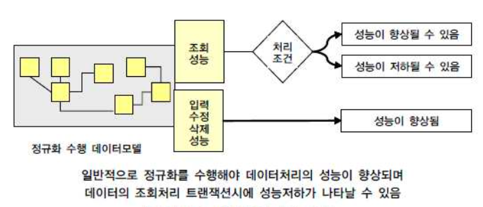

---

## 1. 성능 데이터 모델링(데이터베이스 튜닝)

### 1.1 성능 데이터 모델링의 정의

성능 데이터 모델링을 정의하자면 다음과 같다.

<br>

> 성능 데이터 모델링이란 데이터베이스 성능(Performance) 향상을 목적으로 설계단계의 데이터 모델링 때부터 정규화(Normalization), 반정규화(Denormalization), 테이블 통합, 테이블 분할, 조인구조, PK, FK 등 여러 가지 성능과 관련된 사항이 데이터 모델링에 반영될 수 있도록 하는 것.

<br>

데이터 모델의 경우 크게 세 가지 경우룰 고려하여 성능저하가 올 수 있다.

* 데이터 모델의 구조에 의한 성능 저하
* 데이터가 대용령이 됨으로 인한 불가피한 성능 저하
* 인덱스 특성을 충분히 고려하지 않고 인덱스를 생성해서 성능 저하

<br>

---

### 1.2 성능 데이터 모델링 수행 시점

**성능 향상을 위한 비용은 프로젝트 수행 중에 있어서 사전에 할수록 비용이 들지 않는다**. 성능을 향상 시키기 위한 작업을 초기에 하지 않으면 여러가지 추가적인 비용을 소진하게 되는 원인이 된다. 특히 데이터 증가가 빠르면 빠를수록 성능저하에 따른 개선비용은 기하급수적으로 증가한다.

쉽게 말해서 데이터 모델링이든, 데이터 베이스를 변경하려고 시도하든, 나중에 할 수록 기술 부채가 늘어난다는 뜻이다.

<br>


<p align='center'>SQL 전문가 가이드</p>

만약 어떤 트랜잭션(Transaction)이 해당 비즈니스 처리에 핵심적이고 성능이 저하되면 안되는 특징을 가지고 있다면, 프로젝트 초기에 운영 환경(Production Enviroment)에 대비한 테스트 환경을 구현하고 그곳에 트랜잭션을 발생시켜 실제 성능을 테스트해 보아야 한다

<br>

---

### 1.3 성능 데이터 모델링 고려사항

데이터 모델링 단계에서 다음과 같은 프로세스로 진행하는 것이 모델링 단계에서 성능을 고려할 수 있다.

1. 데이터 모델링을 할 때 정규화를 정확하게 수행한다
2. 데이터베이스 용량산정을 수행한다
   * 정규화가 완성된 모델에 대해서 해당 데이터 모델의 각각 엔터티(테이블)에 어느 정도 트랜잭션이 들어오는지 살펴본다
3. 데이터베이스에 발생되는 트랜잭션의 유형을 파악한다
   * CRUD 매트릭스를 보고 파악
   * 시퀀스 다이어그램으로 파악
   * 트랜잭션 유형 파악을 통해 SQL문장의 조인관계 테이블에서 데이터조회의 칼럼들을 파악할 수 있게 됨
4. 용량과 트랜잭션의 유형에 따라 반정규화를 수행한다
5. 이력 모델의 조정, PK/FK 조정, 슈퍼타입/서브타입 조정을 수행한다
6. 성능관점에서 데이터 모델을 검증한다

<br>

> 시간에 따라 발생하는 데이터 형식을 *이력*이라고 한다.

<br>

---

## 2. 정규화(Normalization)

### 2.1 정규화의 정의

정규화의 정의는 다음과 같다.

<br>

> 데이터베이스의 설계에서 *중복을 최소화 하도록 데이터를 구조화*하는 프로세스. 데이터베이스 정규화의 목표는 이상(Anomaly)이 있는 관계를 재구성하여 작고 잘 조직된 관계를 생성하는 것에 있다. *일반적으로 크고, 제대로 조직되지 않은 테이블들을 작고 잘 조직된 테이블들로 나누는 것을 포함한다.*

> 데이터 베이스는 중복된 데이터를 허용하지 않음으로써 *무결성(Integrity)*을 유지할 수 있다. *데이터 무결성(Integrity)은 데이터의 수명주기(Life Cycle) 동안 데이터가 일관성, 정확성, 유효성을 유지하고 보증하는 것*

<br>

테이블간의 중복 데이터를 허용하지 않도록 데이터베이스를 구조화하는 것은 정규화의 주된 목표 중 하나이다. **더 큰 의미에서의 정규화는 정리되지 않은 큰 테이블들을 더 작고 관리가 쉬운 테이블로 나누어서 그 테이블간의 관계를 잘 설정하는 과정이다**. 이 과정을 통해서 데이터가 중복이 되지 않도록 설계를 하고, 효율적이고 유지보수가 쉬운 데이터베이스 구조를 정립하는 것이다.

<br>

---

### 2.2 잘못된 구조의 테이블

테이블 설계를 잘못하는 경우를 살펴보자.

다음은 ```EMPLOYEE_DEPARTMENT```로 사원과 부서를 하나의 테이블로 구성한 경우이다.


<p align='center'>EMPLOYEE_DEPARTMENT 테이블</p>

* [1] : 데이터가 중복되어 저장공간 낭비 그리고 잘못된 입력으로 인한 데이터 불일치 가능성 존재
* [2] : ``null`` 값 사용은 최소화 하는 것이 좋다
* [3] : HR 부서 저장용 행(row)를 만들어 줘야함 → 매끄럽지 않다, 또한 나중에 HR에 속한 사원을 추가하는 경우 부서 추가를 위해 추가한 행은 삭제해야하는 번거러움이 존재한다

<br>

이런 문제를 해결하기 위해서 사원(EMPLOYEE)과 부서(DEPARTMENT)라는 각각의 관심사를 서로 다른 테이블로 분리해서 저장하면 된다.


<p align='center'>테이블 분리</p>

* [4] : 단순히 사원에 대한 정보만 기록하면 되고, 부서에 대한 정보는 FK(Foreign Key)인 ```dept_id```를 통해서 접근
* [5]
  * 사원을 저장할때 항상 중복해서 저장했던 부서정보를 입력할 필요 없음
  * 사원 정보에 ```null```을 사용하는 형식으로 부서추가를 할 필요가 없음
  * ```null```인 ```dept_lead_id```는 나중에 부서에 사원이 들어오면 바꿔주면 됨

<br>

>  데이터베이스 스키마(Schema)를 설계할 때 다음의 요소를 고려하는 것을 권장한다.
>
>  * 의미적으로 관련있는 속성끼리 테이블을 구성
>  * 중복 데이터를 최대한 허용하지 않도록 설계
>  * 조인(Join) 수행 시 가짜 데이터가 생기지 않도록 설계
>  * 되도록 ```null``` 값을 줄이는 방향으로 설계

<br>

---

### 2.3 정규화와 성능

정규화를 하는 것은 기본적으로 데이터에 대한 중복성을 제거하여 주고 데이터가 관심사별로 처리되는 경우가 많기 때문에 성능이 향상되는 특징을 가지고 있다. 엔터티가 계속 발생되므로 SQL문장에서 조인이 많이 발생하여 이로 인한 성능저하가 나타나는 경우도 있지만 이런 부분은 사례별로 유의하여 반정규화를 적용하는 전략을 사용할 수 있다.

<br>



<p align='center'>SQL 전문가 가이드</p>

> 반정규화(Denormalization)만이 조회 성능을 향상시킨다고 생각하면 안된다. 정규화를 통해서도 조회 성능이 향상되는 경우도 많다는 것을 알자.

<br>

---

### 2.4 함수적 종속성(Functional Dependency, FD)

함수적 의존성(앞으로 FD라는 표현을 사용)의 정의는 다음과 같다.

<br>

> *함수적 종속(Functional Dependency)*이란 데이터베이스의 릴레이션(Relation)에서 두 개의 속성(Attribute) 집합 간의 제약이다.
>
> 어떤 릴레이션 *R*에서, *X*와 *Y*를 각각 *R*의 속성(Attribute) 집합의 부분 집합이라 하자. 애트리뷰트 *X*의 값 각각에 대해 시간에 관계없이 항상 애트리뷰트 *Y*의 값이 오직 하나만 연관되어 있을 때 *Y*는 *X*에 *함수적으로 종속한다*라 하고, *X → Y* 로로 표기한다.
>
> *X*를 *결정자*, *Y*를 *종속자*라고 표현하기도 한다.

<br>


<br>

위의 예시를 살펴보자.

* 속성 집합: ```X = {std_id}```, ```Y = {std_name, birth_date, address}```
* 여기서 알 수 있는 것은 테이블의 두 튜플간 **X** 값이 같으면 **Y**에 속한 속성들의 값도 같다
* 이렇게 **X** 값에 따라 **Y** 값이 유일(Unique)하게 결정되면, **X**와 **Y** 두 집합 사이의 제약 관계를 **FD(Functional Dependency)**라고 한다.
* 함수적 종속(**X → Y**)을 다음과 같이 표현하기도 한다
  * **X** functionally determines **Y** : **X**가 **Y**를 함수적으로 결정한다
  * **Y** is functionally dependent on **X** : **Y**가 **X**에 함수적으로 의존한다(종속된다)

<br>

그러면 FD 관계를 파악할 때의 고려사항은 무엇일까? 

* 테이블의 **스키마를 보고 의미적으로 파악해야 한다**
* 테이블의 스테이트(State)를 보고 FD를 파악하면 안된다

<br>

테이블의 스키마를 보고 의미적으로 파악한다의 의미를 더 자세히 살펴보자. 

집합 **Y**에 ```major``` 속성을 넣는다고 가정해보자. 만약 한 명의 학생(STUDENT)이 여러개의 전공(major)을 가질 수 있다면, 이 때 **X** 값에 따라 **Y**값을 유일하게 결정하지 못한다. 이 처럼 설계하는 테이블의 속성들이 관계적으로 어떤 의미를 지니는지에 따라 FD가 달라진다. (만약 복수 전공이 불가능하고 오직 하나의 전공만을 가질 수 있다면 ```major```를 **Y**에 넣어도 FD가 성립했을 것이다.)

<br>

> 아래의 결정한다(determine)를 특정한다로 바꿔서 생각하면 편하다.

<br>

이제 FD의 종류에 대해 알아보자.

1. 완전 함수적 종속(Full FD)

   * 종속자가 기본키(PK)에만 종속되며, PK가 다중 속성으로 구성되어 있는 경우 PK를 구성하는 모든 속성이 포함된 기본키의 부분집합에 종속된 경우
   * **X → Y**가 유효할 때 **X**의 모든 proper subset이 **Y**를 결정할 수 없다면 **X → Y**는 **Full FD**
   * 예) ```{std_id, class_id}``` → ```{grade}```가 유효할 때 ```{std_id}```, ```{class_id}```, ```{}```는 ```{grade}```를 결정지을 수 없기 때문에 Full FD 성립

   <br>

2. 부분 함수적 종속(Partial FD)

   * 종속자가 기본키(PK)가 아닌 다른 속성에 종속되거나, PK가 다중 속성으로 구성되어 있는 경우 PK를 구성하는 속성 중 일부만 종속되는 경우
   * **X → Y**가 유효할 때 **X**의 proper subset가 **Y**를 결정할 수 있으면 **X → Y**는 **Partial FD**
   * 여기서 proper subset은 **X**와 동일하지 않은 **X**의 부분 집합
     * 예) **X**: ```{std_id, std_name}```,  proper subset of **X** : ```{std_id}```, ```{std_name}```, ```{}```
     * 예) ```{std_id, std_name}``` → ```{birth_date}```가 유효할 때 ```{std_id}``` → ```{birth_date}```도 유효하기 때문에 Partial FD 성립

   <br>

3. 이행적 종속(Transitive FD)

   * **X**, **Y**, **Z** 3 개의 속성(Attribute) 집합 이 있을 때 **X → Y**, **Y → Z**라는 종속 관계가 유효하다면 **Transitive FD**
   * **X → Y** 이고 **Y → Z** 이면 **X → Z** 
   * **Y**와 **Z**는 어떠한 키(Key)의 부분 집합이면 안됨

   <br>

4. 자명한 함수적 종속(Trivial FD)

   * **X → Y**가 유효할 때 **Y**가 **X**의 부분집합이면 **X → Y**는 자명한 함수적 종속
   * 예) **X**: ```{a, b, c}``` → **Y**: ```{c} ```
   * 쉽게 말해서 성립할 수 밖에 없는 함수적 종속 (자명하다)

<br>

> Full FD와 Partial FD를 쉽게 설명해보자면, *X*: ```{a, b, c}``` → *Y*: ```{d} ``` 가 유효할 때 *X*에서 어떤 속성을 제거해도 유효하다면 Partial FD, 어떤 속성을 하나라도 제거해서 FD가 유효하지 않다면 Full FD로 이해하면 편한다.  

<br>

---

### 2.5 정규화의 단계

각 정규화의 단계에 대해서 살펴보자.

<br>


<p align='center'>Stackademic(Mohomed Ashkar Haris) - Normal Forms</p>

<br>

각 정규화 단계를 이루기 위해 준수해야 하는 각각의 규칙들을 **Normal Form(NF)**이라고 한다. 각 정규화 단계를 이루기 위해서는 각 NF을 만족해야 하고, 이 때 NF를 순차적으로 만족해야 다음 NF로 넘어갈 수 있다. 

* 예) 2NF 정규화를 하기 위해서는 1NF 정규화를 만족해야 함
* 예) BCNF 정규화를 하기 위해서는 1NF, 2NF, 3NF 정규화를 만족해야 함

<br>

> 정규화는 BCNF를 넘어서 4NF, 5NF, 6NF도 존재하지만 현재 포스트에서는 다루지 않는다. (4NF 정규화를 넘어가는 경우는 거의 없다고 봐도 된다)

<br>

> 들어가기에 앞서 앞에서 설명한 키의 개념을 복습해보자.
>
> 1. Super Key : 튜플을 유일하게 식별할 수 있는 Key
> 2. Key(Candidate Key) : Super Key 중에서 어느 한 속성이라도 제거하면 유일하게 튜플을 식별할 수 없는 Key
> 3. Primary Key(PK) : 튜플을 유일하게 식별하기 위해 선택된 Key

<br>

정규화를 설명하기 위해 사용할 테이블과 그 스키마를 살펴보자.

<br>


<p align='center'>"인프런 쉬운코드 - DB 정규화"에서 사용한 스키마 예시</p>

* 테이블은 사원(EMPLOYEE)의 월급 계좌(ACCOUNT)를 관리하는 테이블
* 월급 계좌는 ```woori``` 또는 ```kookmin``` 은행 중 하나
* 한 사원이 하나 이상의 월급 계좌를 등록하고, 각 계좌로 들어가는 월급 비율(```ratio```)를 조정가능 (```ratio```의 합은 항상 1)


* 계좌마다 등급(```class```)이 존재한다
  * ```kookmin``` : STAR → PRESTIGE → LOYAL
  * ```woori``` : BRONZE → SILVER → GOLD


* 한 계좌는 하나 이상의 현금 카드와 연동 가능


* **Prime Attribute : 임의의 key(candidate key)에 속하는 속성**
  * ```account_id```, ```bank_name```, ``` account_name```


* **Non-prime Attribute : 어떠한 key에도 속하지 않은 속성**
  * ```class```, ```ratio```, ```emp_id```, ```emp_name```, ```card_id```

<br>

정규화 과정에 들어가기 전에 테이블의 FD를 파악해보자.


<p align='center'>테이블의 Functional Depedency 파악</p>

*  ```class```에 따른 은행(```bank_name```) 특정 가능
* 은행(```bank_name```) 에 따른 계좌번호(```account_num```)로 나머지 속성 특정 가능

<br>

각 정규화의 단계를 살펴보자.

<br>

---

#### 2.5.1 1NF

> *제 1 정규화(1NF)*는 테이블의 속성이 atomic value(나눠질 수 없는 값)를 갖도록 테이블을 분해하는 것이다.

<br>


<p align='center'>1NF 과정</p>

* 속성값이 아토믹(atomic) 해야하기 때문에 c101, c202가 들어있는 튜플을 두 개로 만들어서 값을 나눠서 넣는다
* 발생한 문제
  * 중복 데이터가 생김
  * 기존의 PK ```{account_id}```를 ```{account_id, card_id}```로 변경해야 한다
  * ```ratio```는 합이 1이어야 함


* **이런 문제들이 발생했지만 일단 값을 아토믹하게 만들었기 때문에 1NF를 만족 시켰다**

<br>

---

#### 2.5.2 2NF

> *제 2 정규화(2NF)*는 모든 Non-prime Attribute들이 모든 키(Key)에 대해 완전 함수적 종속(Fully Functional Dependent) 되어야 한다.

쉽게 말해서 **제1정규화(1NF)를 진행한 테이블에 대해 완전 함수 종속을 만족하도록 테이블을 분해하는 것이다.**

**제 2 정규화(2NF)**를 진행하기에 앞서 1NF 이후의 문제점들을 살펴보자. 

<br>


<p align='center'>After 1NF</p>

* ```card_id``` 없이 ```{account_id}``` 만으로도 non-prime attribute들을 유니크하게 결정할 수 있음
* ```card_id``` 없이 ```{bank_name, account_num}``` 만으로도 non-prime attribute들을 유니크하게 결정할 수 있음
* 중복은 결국 ```card_id```의 값을 두 개의 튜플로 나누면서 발생
* 결국 ```card_id```라는 속성이 키에 포함이 되면서 생긴 문제이기 때문에 ```card_id```를 분리하면 됨

<br>

다음은 **제 2 정규화(2NF)**의 과정이다.

<br>


<p align='center'>2NF</p>

<br>

---

#### 2.5.3 3NF

> *제 3 정규화(3NF)*는 모든 non-prime attribute가 어떤 키(Key)에도 이행적 종속(Transitive Dependent)하면 안된다.
>
> (non-prime attribute와 non-prime attribute 사이에는 어떠한 FD가 존재하면 안된다.)

쉽게 말해서 **제2정규화(2NF)를 진행한 테이블에 대해 이행적 종속성(Transitive Dependency)을 없애도록 테이블을 분해하는 것이다.**

들어가기에 앞서 이행적 종속성(Transitive Dependency)을 복습하고 가자.

> *이행적 함수적 종속(Transitive FD)*
>
> * X, Y, Z 3 개의 속성(Attribute) 집합 이 있을 때 X → Y, Y → Z라는 종속 관계가 유효하다면 *Transitive FD*
> * X → Y 이고 Y → Z 이면 X → Z 
> * Y와 Z는 어떠한 키(Key)의 부분 집합이면 안됨

<br>

**제3정규화(3NF)**를 진행하기에 앞서 2NF 이후의 문제점들을 살펴보자. 

<br>


<p align='center'>After 2NF</p>

<br>

이제 **제3정규화(3NF)**를 진행해보자. 문제가 되었던 ```{emp_id}```→ ```{emp_name}```을 해결하기 위해서 새로운 테이블로 분리해내면 된다. 

<br>


<p align='center'>3NF</p>

* 보통 3NF가 끝나면 정규화(Normalized)가 되었다고 할 수 있다.

<br>

---

#### 2.5.4 BCNF(Boyce-Codd Normal Form)

> 모든 유효한 비자명한 함수적 종속성(Non-Trivial Functional Dependency)을 만족하는 X → Y 에서 X는 슈퍼키(Super Key)이어야 한다.

쉽게 말하자면 BCNF는 제 3 정규화(3NF)를 만족하면서 모든 결정자(Determinent)가 후보키(Candidate Key) 집합에 속해야 한다. 

우리의 예시에 바로 적용을 해보면, ```class```에 따른 ```bank_name``` 테이블을 분리하면 된다. 

<br>

---

## 3. 반정규화(Denormalization)

### 3.1 반정규화의 정의

> 기본적으로 반정규화(Denormalization)는 데이터를 중복하여 성능을 향상시키기 위한 기법이라고 정의할 수 있다. 좀 더 넓은 의미의 반정규화는 성능을 향상시키기 위해 정규화된 데이터 모델에서 중복, 통합, 분리 등을 수행하는 모든 과정을 의미한다.

<br>

기본적으로 정규화는 입력/수정/삭제에 대한 성능을 향상시킬 뿐만 아니라 조회에 대해서도 성능을 향상시키는 역할을 한다. 그러나 정규화만을 수행하면 엔터티의 갯수가 증가하고 관계가 많아져 여러 개의 조인(Join)이 걸려야만 데이터를 가져오는 경우가 있다. 이러한 경우, 데이터에 대한 조회 성능이 중요한 경우 부분적으로 반정규화를 고려한다. 

이전에 1NF 부터 BCNF 정규화를 거치면서 테이블이 점점 늘어나는 것을 확인 할 수 있었다. 이 때 BCNF 에서 다시 3NF으로 테이블을 합치는 것을 반정규화의 예시 중 하나로 볼 수 있다. 정규화의 역 작용을 한다고 해서 역정규화로 표현하기도 한다.

<br>

---

### 3.2 반정규화 적용 방법

반정규화를 적용할 때는 기본적으로 데이터 무결성이 깨질 가능성이 많이 있기 때문에 반드시 데이터 무결성을 보장할 수 있는 방법을 고려한 이후에 반정규 화를 적용하도록 해야 한다.

<br>


<p align='center'>SQL 전문가 가이드</p>

<br>

> 정규화(Normalization)와 반정규화(Denormalization)은 일종의 Trade-Off 관계에 있기 때문에, 상황에 맞게 정규화와 반정규화를 적용해서 데이터베이스를 설계해야한다. 

---

## Reference

1. [한국 데이터 산업 진흥원 - SQL 전문가 가이드](https://dataonair.or.kr/db-tech-reference/d-guide/sql/)

2. [인프런 쉬운코드 - 데이터베이스](https://www.inflearn.com/course/%EB%B0%B1%EC%97%94%EB%93%9C-%EB%8D%B0%EC%9D%B4%ED%84%B0%EB%B2%A0%EC%9D%B4%EC%8A%A4-%EA%B0%9C%EB%A1%A0/dashboard)

3. [algo daily - normalization](https://algodaily.com/lessons/normalization-sql-normal-forms)