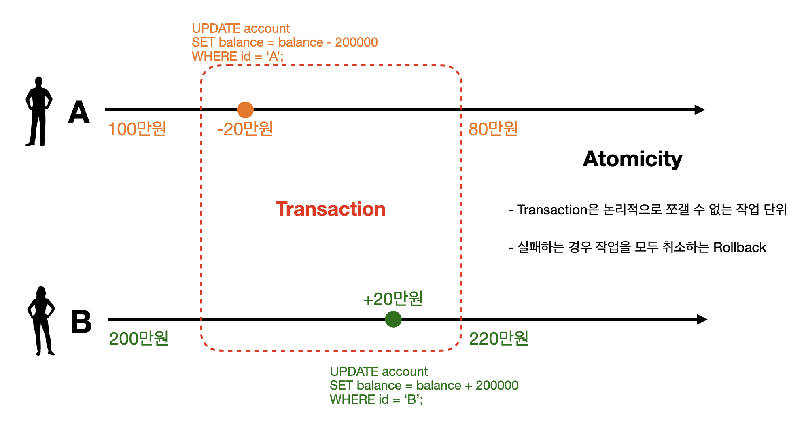

---

## Transaction 설명

트랜잭션(Transaction)에 관해 알아보자. 

<br>

> 트랜잭션(Transaction)은 업무 처리를 위한 논리적인 작업 단위다. 작업의 논리적 단위가 단일 연산이 아닐 수 있다. 즉, 하나의 트랜잭션이 두 개 이상의 업데이트 연산일 수 있다. 은행의 "계좌이체" 트랜잭션을 예로 들면, 하나의 예금 계좌에서 인출하여 다른 예금 계좌에 입금하는 일련의 작업을 하나의 단위로 수행해야 한다. 데이터를 일관성 있게 처리하려면 트랜잭션에 속한 두 개 이상의 업데이트 연산을 동시에 실행할 수 있어야 하는데, 불행히도 이는 불가능한 일이다. 따라서 DBMS는 차선책을 사용한다. 즉, 여러 개의 업데이트 연산이 하나의 작업처럼 전부 처리되거나 아예 하나도 처리되지 않도록(All or Nothing) 동시 실행을 구현한다.
>

<br>

위에서 언급한 "계좌이체" 예시를 통해 더 자세히 설명하겠다.

```A```가 ```B```에게 20만원을 이체해주는 상황을 다음 그림을 통해 살펴보자.

<br>


여기서 이체가 성공하기 위해서는 ```A```의 ```balance```에서 20만원 차감을 ```UPDATE```하고, ```B```의 ```balance```에서 20만원 증감을 ```UPDATE```하는 일련의 과정이 전부 성공을 해야한다. 어느 하나의 작업이라도 실패하는 경우, ```A```나 ```B```의 ```balance```에 알맞는 금액이 남지 않기 때문이다. 결국 이체라는 작업은 두 작업 모두 정상 처리 돼야만 성공하는 단일 작업으로 생각할 수 있다. 이 때 이 단일 작업을 Transaction(트랜잭션)이라고 부른다.

<br>

Transaction을 간단히 설명하면 다음과 같다.

* 업무 처리를 위한 단일의 논리적인 작업 단위
* 여러 SQL문들을 단일의 작업 단위로 묶어서 나눠질 수 없게 만든다
* **All or Nothing**이라는 표현대로 여러개의 SQL 연산이 하나의 작업처럼 전부 처리되거나 아예 하나도 처리되지 않도록 구현한다

<br>

이제는 이전의 이체 예시를 실제로 SQL을 통해 Transaction을 구현해보자. 

```
mysql> SELECT * FROM account;
+------+---------+
| id   | balance |
+------+---------+
| A    | 1000000 |
| B    | 2000000 |
+------+---------+
```

```mysql
-- 1. account 테이블 생성, 데이터 입력
CREATE TABLE account (
	id char(1),
	balance int
);

INSERT INTO account VALUES 
('A', 1000000),
('B', 2000000);

-- 2. Transaction 사용해보기
START TRANSACTION; -- TRANSACTION을 시작
UPDATE account SET balance = balance - 200000 WHERE id = 'A';
UPDATE account SET balance = balance + 200000 WHERE id = 'B';
COMMIT; -- TRANSACTION 종료, 지금까지 작업 내용을 DB에 영구적으로 저장 
```

* ```COMMIT``` 
  * ```TRANSACTION``` 종료
  * 지금까지 작업한 내용을 DB에 영구적으로 반영한다 
* 모든 일련의 작업이 완벽하게 성공하지 않아도 ```COMMIT``` 명령을 통해 DB에 저장이 가능 (이렇게 설계하는 사람은 아무도 없음) 

<br>

결과는 살펴보면 다음과 같다.

```
mysql> SELECT * FROM account;
+------+---------+
| id   | balance |
+------+---------+
| A    |  800000 |
| B    | 2200000 |
+------+---------+
```

<br>

이번에는 추가로 ```A```가 ```B```에게 30만원을 이체하는 상황에서 ```ROLLBACK```을 사용해보겠다.

```mysql
-- 3. A가 B에게 추가로 30만원 이체하는 상황 
START TRANSACTION;
UPDATE account SET balance = balance - 300000 WHERE id = 'A'; -- A: 500000, B: 2200000

ROLLBACK; -- 지금까지의 작업을 취소하고 TRANSACTION 이전 상태로 되돌리고 TRANSACTION 종료 

-- ROLLBACK 이후 다시 A: 800000, B: 2200000로 원상 복구 
```

* ```ROLLBACK```
  * 지금까지의 작업을 취소하고 ```TRANSACTION``` 이전의 상태로 되돌린다
  * 이후 ```TRANSACTION``` 종료

<br>

이번에는 ```AUTOCOMMIT```에 대해 알아보자.

```mysql
-- 4. AUTOCOMMIT
SELECT @@AUTOCOMMIT; -- 1로 설정된 것을 확인가능 (MySQL에서 디폴트로 활성화)
INSERT INTO account VALUES ('C', 1000000); -- autocommit이 활성화되어 있기 때문에 자동으로 commit이 되면서 DB에 영구 저장 
```

```
mysql> SELECT * FROM account;
+------+---------+
| id   | balance |
+------+---------+
| A    |  800000 |
| B    | 2200000 |
| C    | 1000000 |
+------+---------+
```

* ```AUTOCOMMIT```은 각각의 SQL쿼리를 자동으로 ```TRANSACTION``` 처리 해주는 개념이다
* SQL문이 성공적으로 실행되면 자동으로 ```COMMIT```을 한다
* 만약 SQL문의 실행에 문제가 있다면 자동으로 ```ROLLBACK``` 한다
* MySQL에서 ```AUTOCOMMIT``` 기본적으로 enabled (```AUTOCOMMIT = 1```) 상태이다
  * 특정 DB나 DB 접근 기술에서는 `AUTOCOMMIT`을 비활성화하는 것을 트랜잭션의 시작으로 간주한다.


<br>

여기서 알아야할 점은 ```TRANSACTION``` 시작 후 ```AUTOCOMMIT```은 비활성화 상태가 된다는 것이다. 이후에 ```COMMIT/ROLLBACK``` 시행 후 ```TRANSACTION```이 종료가 되면 다시 원래의 ```AUTOCOMMIT``` 상태가 된다. 

> 일반적으로 Transaction이 사용되는 패턴
>
> 1. ```Transaction``` 시작
> 2. 데이터 읽기, 쓰기 등의 SQL 쿼리를 포함한 로직을 수행
> 3. 일련의 작업이 정상적으로 수행되면 ```Commit```
> 4. 작업 중간에 문제가 발생하면 ```Rollback``` 

<br>

---

## ACID

**A**tomicity **C**onsistency **I**solation **D**urability를 의미하는 **ACID**에 대해 알아보자. 

이전의 "계좌이체" 예시를 이용해서 ACID를 살펴보자.

<br>

### Atomicity(원자성)

기존에 ```A```가 ```B```에게 20만원을 이체하는 상황에서 Atomicity에 대해 알아보자.

<br>



- Transaction은 기본적으로 모든 작업이 수행되거나 아무것도 수행되지 않는 All or Nothing을 따른다 (중간 상태라는 것이 존재하지 않는다)
- 예) 100개의 레코드를 업데이트하는 작업 중에 20개만 업데이트가 되고 실패하는 경우, 모든 변경사항을 ```Rollback```한다
- 개발자는 언제 ```Commit```을 하고 ```Rollback```을 하지 판단해야 함

<br>

---

### Consistency(정합성, 일관성)

이번에 ```A```가 ```B```에게 추가로 100만원을 이체하는 상황이라고 가정하자. 이 경우에는 ```balance```가 0 미만이 될 수 없다는 제약이 있기 때문에 DB가 inconsistent 상태가 된다. 이런 경우 ```Rollback```을 수행해서 다시 consistent 상태로 되돌려야한다. 

<br>


- 트랜잭션은 데이터베이스를 하나의 일과된 상태에서 다른 일관된 상태로 전환한다
- 예) 저축 계좌에서 인출하고 다른 예금 계좌에 입금하는 계좌 이체에서 실패로 인해 DB에서 하나의 계좌에만 입금되어 데이터가 일치하지 않게 되면 안된다
- 어플리케이션 관점에서 Transaction이 consistent하게 동작하는지 개발자가 확인 해야한다 

<br>

---

### Isolation(격리성)

이번에는 ```A```가 ```B```에게 20만원을 이체하는데, 동일한 타이밍에 ```B```도 ATM에서 본인 계좌에 30만원 입금하는 상황을 가정해보자. 20만원 이체에 대한 ```Transaction```과정 중에 ```B```에게 20만원을 입금하기 위해 ```B```의 계좌잔액을 read 했다고 하자. 이 때 20만원 입금에 대한 잔액을 write하기 전에 ATM에서 30만원 입금을 하는 ```Transaction```이 발생하는 경우, 30만원 입금에 대해 DB에 반영되었던 내용이 220만원(20만원 입금)으로 덮어쓰여질 수 도 있다. 

쉽게 말해서 동시에 일어난 ```Transaction```으로 인해서 잘못된 금액으로 DB에 write 되는 경우가 발생하기 때문에, 모든 ```Transaction```들은 서로 독립(고립)되어야 한다는 것을 알 수 있다.

<br>

 

* Isolation은 여러 Transaction들이 동시에 실행될 때도 혼자 실행되는 것 처럼 동작하게 만드는 것
* DBMS들은 여러가지 Isolation Level을 제공해준다
* Isolation Level이 높으면 더 엄격하게 격리된다 ⇄ Isolation Level이 높으면 DB 성능이 떨어진다 
* Concurrency control의 주된 목표는 Isolation
* 트랜잭션의 효과는 트랜잭션이 커밋될 때까지 다른 트랜잭션에서 조회되면 안됨
* 예시) 온라인 거래에서 재고 물품이나 계좌 잔액에 대한 테이블을 업데이트하는 과정에서 입금이나 재고 차감에 대한 내용을 다른데서 확인이 가능하면 안됨

<br>

---

### Durability(영존성)

Durability가 의미하는 것은 다음과 같다.

* ```Commit```된 트랜잭션으로 인한 변경 사항은 영구적이다
  * 한마디로, DB에 재난(power fail, etc..)이 발생해도 ```Commit```된 ```Transaction```은 DB에 남는다
* 영구적으로 저장한다는 의미 보통 비휘발성 메모리(2차 기억장치 : HDD, SDD..)에 저장한다는 뜻이다
* ```Transaction```이 완료된 후 데이터베이스는 복구 메커니즘을 통해 트랜잭션의 변경 사항이 손실되지 않도록 한다

---

## Reference

1. [한국 데이터 산업 진흥원 - SQL 전문가 가이드](https://dataonair.or.kr/db-tech-reference/d-guide/sql/)

2. [인프런 쉬운코드 - 데이터베이스](https://www.inflearn.com/course/%EB%B0%B1%EC%97%94%EB%93%9C-%EB%8D%B0%EC%9D%B4%ED%84%B0%EB%B2%A0%EC%9D%B4%EC%8A%A4-%EA%B0%9C%EB%A1%A0/dashboard)