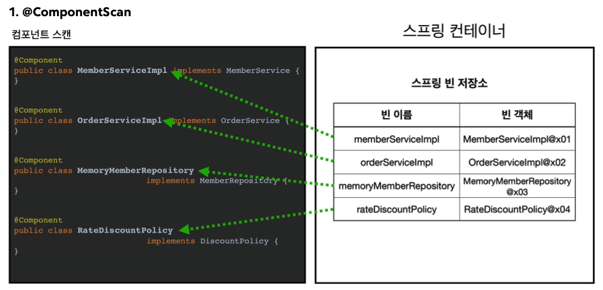

---

## 1. 컴포넌트 스캔(Component Scan)

### 1.1 @ComponentScan, @Autowired

컴포넌트 스캔과 의존성 자동 주입에 대한 내용을 알아보자.

지금까지 스프링 빈을 등록할 때는 자바 코드의 `@Bean` 처럼 설정 정보에 직접 등록할 스프링 빈을 명시했다. 스프링 빈이 몇 개가 안된다면 상관 없겠지만, 등록 해야할 빈이 수십 ~ 수백개가 된다면 일일이 등록하는 것이 귀찮기도 하고 실수할 가능성도 높아진다. 이런 문제를 해결하기 위해 스프링은 설정 정보가 없어도 자동으로 스프링 빈을 등록하는 **컴포넌트 스캔(component scan)**이라는 기능을 제공한다. 컴포넌트 스캔과 더불어서 의존성도 자동으로 주입하는 `@Autowired`라는 기능도 제공한다.

<br>

이제 코드로 ```@ComponentScan```과 ```@Autowired```에 대해서 알아보자.

<br>

```AutoAppConfig```를 새로 생성하자.

```AutoAppConfig``` 

```java
@Configuration
@ComponentScan(
        excludeFilters = @ComponentScan.Filter(type = FilterType.ANNOTATION, classes = Configuration.class)
) // 필터로 컴포넌트 스캔에서 제외 시킬 것을 지정함 - AppConfig에서 @Configuration이 붙어 있기 때문
// @Configuration에도 @Component가 달려있음
public class AutoAppConfig {
    
}
```

* 컴포넌트 스캔을 사용하기 위해서는 ```@ComponentScan``` 애노테이션을 붙여주면 된다
* ```@ComponentScan``` : ```@Component```라는 애노테이션이 붙은 클래스들을 자동으로 전부 스프링 빈으로 등록해줌
*  ```@Bean```으로 등록한 클래스가 없다

<br>

이제 기존의 각 클래스가 컴포넌트 스캔의 대상이 되도록 ```@Component```  애노테이션을 붙여주자.

```MemoryMemberRepository```

```java
@Component
public class MemoryMemberRepository implements MemberRepository{
  // 기존 구현
}
```

<br>

```RateDiscountPolicy```

```java
@Component
public class RateDiscountPolicy implements DiscountPolicy {
  // 기존 구현
}
```

<br>

```MemberServiceImpl``` - ```@Component```, ```@Autowired``` 추가

```java
@Component
public class MemberServiceImpl implements MemberService {
    private final MemberRepository memberRepository;
     
    @Autowired
    public MemberServiceImpl(MemberRepository memberRepository) {
        this.memberRepository = memberRepository;
    }
   	 
    // 기존 구현
}
```

* 이전의 ```AppConfig```에서는 ```@Bean```으로 직업 설정 정보를 작성했고, 의존 관계를 명시적으로 주입했다

<br>

```java
// AppConfig
@Bean
public MemberService memberService() { // memberService는 memberRepository를 명시적으로 주입
    return new MemberServiceImpl(memberRepository()); 
}
```

* 컴포넌트 스캔을 이용하는 경우 이런 설정 정보 자체가 없기 때문에 의존관계 주입을 클래스 안에서 해결해야 한다 → ```@Autowired``` 사용
* ```@Autowired```는 자동으로 의존 관계(의존성)를 주입해준다

<br>

```OrderServiceImpl``` - ```@Component```, ```@Autowired``` 추가

```java
 @Component
 public class OrderServiceImpl implements OrderService {
     private final MemberRepository memberRepository;
     private final DiscountPolicy discountPolicy;
     
     @Autowired
     public OrderServiceImpl(MemberRepository memberRepository, DiscountPolicy discountPolicy) {
         this.memberRepository = memberRepository;
         this.discountPolicy = discountPolicy;
     }
   	 
     // 기존 구현
}
```

* ```@Autowired```를 이용해서 생성자에서 여러 의존관계도 한번에 주입받을 수 있다

<br>

그럼 ```@ComponentScan```과 ```@Autowired```가 어떻게 동작하는지 그림으로 살펴보자.

<br>

   

<p align='center'>@ComponentScan</p>

* `@ComponentScan` 은 `@Component` 가 붙은 모든 클래스를 스프링 빈으로 등록한다


* 스프링 빈의 기본 이름은 클래스명을 사용하되 맨 앞글자만 소문자를 사용하도록 설정된다(스프링이)
  * 예) ```MemberServiceImpl``` 클래스 → ```memberServiceImpl```


* 빈 이름을 직접 지정하고 싶은 경우 : ```@Component("memberService2")``` 처럼 이름을 부여하면 된다다

<br>

   

<p align='center'>@Autowired</p>

* 생성자에 `@Autowired` 를 지정하면, 스프링 컨테이너가 자동으로 해당 스프링 빈을 찾아서 주입한다


* 이때 기본 조회 전략은 타입이 같은 빈을 찾아서 주입한다
  * 예)  ```MemberRepository```과 같은 타입을 찾아서 주입 → ```memoryMemberRepository```
  * ```getBean(MemberRepository.class)```와 동일하다고 이해하면 됨
  * 같은 타입이 여러개면 충돌!

<br>

---

### 1.2 @ComponentScan의 탐색 위치와 스캔 대상

컴포넌트 스캔이 탐색을 시작하는 시작 위치를 지정할 수 있다.

```java
@ComponentScan(
    basePackages = "de.springbasic1.member", // member 패키지 부터 시작해서 하위 패키지 모두 스캔
}
```

* ```basePackages``` : 탐색할 패키지의 시작 위치 지정, 이 패키지를 포함해서 하위 패키지를 모두 스캔한다
* ```basePackages = {"de.springbasic1.member","de.springbasic1.order"}``` : 여러 시작 위치를 지정할 수도 있다
* ```basePackagesClasses``` : 지정한 클래스의 패키지를 스캔 시작 위치로 지정한다
* 시작 위치를 지정하지 않을 경우 ```@ComponentScan```이 붙은 설정 정보 클래스의 패키지가 시작 위치가 된다

<br>

> 권장 : 설정 정보 클래스의 위치를 프로젝트의 최상단에 둔다
{: .prompt-tip }

<br>

이제 컴포넌트 스캔의 기본 대상에 대해서 알아보자. 다음은 컴포넌트 스캔의 대상이 되는 애노테이션들이다.

* ```@Component``` 
* ```@Configuration``` : 스프링의 설정 정보
  * 스프링 설정 정보를 인식하고, 스프링 빈이 싱글톤으로 유지하도록 처리를 해준다


* ```@Controller``` : MVC 컨트롤러에 사용
  * MVC 컨트롤러로 인식한다


* ```@Service``` : 비즈니스 로직(서비스 레이어)에 사용
  * 특별한 처리는 없지만, 핵심 비즈니스 로직이 존재한다는 것을 파악하는데 도움이 된다다


* ```@Repository``` : 데이터 접근 계층에서 사용
  * 스프링 데이터 접근 계층으로 인식하고, 데이터 계층의 예외를 스프링 예외로 변환해준다

<br>

확인 해보면 ```@Component```가 붙어있는 모습을 볼 수 있다. 여기서 애노테이션이 특정 애노테이션을 들고 있다는 것을 인식하는 기능은 상속관계나 자바가 지원하는 기능이 아니고, 스프링이 지원하는 기능이다.

<br>

---

### 1.3 필터, 중복 등록과 충돌

컴포넌트 스캔 대상을 필터링하는 방법과 컴포넌트 스캔에서 같은 빈 이름이 등록되는 경우에 대해서 알아보자.

#### 1.3.1 필터

* ```includeFilters``` : 컴포넌트 스캔 대상을 추가로 지정한다
* ```excludeFilters``` : 컴포넌트 스캔 대상에서 제외할 대상을 지정한다

<br>

컴포넌트 스캔 대상에 추가할 애노테이션

```java
@Target(ElementType.TYPE)
@Retention(RetentionPolicy.RUNTIME)
@Documented
public @interface MyIncludeComponent {
}
```

<br>

컴포넌트 스캔 대상에 제외할 애노테이션

```java
@Target(ElementType.TYPE)
@Retention(RetentionPolicy.RUNTIME)
@Documented
public @interface MyExcludeComponent {
}
```

<br>

컴포넌트 스캔 대상에 추가할 클래스

```java
@MyIncludeComponent
public class BeanA {
}
```

<br>

컴포넌트 스캔 대상에 제외할 클래스

```java
@MyExcludeComponent
public class BeanB {
}
```

<br>

```includeFilters```, ```excludeFilters``` 사용하기

```java
@ComponentScan(
    includeFilters = @Filter(type = FilterType.ANNOTATION, classes = MyIncludeComponent.class),
    excludeFilters = @Filter(type = FilterType.ANNOTATION, classes = MyExcludeComponent.class)
)
```

* `includeFilters` 에 `MyIncludeComponent` 애노테이션을 추가해서 ```BeanA```가 스프링 빈에 등록된다
* `excludeFilters` 에 `MyExcludeComponent` 애노테이션을 추가해서 ```BeanB```는 스프링 빈에 등록되지 않는다

<br>

---

#### 1.3.2 중복 등록과 충돌

컴포넌트 스캔에서 같은 빈 이름을 등록하는 상황에서 다음의 두 가지 상황을 생각해 볼 수 있다.

* **자동 빈 등록 vs 자동 빈 등록**
  * 컴포넌트 스캔에 의해 자동으로 스프링 빈이 등록될 때, 그 이름이 서로 같은 경우 스프링은 오류를 방생시킨다
  * ```ConflictBeanDefinitionException``` 발생

<br>

* **수동 빈 등록 vs 자동 빈 등록**

  * 수동으로 등록한 빈과 자동으로 등록된 빈이 충돌하는 경우 수동 빈이 등록 우선권을 가진다 (수동 빈이 자동 빈을 오버라이딩한다)

  * 수동 빈이 자동 빈을 오버라이딩하는 경우 남는 로그

  * ```
    Overriding bean definition for bean 'memoryMemberRepository' with a different
     definition: replacing
    ```

  * 수동 빈과 자동 빈의 충돌은 대게 개발자가 의도해서 발생하기 보다는 복잡한 설정을 꼬여서 발생하는 상황이 대다수이다 → 최근 스프링 부트에서는 수동 빈과 자동 빈이 충돌나면 그냥 오류가 발생하도록 디폴트값을 바꾸었다

<br>

---

## 2. 의존관계 자동 주입(@Autowired)

의존 관계 주입(의존성 주입, DI)과 ```@Autowired```의 사용법에 대해 알아보자.

<br>

### 2.1 DI(의존 관계 주입)

의존관계 주입은 크게 4가지 방법이 존재한다.

1. 생성자 주입
2. 수정자 주입
3. 필드 주입
4. 메서드 주입

<br>

각 DI  방법을 살펴보자.

<br>

---

#### 2.1.1 생성자 주입(Constructor Injection)

생성자 주입은 이름 그대로 생성자를 통해서 의존 관계를 주입 받는 방법이다. 지금까지 우리가 사용해왔던 방법이기도 한다.

* 생성자 주입은 생성자 호출 시점에 딱 1번만 호출되는 것이 보장된다
* 불변(immutable), 필수 의존관계에 사용
  * 인스턴스가 생성되는 그 시점에 의존관계가 설정되고, 그 이후로 변경 불가
  * 생성자를 두 번 호출하는 것은 아니기 때문에

<br>

코드로 한번 살펴보자.

```java
@Component
public class OrderServiceImpl implements OrderService {
    private final MemberRepository memberRepository; // final to enforce immutability and usage
    private final DiscountPolicy discountPolicy;
	  
    @Autowired
    public OrderServiceImpl(MemberRepository memberRepository, DiscountPolicy discountPolicy) {
         this.memberRepository = memberRepository;
         this.discountPolicy = discountPolicy;
     }
}
```

* ```final```이 붙어 있기 때문에 값이 무조건 있어야 함
* **생성자가 딱 1개만 존재하면** ```@Autowired```**를 생략해도 자동 주입 된다!** (스프링 빈에만 해당)

<br>

---

#### 2.1.2 수정자 주입(Setter Injection)

수정자 주입은 필드의 값을 변경하는 수정자 메서드(setter)를 통해서 의존관계를 주입하는 방법이다.

* 선택, 변경 가능성이 있는 의존관계에 사용한다
  * 조금 더 유연하게 사용 가능
* setter는 Java Beans Convention을 따른다

<br>

```java
@Component
public class OrderServiceImpl implements OrderService {
    private MemberRepository memberRepository;
    private DiscountPolicy discountPolicy;
    
    // setter
    @Autowired 
    public void setMemberRepository(MemberRepository memberRepository) {
        this.memberRepository = memberRepository;
    }
    
    // setter
    @Autowired 
    public void setDiscountPolicy(DiscountPolicy discountPolicy) {
        this.discountPolicy = discountPolicy;
    }
    
    
}
```

* 생성자 주입의 경우에는 빈이 등록 되면서 생성자도 호출이 되면서 DI도 같이 된다
* 수정자 주입의 경우 객체가 생성이 된후에 setter 메서드를 통해 의존 관계가 설정(DI) 된다

<br>

---

#### 2.1.3 필드 주입(Field Injection)

이름 그대로 필드에 주입하는 방법이다.

* 코드가 간결해진다
* 외부에서 변경이 불가능해서 테스트가 힘들다
* DI 프레임워크가 없으면 아무것도 할 수 없다
* **사용 권장하지 않음!**
  * 애플리케이션의 실제 코드와 관련이 없는 테스트 코드에 사용 가능
  * 스프링 설정을 목적으로 하는 ```@Configuration``` 같은 곳에서만 특별한 용도로 사용 가능

<br>

```java
@Component
public class OrderServiceImpl implements OrderService {
    @Autowired
    private MemberRepository memberRepository;
    
    @Autowired
    private DiscountPolicy discountPolicy;
}
```

```java
@Test
void fieldInjectionTest() {
  OrderServiceImpl orderService = new OrderServiceImpl();
  // orderService를 통해 필드에 접근할 방법이 없다 -> 결국에는 setter를 만들어서 사용해야 함
}
```

* 외부에서 변경이 불가능 하다

<br>

---

#### 2.1.4 메서드 주입(Method Injection)

일반 메서드를 통해서 주입하는 방법이다.

* 한번에 여러 필드 주입 가능
* 잘 사용하지 않음

<br>

```java
@Component
public class OrderServiceImpl implements OrderService {
    private MemberRepository memberRepository;
    private DiscountPolicy discountPolicy;
    
    @Autowired // 일반 메서드를 통해 주입
    public void init(MemberRepository memberRepository, DiscountPolicy discountPolicy) {
         this.memberRepository = memberRepository;
         this.discountPolicy = discountPolicy;
		} 
}
```

* 수정자 주입이랑 비슷하다고 볼 수 있다
* 보통은 생성자 주입과 수정자 주입 선에서 다 해결이 되기 때문에 잘 사용하지 않는다

<br>

> ```@Autowired```는 스프링 컨테이너가 관리하는 스프링 빈에서만 동작한다.

<br>

---

### 2.2 @Autowired 옵션 처리

```@Autowired``` 의 옵션에 대해서 알아보자.

주입할 스프링 빈이 없어도 동작해야 할 때가 있다. 그러나 ```@Autowired```만 사용하면 ```required```의 옵션이 디폴트로 ```true```로 설정되어 있기 때문에 주입 대상이 없을시 오류가 발생한다.

자동 주입 대상을 옵션으로 처리하는 방법은 다음과 같다.

* `@Autowired(required=false)` : 자동 주입할 대상이 없으면 수정자 메서드 자체가 호출 안됨
*  `org.springframework.lang.@Nullable` : 자동 주입할 대상이 없으면 null이 입력된다
*  `Optional<>` : 자동 주입할 대상이 없으면 `Optional.empty` 가 입력된다

<br>

코드로 한번 알아보자. ```AutowiredTest```를 생성해서 동작을 확인해보자.

```autowired/AutowiredTest```

```java
public class AutowiredTest {

    @Test
    void AutowiredOption() {
        AnnotationConfigApplicationContext ac = new AnnotationConfigApplicationContext(TestBean.class);
    }
		
    static class TestBean {
        @Autowired(required = false) // default는 true 
        public void setNoBean1(Member noBean1) { // Member는 스프링 빈이 아님!
            System.out.println("noBean1 = " + noBean1); // 메서드(수정자) 호출 자체가 안됨
        }

        @Autowired
        public void setNoBean2(@Nullable Member noBean2) {
            System.out.println("noBean2 = " + noBean2); // 호출은 되지만 null
        }

        @Autowired
        public void setNoBean3(Optional<Member> noBean3) {
            System.out.println("noBean3 = " + noBean3); // Optional: 값이 없으면 empty
        }
    }
}
```

<br>

```
noBean2 = null
noBean3 = Optional.empty
```

<br>

---

### 2.3 생성자 주입 권장

의존관계 주입 방법으로 생성자 주입 방식을 권장하는 이유에 대해서 알아보자.

최근에는 스프링을 포함한 대부분의 DI 프레임워크는 생성자 주입을 권장한다. 그 이유는 다음과 같다.

<br>

* **불변(Immutable)**
  * 대부분 의존관계 주입은 한번 일어나면 애플리케이션 종료시점까지 의존관계를 변경할 일이 거의 없다
    * **대부분 의존관계는 애플리케이션 종료 전까지 변하면 안된다**(불변, immutable 해야한다)
  * 수정자 주입을 사용하는 경우 setter 메서드를 ```public```으로 열어둬야 한다
  * 변경하면 안되는 메서드를 열러두는 것은 좋은 설계 방법이 아니다
  * 생성자 주입 방식을 이용하면 객체를 생성할 때 딱 1번 호출되고 이후에 호출되는 일이 없다 → 불변하게 설계할 수 있다
  * 생성자 주입을 사용하는 경우 필드에 ```final``` 키워드를 사용할 수 있다
  * ```final```을 이용하면 값이 설정되지 않은 경우 컴파일 시점에서 막아주고, 생성자에서만 값을 넣어줄 수 있기 때문에 불변할 수 있다


* **누락(omission)**
  * 프레임워크 없이 순수한 자바 코드로 유닛 테스트를 작성하는 상황이 많다. 이 때 생성자 주입이 아니라 수정자 주입을 사용하는 경우에는 의존관계의 주입이 누락되어 실행 결과가 ```NullPointException```이 발생한다
  * 생성자 주입을 사용하는 경우에는 주입 데이터를 누락하는 경우에 컴파일 오류가 발생하고, IDE에서 어떤 값을 필수 주입해야하는지 알려준다

<br>

정리하자면 생성자 주입 방식을 사용하면 불변하게 설계할 수 있으면서 프레임워크에 의존하기 않고 순수한 자바 코드의 특징을 잘 살릴 수 있다. 개발할 때 권장하는 방식은 기본적으로 생성자 주입 방식을 사용하되, 필수 값이 아닌 경우 수정자 주입 방식을 옵션으로 부여하는 것이다. 

<br>

---

### 2.4 @Autowired {필드명}, @Qualifier, @Primary

#### 2.4.1 조회되는 빈이 2개 이상인 문제

```@Autowired```의 경우 타입으로 조회한다. 이전의 빈 조회에서 학습했듯이, 타입으로 조회시 선택된 빈이 2개 이상일때 문제가 발생한다.

<br>

문제의 발생을 코드로 한번 살펴보자.

```java
 @Component
 public class FixDiscountPolicy implements DiscountPolicy {}
```

<br>

```java
 @Component
 public class RateDiscountPolicy implements DiscountPolicy {}
```

* ```DiscountPolicy```의 하위 타입인 ```FixDiscountPolicy```, ```RateDiscountPolicy``` 둘다 스프링 빈으로 선언했다(```@Component```로 등록)

<br>

```java
 @Autowired
 private DiscountPolicy discountPolicy;
```

* 이런식으로 ```@Autowired```를 사용해보면 ```NoUniqueBeanDefinitionException``` 오류가 발생한다
* 오류 메세지를 확인해보면 하나의 빈을 기대(```expected single matching bean```)했지만 ```fixDiscountPolicy```, ```rateDiscountPolicy```라는 2개의 빈을 발견했다고 알려준다

<br>

문제를 해결하기 위해서 하위타입으로 지정하는 것은 DIP를 위배한다. 또한 이름만 다르고, 완전히 똑같은 타입의 스프링 빈이 2개 있을 때 해결이 안된다. 이 문제를 해결하는 방법을 ```@Autowired 필드명```, ```@Qualifier```, ```@Primary```을 통해 알아보자.

<br>

---

#### 2.4.2 @Autowired {필드명}

```@Autowired 필드명``` 매칭에 대하여 알아보자.

<br>

```@Autowired```는 타입 매칭을 시도할때 다수의 빈이 존재한다면 필드 이름(파라미터 이름)으로 빈 이름을 추가 매칭한다.

기존 코드

```java
 @Autowired
 private DiscountPolicy discountPolicy;
```

<br>

필드명을 빈 이름으로 변경한 코드

```java
 @Autowired
 private DiscountPolicy rateDiscountPolicy;
```

* 필드명이 ```rateDiscountPolicy```이므로 정상 주입된다
* ```@Autowired```의 매칭을 정리하지면 : 타입 매칭 → 타입 매칭 결과가 2개 이상인 경우 → 필드명(파라미터명)으로 빈 이름 매칭

<br>

---

#### 2.4.3 @Qualifier

`@Qualifier` 는 **추가 구분자를 붙여주는 방법**이다. 주입시 **추가적인 방법을 제공**하는 것이지 빈 이름을 변경하는 것은 아니다.

```java
 @Component
 @Qualifier("fixDiscountPolicy")
 public class FixDiscountPolicy implements DiscountPolicy {}
```

<br>

```java
 @Component
 @Qualifier("mainDiscountPolicy")
 public class RateDiscountPolicy implements DiscountPolicy {}
```

* 빈 등록시 ```@Qualifier```를 붙여준다

<br>

생성자 자동 주입에 ```@Qualifier``` 사용 예시

```java
 @Autowired
 public OrderServiceImpl(MemberRepository memberRepository, @Qualifier("mainDiscountPolicy") DiscountPolicy
 discountPolicy) {
     this.memberRepository = memberRepository;
     this.discountPolicy = discountPolicy;
}
```

<br>

수정자 자동 주입에 ```@Qualifier``` 사용 예시

```java
 @Autowired
 public DiscountPolicy setDiscountPolicy(@Qualifier("mainDiscountPolicy") DiscountPolicy discountPolicy) {
     this.discountPolicy = discountPolicy;
 }
```

* ```@Qualifier```로 주입할 때 ```@Qualifier("mainDiscountPolicy")``` 를 못 찾는 경우 → ```mainDiscountPolicy```라는 이름의 스프링 빈을 추가 찾는다
* ```@Qualifier```는 ```@Qualifier```를 찾는 용도로 사용하는 것을 권장한다
* ```@Qualifier```는 빈의 수동 등록에도 사용 가능하다

<br>

---

#### 2.4.4 @Primary

```@Primary```는 우선순위를 지정하는 방법이다. ```@Autowired```시 매칭되는 빈이 여러개이면 ```@Primary```가 우선권을 가진다.

<br>

```rateDiscountPolicy```가 우선권을 가지도록 하고 싶으면 다음과 같이 사용하면 된다.

```java
 @Component
 @Primary
 public class RateDiscountPolicy implements DiscountPolicy {}
```

<br>

```java
 @Component
 public class FixDiscountPolicy implements DiscountPolicy {}
```

* ```@Qualifier```의 단점은 해당 스프링 빈과 주입 받는 코드에 ```@Qualifier```를 붙여줘야한다는 점이다 → ```@Primary```를 사용하는 것이 더 단순하다

<br>

```@Qualifier```, ```@Primary```를 사용하는 상황을 한번 알아보자.

메인 데이터베이스의 커넥션을 획득하는 스프링 빈이 있고, 코드에서 특별한 기능으로 가끔 사용하는 서브 데이터베이스의 커넥션을 획득하는 스프링 빈이 존재한다고 가정해보자. 자주 사용하는 메인 데이터베이스의 커넥션을 획득하는 빈에는 ```@Primary```를 붙이고, 서브 데이터베이스 커넥션을 획득하는 빈에는 ```@Qualifier```를 지정해서 사용할 수 있다.

<br>

> 좁은 범위의 선택권을 가지는 ```@Qualifier```가 우선권이 높다.
>
> ```@Qualifier```의 타입 체크 문제를 해결하기 위해서 ```@Interface```를 이용해 사용자 정의 애노테이션을 만들 수 있다.
{: .prompt-tip }

<br>

---

### 2.5 조회한 빈이 모두 필요한 경우

의도적으로 해당 타입으로 조회한 빈이 모두 다 필요한 경우가 있다. 예를 들면 할인 서비스를 제공하는데, 클라이언트가 할인 종류(정액할인, 정률할인)를 선택할 수 있다고 가정해보자. 스프링을 이용해서 매우 간단하게 구현할 수 있다. 

<br>

코드로 살펴보자.

```autowired/AllBeanTest```

```java
public class AllBeanTest {
    @Test
    void findALlBean() {
        ApplicationContext ac = new AnnotationConfigApplicationContext(AutoAppConfig.class, DiscountService.class);

        DiscountService discountService = ac.getBean(DiscountService.class);
        Member member = new Member(1L, "Messi", Grade.VIP);
        int fixDiscountPrice = discountService.discount(member, 20000, "fixDiscountPolicy");

        // fix test
        Assertions.assertThat(discountService).isInstanceOf(DiscountService.class);
        Assertions.assertThat(fixDiscountPrice).isEqualTo(1000);

        // rate test
        int rateDiscountPrice = discountService.discount(member, 30000, "rateDiscountPolicy");
        Assertions.assertThat(rateDiscountPrice).isEqualTo(3000);
    }
    
    // 기존 OrderService 대신 사용
    static class DiscountService {
        private final Map<String, DiscountPolicy> policyMap;
        private final List<DiscountPolicy> policyList;

        // 생성자 주입
        @Autowired
        public DiscountService(Map<String, DiscountPolicy> policyMap, List<DiscountPolicy> policyList) {
            this.policyMap = policyMap;
            this.policyList = policyList;
            System.out.println("policyMap = "+policyMap);
            System.out.println("policyList = "+policyList);
        }

        public int discount(Member member, int price, String discountCode) {
            DiscountPolicy discountPolicy = policyMap.get(discountCode);
            return discountPolicy.discount(member, price);
        }
    }
}
```

<br>

```
policyMap = {fixDiscountPolicy=de.springbasic1.discount.FixDiscountPolicy@6f3c660a, rateDiscountPolicy=de.springbasic1.discount.RateDiscountPolicy@74f5ce22}
policyList = [de.springbasic1.discount.FixDiscountPolicy@6f3c660a, de.springbasic1.discount.RateDiscountPolicy@74f5ce22]
```

* ```DiscountService```는 ```Map```으로 모든 ```DiscountPolicy```를 주입받는다 (```fixDiscountPolicy```, ```rateDiscountPolicy``` 주입)
* ```discount()```는 ```discountCode```로 ```fixDiscountPolicy```를 넘겨받으면 ```Map```에서 ```fixDiscountPolicy``` 스프링 빈을 찾아서 실행한다 (```rateDiscountPolicy```도 마찬가지)

---

## Reference

1. [:star:인프런 : (김영한) 스프링 완전 정복](https://www.inflearn.com/roadmaps/373)
2. [Udemy - Spring Boot 3, Spring 6 & Hibernate](https://www.udemy.com/course/spring-hibernate-tutorial/?couponCode=ST8MT40924)
3. [쉬운 코드 - 유튜브](https://www.youtube.com/@ez.)
4. [스프링 아카데미](https://spring.academy/paths/spring-certified-professional-2023)