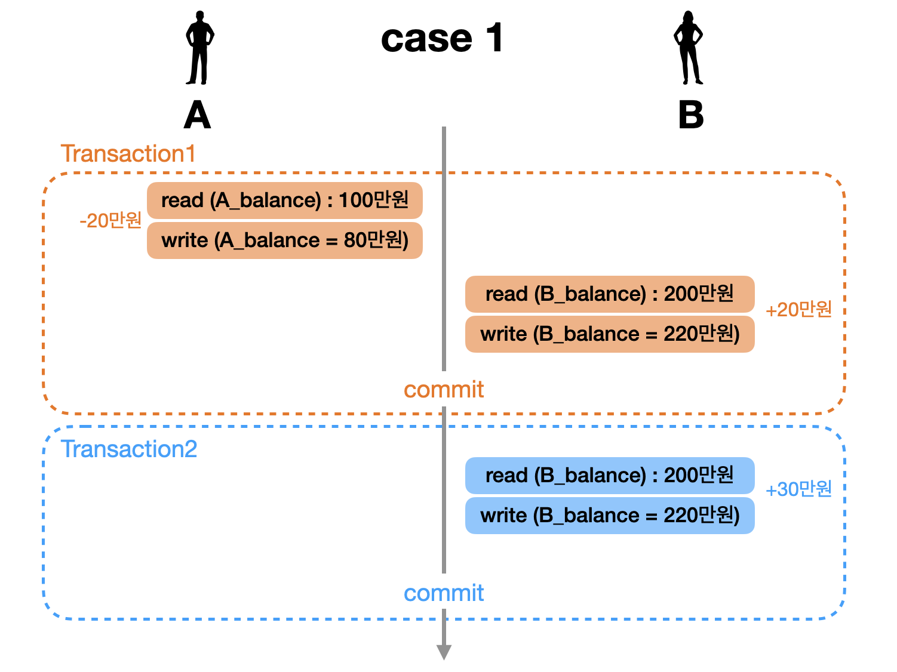
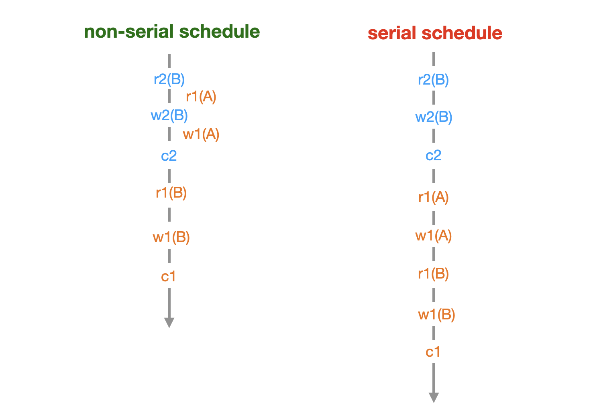
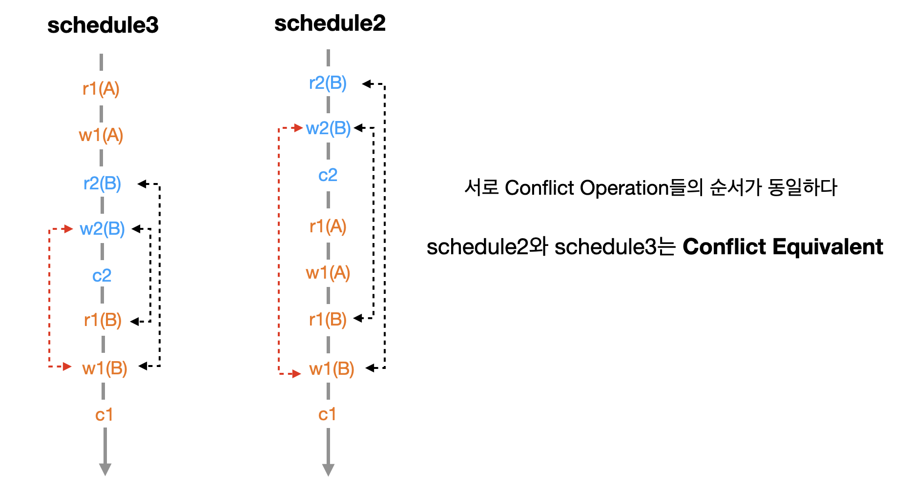
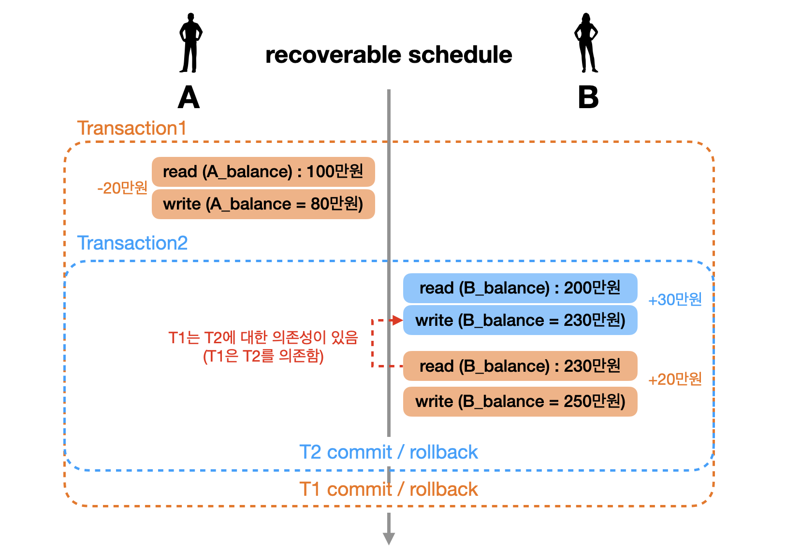

---

## 1. 동시성 제어(Concurrency Control)

동시성 제어(concurrency control)에 대해서 알아보자.

<br>

데이터베이스는 보통 다수의 사용자를 가정한다. 따라서 동시에 작동하는 다중 트랜잭션의 상호 간섭 작용에서 데이터베이스를 보호할 수 있어야 하며, 이를 동시성 제어 (Concurrency Control)라고 한다. 

* 동시성을 제어할 수 있도록 하기 위해 모든 DBMS가 공통적으로 Lock 기능을 제공한다. 여러 사용자가 데이터를 동시에 액세스하는 것처럼 보이지만 내부적으로는 하나씩 실행되도록 트랜잭션을 직렬화(Serialize)하는 것이다.
* `SET TRANSACTION` 명령어를 이용해 트랜잭션의 격리 수준(Isolation level)을 조정할 수 있는 기능도 제공한다. 
  * 데이터베이스마다 구현 방식이 다르지만 SQL Server를 예로 들면, 기본 트랜잭션 Isolation level인 ```Read Committed``` 상태에선 레코드를 읽고 다음 레코드로 이동하자마자 Shared Lock을 해제하지만, Repeatable Read로 올리면 트랜잭션을 ```Commit```될 때까지 Shared Lock을 유지한다.

<br>

> 격리 수준(Isolation level), 락(Lock)에 대한 개념은 뒤의 포스트에서 다룬다.
{: .prompt-info }

<br>

---

## 2. 스케쥴, 직렬화 가능(Schedule, Serializability)

이전의 [ACID에서의 Isolation](https://seungki1011.github.io/posts/rdbms-4-transaction/#isolation%EA%B2%A9%EB%A6%AC%EC%84%B1)에서 이용한 예제를 다시 이용하겠다.

 ```A```가 ```B```에게 20만원을 이체할 때 ```B```가 동시에 ATM에서 자기 계좌로 30마원을 입금하는 상황이라고 가정하자. 이때 이 트랜잭션이 가능한 여러 형태의 동작을 케이스 별로 살펴보자.

<br>

### Case 1

 

 <br>

---

### Case 2

 

<br>

---

### Case 3

 

<br>

---

### Case 4

 

* Case 4의 경우 ```B```의 ```balance```를 이미 ```read```한 상황에서 30만원 입금에 대한 ```Transaction2```가 일어난 후, 기존의 ```Transaction1```에서 읽은 ```balance```에 대해서 ```write``` 작업이 실행되면서 기존의 30만원 입금이 사라졌다
* Case 4의 경우를 Lost Update라고 하며, 뒤의 [Isolation Level](https://seungki1011.github.io/posts/rdbms-6-isolation-level/#lost-update)에서 더 자세히 살펴볼 예정

<br>

위의 4가지 케이스에 대해서 각 ```read```, ```write```, ```commit```을 하나의 연산(operation)이라고 하고, 이를 간략화 해서 표현해보자.

* 예) ```Trasnsaction1```에 대한 ```A```의 잔액 ```read``` : ```read(A_balance)``` → ```r1(A)```

<br>

이런식으로 일련의 연산들을 나열해서 다음과 같이 표현할 수 있다. 

* Case 1 : ```r1(A) w1(A) r1(B) w1(B) c1 r2(A) w2(B) c2``` 
* Case 2 : ```r2(B) w2(B) c2 r1(A) w1(A) r1(B) w1(B) c1``` 
* Case 3 : ```r1(A) w1(A) r2(B) w2(B) c2 r1(A) w1(A) c1``` 
* Case 4 : ```r1(A) w1(A) r1(B) r2(B) w2(B) c2 w1(B) c1``` 

<br>

일련의 연산을 수행하는 방법들은 위의 4가지 케이스 말고도 더 다양하게 존재할 수 있다. 이 연산들을 수행하는 순서를 ```Schedule```이라고 한다. 이 떄 각 트랜잭션내의 연산들에 대한 순서는 바뀌지 않는다.

* 예) ```Transaction2```의 ```r2(B) w2(B) c2``` 라는 순서 자체는 변하지 않는다

<br>

다음으로 ```Schedule```이 짜여진 형태에 따라 어떻게 분류되는지 알아보자. 

<br>

 

* ```Serial Schedule```: 트랜잭션들이 겹치지 않고 한 번에 하나씩 실행되는 ```Schedule``` 
* ```Non-Serial Schedule```: 트랜잭션들이 동시에 겹쳐서 실행되는 ```Schedule```

<br>

각 ```Schedule```의 개념에 대해 더 자세히 알아보자.

<br>

---

### 2.2 Serial Schedule

 

* ```Serial Schedule```는 이상한 데이터가 만들어질 가능성은 없다
* ```Serial Schedule```의 경우 한번에 하나의 트랜잭션만을 실행하기 때문에 성능이 좋지 않아서 현실적으로 사용할 수 없는 방식
  * 동시성이 없기 때문에 여러 트랜잭션을 처리할 수 없음

<br>

---

### 2.3 Non-Serial Schedule

 

* ```Non Serial Schedule```의 경우 트랜잭션들이 겹쳐서 실행되기 때문에 같은 시간 동안 더 많은 트랜잭션의 처리가 가능하다
* 우리가 앞에서 봤던 Schedule 4 처럼 트랜잭션이 어떤 형태로 겹쳐져서 실행되나에 따라 이상한 결과(Lost Update)가 나올 수 있다.

<br>

---

## 3. Conflict

결론적으로, 우리는 동시에 많은 트랜잭션들을 겹쳐서 (```Non Serial Schedule```) 실행할 수 있으면서 이상한 결과는 나오지 않도록 하고 싶다. 이를 달성하기 위해서, 우리는 ```Serial Schedule```과 동일한 ```Non Serial Schedule```을 이용하면 되는것이다.

여기서 ```Serial Schedule```과 동일한 ```Non Serial Schedule``` 이라는 모순적인 표현을 설명하기 위해서 "```Schedule```이 동일하다" 가 무엇을 의미하는지 ```Conflict```의 개념을 통해 설명할 것이다. 

<br>

두 개의 operation이 다음의 3 가지 조건을 만족하면 ```Conflict```라고 부른다.

1. 서로 다른 트랜잭션 소속
2. 같은 데이터(리소스)에 접근
3. 최소 하나는 ```write``` operation

<br>

 

* ```Conflict Operation```은 순서가 바뀌면 결과가 바뀐다
* 위의 ```2```번 ```read-write conflict```의 operation 순서를 바꾸면 기존의 결과와 달라지는 것을 확일 할 수 있다.

<br>

```Conflict```가 무엇인지 알았으니 ```Conflict Equivalent```가 무엇인지 알아보자.

두 개의 ```Schedule```이 다음의 두 조건을 만족하면 서로 ```conflict equivalent```라고 한다.

<br>

1. 두 ```Schedule```은 같은 트랜잭션들을 가진다
2. 어떠한 ```Conflict Operation```의 순서도 두 ```Schedule``` 모두 동일하다

<br>

 

여기서 그림에서 볼 수 있듯이 ```schedule2```는 ```serial schedule```이고, ```schedule3```의 입장에서 ```schedule2```와 ```conflict equivalent``` 한 것이다. 여기서 ```serial schedule```과 ```conflict equivalent``` 한 경우 이를 ```Conflict Serializable```이라고 한다.

즉, ```non-serial schedule```인 ```schedule3```은 ```Conflict Serializable```한 ```schedule```이고, 이 때문에 ```non-serial schedule```임에도 불구하고 정상적인 결과를 가질 수 있었던 것이다.

<br>

반면에 ```schedule4```의 경우에는 ```serial schedule```과 비교해서 ```Conflict Operation```들의 순서가 동일하지 않기 때문에 ```Conflict Equivalent``` 하다고 볼 수 없다. 그리고 그 어떤 ```serial schedule```(```schedule1,2```과 ```Conflict Equivalent```하지 않기 때문에 이상한 결과가 나온다고 볼 수 있다.

<br>

정리하자면,

1. A schedule which is conflict equivalent (view equivalent) with a serial schedule is conflict serializable (has conflict serializibility, or view serializable)
2. Concurrency control makes any schedule serializable

<br>

---

## 4. Conflict Serializability Protocol

위에서도 언급했던것 처럼 우리의 목표는```Non Serial Schedule```을 실행할 수 있으면서 이상한 결과는 나오지 않도록 하고 싶었고. 이를 달성하기 위해서 ```Serial Schedule```과 동일한 ```Non Serial Schedule```을 구현하고 싶어했다.

여기서 ```Serial Schedule```과 동일한 ```Non Serial Schedule```은 결국에 ```Conflict Serializable```한 ```non-serial schedule```을 구현하면 되는 것이다.

이런 ```schedule```을 구현하기 위해서 사용하는 방법은 무엇일까?

<br>

정답은 여러 트랜잭션을 동시에 실행해도 ```schedule```이 ```conflict serializable```하도록 보장하는 프로토콜(Protocol)을 사용하는 것이다. 이런 프로토콜을 구현하기 위해 각 RDBMS는 Isolation Level, Locking, Concurrency control mechanisms, Conflict detection, etc.. 여러가지 전략들을 사용할 수 있다.

<br>

---

## 5. Recoverability

Recoverability에 대해서 알아보자.

<br>

### 5.1 Unrecoverable Schedule

이전의 이체 예시에서 다음과 같은 새로운 ```schedule5```를 이용해보자.

 

* 위의 경우 ```Commit```된 ```Transaction1```에서 ```Rollback```된 ```Transaction2```에서 ```write``` 했던 230만원을 ```read``` 했다. 즉 유효하지 않은 데이터를 읽어서 작업을 한 것이다.

<br>

```Schedule```내에서 ```Commit```된 트랜잭션이 ```Rollback```된 트랜잭션이 ```write```했던 데이터를 읽었을 경우 이런 ```schedule```을 **Unrecoverable Schedule**이라고 부른다.

**Unrecoverable Schedule**의 경우, ```Rollback```을 해도 이전 상태로 회복이 불가능하기 때문에 이런 ```schedule```은 DBMS가 허용하면 안된다.

<br>

---

### 5.2 Recoverable Schedule

그럼 Unrecoverable과 반대되는 Recoverable Schedule이 뭔지 알아보자.

<br>

 

* ```Transaction1```은 ```Transaction2```를 의존하기 떄문에 의존성이 있는 트랜잭션이 먼저 ```Commit``` 되면 안됨
* ```T2```를 ```Rollback```하는 경우 ```T1```도 ```Rollback```하면 됨

<br>

여기서 **Recoverable Schedule**은 ```schedule``` 내에서 그 어떤 트랜잭션도 자신이 읽은 데이터를 ```write```한 트랜잭션이 먼저 ```Commit/Rollback``` 하기 전까지는 ```Commit```하지 않는 ```schedule```을 의미한다.

이런 ```schedule```은 ```Rollback```을 할 때 이전 상태로 온전히 돌아갈 수 있기 때문에 DBMS는 **Recoverable Schedule**만 허용해야 한다.

<br>

---

### 5.3 Cascadeless Schedule

하나의 트랜잭션이 ```Rollback```을 하면 의존성이 있는 다른 트랜잭션도 ```Rollback```을 해야한다. 바로 이전의 상황을 이용하자면, ```T2```가 ```Rollback```하는 경우, ```T2```에 의존성이 있는 ```T1```도 ```Rollback``` 해야한다. 이 처럼 연쇄적으로 ```Rollback```이 일어나는 것을 **Cascading Rollback**이라고 한다. **Cascading Rollback**의 경우 많이 일어나면 이를 **처리하기 위한 비용이 많이 든다**.

이런 **Cascading Rollback**의 문제를 해결하기 위해서 데이터를 ```write```한 트랜잭션이 ```Commit/Rollback``` 한 뒤에는 데이터를 읽는 ```schedule```만을 허용하는 방법이 나온다.

<br>

 

* ```Transaction2```가 ```Rollback```이 되어도, 아무것도 일어나지 않았던 것 처럼 그냥 ```Transaction1```을 진행하면 된다

<br>

이 처럼 ```schedule``` 내에서 어떠한 트랜잭션도 ```Commit``` 되지 않은 트랜잭션들이 ```write```한 데이터는 읽지 않았을 경우, **Cascadless Schedule**이라고 한다. 

<br>

---

### 5.4 Strict Schedule

바로 이전에 봤던 **Cascadeless Schedule**도 문제는 존재한다. 예를 들자면, 피자가게에서 원래 피자가격인 3만원을 1만원으로 변경하는 트랜잭션을 ```Transaction1```, 2만원으로 변경하는 트랜잭션을 ```Transaction2```라고 하자. 

```schedule : write1(pizza = 10000) write2(pizza = 20000) commit2 abort```

여기서 ```Transaction1```이 문제가 생겨 abort하게 된 경우이다. 이 경우 ```Transaction1```이 시작하기 이전으로 되돌리기 때문에 피자가격이 3만원으로 다시 변하면서, ```Transaction2```에 대한 결과가 완전히 사라지게 된다. 

**Cascadeless Schedule**의 정의를 다시 살펴보자. **Cascadeless Schedule**는 스케쥴내에서 어떠한 트랜잭션도 커밋되지 않은 트랜잭션들이 ```write```한 데이터를 읽지 않은 스케쥴을 의미한다. 위의 예시는 읽기 작업이 없기 때문에 **Cascadeless Schedule**이라고 할 수 있다. 이런 **Cascadeless Schedule**의 문제를 해결하기 위해서는 추가적으로 ```Commit``` 되지 않은 트랜잭션들이 ```write```한 데이터를 **쓰지도 읽지도 않아야 한다**. 이런 스케쥴을 **Strict Schedule**이라고 한다. 

다시 한번 **Strict Schedule**의 정의를 살펴보자. 

**Strict Schedule**은 ```schedule``` 내에서 어떠한 트랜잭션도 ```Commit``` 되지 않은 트랜잭션들이 ```write```한 데이터는 읽지도 쓰지도(read or write) 않았을 경우의 ```schedule```을 의미한다. 

<br>

 

<p align='center'>https://levelup.gitconnected.com/the-schedule-in-the-dbms-2d8c6f19720d</p>

<br>

지금까지 다룬 내용을 결론 내자면 다음과 같다.

**Concurrency control provides Serializability and Recoverability.**

---

## Reference

1. [한국 데이터 산업 진흥원 - SQL 전문가 가이드](https://dataonair.or.kr/db-tech-reference/d-guide/sql/)

2. [인프런 쉬운코드 - 데이터베이스](https://www.inflearn.com/course/%EB%B0%B1%EC%97%94%EB%93%9C-%EB%8D%B0%EC%9D%B4%ED%84%B0%EB%B2%A0%EC%9D%B4%EC%8A%A4-%EA%B0%9C%EB%A1%A0/dashboard)