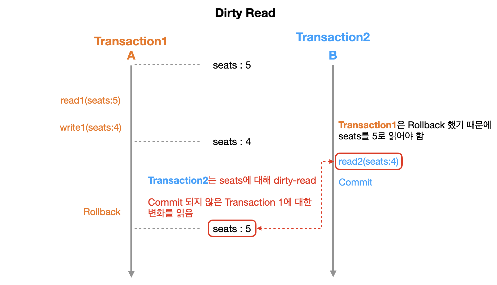
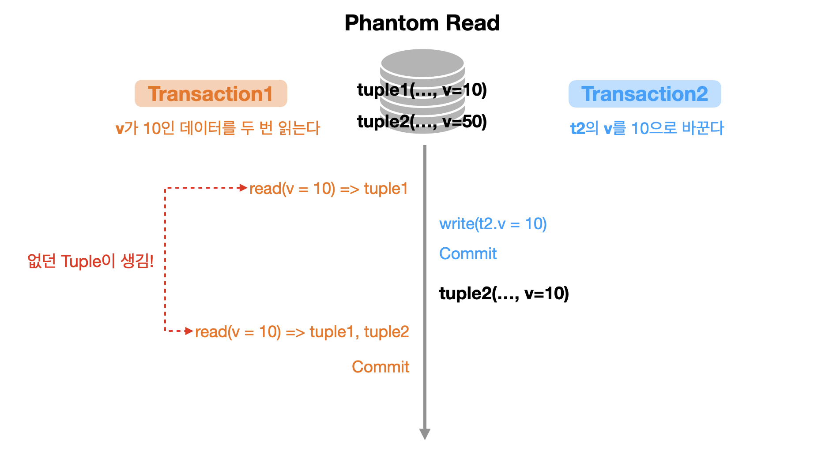
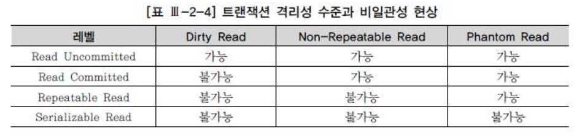
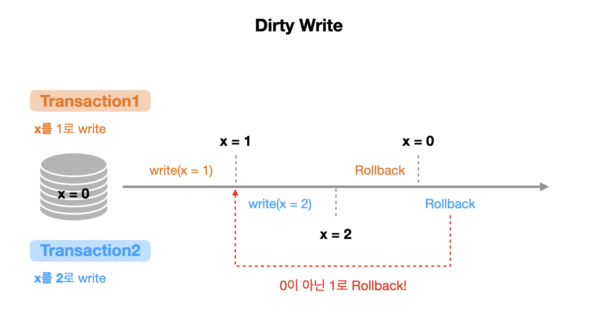
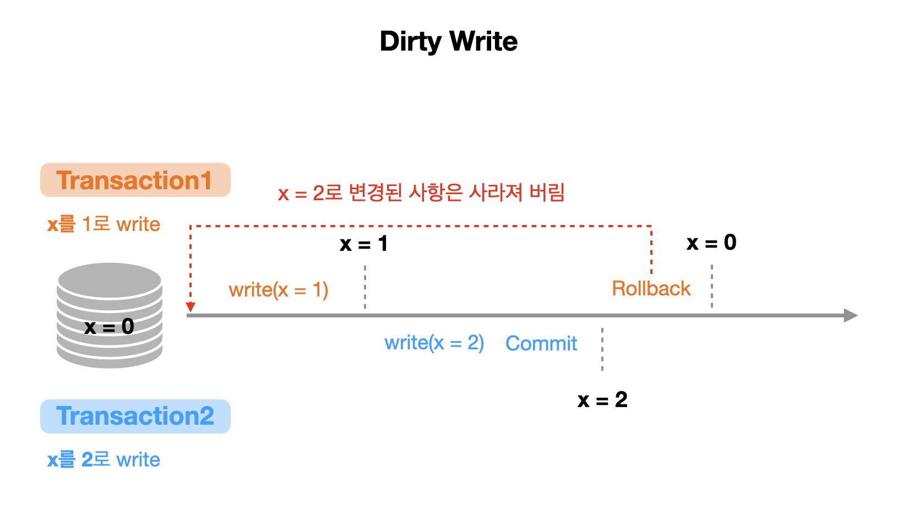
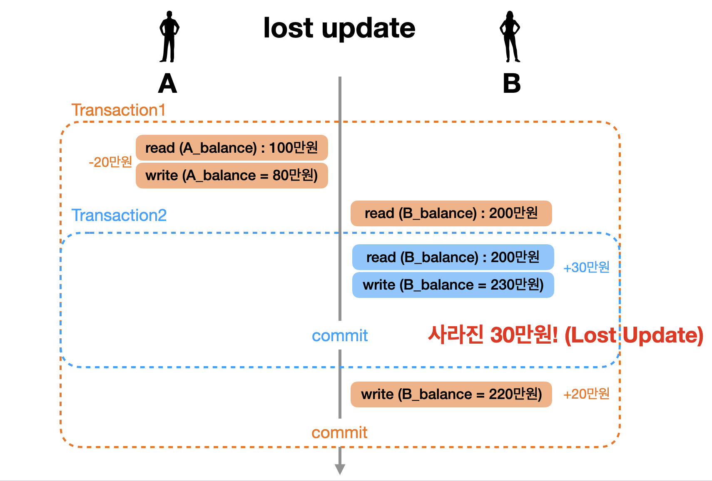
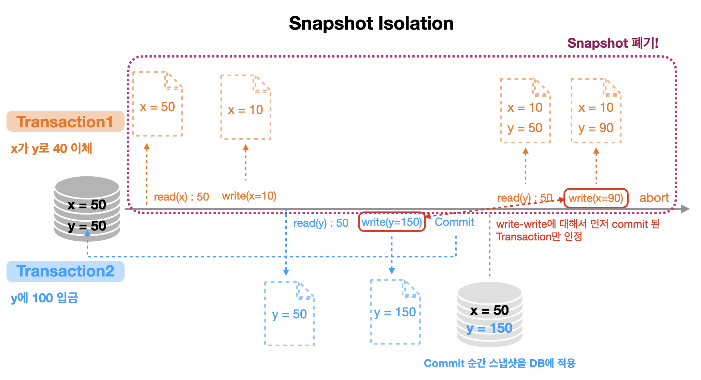

---

## Dirty Read

> 다른 트랜잭션에 의해 수정됐지만 아직 ```Commit```되지 않은 데이터를 읽는 것을 말한다. 변경 후 아직 ```Commit```되지 않은 값을 읽었는데 변경을 가한 트랜잭션이 최종적으로 ```Rollback```된다면 그 값을 읽은 트랜잭션은 Incosistent 상태에 놓이게 된다.
{: .prompt-tip }

<br>

고속 버스 좌석 예약 시스템이 있다고 하자. ```A```라는 사람은 좌석을 예약할 것이고, ```B```는 좌석이 몇개 남았는지 확인하는 상황이다. 기존 좌석(seats)은 5개가 있다고 하자. 여기서 ```A```가 좌석 예약을 하는 ```Transaction1```이 실행되서 ```seats```(=5)를 ```read```하고 ```seats```를 4로 ```write```하는 operation을 수행 할 것이다. 이후 ```Transaction2```에서 ```Transaction1```에서 적용한 변화 (```seats = 4```)를 ```read```했는데 ```Transaction1```이 ```Rollback```하는 상황이 닥친 것이다. 그러면 ```seats```는 다시 기존의 5개로 ```Rollback```이 되지만 문제는 ```B```가 이미 ```seats```를 4개로 읽었다는 것이다. 이게 바로 **Dirty Read** 상황이다. (다음 그림으로 확인하면 더 이해가 쉬울 것이다)

<br>

 

이 처럼 ```Commit```되지 않은 변경사항(데이터)을 ```read```하는 것을 **Dirty Read**라고 부른다.

```Rollback``` 상황이 아니어도, ```Commit```되지 않은 데이터를 읽으면 Dirty Read가 될 수 있음!

<br>

---

## Non-repeatable Read

> 한 트랜잭션 내에서 같은 쿼리를 두 번 수행했는데, 그 사이에 다른  트랜잭션이 값을 수정 또는 삭제하는 바람에 두 쿼리 결과가 다르게 나타나는 현상을 말한다.
{: .prompt-tip }

<br>

다음 그림을 살펴보자.

<br>

 

Isolation은 여러 트랜잭션들이 동시에 실행될 때도 혼자 실행되는 것 처럼 동작하게 만드는 것 이라고 이전에도 설명을 했다. 그러나 위의 상황을 살펴보면 두 번의 ```read```에 대해서 각각이 다른 결과를 가져왔다. 이러한 현상을 **Non-repeatable Read** (Fuzzy Read)라고 한다.

<br>

---

## Phantom Read

> 한 트랜잭션 내에서 같은 쿼리를 두 번 수행했는데, 첫 번째 쿼리에서 없던 유령 튜플(Phantom tuple)이 두 번째 쿼리에서 나타나는 현상을 말한다.
{: .prompt-tip }

<br>

다음 그림을 살펴보자.

<br>

 

위의 그림을 살펴보면, ```Transaction2```에서 ```tuple2```의 ```v```값을 수정하는 것으로 인해 ```Transaction1```의 두 번째 ```read```에서 기존에 읽지 않았던 튜플을 읽은 것 (없던 데이터가 생긴 것)을 확인 할 수 있다. 이런 현상을 **Phantom Read**라고 부른다.

<br>

---

## Isolation Level (SQL standard)

 

<p align='center'>SQL 전문가 가이드</p>

1. Read Uncommitted
   * Transaction에서 처리 중인 아직 commit 되지 않은 데이터를 다른 트랜잭션이 읽는 것을 허용한다
2. Read Committed
   * Transaction이 commit되어 확정된 데이터만 다른 Transaction이 읽도록 허용함으로써 **Dirty Read를 방지**해준다
   * Commit된 데이터만 읽더라도 Non-Repeatable Read와 Phantom Read 현상을 막지는 못한다 (읽는 시점에 따라 결과가 다를 수 있다는 것이다)
3. Repeatable Read
   * Transaction 내에서 쿼리를 두 번 이상 수행할 때, 첫 번째 쿼리에 있던 튜플(tuple)이 사라지거나 값이 바뀌는 현상을 방지해 준다
   * Phantom Read 현상을 막지는 못한다 (첫 번째 쿼리에서 없던 새로운 튜플이 나타날 수 있다는 것이다)
4. Serializable Read
   * Transaction 내에서 쿼리를 두 번 이상 수행할 때, 첫 번째 쿼리에 있던 튜플이 사라지거나 값이 바뀌지 않음은 물론이고 새로운 튜플이 나타나지도 않는다
   * 아예 이상한 현상 자체가 발생하지 않는 level

<br>

정리하자면 **Isolation Level**은 3 가지 이상 현상을 정의하고 어떤 현상을 허용하는지에 따라서 각 Level이 구분된다. 이런 **Isolation Level을 통해서 전체 처리량(throughput)과 데이터 정합성(consistency) 사이에서의 trade-off를 이해**하는 것이 중요하다.

<br>

> * 트랜잭션 Isolation Level(격리성 수준)은 ISO에서 정한 분류 기준일 뿐이며, 모든 DBMS가 4가지 레벨을 다 지원하지는 않는다. 
> * 예를 들어, SQL Server와 DB2는 4가지 레벨을 다 지원하지만 Oracle은 Read Committed와 Serializable Read만 지원한다. (Oracle에서 Repeatable Read를 구현하려면 `for update` 구문을 이용하면 된다.) 
> * 대부분 DBMS가 Read Committed를 기본 트랜잭션 격리성 수준으로 채택하고 있으므로 Dirty Read가 발생할까 걱정하지 않아도 되지만, Non-Repeatable Read, Phantom Read 현상에 대해선 세심한 주의가 필요하다.

<br>

SQL 표준에서 정의한 3가지 이상 현상만으로 모든 이상현상을 커버하지 못한다는 지적이 나온다. 그래서 다음으로 **Dirty Write, Lost Update** 등의 이상현상에 대해 알아볼 것이다.

<br>

---

## Dirty Write

> Dirty Read와 비슷하다.
>
> 다른 트랜잭션에 의해 수정됐지만 아직 ```Commit```되지 않은 데이터에 쓰는 것을 말한다. 변경 후 아직 ```Commit```되지 않은 값에 쓰기작업을 했는데 변경을 가한 트랜잭션이 최종적으로 ```Rollback```된다면 그 값에 쓰기 작업을 한 트랜잭션은 Incosistent 상태에 놓이게 된다.
{: .prompt-tip }

<br>

 

 

위의 경우들 처럼, ```Commit```되지 않은 데이터 위에 ```write```를 하는 것을 **Dirty Write**라고 부른다.

<br>

---

## Lost Update

>  두 개 이상의 트랜잭션에서 같은 데이터(리소스)를 동시에 ```Update``` 할 때 ```Update``` 결과가 일부 사라지는 현상.
{: .prompt-tip }

<br>

이전의 트랜잭션 케이스에서 사용한 예시를 가져왔다.

<br>

 

```B```의 ```balance```를 이미 ```read```한 상황에서 30만원 입금에 대한 ```Transaction2```가 일어난 후, 기존의 ```Transaction1```에서 읽은 ```balance```에 대해서 ```write``` 작업이 실행되면서 기존의 30만원 입금이 사라졌다. 이 처럼 변경 사항을 잃어버리는 것을 **Lost Update**라고 부른다.

<br>

> * Read Skew : Incosistent한 데이터 읽기 
> * Write Skew : Incosistent한 데이터 쓰기
>
> 이외에도 여러 이상 현상이 존재하기 때문에 관련 Isolation Level이나 처리방법에 대해서도 한번 찾아보는 것이 좋을 것 같다.

<br>

---

## Snapshot Isolation

**Snapshot Isolation**은 기존의 SQL 표준에서 정의하는 4 가지 Isolation Level와는 다르게 동작한다. 들어가기에 앞서 아주 간단히 설명하자면, Snapshot Isolation은 Lock을 이용하는 것이 아니라 트랜잭션을 시작하는 시점의 데이터베이스의 스냅샷을 찍어서 정합성을 유지한다.

Snapshot Isolation은 여러 버전(multi version)의 스냅샷을 관리하는 MVCC(Multi Version Concurrency Control)로 구현했다고 볼 수 있다. (MVCC는 뒤에서 더 자세히 다룰 예정) 

Snapshot Isolation의 대략적인 동작 과정은 다음 그림과 같다.

<br>

 

* 각 트랜잭션에 대한 Snapshot이 따로 존재한다
* ```Commit```이 되어야 Snapshot을 DB에 적용한다
* 각 Snapshot의 version은 timestamp나 transaction identifier가 존재
* Abort이 일어나면 해당 트랜잭션에 대한 스냅샷을 폐기하면 됨 

<br>

지금까지 설명 격리 수준들은 개념적인 내용으로, 실제로 RDBMS마다 격리 수준을 구현하는 방법들은 전부 다르기 때문에, 필요에 맞게 각 RDBMS의 문서를 읽고 적용하면 된다.

---

## Reference

1. [한국 데이터 산업 진흥원 - SQL 전문가 가이드](https://dataonair.or.kr/db-tech-reference/d-guide/sql/)

2. [인프런 쉬운코드 - 데이터베이스](https://www.inflearn.com/course/%EB%B0%B1%EC%97%94%EB%93%9C-%EB%8D%B0%EC%9D%B4%ED%84%B0%EB%B2%A0%EC%9D%B4%EC%8A%A4-%EA%B0%9C%EB%A1%A0/dashboard)