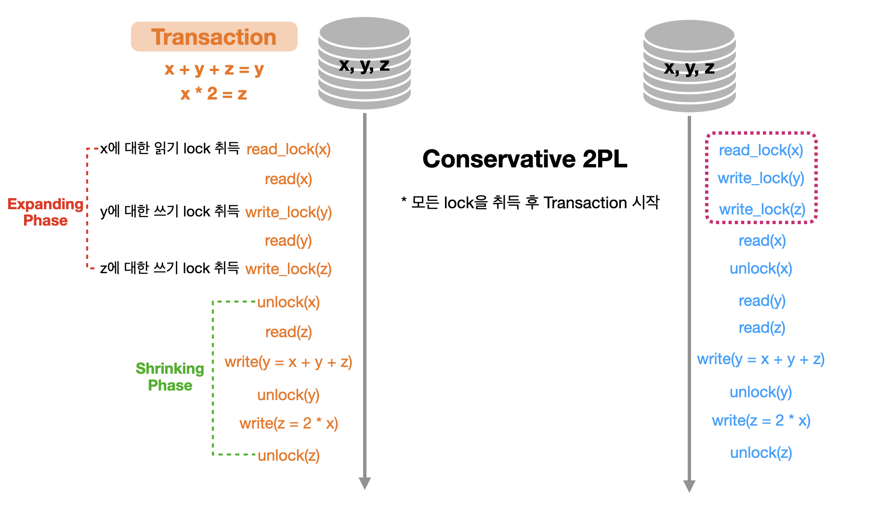

---

## 락(Lock) 소개

RDBMS를 사용하는 이유로는 성능, 관리의 편의성 등 여러 가지 측면이 있지만, 무엇보다 트랜잭션 처리 능력이 가장 기본적이고 핵심적인 요소라고 할 수 있다. 같은 자원을 액세스하려는 다중 트랜잭션 환경에서 데이터베이스의 일관성과 무결성을 유지하려면 트랜잭션의 순차적 진행을 보장할 수 있는 직렬화(serialization) 장치가 필요하다. 

영화관 좌석을 예약하는 시스템을 예로 들면, 두 명이 동시에 좌석을 요청할 때 정확히 한 명만 좌석을 배정받도록 할 수 있어야 한다. 이런 직렬화가 가능하도록 하기 위해 모든 RDBMS가 공통적으로 사용하는 메커니즘이 락(Lock)이다. 

쉽게 말해서 같은 데이터에 대한 ```read/write```가 일어난다면 예상치 못한 동작을 할 수 있다. 이를 방지하기 위해서 데이터에 대한 **락(Lock)**을 이용하는 것이다. 데이터를 읽거나 변경하기 위해서는 해당 데이터에 대한 락을 취득해야하고, 취득하기 전까지는 대기 상태에 놓는 것이다. 

<br>

---

## 배타적 락(Exclusive Lock)

배타적 락(Exclusive Lock)은 데이터를 변경하고자 할 때 사용되며, 트랜잭션이 완료될 때까지 유지된다. 말 그대로 배타적이기 때문에 해당 락이 해제될 때까지 다른 트랜잭션은 해당 데이터(리소스)에 접근할 수 없다. 변경이 불가능할 뿐만 아니라 읽기도 불가능하다. 

반대로 다른 트랜잭션에 의해 락이 설정된 데이터(리소스)는 그것이 공유 락이든 배타적 락이든, 배타적 락을 동시에 설정할 수 없다.

 

* **Write-Lock**을 **Exclusive Lock**이라고도 한다
* ```read / write (Insert, Update, Delete)```할 때 사용한다
* 다른 ```Transaction```이 같은 데이터를 ```read / write```하는 것을 허용하지 않는다

<br>

---

## 공유 락(Shared Lock)

공유 락(Shared Lock)은 데이터를 읽고자 할 때 사용된다. 

다른 공유 락과는 호환되지만 배타적 락과는 호환되지 않는다. **"호환된다"**는 말은 하나의 데이터(리소스)에 두 개 이상의 락을 동시에 설정할 수 있음을 뜻한다. 다시 말해, 공유 락을 설정한 데이터에 다른 트랜잭션이 추가로 공유 락을 설정할 수는 있지만 배타적 락은 불가능하다. 

따라서 자신이 읽고 있는 데이터를 다른 사용자가 동시에 읽을 수는 있어도 변경은 불가능하다. 반대로, 다른 사용자가 읽고 있는 데이터를 동시에 읽을 수는 있어도 변경 중인 데이터를 동시에 읽을 수는 없다.

<br>

 

* **Read-Lock**을 **Shared Lock**이라고도 한다
* ```read``` 할 때 사용한다
* 다른 ```Transaction```이 ```read```하는 것을 허용한다
* Shared Lock을 취득한 데이터를 Exclusive Lock(Write)을 통해 ```write```하는 것은 불가

<br>

* 공유락- 공유락 끼리 호환 가능.

* 배타락과 공유락 외에도 다양한 락들이 존재하며, 각 RDBMS들 마다 락을 구현하는 방법이나 락끼리의 호환성(compatibility)이 다를 수 있다.

<br>

---

## 2PL (2-Phase Locking)

 

* **2PL(Two-Phase Locking)** : Transaction에서 모든 Locking Operation이 최초의 Unlock Operation 보다 먼저 수행되도록 설계하는 Protocol
* **Expanding Phase** : Lock을 취득하기만 하고 반환하지는 않는 phase
* **Shrinking Phase** : Lock을 반환만 하고 취득하지 않는 phase

<br>

이러한 **2PL**은 **serializability**를 보장한다. 그러나 2PL Protocol에서도 특정한 상황에서도 문제가 발생한다. 두 세션이 Lock을 설정한 데이터를 서로 액세스하려고 마주보는 문제인 **Deadlock**에 대해 알아보자.

<br>

---

## 데드락 (Deadlock, 교착상태)

교착상태(Deadlock)는, 두 세션이 각각 Lock을 설정한 리소스를 서로 액세스하려고 마주보며 진행하는 상황을 말하며, 둘 중 하나가 뒤로 물러나지 않으면 영영 풀릴 수 없다. 흔히 좁은 골목길에 두 대의 차량이 마주 선 것에 비유하곤 한다. 

교착상태가 발생하면, DBMS가 둘 중 한 세션에 에러를 발생시킴으로써 문제를 해결하는데, 이를 방지하려면 어떻게 해야할까? 

조금 전 설명한 Lock은 교착상태 발생 가능성을 줄이는 방법이기도 하다. 여러 테이블을 액세스하면서 발생하는 교착상태는 테이블 접근 순서를 같게 처리하면 피할 수 있다. 예를 들어, 마스터 테이블과 상세 테이블을 둘 다 갱신할 때 마스터 테이블 다음에 상세 테이블을 갱신하기로 규칙을 정하고, 모든 애플리케이션 개발자가 이 규칙을 지킨다면 교착상태는 발생하지 않을 것이다.

<br>

 

데이터베이스에서 발생하는 **Deadlock(교착상태)**는 OS의 Deadlock과 유사하고, 해결방법도 유사하다.

이제 **2PL** 프로토콜들의 종류를 살펴보자.

<br>

---

## Conservative 2PL

예시를 통해 **Conservative 2PL**에 대해 알아보자.

<br>

 

* **Conservative 2PL** : 모든 Lock을 취득한 후에 Transaction을 시작한다
* Dead-lock Free
* 실용적이지 않다

<br>

---

## Strict 2PL (S2PL)

예시를 통해 **Strict 2PL**에 대해 알아보자.

<br>

 

* **Strict 2PL(S2PL)** : Write-Lock을 ```Commit/Rollback``` 될 때 반환한다
* **S2PL**은 Strict Schedule을 보장한다
* Recoverability를 보장한다

<br>

---

## Strong Strict 2PL(SS2PL)

**Strong Strict 2PL(SS2PL)**은 이전의 S2PL의 강화 버젼이다.

SS2PLd은 Read-Lock/Write-Lock을 모두 ```Commit/Rollback``` 될 때 반환한다. 다음은 SS2PL의 특징이다.

* SS2PL은 Strict Schedule을 보장한다
* Recoverability를 보장한다
* S2PL보다 구현이 쉽다
* 상대적으로 Lock을 오래 취득하고 있기 때문에 Lock 취득 대기 시간이 늘어난다 

<br>

---

## 2PL의 한계

2PL방식의 경우 Read Lock-Read Lock를 제외한 경우에는 호환이 되지 않기 때문에 전체 처리량(throughput)이 좋지 않다. (Read-Read를 제외하고는 나머지의 경우에 대해서 한쪽이 블락되는 상황)

이런 Read-Lock와 Write-Lock이 서로 블락하는 현상이라도 해결하고자 MVCC(Multi Version Concurrency Control)를 사용하게 된다. 대부분 RDBMS들은 동시성 제어를 위해서 Lock과 MVCC를 활용한다. 

---

## Reference

1. [한국 데이터 산업 진흥원 - SQL 전문가 가이드](https://dataonair.or.kr/db-tech-reference/d-guide/sql/)

2. [인프런 쉬운코드 - 데이터베이스](https://www.inflearn.com/course/%EB%B0%B1%EC%97%94%EB%93%9C-%EB%8D%B0%EC%9D%B4%ED%84%B0%EB%B2%A0%EC%9D%B4%EC%8A%A4-%EA%B0%9C%EB%A1%A0/dashboard)