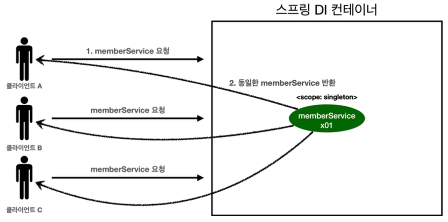

---

## 1. 빈 생명주기 콜백(Spring Bean Lifecycle Callback)

빈 생명주기 콜백에 대하여 알아보자.

<br>

### 1.1 빈 생명주기 콜백

DBCP(데이터베이스 커넥션 풀), 네트워크 소켓처럼 애플리케이션 시작 시점에 필요한 연결을 미리 해두고, 종료 시점에 열결을 모두 종료하는 작업을 진행하기 위해서는 객체의 초기화와 종료하는 작업이 필요하다. 스프링에서 이런 객체의 초기화와 종료를 어떻게 설정하는지 알아보자.

들어가기에 앞서 어떤 외부 네트워크에 연결하는 객체를 생성한다고 가정해보자. ```NetworkClient```는 애플리케이션 시작 시점에 ```connect()```를 호출해서 연결을 맺어두어야 하고, 애플리케이션이 종료되면 ```disconnect()```를 호출해서 연결을 끊어야 한다.

<br>

코드로 한번 살펴보자.

`NetworkClient`

```java
public class NetworkClient {
    private String url;
		
    public void setUrl(String url) {
        this.url = url;
    }

    public NetworkClient() {
        System.out.println("생성자 호출, url = " + url);
        connect();
        call("초기화 연결 메세지");
    }

    // 애플리케이션 시작시 호출
    public void connect() {
        System.out.println("connect: "+url);
    }

    public void call(String message) {
        System.out.println("call: " + url + ", message = " + message);
    }

    public void disconnect() {
        System.out.println("close: " + url);
    }
}
```

<br>

`BeanLifeCycleTest`

```java
public class BeanLifeCycleTest {

    @Test
    public void lifeCycleTest() {
        ConfigurableApplicationContext ac = new AnnotationConfigApplicationContext(LifeCycleConfig.class);
        NetworkClient client = ac.getBean(NetworkClient.class);
        ac.close(); // 스프링 컨테이너 종료
    }

    @Configuration
    static class LifeCycleConfig {

        @Bean
        public NetworkClient networkClient() {
            NetworkClient networkClient = new NetworkClient();
            networkClient.setUrl("http://123.456.789.1");
            return networkClient;
        }
    }
}
```

<br>

```
생성자 호출, url = null
connect: null
call: null, message = 초기화 연결 메세지
```

* ```close()``` 사용을 위해 ```ConfigurableApplicationContext``` 필요
* 객체 생성 단계에는 url이 없고, 객체 생성후 외부에서 수정자 주입을 통해서 ```setUrl()```이 호출되어야 url이 존재하게 된다

<br>

스프링 빈은 대략적으로 (**객체 생성 → 의존관계 주입**) 같은 생명주기(Lifecycle)를 가진다. 의존관계 주입까지 다 끝난 상태가 되어야 데이터를 사용할 수 있는 준비가 완료되기 때문에, 초기화 작업은 의존관계 주입이 모두 완료되고 난 다음에 호출해야 한다.

스프링은 이런 문제를 해결하기 위해 의존관계 주입이 완료되면 스프링 빈에게 콜백 메서드를 통해 초기화 시점을 알려주는 다양한 기능을 제공한다. 또한 스프링 컨테이너가 종료되기 직전에 소멸 콜백을 해준다.

그래서 스프링 빈의 이벤트 라이플 사이클을 보면 다음과 같을 것이다.

<br>

**스프링 컨테이너 생성 → 스프링 빈 생성 → 의존관계 주입 → 초기화 콜백 → 사용 → 소멸전 콜백 → 컨테이너 종료**

<br>

> 객체의 생성과 초기화를 분리하는 것이 유지보수의 관점에서 좋다
{: .prompt-tip }

<br>

다음은 스프링에서 지원하는 빈 생명주기 콜백의 3가지 방법이다

1. ```InitializingBean```, ```DisposableBean```
2. 설정 정보에 초기화 메서드, 종료 메서드 지정
3. ```@PostConstruct```, ```@PreDestroy```

<br>

여기서 2, 3의 방법에 대해 알아보자. 

---

### 1.2 초기화, 소멸 메서드 지정

설정 정보에 `@Bean(initMethod = "init", destroyMethod = "close")` 처럼 초기화, 소멸 메서드를 지정할 수 있다.

<br>

기존의 코드를 수정해보자.

`NetworkClient`

```java
// 기존 구현
public void disConnect() {
    System.out.println("close + " + url);
}
		 
public void init() { System.out.println("NetworkClient.init"); // 초기화 메서드
    connect();
    call("초기화 연결 메시지");
}
     
public void close() { // 소멸(종료) 메서드
    System.out.println("NetworkClient.close");
    disConnect();
}
```

<br>

`BeanLifeCycleTest` - `LifeCycleConfig`

```java
@Configuration
static class LifeCycleConfig {
     
     @Bean(initMethod = "init", destroyMethod = "close") // 초기화, 소멸 메서드 지정
     public NetworkClient networkClient() {
         NetworkClient networkClient = new NetworkClient();
         networkClient.setUrl("http://123.456.789.1");
         return networkClient;
     } 
}
```

<br>

```
생성자 호출, url = null
NetworkClient.init
connect: http://123.456.789.1
call: http://123.456.789.1, message = 초기화 연결 메시지
NetworkClient.close
close: http://123.456.789.1
```

* 초기화, 소멸 메서드 지정의 장점
  * 메서드 이름 자유롭게 지정
  * 빈 스프링 코드에 의존하지 않음
  * 코드가 아닌 설정 정보를 이용하기 때문에 코드를 고칠 수 없는 외부 라이브러리에도 초기화, 종료 메서드 적용 가능

<br>

> ```destroyMethod```의 디폴값은 ```(inferred)```이고, 이는 종료 메서드를 추론해서 호출해준다.
{: .prompt-tip }

<br>

---

### 1.3 @PostConstruct, @PreDestroy

```@PostConstruct```, ```@PreDestroy```를 사용하도록 코드를 수정해보자.

<br>

`NetworkClient`

```java
@PostConstruct
public void init() {
   System.out.println("NetworkClient.init");
   connect();
   call("초기화 연결 메시지");
}
     
@PreDestroy
public void close() {
   System.out.println("NetworkClient.close");
   disConnect();
}
```

* ```@PostConstruct```, ```@PreDestroy```를 사용하는 방법이 제일 편리하게 초기화와 종료를 실행할 수 있다
* 최신 스프링에서 권장하는 방법이다
* 단점은 외부 라이브러리에 적용하지 못한다. 외부 라이브러리에 적용 해야하는 경우에는 메서드 지정의 방식을 사용하자

<br>

---

## 2. 빈 유효 범위(Spring Bean Scope)

스프링 빈 스코프에 대해 알아보자. 

지금까지 우리는 스프링 빈이 스프링 컨테이너의 생성과 함께 생성되어서 스프링 컨테이너의 종료까지 유지된다고 가정하고 사용해왔다. 이 이유는 스프링 빈의 디폴트 빈 스코프가 싱글톤 스코프로 생성되었기 때문이다. 여기서 스코프라는 것은 말 그대로 빈이 존재할 수 있는 범위라는 뜻이다.

스프링은 다음과 같은 스코프를 지원한다.

* Singleton(싱글톤) 
  * 디폴트 스코프
  * 스프링 컨테이너의 시작과 종료까지 유지되는 가장 넓은 스코프


* Prototype(프로토타입)
  * 스프링 컨테이너가 프르토타입 빈의 생성, 의존관계 주입, 초기화까지만 처리한다
  * ```@Predestroy```같은 소멸 메서드는 호출되지 않는다


* 웹 관련 스코프들
  * request
  * session
  * application

<br>

---

### 2.1 Singleton vs Prototype

#### 2.1.1 싱글톤과 프로토타입 비교

<br>

   

<p align='center'>Singleton Scope</p>

* 지금까지 우리가 사용해왔던 것 처럼 스프링 컨테이너는 항상 같은 인스턴스의 스프링 빈을 반환한다

<br>

   

<p align='center'>Prototype Scope</p>

* 프로토타입 빈 요청 과정
  1. 프로토타입 스코프의 빈을 스프링 컨테이너에 요청한다
  2. 스프링 컨테이너는 이 시점에 프로토타입 빈을 생성하고, 필요한 의존관계를 주입한다
  3. 스프링 컨테이너는 생성한 프로토타입 빈을 클라이언트에게 반환한다


* 스프링 컨테이너는 프로토타입 빈 생성 ,의존관계 주입, 초기화까지만 처리한다
* ```@Predestroy```같은 소멸 메서드는 호출되지 않는다


* 프로토타입 빈은 프로토타입 빈을 조회한 클라이언트가 관리해야한다
  * 예) 종료 메서드에 대한 호출도 클라이언트가 해야한다

<br>

---

#### 2.1.2 싱글톤과 프로토타입 함께 사용

싱글톤 빈과 프로토타입 빈을 함께 사용하는 경우 문제가 발생할 수 있다. ```clientBean```이라는 싱글톤 빈이 의존관계 주입을 통해서 프로토타입 빈을 주입받아서 사용하는 경우를 살펴보자.

<br>

   

* ```clientBean```은 싱글톤이기 때문에 스프링 컨테이너 생성 시점에서 함께 생성되고, 의존관계 주입도 받는다
  * ```clientBean```은 의존관계 자동 주입을 사용하고, 주입 시점에 스프링 컨테이너에 프로토타입 빈을 요청한다
  * 스프링 컨테이너는 프로토타입 빈을 생성해서 ```clientBean```에 반환한다
  * 생성과 반환 시점에서 프르토타입 빈의 ```count```필드는 0이다


* ```clientBean```은 프로토타입 빈을 내부 필드에 보관


* 클라이언트 A가 ```clientBean```을 스프링 컨테이너에 요청해서 받는다
  * ```clientBean.logic()``` 호출
  * 프로토타입 빈의 ```addCount()```가 호출되면서 프로토타입 빈의 ```count```가 증가 (0 → 1)


* 클라이언트 B가 ```clientBean```을 스프링 컨테이너에 요청해서 받는다. 이때 ```clientBean```은 싱글톤이기 때문에 항상 같은 ```clientBean```이 반환된다
  * ```clientBean.logic()``` 호출
  * 프로토타입 빈의 ```addCount()```가 호출되면서 프로토타입 빈의 ```count```가 증가 (1 → 2)

<br>

위에서 싱글톤과 프로토타입 빈을 함께 사용할 때 발생하는 문제는 싱글톤 빈의 생성 시점에서 이미 프로토타입 빈의 주입을 받고 계속 유지된다는 것이다. 보통 프로토타입 빈을 사용할 때는 주입 시점에만 새로 생성하는 것이 아닌, 사용할 때 마다 새로 생성해서 사용하는 것을 원할 것이다.

이 문제를 해결하기 위해서 Provider를 이용하면 된다.

<br>

---

### 2.2 Provider

지정한 빈을 컨테이터에서 대신 찾아주는 DL(Dependency Lookup)을 제공하는 것이 ```ObjectProvider```이다.

코드로 확인해보자.

<br>

```java
@Autowired
private ObjectProvider<PrototypeBean> prototypeBeanProvider;

public int logic() {
    PrototypeBean prototypeBean = prototypeBeanProvider.getObject();
    prototypeBean.addCount();
    int count = prototypeBean.getCount();
    return count;
}
```

* `prototypeBeanProvider.getObject()` 을 통해서 항상 새로운 프로토타입 빈이 생성된다
* `ObjectProvider` 의 `getObject()` 를 호출하면 내부에서는 스프링 컨테이너를 통해 해당 빈을 찾아서 반환한다 (DL)
* `ObjectProvider` 는 지금 딱 필요한 DL 정도의 기능만 제공한다

<br>

```ObjectProvider```외에도 자바 표준에서 제공하는 Provider를 사용하는 방법도 있다. 이 경우의 특징은 다음과 같다.

* ```get()``` 메서드 하나로 기능이 단순
* 별도의 라이브러리 필요
* **자바 표준이기 때문에 스프링이 아닌 다른 컨테이너에서도 사용 가능하다**

<br>

---

### 2.3 Web Scope

웹 스코프에 대해서 알아보자.

#### 2.3.1 웹 스코프 소개

웹 스코프의 특징은 다음과 같다.

* 웹 환경에서만 동작한다
* 스프링이 해당 스코프의 종료시점까지 관리한다 (소멸 메서드도 호출한다)

<br>

웹 스코프의 종류는 다음과 같다.

* **request**
  * HTTP 요청 하나가 들어오고 나갈 때 까지 유지되는 스코프
  * 각각의 HTTP 요청에 별도의 빈 인스턴스가 생성되고 관리된다
  * 데이터를 개별 요청마다 다르게 관리하고 싶을 떄 사용할 수 있다


* **session**
  * HTTP 세션과 동일한 생명주기를 가지는 스코프


* **application**
  * ```ServletContext```와 동일한 생명주기를 가지는 스코프


* **websocket**
  * 웹 소켓과 종일한 생명주기를 가지는 스코프

<br>

---

#### 2.3.2 Request Scope

Request 스코프를 사용하는 예시를 살펴보자.

<br>

들어가기에 앞서 라이브러리를 추가하자(웹 환경 위에서 동작하기 위한 라이브러리).

`build.gradle`

```groovy
implementation 'org.springframework.boot:spring-boot-starter-web'
```

* 스프링 부트가 내장 톰캣 서버를 활용해서 웹 서버와 스프링을 함께 실행할 수 있다
* 웹 라이브러리가 추가되면 웹 관련된 추가 설정들이 필요하기 때문에 스프링은  ```AnnotationConfigServletWebServerApplicationContext```를 기반으로 애플리케이션을 구동한다

<br>

우리가 웹 서비스를 운영하는데 동시에 여러 HTTP 요청이 날라오면 정확히 어떤 요청이 남긴 로그인지 구분하기 어렵다. 이 때 사용할 수 있는 것이 request 스코프이다. 

* 기대하는 로그의 포맷 : ```[UUID][requestURL][message]```
* UUID를 이용해서 HTTP 요청을 구분
* ```requestURL``` 정보도 추가로 넣어서 어떤 URL을 요청했는지 확인

<br>

`MyLogger`

```java
@Component
@Scope(value = "request")
public class MyLogger {
    private String uuid;
    private String requestURL;

    public void setRequestURL(String requestURL) {
        this.requestURL = requestURL;
    }

    public void log(String message) {
        System.out.println("["+uuid+"]"+" ["+requestURL+"]"+" ("+message+")");
    }

    @PostConstruct
    public void init() {
        uuid = UUID.randomUUID().toString();
        System.out.println("["+uuid+"] request scope bean created: "+this);
    }

    @PreDestroy
    public void close() {
        System.out.println("["+uuid+"] request scope bean closed: "+this);
    }
}
```

* 로그를 출력하기 위한 ```MyLogger``` 클래스
* ```@Scope(value = "request")```로 request 스코프 지정
* 빈이 생성되는 시점에 ```@PostConstruct```를 이용해서 ```uuid``` 생성해서 저장해둠 (```uuid```로 요청 구분)
* ```requestURL```은 빈이 생성되는 시점에는 알 수 없기 때문에, 외부에서 수정자로 입력받는다다

<br>

`LogDemoController`

```java
@Controller
// @RequiredArgsConstructor // Lombok 사용 안하는 중
public class LogDemoController {

    private final LogDemoService logDemoService;
    private final MyLogger myLogger;

    public LogDemoController(LogDemoService logDemoService, MyLogger myLogger) {
        this.logDemoService = logDemoService;
        this.myLogger = myLogger;
    }

    @RequestMapping("log-demo")
    @ResponseBody // view 없이 문자 그대로 응답으로 보낼 수 있음
    // 이 부분의 로직은 보통 컨트롤러 보다 공통 처리가 가능한 스프링 인터셉터나 서블릿 필터같은 곳을 활용하는 것을 권장
    public String logDemo(HttpServletRequest request) { // 요청 URL을 받음
        String requestURL = request.getRequestURL().toString();
        myLogger.setRequestURL(requestURL);

        myLogger.log("controller test");
        logDemoService.logic("testId");
        return "OK";
    }
}
```

* ```MyLogger```가 작동하는지 확인하는 테스트용 컨트롤러
* ```HttpServletRequest```를 통해서 요청 URL을 받음 (```http://localhost:8080/log-demo```)
* 받은 URL 값을 ```myLogger```에 저장
* 컨트롤러에서 "controller test"라는 로그를 남긴다

<br>

`web/LogDemoService`

```java
@Service
// @RequiredArgsConstructor
public class LogDemoService {

    private final MyLogger myLogger;

    public LogDemoService(MyLogger myLogger) {
        this.myLogger = myLogger;
    }

    public void logic(String id) {
        myLogger.log("service id = " + id);
    }
}
```

<br>

스프링 애플리케이션을 실행 시켜보면 오류가 발생한다. 그 이유는 스프링 애플리케이션을 실행하는 시점에서 싱글톤 빈은 생성해서 주입이 가능하지만, request 스코프의 빈은 아직 생성되지 않았기 때문이다. (이 빈은 HTTP 요청이 들어와야 생성이 가능하다!)

이 문제를 해결하기 위해서 이전에 학습한 Provider를 활용할 수 있다.

앞서 배운 ```ObjectProvider```를 사용해보자. 

<br>

`LogDemoController`

```java
@Controller
public class LogDemoController {

    private final LogDemoService logDemoService;
    private final ObjectProvider<MyLogger> myLoggerProvider; // ObjectProvider 사용 

    public LogDemoController(LogDemoService logDemoService, ObjectProvider<MyLogger> myLoggerProvider) {
        this.logDemoService = logDemoService;
        this.myLoggerProvider = myLoggerProvider;
    }

    @RequestMapping("log-demo")
    @ResponseBody
    public String logDemo(HttpServletRequest request) {
        String requestURL = request.getRequestURL().toString();
        MyLogger myLogger = myLoggerProvider.getObject(); // 스프링 컨테이너내에서 해당 빈을 찾아서 반환 (DL)
        myLogger.setRequestURL(requestURL);

        myLogger.log("controller test");
        logDemoService.logic("testId");
        return "OK";
    }
}
```

<br>

`LogDemoService`

```java
@Service
public class LogDemoService {

    private final ObjectProvider<MyLogger> myLoggerProvider;

    public LogDemoService(ObjectProvider<MyLogger>  myLoggerProvider) {
        this.myLoggerProvider = myLoggerProvider;
    }

    public void logic(String id) {
        MyLogger myLogger =  myLoggerProvider.getObject();
        myLogger.log("service id = " + id);
    }
}
```

* 이제 두번 요청을 해보면 아래와 같은 로그 결과를 확인할 수 있다

<br>

```
[811556ad-59df-4c99-92d4-ea1014018bd6] request scope bean created: de.springbasic1.common.MyLogger@5fbf6e92
[811556ad-59df-4c99-92d4-ea1014018bd6] [http://localhost:8080/log-demo] (controller test)
[811556ad-59df-4c99-92d4-ea1014018bd6] [http://localhost:8080/log-demo] (service id = testId)
[811556ad-59df-4c99-92d4-ea1014018bd6] request scope bean closed: de.springbasic1.common.MyLogger@5fbf6e92
[bc834e3b-b683-4e71-8489-1669dcd4dea0] request scope bean created: de.springbasic1.common.MyLogger@a551c14
[bc834e3b-b683-4e71-8489-1669dcd4dea0] [http://localhost:8080/log-demo] (controller test)
[bc834e3b-b683-4e71-8489-1669dcd4dea0] [http://localhost:8080/log-demo] (service id = testId)
[bc834e3b-b683-4e71-8489-1669dcd4dea0] request scope bean closed: de.springbasic1.common.MyLogger@a551c14
```

* `ObjectProvider` 덕분에 `ObjectProvider.getObject()` 를 **호출하는 시점까지 request 스코프 빈의 생성을 지연 시킬 수 있다**
* `ObjectProvider.getObject()`를 호출하는 시점에는 HTTP 요청이 진행중이르모 request 스코프 빈의 생성이 정상 처리된다

<br>

> Provider를 사용하지 않고 프록시모드를 사용하는 방법도 있다.
>
> CGLIB 라이브러리를 이용해서 내 클래스(```MyLogger```)를 상속받은 가짜 프록시 객체를 만들어서 주입해준다. 
{: .prompt-tip }

<br>

---

## 3. 전체 요약

* 순수히 자바의 다형성 만으로 OCP, DIP를 지키기 힘들다 → 스프링이 등장했다
* 스프링을 통해 객체를 생성하고 의존관계를 연결해주는 역할을 해주는 DI 컨테이너를 도입 할 수 있다 → 의존관계 주입(DI)를 통해 OCP, DIP 등의 객체지향 설계 원칙을 지킬 수 있다
* 싱글톤 패턴은 클래스의 인스턴스가 딱 1개 생성되는 디자인 패턴이다
  * 모든 클라이언트가 공유해서 사용할 수 있는 글로벌 객체의 느낌으로 받아드리면 된다
* 스프링은 설정 정보가 없어도 자동으로 스프링 빈을 등록하는 컴포넌트 스캔(component scan)이라는 기능을 제공한다
* 컴포넌트 스캔을 사용하기 위해서는 ```@ComponentScan``` 애노테이션을 붙여주면 된다
  * ```@Component```라는 애노테이션이 붙은 클래스들을 자동으로 전부 스프링 빈으로 등록해줌
* ```@Autowired```는 자동으로 의존 관계(의존성)를 주입해준다
* 스프링을 포함한 대부분의 DI 프레임워크는 생성자 주입을 권장한다
  * 필요한 경우에 setter 주입을 사용한다

---

## Reference

1. [:star:인프런 : (김영한) 스프링 완전 정복](https://www.inflearn.com/roadmaps/373)
2. [Udemy - Spring Boot 3, Spring 6 & Hibernate](https://www.udemy.com/course/spring-hibernate-tutorial/?couponCode=ST8MT40924)
3. [쉬운 코드 - 유튜브](https://www.youtube.com/@ez.)
4. [스프링 아카데미](https://spring.academy/paths/spring-certified-professional-2023)
