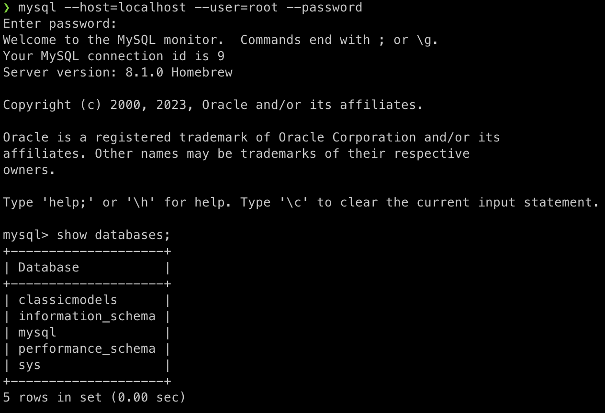
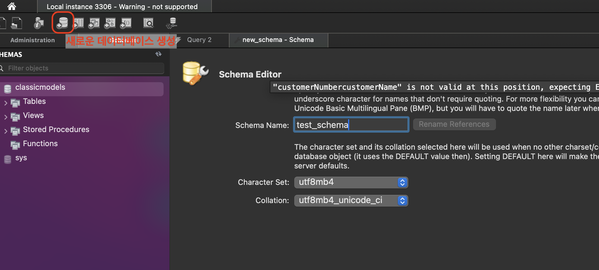

---

> * 현재 포스트의 MySQL 설치와 연결은 MacOS 로컬 환경 위에서 진행됨
> * 이후 모든 SQL 포스트 MySQL 환경 위에서 진행된다고 가정한다
{: .prompt-danger }

## 1. MySQL 설치와 연결

* [MacOS 설치](https://dev.mysql.com/doc/mysql-installation-excerpt/8.0/en/macos-installation.html)
* [MySQL 서버에 연결](https://dev.mysql.com/doc/refman/8.0/en/connecting.html)

MySQL을 설치하고 연결하는 과정은 위의 문서에 잘 나와있다.

<br>

---

### 1.1 CLI

> CLI를 이용한 MySQL. [여기서](https://dev.mysql.com/doc/refman/8.0/en/mysql-commands.html) 다양한 MySQL 명령어를 확인할 수 있다.
{: .prompt-info }

<br>

일단 설치를 완료했으면 MySQL서버를 시작해보자. (EC2 하나 파서하거나 도커 컨테이너로 실행해도 된다. 컨테이너를 사용한다면, 컨테이너 재시작이 종료하는 경우에도 데이터를 보존할 수 있도록 하자.)

```bash
brew services start mysql 
```

<br>

MySQL 중지.

```bash
brew services stop mysql
```

<br>

MySQL 서버에 연결하는 방법.

```bash
mysql --host=localhost --user=user_name --password=password mydb --port=3306
mysql -h localhost -u user_name -ppassword mydb
```

* ```--host``` : MySQL 서버의 ```hostname``` 또는 IP 주소
* ```--user``` : MySQL 유저네임 명시
* ```--password``` : 유저 패스워드
* ```mydb``` : 사용할 데이터베이스 이름 (없다면 비워놔도 된다)
* ```--port``` : 사용할 포트넘버 (명시하지 않으면 디폴트로 3306 사용)

<br>

> If you use a [`--password`](https://dev.mysql.com/doc/refman/8.0/en/connection-options.html#option_general_password) or `-p` option and specify a password value, there must be *no space* between [`--password=`](https://dev.mysql.com/doc/refman/8.0/en/connection-options.html#option_general_password) or `-p` and the password following it.
{: .prompt-warning }

<br>

위의 사용법을 이용해서 MySQL 서버에 연결해보자.

```bash
mysql --host=localhost --user=root --password
```

* ```localhost``` 사용
* ```root``` 유저로 접속

<br>



<p align='center'>MySQL CLI</p>

<br>

---

### 1.2 GUI

> * MySQL Workbench와 같은 GUI 툴의 사용. (DBeaver 같은 툴을 사용해도 무방하다.)
>
> * GUI 툴들은 데이터베이스 시각화를 포함한 각종 다양한 기능을 제공한다.
> * [MySQL Workbench 설치](https://dev.mysql.com/downloads/workbench/)
{: .prompt-info }

<br>

MySQL Workbench 설치 후 실행을 하면 다음과 같은 화면을 확인 할 수 있다.

<br>


<p align='center'>MySQL Workbench</p>

* 기존에 CLI로 만들었던 연결을 확인할 수 있다

<br>

Delete Connection으로 만들어뒀던 열결을 삭제하고 새로 만들어보자. MySQL Connection 옆의 ```+``` 버튼을 누르면 새로운 연결을 만들 수 있다.

<br>


* 기존의 CLI로 연결했을 때 설정했던 세부내용과 동일하다
* ```Connection Name```으로 해당 연결을 특정 지을 수 있는 이름을 부여할 수 있다

<br>



* ```Schema Name``` : 스키마(데이터베이스)의 이름
* 나머지 세부 사항은 요구 스펙에 맞춰서 설정하면 됨
  * ```Character Set``` : 텍스트 데이터를 어떻게 인코딩할 것인지 결정
  * ```Collation``` : 설정한 ```Character Set```에 의해 저장된 데이터들이 어떻게 정렬될 것인지 결정
* ```Character Set``` 이나 ```Collation```은 스키마 레벨 그리고 테이블 레벨에서도 설정할 수 있음

<br>

---

## 2. 도커로 MySQL 컨테이너 만들기

도커(Docker)를 이용해서 MySQL 컨테이너를 만들어보자.

도커를 설치 해야한다 : [https://hub.docker.com/](

<br>

`docker-compose.yml`

```yaml
services:
  mysql:
    image: mysql:8.0 # latest로 설정하면 최신 이미지를 사용
    container_name: mysql-container
    restart: always
    ports:
      - "3306:3306"
    environment:
      MYSQL_ROOT_PASSWORD: admin
      MYSQL_DATABASE: test_database
      MYSQL_USER: my_username
      MYSQL_PASSWORD: my_password
    volumes:
      - /Users/{사용자이름}/Desktop/mysql-volume:/var/lib/mysql # 본인의 사용자 이름 사용
```

* `docker-compose.yml`이 위치하는 루트 경로에서 `docker compose up -d` 명령어를 사용하면 MySQL 컨테이너를 띄울 수 있다
* `docker exec -it mysql-container /bin/bash` 명령어로 실행 중인 컨테이너에 접속 가능
* 이후 `mysql -u root -p`으로 유저 이름과 패스워드를 입력해서 MySQL 쉘로 접속할 수 있다
* 사용을 완료했으면 `docker compose down`으로 컨테이너 중지와 삭제를 할 수 있다
