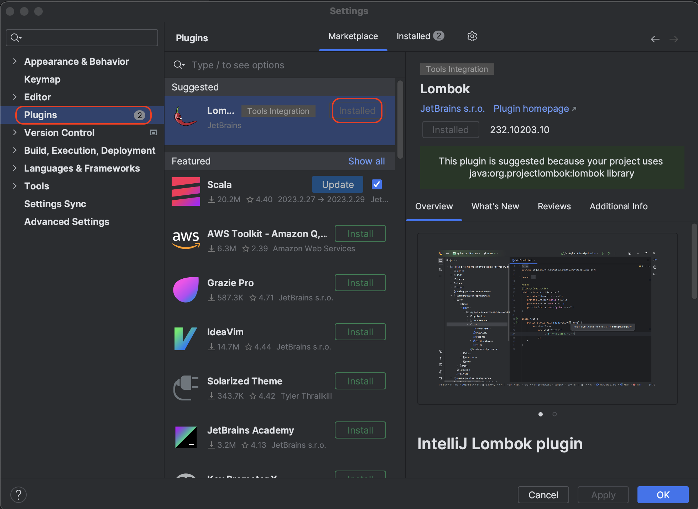
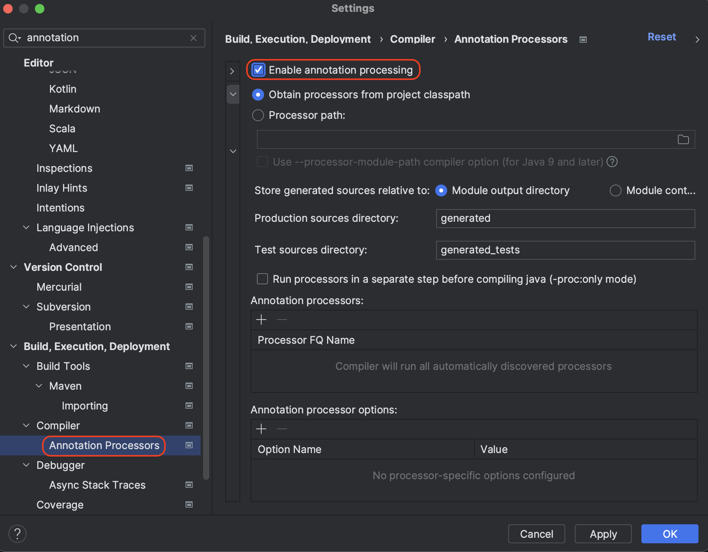

---

## 1. Logging

로깅에 대해서 알아보자.

<br>

`System.out.ln()`으로 콘솔에 출력하는것 보다, 별도의 로깅 라이브러리를 사용해서 로그를 출력하는 것이 더 좋다.

<br>

> 스프링 부트를 사용하면 로깅 라이브러리(`spring-boot-starter-logging`)가 함께 포함된다.
>
> `spring-boot-starter-logging`는 기본적으로 다음 로길 라이브러리를 사용한다.
>
> * [SLF4J](http://www.slf4j.org) : 다양한 로그 라이브러리들을 통합해서 인터페이스로 제공
> * [Logback](http://logback.qos.ch) : SLF4J를 구현한 구현체로 생각하면 편하다
> * 실무에서는 기본적으로 제공하는 Logback을 대부분 사용
{: .prompt-info }


<br>

`LogTestController`

```java
// @Slf4j
@RestController // 문자를 반환은 문자 그대로 반환(뷰 이름으로 반환 x)
public class LogTestController {
    // @Slf4j 사용시 생략 가능
    // LogTestController.class 대신에 getClass() 사용가능
    private final Logger log = LoggerFactory.getLogger(LogTestController.class);

    @GetMapping("/log-test")
    public String logTest() {
        String name = "Spring";

        // 운영 서버에 무조건 남기 때문에 좋지 않다
        System.out.println("name = "+name);

        // 1. 로그 레벨 별로 정해서 출력할 수 있다
        log.trace("trace log = {}", name); // {}는 name으로 치환됨
        log.debug("debug log = {}", name);

        log.info("info log = {}", name);
        log.warn("warn log = {}", name);
        log.error("error log = {}", name);

        return "OK";
    }
}
```

```
name = Spring
2024-03-14T23:18:46.748+09:00  INFO 47413 --- [springmvc2] [nio-8080-exec-1] de.springmvc2.basic.LogTestController    : info log = Spring
2024-03-14T23:18:46.749+09:00  WARN 47413 --- [springmvc2] [nio-8080-exec-1] de.springmvc2.basic.LogTestController    : warn log = Spring
2024-03-14T23:18:46.749+09:00 ERROR 47413 --- [springmvc2] [nio-8080-exec-1] de.springmvc2.basic.LogTestController    : error log = Spring
```

* `@RestController`
  * `@Controller` 는 반환 값이 `String` 이면 뷰 이름으로 인식된다. 그래서 뷰를 찾고 뷰가 랜더링 된다.
  * `@RestController` 는 반환 값으로 뷰를 찾는 것이 아니라, HTTP 메시지 바디에 바로 입력한다.
    * 실행 결과로 그냥 스트링을 받을 수 있다


* 로그 포맷 : `time` `log_level` `process_id` `thread_name` `class_name` `log_message`


* 콘솔에서 `trace`와 `debug` 로그를 확인할 수 없다 → 로그 레벨 설정을 변경하면 볼 수 있다
  * LEVEL: `TRACE > DEBUG > INFO > WARN > ERROR`
  * 개발 서버는 `debug` 출력
  * 운영 서버는` info` 출력


* `@Slf4j`(Lombok)를 사용하면 `private final Logger log = LoggerFactory.getLogger(LogTestController.class);`를 생략할 수 있다


* `log.debug("data="+data)` 방식으로 사용하면 안된다
  * 로그 출력 레벨을 info로 설정해도 해당 코드에 있는 "data="+data가 실제 실행이 되어 버린다. 결과적으로 문자 더하기 연산이 발생한다.

<br>

로그 레벨 설정은 `application.properties`에서 다음과 같이 설정 할 수 있다.

```properties
# 전체 로그 레벨 설정(기본 info), (info, warn, error만 출력)
logging.level.root=info
  
# de.springmvc2 패키지와 그 하위의 로그 레벨 설정
logging.level.de.springmvc2=debug
```

<br>

**로그 사용의 장점**

* 쓰레드 정보, 클래스 이름 같은 부가 정보를 함께 볼 수 있고, 출력 모양을 조정할 수 있다.
* 로그 레벨에 따라 개발 서버에서는 모든 로그를 출력하고, 운영서버에서는 출력하지 않는 등 로그를 상황에 맞게 조절할 수 있다.
* 시스템 아웃 콘솔에만 출력하는 것이 아니라, 파일이나 네트워크 등, 로그를 별도의 위치에 남길 수 있다. 특히 파일로 남길 때는 일별, 특정 용량에따라 로그를 분할하는 것도 가능하다.
* 성능도 일반 `System.out`보다 좋다. (내부 버퍼링, 멀티 쓰레드 등등) 그래서 실무에서는 꼭 로그를 사용해야 한다.

<br>

---

## 2. Lombok 사용법

Lombok은 자바 프로젝트의 보일러 플레이트(boilerplate) 코드를 줄여주는 라이브러리다. 

생성자, getter, setter, ```toString()``` 등의 보일러 플레이트 코드를 애노테이션을 이용해서 대체할 수 있다.

롬복 공식 문서 :  [https://projectlombok.org/setup/intellij](https://projectlombok.org/setup/intellij)

<br>

---

### 2.1 롬복 의존성 추가

* [https://start.spring.io/](https://start.spring.io/)에서 롬복 추가

<br>

수동으로 `gradle`에 추가하는 경우 아래 사용.

```groovy
dependencies {
  
  // 기존 라이브러리
  
  // 롬복 추가
	compileOnly 'org.projectlombok:lombok'
	annotationProcessor 'org.projectlombok:lombok'

	// 테스트에서 롬복 사용
	testCompileOnly 'org.projectlombok:lombok'
	testAnnotationProcessor 'org.projectlombok:lombok'

}
```


<br>

---

### 2.2 플러그인 설치

<br>



* 인텔이제이 ```settings```의 ```Plugins```에서 ```Lombok```을 인스톨한다

<br>



* ```settings```의 `Annotation Processors`에서 `Enable annotation processing`을 체크하고 적용해야 한다

<br>

---

## Reference

1. [스프링 MVC - 백엔드 웹 개발 핵심 기술](https://www.inflearn.com/course/%EC%8A%A4%ED%94%84%EB%A7%81-mvc-1)
2. [Udemy - Spring Boot 3, Spring 6 & Hibernate](https://www.udemy.com/course/spring-hibernate-tutorial/?couponCode=ST8MT40924)

