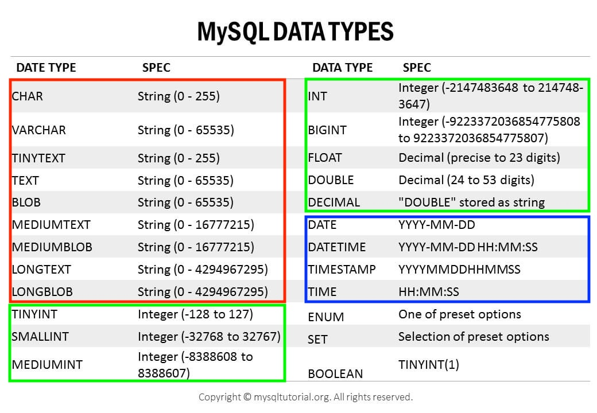

---

> SQL문을 이용한 기본적인 데이터 처리에 대한 실습.
>
> MySQL에서 스키마(`Schema`)와 데이터베이스(`Database`)는 상호교환적으로 사용 가능하지만 Oracle Database에서 스키마는 데이터베이스의 논리적인 구조를 나타내는 용어이다.
> {: .prompt-info }

<br>

## 1. 데이터베이스 생성

데이터베이스(스키마)를 생성해보자. 

```sql
CREATE SCHEMA test_company; -- test_company 라는 이름의 스키마 생성
-- CREATE DATABASE test_company;
```

<br>

생성한 데이터베이스를 사용하기 위해서 일단 현재 사용하고 있는 데이터베이스를 확인해보자.

```sql
mysql> SELECT database();
```

```
+----------+
| schema() |
+----------+
| NULL     |
+----------+
1 row in set (0.00 sec)
```

<br>

사용할 데이터베이스를 정하지 않았기 때문에 ```NULL```을 확인할 수 있다.

이제 생성했던 ```test_company```를 사용하고, 사용중인 데이터베이스를 확인하자.

```sql
mysql> USE test_company;
```

```
Database changed
```

```sql
mysql> SELECT database();
```

```
+--------------+
| schema()     |
+--------------+
| test_company |
+--------------+
1 row in set (0.00 sec)
```

<br>

데이터베이스를 삭제하고 싶은 경우.

```sql
DROP DATABASE test_company;
```

<br>

---

## 2. 속성 데이터형(Attribute Data Types)

MySQL에서 속성(Attribute)들이 가질 수 있는 자료형(Data Type)에 대해 알아보자.

* [MySQL Document - Data Types](https://dev.mysql.com/doc/refman/8.0/en/data-types.html)

<br>



<p align='center'>https://www.mysqltutorial.org/mysql-basics/mysql-data-types</p>

<br>

MySQL에서는 대략적으로 다음과 같이 데이터를 분류할 수 있다. 

1. 숫자형 (Numeric Data Types)
   * 정수
     * 위의 표에서 ```TINYINT```~ ```BIGINT```
   * 부동 소수점 방식 (Floating Point)
     * 실수 저장에 사용
     * 고정 소수점에 비해 덜 정확하다
     * ```FLOAT```, ```DOUBLE``` 또는 ```DOUBLE PRECISION```
   * 고정 소수점 방식 (Fixed Point)
     * 실수를 정확하게 저장할 때 사용
     * ```DECIMAL``` 또는 ```NUMERIC```
     * 예) ```DECIMAL(8,2)``` => ```[-999999.99 ~ 999999.99]```
     * 총 8개의 digit, 2개는 소수점(decimal)을 위해 예약
2. 문자형 (String Data Types)
   * 고정 크기 문자열
     * ```CHAR(n)``` 
     * 저장될 문자열의 길이가 최대 길이보다 작으면 나머지를 space로 채워서 저장
   * 가변 크키 문자열
     * ```VARCHAR(n)```
     * 저장될 문자열의 길이 만큼만 저장
   * 사이즈가 큰 문자열
     * ```TINYTEXT``` ~ ```LONGTEXT```
   * ```BLOB```의 경우 아무런 인코딩 없이 raw binary data(byte-string)를 저장하고 싶으면 사용
3. 날짜와 시간 (Date & Time Data Types)
   * ```DATE``` ~ ```TIME```
   * ```TIMESTAMP```의 경우 time-zone이 반영됨

<br>

> Data Type의 경우 DBMS간에 사용하는 명칭이 다를 수 있다. 가령 MySQL의 경우 ```DECIMAL```과 ```NUMERIC```을 동일하게 사용한다.

<br>

---

## 3. 테이블 생성, 제약(Constraint) 적용

이제 테이블에 대한 스키마를 대략적으로 정하고 테이블을 생성해보자.

<br>


<p align='center'>사용할 테이블</p>

<br>

먼저 ```DEPARTMENT``` 테이블을 생성하고 해당 제약(constraint)들을 살펴보자.

```sql
CREATE TABLE DEPARTMENT (
	id INT, 
	name VARCHAR(20) NOT NULL UNIQUE, -- NOT NULL과 UNIQUE 제약 적용
  leader_id INT, 
  PRIMARY KEY (id) -- id를 PK로 지정
);
```

* ```UNIQUE``` : ```UNIQUE```로 지정된 속성(attribute)은 중복된 값을 가질 수 없음 (```NULL``` 중복을 허용하는 경우는 있음, RDBMS 마다 다름)
* ```NOT NULL``` : ```NOT NULL```로 지정된 attribute는 ```NULL```을 값으로 가질 수 없다

<br>

다음으로 ```EMPLOYEE``` 테이블을 생성하자.

```sql
CREATE TABLE EMPLOYEE (
	id INT,
	name VARCHAR(30) NOT NULL,
	birth_date DATE,
	sex CHAR(1) CHECK(sex IN ('M', 'F')), -- 성별은 무조건 M 또는 F
	POSITION VARCHAR(10),
	salary INT DEFAULT 50000000, 
	dept_id INT,
	PRIMARY KEY (id),
  -- dept_id는 DEPARTMENT의 id를 참조
  -- DEPARTMENT의 id(참조값)을 삭제하는 경우 참조하던 FK 값을 NULL로 변경
  -- 참조값을 변경하는 경우 똑같이 업데이트한 값으로 변경
	FOREIGN KEY (dept_id) REFERENCES DEPARTMENT(id) ON DELETE SET NULL ON UPDATE CASCADE,
	CHECK (salary >= 50000000) -- 최소 연봉을 5000만으로 
);
```

* ```DEFAULT``` : attribute의 디폴트(기본) 값을 정의할 때 사용
  * 새로운 튜플(tuple, row)를 저장할 때 해당 attribute에 대한 값이 없으면 디폴트 값으로 저장
* ```CHECK``` 제약은 attribute의 값을 제한하고 싶을 때 사용
* ```FOREIGN KEY``` (Referential Integrity Constraint) : attribute가 다른 테이블의 PK 또는 유니크키(unique key)를 참조할 때 사용 
  * 참조하고 있던 값이 삭제(delete)또는 업데이트(update) 될때 FK를 어떻게 처리할 것인지 지정할 수 있는 옵션들이 있다
  * ```CASCADE``` : 참조값의 삭제/변경을 그대로 반영
  * ```SET NULL``` : 참조값이 삭제/변경 시 ```NULL```로 변경
  * ```RESTRICT``` : 참조값이 삭제/변경되는 것을 금지
  * ```NO ACTION```: MySQL에서는 ```RESTRICT```와 동일
    * 표준 SQL 스펙에서는 비슷
  * ```SET DEFAULT``` : 참조값이 삭제/변경 시 설정한 디폴트 값으로 변경
    * MySQL에서는 지원하지 않음

<br>

Constraint에는 이름을 명시할 수 있음. 제약에 이름을 붙이면 어떤 제약을 위반했는지 쉽게 파악이 가능함. 예를 들어 다음과 같이 제약에 이름을 붙여보자.

```sql
CREATE TABLE TEST (
	age INT CONSTRAINT age_over_19 CHECK (age > 19)
);
```

* ```age```가 19를 넘었는지 확인하는 ```CHECK```제약에 ```age_over_19```이라는 이름을 붙임
* 제약을 위반하는 경우 ```CHECK constraint 'age_over_19' is violated```
* 제약 이름을 생략해서 사용하는 경우  ```CHECK constraint 'test_chk_1' is violated``` 처럼 이름이 직관적이지 않아서 위반한 제약을 파악하기가 상대적으로 어렵다

<br>

> 참고로 ```SHOW CREATE TABLE table_name;```을 통해서 ```table_name```이라는 테이블의 여러가지 정보를 확인할 수 있다.
{: .prompt-tip }

<br>

이제 ```PROJECT``` 테이블을 생성해보자.

```sql
CREATE TABLE PROJECT (
	id INT,
	name VARCHAR(20) NOT NULL UNIQUE,
	leader_id INT,
	start_date DATE,
	end_date DATE,
	PRIMARY KEY (id),
  -- leader_id는 EMPLOYEE의 id 참조
	FOREIGN KEY (leader_id) REFERENCES EMPLOYEE(id) ON DELETE SET NULL ON UPDATE CASCADE,
	CHECK (start_date < end_date) -- 시작 날짜는 끝 날짜보다 항상 먼저
);
```

<br>

```WORKS_ON``` 테이블을 생성해보자.

```sql
CREATE TABLE WORKS_ON (
	empl_id INT,
	proj_id INT,
	PRIMARY KEY (empl_id, proj_id),
	FOREIGN KEY (empl_id) REFERENCES EMPLOYEE(id) ON DELETE CASCADE ON UPDATE CASCADE,
	FOREIGN KEY (proj_id) REFERENCES PROJECT(id) ON DELETE CASCADE ON UPDATE CASCADE
);
```

```
+------------------------+
| Tables_in_test_company |
+------------------------+
| DEPARTMENT             |
| EMPLOYEE               |
| PROJECT                |
| WORKS_ON               |
+------------------------+
4 rows in set (0.00 sec)
```

<br>

테이블 생성당시 ```DEPARTMENT```→```EMPLOYEE``` →```PROJECT``` →```WORKS_ON``` 순서로 생성하였다. 이떄 ```DEPARTMENT```의 ```leader_id```에 FK를 설정하지 못했기 때문에 FK를 사용하도록 ```DEPARTMENT``` 테이블의 스키마를 변경해야한다.

```sql
ALTER TABLE DEPARTMENT ADD FOREIGN KEY (leader_id) -- leader_id에 대해서 FK 추가
REFERENCES EMPLOYEE(id) -- EMPLOYEE의 id 참조
ON UPDATE CASCADE -- 참조값이 업데이트 되면 똑같이 업데이트
ON DELETE SET NULL; -- 참조값이 삭제되면 NULL로 변경
```

* ```ALTER TABLE```에는 ```ADD FOREIGN KEY``` 외에도 다양한 유형의 스키마 변경이 가능하다.
* [MySQL Document 확인](https://dev.mysql.com/doc/refman/8.0/en/alter-table.html#alter-table-options)

<br>

참고로,

* 프로덕션(Production)이나 다른 서비스 또는 파이프라인에서 사용중인 테이블의 스키마(Schema)를 변경하는 것이 어떤 영향을 미치는지 충분히 검토한 후에 진행되어야 함.

* 테이블 삭제는 ```DROP TABLE table_name;```

<br>

---

## 4. 테이블에 데이터 추가 / 수정 / 삭제

생성했던 테이블에 데이터를 추가 / 수정 / 삭제하는 과정을 살펴보자.

<br>

### 4.1 추가(INSERT)

```EMPLOYEE``` 테이블에 데이터를 추가해보자. 

```sql
/* 
 * 현재 DEPARTMENT 테이블에 아무 데이터도 없기 때문에 일단 FK에 해당하는 dept_id는 null값으로 설
 */
INSERT INTO EMPLOYEE 
	VALUES (1, 'MESSI', '1987-02-01', 'M', 'DEV_BACK', 100000000, null);

/*
 * 유니크한 값이 중복되지 않도록 주의
 * CHECK 제약에 의해 연봉은 5000만원 이상으로 입력해야
 * SHOW CREATE TABLE EMPLOYEE; 를 통해서 EMPLOYEE 테이블의 정보 확인 가능 
 */
INSERT INTO EMPLOYEE 
	VALUES (2, 'JANE', '1996-05-05', 'F', 'DSGN', 90000000, null);
```

<br>

이번에는 다른 방식으로 데이터를 추가해보자.

```sql
-- 입력하고 싶은 attribute와 그 순서를 정할 수 있다
INSERT INTO EMPLOYEE (name, birth_date, sex, POSITION, id) -- dept_id와 salary 없이 입력
	VALUES ('JENNY', '2000-10-12', 'F', 'DEV_BACK', 3); -- 위에서 정한 attribute 순서와 동일하게 입력
```

<br>

한번에 여러개의 데이터를 추가하고 싶으면 다음과 같이 입력할 수 있다.

```sql
INSERT INTO EMPLOYEE VALUES
	(4, 'BROWN', '1996-03-13', 'M', 'CEO', 120000000, null),
	(5, 'DINGYO', '1990-11-05', 'M', 'CTO', 120000000, null),
	(6, 'JULIA', '1986-12-11', 'F', 'CFO', 120000000, null),
	(7, 'MBAPPE', '1993-06-17', 'F', 'DSGN', 80000000, null),
	(8, 'HEUNGMIN', '1999-10-22', 'M', 'DEV_FRONT', 65000000, null),
	(9, 'HENRY', '1982-05-20', 'M', 'HR', 82000000, null),
	(10, 'NICOLE', '1991-03-26', 'F', 'DEV_FRONT', 90000000, null),
	(11, 'SUZANNE', '1993-03-23', 'F', 'PO', 75000000, null),
	(12, 'CURRY', '1998-01-15', 'M', 'PLN', 85000000, null),
	(13, 'JISUNG', '1989-07-07', 'M', 'PO', 90000000, null),
	(14, 'SAM', '1992-08-04', 'M', 'DEV_INFRA', 70000000, null);
	(15, 'NEIMAR', '1987-01-03', 'M', 'HR', 70000000, null);
```

<br>

지금까지 입력했던 데이터를 조회해보자.

```sql
SELECT * FROM EMPLOYEE;
```

```
+----+----------+------------+------+-----------+-----------+---------+
| id | name     | birth_date | sex  | POSITION  | salary    | dept_id |
+----+----------+------------+------+-----------+-----------+---------+
|  1 | MESSI    | 1987-02-01 | M    | DEV_BACK  | 100000000 |    NULL |
|  2 | JANE     | 1996-05-05 | F    | DSGN      |  90000000 |    NULL |
|  3 | JENNY    | 2000-10-12 | F    | DEV_BACK  |  50000000 |    NULL |
|  4 | BROWN    | 1996-03-13 | M    | CEO       | 120000000 |    NULL |
... 공간 때문에 생략
| 13 | JISUNG   | 1989-07-07 | M    | PO        |  90000000 |    NULL |
| 14 | SAM      | 1992-08-04 | M    | DEV_INFRA |  70000000 |    NULL |
+----+----------+------------+------+-----------+-----------+---------+
14 rows in set (0.03 sec)
```

<br>

이제 나머지 테이블들의 데이터도 추가해보자.

```sql
-- DEPARTMENT 테이블
INSERT INTO DEPARTMENT VALUES
	(1001, 'headquarter', 4),
	(1002, 'HR', 15),
	(1003, 'development', 14),
	(1004, 'design', 2),
	(1005, 'product', 13);
	
-- PROJECT 테이블
INSERT INTO PROJECT VALUES
	(2001, '쿠폰 서비스 개발', 13, '2022-03-10', '2022-07-09'),
	(2002, '백엔드 리펙토링', 13, '2022-01-23', '2022-03-23'),
	(2003, '홈페이지 UI 개선', 11, '2022-05-09', '2022-06-11');
	
-- WORKS_ON 테이블
INSERT INTO WORKS_ON VALUES
	(5,2001),(13, 2001),(1, 2001),
	(2, 2001),(4, 2001),(10, 2001),
  (1, 2002),(2, 2002),(6, 2002),
	(11, 2002),(3, 2003),(7, 2003),
	(8, 2003),(9, 2003),(10, 2003),
	(12, 2003);
```

<br>

---

### 4.2 수정(UPDATE)

테이블의 데이터를 수정해보자. 먼저 ```EMPLOYEE``` 테이블의 ```dept_id```의 ```null```값을 업데이트 해보자.

```EMPLOYEE(id)```가 1인 ```MESSI```는 development 부서 소속 → ```DEPARTMENT(id)```는 1003 

```sql
/*
 * SET를 통해서 어떤 attribute를 어떤 값으로 설정할 것인지 지정
 * WHERE를 통해서 무엇을 업데이트 할 것인지 조건(condition) 명시
 * MESSI를 업데이트 하기 위해서 id = 1로  
 */
UPDATE EMPLOYEE SET dept_id = 1003 WHERE id = 1;
```

<br>

성공적으로 변경되었는지 확인해보자.

```sql
SELECT * FROM EMPLOYEE WHERE id = 1;
```

```
+----+-------+------------+------+----------+-----------+---------+
| id | name  | birth_date | sex  | POSITION | salary    | dept_id |
+----+-------+------------+------+----------+-----------+---------+
|  1 | MESSI | 1987-02-01 | M    | DEV_BACK | 100000000 |    1003 |
+----+-------+------------+------+----------+-----------+---------+
1 row in set (0.02 sec)
```

<br>

이번에는 개발(development)팀의 ```salary```를 두 배로 인상하는 경우를 살펴보겠다.

```sql
UPDATE EMPLOYEE
SET salary = salary * 2
WHERE dept_id = 1003;
```

<br>

```salary``` 인상 전

```
+----+----------+------------+------+-----------+-----------+---------+
| id | name     | birth_date | sex  | POSITION  | salary    | dept_id |
+----+----------+------------+------+-----------+-----------+---------+
|  1 | MESSI    | 1987-02-01 | M    | DEV_BACK  | 100000000 |    1003 |
|  3 | JENNY    | 2000-10-12 | F    | DEV_BACK  |  50000000 |    1003 |
|  8 | HEUNGMIN | 1999-10-22 | M    | DEV_FRONT |  65000000 |    1003 |
| 10 | NICOLE   | 1991-03-26 | F    | DEV_FRONT |  90000000 |    1003 |
| 14 | SAM      | 1992-08-04 | M    | DEV_INFRA |  70000000 |    1003 |
+----+----------+------------+------+-----------+-----------+---------+
```

<br>

```salary``` 인상 후

```
+----+----------+------------+------+-----------+-----------+---------+
| id | name     | birth_date | sex  | POSITION  | salary    | dept_id |
+----+----------+------------+------+-----------+-----------+---------+
|  1 | MESSI    | 1987-02-01 | M    | DEV_BACK  | 200000000 |    1003 |
|  3 | JENNY    | 2000-10-12 | F    | DEV_BACK  | 100000000 |    1003 |
|  8 | HEUNGMIN | 1999-10-22 | M    | DEV_FRONT | 130000000 |    1003 |
| 10 | NICOLE   | 1991-03-26 | F    | DEV_FRONT | 180000000 |    1003 |
| 14 | SAM      | 1992-08-04 | M    | DEV_INFRA | 140000000 |    1003 |
+----+----------+------------+------+-----------+-----------+---------+
```

<br>

이번에는 프로젝트 ID 2002에 참여한 임직원 의 연봉(```salary```)을 두 배로 인상하는 경우를 보자.

```sql
UPDATE EMPLOYEE, WORKS_ON -- 연관된 두 테이블 
SET salary = salary * 2
WHERE empl_id AND proj_id = 2002; -- empl_id가 두 테이블의 연결고리 역할
-- 더 직관적으로 표현하고 싶으면 아래와 같이 사용 가능
WHERE EMPLOYEE.id = WORKS_ON.empl_id and proj_id = 2002;
```

<br>

---

### 4.3 삭제(DELETE)

테이블의 데이터를 삭제해보자. ```NICOLE```이라는 이름의 사원이 퇴사하는 상황이다. 이 경우 ```EMPLOYEE``` 테이블에서 ```NICOLE```을 삭제해야한다. 또한 ```NICOLE```은 프로젝트 2001과 2003에 참여하고 있다.

```sql
DELETE FROM EMPLOYEE WHERE id = 10; -- NICOLE의 id는 10
```

* ```NICOLE```을 삭제하는 과정에서 ```WORKS_ON``` 테이블의 데이터도 삭제해줄 필요가 없다. FK를 설정하면서 CASCADE 옵션을 줬기 때문에, ```EMPLOYEE``` 테이블에서 ```NICOLE```이 삭제되는 과정에서 ```WORKS_ON``` 테이블에서 ```NICOLE```에 대한 정보도 삭제되었기 때문이다.

<br>

이번에는 프로젝트 2001과 2002에 참여하고 있는 ```JANE```이 2002 프로젝트에서 빠지도록 삭제하는 작업을 해볼것이다. 

```sql
/*
 * proj_id <> 2001는 2001 프로젝트를 제외한 모든 프로젝트 삭제
 * <> 대신 != 사용 가능
 */
DELETE FROM WORKS_ON WHERE empl_id = 2 AND proj_id <> 2001;
```

* ```WHERE```절 없이 삭제하는 경우 모든 데이터 삭제 (조심하자!)
* ```<>```는 ```!=``` 으로 대체 가능하다 (```<>```는 not equal to 로 생각하면 편하다)

<br>

---

## 5. 데이터 조회 (SELECT)

이번에는 테이블에 존재하는 데이터를 조회하는 방법에 대해서 알아보자. ```EMPLOYEE(id)```가 7인 임직원의 ```name```과 ```position```을 조회해보자.

```sql
SELECT name, position FROM EMPLOYEE WHERE id = 7;
```

```
+--------+----------+
| name   | position |
+--------+----------+
| MBAPPE | DSGN     |
+--------+----------+
```

* 조회에는 ```SELECT```라는 키워드 사용
* ```WHERE```로 명시한 조건을 selection condition라고 함 (```id = 7```)
* 관심있어하는 attribute들을 project attribute라고 함 (```name, position```)

<br>

이번에는 프로젝트 2002의 리더를 맡고 있는 임직원의 ```id```, ```name```, ```position```을 조회해보자.

```sql
SELECT e.id, e.name, e.position -- PROJECT 테이블의 id와 name과 구별하기 위해서 EMPLOYEE를 통해서 접근 
FROM PROJECT p, EMPLOYEE e -- alias 설정
WHERE p.id = 2002 AND p.leader_id = e.id;
```

```
+----+--------+----------+
| id | name   | position |
+----+--------+----------+
| 13 | JISUNG | PO       |
+----+--------+----------+
```

* attribute의 이름이 테이블 마다 동일하면 충돌나지 않게 구분해야한다 (ambiguous하면 안됨)
* ```FROM PROJECT p, EMPLOYEE e``` 처럼 테이블에 alias를 설정해서 사용가능하다
  * ```FROM PROJECT AS p, EMPLOYEE AS e``` 처럼 ```AS``` 키워드를 붙여도 되고, 생략해도 된다
* ```AS```로 별칭(alias)을 붙이는 것은 테이블, 속성(attribute) 전부 가능하다

위의 과정을 설명해보자면, 우리가 현재 관심가지고 있는 것은 일단 프로젝트 2002의 ```leader_id``` 이다. 이때 ```PROJECT``` 테이블에는 임직원의 세부 데이터가 존재하지 않기 때문에, ```leader_id```를 FK로 해서 ```EMPLOYEE``` 테이블의 ```id```를 참조 해야한다. 이를 통해서 프로젝트 2002의 ```leader_id```인 13을 통해서 ```EMPLOYEE``` 13번인 ```JISUNG```의 ```name```과 ```position```을 조회할 수 있다.

<br>

이번에는 디자이너(```DSGN```)들이 참여하고 있는 프로젝트 id와 ```name```을 조회해보자.

```sql
SELECT p.id, p.name
FROM PROJECT p, EMPLOYEE e, WORKS_ON w
WHERE e.position = 'DSGN' AND e.id = w.empl_id  AND w.proj_id = p.id;
```

```
+------+-------------------------+
| id   | name                    |
+------+-------------------------+
| 2001 | 쿠폰 서비스 개발           |
| 2003 | 홈페이지 UI 개선           |
| 2003 | 홈페이지 UI 개선           |
+------+-------------------------+
```

* 조회하려는 것 : ```DSGN```이 참여하는 프로젝트의 ```proj_id```와 ```name```
* ```EMPLOYEE``` 테이블 → ```WORKS_ON``` 테이블 → ```PROJECT``` 테이블 
* 여기서 ```WORKS_ON``` 테이블이 중간의 연결고리 역할을 한다

<br>

위에서 프로젝트 ```name```들을 조회하면 중복되는 경우 중복되어서 표시된다는 것을 알 수 있다. 중복되어 조회되는 것을 방지하기 위해서 ```DISTINCT``` 키워드를 사용해볼 수 있다. 

```sql
SELECT DISTINCT p.id, p.name -- 기존의 조회에 DISTINCT 키워드를 붙이면 된다
FROM PROJECT p, EMPLOYEE e, WORKS_ON w
WHERE e.position = 'DSGN' AND e.id = w.empl_id  AND w.proj_id = p.id;
```

```
+------+-------------------------+
| id   | name                    |
+------+-------------------------+
| 2001 | 쿠폰 서비스 개발           |
| 2003 | 홈페이지 UI 개선           |
+------+-------------------------+
```

중복되어서 조회되는 튜플이 제외된 것을 볼 수 있다.

<br>

이번에는 이름이 `N`으로 시작하거나 `N`으로 끝나는 임직원들의 ```name```을 조회 해보자.

```sql
SELECT name
FROM EMPLOYEE
WHERE name LIKE 'N%' OR name LIKE '%N'; -- N으로 시작하거나 N으로 끝나는 name
```

```
+----------+
| name     |
+----------+
| BROWN    |
| HEUNGMIN |
| NEIMAR   |
+----------+
```

* ```%``` : 스트링 패턴에서 와일드카드(wildcard)로 쓰임

<br>

이번에는 ```LIKE``` 키워드를 사용해서 이름에 `NG`가 들어가는 임직원들의 ```name```을 조회 해보자.

```sql
SELECT name
FROM EMPLOYEE
WHERE name LIKE '%NG%';
```

```
+----------+
| name     |
+----------+
| DINGYO   |
| HEUNGMIN |
| JISUNG   |
+----------+
```

<br>

이번에는 `J`로 시작하면서, 총 4 글자의 이름을 가지는 임직원들의 ```name```을 조회 해보자.

```sql
SELECT name
FROM EMPLOYEE
WHERE name LIKE 'J___'; -- J로 시작하고 뒤에 3글자가 오는 name
```

```
+------+
| name |
+------+
| JANE |
+------+
```

* ```_```(underscore) : 언더스코어는 한 글자 의미 

<br>

다음은 ```%```나 ```_``` 를 특별한 의미로 사용하는 것이 아니라 문자 그대로 조회하고 싶은 경우이다. ```%```로 시작하거나 ```_```로 끝나는 프로젝트를 검색하는 방법은 다음과 같다. 

```sql
SELECT name FROM PROJECT WHERE name LIKE '\%%' or name LIKE '%\_'
```

* 문자 그대로 사용하고 싶은 특수문자 앞에 ```\```(backslash)를 붙여서 사용하면 됨.

>  지금까지 살펴본 것 처럼 ```LIKE``` 키워드는 스트링(String)의 패턴 매칭(Pattern Matching)에 사용

<br>

이번에는 ```EMPLOYEE(id)```가 1인 임직원의 모든 attribute를 조회 해보자.

```sql
SELECT * FROM EMPLOYEE WHERE id = 1; -- 원래 attribute의 자리에 * 사용
```

```
+----+-------+------------+------+----------+-----------+---------+
| id | name  | birth_date | sex  | POSITION | salary    | dept_id |
+----+-------+------------+------+----------+-----------+---------+
|  1 | MESSI | 1987-02-01 | M    | DEV_BACK | 400000000 |    1003 |
+----+-------+------------+------+----------+-----------+---------+
```

* 원래 알고 싶었던 attribute의 자리에 ```*```(asterisk)를 사용해서 모든 attribute를 조회 가능
* 두 개의 테이블에 대해 ```*```를 사용하게 되면 두 개의 테이블의 모든 attribute를 조회하기 때문에 조심

<br>

> * ```SELECT```로 조회할 때 조건을 포함해서 조회하는 경우, 이 조건들과 관련된 속성들에 인덱스(index)가 걸려있어야 한다. 그렇지 않은 경우 데이터가 많으면 많아질수록 조회 속도가 느려진다.
> * ```WHERE```절 없이 ```SELECT```를 사용하게 되면 테이블에 있는 모든 튜플들을 반환한다. 
{: .prompt-tip }

<br>

---

## Reference

1. [인프런 - 쉬운코드 데이터베이스 개론](https://www.inflearn.com/course/%EB%B0%B1%EC%97%94%EB%93%9C-%EB%8D%B0%EC%9D%B4%ED%84%B0%EB%B2%A0%EC%9D%B4%EC%8A%A4-%EA%B0%9C%EB%A1%A0/dashboard)
2. [한빛 미디어 - 이것이 MySQL이다](https://www.youtube.com/watch?v=VnnTh83sjcc&list=PLVsNizTWUw7Hox7NMhenT-bulldCp9HP9&index=6)
3. [MySQL 8.0 Document](https://dev.mysql.com/doc/mysql-installation-excerpt/8.0/en/macos-installation.html)
4. [https://dev.mysql.com/doc/employee/en/employees-installation.html](https://dev.mysql.com/doc/employee/en/employees-installation.html)