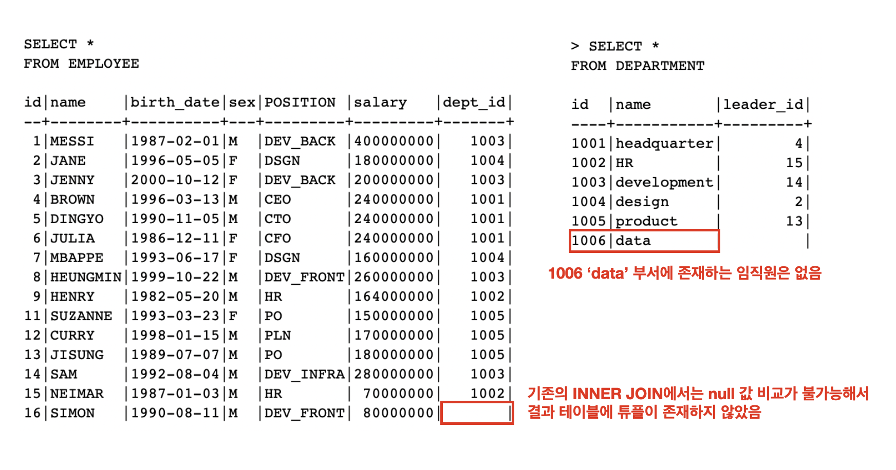
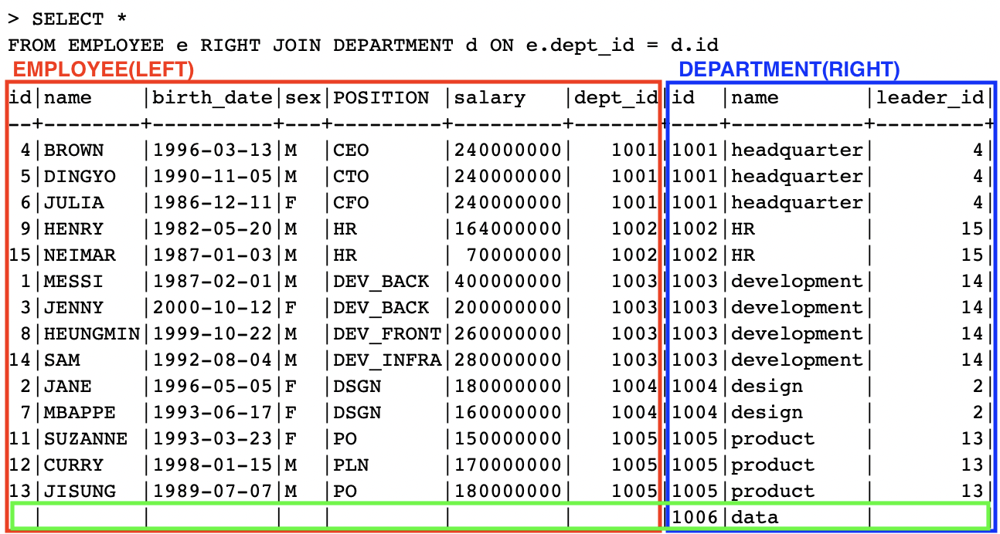
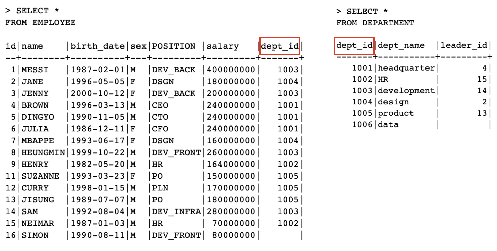
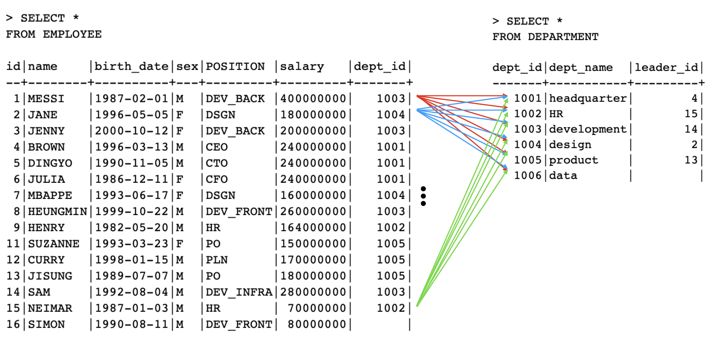
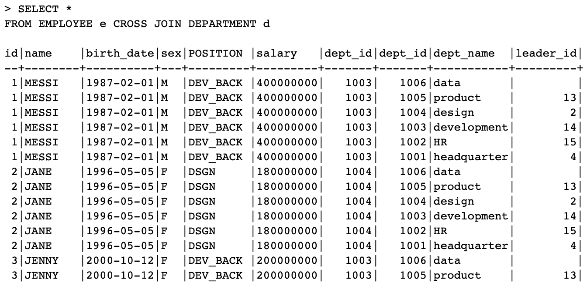

---

## 1. 서브 쿼리(Subquery)

서브쿼리를 통해서 조금 더 복잡한 쿼리를 작성해보자.

```EMPLOYEE(id)```가 14인 임직원 보다 ```birth_date```가 빠른 임직원의 ```id```, ```name```, ```birthdate```를 조회 해보자.

<br>

```sql
-- 1. 첫 번째 쿼리 
SELECT birth_date FROM EMPLOYEE WHERE id = 14; -- 결과는 1992-08-04가 나온다 

-- 2. 두 번째 쿼리
SELECT id, name, birth_date FROM EMPLOYEE
WHERE birth_date < '1992-08-04'; -- 첫 번째 쿼리에서 나온 결과를 직접 입력해서 사용하고 있음

-- 3. Subquery를 이용하는 경우
SELECT id, name, birth_date FROM EMPLOYEE
WHERE birth_date < (
	SELECT birth_date FROM EMPLOYEE WHERE id = 14 -- (subquery) 기존의 첫 번째 쿼리를 ()안에 기술한다
);
```

```
+----+--------+------------+
| id | name   | birth_date |
+----+--------+------------+
|  1 | MESSI  | 1987-02-01 |
|  5 | DINGYO | 1990-11-05 |
|  6 | JULIA  | 1986-12-11 |
|  9 | HENRY  | 1982-05-20 |
| 13 | JISUNG | 1989-07-07 |
| 15 | NEIMAR | 1987-01-03 |
+----+--------+------------+
```

* 여기서 서브쿼리는 inner query 또는 nested query라고도 불리며, ```()``` 안에 기술한다
* 외부 쿼리(메인 쿼리, outer query)는 서브 쿼리를 포함하고 있는 쿼리(서브쿼리를 감싸고 있는 쿼리로 생각하면 편한다)

<br>

이번에는 ```id```가 1인 임직원과 같은 부서(```dept_id```) 같은 성별(```sex```)인 임직원들의 ```id```, ```name```, ```position```을 조회 해보자.

```sql
SELECT id, name, position
FROM EMPLOYEE
WHERE (dept_id, sex) = (
	SELECT dept_id, sex 
	FROM EMPLOYEE
	WHERE id = 1
);
```

```
+----+----------+-----------+
| id | name     | position  |
+----+----------+-----------+
|  1 | MESSI    | DEV_BACK  |
|  8 | HEUNGMIN | DEV_FRONT |
| 14 | SAM      | DEV_INFRA |
+----+----------+-----------+
```

<br>

서브쿼리 사용시 주의점.

* 서브쿼리는 가능하면 최대한 단순하고 이해하기 쉽게 짜자
* `SELECT` 절이 아닌 `WHERE`나 `HAVING` 절에 사용하는 것이 성능면에서 좋다
* 가능하다면 서브쿼리 보다는 `JOIN`을 사용하자

<br>

---

### 1.1 IN, EXISTS

이번에는 ```id```가 2인 임직원과 같은 프로젝트에 참여한 임직원들의 ```id```를 조회 해보자. 

```sql
-- 1. id가 2인 임직원이 참여한 프로젝트를 조회해보자
SELECT proj_id FROM WORKS_ON WHERE empl_id = 2; -- 2001, 2003이 조회된다 

-- 2. 이제 2001, 2003 프로젝트에 참여한 임직원들의 id를 조회해보자 
SELECT DISTINCT empl_id FROM WORKS_ON -- 중복을 제거하기 위해 DISTINCT 사용 
WHERE empl_id != 2 AND proj_id IN (2001, 2003);
/*
 * proj_id IN (2001, 2003)는 원래
 * (proj_id = 2001 OR proj_id = 2003)으로 구했다 
 */ 

-- 3. 위의 두 쿼리를 subquery로 구현 (합치면 됨)  
SELECT DISTINCT empl_id FROM WORKS_ON
WHERE empl_id != 2 AND proj_id IN ( -- outer query의 empl_id와 proj_id는 outer query의 WORKS_ON 참조
	SELECT proj_id FROM WORKS_ON WHERE empl_id = 2 -- subquery의 empl_id는 해당 쿼리안의 WORKS_ON 참조
);

-- 4. 3의 subquery안에 subquery를 이용
-- 구한 임직원들의 id를 통해 해당 임직원들의 id, name을 조회
SELECT id, name
FROM EMPLOYEE
WHERE id IN (
	SELECT DISTINCT empl_id FROM WORKS_ON
	WHERE empl_id != 2 AND proj_id IN (
		SELECT proj_id FROM WORKS_ON WHERE empl_id = 2
	)
);

-- 5. WHERE절 대신 FROM절에 사용하는 subquery (4와 결과는 똑같음)
SELECT id, name
FROM EMPLOYEE,
	(
		SELECT DISTINCT empl_id FROM WORKS_ON
		WHERE empl_id != 2 AND proj_id IN (
			SELECT proj_id FROM WORKS_ON WHERE empl_id = 2
		)
	) AS DISTINCT_E -- 위의 subquery의 결과를 가상의 테이블 DISTINCT_E로 설정 
	-- FROM EMPLOYEE, (subquery) AS DISTINCT_E 같은 형태로 생각하면 됨 
WHERE EMPLOYEE.id = DISTINCT_E.empl_id; 
```

```
+---------+
| empl_id |
+---------+
|       1 |
|       4 |
... 생략
|       9 |
|      12 |
+---------+
```

```
+----+----------+
| id | name     |
+----+----------+
|  1 | MESSI    |
|  4 | BROWN    |
... 생략
|  9 | HENRY    |
| 12 | CURRY    |
+----+----------+
```

* ```v IN (v1, v2, v3..)```:  ```v```가 ```(v1, v2, v3..)```와 하나라도 값이 같으면 ```TRUE``` 반환 
* ```v NOT IN (v1, v2, v3..)```:  ```v```가 ```(v1, v2, v3..)```와 모든 값이 다르면 ```TRUE``` 반환 
* unqualified attribute가 참조하는 테이블은 해당 attribute가 사용된 쿼리를 포함해서 그 쿼리에 바깥쪽으로 존재하는 모든 쿼리 중에 해당 attribute를 가지는 가장 가까운 테이블을 참조

<br>

이번에는 ```IN``` 대신 ```EXISTS``` 키워드를 사용해서 ```id```가 7 또는 12인 임직원이 참여한 프로젝트의 ```proj_id```, ```name```을 조회해보자.

```sql
-- 1. EXISTS를 사용하는 경우
SELECT p.id, p.name
FROM PROJECT p -- 우리가 관심 가지는 것은 PROJECT 테이블
WHERE EXISTS ( -- EXISTS : 하나라도 존재하면 TRUE 반환
	SELECT * 
	FROM WORKS_ON w
	WHERE w.proj_id = p.id AND w.empl_id IN (7, 12) -- 프로젝트가 WORKS_ON 테이블에 존재하고 참여한 임직원 id가 7 또는 12인 튜플이 존재하면(EXISTS) 해당 프로젝트 선택
);

-- 2. IN을 사용하는 경우 
SELECT p.id, p.name
FROM PROJECT p 
WHERE id IN ( 
	SELECT w.proj_id
	FROM WORKS_ON w
	WHERE w.empl_id IN (7, 12)
);
```

* ```EXISTS``` : subquery의 결과가 최소 하나의 튜플이라도 가지고 있다면 ```TRUE```반환
* ```NOT EXISTS``` : subquery의 결과가 단 하나의 튜플이라도 없다면 ```TRUE```반환
* subquery가 바깥쪽 쿼리의 attribute를 참조하면 correlated subquery라고 부른다
  * 위의 예시의 경우 ```p.id```가 outer query의 ```Project```를 참조하고 있기 때문에 해당 subquery는 correlated subquery

<br>

이번에는 ```NOT EXISTS```를 활용해보자. 2000년대생이 없는 부서의 ```DEPARTMENT(id)```와 ```name```을 조회하자.

```sql
SELECT d.id, d.name
FROM DEPARTMENT d 
WHERE NOT EXISTS ( -- 2000년생이 하나라도 없는 경우 TRUE 반환되면서 해당 부서 선택 
	SELECT *
	FROM EMPLOYEE e 
	WHERE e.dept_id = d.id AND e.birth_date >= '2000-01-01'
);
```

```
+------+-------------+
| id   | name        |
+------+-------------+
| 1004 | design      |
| 1001 | headquarter |
| 1002 | HR          |
| 1005 | product     |
+------+-------------+
```

* 해당 쿼리도 ```NOT EXISTS``` 대신 ```NOT IN```을 사용해서 구현할 수 있다

<br>

---

### 1.2 ANY

이번에는 ```ANY```라는 키워드를 사용해서 리더보다 높은 연봉을 받는 부서원을 가진 ```leader_id```, ```name```, ```salary``` 그리고 부서명(```DEPARTMENT(name)```)을 조회하자.

```sql
-- 1. ANY를 사용해보자
SELECT e.id, e.name, e.salary, d.name -- 일단 EMPLOYEE 테이블에서 id, name, salary 등을 찾고 있음
FROM DEPARTMENT d, EMPLOYEE e 
WHERE d.leader_id = e.id AND e.salary < ANY ( 
	SELECT salary 
	FROM EMPLOYEE e2
	WHERE e2.id != d.leader_id AND e2.dept_id = e.dept_id -- 리더외의 부서원이 필요함, 속성이 참조하는 테이블을 잘 파악하자
);

-- 2. 리더보다 높은 연봉을 받는 부서원의 해당 부서에서 최고 연봉을 추가로 조회
SELECT e.id, e.name, e.salary, d.name, 
	(
		SELECT MAX(salary)
		FROM EMPLOYEE
		WHERE dept_id = e.dept_id
	) AS dept_max_salary -- 기존 1에서 해당 subquery만 추가, 해당 부서의 최고 연봉을 dept_max_salary로 별칭
FROM DEPARTMENT d, EMPLOYEE e 
WHERE d.leader_id = e.id AND e.salary < ANY ( 
	SELECT salary 
	FROM EMPLOYEE e2
	WHERE e2.id != d.leader_id AND e2.dept_id = e.dept_id 
);	
```

```
+----+--------+-----------+-------------+
| id | name   | salary    | name        |
+----+--------+-----------+-------------+
| 15 | NEIMAR |  70000000 | HR          |
| 14 | SAM    | 280000000 | development |
+----+--------+-----------+-------------+
```

```
+------+--------+-----------+-------------+-----------------+
| id   | name   | salary    | name        | dept_max_salary |
+------+--------+-----------+-------------+-----------------+
|   15 | NEIMAR |  70000000 | HR          |       164000000 |
|   14 | SAM    | 280000000 | development |       400000000 |
+------+--------+-----------+-------------+-----------------+
```

* ```v {비교연산자} ANY (subquery)``` : subquery가 반환한 결과들 중에 단 하나라도 ```v```와의 비교연산이 ```TRUE```라면 ```TRUE``` 반환
* ```ANY``` 대신 ```SOME``` 사용 가능

<br>

---

### 1.3 ALL

이번에는 ```ALL```이라는 키워드를 사용해서 ```id```가 2인 임직원과 한번도 같은 프로젝트에 참여하지 못한 임직원들의 ```id```, ```name```, ```position```을 조회하자.

```sql
SELECT DISTINCT e.id, e.name, e.position
FROM EMPLOYEE e, WORKS_ON w
WHERE e.id = w.empl_id AND w.proj_id != ALL ( -- w.proj.id 가 그 어떤과도 같지 않다면 조건이 TRUE가 됨
	SELECT proj_id 
	FROM WORKS_ON
	WHERE empl_id = 2
);
```

```
+----+---------+----------+
| id | name    | position |
+----+---------+----------+
|  1 | MESSI   | DEV_BACK |
|  6 | JULIA   | CFO      |
| 11 | SUZANNE | PO       |
+----+---------+----------+
```

* ```v {비교 연산자} ALL (subquery)``` : subquery가 반환한 결과들과 ```v```와의 비교 연산이 모두 ```TRUE```라면 ```TRUE```반환 

<br>

---

## 2. NULL과의 비교 연산, Three-valued logic

SQL에서 ```NULL```이 가지는 의미가 뭔지 일단 알아보자.

1. Unknown (알려지지 않음)
2. Unavailable or withheld (이용 불가)
3. Not applicable (적용 불가)

<br>

```NULL```로 처리된 값은 같거나 다르다와 같은 비교 연산을 사용하면 안된다.

```sql
SELECT id FROM EMPLOYEE WHERE birth_date = NULL; -- '='를 사용하면 안됨. IS라는 연산자를 사용해야함
SELECT id FROM EMPLOYEE WHERE birth_date IS NULL;
```

<br>

SQL에서 ```NULL```과 비교연산을 하게 되면 결과는 ```UNKWOWN```이다. ```UNKNOWN```은 ```TRUE``` 또는 ```FALSE```일 수도 있다는 의미이다. SQL에서의 *three-valued logic* 이라는 것은 비교/논리 연산이 결과로 ```TRUE```, ```FALSE```, ```UNKNOWN```을 가질수 있다는 의미이다.  

```AND```, ```OR```의 논리 연산에서는 ```UNKOWN```이 ```TRUE```와 ```FALSE```와 연산을 하는지에 따라 ```TRUE```, ```FALSE```, ```UNKNOWN```이 나올 수 있다.

* 예) ```FALSE AND UNKOWN``` 은 ```FALSE```

<br>

```WHERE```절의 조건(condition)의 결과가 ```TRUE```인 튜플(tuple)만 선택하게 된다. 여기서 **```UNKNOWN```에 대해서 중요한 포인트는 결과가 ```UNKNOWN```이면 절대로 튜플이 선택되지 않는다는 것이다.**

<br>

결국 ```NULL```값의 처리를 위해서 ```IN``` 대신 ```EXISTS```를 사용, 테이블에서 ```NOT NULL``` 제약 걸기, ```IS NOT NULL```로 체크해서 ```NULL```이 포함되지 않도록 처리, 등 여러가지 방법으로 생각해보면서 쿼리를 작성하면 된다.

<br>

---

## 3. 조인 (JOIN)

```JOIN```에 대해서 알아보자. 

<br>

```JOIN```은 두 개 이상의 테이블들에 있는 데이터를 한 번에 조회하는 것이다. 쉽게 말해서 여러가지 테이블로 부터 공통의 속성을 통해서 테이블들을 특정 기준과 조건으로 합치는 것으로 생각하면 편하다. (공통의 속성을 보통 FK로 설정)

여러가지 종류의 ```JOIN```이 존재한다. 

<br>

### 3.1 묵시적 조인(Implicit JOIN)

```EMPLOYEE(id)```가 1인 임직원이 속한 부서의 이름을 조회한다고 가정해보자.

```sql
SELECT d.name
FROM EMPLOYEE e, DEPARTMENT d
WHERE e.id = 1 AND e.dept_id = d.id; -- id가 1인 EMPLOYEE의 dept_id를 통해서 DEPARTMENT 테이블의 맞는 튜플을 찾음
-- e.id = 1를 통해 EMPLOYEE 테이블에서 튜플을 찾고, JOIN 조건인 e.dept_id = d.id을 통해서 DEPARTMENT 테이블의 맞는 튜플을 찾음
```

* **묵시적 조인 : ```FROM```절에는 테이블만 나열하고 ```WHERE```절에는 ```JOIN``` 조건(condition)을 나타내는 방식**
* 구시대적인 방식 (old-style)
* Selection condition과 ```JOIN``` condition이 같이 있기 때문에 가독성이 떨어진다
* 복잡한 ```JOIN``` 쿼리를 작성하면서 실수할 가능성이 높아진다

<br>

---

### 3.2 명시적 조인(Explicit JOIN)

```sql
SELECT d.name
FROM EMPLOYEE e JOIN DEPARTMENT d ON e.dept_id = d.id -- FROM절에 joined 테이블들을 명시하는 방식 
WHERE e.id = 1;
```

* **명시적 조인 : ```FROM```절에는 ```JOIN``` 키워드와 함께 joined 테이블들을 명시하는 방식**
* ```FROM```절의 ```ON``` 뒤에 ```JOIN``` condition이 명시된다
* Explicit ```JOIN```의 사용을 권장한다 

<br>

---

### 3.2 INNER JOIN

```INNER JOIN```에 대해서 알아보자.

<br>

```sql
INSERT INTO EMPLOYEE VALUES
	(16, 'SIMON', '1990-08-11', 'M', 'DEV_FRONT', 80000000, null); -- dept_id가 null인 임직원 'SIMON'을 추가하자 
	
SELECT * 
FROM EMPLOYEE e INNER JOIN DEPARTMENT d ON e.dept_id = d.id; -- e.dept_id와 d.id들이 서로 동일한 것 끼리 연결된다
-- INNER JOIN은 그냥 JOIN으로 사용가능 
```

```
+----+----------+------------+------+-----------+-----------+---------+------+-------------+-----------+
| id | name     | birth_date | sex  | POSITION  | salary    | dept_id | id   | name        | leader_id |
+----+----------+------------+------+-----------+-----------+---------+------+-------------+-----------+
|  4 | BROWN    | 1996-03-13 | M    | CEO       | 240000000 |    1001 | 1001 | headquarter |         4 |
|  5 | DINGYO   | 1990-11-05 | M    | CTO       | 240000000 |    1001 | 1001 | headquarter |         4 |
|  6 | JULIA    | 1986-12-11 | F    | CFO       | 240000000 |    1001 | 1001 | headquarter |         4 |
|  9 | HENRY    | 1982-05-20 | M    | HR        | 164000000 |    1002 | 1002 | HR          |        15 |
| 15 | NEIMAR   | 1987-01-03 | M    | HR        |  70000000 |    1002 | 1002 | HR          |        15 |
|  1 | MESSI    | 1987-02-01 | M    | DEV_BACK  | 400000000 |    1003 | 1003 | development |        14 |
|  3 | JENNY    | 2000-10-12 | F    | DEV_BACK  | 200000000 |    1003 | 1003 | development |        14 |
|  8 | HEUNGMIN | 1999-10-22 | M    | DEV_FRONT | 260000000 |    1003 | 1003 | development |        14 |
| 14 | SAM      | 1992-08-04 | M    | DEV_INFRA | 280000000 |    1003 | 1003 | development |        14 |
|  2 | JANE     | 1996-05-05 | F    | DSGN      | 180000000 |    1004 | 1004 | design      |         2 |
|  7 | MBAPPE   | 1993-06-17 | F    | DSGN      | 160000000 |    1004 | 1004 | design      |         2 |
| 11 | SUZANNE  | 1993-03-23 | F    | PO        | 150000000 |    1005 | 1005 | product     |        13 |
| 12 | CURRY    | 1998-01-15 | M    | PLN       | 170000000 |    1005 | 1005 | product     |        13 |
| 13 | JISUNG   | 1989-07-07 | M    | PO        | 180000000 |    1005 | 1005 | product     |        13 |
+----+----------+------------+------+-----------+-----------+---------+------+-------------+-----------+
```

* 결과를 살펴보면 임직원 ```SIMON```이 없다는 것을 알 수 있다. 그 이유는 ```null```값인 ```dept_id```와 매칭을 할 수 없기 때문(비교 연산 불가능)
* ```INNER JOIN``` : 두 테이블에서 ```JOIN``` condition을 만족하는 튜플들로 result 테이블을 만든다
* ```JOIN``` condition에는 여러가지 비교 연산자를 사용할 수 있다
* ```JOIN``` condition에서 ```null``` 값을 가지는 튜플은 result 테이블에 포함되지 못한다

<br>

---

### 3.3 OUTER JOIN

다양한 ```OUTER JOIN```들에 대해 알아보자.

* ```OUTER JOIN```의 경우 두 테이블에서 ```JOIN``` 컨디션을 만족하지 않는 튜플들도 result 테이블에 포함시키는 ```JOIN```이다.

* ```OUTER JOIN```은 다음과 같이 ```LEFT OUTER JOIN```, ```RIGHT OUTER JOIN```, ```FULL OUTER JOIN```이 존재한다.

* ```OUTER```는 생략 가능하다.

<br>



<p align='center'>OUTER JOIN에서 사용할 EMPLOYEE, DEPARTMENT 테이블</p>

<br>

먼저 ```LEFT JOIN```에 대해서 알아보자.

```sql
SELECT *
FROM EMPLOYEE e LEFT JOIN DEPARTMENT d ON e.dept_id = d.id; -- LEFT는 EMPLOYEE 테이블을 말한다
```

* ```LEFT```인 ```EMPLOYEE``` 테이블에서 ```JOIN``` 컨디션에 매칭되지 않는 튜플까지 포함해서 반환
  * 예시의 경우에는 ```SIMON```이라는 이름의 임직원의 튜플

<br>


<p align='center'>LEFT JOIN</p>

* ```LEFT OUTER JOIN```이기 때문에 ```EMPLOYEE``` 테이블에 대해서 튜플을 누락하지 않고 포함해서 반환
  * 그래서 ```DEPARTMENT```의 1006 부서를 튜플에 포함해서 반환하지는 않는다

<br>

이번에는 ```RIGHT JOIN```을 살펴보자.

```sql
SELECT *
FROM EMPLOYEE e RIGHT JOIN DEPARTMENT d ON e.dept_id = d.id; -- RIGHT는 DEPARTMENT 테이블을 말한다
```

* ```JOIN``` 컨디션에 매칭되지 못한 RIGHT의 테이블(```DEPARTMENT```)의 튜플들도 포함해서 반환
  * 이 경우에는 1006 ```data``` 부서를 말한다

<br>



<p align='center'>RIGHT JOIN</p>

<br>

마지막으로 ```FULL OUTER JOIN```에 대해서 알아보겠다. MySQL의 경우 ```FULL OUTER JOIN```을 지원하지 않는다. ```FULL OUTER JOIN```을 실행하기 위해서는 ```postgresql``` 같은 DBMS를 사용하면 된다.

```FULL OUTER JOIN```은 기존의 ```LEFT JOIN```과 ```RIGHT JOIN```을 전부한다고 생각하면 편하다. 

<br>

---

### 3.4 USING

들어가기에 앞서 Equi ```JOIN```(동등 조인)에 대해서 설명하겠다.

일단 Equi ```JOIN```은 ```JOIN``` 컨디션에서 ```=```(등호)를 사용하는 경우의 ```JOIN```이다. 그래서 우리가 이전에 예시로 사용했던 ```JOIN```들은 ```ON e.dept_id = d.id``` 처럼 ```=```를 사용했기 때문에 전부 동등 조인이라고 부를 수 있다.

<br>

```USING``` 키워드에 대해 알아보자. 그리고 다음 상황은 ```DEPARTMENT``` 테이블의 ```id```를 ```id```가 아닌 ```dept_id```라고 하고 ```EMPLOYEE(dept_id)```와 이름이 같은 상황임을 가정하자. 

```sql
-- Change Schema: id to dept_id
ALTER TABLE test_company.DEPARTMENT CHANGE id dept_id int NOT NULL;
```

```sql
-- 1. 기존의 INNER JOIN 사용
SELECT *
FROM EMPLOYEE e INNER JOIN DEPARTMENT d ON e.dept_id = d.dept_id;

-- 2. USING을 사용
SELECT *
FROM EMPLOYEE e INNER JOIN DEPARTMENT d USING (dept_id); -- 중복으로 사용하는 dept_id를 간편하게 표현
```

<br>


<p align='center'>INNER JOIN (기존의 d.id는 d.dept_id로 바뀐 상황)</p>

```USING```을 이용해서 쿼리를 실행하면, ```dept_id```가 중복으로 나타난것이 없어지고, 테이블의 앞으로 공통으로 사용하는 ```dept_id```가 존재하는 것을 확인 할 수 있다. 

그럼 ```USING```을 정리하자면 다음과 같다.

* 두 테이블이 동등 조인을 할 때, ```JOIN```을 하는 두 속성의 이름이 같다면, ```USING```을 이용해서 간단하게 쿼리를 작성할 수 있다
* ```FROM table1 JOIN table2 USING(attribute(s))```
* 결과 테이블에서 해당 속성은 한번만 표시 된다

<br>

---

### 3.5 NATURAL JOIN

```NATURAL JOIN```에 대해서 알아보자. 

* ```NATURAL JOIN```은 두 테이블에서 같은 이름을 가지는 모든 *attribute pair*에 대해서 동등 조인을 수행한다.

* ```JOIN``` 컨디션은 따로 명시하지 않는다.

* ```FROM table1 NATURAL JOIN table2```

<br>

```DEPARTMENT(name)```을 ```dept_name```으로 변경한 상황이다.  

```sql
-- Change Schema: name to dept_name
ALTER TABLE test_company.DEPARTMENT CHANGE name dept_name varchar(20) NOT NULL UNIQUE;
```

<br>

먼저 현재의 ```EMPLOYEE```와 ```DEPARTMENT``` 테이블의 상황을 살펴보고 가자.

<br>



<p align='center'>EMPLOYEE, DEPARTMENT 테이블</p>

* 이전 ```USING```의 상황 처럼 ```dept_id```라는 속성의 이름이 같다
* ```DEPARTMENT```의 ```name```이 일단 ```dept_name```이라는 상황에서 ```NATURAL JOIN```을 살펴보자

<br>

현재의 테이블 상황에서 ```NATURAL JOIN```을 수행해보자. 

```sql
SELECT *
FROM EMPLOYEE e NATURAL INNER JOIN DEPARTMENT d;
```

```
+---------+----+----------+------------+------+-----------+-----------+-------------+-----------+
| dept_id | id | name     | birth_date | sex  | POSITION  | salary    | dept_name   | leader_id |
+---------+----+----------+------------+------+-----------+-----------+-------------+-----------+
|    1001 |  4 | BROWN    | 1996-03-13 | M    | CEO       | 240000000 | headquarter |         4 |
|    1001 |  5 | DINGYO   | 1990-11-05 | M    | CTO       | 240000000 | headquarter |         4 |
|    1001 |  6 | JULIA    | 1986-12-11 | F    | CFO       | 240000000 | headquarter |         4 |
|    1002 |  9 | HENRY    | 1982-05-20 | M    | HR        | 164000000 | HR          |        15 |
|    1002 | 15 | NEIMAR   | 1987-01-03 | M    | HR        |  70000000 | HR          |        15 |
|    1003 |  1 | MESSI    | 1987-02-01 | M    | DEV_BACK  | 400000000 | development |        14 |
|    1003 |  3 | JENNY    | 2000-10-12 | F    | DEV_BACK  | 200000000 | development |        14 |
|    1003 |  8 | HEUNGMIN | 1999-10-22 | M    | DEV_FRONT | 260000000 | development |        14 |
|    1003 | 14 | SAM      | 1992-08-04 | M    | DEV_INFRA | 280000000 | development |        14 |
|    1004 |  2 | JANE     | 1996-05-05 | F    | DSGN      | 180000000 | design      |         2 |
|    1004 |  7 | MBAPPE   | 1993-06-17 | F    | DSGN      | 160000000 | design      |         2 |
|    1005 | 11 | SUZANNE  | 1993-03-23 | F    | PO        | 150000000 | product     |        13 |
|    1005 | 12 | CURRY    | 1998-01-15 | M    | PLN       | 170000000 | product     |        13 |
|    1005 | 13 | JISUNG   | 1989-07-07 | M    | PO        | 180000000 | product     |        13 |
+---------+----+----------+------------+------+-----------+-----------+-------------+-----------+
```

* ```FROM EMPLOYEE e INNER JOIN DEPARTMENT d USING (dept_id);```를 사용하는 경우와 결과가 똑같은 것을 볼 수 있다

<br>

그러면 기존의 ```DEPARTMENT``` 테이블 처럼 ```dept_name```이 아니라 ```name```을 사용하는 상황에서 ```NATURAL JOIN```을 수행하면 어떻게 될까? 

결론부터 말하자면 ```Empty Set```을 반환하게 된다.

<br>

```sql
-- 1. NATURAL JOIN 수행
SELECT *
FROM EMPLOYEE e NATURAL INNER JOIN DEPARTMENT d;

-- 2. USING 사용시
SELECT *
FROM EMPLOYEE e INNER JOIN DEPARTMENT d USING (dept_id, name); -- DEPARTMENT, EMPLOYEE 모두 name이라는 attribute가 존재

-- 3. 만약 ON을 사용한다면
SELECT *
FROM EMPLOYEE e INNER JOIN DEPARTMENT d ON e.dept_id = d.dept_id AND e.name = d.name;
```

* ```Empty Set```을 반환하는 이유는 ```EMPLOYEE```의 ```name```과 ```DEPARTMENT```의 ```name```과 매칭되는 것이 없기 때문에

<br>

---

### 3.6 CROSS JOIN

```CROSS JOIN```에 대해서 알아보자.

* ```CROSS JOIN```은 두 테이블의 튜플 쌍(tuple pair)로 만들 수 있는 모든 조합(cartesian product)을 result 테이블로 반환한다.
* ```CROSS JOIN```은 ```JOIN``` 컨디션이 없다.
* 묵시적 크로스 조인 : ```FROM table1, table2```
* 명시적 크로스 조인 : ```FROM table1 CROSS JOIN table2```

<br>

```CROSS JOIN```이 수행되는 과정을 선으로 표현해보면 다음과 같다.

<br>



<p align='center'>CROSS JOIN</p>

결과를 살펴보면 다음과 같다.

```sql
SELECT *
FROM EMPLOYEE e CROSS JOIN DEPARTMENT d;
```

<br>



<p align='center'>CROSS JOIN Result</p>

* 이미지에서는 잘렸지만 총 90개 (사원 15명 x 부서 6곳)의 튜플이 존재하는 테이블이 반환된다

<br>

> MySQL에서는 ```CROSS JOIN```이 ```INNER JOIN```과 같다. 
>
> * ```CROSS JOIN```에 ```ON``` 또는 ```USING```을 같이 사용하면 ```INNER JOIN```으로 동작한다.
> * 마찬가지로 ```INNER JOIN```이 ```ON``` 또는 ```USING``` 없이 사용되면 ```CROSS JOIN```으로 동작한다.
{: .prompt-info }

<br>

---

## 4. ORDER BY

정렬을 위한 ```ORDER BY```에 대해서 알아보자.

* ```ORDER BY```는 조회 결과를 특정 속성(속성들) 기준으로 정렬하여 가져오고 싶을 때 사용한다.
* 기본(default) 정렬 방식은 오름차순
* 오름차순 정렬 : ```ASC```로 표기
* 내림차순 정렬 : ```DESC```로 표기

<br>

그럼 임직원들의 데이터에 대해서 ```salary``` 를 오름차순으로 정렬해서 조회하고 싶은 경우를 살펴보자.

```sql
-- 1. 오름차순 (ASC)
SELECT *
FROM EMPLOYEE e ORDER BY salary; -- ASC 생략 가능

-- 2. 내림차순 (DESC)
SELECT *
FROM EMPLOYEE e ORDER BY salary DESC;
```

```
id|name    |birth_date|sex|POSITION |salary   |dept_id|
--+--------+----------+---+---------+---------+-------+
15|NEIMAR  |1987-01-03|M  |HR       | 70000000|   1002|
16|SIMON   |1990-08-11|M  |DEV_FRONT| 80000000|       |
11|SUZANNE |1993-03-23|F  |PO       |150000000|   1005|
 7|MBAPPE  |1993-06-17|F  |DSGN     |160000000|   1004|
... 생략
 6|JULIA   |1986-12-11|F  |CFO      |240000000|   1001|
 8|HEUNGMIN|1999-10-22|M  |DEV_FRONT|260000000|   1003|
14|SAM     |1992-08-04|M  |DEV_INFRA|280000000|   1003|
 1|MESSI   |1987-02-01|M  |DEV_BACK |400000000|   1003|
```

```
id|name    |birth_date|sex|POSITION |salary   |dept_id|
--+--------+----------+---+---------+---------+-------+
 1|MESSI   |1987-02-01|M  |DEV_BACK |400000000|   1003|
14|SAM     |1992-08-04|M  |DEV_INFRA|280000000|   1003|
 8|HEUNGMIN|1999-10-22|M  |DEV_FRONT|260000000|   1003|
 4|BROWN   |1996-03-13|M  |CEO      |240000000|   1001|
... 생략
 7|MBAPPE  |1993-06-17|F  |DSGN     |160000000|   1004|
11|SUZANNE |1993-03-23|F  |PO       |150000000|   1005|
16|SIMON   |1990-08-11|M  |DEV_FRONT| 80000000|       |
15|NEIMAR  |1987-01-03|M  |HR       | 70000000|   1002|
```

<br>

그럼 이번에는 부서별로 묶고, 그 안에서 또 ```salary```를 내림차순으로 조회하고 싶으면 어떻게 할까?

```sql
-- 2개 이상의 attribute로 정렬
SELECT *
FROM EMPLOYEE ORDER BY dept_id ASC, salary DESC; -- 1차적으로 dept_id를 오름차순 정렬하고, 그 이후 salary를 기준으로 내림차순 정렬
```

```
id|name    |birth_date|sex|POSITION |salary   |dept_id|
--+--------+----------+---+---------+---------+-------+
16|SIMON   |1990-08-11|M  |DEV_FRONT| 80000000|       |
 4|BROWN   |1996-03-13|M  |CEO      |240000000|   1001|
 5|DINGYO  |1990-11-05|M  |CTO      |240000000|   1001|
 6|JULIA   |1986-12-11|F  |CFO      |240000000|   1001|
 9|HENRY   |1982-05-20|M  |HR       |164000000|   1002|
15|NEIMAR  |1987-01-03|M  |HR       | 70000000|   1002|
 1|MESSI   |1987-02-01|M  |DEV_BACK |400000000|   1003|
14|SAM     |1992-08-04|M  |DEV_INFRA|280000000|   1003|
 8|HEUNGMIN|1999-10-22|M  |DEV_FRONT|260000000|   1003|
 3|JENNY   |2000-10-12|F  |DEV_BACK |200000000|   1003|
 2|JANE    |1996-05-05|F  |DSGN     |180000000|   1004|
 7|MBAPPE  |1993-06-17|F  |DSGN     |160000000|   1004|
13|JISUNG  |1989-07-07|M  |PO       |180000000|   1005|
12|CURRY   |1998-01-15|M  |PLN      |170000000|   1005|
11|SUZANNE |1993-03-23|F  |PO       |150000000|   1005|
```

<br>

---

## 5. 집계 함수(Aggregate Function)

집계 함수에 대해서 알아보자. 

* 집계 함수는 여러 튜플들의 데이터를 요역해서 하나의 값으로 추출하는 함수들을 일컫는다.
* 대표적으로 ```COUNT```, ```SUM```, ```AVG```, ```MAX```, ```MIN``` ..
* 관심있는 속성에 사용하면 된다
  * 예) ```AVG(salary)```

* `null`값들은 제외하고 요약 값을 계산한다

<br>

집계 함수들을 사용해보자.

먼저 임직원의 수를 알고 싶은 경우를 살펴보자.

```sql
-- 1. COUNT 사용
SELECT COUNT(*) FROM EMPLOYEE; 
/*
 * COUNT를 이용할때 중복까지 다 포함해서 계산해줌
 * COUNT안의 *를 position으로 변경해도 똑같이 15가 나올것임
 */
 
-- 2. COUNT(*) 대신 COUNT(dept_id) 사용하는 경우
SELECT COUNT(dept_id) FROM EMPLOYEE; -- 이번에는 결과가 14가 나옴
```

```
COUNT(*)|
--------+
      15|
```

* ```COUNT(*)``` 대신 ```COUNT(dept_id)```를 사용하는 경우 14가 나오는 이유는 ```dept_id```의 값중 ```null```값은 제외하고 집계하기 때문이다

<br>

이번에는 프로젝트 2002에 참여한 임직원 수와 최대 ```salary```, 최소 ```salary```, 평균 ```salary```를 집계하는 경우이다.

```sql
SELECT COUNT(*), MAX(salary), MIN(salary), AVG(salary)
FROM WORKS_ON w JOIN EMPLOYEE e ON w.empl_id = e.id -- WORKS_ON과 EMPLOYEE를 INNER JOIN (id를 기준으로 컨디션 정의)
WHERE w.proj_id = 2002;
```

```
+----------+-------------+-------------+----------------+
| COUNT(*) | MAX(salary) | MIN(salary) | AVG(salary)    |
+----------+-------------+-------------+----------------+
|        3 |   400000000 |   150000000 | 263333333.3333 |
+----------+-------------+-------------+----------------+
```

<br>

---

## 6. GROUP BY

```GROUP BY```를 이용해서 그룹별로 묶어서 집계하는 방법에 대해 알아보자. 

* ```GROUP BY```는 관심있는 속성(속성들)을 기준으로  그룹을 나눠서 그룹별로 집계 함수를 적용하고 싶을 때 사용한다.
* ```SELECT select_attribute(s) FROM table GROUP BY grouping_attribute(s)```
  * `grouping attribute(s)` : 그룹을 나눈 기준이 되는 속성(속성들)

<br>

바로 이전의 예시를 이어서, 이번에는 특정 프로젝트가 아니라 각 프로젝트에 참여한 임직원 수, 최대 ```salary```, 최소 ```salary```, 평균 ```salary```를 집계해보자.

```sql
-- GROUP BY 사용
SELECT w.proj_id, COUNT(*), MAX(salary), MIN(salary), AVG(salary)
FROM WORKS_ON w JOIN EMPLOYEE e ON w.empl_id = e.id 
GROUP BY w.proj_id; -- 기존의 WHERE절에 GROUP BY를 사용해서 w.proj_id 기준으로 그룹핑을 하겠다는 것을 명시
-- w.proj_id가 grouping attribute
```

```
+---------+----------+-------------+-------------+----------------+
| proj_id | COUNT(*) | MAX(salary) | MIN(salary) | AVG(salary)    |
+---------+----------+-------------+-------------+----------------+
|    2001 |        5 |   400000000 |   180000000 | 248000000.0000 |
|    2002 |        3 |   400000000 |   150000000 | 263333333.3333 |
|    2003 |        6 |   260000000 |   160000000 | 189000000.0000 |
+---------+----------+-------------+-------------+----------------+
```

<br>

---

## 7. HAVING

```HAVING```에 대해서 알아보자.

* ```HAVING```은 ```GROUP BY```와 함께 사용해서, 집계 함수(Aggregate Function)의 결과값을 바탕으로 그룹을 필터링하고 싶을 때 사용한다.
* ```HAVING``` 절에 필터링할 컨디션을 명시한다

<br>

프로젝트 참여 인원이 5명 이상인 프로젝트들에 대해서 각 프로젝트에 참여한 임직원 수, 최대 ```salary```, 최소 ```salary```, 평균 ```salary```를 집계해보자. 이 말은 이전에 ```GROUP BY```로 그룹핑해서 나온 결과를 기준으로  ```참여인원 >= 5```인 조건으로 필터링해서 결과를 확인하겠다는 말과 일치한다. 

이것을 ```HAVING```을 이용해서 구해보자. 

```sql
-- HAVING 사용
SELECT w.proj_id, COUNT(*), MAX(salary), MIN(salary), AVG(salary)
FROM WORKS_ON w JOIN EMPLOYEE e ON w.empl_id = e.id 
GROUP BY w.proj_id
HAVING COUNT(*) >= 5; -- 참여인원이 5명 이상인 경우를 조건으로 필터링
```

```
+---------+----------+-------------+-------------+----------------+
| proj_id | COUNT(*) | MAX(salary) | MIN(salary) | AVG(salary)    |
+---------+----------+-------------+-------------+----------------+
|    2001 |        5 |   400000000 |   180000000 | 248000000.0000 |
|    2003 |        6 |   260000000 |   160000000 | 189000000.0000 |
+---------+----------+-------------+-------------+----------------+
```

<br>

---

## 8. 조회, 집계 예시

특정 기준으로 데이터를 조회하고 집계하는 예시들을 살펴보자.

<br>

### 8.1 GROUP BY + ORDER BY

각 부서별로 인원수를 인원 수가 많은 순서대로 정렬해서 조회해보자.

```sql
SELECT dept_id, COUNT(*) AS empl_count
FROM EMPLOYEE
GROUP BY dept_id -- dept_id로 그룹핑 
ORDER BY empl_count DESC; -- empl_count 내림차순 정렬
```

```
+---------+------------+
| dept_id | empl_count |
+---------+------------+
|    1003 |          4 |
|    1001 |          3 |
|    1005 |          3 |
|    1002 |          2 |
|    1004 |          2 |
|    NULL |          1 |
+---------+------------+
```

* 여기서 알아야할 것은 ```NULL```값이 하나의 ```dept_id```에 해당하는 것이 아니라, ```NULL```인 모든 ```dept_id```들을 다 그룹핑해서 집계한 것이다
  * 그래서 ```NULL```은 아직 설정되지 않은 1006이 될 수도 있고, 1006, 1007, 1008 등 잠재적으로 다양한 ```dept_id```값이 될 수 도 있는 것이다

<br>

이번에는 각 부서별 - 성별 인원수를 인원 수가 많은 순서대로 정렬해서 조회해보자.

```sql
SELECT dept_id, sex, COUNT(*) AS empl_count -- SELECT에 sex도 포함되어야 함 
FROM EMPLOYEE
GROUP BY dept_id, sex -- 부서별 성별로 그룹핑 
ORDER BY empl_count DESC;
```

```
+---------+------+------------+
| dept_id | sex  | empl_count |
+---------+------+------------+
|    1003 | M    |          3 |
|    1004 | F    |          2 |
|    1001 | M    |          2 |
|    1002 | M    |          2 |
|    1005 | M    |          2 |
|    1003 | F    |          1 |
|    1001 | F    |          1 |
|    1005 | F    |          1 |
|    NULL | M    |          1 |
+---------+------+------------+
```

<br>

---

### 8.2 GROUP BY + HAVING + subquery

이번에는 회사 전체의 평균 연봉보다 평균 연봉이 적은 부서들의 평균 연봉을 조회하자.

```sql
SELECT dept_id, AVG(salary) AS avg_salary 
FROM EMPLOYEE
GROUP BY dept_id -- EMPLOYEE 테이블에서 각 부서별로 그룹핑 
HAVING avg_salary < ( -- 각 부서별로 평균 연봉을 구함 → 부서의 평균 연봉이 전체 평균 연봉보다 작은 경우만 결과를 가져온다
	SELECT AVG(salary) FROM EMPLOYEE -- EMPLOYEE 테이블에서 회사 전체 평균 연봉
	) 
```

```
+---------+----------------+
| dept_id | avg_salary     |
+---------+----------------+
|    NULL |  80000000.0000 |
|    1002 | 117000000.0000 |
|    1004 | 170000000.0000 |
|    1005 | 166666666.6667 |
+---------+----------------+
```

<br>

---

### 8.3 GROUP BY + ORDER BY + HAVING + subquery

이번에는 각 프로젝트별로 프로젝트에 참여한 90년대생들의 수와 이들의 평균 연봉을 조회해보자. 

```sql
SELECT proj_id, COUNT(*), ROUND(AVG(salary), 0) AS avg_salary
FROM WORKS_ON w JOIN EMPLOYEE e ON w.empl_id = e.id
WHERE e.birth_date BETWEEN '1990-01-01' AND '1999-12-31'
GROUP BY w.proj_id; -- proj_id 기준으로 그룹핑
```

```
+---------+----------+------------+
| proj_id | COUNT(*) | avg_salary |
+---------+----------+------------+
|    2001 |        3 |  220000000 |
|    2003 |        4 |  192500000 |
|    2002 |        1 |  150000000 |
+---------+----------+------------+
```

<br>

이전의 예시를 이어서 **프로젝트 참여 인원이 5명 이상인 프로젝트에 한정**해서 각 프로젝트 별로 프로젝트에 참여한 90년대생들의 수와 이들의 평균 연봉을 조회해보자.

```sql
SELECT proj_id, COUNT(*), ROUND(AVG(salary), 0) AS avg_salary 
FROM WORKS_ON w JOIN EMPLOYEE e ON w.empl_id = e.id
WHERE e.birth_date BETWEEN '1990-01-01' AND '1999-12-31'
	AND w.proj_id IN (
						SELECT proj_id FROM WORKS_ON
						GROUP BY proj_id
						HAVING COUNT(*) >= 5
					 )
GROUP BY w.proj_id;
-- HAVING 절을 이용하게 되면 이미 90년대생에 대해 집계된 결과를 필터링하게 됨 
```

```
+---------+----------+------------+
| proj_id | COUNT(*) | avg_salary |
+---------+----------+------------+
|    2001 |        3 |  220000000 |
|    2003 |        4 |  192500000 |
+---------+----------+------------+
```

<br>

지금까지 ```SELECT```로 조회하는 방법을 정리하면 다음과 같다. 

```SELECT``` 쿼리에서 각 절의 개념적인 실행 순서는 다음과 같다.

6. ```SELECT```

7. ```FROM```
8. ```WHERE```
9. ```GROUP BY```
10. ```HAVING```
11. ```ORDER BY```

이것은 말 그대로 *개념적인* 순서로, 실제 실행 순서는 데이터베이스마다 구현한 동작 원리에 따라 다를 수 있다.

---

## Reference

1. [인프런 - 쉬운코드 데이터베이스 개론](https://www.inflearn.com/course/%EB%B0%B1%EC%97%94%EB%93%9C-%EB%8D%B0%EC%9D%B4%ED%84%B0%EB%B2%A0%EC%9D%B4%EC%8A%A4-%EA%B0%9C%EB%A1%A0/dashboard)
2. [한빛 미디어 - 이것이 MySQL이다](https://www.youtube.com/watch?v=VnnTh83sjcc&list=PLVsNizTWUw7Hox7NMhenT-bulldCp9HP9&index=6)
3. [MySQL 8.0 Document](https://dev.mysql.com/doc/mysql-installation-excerpt/8.0/en/macos-installation.html)
4. [https://dev.mysql.com/doc/employee/en/employees-installation.html](https://dev.mysql.com/doc/employee/en/employees-installation.html)
