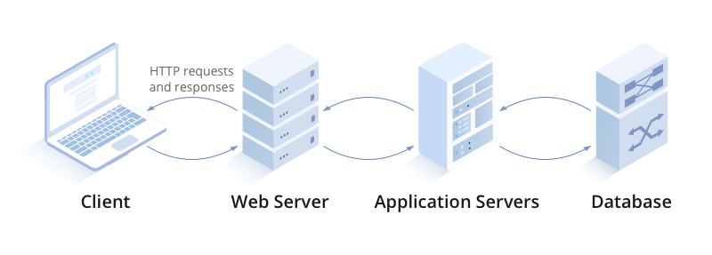
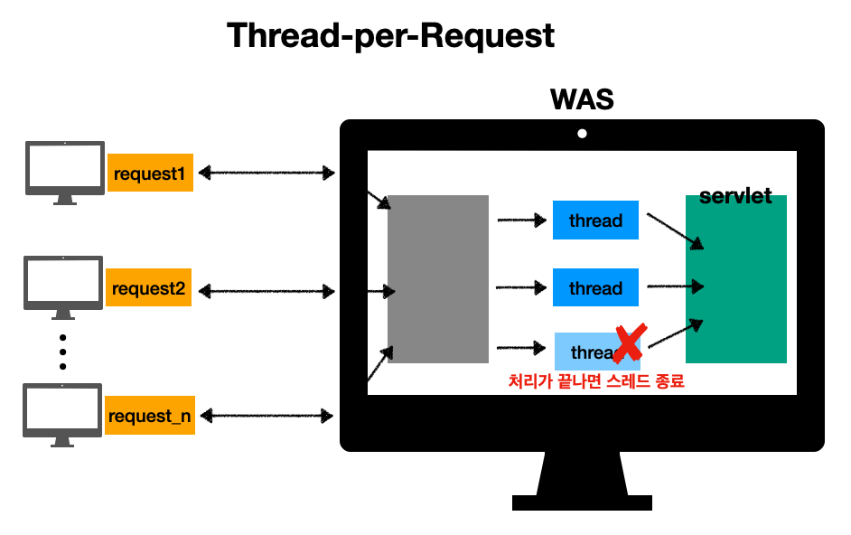

---

## 1. Web Server, WAS

웹 서버는 주로 웹 브라우저에서의 HTTP 요청에 응답하여 정적 웹 컨텐츠(예: HTML 페이지, 파일, 이미지, 비디오)를 제공한다. 일반적으로 애플리케이션 서버에서 웹 컨텐츠도 제공할 수 있으나, 이 서버의 주 기능은 최종 사용자 클라이언트와 서버 측 애플리케이션 코드(이른바 **비즈니스 로직**을 표현하는 코드) 간의 상호 작용을 통해 동적 컨텐츠, 이를테면 트랜잭션 결과, 의사결정 지원, 실시간 분석 등을 생성하고 제공하는 것이다. 

 

* **웹 서버(Web Server)**
  * 웹 서버는 웹 사이트를 호스팅하고 간단한 요청에 대한 응답을 제공
  * 웹 서버에 사용되는 기본 프로토콜은 HTTP 프로토콜
    * FTP, SMTP를 지원하는 웹 서버도 존재
  * **대부분 정적 콘텐츠 제공**
  * 대부분의 웹서버는 멀티스레딩을 지원하지 않는다
  * 예) Nginx, Apache

* **웹 애플리케이션 서버(WAS)**
  * **프로그램 코드를 실행해서 애플리케이션 로직(비즈니스 로직)을 처리**
  * 웹 서버에 사용되는 프로토콜 외에도 추가 통신 프로토콜을 사용하여 다른 소프트웨어 구성 요소와 통신
    * 예) RMI, RPC
  * 정적 콘텐츠도 제공 가능하지만, 대부분 동적 콘텐츠를 제공
  * **애플리케이션 서버는 멀티스레딩을 사용하여 높은 확장성과 효율성을 제공(동시 요청을 위한 멀티쓰레드 지원)**
    * 요청에 외부 리소스가 필요한 경우 애플리케이션 서버는 별도의 스레드를 사용하여 이러한 상호 작용을 처리
  * 예) Tomcat, Jetty, Undertow

 

최근에는 웹 서버와 애플리케이션 서버의 구분이 많이 모호해졌다. 웹 서버도 프로그램을 실행하는 기능을 포함하기도 하면서, WAS도 웹 서버의 기능을 제공해주기 때문이다. 일단은 **WAS는 애플리케이션 코드를 실행하는데 더 특화**되어 있다고 생각하자.

 

그러면 웹 서비스를 구성할 때 "WAS만 사용하는가?" 라고 물어보면, 답은 "아니요"다. WAS만으로 시스템을 구성하면 다음과 같은 문제가 발생한다.

* WAS가 너무 많은 역할을 담당, 서버 과부하 우려
* 자원을 가장 많이 소모하는 애플리케이션 로직이 정적 리소스 때문에 수행이 어려울 수 있다
* WAS 장애시 오류 화면 노출이 불가능하다

 

위와 같은 문제 때문에 보통 웹 서비스 시스템을 구성할 때 WAS앞에 웹서버를 배치한다. 이렇게 구성하는 경우 다음과 같은 이점을 얻을 수 있다.

* 정적 리소스는 웹서버가 처리하도록 할 수 있다
* 이 때 웹서버는 애플리케이션 로직같은 동적인 처리는 WAS에 요청을 위임한다
* WAS는 중요한 애플리케이션 로직만 처리하도록 할 수 있다
* 정적 리소스가 많아지면 → 웹 서버 증설
* 애플리케이션 로직 처리가 많아지면 → WAS 증설
* 애플리케이션 로직이 동작하는 WAS의 경우, 장애가 날 확률이 웹서버 보다 높다
* WAS, DB 장애시 웹서버가 오류 화면을 제공해줄 수 있다

 

Web Server, WAS

 

---

## 2. Thread Pool

Thread-per-request(요청 당 스레드) 모델의 단점과, 스레드 풀(thread pool)을 이용하는 이유를 알아보자.

먼저 웹 애플리케이션에서 스레드는 무엇일까?

* 애플리케이션 코드를 하나씩 순차적으로 실행하는 것이 스레드(thread)
* 자바 메인 메서드를 처음 실행하면 main이라는 이름의 스레드가 실행
* 스레드는 한번에 하나의 코드 라인만 수행
* 이때 동시 처리가 필요한 경우 스레드를 추가로 생성해서 사용한다(multi-thread)

 

웹 애플리케이션에서 여러 요청이 들어올 때, 요청 마다 스레드를 생성하는 것은 단일 스레드를 이용하는 것과 달리 동시 요청을 처리할 수 있도록 해준다. 그러나 이런 요청 당 스레드(thread-per-request) 모델에는 단점들이 존재한다.

 

Thread per Request

* 처리 속도보다 더 빠르게 요청이 늘어나면 어떤 일이 일어날까?
  * 요청마다 스레드가 계속 생성되기 때문에 스레드 수가 계속 늘어난다 (스레드 생성에 제한이 없다)
  * 스레드의 생성 비용은 비싼편이다 → 스레드 생성 소요시간으로 인해 요청 처리 시간이 더 오래 걸릴 수 있다
  * 스레드 수 증가 → 메모리 고갈
  * 컨텍스트 스위칭이 더 자주 발생한다 → CPU 오버헤드 증가
  * **이런 문제가 계속 늘어나면 결국에 서버 전체가 응답 불가능 상태에 빠진다!**

 

이런 문제를 해결하기 위해서 쓰레드 풀(thread pool)이라는 것을 사용한다.

 

Thread Pool

스레드 풀 동작 과정

1. 요청이 들어와서 스레드가 필요한 경우, 스레드 풀에서 이미 생성되어 있는 스레드를 꺼내서 사용한다
2. 요청에 스레드의 사용을 종료하면 해당 스레드를 스레드 풀에 다시 반납한다
3. 최대 스레드(max thread) 만큼 모두 사용중이어서 스레드 풀에 스레드가 없는 경우
   *  기다리는 요청을 거절하거나 특정 숫자만큼 대기하도록 설정할 수 있다

 

스레드 풀을 정리하자면 다음과 같다.

* **스레드 풀은 정해진 수 만큼의 스레드(max thread)를 미리 만들어놓고 스레드를 재사용하는 방법이다**
  * Tomcat은 기본 설정으로 max thread를 200으로 설정한다
* 미리 스레드를 만들어 놓기 때문에 스레드 생성 시간을 절약할 수 있다 → 쓰레드 생성 비용 절약, 응답 시간이 빨라진다 
* 제한된 개수의 스레드를 운용하는 것이기 때문에 스레드의 무제한 생성을 방지 할 수 있다 → 많은 요청이 들어와도 기존 요청을 안전하게 처리 가능하다

 

WAS의 주요 튜닝 포인트는 최대 스레드(max thread)이다.

* 최대 스레드가 너무 낮은 경우
  * 동시 요청이 많아질 때, 서버 리소스는 남아 돌지만 클라이언트는 응답 지연을 겪는다
* 최대 스레드가 너무 높은 경우
  * 동시 요청이 많아질 때, 서버의 자원(CPU, 메모리) 임계점 초과로 서버 다운

 

이상적인 최대 스레드 수는 작업 형태, 서버 성능, 아키텍쳐에 따라 달라질 수 있기 때문에 경험적으로 찾아야한다. 큐 사이즈에 제한이 없으면 요청이 무한히 쌓이는 위험 요인(메모리 고갈)이 될 수 있으니, 가능한 큐 사이즈를 확인해보는 것도 중요하다.

테스트는 실제 서비스와 유사하게 성능 테스트를 해보자. (툴 : Apache ab, nGrinder 등) 

 

---

## 3. AJAX

AJAX는 Asynchronous JavaScript and XML의 약자로, 말 그대로 JavaScript와 XML을 이용한 비동기적 정보 교환 기법이다. 이름에 XML이라고 명시되어있긴 하지만 JSON이나 일반 텍스트 파일과 같은 다른 데이터 오브젝트들도 사용 가능해서 요즘엔 XML을 잘 안 쓰고 대부분 JSON을 사용한다.

 

AJAX의 동작 원리는 다음과 같다.

1. 브라우저가 사이트에 접속하면 서버는 사이트의 기본 구조를 담은 '템플릿'을 전달한다
2. 브라우저는 수신받은 템플릿 HTML과 CSS를 해석해 화면의 기본 모양을 랜더링한다
3. 계속해서 서버는 데이터의 요청 방식과 수신받은 데이터를 어떻게 가공해야 하는지를 기술한 자바스크립트 파일을 전달한다
4. 브라우저는 자바스크립트 파일을 해석해서 파일에 기술된 방식대로 서버에 추가 데이터를 요청한다
5. 서버는 순수 데이터를 응답으로 되돌려준다 (보통 JSON)
6. 브라우저는 수신한 데이터를 해석하여 템플릿의 적절한 위치에 삽입한다. 데이터의 가공 방식에 따라 삽입 외의 작업(변경, 삭제)을 할 수도 있다

 

AJAX가 등장하면서 Gmail과 같은 SPA(Single Page Application)도 점점 나오기 하기 시작했다.

 

---

## 4. SSR(Server Side Rendering), CSR(Client Side Rendering)

SSR은 요청에 대한 결과 HTML을 서버에서(Server Side) 생성해서 클라이언트에 전달하는 방식이다. SSR의 과정은 다음과 같다.

1. 클라이언트에서 요청을 보낸다
2. 서버에서 응답을 위해 즉시 렌더링 가능한 HTML을 생성한다
3. 클라이언트에 HTML을 전달한다.
   * HTML은 브라우저에서 즉시 렌더링된다
   * 클라이언트가 자바스크립트를 다운로드하기 전까지 동적으로 상호작용이 불가능하다 (JS 다운로드 전까지의 조작을 기억한다)

 

반면에 CSR은 결과 HTML을 자바스크립트를 사용해 웹 브라우저에서 동적으로 내용을 생성해서 적용하는 것이다. CSR의 과정은 다음과 같다.

1. 클라이언트에서 요청을 보낸다
2. 서버는 클라이언트에게 비어있는 HTML과 자바스크립트 링크를 클라이언트에게 보낸다
3.  클라이언트는 자바스크립트를 요청
4. 서버는 자바스크립트를 클라이언트에게 전달
   * 자바스크립트 안에 클라이언트 로직과 HTML을 렌더링하는 코드가 들어가 있음
5. 클라이언트는 HTTP API를 가지고 데이터를 요청함
6. 서버는 해당 데이터 요청에 대한 JSON을 클라이언트에게 응답으로 전달
7. 클라이언트는 해당 데이터(JSON)를 가지고 동적으로 HTML 내용 렌더링 

 

SSR와 CSR의 특징을 정리해보자.

* **SSR**
  * 초기 로딩 속도가 빠름
  * 주로 정적인 화면에 사용
  * 모든 데이터가 담긴 HTML을 브라우저로 전달하기 때문에 SEO에 유리
  * SSR을 사용하더라도, JS를 사용해서 화면 일부를 동적으로 변경 가능
  * 관련 기술 : JSP, 타임리프(템플릿 엔진)

* **CSR**
  * 초기 로딩 이후의 구동 속도가 빠름
    * SSR에 비해 초기 로딩 속도가 느림
  * 주로 동적인 화면에 사용
  * 대부분 HTML의 내용이 비어있기 때문에 SEO에 불리
  * 서버 부하를 줄일 수 있음
  * 관련 기술 : React, Vue

 

SSR vs CSR

 

> CSR와 SSR을 동시 사용할 수 있는 React나 Vue 같은 프레임워크들도 존재

 

---

## Reference

1. [스프링 MVC - 백엔드 웹 개발 핵심 기술](https://www.inflearn.com/course/%EC%8A%A4%ED%94%84%EB%A7%81-mvc-1)
2. [쉬운 코드 - 스레드 풀](https://www.youtube.com/watch?v=B4Of4UgLfWc)
3. [https://community.fs.com/article/application-server-guide-a-detailed-perspective.html](https://community.fs.com/article/application-server-guide-a-detailed-perspective.html)