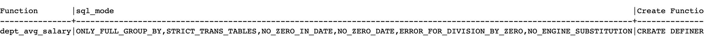

---

## 1. 스토어드 함수(Stored Function)

Stored Function에 대해 알아보자.

* Stored Function은 단일 값을 반환하기 위해 사용자가 작성하는 함수이다.
* Stored Function은 DBMS에 저장되고 사용된다
* ```SELECT```, ```INSERT```, ```UPDATE```, ```DELETE``` 절에서 사용 가능하다 

<br>

### 1.1 Example 1

그럼 이제 Stored Function을 사용해보자. 먼저 임직원의 ```id```를 열자리 정수로 랜덤하게 발급하고, 이때 ```id```의 첫자리는 1로 고정하는 함수를 만든다고 하자.

* 예) ```1?????????```

```sql
-- 1. Stored Function 작성
delimiter $$ -- 기존의 ;를 사용하면 CREATE FUNCTION 끝났다고 인식하기 때문에 ;를 $$로 사용 
CREATE FUNCTION id_generator() -- 현재 파라미터는 아무것도 받지 않음 
RETURNS int -- 리턴타입은 int
NO SQL -- MySQL optimizer가 NO SQL을 보고 최적화(SQL절을 사용하지 않았다는 뜻)
BEGIN
	RETURN (1000000000 + floor(rand() * 1000000000)); -- 함수의 body
	-- rand()는 0<= <1의 범위에서 랜덤한 실수
END
$$
delimiter ;  -- delimiter를 다시 ;로 

-- 2. Stored Function 사용
-- 임직원을 추가할 떄 id_generator()를 사용해서 id를 부여
INSERT INTO EMPLOYEE
VALUES (id_generator(), 'MINJAE', '1996-11-15', 'M', 'PO', 100000000, 1005);
```

```EMPLOYEE``` 테이블을 확인해보면 함수가 정상적으로 동작했다는 것을 확인할 수 있다.

```
+------------+----------+------------+------+-----------+-----------+---------+
| id         | name     | birth_date | sex  | POSITION  | salary    | dept_id |
+------------+----------+------------+------+-----------+-----------+---------+
|          1 | MESSI    | 1987-02-01 | M    | DEV_BACK  | 400000000 |    1003 |
|          2 | JANE     | 1996-05-05 | F    | DSGN      | 180000000 |    1004 |
... 생략
|         16 | SIMON    | 1990-08-11 | M    | DEV_FRONT |  80000000 |    NULL |
| 1606175006 | MINJAE   | 1996-11-15 | M    | PO        | 100000000 |    1005 |
+------------+----------+------------+------+-----------+-----------+---------+
```

<br>

---

### 1.2 Example 2

부서의 ```id```를 파라미터로 받고 해당 부서의 평균 연봉을 알려주는 함수를 작성해보자. (만약 ```DEPARTMENT```의 ```id```가 ```dept_id```라면 다시 ```id```를 사용하도록 스키마 변경)

```sql
-- 1. Stored Function 작성 
delimiter $$
CREATE FUNCTION dept_avg_salary(d_id int) -- int형의 d_id라는 파라미터를 받는다 
RETURNS int -- 리턴타입은 int
READS SQL DATA -- SQL에 대해 READ operation만 수행한다는 뜻 
BEGIN
		DECLARE avg_sal int; -- DECLARE로 변수 선언 
		SELECT AVG(salary) INTO avg_sal -- 3. 해당 임직원들의 연봉의 평균, avg_sal로 저장 
						   FROM EMPLOYEE -- 1. EMPLOYEE 테이블로 부터 
						   WHERE dept_id = d_id; -- 2. 파라미터로 받은 id가 dept_id와 같다면 
		RETURN avg_sal;
		
-- @avg_sal같은 형태로 사용하면 변수 선언 없이 사용가능 
-- 		SELECT AVG(salary) INTO @avg_sal
-- 						   FROM EMPLOYEE 
-- 						   WHERE dept_id = d_id;  
-- 		RETURN @avg_sal;
END
$$
delimiter ; 

-- 2. Stored Function 사용하기
SELECT *, dept_avg_salary(id) -- 각 부서의 id가 인수로 들어가서 함수가 동작하게 됨 
FROM DEPARTMENT;
```

```
+------+-------------+-----------+---------------------+
| id   | dept_name   | leader_id | dept_avg_salary(id) |
+------+-------------+-----------+---------------------+
| 1001 | headquarter |         4 |           240000000 |
| 1002 | HR          |        15 |           117000000 |
| 1003 | development |        14 |           285000000 |
| 1004 | design      |         2 |           170000000 |
| 1005 | product     |        13 |           150000000 |
| 1006 | data        |      NULL |                NULL |
+------+-------------+-----------+---------------------+
```

<br>

---

### 1.3 Example 3, 기타 용도

이번에는 임직원의 연봉이 전체 평균연봉보다 높은지 낮은지 판단하는 함수를 작성해보자.

```sql
-- 1. Stored Function 작성 
delimiter $$
CREATE FUNCTION above_avg_salary(empl_salary int)
RETURNS CHAR(5) 
READS SQL DATA
BEGIN
	DECLARE above_below CHAR(5); -- 평균 연봉보다 높은지, 낮은지 알려주는 변수 선언 
	IF empl_salary IS NULL 									                THEN SET above_below = 'null';
	ELSEIF empl_salary < (SELECT AVG(salary) FROM EMPLOYEE) THEN SET above_below = 'below';
	ELSEIF empl_salary > (SELECT AVG(salary) FROM EMPLOYEE) THEN SET above_below = 'above';
	ELSE 								                                         SET above_below = 'equal';
	END IF;
	RETURN above_below;
END
$$
delimiter ; 

-- 2. Stored Function 사용하기
SELECT *, above_avg_salary(salary) -- 각 임직원의 salary가 인수로 들어가게 됨 
FROM EMPLOYEE;
```

```
+------------+----------+------------+------+-----------+-----------+---------+--------------------------+
| id         | name     | birth_date | sex  | POSITION  | salary    | dept_id | above_avg_salary(salary) |
+------------+----------+------------+------+-----------+-----------+---------+--------------------------
|          1 | MESSI    | 1987-02-01 | M    | DEV_BACK  | 400000000 |    1003 | above                    
|          2 | JANE     | 1996-05-05 | F    | DSGN      | 180000000 |    1004 | below                   
|         14 | SAM      | 1992-08-04 | M    | DEV_INFRA | 280000000 |    1003 | above                    |... 생략
|         15 | NEIMAR   | 1987-01-03 | M    | HR        |  70000000 |    1002 | below                    
|         16 | SIMON    | 1990-08-11 | M    | DEV_FRONT |  80000000 |    NULL | below                    
| 1606175006 | MINJAE   | 1996-11-15 | M    | PO        | 100000000 |    1005 | below                    
+------------+----------+------------+------+-----------+-----------+---------+--------------------------+
```

<br>

지금까지 살펴본 것과 같이 Stored Function을 통해서 다양한 작업을 할 수 있다. 이외에도 다음과 같은 작업을 수행할 수 있다

* 루프(loop)를 돌면서 반복적인 작업 수행
* ```CASE``` 키워드를 사용해서 값에 따른 분기 처리
* 에러 핸들링, 에러 발생 등의 작업

<br>

---

### 1.4 등록된 Stored Function 파악하기

저장된 Stored Function을 삭제하는 방법 부터 알아보자. 

```sql
DROP FUNCTION stored_function_name;
```

<br>

DB의 Stored Function들의 정보를 가져오는 방법을 알아보자.

```sql
SHOW FUNCTION STATUS WHERE DB = 'test_company';
```


<p align='center'>SHOW FUNCTION STATUS</p>

* Stored Function을 정의할 때 뒤에 사용할 DB를 명시하지 않으면 현재 사용하고 있는 DB(활성화된)에 속한 함수로 등록됨

<br>

만약 특정 DB에 속한 함수를 등록하고 싶으면 다음과 같이 사용하면 된다.

```sql
CREATE FUNCTION db_name.function_name;
```

<br>

그러면 특정 함수의 세부적인 내용을 확인하는 방법을 알아보자.

```sql
SHOW CREATE FUNCTION dept_avg_salary; -- dept_avg_salary 함수의 세부 내용 확인
```

<br>




<p align='center'>SHOW CREATE FUNCTION</p>

* Stored Function의 선언 방법을 포함해 여러가지 정보를 확인할 수 있다

<br>

---

## 2. 스토어드 프로시져(Stored Procedure)

스토어드 프로시져(Stored Procedure)에 대해서 알아보자.

* 스토어드 프로시져는 하나의 단위로 실행이 가능한 SQL statement들의 집합이다.
* 스토어드 프로시져는 DBMS에 저장되고 사용된다
* 스토어드 프로시져는 스토어드 함수(Stored Function)과 다르게 리턴값이 없어도 된다.

<br>

### 2.1 Example 1

두 정수의 곱셈 결과를 가져오는스토어드 프로시져를 작성해보자.

```sql
-- 1.Stored Procedure 작성 
delimiter $$
CREATE PROCEDURE product(IN a int, IN b int, OUT result int) -- IN : INPUT 파라미터, OUT : OUTPUT 파라미터
/*
 * 파라미터는 디폴트로 IN 파라미터이다
 * OUT 파라미터를 이용하기 위해서는 명시해야함 
 */
BEGIN
	SET result = a * b;
END
$$
delimiter ;

-- 2. Procedure 사용
CALL product(9, 21, @result);
SELECT @result;
```

```
+---------+
| @result |
+---------+
|     189 |
+---------+
```

* ```IN``` : 값을 전달(입력) 받기 위한 파라미터
* ```OUT``` : 리턴값을 저장하기 위해 사용하는 파라미터

<br>

---

### 2.2 Example 2

두 정수를 서로 바꾸는 스토어드 프로시져를 작성해보자.

```sql
-- 1.Stored Procedure 작성 
delimiter $$
CREATE PROCEDURE swap(INOUT a int, INOUT b int) -- INOUT : 값을 전달 받으면서도 리턴값도 저장이 가능한 파라미터 
BEGIN
	SET @temp = a;
	SET a = b;
	SET b = @temp;
END
$$
delimiter ;

-- 2. Procedure 사용
SET @a = 9, @b = 21;
CALL swap(@a, @b);
SELECT @a, @b;
```

```
+------+------+
| @a   | @b   |
+------+------+
|   21 |    9 |
+------+------+
```

<br>

---

### 2.3 Example 3

각 부서별 평균 연봉을 가져오는 스토어드 프로시져를 작성해보자.  

```sql
-- 1.Stored Procedure 작성 
delimiter $$
CREATE PROCEDURE get_dept_avg_salary()
BEGIN
	SELECT dept_id, avg(salary)
	FROM EMPLOYEE
	GROUP BY dept_id; -- 각 부서별 평균 연봉 
END
$$
delimiter ;

-- 2. Procedure 사용
CALL get_dept_avg_salary(); -- 리턴값이 없고, 함수를 그냥 호출하는 것 만으로 사용가능 
```

```
+---------+----------------+
| dept_id | avg(salary)    |
+---------+----------------+
|    NULL |  80000000.0000 |
|    1001 | 240000000.0000 |
|    1002 | 117000000.0000 |
|    1003 | 285000000.0000 |
|    1004 | 170000000.0000 |
|    1005 | 150000000.0000 |
+---------+----------------+
```

<br>

---

### 2.4 Example 4

유저가 프로필 닉네임을 변경하는 경우, 이전 닉네임을 로그에 저장하고 새 닉네임으로 업데이트하는 프로시저를 작성해보자.

먼저 ```USERS```과 ```NICKNAME_LOGS``` 테이블을 생성하자.

```sql
-- 1. USERS 테이블 생성
CREATE TABLE USERS (
	id INT,
	nickname VARCHAR(30) NOT NULL UNIQUE,
	PRIMARY KEY (id)
);

-- 2. NICKNAME_LOGS 테이블 생성
CREATE TABLE NICKNAME_LOGS (
	id INT,
	prev_nickname VARCHAR(30),
	until DATETIME NOT NULL,
	PRIMARY KEY (id),
	FOREIGN KEY (id) REFERENCES USERS(id)
);

-- 3. USERS 테이블에 데이터를 입력
INSERT INTO USERS VALUES
	(1, 'dogfeet123'),
	(2, 'jidan'),
	(3, 'worldclass99');
```

```
+----+--------------+
| id | nickname     |
+----+--------------+
|  1 | dogfeet123   |
|  2 | jidan        |
|  3 | worldclass99 |
+----+--------------+
```

<br>

이제 스토어드 프로시져를 작성해보자.

```sql
-- 1.Stored Procedure 작성 
delimiter $$
CREATE PROCEDURE change_nickname(user_id int, new_nick varchar(30))
BEGIN
	INSERT INTO NICKNAME_LOGS ( -- NICKNAME_LOGS 테이블로 INSERT 
		SELECT id, nickname, now() FROM USERS WHERE id = user_id -- user_id는 입력받은 파라미터
		-- 입력받은 user_id를 통해서 id, nickname, 현재시각(now)을  가져온다 
	);
	UPDATE USERS SET nickname = new_nick WHERE id = user_id; -- USERS 테이블에 새로운 nickname을 업데이트 해준다 
END
$$
delimiter ;

-- 2. Procedure 사용
CALL change_nickname(1, 'dataengineer95');
```

```
+----+----------------+
| id | nickname       |
+----+----------------+
|  1 | dataengineer95 |
|  2 | jidan          |
|  3 | worldclass99   |
+----+----------------+
```

```
+----+---------------+---------------------+
| id | prev_nickname | until               |
+----+---------------+---------------------+
|  1 | dogfeet123    | 2024-02-19 20:07:39 |
+----+---------------+---------------------+
```

<br>

---

### 2.5 Stored Procedure vs Stored Function

Stored Procedure와 Stored Function을 비교해보자. 

1. **스토어드 프로시져(Stored Procedure)**
   * ```RETURN``` 키워드로 반환 불가
   * 파라미터로 값 반환 가능
   * 반환은 필수가 아님
   * SQL statement에서의 호출 불가
   * 트랜잭션(Transaction) 사용 가능
   * 주로 비즈니스 로직을 위해 사용
2. **스토어드 함수(Stored Function)**
   * ```RETURN``` 키워드로 반환 가능 (MySQL의 경우 필수)
   * 파라미터로 값 반환은 일부의 경우 가능하나 권장하지 않음
   * 무조건 단일 값을 반환 해야함
   * SQL statement에서의 호출 가능
   * 트랜잭션은 대부분 사용 불가 (Oracle의 경우 가능)
   * 주로 계산, 유틸용으로 사용

<br>

프로시져와 함수의 차이는 위에서 언급한 내용 이외에도 여러가지 차이가 존재하고, 각 RDBMS 마다도 조금씩 다르게 차이난다. 

<br>

---

## 3. 트리거(Trigger)

SQL ```Trigger```는 데이터베이스에서 어떤 특정한 이벤트(```INSERT```, ```UPDATE```, ```DELETE```)가 발생했을 때 자동적으로 실행되는 프로시저(Procedure)이다. (이벤트는 데이터가 변경되는 작업으로 생각하면 편하다)

<br>


<p align='center'>USERS, NICKNAME_LOGS 테이블</p>

<br>

```USERS``` 테이블의 닉네임을 ```UPDATE```하는 경우 기존의 닉네임을 ```NICKNAME_LOGS```의 ```prev_nickname```에 저장하고, ```USERS```의 ```nickname```은 새로운 ```nickname```으로 변경하는 상황을 생각해보자.

여기서 ```TRIGGER```는 ```USERS``` 테이블의 ```nickname```에 대한 ```UPDATE```가 있을때 기존의 ```nickname```을 ```NICKNAME_LOGS```에 저장하도록 구현할 것이다. 

<br>

```sql
-- 1. Trigger 작성 
delimiter $$
CREATE TRIGGER log_user_nickname_trigger -- TRIGGER 생성 
BEFORE UPDATE -- TRIGGER 발생 시기: UPDATE 이전에 발생 
ON USERS FOR EACH ROW -- USERS 테이블에 대한 UPDATE가 발생하면 트리거 수행, 이때 각 ROW에 대해 수행 
BEGIN
	INSERT INTO NICKNAME_LOGS VALUES(OLD.id, OLD.nickname, now()); -- TRIGGER가 수행할 액션, OLD: UPDATE 이전의 튜플을 가리킴 
END
$$
delimiter ;

-- 2. Trigger 동작 확인 
UPDATE USERS SET nickname = 'backend1234' WHERE id = 2; -- 원랜 'jidan'인 닉네임을 'backend1234'로 변경 
```

```
mysql> select * from users;
+----+----------------+
| id | nickname       |
+----+----------------+
|  2 | backend1234    |
|  1 | dataengineer95 |
|  3 | worldclass99   |
+----+----------------+
```

```
mysql> select * from nickname_logs;
+----+---------------+---------------------+
| id | prev_nickname | until               |
+----+---------------+---------------------+
|  1 | dogfeet123    | 2024-02-19 20:07:39 |
|  2 | jidan         | 2024-02-20 15:16:21 |
+----+---------------+---------------------+
```

* ```OLD``` 키워드는 다음을 의미한다
  * ```UPDATE``` 되기 전의 튜플
  * ```DELETE```된 튜플
* 반대로 ```NEW``` 키워드는 다음을 의미한다
  * ```INSERT```된 튜플
  * ```UPDATE```된 후의 튜플

<br>

위에서 살펴본 것 처럼 ```TRIGGER```는 데이터의 변경 이력(history) 또는 로그(log)를 기록하는데 사용될 수 있다.

<br>

> MySQL에서는 불가능하지만 PostgreSQL이나 다른 RDBMS에서는 동시에 여러 이벤트를 감지하는 트리거를 구현할 수도 있다.
{: .prompt-info }

<br>

```Trigger``` 사용시 주의할 점은 다음과 같다.

* 소스코드로 파악할 수 없는 로직이기 때문에, 어떤 동작을 수행했는지 파악 그리고 문제 대응이 어렵다 (가시적이지 않음)
* 트리거가 지나치게 많으면, 발생한 트리거가 또 다른 트리거들을 연쇄적으로 발생시키는 문제를 겪을 수 있다
* 과도한 트리거는 DB에 부담을 준다

---

## Reference

1. [인프런 - 쉬운코드 데이터베이스 개론](https://www.inflearn.com/course/%EB%B0%B1%EC%97%94%EB%93%9C-%EB%8D%B0%EC%9D%B4%ED%84%B0%EB%B2%A0%EC%9D%B4%EC%8A%A4-%EA%B0%9C%EB%A1%A0/dashboard)
2. [한빛 미디어 - 이것이 MySQL이다](https://www.youtube.com/watch?v=VnnTh83sjcc&list=PLVsNizTWUw7Hox7NMhenT-bulldCp9HP9&index=6)
3. [MySQL 8.0 Document](https://dev.mysql.com/doc/mysql-installation-excerpt/8.0/en/macos-installation.html)
4. [https://dev.mysql.com/doc/employee/en/employees-installation.html](https://dev.mysql.com/doc/employee/en/employees-installation.html)
