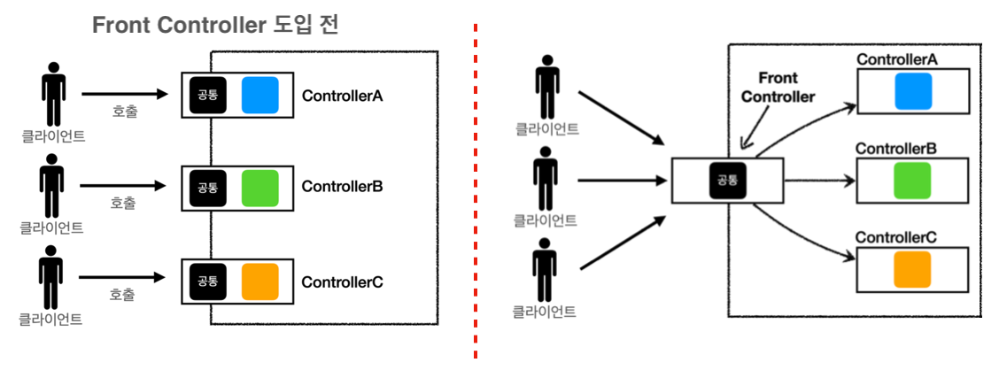
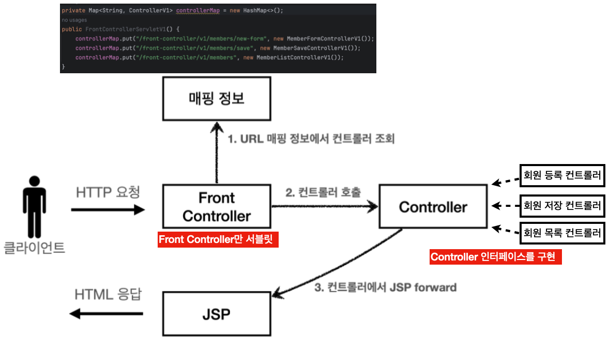
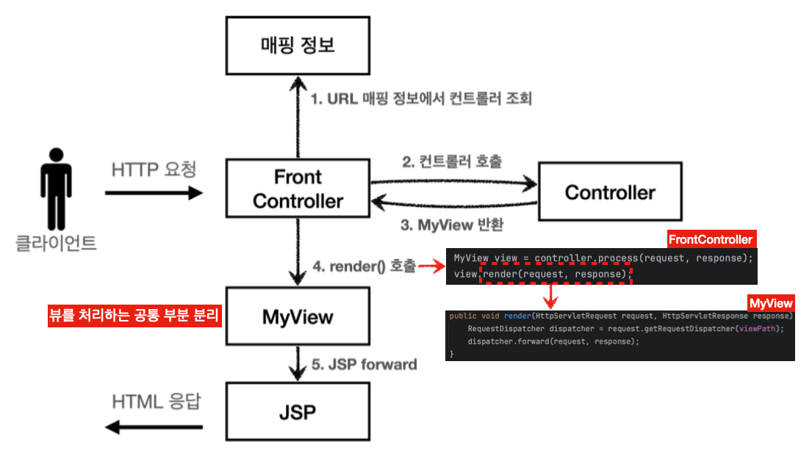
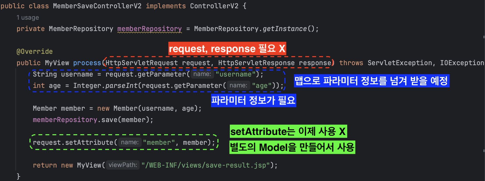
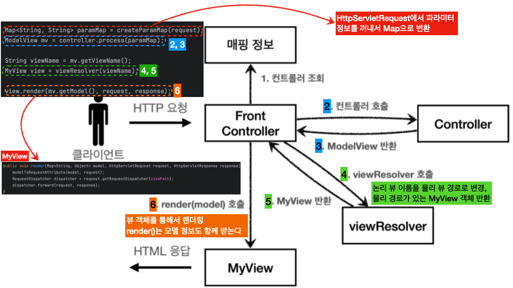
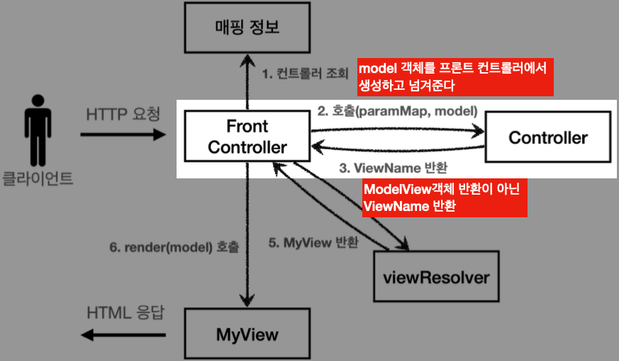
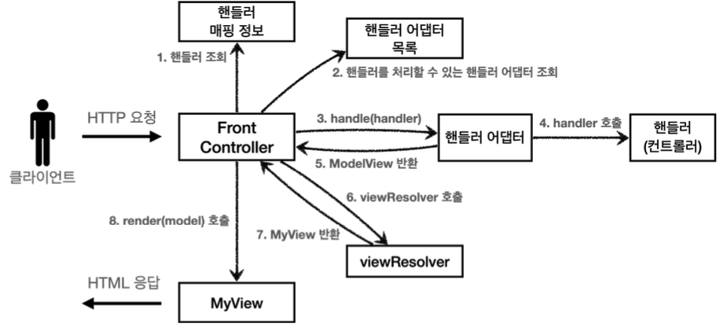
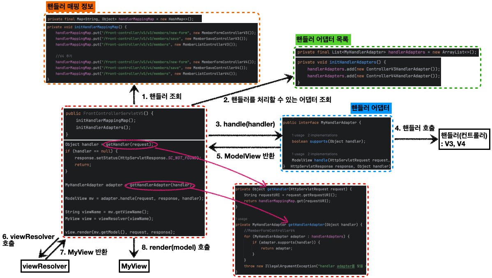

---

## 1. MVC(Model View Controller) 패턴 소개

기존의 서블릿이나 JSP만 사용하게 되면, **비즈니스 로직과 뷰(view)가 분리되어 있지 않았다. 결과적으로 유지보수가 어려워진다**. 예를 들자면, 비즈니스 로직을 처리하는 코드를 변경해야하는 경우 뷰가 함께 있는 코드를 수정해야한다. 반대로 UI를 변경하는 일에도 비즈니스 로직이 있는 코드도 함께 수정해야 한다.

MVC 패턴은 기존에 하나의 영역으로 처리하던 것을 컨트롤러(Controller), 뷰(View), 모델(Model)의 3개 영역으로 분리하는 디자인 패턴이다. 웹 애플리케이션의 많은 경우 이 MVC 패턴을 이용한다.

<br>


<p align='center'>MVC Pattern</p>

* **컨트롤러(Controller)**: HTTP 요청을 받아서 파라미터를 검증하고, 비즈니스 로직을 실행한다. 그리고 뷰에 전달할 결과 데이터를 조회해서 모델에 담는다.
  * 컨틀로러에 비즈니스 로직을 둘 수도 있지만, 이 경우 컨트롤러가 너무 많은 역할을 담당한다
  * **비즈니스 로직을 서비스 레이어라는 계층을 별도로 만들어서 처리하는 경우가 많다**
  * 컨트롤러는 비즈니스 로직이 있는 서비스를 호출하는 역할


* **모델(Model)**: 뷰에 출력할 데이터를 담아둔다
  * 뷰는 비즈니스 로직이나 데이터 접근을 몰라도 됨


* **뷰(View)** : 모델에 담겨있는 데이터를 이용해 화면을 그린다(대부분 HTML 생성을 말한다)

<br>

그러면 스프링을 사용하지 않고 순수 자바로 이 MVC 패턴을 구현해보자.

<br>

---

## 2. Front Controller

기존 MVC 패턴의 단점은 다수의 컨트롤러에서 중복되는 코드들이다. 이런 중복 코드를 메서드로 공통화 할 순 있지만, 결국에 해당 메서드도 항상 직접 호출해야하는건 변함이 없다.

기능이 복잡해질 수록 컨트롤러에서 공통으로 처리해야 하는 부분이 점점 더 많이 증가할 것이다. 단순히 공통 기능을 메서드로 뽑으면 될 것 같지만, 결과적으로 해당 메서드를 항상 호출해야 하고, 실수로 호출하지 않으면 문제가 될 것이 다. 그리고 호출하는 것 자체도 중복이다.

이를 해결하기 위해서 **컨트롤러 호출전에 공통 기능을 처리하는 프론트 컨틀로러(Front Controller)를 도입**하면 된다. (Centralized request handling)

<br>



<p align='center'>Front Controller</p>

* 프론트 컨트롤러 도입 전에는 컨트롤러의 공통 로직이 계속 중복되어서 들어갔다
* 프론트 컨트롤러 도입 후에는 공통의 로직을 하나의 서블릿으로 모아서 처리한다
* Front Controller의 특징은 다음과 같다
  * 프론트 컨트롤러 서블릿 하나로 클라이언트의 요청을 받는다(Centralized request handling)
  * 프론트 컨트롤러가 요청에 맞는 컨트롤러를 찾아서 호출한다
  * 프론트 컨트롤러를 제외한 나머지 컨트롤러는 서블릿을 사용하지 않아도 된다
    * 서블릿을 만들었던 이유는 싱글톤으로 관리되는 서블릿을 통해 요청을 받고 응답을 생성하기 위함이였음 → 이제는 프론트 컨틀롤러 서블릿을 통해 요청을 다 받으면 됨 → 나머지 컨틀로러는 서블릿을 사용하지 않아도 됨


* 스프링 웹 MVC의 `DispatcherServlet`이 프론트 컨트롤러 패턴으로 구현되어 있음

<br>

---

## 3. Front Controller 도입

프론트 컨트롤러와 나머지 컨트롤러를 구현하기 이전에, 구현할 애플리케이션의 요구사항을 간단하게 짚고 넘어가자. 

회원 관리 웹 애플리케이션 요구사항

* 회원 정보
  * 이름 : `username`
  * 나이 : `age`
* 기능 요구사항
  * 회원 저장
  * 회원 목록 조회

<br>

프론트 컨트롤러를 도입하고 점진적으로 리팩토링을 진행해보자. 프론트 컨트롤러 도입 전에 컨틀로러 인터페이스를 만들자. 프론트 컨트롤러를 제외한 나머지 컨트롤러들은 이 인턴페이스를 구현하면 된다. 프론트 컨트롤러는 이 인터페이스를 호출해서 구현과 관계없이 로직의 일관성을 가져갈 수 있다.

<br>

`ControllerV1`

```java
public interface ControllerV1 {
     void process(HttpServletRequest request, HttpServletResponse response) throws ServletException, IOException;
 }
```

이 인터페이스를 구현할 컨트롤러는 

* 회원 등록 컨트롤러
* 회원 저장 컨트롤러
* 회원 목록 컨트롤러

<br>

프론트 컨트롤러 도입을 위해 `FrontControllerServletV1`을 만들자.

```java
@WebServlet(name = "frontControllerServletV1", urlPatterns = "/front-controller/v1/*")

public class FrontControllerServletV1 extends HttpServlet {

    private Map<String, ControllerV1> controllerMap = new HashMap<>();
    
    // 컨트롤러 맵을 통해서 URL과 호출될 컨트롤러를 매핑한다
    public FrontControllerServletV1() {
        controllerMap.put("/front-controller/v1/members/new-form", new MemberFormControllerV1());
        controllerMap.put("/front-controller/v1/members/save", new MemberSaveControllerV1());
        controllerMap.put("/front-controller/v1/members", new MemberListControllerV1());
    }

    @Override
    protected void service(HttpServletRequest request, HttpServletResponse response) throws ServletException, IOException {
        System.out.println("FrontControllerServletV1.service");

        String requestURI = request.getRequestURI();

        ControllerV1 controller = controllerMap.get(requestURI);
        if (controller == null) {
            response.setStatus(HttpServletResponse.SC_NOT_FOUND);
            return;
        }

        controller.process(request, response);
    }
}
```

* `urlPatterns = "/front-controller/v1/*"`:  `/front-controller/v1`를 포함한 하위 모든 요청을 이 서블릿애서 받아들인다
* `controllerMap`을 통해 URL과 호출될 컨트롤러를 매핑
* `requestURI` 를 조회해서 실제 호출할 컨트롤러를 `controllerMap` 에서 찾는다
  * 없으면 : `404 Not Found` 반환
  * 찾으면 : `controller.process(request, response);` 을 호출해서 해당 컨트롤러를 실행

<br>

그림으로 살펴보면 다음과 같다.

<br>



<p align='center'>Front Controller V1</p>

<br>

---

## 4. View 분리

구현된 컨트롤러에서 뷰로 이동하는 부분에 중복이 있었다. (컨트롤러에서 JSP forward하는 부분)

```java
String viewPath = "/WEB-INF/views/new-form.jsp";
RequestDispatcher dispatcher = request.getRequestDispatcher(viewPath);
dispatcher.forward(request, response);
```

<br>

중복되는 부분을 분리하기 위해서 별도로 뷰를 처리하는 객체 `MyView`를 만들고, 기존 컨트롤러들이 `MyView`를 반환하도록 컨트롤러들을 수정해보자.

이를 위해서 기존 컨트롤러 인터페이스의 구현이 `MyView`를 반환하도록 수정해야 한다.

<br>

`ControllerV2`

```java
public interface ControllerV2 {
    MyView process(HttpServletRequest request, HttpServletResponse response) throws ServletException, IOException;
}
```

<br>

`MyView`에서는 `render()`를 통해서 `forward`로직을 수행해서 JSP가 실행된다.

<br>

그림으로 구조를 살펴보면 다음과 같다.

<br>



<p align='center'>View seperation + Front Controller V2</p>

* `ControllerV2`를 구현한 컨트롤러들을 살펴보면, 복잡하게 뷰로 이동하던 로직들의 중복이 제거되었다
* 프론트 컨트롤러의 도입으로 `MyView` 객체의 `render()` 를 호출하는 부분을 모두 일관되게 처리할 수 있다
* 각각의 컨트롤러는 `MyView` 객체를 생성만 해서 반환하면 된다

<br>

---

## 5. Model 도입

Model을 도입해보자.

* 서블릿 종속성 제거
  * 컨틀로러 입장에서 `HttpServletRequest`, `HttpServletResponse`는 필요하지 않다
  * 요청 파라미터의 정보는 `Map`으로 대신 넘기도록 하면 지금 구조에서 컨트롤러가 서블릿 기술을 몰라도 동작 가능
  * `request` 개체를 모델로 사용하는 대신, 별도의 모델 객체를 만들어서 반환하면 된다


* 뷰 이름 중복 제거
  * 컨트롤러에서 지정하는 뷰 이름에 중복이 있다
  * 컨트롤러는 뷰의 논리 이름을 반환하고, 실제 물리 위치의 이름은 프론트 컨트롤러에서 처리하도록 하자 → 향후 뷰의 폴더 위치가 함께 이동해도 프론트 컨트롤러만 수정하면 된다 (논리 이름 : 의미를 나타내는 이름)
    * `/WEB-INF/views/new-form.jsp` → 논리 이름 : `new-form`
    *  `/WEB-INF/views/save-result.jsp` → 논리 이름 : `save-result`
    * `/WEB-INF/views/members.jsp` → 논리 이름 : `members`

<br>



<p align='center'>MemberSaveControllerV2</p>

<br>

지금까지 컨트롤러에서 서블릿에 종속적인 `HttpServletRequest`를 사용했다. 그리고 `Model`도 `request.setAttribute()` 를 통해 데이터를 저장하고 뷰에 전달했다.

서블릿의 종속성을 제거하기 위해 `Model`을 직접 만들고, 추가로 View 이름까지 전달하는 객체를 만들어야한다. (이번 버전에서는 컨트롤러에서 HttpServletRequest를 사용할 수 없다. 따라서 직접 `request.setAttribute()` 를 호출할 수 도 없다. 따라서 Model이 별도로 필요.)

이를 위해서 `ModelView`를 만든다.

<br>

`ModelView`

```java
public class ModelView {
     private String viewName;
  
     private Map<String, Object> model = new HashMap<>();
     
     public ModelView(String viewName) { this.viewName = viewName; }
  
     public String getViewName() { return viewName; }
  
     public void setViewName(String viewName) { this.viewName = viewName; }
  
     public Map<String, Object> getModel() { return model; }
  
     public void setModel(Map<String, Object> model) { this.model = model; }	 
}
```

* 뷰의 이름과 뷰를 렌더링할 때 필요한 `model` 객체를 가지고 있다
* `model`은 단순히 map으로 되어 있으므로 컨트롤러에서 뷰에 필요한 데이터를 key, value로 넣어주면 된다

<br>

`ControllerV3`

```java
public interface ControllerV3 {
     ModelView process(Map<String, String> paramMap);
}
```

* `HttpServletRequest`가 제공하는 파라미터는 프론트 컨트롤러가 `paramMap`에 담아서 호출해주면 된다
* 응답 결과로 뷰 이름과 뷰에 전달할 Model 데이터를 포함하는 `ModelView` 객체를 반환하면 된다

<br>

`FrontControllerV3`

```java
    @Override
    protected void service(HttpServletRequest request, HttpServletResponse response) throws ServletException, 		IOException {

        String requestURI = request.getRequestURI();

        ControllerV3 controller = controllerMap.get(requestURI);
        if (controller == null) {
            response.setStatus(HttpServletResponse.SC_NOT_FOUND);
            return;
        }

        Map<String, String> paramMap = createParamMap(request);
        ModelView mv = controller.process(paramMap);

        String viewName = mv.getViewName();
        MyView view = viewResolver(viewName);

        view.render(mv.getModel(), request, response);
    }

    private MyView viewResolver(String viewName) {
        return new MyView("/WEB-INF/views/" + viewName + ".jsp");
    }

    private Map<String, String> createParamMap(HttpServletRequest request) {
        Map<String, String> paramMap = new HashMap<>();
        request.getParameterNames().asIterator()
                .forEachRemaining(paramName -> paramMap.put(paramName, request.getParameter(paramName)));
        return paramMap;
    }
```

* `view.render(mv.getModel(), request, response)`의 동작을 위해서 `MyView`에 필요한 메서드를 추가해야 한다


<br>

그림으로 살펴보자.

<br>



<p align='center'>Servlet Dependency elimination + Front Controller V3</p>

* `view.render(mv.getModel(), request, response)`
  * 뷰 객체를 통해서 HTML 화면을 렌더링 한다
  * 뷰 객체의 `render()` 는 모델 정보도 함께 받는다
  * JSP는 `request.getAttribute()` 로 데이터를 조회하기 때문에, 모델의 데이터를 꺼내서`request.setAttribute()` 로 담아둔다
  * JSP로 `forward` 해서 JSP를 렌더링 한다

<br>

---

## 6. 사용성 개선

지금까지 구현한 컨트롤러의 개선 방법. 사용성이 더 편리하도록 개선해보자.

<br>

지금의 구조에서 컨트롤러가 `ModelView`를 반환하지 않고 `ViewName`만 반환하도록 한다

```Java
public interface ControllerV4 {
  String process(Map<String, String> paramMap, Map<String, Object> model);
 }
```

* model 객체는 파라미터로 전달해서 컨트롤러에서 그냥 사용하면 된다
* 결과로 뷰의 이름(`ViewName`)만 반환해주면 된다

<br>

```java
@WebServlet(name = "frontControllerServletV4", urlPatterns = "/front-controller/v4/*")
public class FrontControllerServletV4 extends HttpServlet {
  /** 기존 구현 */
  
  Map<String, String> paramMap = createParamMap(request);
  Map<String, Object> model = new HashMap<>(); //추가
  
  String viewName = controller.process(paramMap, model);
  
  // 컨트롤러가 직접 뷰의 논리 이름을 반환하기 때문에 이 값을 그대로 사용해서 실제 물리 경로 찾을 수 있음
  MyView view = viewResolver(viewName);
  view.render(model, request, response);
  
  /** 기존 구현 */
}
```

* `Map<String, Object> model = new HashMap<>();` 
  * 모델 객체를 프론트 컨트롤러에서 생성해서 넘겨준다
  * 컨트롤러에서 모델 객체에 값을 담으면 여기에 그대로 담긴다

<br>

그림으로 살펴보자.

<br>



<p align='center'>Controller V3 사용성 개선</p>

<br>

---

## 7. Adapter 도입

우리가 기존의 `ControllerV3` 방식으로도 개발을 하고, 개선된 컨트롤러 방식으로도 개발을 하고 싶으면 어떻게 할까? 현재의 코드로는 한가지 방식의 컨트롤러 인터페이스만 사용가능하다. 이를 해결하기 위해서 어댑터(Adapter)를 도입해보자.

<br>

> 어댑터 패턴(Adapter Pattern) : 기존의 request들이 compatible 하도록 중간에 바꿔주는 어댑터를 도입하는 패턴을 어댑터 패턴이라고 한다
{: .prompt-tip }

<br>

어댑터를 도입한 구조를 그림으로 살펴보면 다음과 같다.

<br>



<p align='center'>Adapter 도입</p>

* **핸들러 어댑터**: 중간에 어댑터 역할을 하는 어댑터(Adapter)가 추가되었는데 이름이 핸들러 어댑터이다. 여기서 어댑터 역할을 해주는 덕분에 다양한 종류의 컨트롤러를 호출할 수 있다.
  * 어댑터는 실제 컨트롤러를 호출하고, 그 결과로 `ModelView`를 반환해야 한다 (이제부터 어댑터를 통해서 컨트롤러 호출)
  * 컨트롤러가 `ModelView`를 반환하지 못하면, 어댑터가 `ModelView`를 직접 생성해서라도 반환해야 한다


* **핸들러**: 컨트롤러의 이름을 더 넓은 범위인 핸들러로 변경했다. 그 이유는 이제 어댑터가 있기 때문에 꼭 컨트롤러의 개념 뿐만 아니라 어떠한 것이든 해당하는 종류의 어댑터만 있으면 다 처리할 수 있기 때문이다.

<br>



<br>

결론적으로 어댑터를 이용하면 프레임워크를 더 유연하고 확장성 있게 설계할 수 있다.

---

## Reference

1. [스프링 MVC - 백엔드 웹 개발 핵심 기술](https://www.inflearn.com/course/%EC%8A%A4%ED%94%84%EB%A7%81-mvc-1)