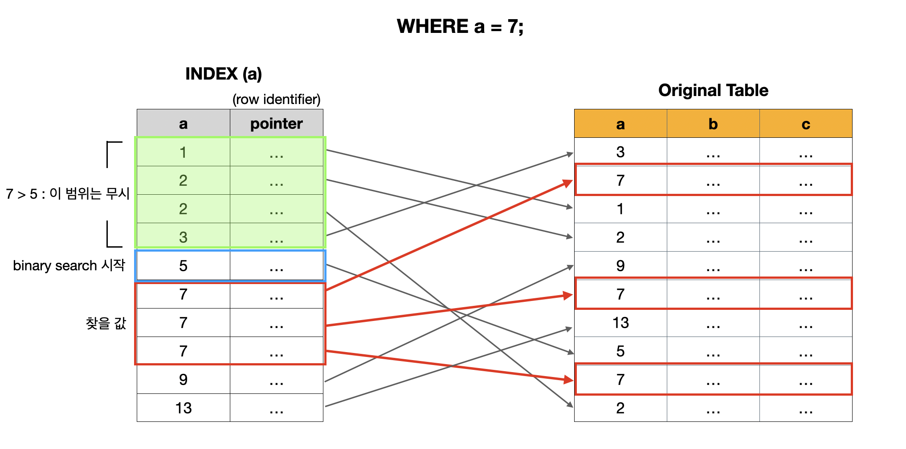
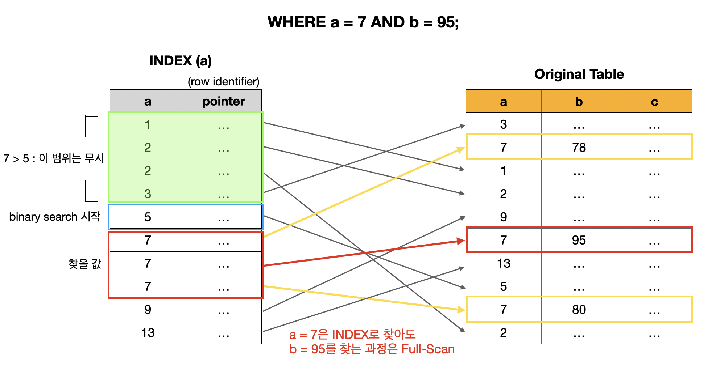
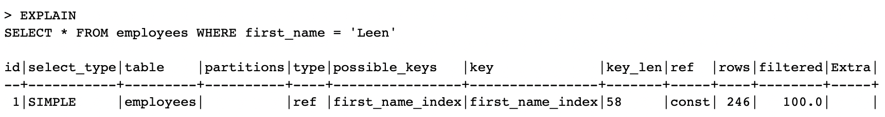

---

## 인덱스(INDEX)란?

SQL의 인덱스(Index)에 대해 알아보자.

* 인덱스(Index)는 테이블에서 원하는 데이터를 쉽고 빠르게 찾기 위해서 사용한다. 
* 관심있는 필드 값으로 만들어진 원본 테이블의 사본으로 생각하면 편한다. 
* 인덱스를 사용하는 경우 테이블 전체를 읽지 않아도 되기 때문에, 풀 스캔(Full-scan) 하는 경우 보다 조회가 빠르다.

<br>

들어가기에 앞서 예시에 사용한 데이터베이스는 MySQL에서 제공해주는 샘플 데이터베이스인 ```employees``` DB를 사용했다.

* [https://dev.mysql.com/doc/employee/en/employees-installation.html](https://dev.mysql.com/doc/employee/en/employees-installation.html)

<br>

---

## INDEX 사용법

먼저 ```employees``` 데이터베이스의 ```employees``` 테이블을 살펴보자.

<br>


<p align='center'>employees 테이블</p>

* 총 300024의 row 존재
* ```PRIMARY KEY``` : ```emp_no```

<br>

여기서 ```first_name```이 ```'Leen'```인 임직원을 조회하는 경우와, ```birth_date```가 ```'1956-11-13'```이고 ```last_name```이 ```'Puoti'```인 임직원을 조회하는 경우가 있다고 하자.

<br>

```sql
-- 1. first name이 'Leen'인 경우를 조회 
SELECT * FROM employees WHERE first_name = 'Leen';

-- 2. birth_date가 1956-11-13이고 last_name이 'Puoti'이면서 hire_date가 1990-03-22인 경우를 조회 
SELECT * FROM employees WHERE birth_date = '1956-11-13' AND last_name = 'Puoti' AND hire_date = '1990-03-22';
```

```
mysql> SELECT * FROM employees WHERE first_name = 'Leen';
+--------+------------+------------+----------------+--------+------------+
| emp_no | birth_date | first_name | last_name      | gender | hire_date  |
+--------+------------+------------+----------------+--------+------------+
|  14134 | 1961-10-14 | Leen       | Peek           | M      | 1986-11-01 |
|  16079 | 1956-01-08 | Leen       | Shrader        | F      | 1985-03-31 |
... 생략
| 495459 | 1952-07-10 | Leen       | Genin          | F      | 1985-02-23 |
| 499804 | 1960-03-23 | Leen       | Emmart         | F      | 1989-01-19 |
+--------+------------+------------+----------------+--------+------------+
246 rows in set (0.13 sec)
```

```
mysql> SELECT * FROM employees WHERE birth_date = '1956-11-13' AND last_name = 'Puoti' AND hire_date = '1990-03-22';
+--------+------------+------------+-----------+--------+------------+
| emp_no | birth_date | first_name | last_name | gender | hire_date  |
+--------+------------+------------+-----------+--------+------------+
| 490801 | 1956-11-13 | Valeri     | Puoti     | M      | 1990-03-22 |
+--------+------------+------------+-----------+--------+------------+
1 row in set (0.19 sec)
```

<br>

```INDEX```를 걸어주기 위해서는 다음과 같이 사용하면 된다. 

```sql
-- 1. employees 테이블의 first_name에 인덱스 걸기 
CREATE INDEX first_name_index ON employees (first_name);

-- 2. birth_date, first_name, last_name, hire_date을 합쳐서 인덱스 걸기 (유일하게 식별할 수 있다고 가정)
CREATE UNIQUE INDEX birth_name_hire_idx ON employees (birth_date, first_name, last_name, hire_date);
```

* ```birth_date```, ```first_name```, ```last_name```, ```hire_date```로 유일하게 임직원을 식별할 수 있다고 가정하자. (아무리 가능성이 낮아도 중복 가능성이 있기 때문에 원래 이렇게 하면 안되지만, 연습 상황인 만큼 나이브하게 진행)

<br>

이전과 똑같이 조회해보면 조회 시간이 ```0.13sec``` → ```0.01sec```으로 줄어든것을 확인 할 수 있다.

```
mysql> SELECT * FROM employees WHERE first_name = 'Leen';
+--------+------------+------------+----------------+--------+------------+
| emp_no | birth_date | first_name | last_name      | gender | hire_date  |
+--------+------------+------------+----------------+--------+------------+
|  14134 | 1961-10-14 | Leen       | Peek           | M      | 1986-11-01 |
|  16079 | 1956-01-08 | Leen       | Shrader        | F      | 1985-03-31 |
... 생략
| 495459 | 1952-07-10 | Leen       | Genin          | F      | 1985-02-23 |
| 499804 | 1960-03-23 | Leen       | Emmart         | F      | 1989-01-19 |
+--------+------------+------------+----------------+--------+------------+
246 rows in set (0.01 sec)
```

<br>

두 번째 경우도 ```0.19sec``` → ```0.01sec```으로 조회 시간이 줄어든것을 확인 할 수 있다.

```
mysql> SELECT * FROM employees WHERE birth_date = '1956-11-13'AND first_name = 'Valeri' AND last_name = 'Puoti' AND hire_date = '1990-03-22';
+--------+------------+------------+-----------+--------+------------+
| emp_no | birth_date | first_name | last_name | gender | hire_date  |
+--------+------------+------------+-----------+--------+------------+
| 490801 | 1956-11-13 | Valeri     | Puoti     | M      | 1990-03-22 |
+--------+------------+------------+-----------+--------+------------+
1 row in set (0.01 sec)
```

<br>

그러면 이미 생성된 테이블이 아니라 생성할 테이블에서 ```INDEX```를 걸어주는 방법을 살펴보자.(```employees``` 테이블을 새로 생성하는 상황임을 가정해보자)

<br>

```sql  
CREATE TABLE employees (
	emp_no int PRIMARY KEY, -- PRIMARY KEY에는 인덱스 자동 생성
  birth_date DATE,
  first_name VARCHAR(20),
  last_name VARCHAR(20),
  gender CHAR(1),
  hire_date DATE,
  INDEX first_name_index (first_name), -- CREATE TABLE에서 인덱스를 생성하는 경우 인덱스 이름 생략 가능
  UNIQUE INDEX birth_name_hire_idx (birth_date, first_name, last_name, hire_date) -- multi-column index
);
```

* 여기서 ```birth_name_hire_idx```와 같이 두 개 이상의 속성으로 구성된 인덱스들은 복합 인덱(composite index)라고 부른다.
* 대부분의 RDBMS에서 ```PRIMARY KEY```나 ```FOREIGN KEY```에는 자동으로 인덱스를 생성해준다.
  * ```FOREIGN KEY```의 경우 성능 문제로 인덱스 자동 생성을 해주지 않는 경우도 있다

<br>

이번에는 테이블에 걸려있는 인덱스들을 볼 수 있는 방법에 대해 알아보자. 

```sql
SHOW INDEX FROM employees; -- employees 테이블에 존재하는 인덱스 확인
```

<br>


* 특정 테이블에 속한 인덱스의 이름을 포함한 여러가지 정보를 확인 할 수 있다
* 인덱스의 ```Key_name```이 여러개 존재한다는 것은 복합 인덱스라는 뜻
  * ```Seq_in_index```를 통해서 어떤 ```Column_name```이 어떤 순서로 들어갔는지 확인 가능

<br>

---

## 인덱스 동작 방식(B-tree)

> 이 포스트는 B-tree 기반의 인덱스가 동작하는 방식을 아주 간략화해서 설명한다. 
{: .prompt-warning }

<br>

```a```, ```b```, ```c``` 라는 속성을 가지는 테이블이 존재하고, ```a```를 이용해서 인덱스를 만들었다고 가정해보자.

<br>



* ```INDEX(a)```는 ```a```에 대해 정렬이 되어 있는 형태로 저장된다
* pointer는 원본 테이블에 있는 로우(튜플)를 가리키는 참조 데이터가 들어가 있다 (row identifier로 표현하기도 한다)

<br>

여기서 ```WHERE a = 7;```을 통해서 ```a```가 7인 튜플을 찾는 상황이라고 생각해보자. 

이 때 해당 튜플을 찾는 과정은 다음과 같다. (Binary Search의 과정은 알고 있다는 가정하에 설명)

1. Binary Search를 통해서 일단 7을 찾음
2. 그 과정에서 찾은 모든 7들을 원본 테이블과 매칭해서 튜플 선택 

<br>

그러면 이번에는 ```WHERE a = 7 AND b = 95;```를 통해 ```a```가 7이면서 ```b```는 95인 튜플을 찾는 상황이라고 생각해보자. 만약 기존 처럼 ```a```로만 만들어진 인덱스를 사용하면 어떻게 될까?

<br>



<br>

위의 그림에서도 확인할 수 있듯이, ```INDEX(a)```만 사용하면 ```a = 7```은 빠르게 찾아도, ```b = 95```에 대한 조회는 full-scan으로 동작하기 때문에 시간이 걸린다. 이를 해결하기 위해서는 ```a```, ```b```를 묶어서 하나의 인덱스로 만들어야 한다.

<br>

```CREATE INDEX(a,b)```로 ```INDEX(a,b)```를 만들었다고 하자.

<br>


* 정렬 순서:  ```a```먼저 정렬 후 ```b```정렬 (composite index를 만들때 attribute의 sequence가 중요하다)

<br>

이전과는 달리, ```a```에 대한 binary search를 진행해서 ```a = 7```인 범위를 구하고, 그 내에서 다시 ```b```에 대해 binary search를 진행해서 조건에 알맞는 튜플을 선택한다. 

<br>

이 처럼 인덱스를 걸어주는 방식에 따라 쿼리의 성능이 좋아질 수도 있고, 안 좋아질 수 도 있다. 

<br>

---

## INDEX를 확인하는 방법

쿼리에 대해 어떤 인덱스를 쓰는지 확인해보는 방법을 알아보자. 

```sql
-- 특정 쿼리의 인덱스 확인해보기
EXPLAIN -- EXPLAIN 키워드를 이용한다
SELECT * FROM employees WHERE first_name = 'Leen';
```

<br>



<br>

이때 사용되는 인덱스는 RDBMS의 optimizer가 선택해준다. 그러면 만약 optimizer가 선택해준 인덱스에 대해 성능이 좋지 않아서 사용자가 직접 인덱스를 선택하고 싶은 경우 어떻게 할까?

<br>

```sql
-- 1. 권장하는 인덱스를 명시 (USE INDEX)
SELECT * FROM employees USE INDEX (사용할 인덱스 명) WHERE first_name = 'Leen';

-- 2. 강제로 사용할 인덱스를 명시 (FORCE INDEX)
SELECT * FROM employees FORCE INDEX (사용할 인덱스 명) WHERE first_name = 'Leen';

-- 3. 인덱스를 제외하고 싶다면 (IGNORE INDEX)
SELECT * FROM employees IGNORE INDEX (제외할 인덱스 명) WHERE first_name = 'Leen';
```

* ```FORCE```를 사용하는 경우 웬만한 경우에는 사용자가 명시한 인덱스를 사용하게 된다
* 인덱스를 사용하지 못하는 경우라면 full-scan으로 동작하게 된다

<br>

---

## 주의 사항

지금까지 알아본 내용만으로 생각하면 인덱스(INDEX)를 만들면 쿼리의 성능이 올라가기 때문에 `"전부다 인덱스를 걸어두는게 좋지 않을까?"`라는 생각이 들 수도 있지만, 인덱스 생성에는 비용이 따른다. 

인덱스를 만들 때 마다 원본 테이블에서 해당 인덱스 값들로 만들어진 복사본 테이블이 그만큼 존재하게 되는 것이다. 이렇게 되면 다음과 같은 영향을 끼친다. 

* 테이블에 write를 수행할 때 마다 인덱스도 변경이 발생한다
  * 이 경우 인덱스에 대한 write 수행을 위한 추가적인 overhead가 발생할 가능성이 높다
* 인덱스를 위한 추가적인 저장 공간이 필요하다

<br>

위에서 언급한 내용에 의해서, 불필요한 인덱스를 생성하는 것은 권장되지 않는다.

<br>

---

## Covering Index

Covering Index에 대해 알아보자. 위의 인덱스 동작 방식]에서 이용한 예시를 이용하겠다.

<br>


* 위의 케이스 처럼 조회하는 속성(속성들)을 인덱스가 모두 커버하면 Covering Index라고 한다
* Covering Index에 해당하면 조회 성능이 더 빠르다 

<br>

---

## Hash Index

해시 인덱스(Hash Index)에 대해 아주 간략히 알아보자. 

* 시간복잡도: `O(1)`
* 인덱스 구현을 B-tree가 아닌 해시 테이블(Hash-table)을 사용한다
* 데이터가 늘어남에 따라 해시 테이블의 사이즈를 늘리고 요소들을 다시 재분배하는 rehashing에 대한 부담이 존재한다
* 동일한지 동일하지 않은지(equality)에 대한 비교만 가능하다
* 복합 인덱스의 경우 전체 속성에 대한 조회만 가능

---

## Reference

1. [인프런 - 쉬운코드 데이터베이스 개론](https://www.inflearn.com/course/%EB%B0%B1%EC%97%94%EB%93%9C-%EB%8D%B0%EC%9D%B4%ED%84%B0%EB%B2%A0%EC%9D%B4%EC%8A%A4-%EA%B0%9C%EB%A1%A0/dashboard)
2. [한빛 미디어 - 이것이 MySQL이다](https://www.youtube.com/watch?v=VnnTh83sjcc&list=PLVsNizTWUw7Hox7NMhenT-bulldCp9HP9&index=6)
3. [MySQL 8.0 Document](https://dev.mysql.com/doc/mysql-installation-excerpt/8.0/en/macos-installation.html)
4. [https://dev.mysql.com/doc/employee/en/employees-installation.html](https://dev.mysql.com/doc/employee/en/employees-installation.html)

