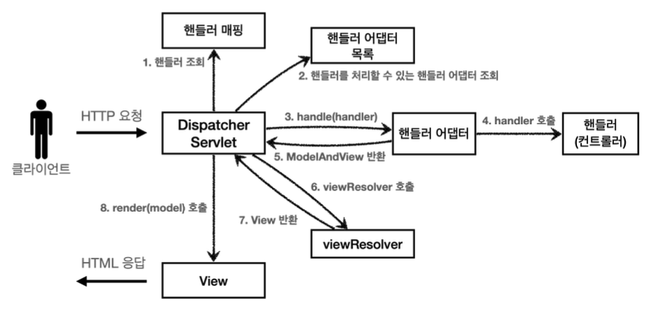
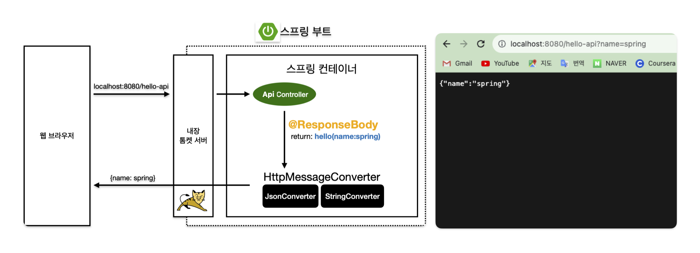
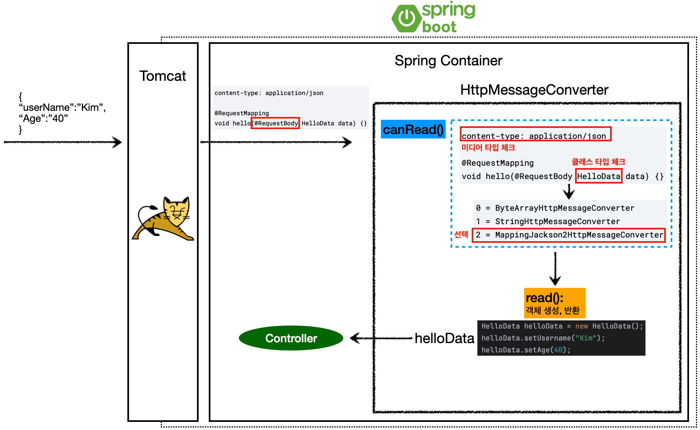
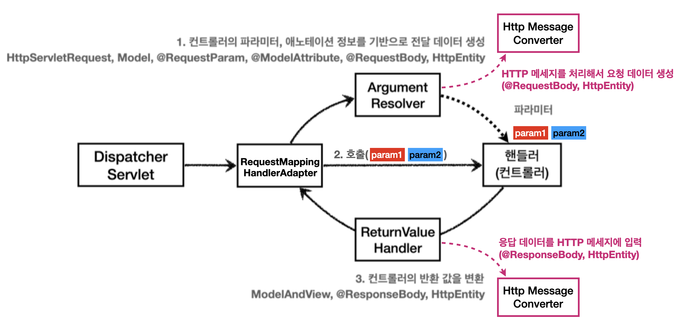

---

## 1. Spring MVC

### 1.1 Spring MVC 구조

우리가 이전까지 구성했던 프레임워크와 스프링 MVC를 비교해보면 구성요소가 같다는 것을 확인할 수 있다. 

명칭은 다음과 같이 대응된다.

* `FrontController` → `DispatcherServlet`
* `handlerMappingMap` → `HandlerMapping`
* `MyHandlerAdapter` → `HandlerAdapter`
* `ModelView` → `ModelAndView`
* `viewResolver` → `ViewResolver`
* `MyView` → `View`

<br>



<p align='center'>Spring MVC</p>

* `DispatcherServlet` : 스프링 MVC의 프론트 컨트롤러
  * `HttpServlet`을 상속 받아서 사용하고, 서블릿으로 동작한다
  * 스프링 부트는 `DispatcherServlet`을 서블릿으로 자동 등록하면서 모든 경로(`urlPatterns="/"`)에 대해 매핑한다


* `DispatcherServlet` 호출 → `HttpServlet`이 제공하는 `service()` 호출 → `FrameworkServlet.service()`를 시작으로 여러 메서드 호출
  * 그 중에서 제일 중요한 것은 `DispatcherServlet.doDispatch()`의 호출이다


<br>

 `DispatcherServlet.doDispatch()`의 코드를 살펴보자.(예외 처리와 인터셉터 기능은 전부 제외했다)

```java
protected void doDispatch(HttpServletRequest request, HttpServletResponse response) throws Exception {
     
    HttpServletRequest processedRequest = request;
    HandlerExecutionChain mappedHandler = null;
    ModelAndView mv = null;
   
    // 1. 핸들러 조회
    mappedHandler = getHandler(processedRequest); 
    if (mappedHandler == null) {
        noHandlerFound(processedRequest, response);
        return; 
    }

    // 2. 핸들러 어댑터 조회 - 핸들러를 처리할 수 있는 어댑터
    HandlerAdapter ha = getHandlerAdapter(mappedHandler.getHandler());

    // 3. 핸들러 어댑터 실행 -> 4. 핸들러 어댑터를 통해 핸들러 실행 -> 5. ModelAndView 반환 
    mv = ha.handle(processedRequest, response, mappedHandler.getHandler());

    processDispatchResult(processedRequest, response, mappedHandler, mv, dispatchException);
}

private void processDispatchResult(HttpServletRequest request, HttpServletResponse response, HandlerExecutionChain mappedHandler, ModelAndView mv, Exception exception) throws Exception {
   	 
    // 뷰 렌더링 호출
    render(mv, request, response);
}

protected void render(ModelAndView mv, HttpServletRequest request, HttpServletResponse response) throws Exception {
   
    View view;
    String viewName = mv.getViewName();

    // 6. 뷰 리졸버를 통해서 뷰 찾기, 7. View 반환
    view = resolveViewName(viewName, mv.getModelInternal(), locale, request);

    // 8. 뷰 렌더링
    view.render(mv.getModelInternal(), request, response);
}
```

<br>

---

#### 1.1.1 HandlerMapping, HandlerAdapter

`HandlerMapping`, `HandlerAdapter`를 더 자세히 살펴보자.

<br>

과게에 사용했었던, 스프링이 제공하는 컨트롤러를 사용해서 이해해보자.

```java
public interface Controller {
    // 과거에 사용했던 컨트롤러
    ModelAndView handleRequest(HttpServletRequest request, HttpServletResponse response) 
    throws Exception;
}
```

<br>

컨트롤러 인터페이스를 사용해서 컨트롤러를 구현해보자.

```java
@Component("/springmvc/old-controller")
public class OldController implements Controller {
   
    @Override
    public ModelAndView handleRequest(HttpServletRequest request, HttpServletResponse response) throws 	       Exception {
        System.out.println("OldController.handleRequest");
        return null;
		} 
}
```

* `/springmvc/old-controller`이라는 이름으로 스프링 빈 등록
* 빈의 이름으로 URL 매핑할 예정

<br>

http://localhost:8080/springmvc/old-controller을 실행해보면 `OldController.handleRequest`의 출력을 확인 할 수 있다.

<br>

그럼 이 컨트롤러의 호출 방법을 살펴보자.

* `HandlerMapping`(핸들러 매핑)
  * 핸들러 매핑에서 이 컨트롤러를 찾을 수 있어야 한다
  * 예) 스프링 빈의 이름으로 핸들러를 찾을 수 있는 핸들러 매핑이 필요하다 → `/springmvc/old-controller`으로 핸들러를 찾을 수 있는 매핑 필요
* `HandlerAdapter`(핸들어 어댑터)
  * 핸들러 매핑을 통해서 찾은 핸들러를 실행할 수 있는 핸들러 어댑터가 필요하다
  * 예) `Controller` 인터페이스를 실행할 수 있는 핸들러 어댑터를 찾고 실행해야 한다

<br>

스프링은 필요한 핸들러 매핑과 어댑터를 대부분 구현해두었다. 스프링 부트는 자동으로 여러가지 `HandlerMapping`과  `HandlerAdapter`를 등록해둔다.

* `HandlerMapping`
  1. `RequestMappingHandlerMapping` : 애노테이션 기반의 컨트롤러인 `@RequestMapping`에서 사용한다
  2. `BeanNameUrlHanlderMapping` : 스프링 빈의 이름으로 핸들러를 찾는다 (위의 예시에서 사용)


* `HandlerAdapter`
  1. `RequestMappingHandlerAdapter` : 애노테이션 기반의 컨트롤러인 `@RequestMapping`에서 사용한다
  2. `HttpRequestHandlerAdapter` : `HttpRequestHandler` 처리
  3. `SimpleControllerHandlerAdapter` : `Controller` 인터페이스 처리(애노테이션X, 과거에 사용, 위의 예시에서 사용) 

<br>

> 개발할 때는 보통 `@RequestMapping`을 사용한다.
>
> * `POST` 요청 : `@PostMapping`
> * `GET` 요청 : `@GetMapping`
{: .prompt-tip }

<br>

---

#### 1.1.2 ViewResolver

뷰 리졸버에 대해서 자세히 알아보자.

<br>

`View`를 사용할 수 있도록 위에서 구현한 `OldController`에 다음 코드를 추가해보자 `return new ModelAndView("new-form");`. `springmvc/old-controller`에 들어가보면 에러 페이지가 나오는 것을 확인 할 수 있다. 

이를 해결하기 위해서 다음 코드를 추가해보자.

<br>

`application.properties`

```java
spring.mvc.view.prefix=/WEB-INF/views/
spring.mvc.view.suffix=.jsp
```

* 스프링 부트는 `InternalResourceViewResolver`라는 뷰 리졸버를 자동으로 등록한다
* `application.properties`에 등록한 `spring.mvc.view.prefix` , `spring.mvc.view.suffix` 설정 정보를 사용해서 등록한다

<br>

스프링 부트가 자동으로 등록하는 `ViewResolver`를 몇 가지 알아보자.

* `BeanNameViewResolver` : 빈 이름으로 뷰를 찾아서 반환한다
* `InternalResourceViewResolver` : JSP를 처리할 수 있는 뷰를 반환한다

<br>

동작 과정을 한번 살펴보자.

1. 핸들러 어댑터 호출
   * 핸들러 어댑터를 통해 `new-form`이라는 뷰의 논리 이름을 획득한다
2. `ViewResolver` 호출
   * `new-form`이라는 뷰 이름으로 `viewResolver`를 순서대로 호출한다
   * `BeanNameViewResolver`는 `new-form`이라는 이름의 스프링 빈으로 등록된 뷰를 찾지만 없다
   * `InternalResourceViewResolver`가 호출
3. `InternalResourceViewResolver`
   * `InternalResourceView` 반환
4. `InternalResourceView` 
   * `InternalResourceView` 는 JSP처럼 포워드 `forward()` 를 호출해서 처리할 수 있는 경우에 사용한다
5. `view.render()` 
   * `view.render()` 가 호출되고 `InternalResourceView` 는 `forward()` 를 사용해서 JSP를 실행한다

<br>

* 다른 뷰는 실제 뷰를 렌더링하지만, JSP의 경우 `forward()`를 통해서 해당 JSP로 이동(실행)해야 렌더링이 된다. JSP를 제외한 나머지 뷰 템플릿들은 `forward()` 과정 없이 바로 렌더링 된다.
* 원래는 Thymeleaf 뷰 템플릿을 사용하면 `ThymeleafViewResolver`를 등록해야 한다. 이제는 라이브러리만 추가하면 스프링 부트가 이런 작업도 모두 자동화해준다.

<br>

---

### 1.2 Spring MVC 사용해보기

이전의 회원 등록 애플리케이션을 스프링 MVC를 이용해서 구현해보자.

스프링이 제공하는 컨트롤러 애노테이션 기반으로 동작하기 때문에, 매우 실용적이다.

<br>

`SpringMemberControllerV2`

```java
/**
 * 클래스 단위 -> 메서드 단위
 * @RequestMapping 클래스 레벨과 메서드 레벨 조합 
 */

@Controller
@RequestMapping("/springmvc/v2/members") // 매핑 URL의 중복을 제거
public class SpringMemberControllerV2 {
   
    private MemberRepository memberRepository = MemberRepository.getInstance();
     
    @RequestMapping("/new-form")
    public ModelAndView newForm() {
        return new ModelAndView("new-form");
		}
  	 
    // 위의 @RequestMapping("/springmvc/v2/members")를 통해서 "/springmvc/v2/members" + "/save"으로 사용
    @RequestMapping("/save")
    public ModelAndView save(HttpServletRequest request, HttpServletResponse response) {
         
        String username = request.getParameter("username");
        int age = Integer.parseInt(request.getParameter("age"));
         
        Member member = new Member(username, age);
        memberRepository.save(member);
         
        ModelAndView mav = new ModelAndView("save-result");
        mav.addObject("member", member); // Model 데이터 추가
         
        return mav;
    }
   	 
    // "/springmvc/v2/members" 자체가 URL
    @RequestMapping
    public ModelAndView members() {
         
        List<Member> members = memberRepository.findAll();
         
        ModelAndView mav = new ModelAndView("members");
        mav.addObject("members", members); 
         
        return mav;
} 
```

* `@Controller`
  * 스프링이 자동으로 스프링 빈으로 등록한다. (내부에 `@Component` 애노테이션이 있어서 컴포넌트 스캔의 대상이 됨)
  * 스프링 MVC에서 애노테이션 기반 컨트롤러로 인식한다


* `@RequestMapping`
  * 요청 정보를 매핑한다
  * 해당 URL이 호출되면 이 메서드가 호출된다
  * 애노테이션을 기반으로 동작하기 때문에, 메서드의 이름은 임의로 지으면 된다


* `ModelAndView`
  * 모델과 뷰 정보를 담아서 반환


* 기존에는 분리되어 있던 컨트롤러 클래스들을 하나로 통합했다
* 클래스 레벨의 `@RequestMapping`를 이용해서 URL의 중복을 제거 할 수 있다
  * 예) 클래스 레벨 : `@RequestMapping("/springmvc/v2/members")` + 메서드 레벨 : `@RequestMapping("/new-form")`

<br>

> * 기존에는 스프링 빈 중에 클래스 레벨에 `@RequestMapping`이 붙어 있었으면 `RequestMappiongHandlerMapping`이 매핑 정보로 인식 했지만, **스프링 3.0 부터 클래스 레벨에 `@RequestMapping`이 붙어 있는 스프링 빈이어도 스프링 컨트롤러로 인식하지 않는다. 무조건 `@Controller`가 붙어 있어야 스프링 컨트롤러로 인식한다.**
>
> * 만약 빌드 옵션을 `IntelliJ IDEA`으로 선택했고, 스프링 부트 3.2 이상이면 `Java compiler` 필드에 `-parameters` 옵션(`IllegalArgumentException` 방지)
{: .prompt-danger }


<br>

---

### 1.3 사용성 개선

지금까지 만들었던 스프링 MVC 컨트롤러의 사용성을 개선해보자.

개선하고 싶은 부분은 다음과 같다.

* `ViewName`을 직접 반환하도록 하고 싶다(뷰의 논리 이름 반환)
* Model 파라미터를 받고 싶다
* HTTP 요청 파라미터를 직접 받고 싶다
* `@RequestMapping` 으로 URL만 매칭하는 것이 아니라, HTTP 메서드도 구분하고 싶다

<br>

개선한 코드를 살펴보자.

`SpringMemberControllerV3`

```java
 /**
  * Model 도입
  * ViewName 직접 반환
  * @RequestParam 사용
  * @RequestMapping -> @GetMapping, @PostMapping
  */

 @Controller
 @RequestMapping("/springmvc/v3/members")
 public class SpringMemberControllerV3 {
     private MemberRepository memberRepository = MemberRepository.getInstance();
     
     // @RequestMapping(value = "/new-form", method = RequestMethod.GET)
     @GetMapping("/new-form")
     public String newForm() {
         return "new-form";
     }
     
     // @RequestMapping(value = "/save", method = RequestMethod.POST)
     @PostMapping("/save")
     public String save(
             @RequestParam("username") String username,
             @RequestParam("age") int age,
             Model model) {
         Member member = new Member(username, age);
         memberRepository.save(member);
         model.addAttribute("member", member);
         return "save-result";
     }
     
     @GetMapping
     public String members(Model model) {
         List<Member> members = memberRepository.findAll();
         model.addAttribute("members", members);
         return "members";
     } 
 }
```

* `ModelAndView`로 반환해도 되고, 뷰 이름으로 그냥 반환해도 된다
* 기존의 `HttpServletRequest request, HttpServletResponse response`를 파라미터를 직접 받도록 할 수 있다
  * 스프링은 HTTP 요청 파라미터를 `@RequestParam` 으로 받을 수 있다
  * `@RequestParam("username")` 은 `request.getParameter("username")` 와 거의 같은 코드라 생각하면 된다
  * 그냥 Model 파라미터를 받고 `model.addAttribute("member", member)` 을 사용해도 된다


* `@RequestMapping` 은 URL만 매칭하는 것이 아니라, HTTP Method도 함께 구분할 수 있도록 할 수 있다
  * 예) 처음에는 `@RequestMapping("/new-form")` → `@RequestMapping(value = "/new-form", method = RequestMethod.GET)` → `@GetMapping("/new-form")`
  * 위에서 볼 수 있듯이, `@GetMapping`, `@PostMapping` 등 으로 더 편리하게 사용할 수 있다
  * `GET`, `POST` 외에도 `PUT`, `DELETE`, `PATCH` 등의 애노테이션도 전부 구현되어 있다

<br>

## 2. Spring MVC - 기능 살펴보기

### 2.1 MappingController

요청 매핑하는 여러 방법에 대해 알아보자.

`MappingController`

```java
@Slf4j
@RestController
public class MappingController {

    /**
     * 1.
     * Spring Boot 3.0 부터는 /hello-basic 과 /hello-basic/은 다르게 취급 ("/"유지)
     * {"/hello-basic", "/hello-basic2"} 으로 다중 URL 설정 가능
     * GET 메서드 허용
     */
    @RequestMapping(value = {"/hello-basic", "/hello-basic2"}, method = RequestMethod.GET)
    public String helloBasic() {
        log.info("hello basic");
        return "OK";
    }

    /**
     * 2.
     * 축약 애노테이션 사용
     * GET 메서드 허용
     */
    @GetMapping("/mapping-get-v2")
    public String mappingGetV2() {
        log.info("mapping-get-v2");
        return "OK";
    }

    /**
     * 3. PathVariable(경로 변수) 사용
     * 변수명이 같으면 생략 가능
     * @PathVariable("userId") String userId -> @PathVariable String userId
     */
    @GetMapping("/mapping/{userId}")
    public String mappingPath(@PathVariable("userId") String data) {
        log.info("mappingPath userId = {} ", data);
        return "OK";
    }

    /**
     * 4. PathVariable 다중 사용
     */
    @GetMapping("/mapping/users/{userId}/orders/{orderId}")
    public String mappingPath(@PathVariable String userId, @PathVariable Long orderId) {
        log.info("mappingPath userId = {}, orderId = {}", userId, orderId);
        return "OK";
    }

    /**
     * 5. Content-Type 헤더 기반 추가 매핑(consumes)
     * consumes : 컨틀로러가 받아들이는 미디어 타입
     * consumes = "application/json"
     * consumes = "!application/json"
     * consumes = "application/*"
     * consumes = "*\/*"
     * application/json 대신 MediaType.APPLICATION_JSON_VALUE 사용 권장
     */
    // content-type이 application/json인 경우에만 호출
    @PostMapping(value = "/mapping-consume", consumes = "application/json")
    public String mappingConsumes() {
        log.info("mappingConsumes");
        return "OK";
    }

    /**
     * 6. Accept 헤더 기반 추가 매핑(produces)
     * produces : 컨트롤러가 만들어내는 미디어 타입
     * produces = "application/json"
     * produces = "!application/json"
     * produces = "application/*"
     * produces = "*\/*"
     */
    @PostMapping(value = "/mapping-produce", consumes = "application/json")
    public String mappingProduces() {
        log.info("mappingProduces");
        return "OK";
    }
}
```

* `@RequestMapping` 은 URL 경로를 템플릿화 할 수 있는데, `@PathVariable` 을 사용하면 매칭되는 부분을 편리하게 조회할 수 있다

<br>

이전에도 사용한 회원 관리 애플리케이션의 HTTP API를 만든다고 가정하고, 매핑을 어떻게 하는지 알아보자. (데이터 넘어가는 부분은 제외)

* 회원 관리 API
  * 회원 목록 조회: `GET` `/users`
  * 회원 등록:        `POST` `/users`
  * 회원 조회:        `GET` `/users/{userId}`
  * 회원 수정:        `PATCH` `/users/{userId}`
  * 회원 삭제:        `DELETE` `/users/{userId}`

<br>

`MappingClassController`

```java
@RestController
@RequestMapping("/mapping/users")
public class MappingClassController {

    @GetMapping // URL을 클래스 레벨의 @RequestMapping("/mapping/users") 이용 (메서드 레벨의 정보와 조합해서 사용)
    public String user() {
        return "get users";
    }

    @PostMapping
    public String addUser() {
        return "post users";
    }

    @GetMapping("/{userId}")
    public String findUser(@PathVariable String userId) {
        return "get userId = "+ userId;
    }

    @PatchMapping("/{userId}")
    public String updateUser(@PathVariable String userId) {
        return "update userId = "+ userId;
    }

    @DeleteMapping("/{userId}")
    public String deleteUser(@PathVariable String userId) {
        return "delete userId = "+ userId;
    }
}
```

<br>

---

### 2.2 HTTP Header 조회

HTTP 헤더 정보를 조회하는 방법에 대해 알아보자.

<br>

`RequestHeaderController`

```java
@Slf4j
@RestController
public class RequestHeaderController {

    @RequestMapping("/headers")
    public String headers(HttpServletRequest request,
                          HttpServletResponse response,
                          HttpMethod httpMethod,
                          Locale locale,
                          @RequestHeader MultiValueMap<String, String> headerMap,
                          @RequestHeader("host") String host, // 헤더를 개별로 조회하고 싶을 때
                          @CookieValue(value = "myCookie", required = false) String cookie) {

        log.info("request={}", request);
        log.info("response={}", response);
        log.info("httpMethod={}", httpMethod);
        log.info("locale={}", locale);
        log.info("headerMap={}", headerMap);
        log.info("header host={}", host);
        log.info("myCookie={}", cookie);

        return "OK";
    }
}
```

* `@RequestHeader MultiValueMap<String, String> headerMap` 
  * 모든 HTTP 헤더를 `MultiValueMap` 형식으로 조회한다
  * `MultiValueMap` : `Map`과 유사하지만, 하나의 키에 여러 값을 받을 수 있다
    * `value`들은 배열 형태로 저장된다


* `@RequestHeader("host") String host`
  * 특정 HTTP 헤더를 조회한다
  * `required` : 필수 값 여부
  * `defaultValue` : 기본 값


* `@CookieValue(value = "myCookie", required = false) String cookie`
  * 특정 쿠키 조회
  * `required` : 필수 값 여부
  * `defaultValue` : 기본 값

<br>

---

### 2.3 HTTP Request Parameter

HTTP 요청 메세지를 통해서 클라이언트에서 서버로 데이터를 전달하는 방법에 대해 알아보자.

들어가기에 앞서, 클라이언트에서 서버로 요청 데이터를 전달할 때 주로 사용하는 3가지 방법을 되짚어보자.

* `GET` - 쿼리 파라미터
  * `/url?username=hello&age=99`
  * 메세지 본문 없이, URL의 쿼리 스트링에 데이터를 포함해서 전달하는 방식
  * 검색, 필터, 정렬, 페이징 등에 많이 사용한다


* `POST` - HTML Form
  * `content-type: application/x-www-form-urlencoded` 
  * 메세지 본문에 쿼리 스트링 형태로 전달을 한다
  * 회원 가입, 상품 주문, HTML 폼 등에 사용


* `POST`, `PUT`, `PATCH` - HTTP 메세지 본문에 데이터를 직접 담아서 요청
  * HTTP API에 주로 사용
  * 데이터 형식은 주로 JSON을 사용

<br>

---

#### 2.3.1 @RequestParam

스프링이 제공하는 `@RequestParam`을 사용하면 요청 파라미터를 편리하게 사용할 수 있다.

<br>

`RequestParamController`

```java
@Slf4j
@Controller
public class RequestParamController {

    // 1. request.getParameter()
    @RequestMapping("/request-param-v1")
    public void requestParamV1(HttpServletRequest request, HttpServletResponse response) throws IOException {
        String username = request.getParameter("username");
        int age = Integer.parseInt(request.getParameter("age"));
        log.info("username = {}, age = {} ", username, age);

        response.getWriter().write("ok");
    }

    // 2. @RequestParam()
    @ResponseBody // 반환 스트링을 그대로 응답 메세지에 넣고 반환, @RestController 대신에 사용 가능
    @RequestMapping("/request-param-v2")
    public String requestParamV2(
            // @RequestParam String username : 파라미터명과 변수명을 같게 하면 생략 가능
            @RequestParam("username") String memberName,
            @RequestParam("age") int memberAge
    ) {
        log.info("username = {}, age = {} ", memberName, memberAge);
        return "ok";
    }

    // 3. @RequestParam() 개선
    // Strint, int, Integer 같은 단순 타입이면 @RequestParam도 생략 가능
    @ResponseBody
    @RequestMapping("/request-param-v3")
    public String requestParamV3(String username, int age) {
        log.info("username = {}, age = {} ", username, age);
        return "ok";
    }

    // 4. @RequestParam - required
    // 파라미터 필수 여부
    // "/request-param-required?username= " -> 빈문자로 통과한다!
    @ResponseBody
    @RequestMapping("/request-param-required")
    public String requestParamRequired(
            // required = true가 디폴트
            // required = true : 파라미터가 무조건 있어야 함
            @RequestParam(required = true) String username,
            // required = false : 파라미터가 없어도 가능
            // int를 사용하고 파라미터 값이 없으면 int에 null이 입력되기 때문에 예외 발생 -> Integer를 사용해야 한다
            @RequestParam(required = false) int age) { // 500 예외 발생
        log.info("username = {}, age = {} ", username, age);
        return "ok";
    }

    // 4. @RequestParam - defaultValue
    // 기본값 설정 - 빈 문자의 경우에도 기본값이 적용된다
    @ResponseBody
    @RequestMapping("/request-param-default")
    public String requestParamDefault(
            // defaultValue를 사용하면 사실 required는 필요가 없음(값이 없으면 무조건 기본값으로 설정되기 때문에)
            @RequestParam(required = true, defaultValue = "guest") String username,
            @RequestParam(required = false, defaultValue = "-1") Integer age) {
        log.info("username = {}, age = {} ", username, age);
        return "ok";
    }

    // 5. @RequestParam - 파라미터를 Map으로 조회하기
    // Map(key=value)
    // MultiValueMap(key=[value1,value2,..])
    @ResponseBody
    @RequestMapping("/request-param-map")
    public String requestParamMap(@RequestParam Map<String, Object> paramMap) {
        log.info("username = {}, age = {} ", paramMap.get("username"), paramMap.get("age"));
        return "ok";
    }
}
```

<br>

---

#### 2.3.2 @ModelAttribute

개발을 하게되면 다음과 같이 요청 파라미터를 받아서 필요한 객체를 만들고 그 객체에 값을 넣어주어야 한다.

```java
@RequestParam String username;
@RequestParam int age;
 
HelloData data = new HelloData();
data.setUsername(username);
data.setAge(age);
```

<br>

스프링은 위의 과정을 `@ModelAttribute`라는 기능을 통해 자동화 시킬 수 있다.

<br>

요청 파라미터를 바인딩 받을 객체 `HelloData`가 있다고 해보자.

`HelloData`

```java
@Data
public class HelloData {
    private String username;
    private int age;
}
```

* `@Data`(Lombok) : `@Getter`, `@Setter` , `@ToString` , `@EqualsAndHashCode` , `@RequiredArgsConstructor` 자동 적용

<br>

```java
// 1. @ModelAttribute 사용
// model.addAttribute(helloData) 도 함께 자동 적용
@ResponseBody
@RequestMapping("/model-attribute-v1")
public String modelAttributeV1(@ModelAttribute HelloData helloData) { // @ModelAttribute를 생략 가능
    log.info("username={}, age={}", helloData.getUsername(), helloData.getAge());
    return "ok";
}
```

* `HelloData` 객체가 생성되고, 요청 파라미터의 값도 모두 들어가 있다

* `@ModelAttribute` 동작

  * `@ModelAttribute`가 있으면 `HelloData` 객체 생성
  * 요청 파라미터의 이름으로 `HelloData` 객체의 프로퍼티를 찾는다
  * 해당 프로퍼티의 setter를 호출해서 파라미터의 값을 입력(바인딩)한다
  * 예) 파라미터 이름이 `username` 이면 `setUsername()` 메서드를 찾아서 호출하면서 값을 입력한다

  

* `@ModelAttribute`가 하는 일 정리

  * 요청 파라미터 처리 : `HelloData` 객체 생성 → 요청 파라미터의 값을 프로퍼티 접근법(setXxx)으로 입력해준다
  * `Model`추가 : 모델에 `@ModelAttribute`로 지정한 객체를 자동으로 넣어준다 → `model.addAttribute` 생략 가능


* `@ModelAttribute`를 생략 가능하다 → `@RequestParam`과 마찬가지로 생략하는 것은 권장하지 않음

<br>

---

### 2.4 HTTP Request Message

HTTP 요청 메세지로 데이터를 전달하는 것을 알아보기 전에 이전에 알아본 내용을 되짚어보자.

* `POST`, `PUT`, `PATCH` - HTTP 메세지 본문에 데이터를 직접 담아서 요청
  * HTTP API에 주로 사용
  * 데이터 형식은 주로 JSON을 사용

<br>

요청 파라미터와 다르게, HTTP 메시지 바디를 통해 데이터가 직접 넘어오는 경우는 `@RequestParam` , `@ModelAttribute` 를 사용할 수 없다.

<br>

---

#### 2.4.1 Text 전달

`RequestBodyStringController`

```java
@Slf4j
@Controller
public class RequestBodyStringController {
    /**
     * 1.
     * Stream은 바이트코드이기 때문에, 문자로 받을 때는 인코딩 방법을 설정해야 한다
     */
    @PostMapping("/request-body-string-v1")
    public void requestBodyStringV1(HttpServletRequest request, HttpServletResponse response) throws IOException {
        ServletInputStream inputStream = request.getInputStream();
        String messageBody = StreamUtils.copyToString(inputStream, StandardCharsets.UTF_8);

        log.info("messageBody = {}", messageBody);
        response.getWriter().write("ok");
    }

    /**
     * 2. 코드 더 단순화
     * InputStream(Reader), OutputStream(Writer) 등을 지원
     */
    @PostMapping("/request-body-string-v2")
    public void requestBodyStringV2(InputStream inputStream, Writer responseWriter) throws IOException {
        String messageBody = StreamUtils.copyToString(inputStream, StandardCharsets.UTF_8);
        log.info("messageBody = {}", messageBody);
        responseWriter.write("ok");
    }

    /**
     * 3. HttpEntity 사용
     * HttpEntity: HTTP header, body 정보를 편리하게 조회
     * - 메시지 바디 정보를 직접 조회(@RequestParam X, @ModelAttribute X)
     * - 요청 파라미터를 조회하는 기능과 관계 없음
     * - HttpMessageConverter 사용 -> StringHttpMessageConverter 적용
     *
     * 응답에서도 HttpEntity 사용 가능
     * - 메시지 바디 정보 직접 반환
     * - view 조회 X
     * - 헤더 정보 포함 가능
     * - HttpMessageConverter 사용 -> StringHttpMessageConverter 적용
     */
    @PostMapping("request-body-string-v3")
    public HttpEntity<String> requestBodyStringV3(HttpEntity<String> httpEntity) {
        String messageBody = httpEntity.getBody();
        log.info("messageBody = {}", messageBody);
        return new HttpEntity<>("ok");
    }

    /**
     * 4. @RequestBody 사용
     *
     * @RequestBody
     * - 메시지 바디 정보를 직접 조회(@RequestParam X, @ModelAttribute X)
     * - HttpMessageConverter 사용 -> StringHttpMessageConverter 적용
     *
     * @ResponseBody
     * - 메시지 바디 정보 직접 반환
     * - view 조회 X
     * - HttpMessageConverter 사용 -> StringHttpMessageConverter 적용
     */
    @ResponseBody
    @PostMapping("/request-body-string-v4")
    public String requestBodyStringV4(@RequestBody String messageBody) {
        log.info("messageBody={}", messageBody);
        return "ok";
    }
}
```

* `@RequestBody`
  * `@RequestBody` 를 사용하면 HTTP 메시지 바디 정보를 편리하게 조회할 수 있다
  * 헤더 정보가 필요하다면 `HttpEntity` 를 사용하거나 `@RequestHeader` 를 사용하면 된다
  * 이렇게 메시지 바디를 직접 조회하는 기능은 요청 파라미터를 조회하는 `@RequestParam` , `@ModelAttribute` 와 전혀 관계가 없다
    * `HttpMessageConverter`가 동작함


* `@ResponseBody` 
  * `@ResponseBody` 를 사용하면 응답 결과를 HTTP 메시지 바디에 직접 담아서 전달할 수 있다
  * view 조회 x

<br>

---

#### 2.4.2 JSON 전달

`RequestBodyJsonController`

```java
@Slf4j
@Controller
public class RequestBodyJsonController {
    /**
     * {"username":"hello", "age":20}
     * content-type: application/json
     */
    private ObjectMapper objectMapper = new ObjectMapper();

    /**
     * 1.
     */
    @PostMapping("/request-body-json-v1")
    public void requestBodyJsonV1(HttpServletRequest request, HttpServletResponse response) throws IOException {
        ServletInputStream inputStream = request.getInputStream();
        String messageBody = StreamUtils.copyToString(inputStream, StandardCharsets.UTF_8);
        log.info("messageBody={}", messageBody);

        HelloData data = objectMapper.readValue(messageBody, HelloData.class);
        log.info("username={}, age={}", data.getUsername(), data.getAge());
        response.getWriter().write("ok");
    }

    /**
     * 2.
     * @RequestBody
     * - HttpMessageConverter 사용 -> StringHttpMessageConverter 적용
     * @ResponseBody
     * - 모든 메서드에 @ResponseBody 적용
     * - 메시지 바디 정보 직접 반환(view 조회X)
     * - HttpMessageConverter 사용 -> StringHttpMessageConverter 적용
     */
    @ResponseBody
    @PostMapping("/request-body-json-v2")
    public String requestBodyJsonV2(@RequestBody String messageBody) throws
            IOException {
        HelloData data = objectMapper.readValue(messageBody, HelloData.class);
        log.info("username={}, age={}", data.getUsername(), data.getAge());
        return "ok";
    }

    /**
     * 3.
     * @RequestBody 생략 불가능(@ModelAttribute가 적용되어 버림)
     * - HttpMessageConverter 사용 -> MappingJackson2HttpMessageConverter (content-type: application/json)
     * - @RequestBody에 직접 만든 객체를 지정할 수 있다
     * - HttpEntity, @RequestBody를 사용하면 HTTP 메시지 컨버터가 HTTP 메시지 바디의 내용을 우리가 원하는 문자나 객체로 변환해준다
     * - HTTP 메시지 컨버터는 문자 뿐만 아니라 JSON도 객체로 변환해준다
     */
    @ResponseBody
    @PostMapping("/request-body-json-v3")
    public String requestBodyJsonV3(@RequestBody HelloData data) {
        log.info("username={}, age={}", data.getUsername(), data.getAge());
        return "ok";
    }

    /**
     * 4.
     * HttpEntity 사용 가능
     */
    @ResponseBody
    @PostMapping("/request-body-json-v4")
    public String requestBodyJsonV4(HttpEntity<HelloData> httpEntity) {
        HelloData data = httpEntity.getBody();
        log.info("username={}, age={}", data.getUsername(), data.getAge());
        return "ok";
    }

    /**
     * 5.
     * @RequestBody 생략 불가능(@ModelAttribute가 적용되어 버림)
     * - HttpMessageConverter 사용 -> MappingJackson2HttpMessageConverter (content-type:application/json)
     * - JSON 요청 -> HTTP 메세지 컨버터 -> 객체
     *
     * @ResponseBody 적용
     * - 메시지 바디 정보 직접 반환(view 조회X)
     * - HttpMessageConverter 사용 -> MappingJackson2HttpMessageConverter 적용(Accept:application/json)
     * - 응답의 경우에도 @ResponseBody를 사용하면 해당 객체를 HTTP 메시지 바디에 직접 넣어줄 수 있다
     * - 이 경우에도 HttpEntity를 사용해도 된다
     * - 객체 -> HTTP 메세지 컨버터 -> JSON 응답
     */
    @ResponseBody
    @PostMapping("/request-body-json-v5")
    public HelloData requestBodyJsonV5(@RequestBody HelloData data) {
        log.info("username={}, age={}", data.getUsername(), data.getAge());
        return data;
    }
}
```

<br>

---

### 2.5 HTTP Response

스프링(서버)에서 응답 데이터를 만드는 방법을 다시 살펴보자.

* 정적 리소스(static resource)
  * 예) 웹 브라우저에 정적인 HTML, CSS, JS를 제공할 때 정적 리소스 사용
* 뷰 템플릿(View Template) 사용
  * 예) 웹 브라우저에 동적인 HTML을 제공할 때는 뷰 템플릿을 사용
* HTTP 메시지 사용
  * HTTP API를 제공하는 경우에는 HTML이 아니라 데이터를 전달해야 하므로, HTTP 메시지 바디에 JSON 같은 형식으로 데이터를 실어 보낸다

<br>

---

#### 2.5.1 Static Resource 제공

스프링 부트는 클래스패스(class path)의 다음 디렉토리에 있는 정적 리소스를 제공한다.

* `/static`, `/public`, `/resources`, `/META-INF/resources`
* `src/main/resources` 는 리소스를 보관하는 곳이고, 또 클래스패스의 시작 경로이다
  * 리소스를 넣어두면 스프링 부트가 정적 리소스로 서비스를 제공한다
* 정적 리소스는 해당 파일을 변경 없이 그대로 서비스하는 것

<br>

---

#### 2.5.2 View Template 사용

뷰 템플릿을 거쳐서 HTML이 생성되고, 뷰가 응답을 만들어서 전달한다. 일반적으로 HTML을 동적으로 생성하는 용도로 사용하지만, 다른 것들도 가능하다.뷰 템플릿이 만들 수 있는 것이라 면 뭐든지 가능하다.

* 스프링 부트 기본 뷰 템플릿 경로 : `src/main/resources/templates`

<br>

뷰 템플릿을 사용하는 간단한 예시를 한번 살펴보자.

<br>

`ResponseViewController` : 뷰 템플릿을 호출하는 컨트롤러

```java 
@Controller
public class ResponseViewController {
   	 
    /**
     * ModelAndView 반환
     */
    @RequestMapping("/response-view-v1")
    public ModelAndView responseViewV1() {
        ModelAndView mav = new ModelAndView("response/hello") 
                .addObject("data", "hello!");
				return mav; 
    }
   		
    /**
     * return "response/hello"; : 뷰의 논리적 이름을 그대로 반환
     * @ResponseBody, @RestController를 사용하면 뷰로 안가고 그냥 문자 그대로 보임
     * @ResponseBody가 없으면 "response/hello"로 뷰 리졸버가 실행되어서 뷰를 찾고 렌더링한다
     * "response/hello" -> "templates/response/hello.html" 실행
     */
    @RequestMapping("/response-view-v2")
    public String responseViewV2(Model model) {
        model.addAttribute("data", "hello!!");
        return "response/
    }
   	 
    /**
     * Void를 반환하는 경우
     * 뷰 이름 생략 - 명시성이 떨어지기 때문에 권장하지 않는다!
     */
    @RequestMapping("/response/hello")
    public void responseViewV3(Model model) {
        model.addAttribute("data", "hello!!");
    }
} 
```

<br>

`templates/response/hello.html`

```html
<!DOCTYPE html>
<html xmlns:th="http://www.thymeleaf.org">
<head>
     <meta charset="UTF-8">
     <title>Title</title>
</head>
<body>
 <p th:text="${data}">empty</p>
</body>
</html>
```

* `Void`를 반환하는 경우
  * `@Controller` 를 사용하고, `HttpServletResponse` , `OutputStream(Writer)` 같은 HTTP 메시지 바디를 처리하는 파라미터가 없으면 요청 URL을 참고해서 논리 뷰 이름으로 사용
    * 요청 URL: `/response/hello`
    * 실행: `templates/response/hello.html`

<br>

---

#### 2.5.3 HTTP 메세지 사용(메세지 바디에 직접 입력)

HTTP API를 제공하는 경우에는 HTML이 아니라 데이터를 전달해야 하므로, HTTP 메시지 바디에 JSON 같은 형식으로 데이터를 실어 보낸다. 참고로 HTML이나 뷰 템플릿을 사용해도 HTTP 응답 메시지 바디에 HTML 데이터가 담겨서 전달된다. 

정적 리소스나 뷰 템플릿을 거치지 않고, 직접 HTTP 응답 메시지를 전달하는 경우를 살펴보자.

<br>

```java
@GetMapping("/response-body-string-v1")
public void responseBodyV1(HttpServletResponse response) throws IOException {
    response.getWriter().write("ok");
}
```

* 서블릿을 직접 다룰 때 처럼 `HttpServletResponse` 객체를 통해서 HTTP 메시지 바디에 직접 `ok` 응답 메시지를 전달한다

<br>

```java
/**
 * HttpEntity, ResponseEntity(Http Status 추가)
 */
@GetMapping("/response-body-string-v2")
public ResponseEntity<String> responseBodyV2() {
    return new ResponseEntity<>("ok", HttpStatus.OK);
}
```

* `ResponseEntity` 엔티티는 `HttpEntity` 를 상속 받았음
  * `HttpEntity`는 HTTP 메시지의 헤더, 바디 정보를 가지고 있다
* `ResponseEntity` 는 여기에 더해서 HTTP 응답 코드를 설정할 수 있다
* `HttpStatus.CREATED` 로 변경하면 201 응답이 나가는 것을 확인할 수 있다

<br>

```java
@ResponseBody
@GetMapping("/response-body-string-v3")
public String responseBodyV3() {
    return "ok";
}
```

* `@ResponseBody` 를 사용하면 view를 사용하지 않고, HTTP 메시지 컨버터를 통해서 HTTP 메시지를 직접 입력할 수 있다
* `ResponseEntity` 도 동일한 방식으로 동작한다

<br>

```java
@GetMapping("/response-body-json-v1")
public ResponseEntity<HelloData> responseBodyJsonV1() {
    HelloData helloData = new HelloData();
    helloData.setUsername("userA");
    helloData.setAge(20);
      
    return new ResponseEntity<>(helloData, HttpStatus.OK);
}
```

* `ResponseEntity` 를 반환한다
* HTTP 메시지 컨버터를 통해서 JSON 형식으로 변환되어서 반환된다

<br>

```java
@ResponseStatus(HttpStatus.OK)
@ResponseBody
@GetMapping("/response-body-json-v2")
public HelloData responseBodyJsonV2() {
    HelloData helloData = new HelloData();
    helloData.setUsername("userA");
    helloData.setAge(20);
      
    return helloData;
}
```

* `ResponseEntity` 는 HTTP 응답 코드를 설정할 수 있는데, `@ResponseBody` 를 사용하면 이런 것을 설정하기 까다롭다
* `@ResponseStatus(HttpStatus.OK)` 애노테이션을 사용하면 응답 코드도 설정할 수 있다
* 프로그램 조건에 따라서 동적으로 변경하려면 `ResponseEntity` 를 사용하면 된다

<br>

> `@Controller`랑 `@ResponseBody` 합쳐 놓은게 `@RestController`
{: .prompt-tip }

<br>

---

### 2.6 HttpMessageConverter

뷰 템플릿으로 HTML을 생성해서 응답하는 것이 아니라, HTTP API처럼 JSON 데이터를 HTTP 메시지 바디에서 직접 읽거나 쓰는 경우 HTTP 메시지 컨버터를 사용하면 편리하다.

<br>

`@ResponseBody`의 사용 원리를 다시 살펴보자. 



<p align='center'>@ResponseBody 원리</p>

* `@ResponseBody` 애노테이션이 붙어 있을 경우 HTTP 응답에 데이터를 그대로 넘기는 것으로 판단
* `ViewResolver` 대신 `HttpMessageConverter`가 동작하게 된다
  * 이 때 반환이 객체인 경우 `JsonConverter`가 동작해서 `json`으로 변환하고 응답으로 준다
    * 객체 처리 : `MappingJackson2HttpMessageConverter`, `gson`
    * 문자 처리 : `StringHttpMessageConverter`
* byte 처리 등등 기타 여러 `HttpMessageConverter`가 기본으로 등록되어 있음

<br>

스프링 MVC는 다음의 경우에 HTTP 메세지 컨버터를 적용한다. HTTP 메세지 컨버터는 요청, 응답 들 다에 사용된다.

* HTTP 요청 : `@RequestBody`, `HttpEntity(RequestEntity)`
* HTTP 응답 : `@ResponseBody`, `HttpEntity(ResponseEntity)`

<br>

스프링 부트는 다양한 메세지 컨버터를 제공한다. 이때 메세지 컨버터는, 대상 클래스 타입과 미디어 타입을 체크해서 사용여부를 결정한다. 조건을을 만족하지 않을 경우 다음 메세지 컨버터로 우선순위가 넘어간다.

```
 0 = ByteArrayHttpMessageConverter
 1 = StringHttpMessageConverter
 2 = MappingJackson2HttpMessageConverter
```

* `ByteArrayHttpMessageConverter` : `byte[]` 데이터를 처리한다
  * 클래스 타입: `byte[]` , 미디어타입: `*/*` 
  * 요청 예) `@RequestBody byte[] data`
  * 응답 예) `@ResponseBody return byte[]` 쓰기 미디어타입 `application/octet-stream`


* `StringHttpMessageConverter` : `String` 문자로 데이터를 처리한다.
  * 클래스 타입: `String` , 미디어타입: `*/*`
  * 요청 예) `@RequestBody String data`
  * 응답 예) `@ResponseBody return "ok"` 쓰기 미디어타입 `text/plain`


* `MappingJackson2HttpMessageConverter` : `application/json`
  * 클래스 타입: 객체 또는 `HashMap` , 미디어타입 `application/json` 관련
  * 요청 예) `@RequestBody HelloData data`
  * 응답 예) `@ResponseBody return helloData` 쓰기 미디어타입 `application/json` 관련

<br>



<p align='center'>HttpMessageConverter</p>

* **HTTP 요청 데이터 읽기**
  * HTTP 요청이 오고, 컨트롤러에서 `@RequestBody` 또는  `HttpEntity` 파라미터를 사용한다
  * 메세지 컨버터가 메시지를 읽을 수 있는지 확인하기 위해 `canRead()` 를 호출한다
    * `canRead()`는 대상 클래스 타입을 지원하는지 확인
      * 예) `@RequestBody` 의 대상 클래스 ( `byte[]` , `String` , `HelloData` )
    * HTTP 요청의 Content-Type 미디어 타입을 지원하는지 확인
      * 예) `text/plain` , `application/json` , `*/*`
  * `canRead()` 조건을 만족하면 `read()` 를 호출해서 객체 생성하고, 반환한다

<br>

* **HTTP 응답 데이터 생성**
  * 컨트롤러에서 `@ResponseBody` 또는 `HttpEntity` 로 값이 반환된다
  * 메시지 컨버터가 메시지를 쓸 수 있는지 확인하기 위해 `canWrite()` 를 호출한다
    * `canWrite()`는 대상 클래스 타입을 지원하는지 확인
      * 예) return의 대상 클래스 ( `byte[]` , `String` , `HelloData` )
    * HTTP 요청의 Accept 미디어 타입을 지원하는가.(더 정확히는 `@RequestMapping` 의 `produces` )
      * 예) `text/plain` , `application/json` , `*/*`
  * `canWrite()` 조건을 만족하면 `write()` 를 호출해서 HTTP 응답 메시지 바디에 데이터를 생성한다

<br>

---

### 2.7 RequestMappingHandlerAdapter

요청 매핑 핸들러 어댑터(`RequestMappingHandlerAdapter`)의 동작 방식을 알아보자.

<br>



<p align='center'>RequestMappingHandlerAdapter</p>

* `ArgumentResolver`
  * 애노테이션 기반의 컨트롤러는 매우 다양한 파라미터를 사용할 수 있었다
  * `HttpServletRequest` , `Model` 은 물론이고 `@RequestParam` , `@ModelAttribute` 같은 애노테이션 그리고`@RequestBody` , `HttpEntity` 같은 HTTP 메시지를 처리하는 부분까지 매우 큰 유연함을 보여주었다
  * 이렇게 파라미터를 유연하게 처리할 수 있는 이유가 바로 `ArgumentResolver` 덕분
  * 애노테이션 기반 컨트롤러를 처리하는 `RequestMappingHandlerAdapter` 는 바로 이 `ArgumentResolver` 를 호출해서 컨트롤러(핸들러)가 필요로 하는 다양한 파라미터의 값(객체)을 생성한다
  * 파리미터의 값이 모두 준비되면 컨트롤러를 호출하면서 값을 넘겨준다


* `ReturnValueHandler`
  * `HandlerMethodReturnValueHandler` 를 줄여서 `ReturnValueHandler` 라 부른다
  * `ArgumentResolver` 와 비슷한데, 이것은 응답 값을 변환하고 처리한다
  * 컨트롤러에서 String으로 뷰 이름을 반환해도, 동작하는 이유가 바로 `ReturnValueHandler` 덕분

<br>

* HTTP 메시지 컨버터를 사용하는 `@RequestBody` 도 컨트롤러가 필요로 하는 파라미터의 값에 사용된다
  * 요청의 경우 `@RequestBody` 를 처리하는 `ArgumentResolver` 가 있고, `HttpEntity` 를 처리하는 `ArgumentResolver` 가 있다
  * `ArgumentResolver` 들이 HTTP 메시지 컨버터를 사용해서 필요한 객체를 생성 하는 것이다


* `@ResponseBody` 의 경우도 컨트롤러의 반환 값을 이용한다
  * 응답의 경우 `@ResponseBody` 와 `HttpEntity` 를 처리하는 `ReturnValueHandler` 가 있다
  * 여기에서 HTTP 메시지 컨버터를 호출해서 응답 결과를 만든다


* `@RequestBody` 또는 `@ResponseBody` → `RequestResponseBodyMethodProcessor()` 사용
* `HttpEntity` → `HttpEntityMethodProcessor()` 사용

<br>

---

## Reference

1. [스프링 MVC - 백엔드 웹 개발 핵심 기술](https://www.inflearn.com/course/%EC%8A%A4%ED%94%84%EB%A7%81-mvc-1)
2. [Udemy - Spring Boot 3, Spring 6 & Hibernate](https://www.udemy.com/course/spring-hibernate-tutorial/?couponCode=ST8MT40924)
