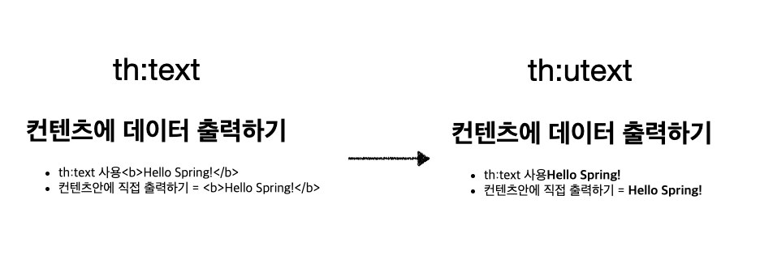
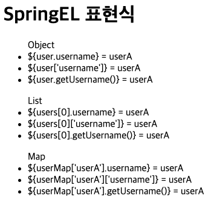
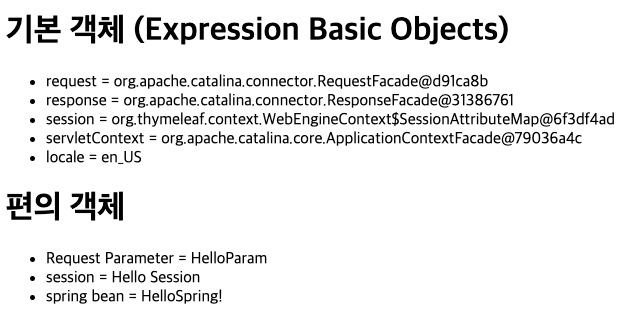
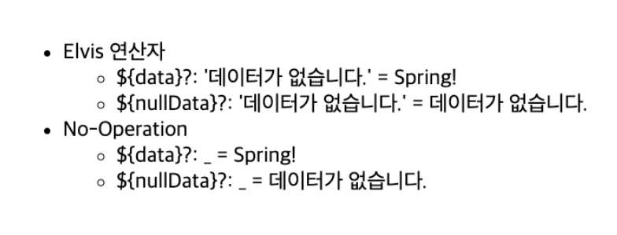
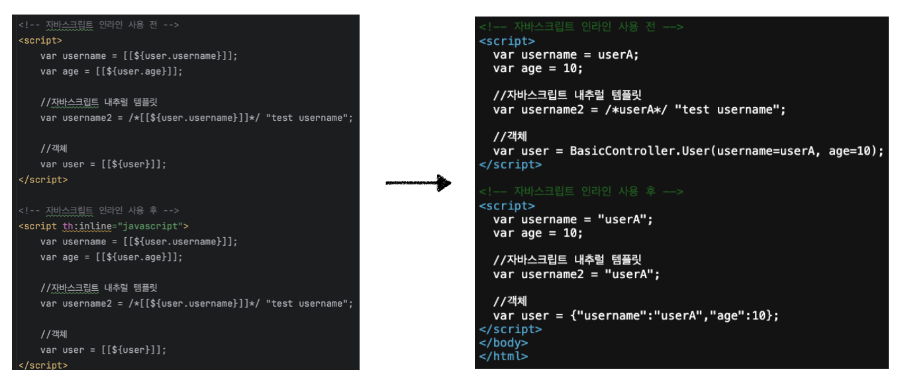
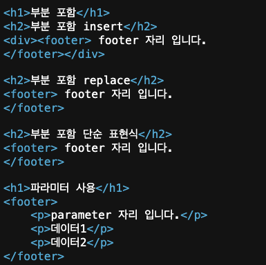
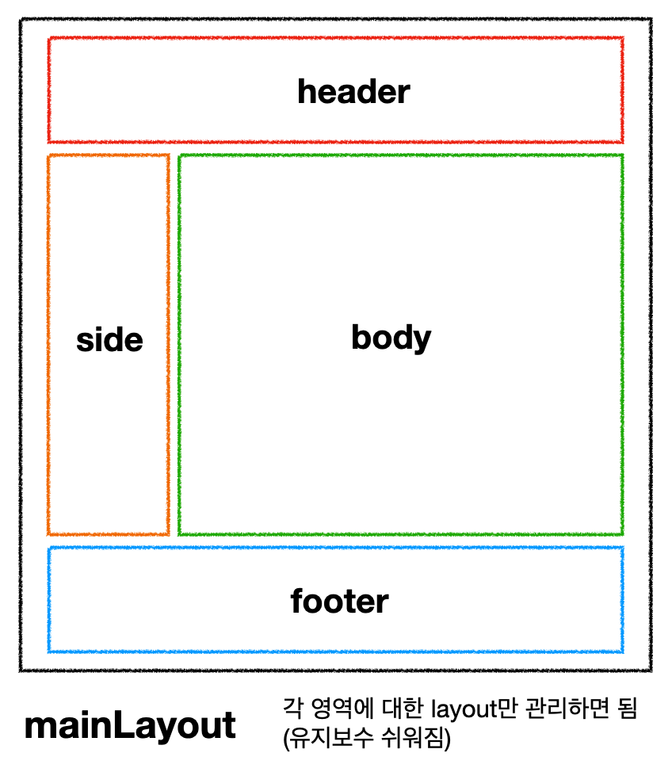

---

<br>

이전 포스트에서 상품 관리 페이지를 만들면서 타임리프를 사용해봤다. 이번 포스트에서는 타임리프의 여러가지 기본 기능들을 소개할 것이다.

<br>

## 1. 타임리프 속성 변경(th:속성)

이전 포스트에서도 설명한 타임리프 속성으로 변경되는 기능이다.

<br>

```html
<link href="../css/bootstrap.min.css" th:href="@{/css/bootstrap.min.css}" rel="stylesheet">
```

* `th:href="@{/css/bootstrap.min.css}"`
  * `href="value1"` 을 `th:href="value2"` 의 값으로 변경한다
  * 타임리프 뷰 템플릿을 거치게 되면 원래 값을 `th:xxx` 값으로 변경한다. 만약 값이 없다면 새로 생성한다.
  * HTML을 그대로 볼 때는 `href` 속성이 사용되고, 뷰 템플릿을 거치면 `th:href`의 값이 `href`로 대체되면서 동적으로 변경할 수 있다
  * 대부분의 HTML 속성을 `th:xxx` 로 변경할 수 있다


* URL 링크 표현식 :  `th:href="@{/css/bootstrap.min.css}"`
  * `@{}` : 타임리프는 URL 링크를 사용하는 경우 `@{}` 를 사용한다. 이것을 URL 링크 표현식이라 한다.
  * URL 링크 표현식을 사용하면 서블릿 컨텍스트를 자동으로 포함한다

<br>

---

## 2. 텍스트 출력(text, utext)

### 2.1 text

텍스트를 출력하는 기능을 알아보자.

<br>

타임리프는 기본적으로 HTML 태그의 속성에 기능을 정의해서 동작한다.

* 예시) `<span th:text="${data}">` : HTML 컨텐츠에 데이터를 출력할 때 `th:text`를 이용하면 됨

<br>

태그 속성이 아니라, HTML 컨텐츠 영역안에서 직접 데이터를 출력하고 싶으면 다음과 같이 사용하면 된다.

* `[[${data}]]`

<br>

코드로 직접 사용해보자. 컨트롤러를 하나 생성해보자.

```java
@Controller
@RequestMapping("/basic")
public class BasicController {

    @GetMapping("text-basic")
    public String textBasic(Model model) {
        model.addAttribute("data", "Hello Spring!");
        return "basic/text-basic";
    }
}
```

<br>

`text-basic.html`

```html
<!DOCTYPE html>
<html xmlns:th="http://www.thymeleaf.org">
<head>
    <meta charset="UTF-8">
    <title>Title</title>
</head>
<body>

<h1>컨텐츠에 데이터 출력하기</h1>
<ul>
  <li>th:text 사용<span th:text="${data}"></span></li>
  <li>컨텐츠안에 직접 출력하기 = [[${data}]]</li>
</ul>

</body>
</html>
```

* `<span th:text="${data}"></span>`
* `[[${data}]]`
  *  둘다 `Hello Spring!`를 출력한다

<br>

---

### 2.2 utext

웹 브라우저는 `<`를 HTML 태그의 시작으로 인식한다. 따라서 `<`를 태그의 시작이 아니라 문자로 표현할 수 있는 방법이 필요한데, 이것을 HTML 엔티티라 한다. 그리고 이렇게 HTML에서 사용하는 특수 문자를 HTML 엔티티로 변경하는 것을 이스케이프(escape)라고 한다. 

타임리프가 제공하는 `th:text` , `[[]]` 는 **기본적으로 이스케이프를 제공**한다.

이스케이프를 사용하지 않기 위해서는 `th:utext` 또는 `[()]` 처럼 사용하면 된다.

<br>

`data`가 `Hello Spring!`이 아니라  `Hello <b>Spring!</b>`이라고 해보자. 

```java
@GetMapping("text-basic")
public String textBasic(Model model) {
    model.addAttribute("data", "<b>Hello Spring!</b>");
    return "basic/text-basic";
}
```

<br>

```html
<ul>
  <li>th:text 사용<span th:utext="${data}"></span></li>
  <li>컨텐츠안에 직접 출력하기 = [(${data})]</li>
</ul>
```




_이스케이프 기능 사용하지 않기_

* 문제 발생을 방지하기 위해서 기본적으로 이스케이프 처리를 하는 것이 좋다
* 필요할 때만 `utext` 사용

<br>

---

## 3. SpringEL

### 3.1 변수 표현식 사용해보기

타임리프에서 변수를 사용할 때 변수 표현식을 사용한다.

* 예) `${data}`

<br>

이 변수 표현식에는 스프링 EL이라는 스프링이 제공하는 표현식을 사용할 수 있다.

코드로 살펴보자. 먼저 컨트롤러를 추가해보자.

```java
@GetMapping("/variable")
public String variable(Model model) {
    User userA = new User("userA", 20);
    User userB = new User("userB", 30);

    List<User> list = new ArrayList<>();
    list.add(userA);
    list.add(userB);

    Map<String, User> map = new HashMap<>();
    map.put("userA", userA);
    map.put("userB", userB);

    model.addAttribute("user", userA);
    model.addAttribute("users", list);
    model.addAttribute("userMap", map);

    return "basic/variable";
}

@Data
static class User {
    private String username;
    private int age;

    public User(String username, int age) {
        this.username = username;
        this.age = age;
    }
}
```

<br>

```html
<h1>SpringEL 표현식</h1>

<ul>Object
  <li>${user.username} = <span th:text="${user.username}"></span></li>
  <li>${user['username']} = <span th:text="${user['username']}"></span></li>
  <li>${user.getUsername()} = <span th:text="${user.getUsername()}"></span></li>
</ul>

<ul>List
  <li>${users[0].username}    = <span th:text="${users[0].username}"></span></li>
  <li>${users[0]['username']} = <span th:text="${users[0]['username']}"></span></li>
  <li>${users[0].getUsername()} = <span th:text="${users[0].getUsername()}"></span></li>
</ul>

<ul>Map
  <li>${userMap['userA'].username} =  <span th:text="${userMap['userA'].username}"></span></li>
  <li>${userMap['userA']['username']} = <span th:text="${userMap['userA']['username']}"></span></li>
  <li>${userMap['userA'].getUsername()} = <span th:text="${userMap['userA'].getUsername()}"></span></li>
</ul>
```

* `user.username` 
  * `user`의 `username`을 프로퍼티 접근 → `user.getUsername()`

* `user['username']`
  * `user.username`와 같음 → `user.getUsername()`


<br>



_Spring EL 결과_

<br>

---

### 3.2 타임리프 지역변수

타임리프 안에서도 `th:with`를 통해서 지역 변수 선언이 가능하다. 지역 변수는 선언한 태그 안에서만 사용할 수 있다.

<br>

```html 
<h1>지역 변수 - (th:with)</h1>
<div th:with="first=${users[0]}">
	<p>처음 사람의 이름은 <span th:text="${first.username}"></span></p>
</div>
```

* 해당 `div` 태그 안에서만 선언한 지역변수를 사용할 수 있다

<br>

---

## 4. 기본 객체

타임리프의 기본 객체들에 대해서 알아보자. 타임리프는 다음과 같은 기본 객체들을 제공한다.

* `${#request}`
* `${#response}`
* `${#session}`
* `${#servletContext}`
* `${#locale}`

<br>

코드로 살펴보자.

```java
@GetMapping("/basic-objects")
public String basicObjects(Model model, HttpServletRequest request, HttpServletResponse response, 
                           HttpSession session) {
    session.setAttribute("sessionData", "Hello Session");
    model.addAttribute("request", request);
    model.addAttribute("response", response);
    model.addAttribute("servletContext", request.getServletContext());
    return "basic/basic-objects";
}

@Component("helloBean")
static class HelloBean {
    public String hello(String data) {
        return "Hello" + data;
    }
}
```

* 스프링 부트 3.0 부터는 `${#request}` , `${#response}` , `${#session}` , `${#servletContext}` 를 지원하지 않는다
* 스프링 부트 3.0 부터는 직접 `model`에 해당 객체를 추가해서 사용해야 한다

<br>

```html
<h1>식 기본 객체 (Expression Basic Objects)</h1> <ul>
  <li>request = <span th:text="${request}"></span></li>
  <li>response = <span th:text="${response}"></span></li>
  <li>session = <span th:text="${session}"></span></li>
  <li>servletContext = <span th:text="${servletContext}"></span></li>
  <li>locale = <span th:text="${#locale}"></span></li>
</ul>

<h1>편의 객체</h1> <ul>
  <li>Request Parameter = <span th:text="${param.paramData}"></span></li>
  <li>session = <span th:text="${session.sessionData}"></span></li>
  <li>spring bean = <span th:text="${@helloBean.hello('Spring!')}"></span></li> </ul>
```

* 편리하게 요청 파라미터, 빈, 세션 등에 접근할 수 있게 편의 객체를 지원한다
* `${param.paramData}` : 요청 파라미터 접근
* `${session.sessionData}` : 세션 접근
* `${@helloBean.hello('Spring!')}` : 스프링 빈 접근, `helloBean`이라는 빈을 접근해서 `hello('Spring!')` 호출

<br>



_타임리프 기본 객체, 편의 객체_

<br>

---

## 5. 유틸리티 객체

타임리프는 문자, 숫자, 날짜, URI 등을 편리하게 다룰수 있게 해주는 유틸리티 객체들을 제공한다.

* 공식 문서 참고
  * [https://www.thymeleaf.org/doc/tutorials/3.0/usingthymeleaf.html#expression-utility-objects](https://www.thymeleaf.org/doc/tutorials/3.0/usingthymeleaf.html#expression-utility-objects)
  * [https://www.thymeleaf.org/doc/tutorials/3.0/usingthymeleaf.html#appendix-b-expression-utility-objects](https://www.thymeleaf.org/doc/tutorials/3.0/usingthymeleaf.html#appendix-b-expression-utility-objects)

<br>

객체들을 살펴보자.

* `#message` : 메세지, 국제화 처리
* `#uris` : URI 이스케이프 지원
* `#dates` : `java.util.date` 서식 지원
* `#calendars` : `java.util.Calendar` 서식 지원
* `#temporals` : Java8 날짜 서식 지원
* `#numbers` : 숫자 서식 지원
* `#strings` : 문자 관련 기능
* `#objects` : 객체 관령 기능
* `#bools` : 불린(boolean) 관련 기능
* `#arrays` : 배열 관련 기능
* `#lists`, `#sets`, `#maps` : 컬렉션 관련 기능 
* `#ids` : 아이디 처리 관련 기능

<br>

---

## 6. URL 링크 표현식

타임리프에서 URL 링크를 사용하는 방법에 대해서 알아보자.

타임리프에서는 URL을 생성할 때 `@{}` 처럼 사용하면 된다. 코드로 알아보자.

<br>

```java
@GetMapping("/link")
public String link(Model model) {
    model.addAttribute("param1", "data1");
    model.addAttribute("param2", "data2");
    return "basic/link";
}
```

<br>

```html
<h1>URL 링크</h1> 
<ul>
    <li><a th:href="@{/hello}">basic url</a></li>
    <li><a th:href="@{/hello(param1=${param1}, param2=${param2})}">hello query param</a></li>
    <li><a th:href="@{/hello/{param1}/{param2}(param1=${param1}, param2=${param2})}">path variable</a></li>
    <li><a th:href="@{/hello/{param1}(param1=${param1}, param2=${param2})}">path variable + query parameter</a></li>
</ul>
```

* **단순한 URL**
  * `@{/hello}` → `/hello`


* **쿼리 파라미터(query parameter)**
  * `@{/hello(param1=${param1}, param2=${param2})}` → `/hello?param1=data1&param2=data2``
  * ``()`에 있는 부분은 쿼리 파라미터로 처리된다


* **경로 변수(path variable)**
  * `@{/hello/{param1}/{param2}(param1=${param1}, param2=${param2})}` → `/hello/data1/data2`
  * URL 경로상에 변수가 있으면 `()` 부분은 경로 변수로 처리된다


* **경로 변수 + 쿼리 파라미터**
  * `@{/hello/{param1}(param1=${param1}, param2=${param2})}` → `/hello/data1?param2=data2`
  * 경로 변수와 쿼리 파라미터를 함께 사용할 수 있다


* **상대 경로, 절대 경로, 프로토콜 기준 표현도 가능**
  * `/hello` : 절대 경로
  * `hello` : 상대 경로

<br>

---

## 7. 리터럴 대체

타임리프에서는 문자, 표현식, 등은 분리되어 있기 때문에 원래는 `+`로 더해서 사용해야 한다. 리터럴 대체를 사용하면 이를 편리하게 처리할 수 있다.

<br>

```html
<li>리터럴 대체 |hello ${data}| = <span th:text="|hello ${data}|"></span></li>
```

* 작은 따옴표의 사용없이 편하게 사용할 수 있다.
* `<span th:text="|hello ${data}|">` → `hello Spring!`

<br>

---

## 8. 연산

타임리프 안에서의 연산에 대해서 알아보자. 타임리프에서의 산술, 비교, 삼항식 연산은 자바와 비슷하다.

타임리프의 Elvis 연산자와 No-operation에 대해서 알아보자.

<br>

```java
@GetMapping("/operation")
public String operation(Model model) {
    model.addAttribute("nullData", null);
    model.addAttribute("data", "Spring!");
    return "basic/operation";
}
```

<br>

```html
<li>Elvis 연산자 
   <ul>
    <li>${data}?: '데이터가 없습니다.' = <span th:text="${data}?: '데이터가 없습니다.'"></span></li>
    <li>${nullData}?: '데이터가 없습니다.' = <span th:text="${nullData}?: '데이터가 없습니다.'"></span></li>
  </ul> 
 </li>
    
 <li>No-Operation
   <ul>
     <li>${data}?: _ = <span th:text="${data}?: _">데이터가 없습니다.</span></li>
     <li>${nullData}?: _ = <span th:text="${nullData}?: _">데이터가 없습니다.</span></li>
   </ul> 
 </li>
```

* **Elvis 연산자**
  * 자바의 삼항 연산자의 편의 버전
  * `{data}?: '데이터가 없습니다.'` 
    * `data`가 `null`이면 `데이터가 없습니다.` 선택
    * `null` 아니면 `data`선택
  


* **No-operation**
  * `_` 인 경우 마치 타임리프가 실행되지 않는 것 처럼 동작한다
  * 이것을 잘 사용하면 HTML의 내용을 그대로 활용할 수 있다. 마지막 예를 보면 `데이터가 없습니다.` 부분이 그대로 출력된다.
  * `nullData` → `_` 선택 → `데이터가 없습니다.`출력
  

<br>



_Elvis, No-operation_

<br>

---

## 9. 속성값 설정

타임리프는 주로 HTML 태그에 `th:*` 속성을 지정하는 방식으로 동작한다. `th:*`로 속성을 적용하면 기존 속성을 대체한다. 기존 속성이 없으면 새로 만든다.

쉽게 말하자면 `th:*` 속성을 지정하면 타임리프는 기존 속성을 `th:*`로 지정한 속성으로 대체한다. 기존 속성이 없다면 새로 만든다.

* 예) `<input type="text" name="mock" th:name="userA" />` → 타임리프 렌더링 후 :  `<input type="text" name="userA" />`

<br>

코드로 살펴보자.

```java
@GetMapping("/attribute")
public String attribute() {
    return "basic/attribute";
}
```

<br>

```html
<h1>속성 설정</h1>
<input type="text" name="mock" th:name="userA" />

<h1>속성 추가</h1>
- th:attrappend = <input type="text" class="text" th:attrappend="class=' large'" /><br/>
- th:attrprepend = <input type="text" class="text" th:attrprepend="class='large '" /><br/>
- th:classappend = <input type="text" class="text" th:classappend="large" /><br/>

<h1>checked 처리</h1>
- checked o <input type="checkbox" name="active" th:checked="true" /><br/>
- checked x <input type="checkbox" name="active" th:checked="false" /><br/> 
- checked=false <input type="checkbox" name="active" checked="false" /><br/>
```

* `th:attrappend` : 속성 값의 뒤에 값을 추가한다
* `th:attrprepend` : 속성 값의 앞에 값을 추가한다
* `th:classappend` : class 속성에 자연스럽게 추가한다


* `checked` 처리
  * HTML에서는 `<input type="checkbox" name="active" checked="false" />`의 경우에도, `checked` 속성이 있기 때문에 체크박스에 `checked` 처리가 되어버린다
  * HTML에서 `checked` 속성은 `checked` 속성의 값과 상관없이 `checked` 라는 속성만 있어도 체크가 된다. 이런 부분이 `true` , `false` 값을 주로 사용하는 개발자 입장에서는 불편하다
  * 타임리프의 `th:checked`는 값이 `false`인 경우 `checked` 속성 자체를 제거한다
  * `<input type="checkbox" name="active" th:checked="false" />` → 타임리프 렌더링 후 : `<input type="checkbox" name="active" />`

<br>


<p align='center'>Attribute 값 설정</p>

<br>

---

## 10. 반복(loop)

타임리프에서의 반복에 대해서 알아보자.

타임리프에서 반복은 `th:each`를 사용하면 된다. 반복에서 사용할 수 있는 여러 상태값도 지원한다. 코드로 알아보자.

<br>

```java
@GetMapping("/each")
public String each(Model model) {
    addUsers(model);
    return "basic/each";
}

private void addUsers(Model model) {
    List<User> list = new ArrayList<>();
    list.add(new User("userA", 10));
    list.add(new User("userB", 20));
    list.add(new User("userC", 30));
    model.addAttribute("users", list);
}
```

<br>

```html
<h1>기본 테이블</h1> 
<table border="1">
    <tr>
        <th>username</th>
        <th>age</th>
    </tr>
    <tr th:each="user : ${users}">
        <td th:text="${user.username}">username</td>
        <td th:text="${user.age}">0</td>
    </tr>
</table>

<h1>반복 상태 유지</h1>
    <table border="1">
        <tr>
            <th>count</th>
            <th>username</th>
            <th>age</th>
            <th>etc</th>
        </tr>
        <tr th:each="user, userStat : ${users}">
            <td th:text="${userStat.count}">username</td>
            <td th:text="${user.username}">username</td>
            <td th:text="${user.age}">0</td>
            <td>
              index = <span th:text="${userStat.index}"></span>
              count = <span th:text="${userStat.count}"></span>
              size = <span th:text="${userStat.size}"></span>
              even? = <span th:text="${userStat.even}"></span>
              odd? = <span th:text="${userStat.odd}"></span>
              first? = <span th:text="${userStat.first}"></span>
              last? = <span th:text="${userStat.last}"></span>
              current = <span th:text="${userStat.current}"></span>
            </td> 
        </tr>
    </table>
```

* `<tr th:each="user : ${users}">`
  * 반복시 오른쪽 컬렉션(`${users}`)의 값을 하나씩 꺼내서 왼쪽 변수(`user`)에 담아서 태그를 반복 실행한다
  * `th:each`는 `List` 뿐만 아니라 배열, `java.util.Iterable` , `java.util.Enumeration`을 구현한 모든 객체를 반복에 사용할 수 있다
  * `Map`도 사용할 수 있는데 이 경우 변수에 담기는 값은 `Map.Entry`이다


* 반복 상태 : `<tr th:each="user, userStat : ${users}">`
  * 반복의 두 번째 파라미터(`userStat`)를 설정해서 반복의 상태를 확인 할 수 있다
  * 두번째 파라미터는 생략이 가능한데, 생략하면 지정한 변수명(`user`) + `Stat` 를 사용하면 된다

<br>


<p align='center'>반복</p>

<br>

---

## 11. 조건부

바로 코드로 알아보자.

```java
@GetMapping("/condition")
public String condition(Model model) {
    addUsers(model);
    return "basic/condition";
}
```

<br>

```html
<h1>if, unless</h1>
<table border="1">
    <tr>
        <th>count</th>
        <th>username</th>
        <th>age</th>
    </tr>
    <tr th:each="user, userStat : ${users}">
        <td th:text="${userStat.count}">1</td>
        <td th:text="${user.username}">username</td>
        <td>
            <span th:text="${user.age}">0</span>
            <span th:text="'미성년자'" th:if="${user.age lt 20}"></span>
            <span th:text="'미성년자'" th:unless="${user.age ge 20}"></span>
        </td>
    </tr>
</table>
<h1>switch</h1>
<table border="1">
    <tr>
        <th>count</th>
        <th>username</th>
        <th>age</th>
    </tr>
    <tr th:each="user, userStat : ${users}">
        <td th:text="${userStat.count}">1</td>
        <td th:text="${user.username}">username</td>
        <td th:switch="${user.age}">
            <span th:case="10">10살</span>
            <span th:case="20">20살</span>
            <span th:case="*">기타</span>
        </td>
    </tr>
</table>
```

* `if`, `unless`
  * 타임리프는 해당 조건이 맞지 않으면 태그 자체를 렌더링하지 않는다
  * 조건이 `false`인 경우 `<span>...<span>` 부분 자체가 렌더링 되지 않고 사라진다
  * `<span th:text="'미성년자'" th:if="${user.age lt 20}"></span>` → `userA`는 10살이기 때문에 만족, `unless`도 만족


* `switch`
  * `*`는 만족하는 조건이 없을 때 사용하는 디폴트이다

<br>


<br>

---

## 12. 주석

주석을 사용 해보자.

```html
<h1>1. 표준 HTML 주석</h1>
<!--
<span th:text="${data}">html data</span> 
-->

<h1>2. 타임리프 파서 주석(Thymeleaf parser-level comment)</h1> 
<!--/* [[${data}]] */-->

<!--/*-->
<span th:text="${data}">html data</span>
<!--*/-->

<h1>3. 타임리프 프로토타입 주석</h1>
<!--/*/
<span th:text="${data}">html data</span> 
/*/-->
```

<br>

결과를 살펴보면 다음과 같이 나온다.

```html
<h1>예시</h1> 
<span>Spring!</span>

<h1>1. 표준 HTML 주석</h1>
<!--
<span th:text="${data}">html data</span>
-->

<h1>2. 타임리프 파서 주석</h1>

<h1>3. 타임리프 프로토타입 주석</h1>
<span>Spring!</span>
```

* **표준 HTML 주석**
  * 자바스크립트의 표준 HTML 주석은 타임리프가 렌더링 하지 않고, 그대로 남겨둔다


* **타임리프 파서 주석(parser-level comment)**
  * 타임리프 파서 주석은 타임리프의 진짜 주석이다
  * 렌더링에서 주석 부분을 제거한다


* **타임리프 프로토타입 주석**
  * HTML 주석에 약간의 구문을 더했다
  * HTML 파일을 웹 브라우저에서 그대로 열어보면 HTML 주석이기 때문에 이 부분을 웹 브라우저는 렌더링하지 않는다
  * 타임리프 렌더링을 거치면 이 부분이 정상 렌더링 된다 → HTML 파일을 그대로 열어보면 주석처리가 되지만, 타임리프를 렌더링 한 경우에 보인다

<br>

---

## 13. `th:block`

타임리프 블록에 대해서 알아보자.

`<th:block>`는 타임리프의 유일한 자체 태그이다.

<br>


<p align='center'>th:block</p>

* 대충 봐도 사용법을 알 수 있다

<br>

---

## 14. 자바스크립트 인라인

타임리프에서 자바스크립트를 이용할 수 있는 자바스크립트 인라인 기능을 살펴보자.

<br>

### 14.1` <script th:inline="javascript">`

다음과 같이 사용하면 된다. `<script th:inline="javascript">`. 코드로 알아보자.

<br>

```java
@GetMapping("/javascript")
public String javascript(Model model) {
    model.addAttribute("user", new User("userA", 10));
    addUsers(model);

    return "basic/javascript";
}
```

<br>

```html
<!-- 자바스크립트 인라인 사용 전 -->
<script>
  var username = [[${user.username}]];
  var age = [[${user.age}]];

  //자바스크립트 내추럴 템플릿
  var username2 = /*[[${user.username}]]*/ "test username";

  //객체
  var user = [[${user}]];
</script>

<!-- 자바스크립트 인라인 사용 후 -->
<script th:inline="javascript">
  var username = [[${user.username}]];
  var age = [[${user.age}]];

  //자바스크립트 내추럴 템플릿
  var username2 = /*[[${user.username}]]*/ "test username";

  //객체
  var user = [[${user}]];
</script>
```

* `var username = [[${user.username}]];`
  * 인라인 사용 전 : `var username = userA;`
  * 인라인 사용 후 : `var username = "userA";`


* 인라인 사용 전 렌더링 결과를 보면 `userA`라는 변수 이름이 그대로 남아있다. 타임리프 입장에서는 정확하게 렌더링 한 것이지만, 개발자가 기대한 것은 다음과 같은 `"userA"`라는 문자일 것이다. 결과적으로 `userA`가 변수명으로 사용되어서 자바스크립트 오류가 발생한다


* 인라인 사용후 렌더링 결과를 보면 문자 타입인 경우 `"` 를 포함 해준다. 추가로 자바스크립트 에서 문제가 될수있는 문자가 포함되어 있으면 이스케이프 처리도 해준다
  * 예) `"` → `/"`


* `var username2 = /*[[${user.username}]]*/ "test username";`
  * 인라인 사용 전 : `var username2 = /*userA*/ "test username";`
  * 인라인 사용 후 : `var username2 = "userA";`
    * 인라인 사용 후 결과를 보면 주석 부분이 제거되고, 기대한 `"userA"`가 정확하게 적용된다

<br>



<p align='center'>Javascript inline</p>

* 객체
  * 타임리프의 자바스크립트 인라인 기능을 사용하면 객체를 JSON으로 자동으로 변환해준다


* `var user = [[${user}]];`
  * 인라인 사용 전 : `var user = BasicController.User(username=userA, age=10);`
  * 인라인 사용 후 : `var user = {"username":"userA","age":10};` 
    * 객체를 JSON으로 변환해준것을 확인할 수 있다

<br>

---

### 14.2 자바스크립트 인라인 each

자바스크립트 인라인에서 지원하는 `each`를 사용해보자.

```html
<!-- 자바스크립트 인라인 each --> '
<script th:inline="javascript">
     [# th:each="user, stat : ${users}"]
     var user[[${stat.count}]] = [[${user}]];
     [/]
</script>
```

<br>*결과

```html
<script>
    var user1 = {"username":"userA","age":10};
    var user2 = {"username":"userB","age":20};
    var user3 = {"username":"userC","age":30};
</script>
```

<br>

---

## 15. 템플릿 조각, 레이아웃 (Template Fragment, Layout)

웹 페이지를 개발할 때는 공통 영역이 많이 존재한다. 예를 들어서 상단 영역이나 하단 영역, 좌측 카테고리 등 여러 페이지에서 함께 사용하는 영역들이 있다. 이런 부분의 코드를 반복적으로 복사해서 사용할 때, 변경이 필요한 경우 여러 페이지를 다 수정해야 해서 상당히 비효율적이다.

이런 문제를 해결하기 위해서 타임리프는 템플릿 조각과 레이아웃 기능을 지원한다.

<br>

### 15.1 템플릿 조각(Template Fragment)

코드를 통해 알아보자.

<br>

`TemplateController`

```java
@Controller
@RequestMapping("/template")
public class TemplateController {
    @GetMapping("/fragment")
    public String template() {
        return "template/fragment/fragmentMain";
    }
}
```

<br>

```templates/template/fragment/footer.html```

```html
<html xmlns:th="http://www.thymeleaf.org">
<body>

<footer th:fragment="copy"> footer 자리 입니다.
</footer>

<footer th:fragment="copyParam (param1, param2)">
    <p>parameter 자리 입니다.</p>
    <p th:text="${param1}"></p>
    <p th:text="${param2}"></p>
</footer>
</body>
</html>
```

* `footer`는 다른 타임리프에서 불러서 사용할 템플릿 조각을 포함한다

<br>

`templates/template/fragment/fragmentMain.html`

```html
<html xmlns:th="http://www.thymeleaf.org">
<head>
  <meta charset="UTF-8">
  <title>Title</title>
</head>
<body>

<h1>부분 포함</h1>
<h2>부분 포함 insert</h2>
<!-- footer의 copy를 불러옴-->
<div th:insert="~{template/fragment/footer :: copy}"></div>

<h2>부분 포함 replace</h2>
<div th:replace="~{template/fragment/footer :: copy}"></div>

<h2>부분 포함 단순 표현식</h2>
<div th:replace="template/fragment/footer :: copy"></div>

<h1>파라미터 사용</h1>
<!-- footer의 copyParam을 불러옴-->
<div th:replace="~{template/fragment/footer :: copyParam ('데이터1', '데이터2')}"></div> 

</body>
</html>
```

* `template/fragment/footer :: copy` : `footer`템플릿에 있는 `th:fragment="copy"`라는 부분을 템플릿 조각으로 가져와서 사용한다는 의미이다
* `th:insert`는 내부에 삽입 (`div` 태그를 내부에 추가)
* `th:replace`는 대체 (`div` 태그를 대체 해버림)
* `~{...}` 를 사용하는 것이 원칙이지만 템플릿 조각을 사용하는 코드가 단순하면 이 부분을 생략 가능


* `<div th:replace="~{template/fragment/footer :: copyParam ('데이터1', '데이터2')}"></ div>` 처럼 파라미터를 전달해서 조각을 동적으로 렌더링할 수 있다

<br>



<p align='center'>Template Fragment</p>

<br>

---

### 15.2 레이아웃(layout)

이전에는 일부 코드 조각을 가져와서 사용했다면, 이번에는 코드 조각을 레이아웃에 넘겨서 사용하는 방법에 대해서 알아보자.

예를 들어서 `<head>` 에 공통으로 사용하는 `css` , `javascript` 같은 정보들이 있는데, 이러한 공통 정보들을 한 곳에 모아둔 다음에, 각 페이지마다 필요한 정보를 더 추가해서 사용하고 싶다면 다음과 같이 사용하면 된다.

<br>

```java
@GetMapping("/layout")
public String layout() {
    return "template/layout/layoutMain";
}
```

<br>

`/templates/template/layout/base.html`

```html
<html xmlns:th="http://www.thymeleaf.org">
<head th:fragment="common_header(title,links)">

    <title th:replace="${title}">레이아웃 타이틀</title>

    <!-- 공통 -->
    <link rel="stylesheet" type="text/css" media="all" th:href="@{/css/awesomeapp.css}">
    <link rel="shortcut icon" th:href="@{/images/favicon.ico}">
    <script type="text/javascript" th:src="@{/sh/scripts/codebase.js}"></script>

    <!-- 추가 -->
    <th:block th:replace="${links}" />
</head>
```

<br>

`/templates/template/layout/layoutMain.html`

```html
<!DOCTYPE html>
<html xmlns:th="http://www.thymeleaf.org">
<head th:replace="template/layout/base :: common_header(~{::title},~{::link})">
    <title>메인 타이틀</title>
    <link rel="stylesheet" th:href="@{/css/bootstrap.min.css}">
    <link rel="stylesheet" th:href="@{/themes/smoothness/jquery-ui.css}">
</head>
<body> 메인 컨텐츠 </body>
</html>
```

* `common_header(~{::title},~{::link})`
  * `::title` 은 현재 페이지의 title 태그들을 전달한다 → 메인 타이틀이 전달한 부분으로 교체됨
  * `::link` 는 현재 페이지의 link 태그들을 전달한다 → 공통 부분은 그대로 유지되고, 추가 부분에 전달한 `<link>`들이 포함된 것을 확인 가능

<br>

---

### 15.3 레이아웃을  `<html>` 전체로 확장

이번에는 `<head>`에만 적용하는 것이 아니라 `<html>` 전체에 적용해보자.

```java
@GetMapping("/layoutExtend")
public String layoutExtends() {
    return "template/layoutExtend/layoutExtendMain";
}
```

<br>

`/templates/template/layoutExtend/layoutFile.html`

```html
<!DOCTYPE html>
<html th:fragment="layout (title, content)" xmlns:th="http://www.thymeleaf.org">
<head>
    <title th:replace="${title}">레이아웃 타이틀</title>
</head>
<body>
    <h1>레이아웃 H1</h1>
    <div th:replace="${content}">
        <p>레이아웃 컨텐츠</p>
    </div>
    <footer>
        레이아웃 푸터
    </footer>
</body>
</html>
```

<br>

`/templates/template/layoutExtend/layoutExtendMain.html`

```html
<!DOCTYPE html>
<html th:replace="~{template/layoutExtend/layoutFile :: layout(~{::title},~{::section})}"
      xmlns:th="http://www.thymeleaf.org">
<head>
    <title>메인 페이지 타이틀</title>
</head>
<body>
    <section>
        <p>메인 페이지 컨텐츠</p>
        <div>메인 페이지 포함 내용</div>
    </section>
</body>
</html>
```

<br>


<p align='center'>Layout</p>

<br>



<p align='center'>Layout</p>

<br>