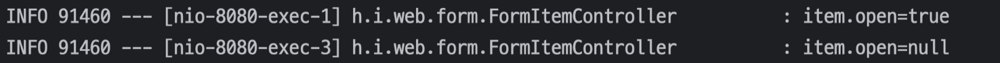
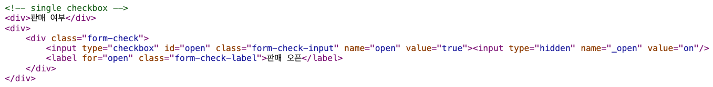
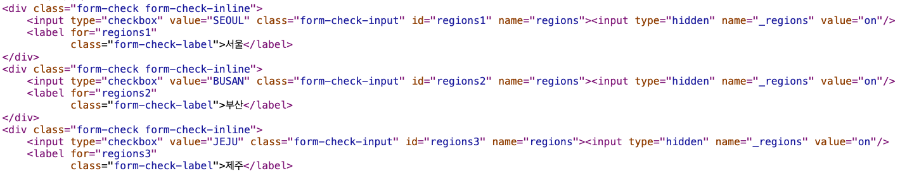

---

## 1. 타임리프 스프링 통합

타임리프는 스프링 없이도 동작하지만, 스프링과 통합을 위한 다양한 기능을 편리하게 제공한다.

타임리프 스프링 통합 메뉴얼 : [https://www.thymeleaf.org/doc/tutorials/3.0/thymeleafspring.html](https://www.thymeleaf.org/doc/tutorials/3.0/thymeleafspring.html)

다음은 스프링 통합으로 추가되는 기능들이다.

* 스프링 EL 문법 통합
* `${@myBean.doSomething()}` 처럼 스프링 빈 호출 지원
* :star:**편리한 폼 관리를 위한 추가 속성**
  * `th:object`
  * `th:field`, `th:errors`, `th:errorclass`

* 체크박스, 라디오 버튼, 리스트 등을 편리하게 사용할 수 있는 기능 지원
* 스프링의 메세지, 국제화 기능의 편리한 통합
* 스프링의 검증, 오류 처리 통합
* 스프링의 `ConversionService` 통합

<br>

> 스프링 부트가 제공하는 타임리프 설정 : [https://docs.spring.io/spring-boot/docs/current/reference/html/appendix-application-properties.html#common-application-properties-templating](https://docs.spring.io/spring-boot/docs/current/reference/html/appendix-application-properties.html#common-application-properties-templating)
{: .prompt-tip }

<br>

---

## 2. 입력 폼(Form) 처리

타임리프가 제공하는 입력 폼 기능을 적용해서 폼 기능을 적용하지 않은 폼 코드를 개선해보자.

사용할 기능에 대한 설명부터 보자.

* `th:object`
  * 사용할 객체를 지정한다


* `*{}`
  * 선택 변수 식
  * `th:object`에서 선택한 객체에 접근한다
  


* `th:field`
  * HTML 태그의 `id` , `name` , `value` 속성을 자동으로 처리해준다

<br>

코드로 살펴보자.

```java
@GetMapping("/add")
public String addForm(Model model) {
    model.addAttribute("item", new Item());
    return "form/addForm";
}
```

* `th:object`를 적용하려면 먼저 해당 오브젝트 정보를 넘겨주어야 한다
* 등록 폼이기 때문에 데이터가 비어있는 빈 오브젝트를 만들어서 뷰에 전달한다

<br>

```html
<form action="item.html" th:action th:object="${item}" method="post">
	  <div>
  	    <label for="itemName">상품명</label>
        <input type="text" id="itemName" 
               th:field="*{itemName}" 
               class="form-control" placeholder="이름을 입력하세요">
    </div>
    <div>
        <label for="price">가격</label>
        <input type="text" id="price" 
               th:field="*{price}" 
               class="form-control" placeholder="가격을 입력하세요">
    </div>
    <div>
        <label for="quantity">수량</label>
        <input type="text" id="quantity" 
               th:field="*{quantity}" 
               class="form-control" placeholder="수량을 입력하세요">
    </div>
</form>
```

* `th:object="${item}"` : `<form>` 에서 사용할 객체를 지정한다


* `th:field="*{itemName}"`
  * `*{itemName}`이라는 선택 변수식을 사용했는데, `${item.itemName}`과 같다
  * 선택 변수 식(`*{}`)을 적용할 수 있는 이유는 앞서 `th:object`로 `item` 을 선택했기 때문이다


* `th:field`는 `id` , `name` , `value` 속성을 모두 자동으로 만들어준다
  * `id`는 `th:field`에서 지정한 변수 이름과 같다
    * `id="itemName"`
    * `id` 속성을 제거해도 `th:field`가 자동으로 만들어준다(위 예제에서는 그냥 추가해서 사용했다)
  * `name`은 `th:field`에서 지정한 변수 이름과 같다
    * `name="itemName"`
  * `value`는 `th:field`에서 지정한 변수의 값을 사용한다
    * `value`를 생략 가능

<br>

렌더링 전후 모습을 살펴보자.

```html
<!--1. 렌더링 전-->
<input type="text" id="itemName" th:field="*{itemName}" class="form-control" placeholder="이름을 입력하세요">

<!--1. 렌더링 후-->
<input type="text" id="itemName" class="form-control" placeholder="이름을 입력하세요" name="itemName" value="">
```

<br>

정리하자면 `th:object`, `th:field`를 사용해서 많은 편리함을 얻었다.

<br>

---

## 3. 단일 체크박스(Single Checkbox)

### 3.1 순수 HTML로 구현

상품등록을 위한 폼에 다음과 같은 단일 체크박스를 만든다고 하자.

<br>


체크박스의 체크 여부에 대한 정보가 상품을 등록할 때 같이 서버로 전송되어야 한다

<br>

타임리프를 사용하기 전에 단순 HTML을 사용해서 구현하는 경우를 살펴보자.

```html
<hr class="my-4">

<!-- single checkbox -->
<div>판매 여부</div> 
<div>
    <div class="form-check">
        <input type="checkbox" id="open" name="open" class="form-check-input"> 
        <label for="open" class="form-check-label">판매 오픈</label>
    </div>
</div>
```

<br>

상품 등록을 위한 컨트롤러는 다음과 같다.

```java
@PostMapping("/add")
public String addItem(@ModelAttribute Item item, RedirectAttributes redirectAttributes) {
    
    // 체크박스의 체크 여부 로깅
    log.info("item.open={}", item.getOpen());

    Item savedItem = itemRepository.save(item);
    redirectAttributes.addAttribute("itemId", savedItem.getId());
    redirectAttributes.addAttribute("status", true);
    return "redirect:/form/items/{itemId}";
}
```

* `log.info("item.open={}", item.getOpen());`으로 체크박스의 체크 여부에 대한 정보가 잘 넘어오는지 로깅한다

<br>

이제 체크박스를 체크한 상태와 체크하지 않은 상태의 로그를 확인해보자.

<br>



* 체크 박스를 체크하는 경우 HTML 폼에서 `open=on`이라는 값이 넘어간다. 이때 스프링은 `on`을 `true`로 변환해준다
* 체크 박스를 체크하는 경우 정상적으로 `true`가 로깅되는 모습을 볼 수 있다
* 문제는 체크 박스를 체크하지 않고 폼을 전송하는 경우 `open`이라는 필드 자체가 전송되지 않아서 `null`로 표시된다

<br>

---

### 3.2 히든 필드 사용

`null`로 표시되는 경우를 위해서 `null`을 처리하기 위한 로직을 따로 구현하는 것 보다는, 그냥 처음부터 명확하게 `true`나 `false`로 처리하는 것이 더 깔끔하다. 

스프링에서는 이름 문제를 해결하기 위해서 다음 기능을 제공한다. 

히든 필드를 하나 만들고 체크박스 `name` 앞에 `_`를 붙여서 전송하면 체크를 해제하고 폼을 보내는 경우에도 인식할 수 있다. HTML로 살펴보면 다음과 같다.

```html
<!-- single checkbox -->
<div>판매 여부</div> 
<div>
    <div class="form-check">
        <input type="checkbox" id="open" name="open" class="form-check-input"> 
        <input type="hidden" name="_open" value="on"/> <!-- 히든 필드 추가 --> 
        <label for="open" class="form-check-label">판매 오픈</label>
    </div>
</div>
```

* 체크 해제를 인식하기 위한 히든 필드 : `<input type="hidden" name="_open" value="on"/>`
* 체크를 해제해서 폼을 보내는 경우, `open`은 전송되지 않지만, 히든 필드의 `_open`은 전송된다. 이 경우 스프링 MVC는 체크를 해제했다고 판단한다.
* 체크를 해제하지 않고 보내는 경우 `open`에 값이 있는 것을 확인하고 사용한다. `_open`은 무시된다.

<br>

로그를 확인해보면 정상적으로 체크 박스 체크 여부에 대해 `true`, `false`가 처리되는 것을 볼 수 있다.

<br>

> HTTP 요청 메세지 로깅을 확인하고 싶으면 `logging.level.org.apache.coyote.http11=trace`로 `application.properties`나 `yml`에 추가한다.
{: .prompt-tip }

<br>

---

### 3.2 타임리프 사용

타임리프의 기능을 사용하는 경우 일일이 히든필드를 추가할 필요가 없다. 바로 타임리프를 추가한 HTML 코드를 살펴보자.

```html
<!-- single checkbox -->
<div>판매 여부</div> 
<div>
     <div class="form-check">
         <input type="checkbox" id="open" th:field="*{open}" class="form-check-input">
				 <label for="open" class="form-check-label">판매 오픈</label>
     </div>
</div>
```

* `th:field="${item.open}"`를 사용하면 히든 필드, `id`, `name` 전부 생략 가능하다
  * 위의 경우`item`을 생략한  `*{open}`을 사용하는데 그 이유는 `th:object="${item}"`을 사용하기 때문이다


<br>

한번 체크 박스를 체크 해보고 HTML이 어떻게 생겼는지 *페이지 소스 보기*를 통해서 확인해보자.

<br>



_타임리프 기능 적용_

확인해보면 `<input type="hidden" name="_open" value="on"/>`이 생성되어 있는 것을 확인할 수 있다. 타임리프 가능을 사용하면, 타임리프가 히든 필드 부분을 알아서 생성을 해주는 것이다. 

<br>

참고로 상품 상세 페이지 처럼 정보만 확인하는 페이지에서는 체크박스나 라디오 같은 요소를 비활성화 시키고 싶은 경우 `disabled`을 추가하면 된다.

```html
<input type="checkbox" id="open"
       th:field="${item.open}"
       class="form-check-input" 
       disabled> <!-- disabled 추가 -->
```

<br>

---

## 4. 멀티 체크박스(Multi Checkbox)

### 4.1 `model.addAttribute()` 사용

다음 처럼 다중으로 체크박스를 추가해서 여러개를 선택할 수 있도록 해보자.

<br>


_멀티 체크박스_

<br>

그러면 멀티 체크박스를 사용하기 위해서 컨트롤러를 수정해보자.

```java
@GetMapping("/add")
public String addForm(Model model) {
    model.addAttribute("item", new Item());
  
    Map<String, String> regions = new LinkedHashMap<>(); // LinkedHashMap은 순서를 보장하기 위해서 사용
    regions.put("Seoul", "서울");
    regions.put("Busan", "부산");
    regions.put("Jeju", "제주");
    model.addAttribute("regions", regions);
  
    return "form/addForm";
}
```

<br>

위 처럼 구현하는 경우에는 한가지 문제가 있다. 등록 폼, 상세화면, 수정 폼에서 모두 서울, 부산, 제주라는 체크 박스를 반복해서 보여주어야 한다. 이렇게 하려면 각각의 컨트롤러에서`model.addAttribute()`을 사용해서 체크 박스를 구성하는 데이터를 반복해서 넣어주어야 한다. 이는 상당히 귀찮다.

이를 해결하기 위해서 스프링은 `@ModelAttribute`라는 기능을 제공한다.

<br>

> 기존에 사용하던 그 `ModelAttribute`랑은 완전히 다른 기능임!
{: .prompt-warning }

<br>

---

### 4.2 `@ModelAttribute` 사용

이번에는`@ModelAttribute`를 사용해보자.

먼저 반복적으로 처리할 내용을 다음과 같이 별도의 메서드로 구성해놓자. `@ModelAttribute`는 컨트롤러에 있는 별도의 메서드에 적용할 수 있다.

```java
@ModelAttribute("regions")
public Map<String, String> regions() {
	  Map<String, String> regions = new LinkedHashMap<>(); 
    regions.put("SEOUL", "서울");
	  regions.put("BUSAN", "부산");
	  regions.put("JEJU", "제주");
	  return regions;
}
```

* 이 처럼 `@ModelAttribute`을 사용하게 되면, 해당 컨트롤러를 요청할 때 `regions`에서 반환한 값이 자동으로 모델에 담기게 된다
* 물론, 이런식으로 구현하는 것이 필수는 아니다. 이전 처럼 각각의 컨트롤러 메서드에서 `model.addAttribute()`를 이용해서 모델에 직접 데이터를 담아서 처리해도 된다.

<br>

---

### 4.3 타임리프 구현 : `id` 자동 생성

HTML에 타임리프를 이용해서 멀티 체크박스 기능을 구현하자.

```html
<!-- multi checkbox -->
<div>
	  <div>등록 지역</div>
	  <div th:each="region : ${regions}" class="form-check form-check-inline">
		  <input type="checkbox" th:field="*{regions}" th:value="${region.key}" class="form-check-input">
		  <label th:for="${#ids.prev('regions')}" th:text="${region.value}" class="form-check-label">서울</label>
    </div>
</div>
```

* `th:for="${#ids.prev('regions')}"`
  * 멀티 체크박스는 같은 이름의 여러 체크박스를 만들 수 있다
  * 문제는 이렇게 반복해서 HTML 태그를 생성할 때, 생성된 HTML 태그 속성에서 `name` 은 같아도 되지만, `id` 는 모두 달라야 한다
  * 타임리프는 체크박스를 `each` 루프 안에서 반복해서 만들 때 임의로 `1` ,`2` ,`3` 숫자를 뒤에 붙여준다

<br>

*페이지 소스 보기*로 결과 HTML을 확인해보자.

<br>



* `id` 뒤에 자동으로 숫자가 붙여서 나오는 것을 확인할 수 있다
* `id`가 타임리프에 의해 동적으로 만들어지기 때문에 `<label for="id_value">` 처럼 `id` 값을 임의로 지정하는 것은 곤란하다
  * 타임리프는 `ids.prev()`, `id.next()` 등을 제공해서 동적으로 생성되는 `id`값을 사용할 수 있도록 한다

<br>

---

## 5. 라디오 버튼(Radio Button)

라디오 버튼은 여러 선택지 중 하나를 선택하기 위해서 사용한다.

열거형(`enum`)을 사용해서 라디오 버튼을 구현해보자. `ItemType`이라는 `enum`에는 `도서`, `음식`, `기타`가 존재한다고 해보자.

<br>


<br>

---

### 5.1 `@ModelAttribute` 사용

컨트롤러에 이전에 사용한 `@ModelAttribute`를 사용해보자.

```java
@ModelAttribute("itemTypes")
public ItemType[] itemTypes() {
    return ItemType.values();
}
```

* `ItemType.values()`를 반환하면 해당 `enum`의 모든 정보를 배열로 반환하게 된다
  * 예) `[BOOK, FOOD, ETC]`

<br>

---

### 5.2 타임리프 구현 : 모델에 담아서 사용

라디오 기능을 위한 타임리프를 구현해보자.

```html
<!-- radio button -->
<div>
    <div>상품 종류</div>
    <div th:each="type : ${itemTypes}" class="form-check form-check-inline">
        <input type="radio" th:field="*{itemType}" th:value="${type.name()}" class="form-check-input">
        <label th:for="${#ids.prev('itemType')}" th:text="${type.description}" class="form-check-label">
            BOOK
        </label>
    </div>
</div>
```

* 라디오 버튼의 경우 이미 선택이 되어 있다면, 수정하는 경우에도 항상 하나를 선택하도록 되어 있다

<br>

---

### 5.3 타임리프 구현 : 직접 `enum`에 접근해서 사용

모델에 `enum`을 담아서 전달하는 방식을 사용하는 것이 아니라, 타임리프가 직접 자바 객체에 접근해서 사용하는 방법도 존재한다.

```html
<div th:each="type : ${T(hello.itemservice.domain.item.ItemType).values()}">
```

<br>

> 이 방법은 권장하지 않는다
{: .prompt-danger }

<br>

---

## 6. 선택 박스(Select Box)

선택 박스는 여러 선택지 중에 하나를 선택할 때 사용한다. 배송 방식(빠른, 일반, 느린) 중 하나를 선택할 수 있도록 선택 박스를 구현해보자.

<br>


<br>

---

### 6.1 `@ModelAttribute` 사용

자바 객체를 이용하는 방법으로 선택 박스를 구현해보자.

먼저 컨트롤러에 다음 코드를 사용할 것이다.

```java
@ModelAttribute("deliveryCodes")
public List<DeliveryCode> deliveryCodes() {
    List<DeliveryCode> deliveryCodes = new ArrayList<>();
    deliveryCodes.add(new DeliveryCode("FAST", "빠른 배송")); 
    deliveryCodes.add(new DeliveryCode("NORMAL", "일반 배송")); 
    deliveryCodes.add(new DeliveryCode("SLOW", "느린 배송")); 
    return deliveryCodes;
}
```

* `DeliveryCode`라는 자바 객체를 사용
* 이 경우도 위와 이전 멀티 체크박스, 라디오와 마찬가지로 `@ModelAttribute`를 사용한다

<br>

> `@ModelAttributes`의 `deliveryCodes()`는 컨트롤러가 호출될 때 마다 사용되기 때문에, 내부의 객체 생성 로직이 있으므로 객체도 그 때 마다 계속 생성된다. 이런 점을 유의해서 미리 객체를 생성해놓고 사용하는 방식을 적용하는 것이 더 효율적일 수 있다.
{: .prompt-warning }

<br>

---

### 6.2 타임리프 구현

타임리프를 적용한 HTML 코드를 살펴보자.

```html
<!-- SELECT -->
<div>
    <div>배송 방식</div>
    <select th:field="*{deliveryCode}" class="form-select">
        <option value="">==배송 방식 선택==</option>
        <option th:each="deliveryCode : ${deliveryCodes}" th:value="${deliveryCode.code}"
                th:text="${deliveryCode.displayName}">FAST</option>
    </select>
</div>
```

<br>

---

## Reference

1. [인프런 - 김영한 : 스프링 완전 정복](https://www.inflearn.com/roadmaps/373)
