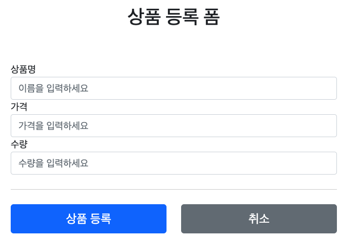
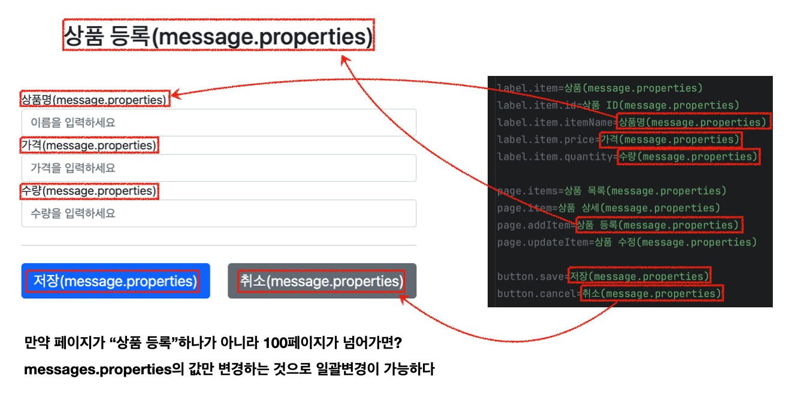
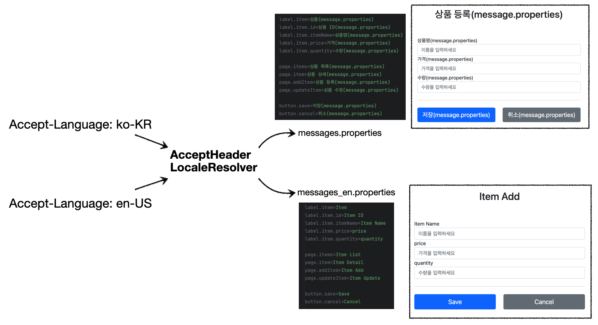

---

> 들어가기 전에 [타임리프(Thymeleaf)의 기본적인 기능들]()을 알아보고 가자.
{: .prompt-warning }

<br>

## 1. 메세지, 국제화 소개 (Messages, Internationalization)

### 1.1 메세지(Messages)

만약 우리가 구성한 페이지의 "상품명"이라는 단어를 모두 "상품이름"으로 변경하고 싶다면 어떻게 해야할까? "상품명"을 포함해서 가격, 수량, 확인 등의 단어를 모든 label을 일일이 찾아가면서 변경하는 것은 어렵고 비효율적이다. 그 이유는 해당 단어들이 HTML 파일에 전부 하드코딩 되어 있기 때문이다.

이런 문제를 해결하기 위해서 메세지 기능을 제공한다. 간단히 설명하자면, `messages.properties`라는 메세지 관리용 파일을 하나 만들고, 변경 가능성이 있는 데이터를 key 값으로 불러서 사용하는 것이다.

<br>

`messages.properties`

```properties
item=상품
item.id=상품 ID
item.itemName=상품명
item.price=가격
item.quantity=수량
```

* `<label for="itemName" th:text="#{item.itemName}"></label>`
* `<label for="itemName" th:text="#{item.price}"></label>`
* 만약 기존의 **"상품명"**을 **"상품 이름"**으로 변경하고 싶으면 단순히 `item.itemName=상품 이름`으로 변경하면 된다

<br>

---

### 1.2 국제화(Internationalization)

국제화는 메세지 파일(`messages.properties`)을 나라별로 별도도 관리해서 페이지(서비스)를 국제화 할 수 있다.

만약 한국어, 영어로 별도 관리하고 싶으면 다음과 같이 구성하면 되는 것이다.

`messages_ko.properties`

```properties
item.id=상품 ID
item.itemName=상품명
# 생략...
```

<br>

`messages_en.properties`

```properties
item.id=Item ID
item.itemName=Item Name
# 생략...
```

* 만약 영어를 사용하면 `messages_en.properties` 를 사용
* 한국어를 사용하면 `messages_ko.properties` 를 사용
* 한국에서 접근한 것인지 영어에서 접근한 것인지는 인식하는 방법은 기본적으로 HTTP `accept-language` 해더 값을 사용한다
  * 그러나 유연성을 제공하기 위해서 사용자가 직접 언어를 선택하도록 하고, 쿠키 등을 사용해서 처리할 수 있도록 구현할 수도 있다다

<br>

스프링은 기본적인 메시지와 국제화 기능을 모두 제공한다. 그리고 타임리프도 스프링이 제공하는 메시지와 국제화 기능을 편리하게 통합해서 제공한다.

<br>

---

## 2. 메세지 적용하기

웹 애플리케이션에 메세지를 적용해보자.

### 2.1 메세지 소스(MessageSource) 설정

**메세지 관리 기능을 사용하기 위해서는 스프링이 제공하는 `MessageSource` 를 스프링 빈으로 등록**하면 된다. 

`MessageSource`는 인터페이스이다. 따라서 구현체인 `ResourceBundleMessageSource`를 스프링 빈으로 등록하면 된다. 그러나 우리가 직접할 필요는 없다. 왜냐하면 **스프링 부트를 사용하는 경우  `MessageSource` 를 자동으로 스프링 빈으로 등록**해주기 때문이다.

<br>

스프링부트를 사용할 때 메세지 소스를 다음과 같이 설정할 수 있다.

`application.properties`

```properties
spring.messages.basename=messages,config.i18n.messages
```

* 디폴트는 `spring.messages.basename=messages`이다

<br>

메세지 파일을 등록해보자.

`messages.properties`

```properties
hello=안녕
hello.name=안녕 {0}

label.item=상품(message.properties)
label.item.id=상품 ID(message.properties)
label.item.itemName=상품명(message.properties)
label.item.price=가격(message.properties)
label.item.quantity=수량(message.properties)

page.items=상품 목록(message.properties)
page.item=상품 상세(message.properties)
page.addItem=상품 등록(message.properties)
page.updateItem=상품 수정(message.properties)

button.save=저장(message.properties)
button.cancel=취소(message.properties)
```

* `(message.properties)` 문구는 전후 차이를 쉽게 보기 위해서 추가함
* `Locale`이 파악이 안되면 제일 기본인 `messages` 사용

<br>

```messages_en.properties```

```properties
hello=hello
hello.name=hello {0}

label.item=Item
label.item.id=Item ID
label.item.itemName=Item Name
label.item.price=price
label.item.quantity=quantity

page.items=Item List
page.item=Item Detail
page.addItem=Item Add
page.updateItem=Item Update

button.save=Save
button.cancel=Cancel
```

* `Locale`이 `en`으로 파악이 되면 `messages_en`를 사용한다
* `Locale`이 `en_US` 의 경우 `messages_en_US` → `messages_en` → `messages` 순서로 찾게 된다
* 구체적 → 디폴트 방향으로 찾는다
* `hello.name=hello {0}`에서 `{0}` 부분에 매개변수를 전달해서 치환할 수도 있다
  * 예) `hello.name=hello {0}` → `Spring`을 매개변수로 전달 → `hello Spring`


<br>

---

### 2.2 타임리프 메세지 적용

타임리프의 메시지 표현식 `#{...}` 를 사용하면 스프링의 메시지를 편리하게 조회할 수 있다. 예를 들어서 `#{label.item}`을 이용해서 메세지 파일의 ` label.item`을 조회할 수 있다.

적용해서 전후 차이를 살펴보자. 다음은 타임리프의 메세지 표현식을 사용하기 전이다.

<br>



<p align='center'>메세지 적용 전</p>

<br>

이제 타임리프 메세지 표현식을 적용해보자.

```html
<div class="container">
  
<div class="py-5 text-center">
  <h2 th:text="#{page.addItem}">상품 등록</h2>
</div>
  
<h4 class="mb-3">상품 입력</h4>
  <form action="item.html" th:action th:object="${item}" method="post">
    <div>
      <label for="itemName" th:text="#{label.item.itemName}">상품명</label> 
      <input type="text" id="itemName" th:field="*{itemName}" class="form-control" placeholder="이름을 입력하세요"> 
    </div>

    <div>
      <label for="price" th:text="#{label.item.price}">가격</label> 
      <input type="text" id="price" th:field="*{price}" class="form-control" placeholder="가격을 입력하세요"> 			</div>
		
    <div>
      <label for="quantity" th:text="#{label.item.quantity}">수량</label> 
      <input type="text" id="quantity" th:field="*{quantity}" class="form-control" placeholder="수량을 입력하세요"> 
    </div>
    
    <hr class="my-4">
    <div class="row">
    <div class="col">
      <button class="w-100 btn btn-primary btn-lg" 
              type="submit" 
              th:text="#{button.save}">저장</button>
    </div>
      
    <div class="col">
      <button class="w-100 btn btn-secondary btn-lg" 
              onclick="location.href='items.html'" 
              th:onclick="|location.href='@{/message/items}'|" 
              type="button" 
              th:text="#{button.cancel}">취소</button>
    </div>
    </div>
</form>
</div> <!-- /container -->
```

* 페이지 이름에 적용 : `<h2>상품 등록 폼</h2>` → `<h2 th:text="#{page.addItem}">상품 등록</h2>`


* `label`에 적용
  * `<label for="itemName">` → `<label for="itemName" th:text="#{label.item.itemName}">`
  * price, quantity에 마찬가지로 적용


* `button`에 적용
  * `<button type="submit">`→ `<button type="submit" th:text="#{button.save}">`
  * `<button type="button">`→ `<button type="button" th:text="#{button.cancel}">`

<br>

결과를 살펴보면 다음과 같다.

<br>



<p align='center'>메세지 기능을 사용</p>

* 파라미터의 경우 다음과 같이 사용할 수 있다
  * `hello.name=안녕 {0}`
  * `<p th:text="#{hello.name(${item.itemName})}"></p>`

<br>

---

## 3. 국제화 적용하기

국제화 적용은 간단하다. 그냥 `messages_en.properties`를 만들고 추가하면 된다. 

<br>

```properties
label.item=Item
label.item.id=Item ID
label.item.itemName=Item Name
label.item.price=price
label.item.quantity=quantity

page.items=Item List
page.item=Item Detail
page.addItem=Item Add
page.updateItem=Item Update

button.save=Save
button.cancel=Cancel
```

<br>

적용을 확인해보고 싶으면 크롬 브라우저의 언어 순위를 영어가 최상위로 오도록 변경해보면 된다. 이렇게 변경하는 경우, 요청시 `Accept-Language` 헤더가 `en`으로 값이 변경된다. 

<br>



<p align='center'>국제화 사용</p>

<br>

---

## Reference

1. [스프링 MVC - 백엔드 웹 개발 핵심 기술](https://www.inflearn.com/course/%EC%8A%A4%ED%94%84%EB%A7%81-mvc-1)
2. [Udemy - Spring Boot 3, Spring 6 & Hibernate](https://www.udemy.com/course/spring-hibernate-tutorial/?couponCode=ST8MT40924)
