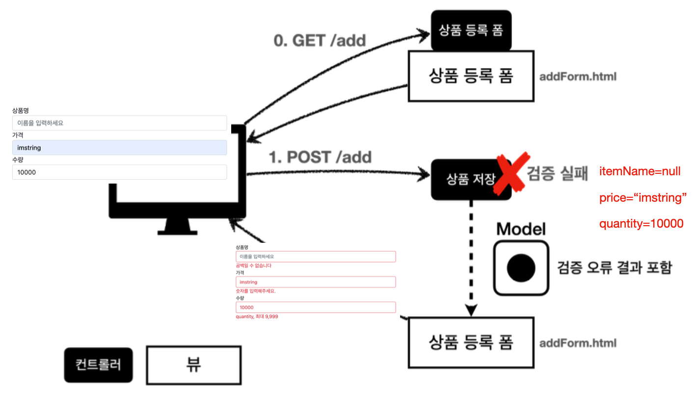
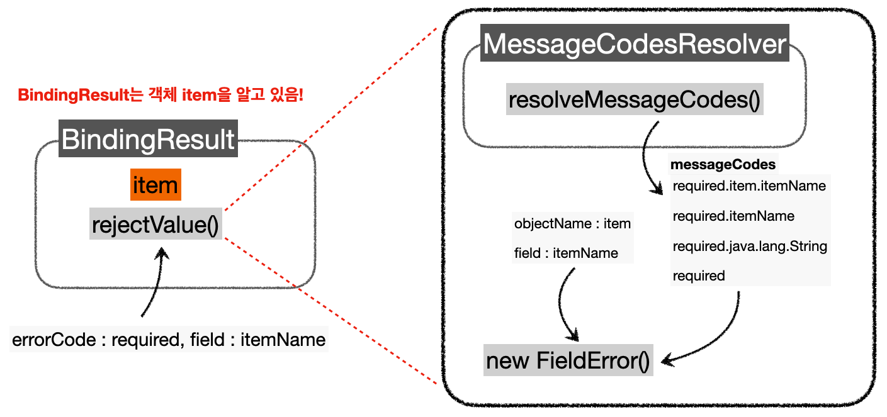

---

## 1. 검증(Validation)

스프링 애플리케이션에서의 검증에 대해 알아보자.

### 1.1 검증 소개

이전 예시에서 검증 요구 사항을 정해보자.

* **타입 검증**
  * 가격, 수량에 문자가 들어가면 검증 오류 처리


* **필드 검증**
  * `itemName` : 상품명을 필수로 입력해야한다
  * `price` : 가격은 1000원 이상 ~ 1백만원 이하
  * `quantity` : 수량은 최대 9999개
  * 공백은 허용하지 않는다


* **특정 필드의 범위 검증**
  * `price * quantity`은 10000원 이상이어야 한다

<br>

지금까지는 폼 입력시 숫자를 문자로 작성하거나해서 검증 오류가 발생하면 오류 화면으로 바로 이동했다. 그러나 이것은 사용성 측면에서 좋지 않다. 웹 서비스는 폼 입력시 오류가 발생하면, 고객이 입력한 데이터를 유지한 상태로 어떤 오류가 발생했는지 친절하게 알려주어야 한다.

**컨트롤러의 중요한 역할중 하나는 HTTP 요청이 정상인지 아닌지 검증하는 것이다.**

클라이언트 사이드 검증의 경우, 클라이언트 쪽에서 조작할 수 있기 때문에 보안에 취약하다. 반면에 서버만으로 검증하는 경우, 즉각적인 고객 사용성이 부족해진다. 

베스트 프랙티스(best practice)는 클라이언트 사이드와 서버 사이드 검증 둘 모두 사용하되, 최종적으로 서버 검증은 필수로 사용하는 것이다. 또한 API 방식을 사용하는 경우 API 스펙을 장 정의해서 검증 오류를 API 응답 결과에 잘 남겨주어야 한다. (HTTP 상태 코드, 등)

<br>



<p align='center'>검증 과정</p>

고객이 상품 등록 폼에서 상품명을 입력하지 않거나, 가격, 수량 등이 범위를 벗어나면, 서버 검증 로직이 실패해야 한다. 검증에 실패한 경우 유저에게 다시 상품 등록 폼을 보여주고, 어떤 값을 잘못 입력했는 알려줘야한다.

<br>

---

### 1.2 BindingResult

스프링이 제공하는 `BindingResult`에 대해서 알아보자.

<br>

`BindingResult`는 스프링이 제공하는 검증 오류를 보관하는 객체이다. 검증 오류 발생시 여기에 보관하면 된다.

`BindingResult`의 특징은 다음과 같다.

* `BindingResult`가 있으면 `@ModelAttribute`에 데이터 바인딩 시 오류가 발생해도 컨트롤러가 호출된다
  * `BindingResult`를 사용하지 않았을 때 타입 오류 발생 → `400` 오류가 발생하면서 컨트롤러가 호출되지 않고, 오류 페이지로 이동한다
  * `BindingResult`를 사용한 경우 타입 오류 발생 → 오류 정보(`FieldError`)를 `BindingResult`에 담아서 컨트롤러를 정상 호출한다

* `BindingResult`는 `Model`에 자동으로 포함된다

<br>

`BindingResult`에 검증 오류를 적용하는 3가지 방법은 다음과 같다.

* `@ModelAttribute`의 객체에 타입 오류 등으로 바인딩이 실패하는 경우 스프링이 `FieldError` 생성해서 `BindingResult`에 넣어준다
* 개발자가 직접 넣어준다
* `Validator`를 사용 한다

<br>

`BindingResult`와 `Error`의 관계

* `BindingResult`는 인터페이스이고, `Errors` 인터페이스를 상속받는다
* 실제 넘어오는 구현체는 `BeanPropertyBindingResult`라는 것인데, 둘다 구현하고 있으므로 `BindingResult` 대신에 `Errors`를 사용해도 된다
* `Errors` 인터페이스는 단순한 오류 저장과 조회 기능을 제공한다
* 보통 `BindingResult`를 많이 사용한다


<br>

```java
@PostMapping("/add")
public String addItemV2(@ModelAttribute Item item, BindingResult bindingResult,
RedirectAttributes redirectAttributes) {
   
    if (!StringUtils.hasText(item.getItemName())) {
        bindingResult.addError(new FieldError("item", "itemName", item.getItemName(), false, null, null, "상품 이름은 필수입니다.")); 
     }
    if (item.getPrice() == null || item.getPrice() < 1000 || item.getPrice() > 1000000) {
        bindingResult.addError(new FieldError("item", "price", item.getPrice(), false, null, null, "가격은 1,000 ~ 1,000,000 까지 허용합니다."));
    }
    if (item.getQuantity() == null || item.getQuantity() >= 10000) {
        bindingResult.addError(new FieldError("item", "quantity", item.getQuantity(), false, null, null, "수량은 최대 9,999 까지 허용합니다."));
    }
   
    //특정 필드 예외가 아닌 전체 예외
    if (item.getPrice() != null && item.getQuantity() != null) {
        int resultPrice = item.getPrice() * item.getQuantity();
         
        if (resultPrice < 10000) {
            bindingResult.addError(new ObjectError("item", null, null, "가격 * 수량 의 합은 10,000원 이상이어야 합니다. 현재 값 = " + resultPrice));
        } 
    }
    if (bindingResult.hasErrors()) {
        log.info("errors={}", bindingResult);
        return "validation/v2/addForm";
    }

  //성공 로직
  Item savedItem = itemRepository.save(item); 
  redirectAttributes.addAttribute("itemId", savedItem.getId()); 
  redirectAttributes.addAttribute("status", true);

  return "redirect:/validation/v2/items/{itemId}";
}
```

* `BindingResult bindingResult` 파라미터의 위치는 `@ModelAttribute Item item`다음에 와야 한다


* `FieldError`는 두 가지 생성자를 제공한다

  * ```java
     public FieldError(String objectName, String field, String defaultMessage);
     public FieldError(String objectName, String field, @Nullable Object rejectedValue, 
                       boolean bindingFailure, @Nullable String[] codes, @Nullable Object[] arguments, 											 @Nullable String defaultMessage)
    ```

  * `objectName` : 오류가 발생한 객체 이름

  * `field` : 오류 필드

  * `rejectedValue` : 사용자가 입력한 값(거절된 값)

  * `bindingFailure` : 타입 오류 같은 바인딩 실패인지, 검증 실패인지 구분 값

    * 바인딩 실패 : 타입 오류 같은 경우
    * 검증 실패 : validation 로직을 통과하지 못한 경우

  * `codes` : 메시지 코드

  * `arguments` : 메시지에서 사용하는 인자

  * `defaultMessage` : 기본 오류 메시지


* 예시) `FieldError("item", "itemName", item.getItemName(), false, null, null, "상품 이름은 필수입니다.")`
  * 사용자의 입력 데이터가 컨트롤러의 `@ModelAttribute`에 바인딩되는 시점에 오류가 발생하면 모델 객체에 사용자 입력 값을 유지하기 어렵다
  * 가격에 숫자가 아닌 문자가 입력된다면 가격은 `Integer` 타입이므로 문자를 보관할 수 있는 방법이 없다
  * `FieldError`는 오류 발생시 사용자 입력 값을 저장하는 기능을 제공한다
  * 이렇게 보관한 사용자 입력 값을 검증 오류 발생시 화면에 다시 출력할 것이다

<br>

**글로벌 오류 처리**

```html
<div th:if="${#fields.hasGlobalErrors()}">
  <p class="field-error" th:each="err : ${#fields.globalErrors()}" th:text="$ {err}">전체 오류 메시지</p>
</div>
```

* `#fields` : `#fields`로 `BindingResult`가 제공하는 검증 오류에 접근할 수 있다

<br>

**필드 오류 처리**

```html
<div>
    <label for="itemName" th:text="#{label.item.itemName}">상품명</label> 
    <input type="text" id="itemName" th:field="*{itemName}"
                                     th:errorclass="field-error" 
                                     class="form-control" 
                                     placeholder="이름을 입력하세요">
 
    <div class="field-error" th:errors="*{itemName}">상품명 오류</div>
</div>
```

* `th:errorclass` : `th:field`에서 지정한 필드에 오류가 있으면 `class` 정보를 추가한다


* `th:field="*{itemName}"`
  * 타임리프의 `th:field`는 매우 똑똑하게 동작하는데, 정상 상황에는 모델 객체의 값을 사용하지만, 오류가 발생하면 `FieldError`에서 보관한 값을 사용해서 값을 출력한다


* `th:errors` : 해당 필드에 오류가 있는 경우에 태그를 출력한다
  *  `th:if`를 생각하면 편하다


* 검증과 오류 메세지 공식 문서 : [https://www.thymeleaf.org/doc/tutorials/3.0/thymeleafspring.html#validation-and-error-messages](https://www.thymeleaf.org/doc/tutorials/3.0/thymeleafspring.html#validation-and-error-messages)

<br>

---

### 1.3 오류 코드, 메세지 처리

#### 1.3.1 errors.properties

오류 메세지를 관리하기 위해서 이전에 메세지 파일을 별도로 만들었던 것 처럼, `errors.properties` 라는 별도의 파일을 만들어서 관리할 수 있다.

스프링 부트가 해당 메세지 파일을 인식할 수 있게 다음 설정을 추가하면 된다.

<br>

`application.properties`

```properties
spring.messages.basename=messages,errors
```

* `messages.properties` , `errors.properties` 두 파일을 모두 인식한다. (생략하면 `messages.properties`를 기본으로 인식한다.)

<br>

`error.properties`

```properties
# required.item.itemName=상품 이름은 필수입니다. 
# range.item.price=가격은 {0} ~ {1} 까지 허용합니다. 
# max.item.quantity=수량은 최대 {0} 까지 허용합니다. 
# totalPriceMin=가격 * 수량의 합은 {0}원 이상이어야 합니다. 현재 값 = {1}

# ==ObjectError==

# Level1
totalPriceMin.item=상품의 가격 * 수량의 합은 {0}원 이상이어야 합니다. 현재 값 = {1}

# Level2 - 생략
totalPriceMin=전체 가격은 {0}원 이상이어야 합니다. 현재 값 = {1}

# ==FieldError==
# Level1
required.item.itemName=상품 이름은 필수입니다. 
range.item.price=가격은 {0} ~ {1} 까지 허용합니다. 
max.item.quantity=수량은 최대 {0} 까지 허용합니다.

# Level2 - 생략
# Level3
required.java.lang.String = 필수 문자입니다. 
required.java.lang.Integer = 필수 숫자입니다. 
min.java.lang.String = {0} 이상의 문자를 입력해주세요. 
min.java.lang.Integer = {0} 이상의 숫자를 입력해주세요. 
range.java.lang.String = {0} ~ {1} 까지의 문자를 입력해주세요. 
range.java.lang.Integer = {0} ~ {1} 까지의 숫자를 입력해주세요. 
max.java.lang.String = {0} 까지의 문자를 허용합니다.
max.java.lang.Integer = {0} 까지의 숫자를 허용합니다.

# Level4
required = 필수 값 입니다.
min= {0} 이상이어야 합니다.
range= {0} ~ {1} 범위를 허용합니다.
max= {0} 까지 허용합니다
```

* 레벨별로 나눈 이유
  * 모든 오류 코드에 대해서 메시지를 각각 다 정의하면 개발자 입장에서 관리하기 너무 힘들다
  * 크게 중요하지 않은 메시지는 범용성 있는 `requried` 같은 메시지로 끝내고, 정말 중요한 메시지는 꼭 필요할 때 구체 적으로 적어서 사용하는 방식이 더 효과적이다


* 구체적 : 레벨 1 → 덜 구체적(범용성 높은) : 레벨 4

<br>

---

#### 1.3.2 rejectValue(), reject()

그럼 `errors`에 등록한 메세지를 사용하도록 코드를 변경해보자.

```java
@PostMapping("/add")
public String addItemV4(@ModelAttribute Item item, BindingResult bindingResult, 
                        RedirectAttributes redirectAttributes) {
     
    log.info("objectName={}", bindingResult.getObjectName());
    log.info("target={}", bindingResult.getTarget());
     
    if (!StringUtils.hasText(item.getItemName())) {
        bindingResult.rejectValue("itemName", "required");
    }
    if (item.getPrice() == null || item.getPrice() < 1000 || item.getPrice() > 1000000) {
        bindingResult.rejectValue("price", "range", new Object[]{1000, 1000000}, null);
    }
    if (item.getQuantity() == null || item.getQuantity() > 10000) {
        bindingResult.rejectValue("quantity", "max", new Object[]{9999}, null);
    }

    //특정 필드 예외가 아닌 전체 예외
    if (item.getPrice() != null && item.getQuantity() != null) {
        int resultPrice = item.getPrice() * item.getQuantity();
        if (resultPrice < 10000) {
            bindingResult.reject("totalPriceMin", new Object[]{10000,resultPrice}, null);
        }
    }
    if (bindingResult.hasErrors()) {
        log.info("errors={}", bindingResult);
        return "validation/v2/addForm";
    }

    //성공 로직
    Item savedItem = itemRepository.save(item); 
    redirectAttributes.addAttribute("itemId", savedItem.getId()); 
    redirectAttributes.addAttribute("status", true);

    return "redirect:/validation/v2/items/{itemId}";
}
```

<br>

`rejectValue()` , `reject()`를 사용하기 이전에는 `FieldError`를 직접 생성해서 사용했다.

* ```java 
  bindingResult.addError(new FieldError("item", "price", item.getPrice(), false, new String[]{"range.item.price"}, new Object[]{1000, 1000000}, null))
  ```

* `bindingResult.rejectValue("price", "range", new Object[]{1000, 1000000}, null);`


* 원래는 `new FieldError("item", "price", item.getPrice(), false, new String[]{"range.item.price"}, new Object[]{1000, 1000000}, null)`를 사용할 수 있었다
  * `codes` : `range.item.price`를 사용해서 메시지 코드를 지정. 메시지 코드는 하나가 아니라 배열로 여러 값을 전달할 수 있는데, 순서대로 매칭해서 처음 매칭되는 메시지가 사용된다.
  * `arguments` : `Object[]{1000, 1000000}` 를 사용해서 코드의 `{0}` , `{1}` 로 치환할 값을 전달한다


* `new FieldError(...)` 같은 방식으로 다루기는 너무 번거롭다는 것을 느낄 수 있다

* 이를 해결하기 위해서 `BindingResult`가 제공하는 `rejectValue()` , `reject()`를 사용하면 `FieldError` , `ObjectError`를 직

  접 생성하지 않고, 깔끔하게 검증 오류를 다룰 수 있다

* 컨트롤러에서 `BindingResult`는 검증해야 할 객체인 `target` 바로 다음에 온다

* `BindingResult`는 이미 본인이 검증해야 할 객체인 `target`을 알고 있다 (예시에서의 경우 `item`이 이에 해당)

<br>

**`rejectValue()`**

```java
void rejectValue(@Nullable String field, String errorCode, @Nullable Object[] errorArgs, @Nullable String defaultMessage);
```

* `field` : 오류 필드명
* `errorCode` : 오류 코드(이 오류 코드는 메시지에 등록된 코드가 아니다, `messageResolver`를 위한 오류 코드이다)
* `errorArgs` : 오류 메시지에서 `{0}` 을 치환하기 위한 값
* `defaultMessage` : 오류 메시지를 찾을 수 없을 때 사용하는 기본 메시지

<br>

`new FieldError(...)`를 사용하는 경우 오류 코드를 `range.item.price`와 같이 객체명, 필드명을 모두 조합해서 사용한 오류 코드를 전부 입력해서 사용했다. 그러나 위의 컨트롤러 코드를 살펴보면, `rejectValue()`를 사용할 때 오류 코드를 단순히 `required`, `range`, `max` 를 입력해서 사용하고 있다.

이렇게 사용할 수 있는 이유는 `MessageCodesResolver` 때문이다.

<br>

---

#### 1.3.3 MessageCodesResolver

`MessageCodesResolver`의 사용을 알아보자.

먼저 `MessageCodesResolver`는 인터페이스이며, 기본 구현체로 `DefaultMessageCodesResolver`를 사용한다.

동작 방식은 다음과 같다.

* `rejectValue()` , `reject()`는 내부에서 `MessageCodesResolver`를 사용한다
  * 여기에서 메세지 코드들을 생성한다

* `FieldError` , `ObjectError` 의 생성자를 살펴보면, 여러 오류 코드를 가질 수 있다
* `MessageCodesResolver`를 통해서 순서대로 생성된 오류 코드를 보관한다

<br>

그림으로 동작 방식을 그려보면 대략적으로 다음과 같이 동작할 것이다.

<br>



<p align='center'>MessageCodesResolver</p>

* `MessageCodesResolver`는 `required.item.itemName` 처럼 구체적인 것을 먼저 만들어주고, `required` 처럼 덜 구체적인 것을 가장 나중에 만든다

<br>

`DefaultMessageCodesResolver`의 기본 메시지 생성 규칙

```
필드 오류의 경우 다음 순서로 4가지 메시지 코드 생성 

1.: code + "." + object name + "." + field 
2.: code + "." + field
3.: code + "." + field type
4.: code

예) 오류 코드: typeMismatch, object name "user", field "age", field type: int 

1. "typeMismatch.user.age"
2. "typeMismatch.age"
3. "typeMismatch.int"
4. "typeMismatch"
```

<br>

> 타임리프 화면을 렌더링 할 때 `th:errors`가 실행된다. 만약 이때 오류가 있다면 생성된 오류 메시지 코드를 순서대로 돌아가면서 메시지를 찾는다. 그리고 없으면 디폴트 메시지를 출력한다.
{: .prompt-info }

<br>

---

#### 1.3.4 스프링이 직접 만든 오류 메시지 처리

검증 오류 코드는 다음과 같이 2가지로 나눌 수 있다.

* 개발자가 직접 설정한 오류 코드 : `rejectValue()`를 통해 직접 호출하는 경우
* 스프링이 직접 검증 오류에 추가한 경우(주로 타입 정보가 맞지 않은 경우)

<br>

타입 정보가 맞지 않은 경우를 한번 살펴보자. Integer가 들어가야하는 필드에 문자를 입력하고 로그를 확인해보면 `BindingResult` 에 `FieldError`가 담겨있고, 다음과 같은 메시지 코드들이 생성된 것을 확인 할 수 있다.

`codes[typeMismatch.item.price,typeMismatch.price,typeMismatch.java.lang.Integer,ty peMismatch]`

<br>

스프링은 타입 오류가 발생하면 `typeMismatch` 라는 오류 코드를 사용한다. 이 오류 코드가 `MessageCodesResolver`를 통하면서  다음의 4가지 메시지 코드를 생성한다. 

* `typeMismatch.item.price`
* `typeMismatch.price`
* `typeMismatch.java.lang.Integer`
* `typeMismatch`

<br>

출력된 메세지를 확인하면 다음과 같다. 

`Failed to convert property value of type java.lang.String to required type java.lang.Integer for property price; nested exception is java.lang.NumberFormatException: For input string:`

<br>

아직 `error.properties`에 메세지 코드를 등록하지 않았기 때문에 스프링이 생성한 기본 메세지가 출력되는 것이다. `error.properties`에 다음과 같이 추가해서 원하는 메세지를 단계별로 설정할 수 있다.

```groovy
typeMismatch.java.lang.Integer=숫자를 입력해주세요.
typeMismatch=타입 오류입니다.
```

<br>

---

### 1.4 Validator 분리

컨틀롤러에서 검증 로직이 차지하는 부분이 매우 큰 것을 알 수 있다. 이런 경우 별도의 클래스로 검증 로직을 분리하는 것이 좋다. 

먼저 코드로 살펴보자.

<br>

기존 컨트롤러에 다음 `init`을 추가하자.

```java
@InitBinder
public void init(WebDataBinder dataBinder) {
    log.info("init binder {}", dataBinder);
    dataBinder.addValidators(itemValidator); // 검증기 추가
}
```

* `WebDataBinder`는 스프링의 파라미터 바인딩의 역할을 해주고 검증 기능도 내부에 포함한다
* 이렇게 `WebDataBinder` 에 검증기를 추가하면 해당 컨트롤러에서는 검증기를 자동으로 적용할 수 있다
* `@InitBinder` : 해당 컨트롤러에만 적용된다 (글로벌하게 동작하도록 하려면 별도로 설정해야 한다)

<br>

검증 로직을 `ItemValidator`라는 별도 클래스로 분리해내자. 

```java
@Component
public class ItemValidator implements Validator {

    @Override
    public boolean supports(Class<?> clazz) {
        return Item.class.isAssignableFrom(clazz);
    }

    @Override
    public void validate(Object target, Errors errors) {
        Item item = (Item) target;

        if (!StringUtils.hasText(item.getItemName())) {
            errors.rejectValue("itemName", "required");
        }
        if (item.getPrice() == null || item.getPrice() < 1000 || item.getPrice() > 1000000) {
            errors.rejectValue("price", "range", new Object[]{1000, 10000000}, null);
        }
        if (item.getQuantity() == null || item.getQuantity() >= 9999) {
            errors.rejectValue("quantity", "max", new Object[]{9999}, null);
        }

        //특정 필드가 아닌 복합 룰 검증
        if (item.getPrice() != null && item.getQuantity() != null) {
            int resultPrice = item.getPrice() * item.getQuantity();
            if (resultPrice < 10000) {
                errors.reject("totalPriceMin", new Object[]{10000, resultPrice}, null);
            }
        }
    }
}
```

<br>

이렇게 검증 로직을 `ItemValidator`으로 분리해내면, 컨트롤러의 코드는 다음과 같이 줄일 수 있다.

```java
@InitBinder
public void init(WebDataBinder dataBinder) {
    log.info("init binder {}", dataBinder);
    dataBinder.addValidators(itemValidator); // 검증기 추가
}

@PostMapping("/add")
public String addItemV6(@Validated @ModelAttribute Item item, BindingResult bindingResult, RedirectAttributes redirectAttributes) { // @Validated가 추가됨
   
    if (bindingResult.hasErrors()) {
        log.info("errors={}", bindingResult);
        return "validation/v2/addForm";
    }
   
    //성공 로직
    Item savedItem = itemRepository.save(item); 
    redirectAttributes.addAttribute("itemId", savedItem.getId());  
    redirectAttributes.addAttribute("status", true);
   
    return "redirect:/validation/v2/items/{itemId}";
}
```

* `validator`를 직접 호출하는 부분이 사라지고, 대신에 검증 대상 앞에 `@Validated` 가 붙었다


동작 방식은 다음과 같다.

* `@Validated` 는 검증기를 실행하라는 애노테이션이다
* 이 애노테이션이 붙으면 앞서 `WebDataBinder`에 등록한 검증기를 찾아서 실행한다
* 만약 여러 검증기를 등록했다면 그 중에 어떤 검증기가 실행되어야 할지 구분이 필요하다
* 이때 `supports()`가 사용된다 


```java
@Override
public boolean supports(Class<?> clazz) {
    return Item.class.isAssignableFrom(clazz);
}
```

* `supports(Item.class)` 호출되고, 결과가 `true` 이므로 `ItemValidator` 의 `validate()` 가 호출된다
  * 쉽게 말해서, `supports()`는 해당 검증기를 지원하는지의 여부를 확인한다

<br>

그러면 검증을 더욱 더 쉽게 적용할 수 있는 `spring-boot-starter-validation` 라이브러리에 대해 알아보자.

<br>

---

## 2. 빈 검증(Bean Validation)

### 2.1 빈 검증 사용해보기

빈 검증을 어떻게 코드로 사용하는지 알아보자.

<br>

사용하기 위해서는 먼저 다음 의존관계를 추가한다.

`build.gradle`

```groovy
implementation 'org.springframework.boot:spring-boot-starter-validation'
```

<br>

이제 `Item`에 빈 검증 애노테이션을 적용해보자.

```java
@Data
public class Item {
     
    private Long id;
     
    @NotBlank
    private String itemName;
     
    @NotNull
    @Range(min = 1000, max = 1000000)
    private Integer price;
     
    @NotNull
    @Max(9999)
    private Integer quantity;
     
    public Item() {
    }
   
    public Item(String itemName, Integer price, Integer quantity) {
        this.itemName = itemName;
        this.price = price;
        this.quantity = quantity;
    }
}
```

* `@NotBlank` : 빈값 + 공백만 있는 경우를 허용하지 않는다
* `@NotNull` : `null`을 허용하지 않는다
* `@Range(min = 1000, max = 1000000)` : 범위 안의 값이어야 한다
* `@Max(9999)` : 최대 9999까지만 허용한다

<br>

기존의 컨트롤러에 추가했던 `ItemValidator`를 제거하자.

```java
// ---------------이 부분 제거---------------
private final ItemValidator itemValidator;
 
@InitBinder
public void init(WebDataBinder dataBinder) {
    log.info("init binder {}", dataBinder);
    dataBinder.addValidators(itemValidator);
}
// ----------------------------------------
```

<br>

실행을 하면 애노테이션 기반의 빈 검증이 정상적으로 동작하는 것을 확인할 수 있다. 그러면 스프링 MVC는 어떻게 빈 검증를 사용하는 것일까? 

우리가 처음에 추가했던 `'org.springframework.boot:spring-boot-starter-validation'` 라이브러리를 기억해보자. 

스프링 부트가 `spring-boot-starter-validation` 라이브러리를 넣으면 자동으로 빈 검증기를 인지하고 스프링에 통합한다. 이때 스프링 부트는 자동으로 `LocalValidtorFactoryBean`을 글로벌 검증기(Validator)로 등록한다. 이 검증기는 `@NotNull`과 같은 애노테이션을 보고 검증을 수행한다.

이런 글로벌 검증기가 적용되어 있기 때문에, `@Validated`만 적용하면 빈 검증이 동작하는 것이다. 검증 오류가 발생하면, `FieldError` , `ObjectError`를 생성해서 `BindingResult`에 담아준다.

<br>

---

### 2.2 빈 검증의 검증 순서

검증 순서는 다음과 같다.

1. `@ModelAttribute` 각각의 필드에 타입 변환을 시도한다
   * 만약 성공하면 다음 과정(검증기 적용)
   * 실패하는 경우 `typeMismatch`로 `FieldError` 추가

2. 검증기를 적용한다
   * 바인딩에 성공한 필드만 빈 검증이 적용된다(일단 모델 객체에 바인딩 받는 값이 정상적으로 들어와야 검증도 의미가 있다)

<br>

---

### 2.3 에러 코드 수정

만약 빈 검증이 기본으로 제공하는 오류 메시지를 변경하고 싶으면 어떻게 하면 될까? 일단 빈 검증에서는 검증 오류 코드가 애노테이션 이름으로 등록된다.

예를 들어 `NotBlank`라는 오류 코드를 기반으로 `MessageCodesResolver`를 통해 다음과 같이 다양한 메시지 코드가 순서대로 생성된다.

`@NotBlank`

* NotBlank.item.itemName
* NotBlank.itemName
* NotBlank.java.lang.String
* NotBlank

<br>

오류 메세지를 변경, 설정하기 위해서 우리가 이전에 했던 것 처럼 `errors.properties`에 오류 메세지를 등록할 수 있다.

```properties
#Bean Validation 추가 

NotBlank={0} 공백X 
Range={0}, {2} ~ {1} 허용 
Max={0}, 최대 {1}
```

<br>

빈 검증기가 메세지를 찾는 순서는 다음과 같다. `@NotBlank(message = "공백은 입력할 수 없습니다.")`를 예시로 들자.

* 생성된 메시지 코드 순서대로 `messageSource`에서 메시지 찾기
* 애노테이션의 `message` 속성 사용 → `@NotBlank(message = "공백은 입력할 수 없습니다.")`
* 라이브러리가 제공하는 디폴트 값 사용 → `"공백일 수 없습니다."`

<br>

---

### 2.4 빈 검증기 (ObjectError)

빈 검증에서 특정 필드(`FieldError`)가 아닌 해당 오브젝트 관련 오류(`ObjectError`)는 어떻게 처리할 수 있을까?

<br>

이 경우에는 `@ScriptAssert()`를 사용할 수 있다.

```java
@Data
@ScriptAssert(lang = "javascript", script = "_this.price * _this.quantity >= 10000")
public class Item {
    //...
}
```

<br>

그러나 실제 사용해보면 제약이 많고 복잡하다. 또한, 개발하다보면 검증 기능이 해당 객체의 범위를 넘어서는 경우들도 등장하는데, 그런 경우 대응이 어렵다. 

권장하는 방법은 오브젝트 오류(글로벌 오류)의 경우, 오브젝트 오류 관련 부분만 직접 자바 코드로 작성하는 것을 권장한다.

```java
// 특정 필드 예외가 아닌 전체 예외
if (item.getPrice() != null && item.getQuantity() != null) {
  
    int resultPrice = item.getPrice() * item.getQuantity();
    
    if (resultPrice < 10000) {
        errors.reject("totalPriceMin", new Object[]{10000, resultPrice}, null);
    }
}
```

* 우리가 이전에 컨트롤러에 직접 검증 로직을 구현했던 것 처럼 사용하면 된다

<br>

---

### 2.5 빈 검증기의 한계와 groups

이렇게 편한 빈 검증에도 한계가 존재한다. 

데이터를 등록할 때와 수정할 때의 검증 요구사항이 다른 경우 어떻게 해야할까? 

가령 등록과 다르게 수정시에는 `quantity`를 무제한으로 수정 가능하고, `id` 값은 필수라는 검증이 있어야한다고 하자. 그리고 요구 사항에 맞게 빈 검증을 위한 애노테이션을 다음과 같이 수정해보자.

```java
@Data
public class Item {
  
    @NotNull // 수정 요구사항 추가
    private Long id;
  
    @NotBlank
    private String itemName;
  
    @NotNull
    @Range(min = 1000, max = 1000000)
    private Integer price;
     
    @NotNull
    //@Max(9999) // 수정 요구사항 추가 
    private Integer quantity;
     
    //...
}
```

* 이 경우에는 수정 요구 사항을 맞추더라도, 이제는 등록의 검증에 문제가 생겨버린다

<br>

이런 문제를 해결하기 위해서 동일한 모델 객체를 등록할 때와 수정할 때 각각 다르게 검증하는 방법을 `groups`라는 기능을 통해 해결할 수 있다.

`groups`의 사용법은 간단하다. 

코드로 살펴보자.

<br>

저장용 `groups`을 위한 인터페이스 생성

```java
public interface SaveCheck {
}
```

<br>

수정용 `groups`을 위한 인터페이스  생성

```java
public interface UpdateCheck {
}
```

<br>

`Item`에 `groups` 적용

```java
@Data
public class Item {
     
    @NotNull(groups = UpdateCheck.class) //수정시에만 적용 
    private Long id;
     
    @NotBlank(groups = {SaveCheck.class, UpdateCheck.class}) // 수정, 등록 둘다 적용
    private String itemName;
     
    @NotNull(groups = {SaveCheck.class, UpdateCheck.class})
    @Range(min = 1000, max = 1000000, groups = {SaveCheck.class, UpdateCheck.class})
    private Integer price;
     
    @NotNull(groups = {SaveCheck.class, UpdateCheck.class}) 
    @Max(value = 9999, groups = SaveCheck.class) //등록시에만 적용 
    private Integer quantity;
   
    public Item() {
    }
   
    public Item(String itemName, Integer price, Integer quantity) {
        this.itemName = itemName;
        this.price = price;
        this.quantity = quantity;
        }
}
```

* `groups` 기능을 사용해서 등록과 수정시에 각각 다른 검증 로직을 적용할 수 있다

<br>

사실 `groups` 기능은 실무에서 잘 사용하지 않는다. 그 이유는 주로 등록용 폼 객체와 수정용 폼 객체를 분리해서 사용하기 때문이다.

<br>

---

### 2.6 Form 객체의 분리

등록용 폼 객체와 수정용 폼 객체를 분리해보자.

실무에서는 `groups`를 잘 사용하지 않는데, 그 이유는 등록시 폼에서 전달하는 데이터가 `Item` 도메인 객체와 딱 맞지 않기 때문이다. 실무에서는 회원 등록시 회원과 관련된 데이터만 전달받는 것이 아니라, 약관정보도 추가로 받는 등, `Item` 과 관계없는 수 많은 부가 데이터가 넘어온다. 

그래서 `Item`을 직접 전달받는 것이 아니라, 복잡한 폼의 데이터를 컨트롤러까지 전달할 별도의 객체를 만들어서 전달한다. 

예를 들면 `ItemSaveForm`이라는 폼을 전달받는 전용 객체를 만들어서 `@ModelAttribute`로 사용한다. 이것을 통해 컨트롤러에서 폼 데이터를 전달 받고, 이후 컨트롤러에서 필요한 데이터를 사용해서 `Item` 을 생성한다.

과정을 살펴보자면 다음과 같다.

* `HTML Form → ItemSaveForm → Controller → Item 생성 → Repository`

<br>

이제 `Item`에서 검증은 사용하지 않기 때문에 검증 코드(검증 애노테이션들)를 제거하자.

```java
@Data
public class Item {
   
   private Long id;
   private String itemName;
   private Integer price;
   private Integer quantity;
     
   // ...
}
```

<br>

이제 각 폼에 대한 객체를 만들자.

`ItemSaveForm` (`Item` 등록용 폼에서 사용할 객체)

```java
@Data
public class ItemSaveForm {
    // Item을 등록할 때는 id가 필요하지 않음
    
    @NotBlank
    private String itemName;
     
    @NotNull
    @Range(min = 1000, max = 1000000)
    private Integer price;
     
    @NotNull
    @Max(value = 9999)
    private Integer quantity;
     
}
```

<br>

`ItemUpdateForm` (`Item` 수정용 폼에서 사용할 객체)

```java
@Data
public class ItemUpdateForm {
    // 수정에는 id가 필수로 필요
    @NotNull
    private Long id;
     
    @NotBlank
    private String itemName;
     
    @NotNull
    @Range(min = 1000, max = 1000000)
    private Integer price;
     
    //수정에서는 수량은 자유롭게 변경할 수 있다. 
    private Integer quantity;
     
}
```

<br>

컨트롤러는 다음과 같이 수정하면 된다.

```java
@PostMapping("/add")
public String addItem(@Validated @ModelAttribute("item") ItemSaveForm form, BindingResult bindingResult, RedirectAttributes redirectAttributes) {

    //특정 필드 예외가 아닌 전체 예외
    if (form.getPrice() != null && form.getQuantity() != null) {
        int resultPrice = form.getPrice() * form.getQuantity();
        
        if (resultPrice < 10000) {
            bindingResult.reject("totalPriceMin", new Object[]{10000, resultPrice}, null);
            } 
        }

        if (bindingResult.hasErrors()) {
            log.info("errors={}", bindingResult);
            return "validation/v4/addForm";
        }
       
        //성공 로직
        Item item = new Item(); // 아이템 생성
  
        item.setItemName(form.getItemName()); 
        item.setPrice(form.getPrice()); 
        item.setQuantity(form.getQuantity());
  
        Item savedItem = itemRepository.save(item);
  
        redirectAttributes.addAttribute("itemId", savedItem.getId());
        redirectAttributes.addAttribute("status", true);
  
        return "redirect:/validation/v4/items/{itemId}";
}


@PostMapping("/{itemId}/edit")
public String edit(@PathVariable Long itemId, @Validated @ModelAttribute("item") ItemUpdateForm form, BindingResult bindingResult) {
  
    //특정 필드 예외가 아닌 전체 예외
    if (form.getPrice() != null && form.getQuantity() != null) {
        int resultPrice = form.getPrice() * form.getQuantity();
            if (resultPrice < 10000) {
                bindingResult.reject("totalPriceMin", new Object[]{10000, resultPrice}, null);
        } 
    }

    if (bindingResult.hasErrors()) {
        log.info("errors={}", bindingResult);
        return "validation/v4/editForm";
    }
    
    Item itemParam = new Item();
        
    itemParam.setItemName(form.getItemName());
    itemParam.setPrice(form.getPrice());
    itemParam.setQuantity(form.getQuantity());
    
    itemRepository.update(itemId, itemParam);
        
    return "redirect:/validation/v4/items/{itemId}";
}
```

* 이제 `Item` 대신에 `ItemSaveform` 또는 `ItemUpdateform`을 전달 받는다
* `@Validated`로 검증을 수행하고, `BindingResult`로 검증 결과를 받는다


* 현재의 예시에서는 `@ModelAttribute("item")`에 `item`을 넣어주고 있다
  * 이렇게 하지 않으면  `ItemSaveForm`의 경우 규칙에 의해 `itemSaveForm`이라는 이름으로 모델에 담기게 된다(`ItemUpdateForm`도 마찬가지로)
  * 만약 그렇게 하는 경우  `th:object`의 이름도 `item`에서 `itemSaveForm`로 전부 수정해야 한다
  * 처음 부터 다시 개발한다면 `item`을 사용하지 않고 그냥 나누어서 사용하는 것이 좋을 수도 있다

<br>

---

### 7.7 @RequestBody에 @Validated 적용

지금까지 빈 검증을 하면서 다룬 `@ModelAttribute`는 HTTP 요청 파라미터(URL 쿼리 스트링, POST Form)를 다룰 때 사용한다.

반면에 `@RequestBody`는 HTTP Body의 데이터를 객체로 변환할 때 사용한다. 주로 API JSON 요청을 다룰 때 사용한다.

API 요청의 경우 3가지 케이스를 나누어서 생각해야한다.

* 성공 요청 : 정상적으로 성공
* 실패 요청 : JSON을 객체로 생성하는 것 자체가 실패
* 검증 오류 요청 : JSON을 객체로 생성하는 것은 성공했지만, 검증에서 실패함

<br>

코드로 한번 살펴보자. 먼저 API 요청을 위한 컨트롤러를 만들어보자.

```java
@Slf4j
@RestController
@RequestMapping("/validation/api/items")
public class ValidationItemApiController {
    @PostMapping("/add")
    public Object addItem(@RequestBody @Validated ItemSaveForm form, BindingResult bindingResult) { 			           log.info("API 컨트롤러 호출");
 
        if (bindingResult.hasErrors()) {
             log.info("검증 오류 발생 errors={}", bindingResult); return bindingResult.getAllErrors();
        }

        log.info("성공 로직 실행");
        return form;
     }
}
```

<br>

JSON 객체로 변환에 실패하는 경우를 생각해보자. 

가령 `price` 필드에 숫자가 아닌 문자를 보내면 `HttpMessageConverter`에서 요청 JSON을 `ItemSaveForm` 객체로 생성하는데 실패한다. 이 경우는 `ItemSaveForm` 객체를 만들지 못하기 때문에 컨트롤러 자체가 호출되지 않고 그 전에 예외가 발생한다. Validator도 실행되지 않는다.

<br>

**POSTMAN으로 요청 보내기**

```json
POST http://localhost:8080/validation/api/items/add
{"itemName":"hello", "price":"A", "quantity": 10}
```

<br>

**실패 요청 결과**

```json
{
     "timestamp": "2021-04-20T00:00:00.000+00:00",
     "status": 400,
     "error": "Bad Request",
     "message": "",
     "path": "/validation/api/items/add"
}
```

<br>

**실패 로그**

```
.w.s.m.s.DefaultHandlerExceptionResolver : Resolved
[org.springframework.http.converter.HttpMessageNotReadableException: JSON parse error: Cannot deserialize value of type `java.lang.Integer` from String "A": not a valid Integer value; nested exception is com.fasterxml.jackson.databind.exc.InvalidFormatException: Cannot deserialize value of type `java.lang.Integer` from String "A": not a valid Integer value
```

<br>

`HttpMessageConverter`는 성공하지만 검증(Validator)에서 오류가 발생하는 경우는 살펴보자. `quantity`에서 수량 제한 보다 많은 양인 `10000`을 보내는 경우이다.

<br>

**POSTMAN으로 요청 보내기**

```json
POST http://localhost:8080/validation/api/items/add
{"itemName":"hello", "price":1000, "quantity": 10000}
```

<br>

**실패 요청 결과**

```json
[
	{
    "codes": [
      "Max.itemSaveForm.quantity",
      "Max.quantity",
      "Max.java.lang.Integer",
      "Max"
    ],
    "arguments": [
      {
        "codes": [
          "itemSaveForm.quantity",
          "quantity"
        ],
        "arguments": null,
        "defaultMessage": "quantity",
        "code": "quantity"
      },
      9999
  ],
  "defaultMessage": "9999 이하여야 합니다", 
  "objectName": "itemSaveForm", 
  "field": "quantity",
  "rejectedValue": 10000, 
  "bindingFailure": false,
  "code": "Max"
  }
]
```

* `return bindingResult.getAllErrors();` 는 `ObjectError` 와 `FieldError` 를 반환한다
* 스프링이 이 객체를 JSON으로 변환해서 클라이언트에 전달
* 여기서는 예시로 보여주기 위해서 검증 오류 객체들을 그대로 반환함
* 실제 개발할 때는 이 객체들을 그대로 사용하지 말고, 필요한 데이터만 뽑아서 별도의 API 스펙을 정의하고 그에 맞는 객체를 만들어서 반환한다

<br>

`@RequestBody`에서의 `HttpMessageConverter`는 `@ModelAttribute`와 다르게 각각의 필드 단위로 적용되는 것이 아니라, 전체 객체 단위로 적용된다. 

쉽게 말해서 `@RequestBody`는 `HttpMessageConverter` 단계에서 JSON 데이터를 객체로 변경하지 못하면 이후 단계 자체가 진행되지 않고 예외가 발생한다. 컨트롤러도 호출되지 않고, Validator도 적용할 수 없다.

<br>

---

## Reference

1. [스프링 MVC - 백엔드 웹 개발 핵심 기술](https://www.inflearn.com/course/%EC%8A%A4%ED%94%84%EB%A7%81-mvc-1)
2. [Udemy - Spring Boot 3, Spring 6 & Hibernate](https://www.udemy.com/course/spring-hibernate-tutorial/?couponCode=ST8MT40924)
