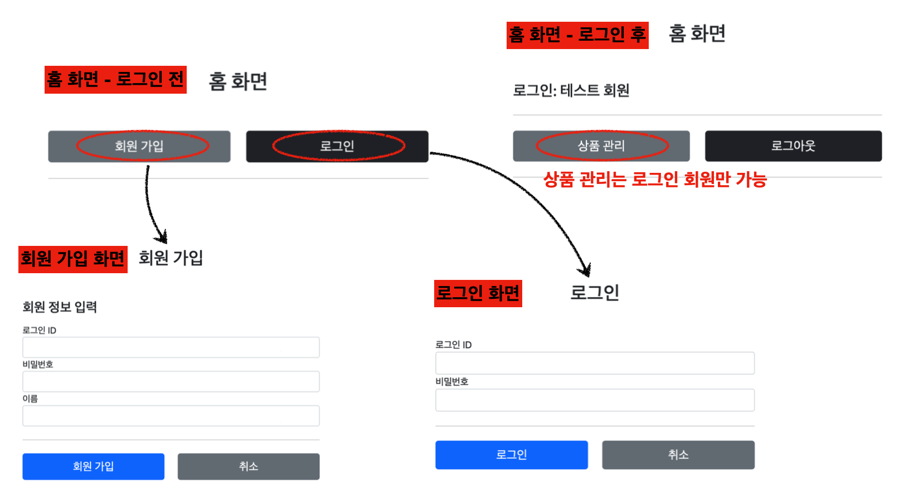
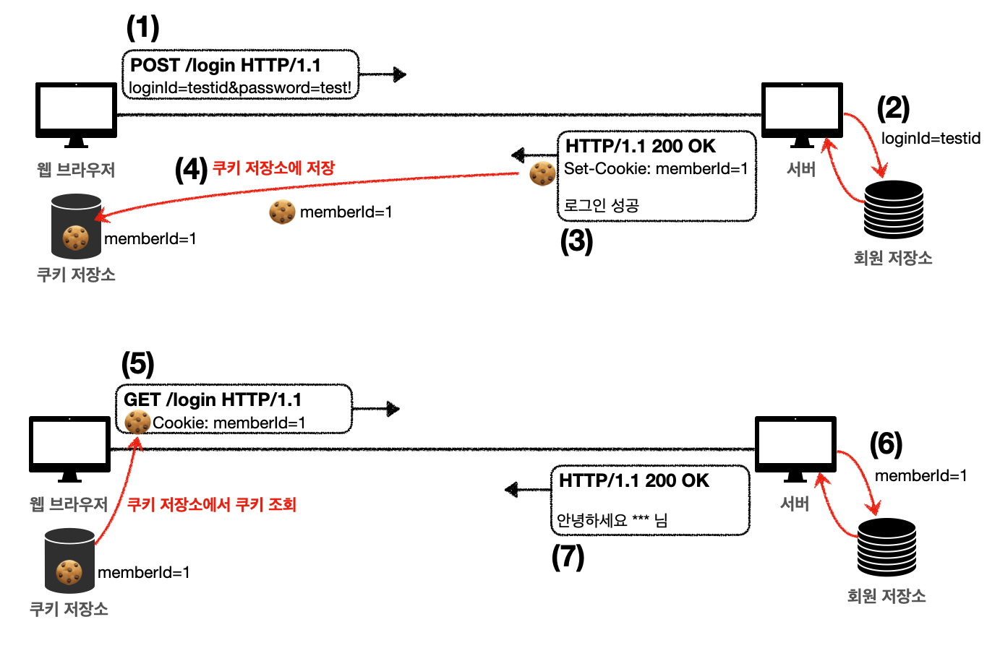
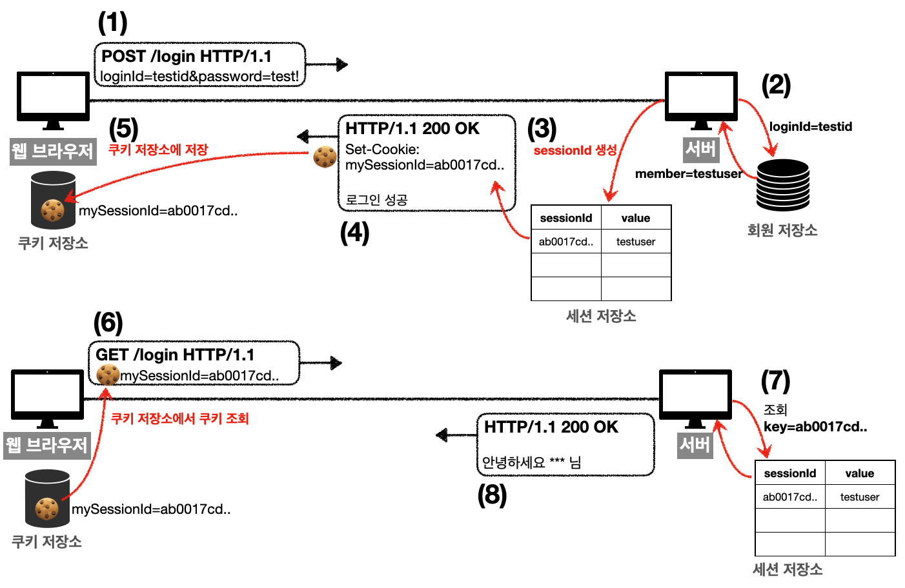

---

## 1. 로그인을 위한 요구 사항

* **홈 화면 - 로그인 전**
  * 회원 가입
  * 로그인
* **홈 화면 - 로그인 후**
  * 환영 메세지 또는 고객 이름 표시("xx님 안녕하세요!")
  * 상품 관리
  * 로그아웃
* **보안**
  * 로그인 사용자만 상품에 접근, 관리 가능
  * 비 로그인 사용자가 상품 관리 접근 시 로그인 화면으로 이동

<br>



<p align='center'>로그인 요구 사항</p>

<br>

---

## 2. 화면과 기능 구현

### 2.1 홈 화면

`HomeController`에서 홈 화면으로 가도록 설정 한다.

```java
@Slf4j
@Controller
public class HomeController {

    @GetMapping("/")
    public String home() {
        return "home";
    }
}
```

* `templates/home.html`을 만들어준다

<br>

`home.html`

```html
<body>
<div class="container" style="max-width: 600px">
    <div class="py-5 text-center">
        <h2>홈 화면</h2> </div>
    <div class="row">
        <div class="col">
            <button class="w-100 btn btn-secondary btn-lg" type="button"
                    th:onclick="|location.href='@{/members/add}'|">
                회원 가입
            </button>
        </div>
        <div class="col">
            <button class="w-100 btn btn-dark btn-lg"
                    onclick="location.href='items.html'"
                    th:onclick="|location.href='@{/login}'|" type="button">
                로그인
            </button>
        </div>
    </div>
    <hr class="my-4">
</div> <!-- /container -->
</body>
```

<br>

---

### 2.2 회원 가입

회원 가입을 위한 `Member` 클래스를 만들자.

```java
@Data
public class Member {
   
    private Long id;

    @NotEmpty
    private String loginId; //로그인 ID
    @NotEmpty
    private String name; //사용자 이름
    @NotEmpty
    private String password;
   
}
```

<br>

현재 예시에서는 `MemberRepository`를 인터페이스 없이 바로 구현했다.

```java
@Slf4j
@Repository
public class MemberRepository {
    /**
      * 동시성 문제가 고려되어 있지 않음, 실무에서는 ConcurrentHashMap, AtomicLong 사용 고려
      */
    private static Map<Long, Member> store = new HashMap<>(); //static 사용 
    private static long sequence = 0L; //static 사용
     
    public Member save(Member member) {
        member.setId(++sequence);
        log.info("save: member={}", member);
        store.put(member.getId(), member);
        return member;
    }
   
    public Member findById(Long id) {
        return store.get(id);
    }
   
    public Optional<Member> findByLoginId(String loginId) {
        return findAll().stream()
                .filter(m -> m.getLoginId().equals(loginId))
                .findFirst();
    }
   
    public List<Member> findAll() {
        return new ArrayList<>(store.values());
    }
   
    public void clearStore() {
        store.clear();
    } 
}
```

<br>

`MemberController`

```java
@Controller
@RequiredArgsConstructor
@RequestMapping("/members")
public class MemberController {
   
    private final MemberRepository memberRepository;
     
    @GetMapping("/add")
    public String addForm(@ModelAttribute("member") Member member) {
        return "members/addMemberForm";
    }
   
    @PostMapping("/add")
    public String save(@Valid @ModelAttribute Member member, BindingResult result) {
        if (result.hasErrors()) {
            return "members/addMemberForm";
        }
      
        memberRepository.save(member);
        return "redirect:/";
    }
}
```

<br>

**회원 가입을 위한 템플릿**은 대략적으로 다음과 같이 구현하면 된다.

```html
<h4 class="mb-3">회원 정보 입력</h4>
<form action="" th:action th:object="${member}" method="post">
        <div th:if="${#fields.hasGlobalErrors()}">
            <p class="field-error" 
               th:each="err : ${#fields.globalErrors()}"
               th:text="${err}">전체 오류 메시지</p>
          
        <!-- 필드 입력 생략 -->
          
        <hr class="my-4">
        <div class="row">
            <div class="col">
              <button class="w-100 btn btn-primary btn-lg" 
                      type="submit">회원 가입</button>
            </div>
            
            <div class="col">
              <button class="w-100 btn btn-secondary btn-lg"
                      onclick="location.href='items.html'"
                      th:onclick="|location.href='@{/}'|" 
                      type="button">취소</button>
            </div>
         </div>
</form>
```

<br>

---

### 2.3 로그인

로그인 구현을 위한 `LoginService` 레이어를 만들자.

```java
@Service
@RequiredArgsConstructor
public class LoginService {
   
    private final MemberRepository memberRepository;
    /**
      * @return null이면 로그인 실패 
      */
    public Member login(String loginId, String password) {
         return memberRepository.findByLoginId(loginId)
                 .filter(m -> m.getPassword().equals(password))
                 .orElse(null);
    }
} 
```

* 로그인의 핵심 비즈니스 로직은 회원을 조회한 다음에 파라미터로 넘어온 password와 비교해서 같으면 회원을 반환한다
* 만약 password가 다르면 `null` 을 반환한다

<br>

`LoginForm`은 다음과 같다.

```java
@Data
public class LoginForm {
    @NotEmpty
    private String loginId;
    @NotEmpty
    private String password;
}
```

<br>

`LoginController`

```java
@Slf4j
@Controller
@RequiredArgsConstructor
public class LoginController {
   
    private final LoginService loginService;
   
    @GetMapping("/login")
    public String loginForm(@ModelAttribute("loginForm") LoginForm form) {
        return "login/loginForm";
    }
   
    @PostMapping("/login")
    public String login(@Valid @ModelAttribute LoginForm form, BindingResult bindingResult) {
        if (bindingResult.hasErrors()) {
            return "login/loginForm";
        }
       
        Member loginMember = loginService.login(form.getLoginId(), form.getPassword());
       
        log.info("login? {}", loginMember);
        if (loginMember == null) {
            bindingResult.reject("loginFail", "아이디 또는 비밀번호가 맞지 않습니다."); 
            return "login/loginForm";
        }
       
        //로그인 성공 처리 TODO
        return "redirect:/";
    } 
}
```

* 로그인 컨트롤러는 로그인 서비스를 호출해서 로그인에 성공하면 홈 화면으로 이동
* 로그인에 실패하면 `bindingResult.reject()`를 사용해서 글로벌 오류(`ObjectError`)를 생성한다
* 정보를 다시 입력하도록 로그인 폼을 뷰 템플릿으로 사용한다
* 로그인 폼 뷰 템플릿에는 `loginId` , `password` 가 틀리면 글로벌 오류가 나타나도록 하면 된다

<br>

로그인 상태에서는 홈 화면에 고객 이름이 보여여한다는 요구 사항이 있었다. 로그인 상태를 유지하면서, 로그인에 성공한 사용자는 홈 화면에 접근시 이름을 보여주기 위해서는 쿠기를 사용할 수 있다.

<br>

---

## 3. 쿠키 사용(Cookie)

[쿠키 복습하러가기](https://seungki1011.github.io/posts/http-6-cookie/)

<br>

일단 브라우저 종료시 로그아웃 되기를 기대하기 때문에, 영속 쿠키가 아닌 세션 쿠키를 사용할 것이다.

동작 과정은 대략적으로 다음과 같이 동작할 것이다.

<br>



<p align='center'>쿠키 과정</p>

<br>

쿠키 생성 로직을 로그인 컨트롤러에 추가한다.

```java
// 로그인 성공 처리

// 쿠키에 대한 시간 정보를 주지 않으면 세션 쿠키
Cookie idCookie = new Cookie("memberId", String.valueOf(loginMember.getId()));
response.addCookie(idCookie);
```

* 로그인에 성공하면 쿠키를 생성하고 `HttpServletResponse`에 담는다
* 쿠키 이름은 `memberId`이고, 값은 회원의 `id`를 담아둔다
* 웹 브라우저는 종료 전까지 회원의 `id`를 서버에 계속 보내줄 것이다

<br>

`HomeController`에서 로그인 처리는 다음과 같이 할 것이다.

```java
@GetMapping("/")
public String homeLogin( @CookieValue(name = "memberId", required = false) Long memberId, Model model) {
    if (memberId == null) {
        return "home";
    }
  
    //로그인
    Member loginMember = memberRepository.findById(memberId); 
    if (loginMember == null) {
            return "home";
    }
  
    model.addAttribute("member", loginMember);
    return "loginHome";
}
```

* `@CookieValue` 를 사용하면 편리하게 쿠키를 조회할 수 있다
* 로그인 하지 않은 사용자도 홈에 접근할 수 있기 때문에 `required = false`를 사용한다


* 로그인 쿠키(`memberId`)가 없는 사용자는 기존 `home`으로 보낸다
  * 로그인 쿠키가 있어도 회원이 없으면`home`으로 보낸다


* 로그인 쿠키가 있는 사용자는 로그인 사용자 전용 홈 화면인 `loginHome`으로 보낸다
  * 홈 화면에 회원 관련 정보도 출력해야 해서 `member`데이터도 모델에 담아서 전달한다

<br>

`loginHome.html`

```html
<div class="container" style="max-width: 600px">
    <div class="py-5 text-center">
      <h2>홈 화면</h2> 
    </div>
  
    <h4 class="mb-3" th:text="|로그인: ${member.name}|">로그인 사용자 이름</h4>
    <hr class="my-4">
  
    <div class="row">
        <div class="col">
            <button class="w-100 btn btn-secondary btn-lg" 
                    type="button"
                    th:onclick="|location.href='@{/items}'|">
              상품 관리
            </button>
        </div>
        <div class="col">
            <form th:action="@{/logout}" method="post">
            <button class="w-100 btn btn-dark btn-lg" 
                    type="submit">
              로그아웃
            </button>
            </form>
        </div>
    </div>
  
    <hr class="my-4">
</div> <!-- /container -->
```

* `th:text="|로그인: ${member.name}|"`  : 로그인에 성공한 사용자 이름을 출력한다
* 상품 관리, 로그아웃 버튼을 노출시킨다

<br>

로그인 컨트롤러에 로그아웃 기능을 추가한다.

```java
@PostMapping("/logout")
public String logout(HttpServletResponse response) {
    expireCookie(response, "memberId");
    return "redirect:/";
}

private void expireCookie(HttpServletResponse response, String cookieName) {
    Cookie cookie = new Cookie(cookieName, null);
    cookie.setMaxAge(0);
    response.addCookie(cookie);
}
```

* `cookie.setMaxAge(0)`로 쿠키 종료

<br>

지금 까지 구현한 쿠키를 통한 로그인 유지는 심각한 보안 문제가 있다.

* 클라이언트 사이드에서 쿠키 값을 임의로 변경 가능
  * 예) `Cookie: memberId=1` → `Cookie: memberId=2`로 변경시 다른 사용자로 로그인 상태가 변경 됨


* 쿠키에 보관된 정보는 훔쳐갈 수 있다
  * 쿠키에 보관된 정보에 민감한 정보가 포함되면 안됨
  * 추정 불가능한 임의의 식별자 값을 사용해서 연결해야 함


* 한번 훔친 쿠키로 계속 악의적인 요청을 시도 할 수 있다

<br>

---

## 4. 세션 사용(Session)

### 4.1 세션 소개

이전에 구현한 쿠키의 보안 문제를 해결하기 위해 다음을 지키도록한다.

* 쿠키에 중요한 값을 넣지 않는다


* 쿠키에는 사용자 별로 예측 불가능한 임의의 토큰(세션 id)을 노출하고, 서버에서 토큰과 사용자 `id`를 매핑해서 인식한다
  * 보통 세션 id에는 `UUID` 사용
  * 서버에서 토큰을 관리한다
  * 토큰은 비정상적인 사용자가 임의의 값을 넣어도 사용하지 못하도록 예측 불가능해야 한다


* 토큰을 탈취 당해도, 시간이 지나면 사용할 수 없도록 서버에서 해당 토큰의 만료 시간을 짧게(30분~1시간) 유지 한다
* 비정상적인 요청 패턴(외국에서 접속)이 있으면 토큰을 강제로 제거한다 

<br>

이런 보안 문제를 해결하기 위해서 세션을 도입하자.

세션의 동작 과정은 다음과 같다.

<br>



<p align='center'>세션 동작 과정</p>

* 사용자는 `loginId`, `password`를 로그인 요청으로 전달하면, 서버는 해당 사용자가 맞는지 확인한다
* `sessionId`를 생성하는데 `UUID`를 사용한다(추정이 불가능해진다)
* 생성된 `sessionId`와 해당 세션에 보관할 값(`testuser`)을 서버의 세션 저장소에 보관한다
* 서버는 클라이언트에 `mySessionId`라는 이름으로 `sessionId`만 쿠키에 담아서 전달한다
* 클라이언트는 쿠키 저장소에 쿠키를 보관한다
* 이제 부터 클라이언트는 요청시 항상 `mySessionId` 쿠키를 전달한다
* 서버에서는 `mySessionId` 쿠키 정보로 세션 저장소를 조회하고, 로그인시 보관한 세션 정보를 사용한다
* 세션 만료 시간은 30분 정도로 설정한다. 이 때 만료 시간의 기준은 로그인 시간이 아닌 마지막 요청을 기준으로 설정한다

<br>

이와 같이 세션을 도입해서 다음 문제를 해결할 수 있다.

* 쿠키에 사용한 `sessionId`는 추정 불가능한 값이다(`UUID`를 이용한 `sessionId`)
* 쿠키에 보관하는 정보는 사용자를 특정할 수 있거나 민감한 정보가 없다
* 쿠키를 탈취 당해도 만료 시간이 30분이다

<br>

---

### 4.2 HttpSession으로 세션 구현 

서블릿은 세션을 위해 `HttpSession`이라는 기능을 제공하는데, 지금까지 나온 문제들을 해결해준다.

서블릿을 통해 `HttpSession`을 생성하면 다음과 같은 쿠키를 생성한다. 쿠키 이름은 `JSESSIONID`이고, 값은 추정 불가능한 랜덤 값으로 이루어져 있다.

* 예) `Cookie: JSESSIONID=5B78E23B513F50164D6FDD8C97B0AD05`

<br>

코드로 알아보자.

`HttpSession`에 데이터를 보관하고 조회할 때, 같은 이름이 중복 되어 사용되므로, 상수를 하나 정의한다.

`SessionConst`

```java
public class SessionConst {
     public static final String LOGIN_MEMBER = "loginMember";
}
```

<br>

`LoginController` - `@PostMapping("/login")`

```java
@PostMapping("/login")
public String loginV3(@Valid @ModelAttribute LoginForm form, BindingResult bindingResult,
                       HttpServletRequest request) {
    if (bindingResult.hasErrors()) {
        return "login/loginForm";
    }
   
    Member loginMember = loginService.login(form.getLoginId(), form.getPassword());
    log.info("login? {}", loginMember);
   
    if (loginMember == null) {
        bindingResult.reject("loginFail", "아이디 또는 비밀번호가 맞지 않습니다."); 
        return "login/loginForm";
    }
   
    //로그인 성공 처리
    //세션이 있으면 세션 반환, 없으면 신규 세션 생성
    HttpSession session = request.getSession(); // getSession(true)와 동일
   
    //세션에 로그인 회원 정보 보관 
    session.setAttribute(SessionConst.LOGIN_MEMBER, loginMember);
   
    return "redirect:/";
}
```

* 세션을 생성하려면 `request.getSession(true)`를 사용


* `request.getSession(true)`
  * 세션이 있으면 기존 세션을 반환한다
  * 세션이 없으면 새로운 세션을 생성해서 반환한다
  * `request.getSession()`와 동일하다


* `request.getSession(false)`
  * 세션이 있으면 기존 세션을 반환한다
  * 세션이 없으면 새로운 세션을 생성하지 않는다, `null`을 반환한다


* `session.setAttribute(SessionConst.LOGIN_MEMBER, loginMember);` 
  * 세션에 로그인 회원 정보를 보관한다
  * `request.setAttribute(..)`와 유사하다

<br>

`LoginController` - `@PostMapping("/logout")`

```java
@PostMapping("/logout")
public String logoutV3(HttpServletRequest request) {
    //세션을 삭제한다.
    HttpSession session = request.getSession(false); 
    if (session != null) {
        session.invalidate();
    }
    return "redirect:/";
}
```

* `session.invalidate()` : 세션을 제거한다

<br>

`HomeController` - `@GetMapping("/")`

```java
@GetMapping("/")
public String homeLoginV3(HttpServletRequest request, Model model) {
   
    //세션이 없으면 home
    HttpSession session = request.getSession(false); 
   
    if (session == null) {
        return "home";
    }
   
    Member loginMember = (Member)
    session.getAttribute(SessionConst.LOGIN_MEMBER);
   
    //세션에 회원 데이터가 없으면 home 
    if (loginMember == null) {
        return "home";
    }
   
    //세션이 유지되면 로그인으로 이동 
    model.addAttribute("member", loginMember); 
    return "loginHome";
}
```

* `request.getSession(false)`
  * 세션을 찾아서 사용하는 시점에는 `create: false` 옵션을 사용해서 세션을 생성하지 않아야 한다


* `session.getAttribute(SessionConst.LOGIN_MEMBER)`
  * 로그인 시점에 세션에 보관한 회원 객체를 찾는다

<br>

세션을 더 편리하게 사용할 수 있는 `@SessionAttribute` 사용.

`HomeController` - `@GetMapping("/")`

```java
@GetMapping("/")
public String homeLoginV3Spring(
         @SessionAttribute(name = SessionConst.LOGIN_MEMBER, required = false)
Member loginMember,
        Model model) {
   
  //세션에 회원 데이터가 없으면 home 
  if (loginMember == null) {
        return "home";
     }
   
  //세션이 유지되면 로그인으로 이동 
  model.addAttribute("member", loginMember); 
  return "loginHome";
}
```

* 세션을 찾고, 세션에 들어있는 데이터를 찾는 번거로운 과정을  `@SessionAttribute`을 통해서 한번에 편리하게 처리해준다

<br>

---

### 4.3 세션 타임아웃

마지막으로 세션 타임아웃을 설정해보자.

세션은 사용자가 로그아웃을 직접 호출해서 `session.invalidate()`가 호출 되는 경우에 삭제된다. 그런데 대부분의 사용자는 로그아웃을 선택하지 않고, 그냥 웹 브라우저를 종료한다. 문제는 HTTP가 비연결성(Connectionless)이기 때문에 서버 입장에서는 해당 사용자가 웹 브라우저를 종료한 것인지 아닌지를 인식할 수 없다. 따라서 세션의 종료 시점을 시간으로 설정 할 것이다.

세션 종료 시점은 마지막 요청으로 부터 30분이 되도록 갱신하는 방식을 사용하는 것이 좋다. 그 이유는 로그인을 기준으로 잡으면 30분 마다 재로그인을 해야하는 귀찮은 상황에 직면하기 떄문이다.

<br>

**세션 타임아웃 설정하기**

`application.properties`

```properties
server.servlet.session.timeout=60 // 60초, 기본은 1800(30분)

// 특정 세션 단위로 시간 설정
session.setMaxInactiveInterval(1800); //1800초
```

<br>

> TrackingModes
>
> * 로그인을 처음 시도하면 URL이 다음과 같이 `jsessionid` 를 포함하고 있는 것을 확인할 수 있다.
>
> * `http://localhost:8080/;jsessionid=F59911518B921DF62D09F0DF8F83F8`
>
> 
>
> URL 전달 방식을 끄고 항상 쿠키를 통해서만 세션을 유지하고 싶으면 다음 옵션을 추가하자.
>
> * `application.properties`
>
> * ```properties
>   server.servlet.session.tracking-modes=cookie
>   ```
    {: .prompt-warning }


<br>

---

## Reference

1. [스프링 MVC - 백엔드 웹 개발 핵심 기술](https://www.inflearn.com/course/%EC%8A%A4%ED%94%84%EB%A7%81-mvc-1)
2. [Udemy - Spring Boot 3, Spring 6 & Hibernate](https://www.udemy.com/course/spring-hibernate-tutorial/?couponCode=ST8MT40924)
