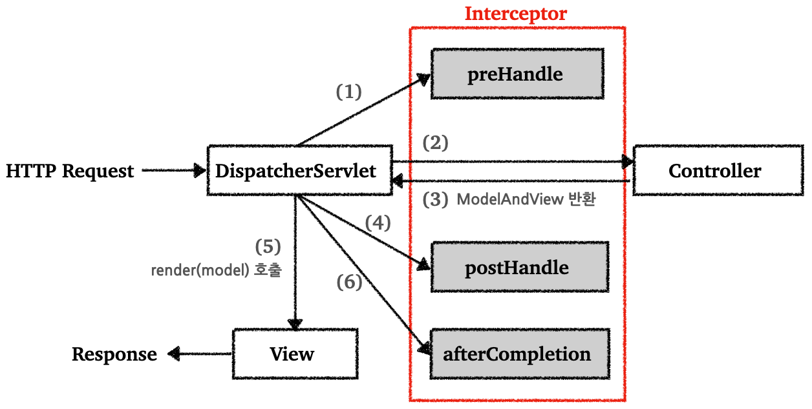
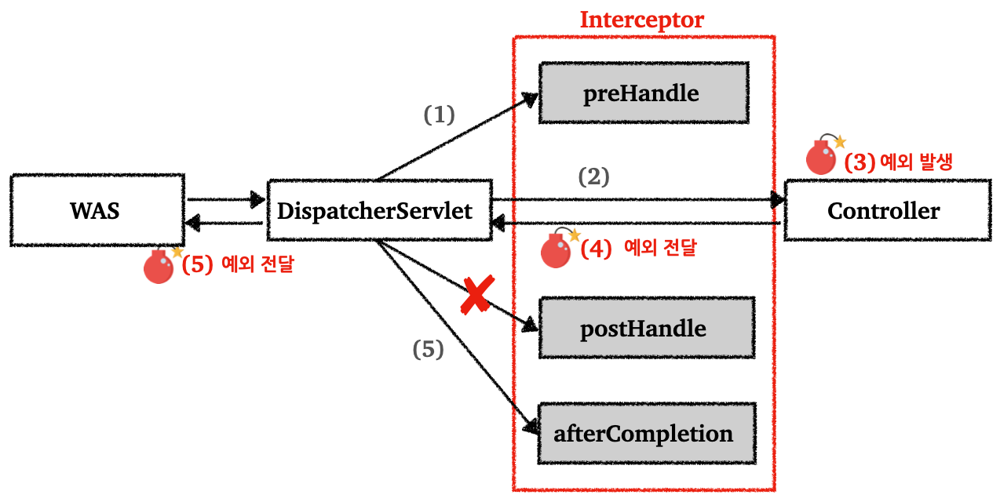

---

## 1. 서블릿 필터(Servlet Filter) 소개

필터나 인터셉터를 사용해서 공통 관심사(cross-sutting concern)에 대한 처리를 할 수 있다.

<br>

> 공통 관심사란(cross-cutting concern)?
>
> 애플리케이션 여러 로직에서 공통으로 관심을 가지고 있는 있는 사항. 이전의 예시에서는 등록, 수정, 삭제, 조회 등의 여러 로직에서 인증(로그인) 여부를 확인해야 한다(관심이 있다). 이를 필터나, 인터셉터를 이용해서 처리하지 않는다면 향후 로그인과 관련된 로직이 변경된다면, 해당 기능에 대한 코드를 많은 곳에서 수정을 해야한다.
>
> 공통 관심사는 추후에 다룰 AOP를 통해 처리할 수도 있다, 그러나 웹과 관련된 공통 관심사는 필터나 인터셉터를 통해서 처리하는 것이 좋다. 그 이유는 웹과 관련된 공통 관심사를 처리할 때는 HTTP 헤더 정보 또는 URL 정보들이 필요한데, 필터와 인터셉터는 `HttpServletRequest`를 제공한다.
{: .prompt-info }

<br>

필터의 특성은 다음과 같다.

```java
// 필터의 흐름
HTTP 요청 -> WAS -> 필터 -> 서블릿 -> 컨트롤러
```

* 필터를 적용하면 필터 호출 후 서블릿 호출
* 모든 고객의 요청 로그를 남기는 요구사항이 있다고 하면 필터 사용 가능
* 필터는 특정 URL 패턴에 적용할 수 있다
  * 예) `/*` 이라고 하면 모든 요청에 필터 적용
* 서블릿은 스프링의 디스패처 서블릿(`DispatcherServlet`)이다

<br>

```java
// 필터의 제한
// 1. 로그인 사용자인 경우
HTTP 요청 -> WAS -> 필터 -> 서블릿 -> 컨트롤러 // 로그인한 사용자
// 2. 비로그인 사용자
HTTP 요청 -> WAS -> 필터 // 필터에서 적절하기 않은 요청이라고 판단하고 서블릿을 호출하지 않는다
```

* 필터에서 요청을 판단해서, 적절하지 않다고 판단하면 거기에서 요청을 끝낼 수 있다
* 로그인 여부 체크 같은 인증에 사용 가능

<br>

```java
// 필터 체인(chain)
HTTP 요청 -> WAS -> 필터1 -> 필터2 -> 필터3 -> 서블릿 -> 컨트롤러
```

* 필터는 체인으로 구성해서, 중간에 자유롭게 필터를 추가할 수 있다
* 예) ` -> 필터1(모든 요청을 기록하는 필터) -> 필터2(로그인 체크 필터) -> `

<br>

필터 인터페이스는 다음과 같다.

```java
public interface Filter {
  
    public default void init(FilterConfig filterConfig) throws ServletException {}
  
    public void doFilter(ServletRequest request, ServletResponse response,
             FilterChain chain) throws IOException, ServletException;
  
    public default void destroy() {}
}
```

* `Filter` 인터페이스를 구현하고 등록하면 서블릿 컨테이너가 필터를 싱글통 객체로 생성하고 관리한다
* `init()` : 필터 초기화 메서드, 서블릿 컨테이너가 생성될 때 호출된다
* `doFilter()` : 고객의 요청이 올 때마다 해당 메서드가 호출된다. 여기에 필터의 로직을 구현하면 된다.
* `destroy()` : 필터 종료 메서드, 서블릿 컨테이너 종료시 호출된다

<br>

---

## 2. 필터 예시

필터를 적용해서 다음의 두 기능을 구현해보자. (대충 어떤식으로 사용하고 구현하는지 살펴보자)

* 모든 사용자 요청 로깅
* 사용자 인증(로그인) 체크

<br>

### 2.1 예시1 : 사용자 요청 로깅 

모든 사용자의 요청을 로깅해보자.

<br>

**로그 필터**

```java
@Slf4j
public class LogFilter implements Filter { // 필터를 사용하기 위해서 인터페이스 구현

    @Override
    public void init(FilterConfig filterConfig) throws ServletException {
        log.info("log filter init");
    }

    /**
  	 * HTTP 요청이 오면 doFliter 호출
     * 
     * ServletRequest request : HTTP 요청이 아닌 경우까지 고려해서 만든 인터페이스
     * HTTP 사용하는 경우 HttpServletRequest httpRequest = (HttpServletRequest) request; 처럼 다운캐스팅 사용
     */
    @Override
    public void doFilter(ServletRequest request, ServletResponse response, FilterChain chain) throws IOException, ServletException {
        log.info("log filter doFilter");

        HttpServletRequest httpRequest = (HttpServletRequest) request; // HTTP 요청 사용을 위한 다운캐스팅
        String requestURI = httpRequest.getRequestURI();

        String uuid = UUID.randomUUID().toString(); // HTTP 요청을 구분하기 위해 요청당 임의의 uuid 부여

        try {
            log.info("REQUEST [{}][{}]", uuid, requestURI); // uuid, requestURI 로깅(출력)
            chain.doFilter(request, response); // 다음 필터가 있으면 필터 호출, 없으면 서블릿 호출
            // 이 로직을 호출하지 않으면 다음 단계로 진행되지 않음
        } catch (Exception e) {
            throw e;
        } finally {
            log.info("RESPONSE [{}][{}]", uuid, requestURI);
        }

    }

    @Override
    public void destroy() {
        log.info("log filter destroy");
    }
}
```

<br>

**필터 설정**

```java
@Configuration
public class WebConfig implements WebMvcConfigurer {

    @Bean
    public FilterRegistrationBean logFilter() { // 필터 등록
        FilterRegistrationBean<Filter> filterRegistrationBean = new FilterRegistrationBean<>();
        filterRegistrationBean.setFilter(new LogFilter()); // 등록할 필터를 지정한다 (이 경우 LogFilter)
        filterRegistrationBean.setOrder(1); // 필터는 체인으로 동작, 낮을 수록 먼저 동작한다
        filterRegistrationBean.addUrlPatterns("/*"); // 필터를 적용할 URL 패턴 지정

        return filterRegistrationBean;
    }
}
```

* `@ServletComponentScan` `@WebFilter(filterName = "logFilter", urlPatterns = "/*")`로 필터 등록이 가능하지만 필터 순서 조절이 안된다, 따라서  `FilterRegistrationBean`을 사용 권장

* 필터를 등록할 때 `urlPattern`을 `/*`로 등록했기 때문에 모든 요청에 해당 필터가 적용된다

<br>

---

### 2.2 예시2 : 로그인 체크

로그인 되지 않는 사용자는 특정 페이지를 제외하고 접근하지 못하도록 하자.

<br>

**인증 체크 필터**

```java
@Slf4j
public class LoginCheckFilter implements Filter {
		
    /**
     * 인증 필터를 적용해도 특정 페이지나 리소스에는 접근이 가능해야 함
     * 화이트리스트를 만들어서, 인증과 무관하게 항상 허용하도록 한다
     * 화이트리스트를 제외한 나머지 모든 경로에는 인증 체크 로직 적용
     */
    private static final String[] whitelist = {"/", "/members/add", "/login", "/logout", "/css/*"};

    @Override
    public void doFilter(ServletRequest request, ServletResponse response, FilterChain chain) throws IOException, ServletException {

        HttpServletRequest httpRequest = (HttpServletRequest) request;
        String requestURI = httpRequest.getRequestURI();

        HttpServletResponse httpResponse = (HttpServletResponse) response;

        try {
            log.info("인증 체크 필터 시작 {}", requestURI);

            if (isLoginCheckPath(requestURI)) { // 화이트리스트를 제외한 모든 경로에 인증 체크 적용
                log.info("인증 체크 로직 실행 {}", requestURI);
                HttpSession session = httpRequest.getSession(false);
                // 만약 미인증(비로그인) 사용자라면
                if (session == null || session.getAttribute(SessionConst.LOGIN_MEMBER) == null) { 

                    log.info("미인증 사용자 요청 {}", requestURI);
                    /**
                     * 로그인으로 redirect
                     * 미인증 사용자는 로그인 화면으로 redirect
                     * 사용자 편의를 위해서, 로그인 화면으로 redirect 후에 원래보던 화면(경로)으로 다시 돌아가 주는 것이 좋다
                     * 이를 위해서, 현재 요청한 경로인 requestURI를 '/login'에 쿼리 파라미터로 전달
                     * '/login' 컨트롤러에서 로그인 성공시 해당 경로로 이동하는 기능은 추가로 개발해야 함
                     */
                    httpResponse.sendRedirect("/login?redirectURL=" + requestURI);
                    /**
                     * 미인증 사용자의 경우 다음으로 진행하지 않는다
                     * 필터를 더 이상 진행하지 않는다
                     * 서블릿, 컨트롤러도 더 이상 호출되지 않는다
                     * redirect를 사용했기 때문에, redirect가 응답으로 적용되고 요청이 끝난다
                     */
                    return;
                }
            }
          
            chain.doFilter(request, response);
        } catch (Exception e) {
            throw e; // 예외 로깅 가능 하지만, 톰캣까지 예외를 보내주어야 함
        } finally {
            log.info("인증 체크 필터 종료 {} ", requestURI);
        }
    }

    /**
     * 화이트 리스트의 경우 인증 체크X
     * 화이트리스트를 제외한 모든 경로에 인증 체크 적용
     */
    private boolean isLoginCheckPath(String requestURI) {
        return !PatternMatchUtils.simpleMatch(whitelist, requestURI);
    }
}
```

<br>

**필터 설정에 `loginCheckFilter()` 추가**

```java
@Configuration
public class WebConfig implements WebMvcConfigurer {

    // 사용자 요청 로그를 위한 필터
    @Bean
    public FilterRegistrationBean logFilter() {
        FilterRegistrationBean<Filter> filterRegistrationBean = new FilterRegistrationBean<>();
        filterRegistrationBean.setFilter(new LogFilter());
        filterRegistrationBean.setOrder(1);
        filterRegistrationBean.addUrlPatterns("/*");

        return filterRegistrationBean;
    }

    // 로그인 체크를 위한 필터 추가
    Bean
    public FilterRegistrationBean loginCheckFilter() {
        FilterRegistrationBean<Filter> filterRegistrationBean = new FilterRegistrationBean<>();
        filterRegistrationBean.setFilter(new LoginCheckFilter()); // 로그인 필터를 등록한다
        filterRegistrationBean.setOrder(2); // 순서를 2번으로 설정, 로그 필터 다음으로 적용된다
        filterRegistrationBean.addUrlPatterns("/*"); // 모든 요청에 로그인 필터를 적용한다

        return filterRegistrationBean;
    }
}
```

<br>

**로그인 컨트롤러에 로그인 성공시 처음에 요청한 URL로 이동하는 기능 추가**

```java
    // 로그인 이후 redirect 처리
    @PostMapping("/login")
    public String loginV4(@Valid @ModelAttribute LoginForm form, BindingResult bindingResult,
                          @RequestParam(defaultValue = "/") String redirectURL,
                          HttpServletRequest request) {

        if (bindingResult.hasErrors()) {
            return "login/loginForm";
        }

        Member loginMember = loginService.login(form.getLoginId(), form.getPassword());

        if (loginMember == null) {
            bindingResult.reject("loginFail", "아이디 또는 비밀번호가 맞지 않습니다.");
            return "login/loginForm";
        }

        //로그인 성공 처리
        //세션이 있으면 있는 세션 반환, 없으면 신규 세션을 생성
        HttpSession session = request.getSession();
        //세션에 로그인 회원 정보 보관
        session.setAttribute(SessionConst.LOGIN_MEMBER, loginMember);

        return "redirect:" + redirectURL;

    }
```

* `loginCheckFilter()`에서, 미인증 사용자는 요청 경로를 포함해서 `/login`에 `redirectURL` 요청 파라미터를 추가해서 요청했음, 이 값을 사용해서 로그인 성공시 해당 경로로 사용자를 `redirect` 한다

<br>

필터를 이용해서 공통 관심사를 분리해서 구현했기 때문에, 향후에 로그인 관련 부분이 변경이 되어도, 해당 부분만 수정하면 된다.

서블릿 필터는 서블릿이 제공하는 기술이라면, 다음에 설명할 인터셉터는 스프링 MVC가 제공하는 기술이다. (필터보다 인터셉터를 더 많이 사용한다)

<br>

---

## 3. 스프링 인터셉터(Interceptor) 소개

스프링 인터셉터도 서블릿 필터와 같이 웹과 관련된 공통 관심 사항을 효과적으로 해결할 수 있는 기술이다.

<br>

```java
// 인터셉터의 흐름
HTTP 요청 -> WAS -> 필터 -> 서블릿 -> 스프링 인터셉터 -> 컨트롤러
```

* 스프링 인터셉터는 디스패처 서블릿(`DispatcherServlet`)과 컨트롤러 사이에서, 컨트롤러 호출 직전에 호출 된다
* 스프링 인터셉터는 스프링 MVC가 제공하는 기능이기 때문에 결국 디스패처 서블릿 이후에 등장한다
* 인터셉터에도 URL 패턴을 적용할 수 있는데, 서블릿 URL 패턴과 다르게 매우 정밀하게 설정 가능하다

<br>

```java
// 인터셉터 제한
// 1. 로그인한 사용자
HTTP 요청 -> WAS -> 필터 -> 서블릿 -> 스프링 인터셉터 -> 컨트롤러
// 2. 비로그인(미인증) 사용자
HTTP 요청 -> WAS -> 필터 -> 서블릿 -> 스프링 인터셉터 // 인터셉터에서 적절하지 않은 요청으로 판단하고, 컨트롤러를 호출하지 않는다
```

* 필터와 유사하게 인터셉터에서 적절하지 않은 요청이라고 판단하면, 컨트롤러를 호출하지 않고 거기서 끝낼 수 있다

<br>

```java
// 인터셉터 체인(chain)
HTTP 요청 -> WAS -> 필터 -> 서블릿 -> 인터셉터1 -> 인터셉터2 -> 컨트롤러
```

* 필터와 유사하게 여러 체인으로 구성할 수 있다

<br>

설명만 보자면 인터셉터는 호출되는 순서만 다를 뿐, 필터와 제공하는 기능이 유사한 것으로 보인다. 그러나 인터셉터는 필터보다 편리하고 다양한 기능을 지원한다.

<br>

인터셉터를 사용하기 위해서 `HandlerInterceptor` 인터페이스를 구현하면 된다.

```java
public interface HandlerInterceptor {

  default boolean preHandle(HttpServletRequest request, HttpServletResponse response, Object handler)
      throws Exception { return true; }

  default void postHandle(HttpServletRequest request, HttpServletResponse response, Object handler,
      @Nullable ModelAndView modelAndView) throws Exception {}

  default void afterCompletion(HttpServletRequest request, HttpServletResponse response, Object handler,
      @Nullable Exception ex) throws Exception {}
  
}
```

* 서블릿 필터의 경우 단순하게 `doFilter()` 하나만 제공된다, 반면에 인터셉터는 호출 전(`preHandle`), 호출 후(`postHandle`), 요청 완료 이후(`afterCompletion`)와 같이 단계적으로 잘 세분화 되어 있다
* 서블릿 필터의 경우 단순히 `request` , `response`만 제공했지만, 인터셉터는 어떤 컨트롤러(`handler`)가 호출되는지 호출 정보도 받을 수 있다
* 어떤  `modelAndView`가 반환되는지 응답 정보도 받을 수 있다

<br>

**스프링 인터셉터의 호출 흐름**



<p align='center'>인터셉터 호출 흐름</p>

* `preHandle` : 컨트롤러 호출 전에 호출된다 (더 정확히는 핸들러 어댑터 호출 전에 호출된다, `HandlerAdapter` → `Controller`)
  * `preHandle`의 응답값이 `true`이면 다음으로 진행하고, `false`이면 더는 진행하지 않는다
  * `false`인 경우 나머지 인터셉터는 물론이고, 핸들러 어댑터도 호출되지 않는다


* `postHandle` : 컨트롤러 호출 후에 호출된다 (더 정확히는 핸들러 어댑터 호출 후에 호출된다)


* `afterCompletion` : 뷰가 렌더링 된 이후에 호출된다

<br>

**예외 상황에서의 호출 흐름**



<p align='center'>인터셉터 예외 상황</p>

* `preHandle` : 컨트롤러 호출 전에 호출된다
* `postHandle` : 컨트롤러에서 예외 발생시, `postHandle`은 호출되지 않는다
* `afterCompletion`은 항상 호출된다
  * 예외(`ex`)를 파라미터로 맏아서 어떤 예외가 발생했는지 로그로 출력가능
  * 예외가 발생하면 `postHandle()`은 호출되지 않기 때문에, 예외와 무관하게 공통 처리를 하기 위해서는 `afterCompletion()`을 사용해야 함

<br>

---

## 4. 인터셉터 예시

인터셉터를 사용하는 방법을 알아보자.

### 4.1 예시1 : 사용자 요청 로깅

<br>

```java
@Slf4j
public class LogInterceptor implements HandlerInterceptor {

    public static final String LOG_ID = "logId";

    @Override
    public boolean preHandle(HttpServletRequest request, HttpServletResponse response, Object handler) throws Exception {

        String requestURI = request.getRequestURI();
        String uuid = UUID.randomUUID().toString(); // 요청 로그를 구분하기 위한 uuid 생성

        /**
         * 서블릿 필터의 경우 지역변수로 해결가능했지만, 스프링 인터셉터는 호출 시점이 완전히 분리되어 있다
         * preHandle()에서 지정한 값을 postHandle(), afterCompletion()에서 함께 사용하기 위해서는 어딘가에 담아둬야함
         * LogInterceptor도 싱글톤 처럼 사용되기 때문에 멤버변수를 사용하는 것은 위험하다
         * 따라서 request에 담는다
         * 이 값은 afterCompletion에서 request.getAttribute(LOG_ID)로 찾아서 사용가능
         */
        request.setAttribute(LOG_ID, uuid);

        // @RequestMapping: HandlerMethod
        // 정적 리소스가 호출되는 경우 ResourceHttpRequestHandler
        if (handler instanceof HandlerMethod) {
            HandlerMethod hm = (HandlerMethod) handler; // 호출할 컨트롤러 메서드의 모든 정보가 포함되어 있다
        }

        log.info("REQUEST [{}][{}][{}]", uuid, requestURI, handler);
        return true; // true면 정상 호출, 다음 인터셉터나 컨트롤러가 호출된다
    }

    @Override
    public void postHandle(HttpServletRequest request, HttpServletResponse response, Object handler, ModelAndView modelAndView) throws Exception {
        log.info("postHandle [{}]", modelAndView);
    }

    /**
     * 종료 로그를 afterCompletion에서 실행하는 이유는, 예외가 발생할 경우 postHandle이 호출되지 않기 때문 
     */
    @Override
    public void afterCompletion(HttpServletRequest request, HttpServletResponse response, Object handler, Exception ex) throws Exception {
        String requestURI = request.getRequestURI();
        String logId = (String) request.getAttribute(LOG_ID);
        log.info("RESPONSE [{}][{}][{}]", logId, requestURI, handler);
        if (ex != null) {
            log.error("afterCompletion error!!", ex);
        }

    }
}
```

<br>

**인터셉터 등록**

```java
@Configuration
public class WebConfig implements WebMvcConfigurer {

    @Override
    public void addInterceptors(InterceptorRegistry registry) {
        registry.addInterceptor(new LogInterceptor()) // 인터셉터 등록
                .order(1) // 호출 순서 지정, 낮을수록 먼저 호출된다
                .addPathPatterns("/**") // 인터셉터를 적용할 URL 패턴 지정
                .excludePathPatterns("/css/**", "/*.ico", "/error"); // 인터셉터에서 제외할 패턴을 지정
    }

}
```

* `WebMvcConfigurer`가 제공하는 `addInterceptors()`를 사용해서 인터셉터를 등록할 수 있다
* `.excludePathPatterns("/css/**", "/*.ico", "/error");` : 이전의 필터에서는 화이트리스트를 만들어서 경로를 제외했다면, 인터셉터에서는 인터셉터를 등록하면서 패턴을 정밀하게 설정이 가능하다
* `PagePattern` 문서 : [https://docs.spring.io/spring-framework/docs/current/javadoc-api/org/springframework/web/util/pattern/PathPattern.html](https://docs.spring.io/spring-framework/docs/current/javadoc-api/org/springframework/web/util/pattern/PathPattern.html)

<br>

---

### 4.2 예시2 : 로그인 체크

**로그인 체크 인터셉터**

```java
@Slf4j
public class LoginCheckInterceptor implements HandlerInterceptor {

@Override
public boolean preHandle(HttpServletRequest request, HttpServletResponse response, 
                         Object handler) throws Exception {

        String requestURI = request.getRequestURI();

        log.info("인증 체크 인터셉터 실행 {}", requestURI);

        HttpSession session = request.getSession();

        if (session == null || session.getAttribute(SessionConst.LOGIN_MEMBER) == null) {
            log.info("미인증 사용자 요청");
            //로그인으로 redirect
            response.sendRedirect("/login?redirectURL=" + requestURI);
            return false;
        }

        return true;
    }
}
```

* 인증이라는 것은 컨트롤러 호출 전에만 호출되면 된다, 따라서 `preHandle`만 구현하면 된다

<br>

**로그인 인터셉터 추가**

```java
@Override
public void addInterceptors(InterceptorRegistry registry) {
    // 로그 인터셉터
    registry.addInterceptor(new LogInterceptor())
            .order(1)
            .addPathPatterns("/**")
            .excludePathPatterns("/css/**", "/*.ico", "/error");
				
    // 로그인 체크 인터셉터
    registry.addInterceptor(new LoginCheckInterceptor())
            .order(2)
            .addPathPatterns("/**") // 적용할 패턴
            .excludePathPatterns("/", "/members/add", "/login", "/logout",
                    "/css/**", "/*.ico", "/error"); // 제외할 패턴
}
```

* `.addPathPatterns("/**")` : 모든 경로에 인터셉터를 적용한다

---

## Reference

1. [스프링 MVC - 백엔드 웹 개발 핵심 기술](https://www.inflearn.com/course/%EC%8A%A4%ED%94%84%EB%A7%81-mvc-1)
2. [Udemy - Spring Boot 3, Spring 6 & Hibernate](https://www.udemy.com/course/spring-hibernate-tutorial/?couponCode=ST8MT40924)