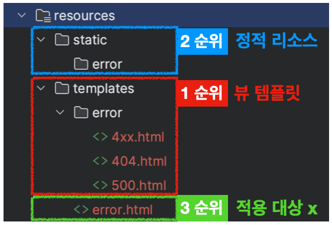
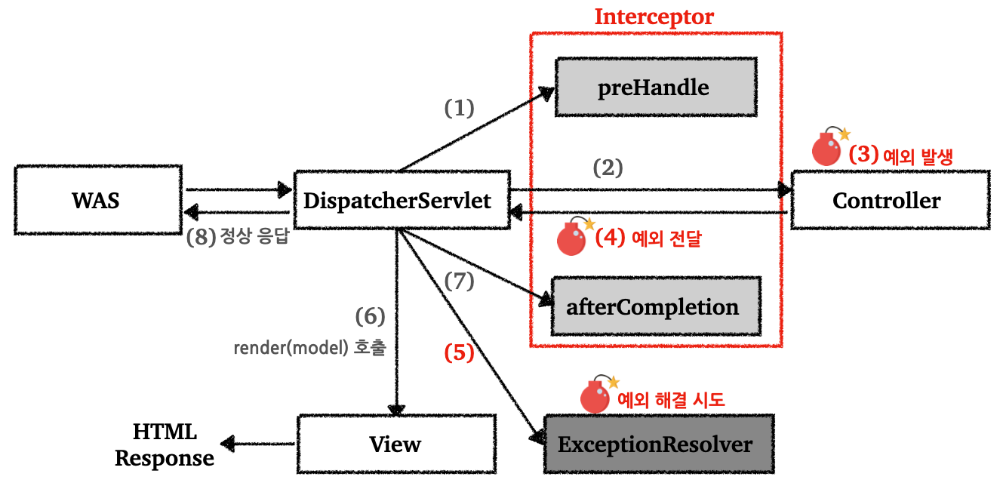
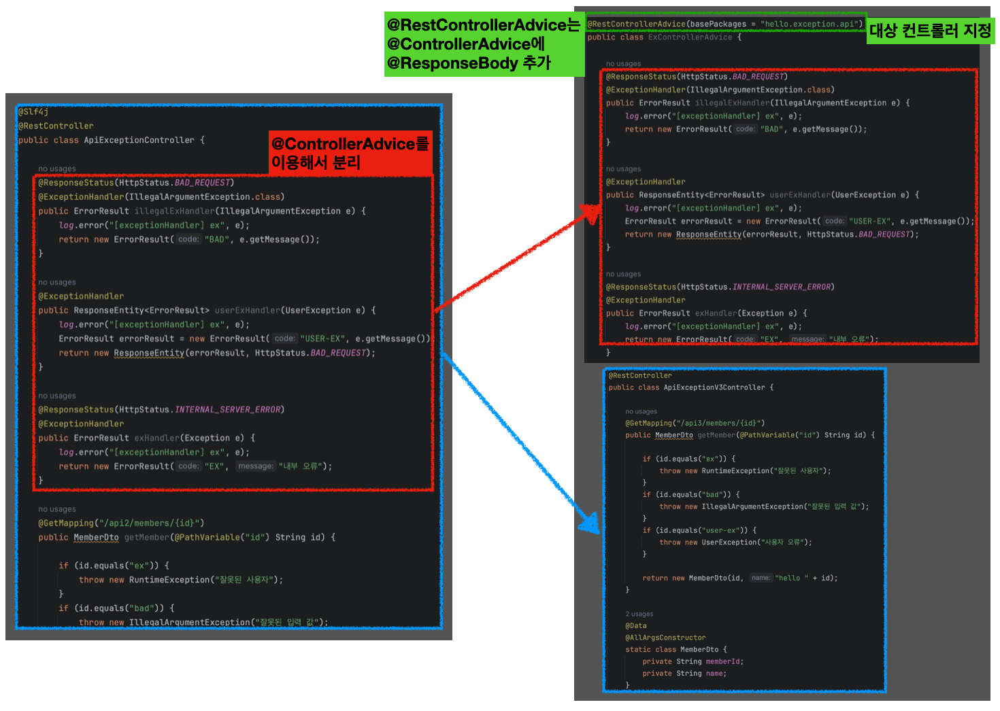

---

## 1. 서블릿에서의 예외 처리

스프링이 아닌 순수 서블릿 컨테이너에서의 예외 처리에 대해서 알아보자.

<br>

서블릿은 2가지 방식으로 예외 처리를 지원한다.

* `Exception`

  * 자바에서 `main()`을 직접 실행하는 경우, `main`이라는 이름의 스레드가 실행된다. 예외가 발생해서 `main()`에서 처리하지 못하면 `main()` 밖으로 예외가 던져지고 해당 스레드는 종료된다.

  * 웹 애플리케이션에서는 사용자 요청별로 스레드가 할당되고, 서블릿 컨테이너 안에서 실행된다. 애플리케이션에서 예외를 잡지 못하고, 서블릿 밖까지 예외가 전달되는 경우를 살펴보자.

  * ```
    WAS(여기까지 전파) <- 필터 <- 서블릿 <- 인터셉터 <- 컨트롤러(예외발생)
    ```

  * 예외가 WAS(톰캣)까지 전달되면 톰캣이 기본으로 제공하는 오류 화면이 출력되는 것을 확인할 수 있다


* `response.sendError(HTTP_STATUS_CODE, errorMessage)`

  * 오류 발생 시  `HttpServletResponse`가 제공하는 `sendError`라는 메서드 사용 가능

  * `sendError()`의 흐름은 다음과 같다

  * ```
    WAS(sendError 호출 기록 확인) <- 필터 <- 서블릿 <- 인터셉터 <- 컨트롤러(response.sendError())
    ```

  * `response.sendError()`를 호출하면 `response` 내부에는 오류가 발생했다는 상태를 저장해둔다

  * 서블릿 컨테이너는 고객에게 응답 전에 `response`에 `sendError()`가 호출되었는지 확인한다

  * 호출되었다면 설정한 오류 코드에 맞추어 기본 오류 페이지를 보여준다

<br>

서블릿 컨테이너가 제공하는 기본 예외 처리 화면은 사용자가 보기에 불편하고, 의미를 파악하기 어렵다. 의미가 있는 오류 화면을 제공하기 위해서는 서블릿이 제공하는 오류 화면 기능을 사용해야 한다.

<br>

**서블릿 페이지 오류 등록**

```java
@Component
public class WebServerCustomizer implements WebServerFactoryCustomizer<ConfigurableWebServerFactory> {
    @Override
    public void customize(ConfigurableWebServerFactory factory) {

        ErrorPage errorPage404 = new ErrorPage(HttpStatus.NOT_FOUND, "/error-page/404");
        ErrorPage errorPage500 = new ErrorPage(HttpStatus.INTERNAL_SERVER_ERROR, "/error-page/500");

        ErrorPage errorPageEx = new ErrorPage(RuntimeException.class, "/error-page/500");

        factory.addErrorPages(errorPage404, errorPage500, errorPageEx);
    }
}
```

<br>

**오류를 컨트롤할 컨트롤러**

```java
@Slf4j
@Controller
public class ErrorPageController {

    @RequestMapping("/error-page/404")
    public String errorPage404(HttpServletRequest request, HttpServletResponse response) {
        log.info("errorPage 404");
        return "error-page/404";
    }

    @RequestMapping("/error-page/500")
    public String errorPage500(HttpServletRequest request, HttpServletResponse response) {
        log.info("errorPage 500");
        return "error-page/500";
    }
}
```

<br>

**예외 발생과 오류 페이지 요청 흐름**

1. `WAS(여기까지 전파)` ← `필터` ← `서블릿` ← `인터셉터` ← `컨트롤러(예외발생)`
2. `WAS에서 /error-page/500 다시 요청` → `필터` → `서블릿` → `인터셉터` → `컨트롤러(/error-page/500)`→ `View`

<br>

서블릿에서의 예외 발생과 오류 페이지 요청에서 오류 페이지를 출력하기 위해 WAS 내부에서 다시 한번 호출이 발생하는 비효율적인 과정들이 포함된다. 서블릿은 이를 해결하기 위해 `DispatcherType`이라는 정보를 제공한다. 이 정보를 통해서 실제 고객이 요청한 것인지, 서버가 내부에서 오류 페이지를 요청하는 것인지 구분할 수 있다. 이 정보를 사용해서 필터의 중복 호출을 제거할 수 있다. (인터셉터의 경우 스프링이 제공하는 기능이라서, 중복 호출을 제거하기 위해서는 오류 페이지 경로를 `excludePathPatterns`를 사용해서 빼주면 된다)

<br>

---

## 2. 스프링 부트에서 제공하는 오류 페이지 기능

### 2.1 오류 페이지 사용

서블릿에서 예외 처리 페이지를 만들기 위해서 다음과 같은 복잡한 과정을 거쳤다.

* `WebServerCustomizer`에서 예외 종류에 따라 `ErrorPage` 등록
* 예외 처리용 `ErrorPageController` 만들기
* 필요한 경우 오류 정보를 `request`의 `attribute`에 추가해서 넘겨주기
* 뿐만 아니라, 에러 페이지를 위한 요청도 WAS에서 다시 한번 호출이 발생하는 등, 비효율적인 과정들이 포함되어 있다

<br>

스프링 부트는 이런 과정을 모두 기본으로 제공한다.

* `ErrorPage` 를 자동으로 등록한다, 이때 `/error` 라는 경로로 기본 오류 페이지를 설정한다
  * `new ErrorPage("/error")` , 상태코드와 예외를 설정하지 않을 경우 `/error` 에서의 기본 오류 페이지 사용


* `BasicErrorController` 라는 스프링 컨트롤러를 자동으로 등록한다
  * `ErrorPage` 에서 등록한 `/error` 를 매핑해서 처리하는 컨트롤러

<br>

스프링 부트가 제공하는 기본 오류 메커니즘을 사용하면 오류가 발생했을 때 오류 페이지로 `/error` 를 기본 요청한다. 스프링 부트가 자동 등록한 `BasicErrorController`는 이 경로를 기본으로 받는다. 이제 개발자는 오류 페이지만 우선순위에 따라서 등록하기만 하면 된다.

<br>



<p align='center'>스프링 부트 기본 오류 페이지 기능</p>

* 해당 경로 위치에 HTTP 상태 코드 이름의 뷰 파일을 넣으면 된다
* 우선 순위
  * `뷰 템플릿` > `정적 리소스`
  * `구체적` > `덜 구체적`
  * 예) `400.html` > `4xx.html`

<br>

---

### 2.2 BasicErrorController가 제공하는 정보

`BasicErrorController` 컨트롤러는 다음 정보를 model에 담아서 뷰에 전달한다. 뷰 템플릿에서 이 값을 활용해 출력할 수 있다.

```
* timestamp: Fri Feb 05 00:00:00 KST 2021
* status: 400
* error: Bad Request
* exception: org.springframework.validation.BindException * trace: 예외 trace
* message: Validation failed for object='data'. Error count: 1
* errors: Errors(BindingResult)
* path: 클라이언트 요청 경로 (`/hello`)
```

<br>

**뷰에 오류 정보 추가**

```html
<ul>
<li>오류 정보</li> 
  <ul>
             <li th:text="|timestamp: ${timestamp}|"></li>
             <li th:text="|path: ${path}|"></li>
             <li th:text="|status: ${status}|"></li>
             <li th:text="|message: ${message}|"></li>
             <li th:text="|error: ${error}|"></li>
             <li th:text="|exception: ${exception}|"></li>
             <li th:text="|errors: ${errors}|"></li>
             <li th:text="|trace: ${trace}|"></li>
	</ul>
</li> 
</ul>
```

* 오류 정보들을 고객에게 노출하는 것은 좋지 않다
* 오류 정보를 `model`에 포함할지의 여부를 선택 할 수 있다

<br>

`application.properties`

```properties
server.error.include-exception=false
server.error.include-message=never
server.error.include-stacktrace=never
server.error.include-binding-errors=never
```

* `never` : 사용하지 않음
* `always` : 항상 사용
* `on_param` : 파라미터가 있을 때 사용

<br>

**스프링 부트 오류 관련 옵션**

`application.properties`

```properties
# 오류 처리 화면을 못 찾을 시, 스프링 whitelabel 오류 페이지 적용
server.error.whitelabel.enabled=true
# 오류 페이지 경로
server.error.path=/error 
# 스프링이 자동 등록하는 서블릿 글로벌 오류 페이지 경로, BasicErrorController 오류 컨트롤러 경로와 함께 사용
```

<br>

---

## 3. API 예외 처리

HTML 페이지의 경우 지금까지 설명했던 것 처럼 4xx, 5xx와 같은 오류 페이지만 있으면 대부분의 문제를 해결할 수 있다.

API의 경우는 생각할 내용이 더 많다. 오류 페이지는 단순히 고객에게 오류 화면을 보여주고 끝이지만, API는 각 오류 상황에 맞는 오류 응답 스펙을 정하고, JSON으로 데이터를 내려주어야 한다.

API의 예외 처리에 대해서 알아보자.

<br>

---

### 3.1 HandlerExceptionResolver 소개

API 예외 처리도 스프링 부트가 제공하는 `BasicErrorController`를 사용할 수 있다. 스프링 부트는 `BasicErrorController` 가 제공하는 기본 정보들을 활용해서 오류 API를 생성해준다. 

`BasicErrorController`는 HTML 페이지를 제공하는 경우에 편리하다. 그러나 API 오류 처리의 경우 다르다. API 마다, 각각의 컨틀롤러나 예외 마다 서로 다른 응답 결과를 출력해야할 수도 있다.

* 예) 회원 관련 API에서의 예외와 상품 관련 API에서의 예외인지에 따라 결과를 다르게 보내야할 수 있다

쉽게 말해서 매우 세밀하고 복잡하게 컨트롤해야 한다. 물론 `BasicErrorController`를 확장하면 JSON 메시지도 변경할 수 있다, 그러나 `@ExceptionHadler`가 제공하는 기능을 사용하는 것이 더 나은 방법이다.

<br>

스프링 MVC는 컨트롤러 밖으로 예외가 던져진 경우 예외를 해결하고, 동작을 새로 정의할 수 있는 방법을 제공한다. 컨트롤러 밖으로 던져진 예외를 해결하고, 동작 방식을 변경하고 싶은 경우 `HandlerExceptionResolver`를 사용하면 된다.

<br>



<p align='center'>ExceptionResolver 적용</p>

* `ExceptionResolver`로 예외를 해결해도 `postHandle()`은 호출되지 않는다
* `HandlerExceptionResolver` 인터페이스를 구현해서 커스텀 예외 처리 로직을 설정할 수 있다
  * 그러나 직접 구현하는 것은 복잡하기 때문에, 스프링이 제공하는 `ExceptionResolver`를 사용하는 경우가 많다
  * 그 중에서도 `ExceptionHandlerExceptionResolver`를 제일 많이 사용한다


* 쉽게 설명하자면, 애플리케이션에서 요청에 대한 예외가 발생할 때, `DispatcherServlet`은 이를 해결할 수 있는 `HandlerExceptionResolver`를 찾고 맞는 `ExceptionResolver`를 찾으면, 해당 리졸버는 예외에 대한 처리 로직을 실행한다
* 이런 `ExceptionResolver`를 사용하면 예외 처리에 대한 코드 유지 보수가 좋아진다

<br>

---

### 3.2 스프링이 제공하는 ExceptionResolver

스프링 부트가 제공하는 `ExceptionResolver`는 다음과 같다.

`HandlerExceptionResolverComposite` 에 다음 순서로 등록된다.

1. `ExceptionHandlerExceptionResolver`
   * 제일 많이 사용
   * `@ExceptionHandler`를 통해서 사용

2. `ResponseStatusExceptionResolver`
   * 다음의 2가지 경우 처리
     * `@ResponseStatus`가 달려있는 예외
     * `ResponseStatusException` 예외

3. `DefaultHandlerExceptionResolver`
   * 스프링 내부에서 발생하는 스프링 예외를 해결
   * 예) 파라미터 바인딩 시점에 타입이 맞지 않으면 내부에서 `TypeMismatchException`이 발생
   * `DefaultHandlerExceptionResolver`로 스트링 내부 오류를 어떻게 처리할지 정의되어 있음

<br>

---

#### 3.2.1 @ResponseStatus

`ResponseStatusExceptionResolver`는 예외에 따라 HTTP 상태 코드를 지정해준다.

다음의 두 가지 경우를 처리한다.

* `@ResponseStatus`가 달려있는 예외
* `ResponseStatusException` 예외

<br>

먼저 `@ResponseStatus`가 달려있는 예외를 살펴보자.

`BadRequestException`이라는 커스텀 예외를 만들었다고 가정해보자. 다음과 같이 `@ResponseStatus` 애노테이션을 추가하면 지정한 HTTP 상태 코드로 응답을 준다.

<br>

```java
@ResponseStatus(code = HttpStatus.BAD_REQUEST, reason = "잘못된 요청 오류") 
public class BadRequestException extends RuntimeException {
}
```

* 해당 예외가 컨트롤러 밖으로 던져지는 경우 `@ResponseStatus` 애노테이션을 확인해서 오류 코드를 `HttpStatus.BAD_REQUEST`로 변경하고, `reason`의 메세지까지 담는다
* 참고로 `reason = "error.bad"`와 같은 형식으로 사용해서 메세지 소스(`messages.properties`)에 메세지를 설정해서 사용할 수 있다

<br>

`BasRequestException`을 발생시켜서 별도로 잡아서 처리하지 않으면 다음의 응답을 받을 수 있다.

```json
{
    "status": 400,
    "error": "Bad Request",
    "exception": "hello.exception.exception.BadRequestException", 
    "message": "잘못된 요청 오류",
    "path": "/api/response-status-ex1"
}
```


<br>

---

#### 3.2.2 @ExceptionHandler

지금까지 소개한 `BasicErrorController`를 사용하거나 `HandlerExceptionResolver`를 직접 구현하는 방식으로 API 예외를 다루기는 쉽지않다.

<br>

API 예외 처리의 어려운 점.

* `HandlerExceptionResolver`를 떠올려 보면 `ModelAndView`를 반환해야 했다. API 응답에는 필요하지 않다.
* API 응답을 위해서 `HttpServletResponse` 에 직접 응답 데이터를 넣어주었다. 이것은 매우 불편하다.
* 특정 컨트롤러에서만 발생하는 예외를 별도로 처리하기 어렵다
  * 회원관리 컨트롤러 vs 상품관리 컨트롤러에서 서로 다르게 처리하고 싶은 경우

<br>

스프링은 API 예외 처리 문제를 해결하기 위해 `@ExceptionHandler`라는 애노테이션을 사용하는 편리한 예외 처리 기능을 제공한다. 이것이 `ExceptionHandlerExceptionResolver`다.

* `@ExceptionHandler`을 처리한다
* API 예외 처리는 대부분 이 기능으로 해결한다
* 우선 순위가 제일 높다

<br>

`@ExceptionHandler`의 사용법을 알아보자.

```java
@Data
@AllArgsConstructor
public class ErrorResult {
    private String code;
    private String message;
}
```

* `ErrorResult` : 예외가 발생했을 때 API 응답으로 사용하는 객체

<br>

```java
@Slf4j
@RestController
public class ApiExceptionV2Controller {

    /**
     * 컨트롤러를 호출한 결과 IllegalArgumentException 예외가 컨트롤러 밖으로 던져진다
     * 예외가 발생했기 때문에 ExceptionResolver가 작동한다
     * 우선순위가 제일 높은 ExceptionHandlerExceptionResolver 실행
     * ExceptionHandlerExceptionResolver는 해당 컨트롤러에 IllegalArgumentException을 처리할 수 있는 @ExceptionHandler가 있는지 확인한다
     * illegalExHandler() 실행
     * @RestController이므로 illegalExHandle()에도 @ResponseBody가 적용된다
     * HttpConverter가 사용되고, 응답이 JSON으로 반환된다
     * @ResponseStatus를 HTTP 상태 코드 400 지정(400으로 응답)
     */
    @ResponseStatus(HttpStatus.BAD_REQUEST)
    @ExceptionHandler(IllegalArgumentException.class)
    public ErrorResult illegalExHandler(IllegalArgumentException e) {
        log.error("[exceptionHandler] ex", e);
        return new ErrorResult("BAD", e.getMessage());
    }

    /**
     * @ExceptionHandler에 예외를 지정하지 않으면 해당 메서드 파라미터 예외를 사용한다(UserException 사용)
     * ResponseEntity를 사용해서 HTTP 메세지 바디에 직접 응답(HttpConverter 사용됨)
     * ResponseEntity를 사용하면 HTTP 응답 코드를 프로그래밍해서 동적으로 변경할 수 있다
     */
    @ExceptionHandler
    public ResponseEntity<ErrorResult> userExHandler(UserException e) {
        log.error("[exceptionHandler] ex", e);
        ErrorResult errorResult = new ErrorResult("USER-EX", e.getMessage());
        return new ResponseEntity(errorResult, HttpStatus.BAD_REQUEST);
    }
		
    /**
     * RuntimeException 발생, 컨트롤러 밖으로 RuntimeException이 던져짐
     * RuntimeException은 Exception의 자식이기 때문에 이 메서드가 호출된다
     * HTTP 상태 코드 500으로 응답
     */
    @ResponseStatus(HttpStatus.INTERNAL_SERVER_ERROR)
    @ExceptionHandler
    public ErrorResult exHandler(Exception e) {
        log.error("[exceptionHandler] ex", e);
        return new ErrorResult("EX", "내부 오류");
    }

    @GetMapping("/api2/members/{id}")
    public MemberDto getMember(@PathVariable("id") String id) {

        if (id.equals("ex")) {
            throw new RuntimeException("잘못된 사용자");
        }
        if (id.equals("bad")) {
            throw new IllegalArgumentException("잘못된 입력 값");
        }
        if (id.equals("user-ex")) {
            throw new UserException("사용자 오류");
        }

        return new MemberDto(id, "hello " + id);
    }

    @Data
    @AllArgsConstructor
    static class MemberDto {
        private String memberId;
        private String name;
    }
}
```

* `@ExceptionHandler` 예외 처리 방법
  * `@ExceptionHandler` 애노테이션을 선언하고, 해당 컨트롤러에서 처리하고 싶은 예외를 지정해주면 된다
  * 해당 컨트롤러에서 예외가 발생하면 이 메서드가 호출된다
  * 지정한 예외 그리고 그 예외의 자식 클래스를 모두 잡는다
* 뒤에서 살펴보겠지만 보통 `@ControllerAdvice`를 이용한 `ExceptionHandler` 클래스를 따로 만들어서 해당 클래스의 메서드에 `@ExceptionHandler`를 붙여서 사용하는 경우가 많다


* `@ExceptionHandler` 문서 : [https://docs.spring.io/spring-framework/reference/web/webmvc/mvc-controller/ann-exceptionhandler.html#mvc-ann-exceptionhandler-args](https://docs.spring.io/spring-framework/reference/web/webmvc/mvc-controller/ann-exceptionhandler.html#mvc-ann-exceptionhandler-args)

<br>

---

### 3.3 @ControllerAdvice

`@ExceptionHandler`를 사용해서 예외를 깔끔하게 처리할 수 있게 되었지만, 정상 코드와 예외 처리 코드가 하나의 컨트롤러에 섞여 있다. `@ControllerAdvice` 또는 `@RestControllerAdvice`를 사용하면 둘을 분리할 수 있다.

<br>



<p align='center'>@ControllerAdvice 적용</p>

* `@ControllerAdvice`는 대상으로 지정한 여러 컨트롤러에 `@ExceptionHandler` , `@InitBinder` 기능을 부여해주는 역할
* `@ControllerAdvice`에 대상을 지정하지 않으면 모든 컨트롤러에 적용된다(글로벌 적용)
* `@RestControllerAdvice`는 `@ControllerAdvice`와 같고, `@ResponseBody`가 추가되어 있다

<br>

**대상 컨트롤러 지정 방법**

```java
// Target all Controllers annotated with @RestController
// 특정 컨트롤러 단위
@ControllerAdvice(annotations = RestController.class)
public class ExampleAdvice1 {}

// Target all Controllers within specific packages
// 특정 패키지 단위
@ControllerAdvice("org.example.controller")
public class ExampleAdvice2 {}

// Target all Controllers assignable to specific classes
// 특정 클래스 단위
@ControllerAdvice(assignableTypes = {ControllerInterface.class, AbstractController.class})
public class ExampleAdvice3 {}
```

<br>

---

## Reference

1. [스프링 MVC - 백엔드 웹 개발 핵심 기술](https://www.inflearn.com/course/%EC%8A%A4%ED%94%84%EB%A7%81-mvc-1)
2. [Udemy - Spring Boot 3, Spring 6 & Hibernate](https://www.udemy.com/course/spring-hibernate-tutorial/?couponCode=ST8MT40924)
