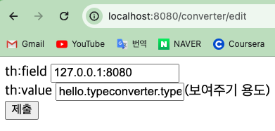

---

## 스프링 타입 컨버터(Converter)

문자를 숫자로 변경하거나, 객체를 문자로 변환하거나 등, 애플리케이션을 개발하다 보면 타입을 변환해야 하는 경우가 많다. 스프링에서의 타입 변환에 대해서 알아보자.

<br>

개발자가 새로운 타입을 만들어서 변환하고 싶은 경우, 스프링이 제공하는 `Converter`라는 확장 가능한 인터페이스를 사용할 수 있다.

```java
package org.springframework.core.convert.converter;

public interface Converter<S, T> {
   T convert(S source);
}
```

* 개발자는 추가적인 타입 변환이 필요한 경우 이 컨버터 인터페이스를 구현해서 등록하면 된다

<br>

문자를 숫자로 바꾸는 타입 컨버터를 만들어보자.

```java
@Slf4j
public class StringToIntegerConverter implements Converter<String, Integer> {

    @Override
    public Integer convert(String source) {
        log.info("convert source={}", source);
        return Integer.valueOf(source);
    }
}
```

* 소스는 `String`
* 숫자를 반환
* 반대의 경우도 비슷하게 구현하면 된다

<br>

그러면 이번에는 사용자 정의 타입에 대한 컨버터를 만들어보자.

`127.0.0.1:8080`과 같이 `IP`, `PORT`를 입력하면 `IpPort` 객체로 변환하는 컨버터를 만들어보자.

```java
@Getter
@EqualsAndHashCode
public class IpPort {

    private String ip;
    private int port;

    public IpPort(String ip, int port) {
        this.ip = ip;
        this.port = port;
    }
}
```

* Lombok의  `@EqualsAndHashCode`를 넣으면 모든 필드를 사용해서 `equals()` , `hashcode()`를 생성한다
  * 쉽게 말해서, 모든 필드의 값이 같다면  `a.equals(b)`의 결과가 참이 된다

<br>

`String` → `IpPort` 컨버터

```java
@Slf4j
public class StringToIpPortConverter implements Converter<String, IpPort> {

    @Override
    public IpPort convert(String source) {
        log.info("convert source={}", source);
        //"127.0.0.1:8080" -> IpPort 객체
        String[] split = source.split(":"); // ":"를 기준으로 문자열 split
        String ip = split[0];
        int port = Integer.parseInt(split[1]);
        return new IpPort(ip, port);
    }
}
```

* `127.0.0.1:8080` 같은 `String`으로 이루어진 주소를 입력하면 `IpPort` 객체로 만들어서 반환

<br>

 `IpPort` → `String` 컨버터

```java
@Slf4j
public class IpPortToStringConverter implements Converter<IpPort, String> {
    @Override
    public String convert(IpPort source) {
        log.info("convert source={}", source);
        //IpPort 객체 -> "127.0.0.1:8080"
        return source.getIp() + ":" + source.getPort();
    }
}
```

* `IpPort` 객체를 `127.0.0.1:8080` 같은 문자로 반환하다

<br>

위의 예시에서는 `String`에서 `Integer`로 변환하는 컨버터를 구현했다. 그러나 사실 스프링은 문자, 숫자, 불린, enum등 일반적인 타입에 대한 대부분의 컨버터를 기본으로 제공한다. 관련 구현체를 찾아보면 수 많은 컨버터를 확인할 수 있다. 

물론 개발자가 직접 만든 타입(클래스)에 대한 컨버터는 직접 구현해야한다.

<br>

---

## ConversionService

이제 만든 컨버터들을 하나하나 찾아서 사용하는 것은 불편하다. 스프링은 개별 컨버터들을 모아두고, 편리하게 사용할 수 있는 `ConversionService`라는 기능을 제공한다.

<br>

`ConversionService` 인터페이스

```java
public interface ConversionService {

  boolean canConvert(@Nullable Class<?> sourceType, Class<?> targetType);
  boolean canConvert(@Nullable TypeDescriptor sourceType, TypeDescriptor targetType);

  @Nullable
  <T> T convert(@Nullable Object source, Class<T> targetType);

  @Nullable
  Object convert(@Nullable Object source, @Nullable TypeDescriptor sourceType, TypeDescriptor targetType);

}
```

<br>

`ConversionService` 사용하기

```java
public class ConversionServiceTest {

    @Test
    void conversionService() {
        // 등록
        DefaultConversionService conversionService = new DefaultConversionService();
        conversionService.addConverter(new StringToIntegerConverter());
        conversionService.addConverter(new IntegerToStringConverter());
        conversionService.addConverter(new StringToIpPortConverter());
        conversionService.addConverter(new IpPortToStringConverter());

        // 사용
        assertThat(conversionService.convert("10", Integer.class)).isEqualTo(10);
        assertThat(conversionService.convert(10, String.class)).isEqualTo("10");

        IpPort ipPort = conversionService.convert("127.0.0.1:8080", IpPort.class);
        assertThat(ipPort).isEqualTo(new IpPort("127.0.0.1", 8080));

        String ipPortString = conversionService.convert(new IpPort("127.0.0.1", 8080), String.class);
        assertThat(ipPortString).isEqualTo("127.0.0.1:8080");

    }
}
```

* `DefaultConversionService`는 추가로 컨버를 등록하는 기능도 제공
* 컨버터를 등록하는 입장에서는 컨버터를 정확히 알아야하지만, 사용하는 입장에서는 컨버터를 몰라도 된다
* `IpPort ipPort = conversionService.convert("127.0.0.1:8080", IpPort.class);`
  * 변환할 값, 목표 타입만 입력하면 변환(물론 변환할 수 있는 컨버터가 존재해야함)

<br>

---

## Converter 사용하기

웹 애플리케이션에 `Converter`를 사용해보자.

<br>

`WebConfig`에 컨버터 등록.

```java
@Configuration
public class WebConfig implements WebMvcConfigurer {

    @Override
    public void addFormatters(FormatterRegistry registry) {
        registry.addConverter(new StringToIntegerConverter());
        registry.addConverter(new IntegerToStringConverter());
        registry.addConverter(new StringToIpPortConverter());
        registry.addConverter(new IpPortToStringConverter());
    }
}
```

* 스프링 내부에서 `ConversionService` 제공
* `WebMvcConfigurer`가 제공하는 `addFormatters()`를 사용해서 컨버터를 등록하면 된다

<br>

이제 뷰 템플릿에 컨버터를 적용해보자.

```java
@Controller
public class ConverterController {

    @GetMapping("/converter-view")
    public String converterView(Model model) {
        model.addAttribute("number", 10000);
        model.addAttribute("ipPort", new IpPort("127.0.0.1", 8080));
        return "converter-view";
    }

}
```

* `Model`에 숫자 `10000` 그리고 `ipPort` 객체를 담아서 뷰템플릿에 전달

<br>

```html
<!DOCTYPE html>
<html xmlns:th="http://www.thymeleaf.org">
<head>
    <meta charset="UTF-8">
    <title>Title</title>
</head>
<body>
<ul>
    <li>${number}: <span th:text="${number}" ></span></li>
    <li>${{number}}: <span th:text="${{number}}" ></span></li>
    <li>${ipPort}: <span th:text="${ipPort}" ></span></li>
    <li>${{ipPort}}: <span th:text="${{ipPort}}" ></span></li>
</ul>

</body>
</html>
```

```
${number}: 10000
${{number}}: 10000
${ipPort}: hello.typeconverter.type.IpPort@59cb0946
${{ipPort}}: 127.0.0.1:8080
```

* `${{}}` : 자동으로 `ConversionService`를 사용해서 변환된 결과를 출력해준다 (스프링과 통합된 기능을 사용하는 것임)

<br>

이번에는 컨버터를 폼(Form)에 적용해보자.

```java
@Controller
public class ConverterController {

    // 생략 ...	
  
    @GetMapping("/converter/edit")
    public String converterForm(Model model) {
        IpPort ipPort = new IpPort("127.0.0.1", 8080);
        Form form = new Form(ipPort);
        model.addAttribute("form", form);
        return "converter-form";
    }

    @PostMapping("/converter/edit")
    public String converterEdit(@ModelAttribute Form form, Model model) {
        IpPort ipPort = form.getIpPort();
        model.addAttribute("ipPort", ipPort);
        return "converter-view";
    }

    @Data
    static class Form {
        private IpPort ipPort;

        public Form(IpPort ipPort) {
            this.ipPort = ipPort;
        }
    }
}
```

* `GET /converter/edit` : `IpPort` 를 뷰 템플릿 폼에 출력한다
* `POST /converter/edit` : 뷰 템플릿 폼의 `IpPort` 정보를 받아서 출력한다

<br>

```html
<!DOCTYPE html>
<html xmlns:th="http://www.thymeleaf.org">
<head>
    <meta charset="UTF-8">
    <title>Title</title>
</head>
<body>

<form th:object="${form}" th:method="post">
    th:field <input type="text" th:field="*{ipPort}"><br/>
    th:value <input type="text" th:value="*{ipPort}">(보여주기 용도)<br/>
    <input type="submit"/>
</form>

</body>
</html>
```



* 타임리프의 `th:field`에는 컨버전 서비스 기능도 포함한다

<br>

---

## Formatter

`Converter` 는 입력과 출력 타입에 제한이 없는, 범용 타입 변환 기능을 제공한다. 그러나 보통 문자를 다른 객체로 변환하거나, 객체를 문자로 변환하는 경우가 대다수이다.

객체를 특정한 포멧에 맞추어 문자로 출력하거나 또는 그 반대의 역할을 하는 것에 특화된 기능을 가진것이 `Formatter`이다.

* 문자에 특화(객체 → 문자, 문자 → 객체)
* 현지화(Locale) 정보 사용 가능
  * 예) 날짜나 숫자의 표현 방법이 Locale 마다 다를 수 있음

<br>

다음은 `Formatter` 인터페이스이다.

```java
public interface Printer<T> {
     String print(T object, Locale locale);
}

public interface Parser<T> {
     T parse(String text, Locale locale) throws ParseException;
}

public interface Formatter<T> extends Printer<T>, Parser<T> {
}
```

* `String print(T object, Locale locale)` : 객체를 문자로 변경한다
* `T parse(String text, Locale locale)` : 문자를 객체로 변경한다

<br>

이제 `Formatter`를 만들어보자.

숫자 `1000`을 문자 `1,000`으로 변환해주는 포맷을 적용하고, 그 반대 과정도 처리해주는 `Formatter`를 구현해보자.

```java
@Slf4j
public class MyNumberFormatter implements Formatter<Number> {


    @Override
    public Number parse(String text, Locale locale) throws ParseException {
        log.info("text={}, locale={}", text, locale);
        //"1,000" -> 1000 (문자를 숫자로)
        NumberFormat format = NumberFormat.getInstance(locale);
        return format.parse(text);
    }

    @Override
    public String print(Number object, Locale locale) {
        // 객체를 문자로
        log.info("object={}, locale={}", object, locale);
        return NumberFormat.getInstance(locale).format(object);
    }
}
```

* `"1,000"` 처럼 숫자 중간의 쉼표를 적용하기 위해서 자바가 기본으로 제공하는 `NumberFormat` 객체를 사용하면 된다
  * `Locale` 정보를 활용해서 나라별로 다른 숫자 포맷을 적용할 수 있다

<br>

---

## FormattingConversionService

기존의 `ConversionService`에는 컨버터만 등록할 수 있고, 포맷터는 등록할 수 없다.

`FormattingConversionService`를 사용하면 내부에서 어댑터 패턴을 사용해서 `Formatter`가 `Converter` 처럼 동작하도록 지원한다.

쉽게 말해서 `FormattingConversionService`를 사용해야 포맷터를 등록해서 사용할 수 있다.

<br>

```java
public class FormattingConversionServiceTest {

    @Test
    void formattingConversionService() {
        DefaultFormattingConversionService conversionService = new DefaultFormattingConversionService();
        //컨버터 등록
        conversionService.addConverter(new StringToIpPortConverter());
        conversionService.addConverter(new IpPortToStringConverter());
        //포멧터 등록
        conversionService.addFormatter(new MyNumberFormatter());

        //컨버터 사용
        IpPort ipPort = conversionService.convert("127.0.0.1:8080", IpPort.class);
        assertThat(ipPort).isEqualTo(new IpPort("127.0.0.1", 8080));
        //포멧터 사용
        assertThat(conversionService.convert(1000, String.class)).isEqualTo("1,000");
        assertThat(conversionService.convert("1,000", Long.class)).isEqualTo(1000L);

    }
}
```

* `FormattingConversionService` 는 `ConversionService` 관련 기능을 상속받기 때문에 컨버터, 포맷터 둘 모두 등록 가능

<br>

애플리케이션에서 사용할 수 있도록, `WebConfig`에 등록해보자.

```java
@Configuration
public class WebConfig implements WebMvcConfigurer {

    @Override
    public void addFormatters(FormatterRegistry registry) {
        // registry.addConverter(new StringToIntegerConverter());
        // registry.addConverter(new IntegerToStringConverter());
        registry.addConverter(new StringToIpPortConverter());
        registry.addConverter(new IpPortToStringConverter());

        // 추가
        registry.addFormatter(new MyNumberFormatter());
    }
}
```

* 우선 순위는 `Converter` > `Formatter`이다. 위의 `MyNumberFormatter`도 문자와 숫자간 변환이 일어나기 때문에, 위의 주석 처리한 컨버터들과 기능이 겹친다. 만약 주석 처리한 컨버터들의 주석을 해제하면, 컨버터의 우선순위가 항상 높기 때문에 포맷터가 적용되지 않고 컨버터가 적용된다. 주의하자!

<br>

---

## 스프링 제공 Formatter

스프링은 자바에서 기본으로 제공하는 타입들에 대해 수 많은 포맷터를 기본으로 제공한다.

또한 스프링은 애노테이션 기반으로 원하는 형식을 지정해서 사용할 수 있는 유용한 포맷터 2 가지를 제공한다.

* `@NumberFormat` : 숫자 관련 형식 지정 포맷터 사용
* `@DateTimeFormat` : 날짜 관련 형식 지정 포맷터 사용

<br>

다음과 같이 사용하면 된다.

```java
@Data
static class Form {
    @NumberFormat(pattern = "##,##")
    private Integer number;

    @DateTimeFormat(pattern = "yyyy-MM-dd HH:mm:ss")
    private LocalDateTime localDateTime;
}
```

<br>

---

## Reference

1. [스프링 MVC - 백엔드 웹 개발 핵심 기술](https://www.inflearn.com/course/%EC%8A%A4%ED%94%84%EB%A7%81-mvc-1)
2. [Udemy - Spring Boot 3, Spring 6 & Hibernate](https://www.udemy.com/course/spring-hibernate-tutorial/?couponCode=ST8MT40924)
