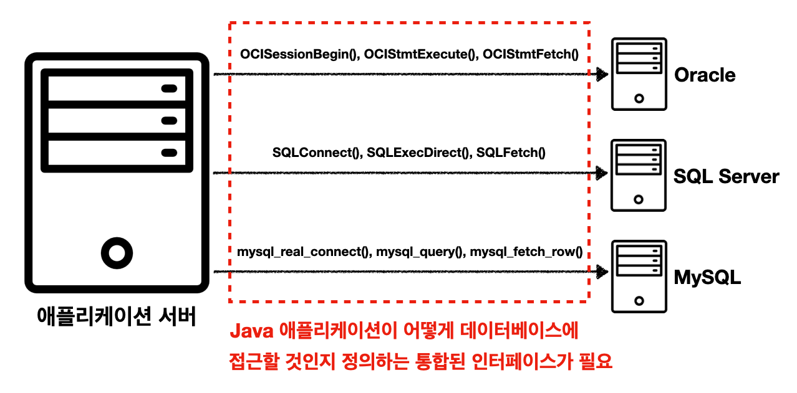

---

## 1. JDBC(Java Database Connectivity) 소개

JDBC의 등장 배경부터 살펴보자.

기존 자바 애플리케이션에서 데이터베이스에 접근하기 위해서는 특정 벤더가 제공해주는 API를 사용했다 (또는 ODBC). 문제는 이런 데이터베이스의 사용법은 각각의 벤더마다 달랐다.

<br>



<p align='center'>JDBC 이전</p>

이러한 문제를 해결하기 위해서 JDBC라는 자바 표준 인터페이스가 등장한다.

<br>


<p align='center'>JDBC 인터페이스</p>

* JDBC(Java Database Connectivity)는 자바에서 데이터베이스에 접속할 수 있도록 하는 자바 API 인터페이스이다
* JDBC는 데이터베이스에서 자료를 쿼리하거나 업데이트하는 방법을 제공한다


* JDBC는 다음 3가지 기능을 표준 인터페이스로 정의해서 제공한다
  * `java.sql.Connection` - 연결
  * `java.sql.Statement` - SQL을 담은 내용
  * `java.sql.ResultSet` - SQL 요청 응답


* JDBC에는 `JDBC-ODBC bridge Driver`, `Native-API Driver`, `Network Protocol Driver`, `Thin Driver` 의 4가지 드라이버가 존재한다. 여기서 `Thin Driver`를 보편적으로 많이 사용한다
* 참고 : [https://www.javatpoint.com/jdbc-driver#](https://www.javatpoint.com/jdbc-driver#)

<br>


<p align='center'>JDBC 이후</p>

* JDBC 인터페이스를 사용하기 위해서는 각 DB 벤더에서 DB에 맞게 구현한 라이브러리로 제공한다. 이를 JDBC 드라이버라고 한다.
* JDBC의 등장으로 2가지 문제가 해결되었다
  * 데이터베이스 벤더를 변경시 애플리케이션 서버의 데이터베이스 코드도 변경해야하는 문제. 애플리케이션은 JDBC 인터페이스만 의존하기 때문에, 구현 라이버러리만 변경하고 애플리케이션 서버의 코드를 유지할 수 있다
  * 각 벤더사의 사용법을 새로 익혀야 했던 문제

<br>

> JDBC의 한계
>
> * 각각의 데이터베이스 마다 SQL이나 데이터타입의 사용법이 일부 다르다
> * JDBC 코드는 변경하지 않더라도, SQL은 해당 데이터베이스에 맞게 사용해야 한다
> * 반복되는 보일러 플레이트(boiler-plate) 코드가 많다
>
> <br>
>
> 추후에도 설명하겠지만 이를 위해서 SQL Mapper 기술인 JdbcTemplate 그리고 ORM 기술인 JPA(Java Persistence API)를 사용할 수 있다.
>
> 이런 기술들도 결국에 JDBC를 이용해서 동작하기 때문에, JDBC의 사용법을 알아두는 것은 중요하다.
{: .prompt-info }

<br>

---

## 2. JDBC 사용 - 1(`DriverManager`)

JDBC의 사용법에 대해서 알아보자. (`DriverManager` 사용)

먼저 MySQL 컨테이너를 만들고 스프링 부트 애플리케이션에 연결해보자.

<br>

>  [컨테이너를 설정하고 실행하는 방법](https://seungki1011.github.io/posts/docker-2-using-docker/)

<br>

`build.gradle`에 `runtimeOnly 'com.mysql:mysql-connector-j'` 추가

```groovy
dependencies {
	  implementation 'org.springframework.boot:spring-boot-starter-jdbc'
	  implementation 'org.springframework.boot:spring-boot-starter-web'
  
	  runtimeOnly 'com.mysql:mysql-connector-j' // 추가
  
    compileOnly 'org.projectlombok:lombok'
	  annotationProcessor 'org.projectlombok:lombok'
	  testImplementation 'org.springframework.boot:spring-boot-starter-test'

	  testCompileOnly 'org.projectlombok:lombok'
	  testAnnotationProcessor 'org.projectlombok:lombok'
}
```

<br>

데이터베이스 이름은 `test_database`로 하자.

`resources/schema.sql` 파일을 만들자.

```sql
drop table if exists member;

create table member (
     member_id varchar(10),
     money integer not null default 0,
     primary key (member_id)
);

insert into member(member_id, money) values ('hi1',10000);
insert into member(member_id, money) values ('hi2',20000);
```

* 초기 데이터 입력은 `data.sql`에 정의하는것이 권장 되지만, 편의상 `schema.sql`에 작성 했다

<br>

`member` 테이블을 조회하면 다음과 같이 쿼리 결과가 나와야한다.

```
mysql> select * from member;
+-----------+-------+
| member_id | money |
+-----------+-------+
| hi1       | 10000 |
| hi2       | 20000 |
+-----------+-------+
```

<br>

---

### 2.1 데이터베이스 연결

JDBC의 `DriverManager`를 통한 연결에 대해서 알아보자.

<br>


* MySQL 드라이버는 JDBC의 `java.sql.Connection` 인터페이스를 구현한 `com.mysql.cj.jdbc.ConnectionImpl`이라는 구현체를 제공한다

<br>


<p align='center'>DriverManager 커넥션 요청 흐름</p>

* `DriverManager`는 라이브러리에 등록된 데이터베이스 드라이버들을 관리하고, 커넥션을 획득하는 기능을 제공한다

<br>

이제 데이터베이스에 연결하기 위한 코드를 작성해보자.

MySQL 데이터베이스에 접속하기 위한 상수 정의.

```java
public abstract class ConnectionConst {
  
    public static final String URL = "jdbc:mysql://localhost:3306/test_database?serverTimezone=Asia/Seoul";
    public static final String USERNAME = "root";
    public static final String PASSWORD = "admin";

}
```

* 뒤에서 다루겠지만, 스프링 부트를 이용하는 경우 `application.properties`에 데이터베이스의 속성을 설정하고, `DataSource`를 의존성 주입으로 받아서 사용가능(이걸 스프링 부트가 전부 자동으로 처리해준다)
* 쉽게 말해서 `application.properties`에 엔드포인트 등의 설정을 등록하면 `DataSource`를 자동으로 생성해준다

<br>

JDBC를 사용해서 실제로 데이터베이스 연결하는 코드를 작성해보자.

```java
@Slf4j
public class DBConnectionUtil {
  
    public static Connection getConnection() {
        Connection connection = null;
        try {
            // ConnectionConst 상수 static import 처리
            connection = DriverManager.getConnection(URL, USERNAME, PASSWORD);
            log.info("get connection={}, class={}", connection, connection.getClass());
            return connection;
        } catch (SQLException e) {
            throw new IllegalStateException(e);
        }
    }
}
```

* 데이터베이스에 연결하기 위해서 JDBC가 제공하는 `DriverManager.getConnection()`을 사용한다
* `getConnection()`은 라이브러리에 있는 데이터베이스 드라이버를 찾아서 해당 드라이버가 제공하는 커넥션을 반환한다

<br>

동작을 확인하기 위한 테스트 코드를 작성해보자.

```java
@Slf4j
public class DBConnectionUtilTest {

    @Test
    void connection() {
        Connection connection = DBConnectionUtil.getConnection();
        Assertions.assertThat(connection).isNotNull();
    }
}
```

```
[main] INFO de.jdbc.connection.DBConnectionUtil -- get connection=com.mysql.cj.jdbc.ConnectionImpl@c94fd30, class=class com.mysql.cj.jdbc.ConnectionImpl
```

* `com.mysql.cj.jdbc.ConnectionImpl` : MySQL 드라이버가 제공하는 MySQL 전용 커넥션

<br>

---

### 2.2 등록(`insert`)

`Member` 데이터를 데이터베이스에 등록하는 기능을 JDBC를 사용해서 개발해보자.

<br>

```java
@Data
@NoArgsConstructor
public class Member {

    private String memberId;
    private int money;

}
```

* 롬복의 `@Data` :  `@RequiredArgsConstructor`, `@Getter`, `@Setter`, `@ToString`, `@EqualsAndHashCode` 포함
  * 실제로 개발할 때 사용하는 것은 권장하지 않는다

* `memberId` : 회원의 아이디
* `money` : 회원이 소지한 금액

<br>

회원 객체를 데이터베이스에 저장하는 코드를 작성해보자.

```java
/**
 * DriverManager 사용
 */
@Slf4j
public class DriverManagerMemberRepository {

    public Member save(Member member) throws SQLException {
        String sql = "insert into member(member_id, money) values(?, ?)";

        Connection con = null;
        PreparedStatement pstmt = null;

        try {
            con = getConnection();
            pstmt = con.prepareStatement(sql);
            // 파라미터 바인딩
            pstmt.setString(1, member.getMemberId());
            pstmt.setInt(2, member.getMoney());
          	// 쿼리 실행
            pstmt.executeUpdate();
            return member;
        } catch (SQLException e) {
            log.error("db error", e);
            throw e;
        } finally {
            // 외부 자원 해제
            close(con, pstmt, null);
        }

    }

    // 할당된 자원의 해제 과정 중에 예외 발생에 대한 처리를 해야 안정적인 코드
    private void close(Connection con, Statement stmt, ResultSet rs) {
        
        if(rs != null) {
            try {
                rs.close();
            } catch (SQLException e) {
                log.info("error", e);
            }
        }
        if(stmt != null) {
            try {
                stmt.close();
            } catch (SQLException e) {
                log.info("error", e);
            }
        }
        if(con != null) {
            try {
                con.close();
            } catch (SQLException e) {
                log.info("error", e);
            }
        }
    }
		
    private static Connection getConnection() {
        return DBConnectionUtil.getConnection();
    }
}
```

* `getConnection()`
  * ``DBConnectionUtil`를 통해서 데이터베이스 커넥션을 획득한다
  * `sql` : 데이터베이스에 전달할 쿼리 정의


* `con.prepareStatement(sql)`
  * 데이터베이스에 전달할 SQL과 파라미터로 전달할 데이터들을 준비한다
  * 각 `?`에 바인딩할 값을 지정한다
  


* `pstmt.executeUpdate()`
  * `Statement`를 통해 준비된 `sql`을 커넥션을 통해 데이터베이스에 전달한다
  * 데이터 추가, 변경에는 `executeUpdate()` 사용하면 된다
  


* `close()`
  * 쿼리 실행후 리소스를 정리한다. 리소스 정리는 항상 역순으로 진행된다.
  * `ResultSet`은 나중에 결과 조회 때 사용한다
  


* SQL 인젝션을 방지하기 위해서 `PreparedStatement`의  `?`를 통한 파라미터 바인딩 방식을 사용한다

<br>

> 쿼리 인젝션(SQL Injection)
>
> SQL 인젝션(SQL 삽입, SQL 주입으로도 불린다)은 코드 인젝션의 한 기법으로 클라이언트의 입력값을 조작하여 서버의 데이터베이스를 공격할 수 있는 공격방식을 말한다. 주로 사용자가 입력한 데이터를 제대로 필터링, 이스케이핑하지 못했을 경우에 발생한다.
{: .prompt-info }


<br>

---

### 2.3 조회(`select`)

데이터베이스에 저장한 데이터를 조회하는 기능을 개발해보자.

<br>

회원을 조회하는 코드를 추가하자.

```java
public Member findById(String memberId) throws SQLException {
    String sql = "select * from member where member_id = ?";

    Connection con = null;
    PreparedStatement pstmt = null;
    ResultSet rs = null;

    try {
        con = getConnection();
        pstmt = con.prepareStatement(sql);
        pstmt.setString(1, memberId);
        // 데이터 조회를 위해서는 executeQuery() 사용 
        rs = pstmt.executeQuery();
				
      	// 목적은 회원 하나를 찾아서 조회
        if (rs.next()) {
            Member member = new Member();
            member.setMemberId(rs.getString("member_id"));
            member.setMoney(rs.getInt("money"));
            return member;
        } else {
            throw new NoSuchElementException("member not found! memberId = " + memberId);
        }
    } catch (SQLException e) {
        log.error("DB error", e);
        throw e;
    } finally {
        close(con, pstmt, rs);
    }
}
```

* `executeQuery()`는 결과를 `ResultSet`에 담아서 반환한다
* `ResultSet`의 모양은 아래 그림과 같다

<br>


* `findById()`의 목적은 회원 하나를 찾아서 조회하는 것이기 때문에, `if`를 사용해서 `member` 반환

<br>

---

### 2.4 수정, 삭제(`update`, `delete`)

데이터베이스에 등록된 데이터를 수정 또는 삭제해보자.

<br>

다음 코드를 추가하자.

```java
public void update(String memberId, int money) throws SQLException {
    String sql = "update member set money=? where member_id=?";

    Connection con = null;
    PreparedStatement pstmt = null;

    try {
        con = getConnection();
        pstmt = con.prepareStatement(sql);
        pstmt.setInt(1, money);
        pstmt.setString(2, memberId);
        int resultSize = pstmt.executeUpdate();
        log.info("resultSize = {}", resultSize);
    } catch (SQLException e) {
        log.error("DB error", e);
    } finally {
        close(con, pstmt, null);
    }
}

public void delete(String memberId) throws SQLException {
    String sql = "delete from member where member_id=?";

    Connection con = null;
    PreparedStatement pstmt = null;

    try {
        con = getConnection();
        pstmt = con.prepareStatement(sql);
        pstmt.setString(1, memberId);
        pstmt.executeUpdate();
    } catch (SQLException e) {
        log.error("DB error", e);
        throw e;
    } finally {
        close(con, pstmt, null);
    }
}
```

* `executeUpdate()`은 쿼리 실행 후 영향받은 로우(row)의 수를 반환한다
  * 위의 경우에서는 회원 하나의 데이터만 변경하기 때문에 `1`을 반환한다

<br>

---

### 2.5 테스트 코드로 동작 확인

테스트 코드로 지금까지 작성한 기능들의 동작을 확인해보자.

```java
@Slf4j
class DriverManagerMemberRepositoryTest {

    DriverManagerMemberRepository repository = new DriverManagerMemberRepository();

    @Test
    void crud() throws SQLException {
        // save()
        Member member = new Member("member1", 10000);
        repository.save(member);

        // findById()
        Member findMember = repository.findById(member.getMemberId());
        log.info("findMember = {}", findMember);
        Assertions.assertThat(findMember).isEqualTo(member);

        // update()
        // money : 10000 -> 30000으로 수정
        repository.update(member.getMemberId(), 30000);
        Member updatedMember = repository.findById(member.getMemberId());
        Assertions.assertThat(updatedMember.getMoney()).isEqualTo(30000);

        // delete()
        repository.delete(member.getMemberId());
        Assertions.assertThatThrownBy(() -> repository.findById(member.getMemberId()))
                .isInstanceOf(NoSuchElementException.class);
    }
}
```

<br>

---

## 3. JDBC 사용 - 2(DBCP)

### 3.1 DBCP(커넥션 풀) 소개

데이터베이스 커넥션 방법인 DBCP(Database Connection Pool)에 대해서 알아보자.

먼저 기존 데이터베이스 커넥션 방법의 단점에 대해서 알아보자.

<br>


<p align='center'>기존 커넥션 방식</p>

* 커넥션 획득 과정은 `TCP/IP` 연결 및 해제를 포함한 복잡한 과정을 거친다
* 매요청 마다 커넥션을 새로 만들어야 하고 `TCP/IP`의 연결도 획득해야하기 때문에 결과적으로 응답 속도에 영향을 준다
* 이런 문제를 해결하기 위해서 `커넥션 풀(DBCP)`이라는 방법을 사용한다

<br>

커넥션 풀을 다음 그림을 통해서 알아보자.


<p align='center'>DBCP</p>

* `커넥션 풀`은 이름 그대로, 커넥션들을 미리 만들어두고 풀에 모아두는 방식이다
* `커넥션 풀`에 들어있는 커넥션은 TCP/IP로 연결이 되어있는 상태이기 때문에 언제든지 쿼리를 DB에 전달 가능하다
* 기존 커넥션을 획득하던 방법과 달리, `커넥션 풀`을 통해 이미 생성되어 있는 커넥션을 객체 참조로 가져다 쓰면 된다
* 애플리케이션 로직은 `커넥션 풀`에서 받은 커넥션을 이용해서 쿼리를 전달하고 결과를 처리한다
* 이제 커넥션 종료(`close()`)는 커넥션을 `커넥션 풀`로 다시 돌려주는 것이다


* `커넥션 풀`로 얻을 수 있는 이점이 크기 때문에 실무에서는 기본으로 사용한다
* `커넥션 풀`에서 설정하는 `maximumPoolSize`나 데이터베이스에서 설정할 수 있는 `max_connections`과 같은 값은 성능 테스트를 통해서 정해야 한다

<br>

> `커넥션 풀`을 구현한 오픈소스 중에서 `hikariCP`를 주로 사용한다
{: .prompt-info }

<br>

---

### 3.2 데이터소스(DataSource)

커넥션 풀을 사용하는 방법에 대해서 알아보기 전에 `DataSource` 인터페이스에 대해서 알아보자.

커넥션을 얻는 방법은 앞서 소개한 JDBC `DriverManager`를 직접 사용하거나, `커넥션 풀`을 사용하는 등 다양한 방법이 존재한다.

만약 우리가 커넥션을 획득하는 방법을 `DriverManager`에서 `커넥션 풀`로 변경한다면, 해당 애플리케이션 코드로 변경해야 한다. 자바는 이런 문제를 해결하기 위해서 `DataSource`라는 인터페이스를 제공한다. `DataSource` 인터페이스는 커넥션을 획득하는 방법을 추상화한 인터페이스이다.

<br>


<p align='center'>DataSource 인터페이스</p>

<br>

그럼 간단하게 `DataSource`가 적용된 `DriverManager`인 `DriverManagerDataSource`를 사용하는 테스트 코드를 작성해보자. (스프링이 제공하는 코드임)

```java
@Slf4j
public class DriverManagerDataSourceTest {

    @Test
    void driverManager() throws SQLException {
        Connection con1 = DriverManager.getConnection(URL, USERNAME, PASSWORD);
        Connection con2 = DriverManager.getConnection(URL, USERNAME, PASSWORD);
        log.info("connection={}, class={}", con1, con1.getClass());
        log.info("connection={}, class={}", con2, con2.getClass());
    }

    @Test
    void dataSourceDriverManager() throws SQLException {
        DriverManagerDataSource dataSource = new DriverManagerDataSource(URL, USERNAME, PASSWORD);
        useDataSource(dataSource);
    }

    private void useDataSource(DataSource dataSource) throws SQLException {
        Connection con1 = dataSource.getConnection();
        Connection con2 = dataSource.getConnection();
        log.info("connection={}, class={}", con1, con1.getClass());
        log.info("connection={}, class={}", con2, con2.getClass());
    }
  
}
```

```
14:38:55.167 [main] INFO de.jdbc.connection.DriverManagerDataSourceTest -- connection=com.mysql.cj.jdbc.ConnectionImpl@2c4d1ac, class=class com.mysql.cj.jdbc.ConnectionImpl
14:38:55.168 [main] INFO de.jdbc.connection.DriverManagerDataSourceTest -- connection=com.mysql.cj.jdbc.ConnectionImpl@2ef14fe, class=class com.mysql.cj.jdbc.ConnectionImpl
14:38:55.210 [main] INFO de.jdbc.connection.DriverManagerDataSourceTest -- connection=com.mysql.cj.jdbc.ConnectionImpl@3d1848cc, class=class com.mysql.cj.jdbc.ConnectionImpl
14:38:55.210 [main] INFO de.jdbc.connection.DriverManagerDataSourceTest -- connection=com.mysql.cj.jdbc.ConnectionImpl@7dda48d9, class=class com.mysql.cj.jdbc.ConnectionImpl
```

* `Connection con1 = DriverManager.getConnection(URL, USERNAME, PASSWORD);`
  * 기존 `DriverManager`를 사용했을때는 커넥션을 획득할 때 마다 필요한 파라미터를 계속 명시했어야 한다


* `DriverManagerDataSource dataSource = new DriverManagerDataSource(URL, USERNAME, PASSWORD);`
* `Connection con1 = dataSource.getConnection();`
  * `DataSource`를 사용하는 방식은 처음 객체 생성때만 파라미터를 명시하고, 커넥션 획득 시에는 단순히 `dataSource.getConnection()`으로 획득 가능 함 


* `DataSource`를 사용하는 방식은 필요한 속성을 설정하는 곳과 사용하는 곳을 분리할 수 있도록 해준다

<br>

`application.properties`

```properties
spring.application.name=jdbc
# spring 2.5.x 부터 deprecated
# spring.datasource.initialization-mode=always
# 애플리케이션 시작시 schema.sql 적용
spring.sql.init.mode=always
spring.datasource.driver-class-name=com.mysql.cj.jdbc.Driver
# 3306 포트의 mysql의 test_database라는 엔드포인트 설정
# 스프링 부트는 아래의 속성으로 DataSource 자동 빈 등록
spring.datasource.url=jdbc:mysql://localhost:3306/test_database?serverTimezone=Asia/Seoul
spring.datasource.username=root
spring.datasource.password=admin
```

* 스프링 부트는 `DataSource`를 스프링 빈에 자동으로 등록한다
* 이때 스프링 부트는 `application.properties`에 있는 속성을 이용해서 `DataSource`를 생성한다

<br>

---

### 3.3 커넥션 풀 사용하기(`HikariDataSource`)

기존에 사용하던 코드를 `HikariCP`를 사용하도록 작성해보자.

먼저 `DataSource`를 적용해보자.

<br>

```java
/**
 * DataSource, JdbcUtils 사용
 */
@Slf4j
public class CPMemberRepository {
		
    private final DataSource dataSource;
		// DataSource 주입받아서 사용
    public CPMemberRepository(DataSource dataSource) {
        this.dataSource = dataSource;
    }

    public Member save(Member member) throws SQLException {
        String sql = "insert into member(member_id, money) values(?, ?)";

        Connection con = null;
        PreparedStatement pstmt = null;

        try {
            con = getConnection();
            pstmt = con.prepareStatement(sql);
            pstmt.setString(1, member.getMemberId());
            pstmt.setInt(2, member.getMoney());
            pstmt.executeUpdate();
            return member;
        } catch (SQLException e) {
            log.error("db error", e);
            throw e;
        } finally {
            close(con, pstmt, null);
        }
    }

    public void update(String memberId, int money) throws SQLException {
        String sql = "update member set money=? where member_id=?";

        Connection con = null;
        PreparedStatement pstmt = null;

        try {
            con = getConnection();
            pstmt = con.prepareStatement(sql);
            pstmt.setInt(1, money);
            pstmt.setString(2, memberId);
            int resultSize = pstmt.executeUpdate();
            log.info("resultSize = {}", resultSize);
        } catch (SQLException e) {
            log.error("DB error", e);
        } finally {
            close(con, pstmt, null);
        }
    }

    public void delete(String memberId) throws SQLException {
        String sql = "delete from member where member_id=?";

        Connection con = null;
        PreparedStatement pstmt = null;

        try {
            con = getConnection();
            pstmt = con.prepareStatement(sql);
            pstmt.setString(1, memberId);

            pstmt.executeUpdate();
        } catch (SQLException e) {
            log.error("DB error", e);
            throw e;
        } finally {
            close(con, pstmt, null);
        }
    }

    public Member findById(String memberId) throws SQLException {
        String sql = "select * from member where member_id = ?";

        Connection con = null;
        PreparedStatement pstmt = null;
        ResultSet rs = null;

        try {
            con = getConnection();
            pstmt = con.prepareStatement(sql);
            pstmt.setString(1, memberId);
            rs = pstmt.executeQuery();

            if (rs.next()) {
                Member member = new Member();
                member.setMemberId(rs.getString("member_id"));
                member.setMoney(rs.getInt("money"));
                return member;
            } else {
                throw new NoSuchElementException("member not found! memberId = " + memberId);
            }
        } catch (SQLException e) {
            log.error("DB error", e);
            throw e;
        } finally {
            close(con, pstmt, rs);
        }
    }

    // JdbcUtils로 close를 편리하게 구현
    private void close(Connection con, Statement stmt, ResultSet rs) {
        JdbcUtils.closeResultSet(rs);
        JdbcUtils.closeStatement(stmt);
        JdbcUtils.closeConnection(con);
    }

    private Connection getConnection() throws SQLException {
        Connection con = dataSource.getConnection();
        log.info("get connection={}, class={}", con, con.getClass());
        return con;
    }
}
```

* 외부에서 `DataSource`를 주입받아서 사용하도록 변경했다
* `JdbcUtils`를 통해서 `close()`를 더 편리하게 구현

<br>

`DataSource`를 사용하는 `CPMemberRepository`에 `HikariDataSource`를 사용하는 테스트 코드를 작성해보자.

```java
@Slf4j
class CPMemberRepositoryTest {

    // DataSource를 주입받아서 사용할 것이다
    // DriverManagerMemberRepository repository = new DriverManagerMemberRepository();

    CPMemberRepository repository;
  
    @BeforeEach
    void beforeEach() throws Exception {
        HikariDataSource dataSource = new HikariDataSource();
        dataSource.setJdbcUrl(URL);
        dataSource.setUsername(USERNAME);
        dataSource.setPassword(PASSWORD);
      
        dataSource.setMaximumPoolSize(10);
        dataSource.setPoolName("MyPool");

        // CPMemberRepository는 DataSource 주입이 필요하다
        repository = new CPMemberRepository(dataSource);
    }

    @Test
    void crud() throws SQLException {
        // save()
        Member member = new Member("member1", 10000);
        repository.save(member);

        // findById
        Member findMember = repository.findById(member.getMemberId());
        Assertions.assertThat(findMember).isEqualTo(member);

        // update()
        // money : 10000 -> 30000으로 수정
        repository.update(member.getMemberId(), 30000);
        Member updatedMember = repository.findById(member.getMemberId());
        Assertions.assertThat(updatedMember.getMoney()).isEqualTo(30000);

        // delete()
        repository.delete(member.getMemberId());
        Assertions.assertThatThrownBy(() -> repository.findById(member.getMemberId()))
                .isInstanceOf(NoSuchElementException.class);
    }
}
```

```
15:24:28.246 [main] INFO com.zaxxer.hikari.HikariDataSource -- MyPool - Starting...
15:24:28.458 [main] INFO com.zaxxer.hikari.pool.HikariPool -- MyPool - Added connection com.mysql.cj.jdbc.ConnectionImpl@4b6e2263
15:24:28.458 [main] INFO com.zaxxer.hikari.HikariDataSource -- MyPool - Start completed.
15:24:28.460 [main] INFO de.jdbc.repository.CPMemberRepository -- get connection=HikariProxyConnection@1866229258 wrapping com.mysql.cj.jdbc.ConnectionImpl@4b6e2263, class=class com.zaxxer.hikari.pool.HikariProxyConnection
15:24:28.494 [main] INFO de.jdbc.repository.CPMemberRepository -- get connection=HikariProxyConnection@1632497828 wrapping com.mysql.cj.jdbc.ConnectionImpl@4b6e2263, class=class com.zaxxer.hikari.pool.HikariProxyConnection
15:24:28.526 [main] INFO de.jdbc.repository.CPMemberRepository -- get connection=HikariProxyConnection@1060703587 wrapping com.mysql.cj.jdbc.ConnectionImpl@4b6e2263, class=class com.zaxxer.hikari.pool.HikariProxyConnection
15:24:28.532 [main] INFO de.jdbc.repository.CPMemberRepository -- resultSize = 1
15:24:28.532 [main] INFO de.jdbc.repository.CPMemberRepository -- get connection=HikariProxyConnection@1514214932 wrapping com.mysql.cj.jdbc.ConnectionImpl@4b6e2263, class=class com.zaxxer.hikari.pool.HikariProxyConnection
15:24:28.534 [main] INFO de.jdbc.repository.CPMemberRepository -- get connection=HikariProxyConnection@1317375498 wrapping com.mysql.cj.jdbc.ConnectionImpl@4b6e2263, class=class com.zaxxer.hikari.pool.HikariProxyConnection
15:24:28.537 [main] INFO de.jdbc.repository.CPMemberRepository -- get connection=HikariProxyConnection@1202220987 wrapping com.mysql.cj.jdbc.ConnectionImpl@4b6e2263, class=class com.zaxxer.hikari.pool.HikariProxyConnection
```

* `HikariCP` 사용시 같은 커넥션인 `ConnectionImpl@4b6e2263`이 계속 재사용 되는 것을 확인 가능
  * 사용하던 커넥션을 되돌려주고 다시 가져와서 사용되는 것이 반복되는 모습이다
  * 동시다발적으로 여러 요청이 들어오는 경우에는 커넥션 풀의 커넥션을 다양하게 가져간다

---

## Reference 

1. [인프런 - 김영한 : 스프링 완전 정복](https://www.inflearn.com/roadmaps/373)
2. [인프런 - 쉬운코드 데이터베이스](https://www.inflearn.com/course/%EB%B0%B1%EC%97%94%EB%93%9C-%EB%8D%B0%EC%9D%B4%ED%84%B0%EB%B2%A0%EC%9D%B4%EC%8A%A4-%EA%B0%9C%EB%A1%A0)
3. [https://www.javatpoint.com/jdbc-driver#](https://www.javatpoint.com/jdbc-driver#)

