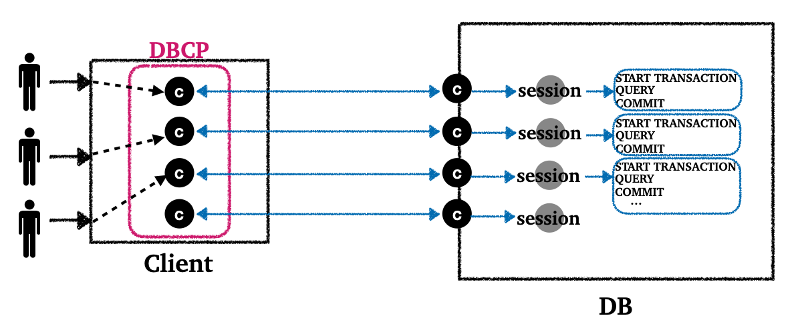
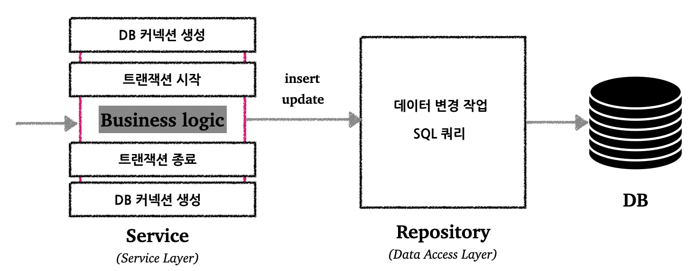
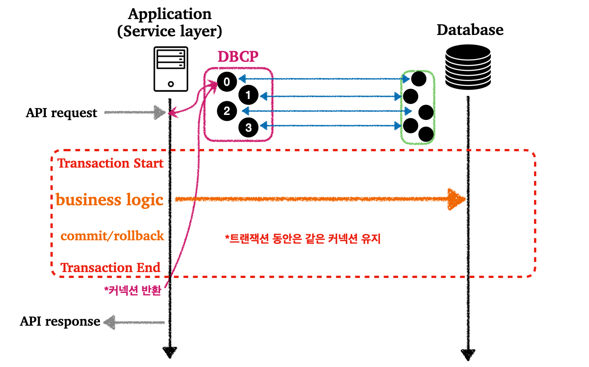
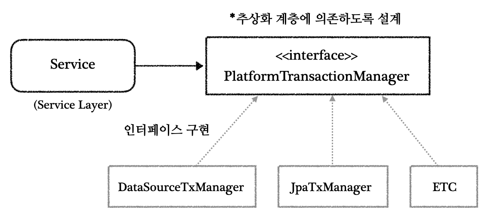
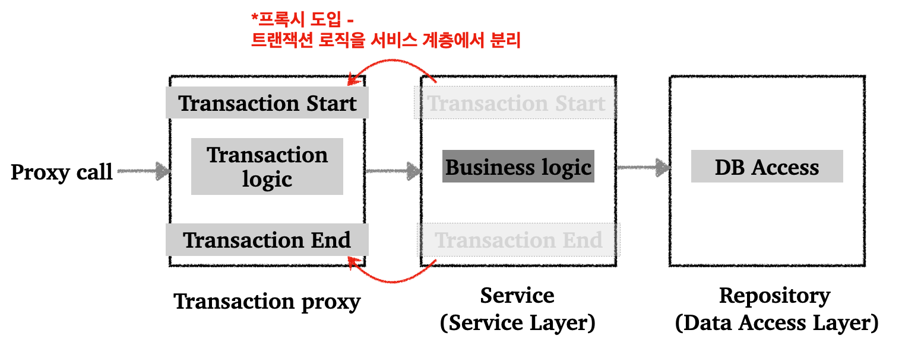

---

> 해당 포스트는 트랜잭션에 대한 기본적인 내용을 알고 있다는 전제하에 진행된다.
>
> [데이터베이스에서의 트랜잭션](https://seungki1011.github.io/posts/rdbms-4-transaction/) 포스트

<br>

## 1. 트랜잭션 복습

데이터베이스의 연결구조는 다음과 같다.

<br>



* 커넥션 마다 세션이 만들어진다
* 커넥션을 통해서 들어온 요청은 세션을 통해서 실행하게 한다

<br>

트랜잭션을 적용한 비즈니스 로직을 구현하기 전에 간단히 트랜잭션의 몇 가지 특징을 살펴보고 가자.

* **원자성(atomicity)**
  * **트랜잭션 내에서 실행한 작업들은 마치 하나의 작업인 것처럼 모두 성공 하거나 모두 실패해야 한다**

* **격리성(isolation)**
  * **동시에 실행되는 트랜잭션들이 서로에게 영향을 미치지 않도록 격리한다**
  * 격리성은 동시성과 관련된 성능 관련 이슈로 인해 트랜잭션 격리 수준(Isolation level)을 선택할 수 있다
  * 일반적으로 `READ COMMITTED(커밋된 읽기)`또는 `REPEATABLE READ`를 많이 사용


* 많은 경우 데이터베이스들은 `autocommit`이 `true`로 설정되어 있다. 그래서 `autocommit`을 `false`로 설정하는 것을 트랜잭션을 시작하는 것으로 표현할 수도 있다.
* 트랜잭션 모드에서는 이후에 꼭 `commit`이나 `rollback`을 호출해야 한다


* 원자성이 깨지는 것을 방지하기 위해 [DB 락](https://seungki1011.github.io/posts/rdbms-7-lock/)을 사용한다
* `SET LOCK_TIMEOUT <milliseconds>` : 락 타임아웃 시간을 설정해서 특정 세션이 무한히 대기하는 현상을 방지할 수 있다

<br>

---

## 2. 스프링 없이 트랜잭션 적용하기

스프링의 트랜잭션 기능을 사용하지 않고 트랜잭션을 적용하는 경우를 살펴보자.

계좌 이체 기능을 만들기 위해서 트랜잭션을 도입한다고 가정해보자.

<br>



* 트랜잭션은 비지니스 로직이 있는 서비스 계층에서 시작해야한다. 비즈니스 로직(우리의 경우 이체 로직)이 잘못되는 경우, 해당 문제를 다시 롤백해야하기 때문이다.

<br>



* 트랜잭션을 위해서는 커넥션이 필요하고 트랜잭션을 수행하는 동안 해당 커넥션을 유지해야 한다
  * 그러기 위해서는 트랜잭션이 시작하는 서비스 계층에서 커넥션의 연결/종료를 수행해야 한다

<br>

커넥션을 유지하기 위해서 커넥션의 유지가 필요한 메서드에 커넥션을 파라미터 형태로 전달하면 된다.

<br>

코드를 한번 살펴보자.

```java
/**
 * 트랜잭션 - 파라미터 연동, 풀을 고려한 종료 
 */
@Slf4j
@RequiredArgsConstructor
public class MemberServiceV2 {
    private final DataSource dataSource;
    private final MemberRepositoryV2 memberRepository;
  
    public void accountTransfer(String fromId, String toId, int money) 
      throws SQLException {
        Connection con = dataSource.getConnection(); // 트랜잭션을 위한 커넥션 획득
        try {
            con.setAutoCommit(false); // 트랜잭션 시작 
            // 비즈니스 로직
            bizLogic(con, fromId, toId, money);
            con.commit(); // 성공시 커밋 
        } catch (Exception e) {
            con.rollback(); // 실패시 롤백
            throw new IllegalStateException(e);
        } finally {
            release(con); // 트랜잭션이 끝나고 커넥션을 안전하게 종료한다
        }
    }
    
    /**
     * 커넥션을 유지하기 위해서 커넥션을 파라미터로 전달해서 비즈니스 로직을 수행한다
     */
    private void bizLogic(Connection con, String fromId, String toId, int money)
      throws SQLException {
        Member fromMember = memberRepository.findById(con, fromId);
        Member toMember = memberRepository.findById(con, toId);
      
        memberRepository.update(con, fromId, fromMember.getMoney() - money);
        validation(toMember);
        memberRepository.update(con, toId, toMember.getMoney() + money);
    }
  
    private void validation(Member toMember) {
        if (toMember.getMemberId().equals("ex")) {
            throw new IllegalStateException("이체중 예외 발생"); 
        }
    }
  
    private void release(Connection con) {
        if (con != null) {
            try {
                con.setAutoCommit(true); // 커넥션 풀 고려 
                con.close();
            } catch (Exception e) {
                log.info("error", e);
            } 
        }
    }
}
```

<br>

위의 코드를 보자마자 문제가 한눈에 보일 것이다.

자바만으로 트랜잭션 기능을 사용하는 경우 직면하는 문제를 살펴보자.

<br>

---

## 2. 기존 트랜잭션 적용의 문제

기존 트랜잭션 적용의 문제를 살펴보자.

먼저 이상적인 서비스 계층의 특징부터 살펴보자.

<br>


<p align='center'>서비스 계층</p>

* **이상적인 서비스 계층**
  * 비즈니스 로직을 담당한다
  * 가급적이면 순수한 자바 코드로 작성하는 것이 좋다
  * 서비스 계층이 다른 계층에 종속적이면 안된다
    * 예) 데이터 접근 계층에서 `JDBC`에서 `JPA`를 사용하도록 기술을 변경해도, 서비스 계층의 변경은 최소화 되도록 설계해야 한다

<br>

그러면 우리의 자바 트랜잭션 코드를 다시 보고 오자. 해당 자바의 코드의 문제점을 이제 알 것이다.

* 스프링을 이용하기 전까지는 트랜잭션을 적용하려면, 어쩔 수 없이 서비스 계층에서 `JDBC`에 의존하게 되었음(특정 기술을 의존하는 문제)
* 커넥션을 유지하기 위해서 커넥션을 파라미터 형태로 계속 넘겨야함(트랜잭션의 동기화 문제)
* 트랜잭션을 구현하기 위한 보일러 플레이트 코드의 양이 많음(계속 반복되는 코드가 많음)
* 이런 특징들은 코드의 유지보수성을 떨어트린다

<br>

이제 스프링이 제공하는 트랜잭션 관련 기능들을 사용해보면서 이 문제들을 해결해보자.

<br>

---

## 3. 스프링에서의 트랜잭션 처리

스프링에서 트랜잭션을 적용하는 방법에 대해서 알아보자.

<br>

### 3.1 트랜잭션 매니저(PlatformTransactionManager)

기존의 문제점의 원인 중 하나는, 구현 기술 마다 트랜잭션을 사용하는 방법이 다르기 때문이다. 서비스 계층이 특정 구현 기술에 종속적이면, 기술을 변경하는 경우 서비스 계층의 코드도 몽땅 바꿔야하는 대참사가 벌어진다.

이를 해결하기 위해서, 트랜잭션 기능을 추상화하는 인터페이스가 있으면 된다. 스프링은 이런 문제를 해결하기 위해서 `PlatformTransactionManager`이라는 인터페이스를 제공한다.

<br>




<br>

```java
public interface PlatformTransactionManager extends TransactionManager {

	  TransactionStatus getTransaction(@Nullable TransactionDefinition definition) 
      throws TransactionException;

	  void commit(TransactionStatus status) throws TransactionException;
	  void rollback(TransactionStatus status) throws TransactionException;
}
```

* `getTransaction()` : 트랜잭션 시작
  * 진행중인 트랜잭션이 있는 경우 해당 트랜잭션에 참여할 수도 있다(트랜잭션의 전파에서 설명)
* `commit()` : 트랜잭션을 커밋
* `rollback()` : 트랜잭션은 롤백

<br>

이 트랜잭션 매니저는 크게 2 가지의 역할을 한다.

* **트랜잭션 추상화**
  * 앞에서 설명한 메서드 제공

* **리소스 동기화**

  * 트랜잭션을 유지하기 위해서는 같은 데이터베이스 커넥션을 유지해야함(커넥션 동기화)

  * 트랜잭션 매니저는 `트랜잭션 동기화 매니저`(`TransactionSynchronizationManager`)를 사용해서 커넥션을 보관해서 사용한다

  * `트랜잭션 동기화 매니저`는 [`ThreadLocal`](https://seungki1011.github.io/posts/java-25-thread/#8-threadlocal)을 사용해서 커넥션을 동기화해준다

<br>

---

### 3.2 트랜잭션 템플릿(TransactionTemplate)

트랜잭션을 사용하는 로직이 계속 반복되는 문제를 해결해보자. 

기존 코드를 살펴보면 비즈니스 로직만 달라지고, 트랜잭션 관련 부분은 계속 변함이 없다. 

```java
TransactionStatus status = transactionManager
  .getTransaction(new DefaultTransactionDefinition());

try {
	  // 비즈니스 로직
	  bizLogic(fromId, toId, money); // 이 부분만 변경되고, 나머지 트랜잭션 관련 부분은 항상 반복됨
	  transactionManager.commit(status); // 성공시 커밋 
} catch (Exception e) {
	  transactionManager.rollback(status); // 실패시 롤백
    throw new IllegalStateException(e);
}
```

<br>

스프링은 이 문제를 해결하기 위해서 `TransactionTemplate`이라는 템플릿 클래스를 제공한다.(템플릿 콜백 패턴 찾아보기)

<br>

```java
public class TransactionTemplate extends DefaultTransactionDefinition
  implements TransactionOperations, InitializingBean {

	  protected final Log logger = LogFactory.getLog(getClass());

	  @Nullable
	  private PlatformTransactionManager transactionManager;
    
    // ...

	  /**
	   * Set the transaction management strategy to be used.
	   */
	  public void setTransactionManager(@Nullable PlatformTransactionManager
                                      transactionManager) {
		    this.transactionManager = transactionManager;
	  }

	  /**
	   * Return the transaction management strategy to be used.
	   */
	  @Nullable
	  public PlatformTransactionManager getTransactionManager() {
		    return this.transactionManager;
	  }

	  @Override
	  @Nullable
	  public <T> T execute(TransactionCallback<T> action) throws TransactionException {
	      // ...
	  }
    
    // ...

}
```

<br>

트랜잭션 템플릿을 적용하면, 반복되는 트랜잭션의 보일러 플레이트 코드를 상당수 제거 가능하다.

다음 코드를 통해 살펴보자.

```java
/**
 * 트랜잭션 - 트랜잭션 템플릿 
 */
@Slf4j
public class MemberService {
    private final TransactionTemplate txTemplate;
    private final MemberRepository memberRepository;
    public MemberService(PlatformTransactionManager transactionManager,
                         MemberRepository memberRepository) {
      
        this.txTemplate = new TransactionTemplate(transactionManager);
        this.memberRepository = memberRepository;
    }
  
    public void accountTransfer(String fromId, String toId, int money) 
      throws SQLException {
        txTemplate.executeWithoutResult((status) -> {
            try {
                //비즈니스 로직
                bizLogic(fromId, toId, money);
             } catch (SQLException e) {
                 throw new IllegalStateException(e);
             }
        }); 
    }
    // ... 
}
```

* `TransactionTemplate`을 사용하기 위해서 `PlatformTransactionManager`가 필요하다
* `transactionManager`를 주입받아서 `TransactionTemplate`을 생성한다

* 트랜잭션 템플릿의 사용으로 트랜잭션을 시작/커밋/롤백하는 코드들이 전부 사라졌다

<br>

트랜잭션 템플릿의 도입으로 트랜잭션과 관련된 보일러 플레이트 코드를 다수 제거할 수 있었지만, 근본적인 문제를 해결해주지는 못한다. 근본적인 문제는 서비스 계층에 비즈니스 로직이 아닌 트랜잭션 로직 자체가 남아있다는 것이다. 이상적인 서비스 계층은 비즈니스 로직만을 담당한다.

스프링은 AOP를 통해 프록시를 사용해서 이 문제를 해결한다.

<br>

---

### 3.3 트랜잭션 AOP(@Transactional)

지금까지 `PlatformTransactionManager`, 그리고 `TransactionTemplate`을 통해서 특정 기술에 대한 종속성을 제거하고, 반복되는 트랜잭션 코드도 제걸할 수 있다는 것을 알 수 있다. 그러나 이것이 서비스 계층에 순수하게 비즈니스 로직만 남았다는 것은 아니다. 

이를 해결하기 위해서 스프링 AOP를 통해서 프록시를 도입해서 해결할 수 있다.

<br>



<p align='center'>Transaction AOP</p>

* 프록시를 도입해서 위와 같이 서비스 계층에서 트랜잭션 로직을 분리하는 것이 목표다
* 스프링이 제공하는 AOP 기능을 이용하면 프록시를 편리하게 적용 가능하다
  * 사실 스프링은 이미 `@Transactional`이라는 기능을 제공해준다
  * 트랜잭션이 필요한 곳에 `@Transactional` 애노테이션만 붙여주면 스프링은 트랜잭션 프록시를 적용해준다

<br>

* 테스트 코드에서도 `@Transactional`이 동작하도록 하려고 하면, `스프링 컨테이너`를 사용해서 필요한 `스프링 빈`이 전부 등록되어 있어야 한다 (`스프링 AOP`를 적용하기 위해서 `스프링 컨테이너` 필요)
  * 이를 위해서 테스트 코드에 `@SpringBootTest`를 추가해야 한다

<br>

> 선언적 트랜잭션(Declarative Transaction) vs 프로그래밍 방식 트랜잭션(Programmatic Transaction)
>
> * 선언적 트랜잭션(Declarative Transaction)
>   * `@Transactional` 애노테이션 선언으로 트랜잭션을 적용하는 방식
>   * 실무 대부분에서는 선언적 트랜잭션을 사용
>
> 
>
> * 프로그래밍 방식 트랜잭션(Programmatic Transaction)
>   * 트랜잭션 매니저와 트랜잭션 템플릿을 사용해서 트랜잭션 관련 코드를 직접 작성하는 방식
>   * 프로그래밍 방식은 스프링 컨테이너나 AOP 없이 트랜잭션을 적용할 수 있음
>   * 테스트 시 가끔 사용
    {: .prompt-info }


<br>

---

## 4. 스프링 트랜잭션 주의점

`@Transactional`을 사용하면 스프링의 트랜잭션 AOP가 적용이 된다. 이때 프록시 방식의 AOP가 사용되는데, 프록시 객체가 요청을 받아서 트랜잭션을 처리하고 실제 객체를 호출하는 방식으로 동작한다.

트랜잭션을 적용하기 위해서는 프록시를 통해서 대상(Target) 객체를 호출해야 한다. 프록시를 거치치 않고 대상 객체를 직접 호출하게 되면, AOP가 적용되지 않아서 트랜잭션도 적용되지 않는다.

스프링 트랜잭션 사용시 주의해야 할 것은 **대상 객체의 내부에서 메서드 호출이 발생하면 프록시를 거치지 않고 대상 객체를 직접 호출하는 문제가 발생한다.**

이 경우에 `@Transactional`이 있어도 트랜잭션이 적용되지 않는다.

<br>

코드를 통해 살펴보자.

<br>

```java
@Test
void internalCall() {
    callService.internal();
}

@Test
void externalCall() {
    callService.external();
}

@TestConfiguration
static class InternalCallV1Config {
    @Bean
    CallService callService() {
        return new CallService();
    }
}

@Slf4j
static class CallService {
    public void external() {
        log.info("call external");
        printTxInfo();
        internal();
    }
      
    @Transactional
    public void internal() {
        log.info("call internal");
        printTxInfo();
    }
      
    private void printTxInfo() {
        boolean txActive = TransactionSynchronizationManager.isActualTransactionActive();
        log.info("tx active={}", txActive);
    } 
}
```

* `external()`은 트랜잭션이 없음
* `internal()`은 `@Transactional`을 통해 트랜잭션 적용
* `internalCall()`은 `internal()` 호출. 큰 문제는 없음

<br>

문제가 되는 `externalCall()`을 실행하는 경우를 살펴보자.

`external()`은 `@Transactional`이 없어서 트랜잭션 없이 시작한다. 그러나 내부에 `@Transactional`이 붙은 `internal()`을 호출한다. 우리의 기대하는 것은 `internal()`에 트랜잭션이 적용되는 것이지만, 실제 결과를 살펴보면 트랜잭션 관련 코드가 전혀 반영되지 않는다.

이 문제가 발생하는 원인은 `internal()`을 호출하는 부분에 있다. 자바에서는 메서드 앞에 별도의 참조가 없으면 자기 자신의 인스턴스를 가리키는 `this`가 붙는다. 그래서 위의 경우에는 `this.internal()`이 호출되는 것이다. 여기서 알아야할 것은 `this`는 자기 자신을 가리키기 때문에 대상(target) 객체를 뜻한다.

이전에도 설명했듯이 프록시를 거치치 않고 대상 객체를 직접 호출하게 되면 트랜잭션이 적용되지 않는다.

<br>

이 문제를 해결하기 위해서는 `internal()`을 외부 클래스로 분리하고, `internal()`을 호출할 때 `외부클래스_참조변수.internal()` 같이 호출하면 된다. 

<br>

> 추가 주의점
>
> * 스프링은 기본적으로 `public` 메서드에만 트랜잭션을 적용하도록 설정되어 있다
>   * 스프링 부트 3.0 부터는 `protected`, `package-visible`(default)에도 트랜잭션이 적용된다
>
> * 초기화 코드(`@PostConstruct`)와 `@Transactional`을 함께 사용하면 트랜잭션이 적용되지 않는다
>  * 초기화 코드가 먼저 호출되고, 그 다음에 트랜잭션 AOP가 적용된다
>   * 초기화 시점에는 해당 메서드에서 트랜잭션 획득 불가
> 
> <br>
>
> `@PostConstruct`를 사용하는 대신 `@EventListener(value = ApplicationReadyEvent.class)`를 사용하면, 트랜잭션 AOP를 포함한 스프링 컨테이너가 완전히 생성되고 난 다음에 이벤트가 붙은 메서드를 호출해준다.
{: .prompt-warning }

<br>

---

## 5. @Transactional 옵션

`@Transactional`에 사용할 수 있는 옵션들을 소개한다.

<br>

* `@Transactional(xxxTxManager)`

  * 트랜잭션을 이용하기 위해서는 스프링 빈에 등록된 어떤 트랜잭션 매니저를 사용할지 알아야 한다

  * 생략하는 경우 기본으로 등록된 트랜잭션 매니저를 사용한다(대부분 생략해서 사용하는 경우가 많다)

  * 사용하는 트랜잭션 매니저가 둘 이상이라면 다음과 같이 트랜잭션 매니저 이름을 지정하면 된다

  * ```java
    @Transactional("memberTxManager")
    public void member() {...}
    
    @Transactional("orderTxManager")
    public void order() {...}
    ```

<br>

* `@Transactional(rollbackFor = Exception.class)`
  * 예외 발생시 스프링 트랜잭션의 기본 정책은 다음과 같다
    * 언체크 예외 : 롤백
    * 체크 예외 : 커밋
  * 위의 `rollbackFor` 옵션을 이용하면 기본 정책에 추가로 어떤 예외가 발생할 때 롤백할지 지정할 수 있다


* `noRollbackFor`
  * 위의 `rollbackFor`과 반대로 어떤 예외가 발생했을 때 롤백하면 안되는지 지정 할 수 있다

<br>

> 예외에 따른 트랜잭션 커밋과 롤백은 뒤에서 더 자세히 다룰 것이다.

<br>

* `isolation`
  * 트랜잭션의 격리 수준을 지정 가능
  * 기본값은 데이터베이스에서 설정한 트랜잭션 격리 수준을 사용한다
  * 대부분 경우 기본값을 사용한다(개발자가 임의로 지정하는 경우는 드물다)

<br>

* `readOnly`
  * 트랜잭션은 기본적으로 읽기/쓰기가 모두 가능한 트랜잭션이 생성된다
  * `readOnly=true`를 사용하면 읽기 전용 트랜잭션이 생성된다. 이 경우 읽기 기능만 작동한다.
  * `readOnly=true`를 통해 다양한 성능 최적화가 이루어질 수 있다
  * 무조건 성능 최적화가 발생하는 것은 아니다, 모니터링을 권장한다

<br>

---

## 6. 예외에 따른 트랜잭션 커밋/롤백

예외 발생시 스프링 트랜잭션 AOP는 예외의 종류에 따라 트랜잭션을 커밋하거나 롤백한다.

* 언체크 예외(`RuntimeException`, `Error`과 하위 예외) : 트랜잭션 롤백된다
* 체크 예외(`Exception`과 하위 예외) : 트랜잭션 커밋된다
* 정상 응답 : 트랜잭션 커밋된다

<br>

스프링이 체크 예외를 커밋하는 정책을 사용하는 이유는 체크 예외를 비즈니스적 의미가 있는 예외로 가정하고, 언체크 예외를 복구 불가능한 예외로 가정하고 있기 때문이다.

<br>

> 비즈니스 의미가 있는 예외의 예시
>
> * 잔고 부족
> * 이체 목표의 은행이 점검중
> * 말 그대로 비즈니스적 의미가 있는 예외를 말한다
>
> <br>
>
> 비즈니스 의미가 있는 예외를 롤백해버리면 해당 정보를 가지고 고객에게 안내를 하는 작업 등을 못한다. 
{: .prompt-info }

<br>

비즈니스 상황에 따라 체크 예외라도 트랜잭션을 커밋하지 않고 롤백하고 싶은 경우도 있을 것이다. 이 경우에는 `rollbackFor` 옵션을 사용하면 된다.

---

## Reference

1. [인프런 - 김영한 : 스프링 완전 정복](https://www.inflearn.com/roadmaps/373)

