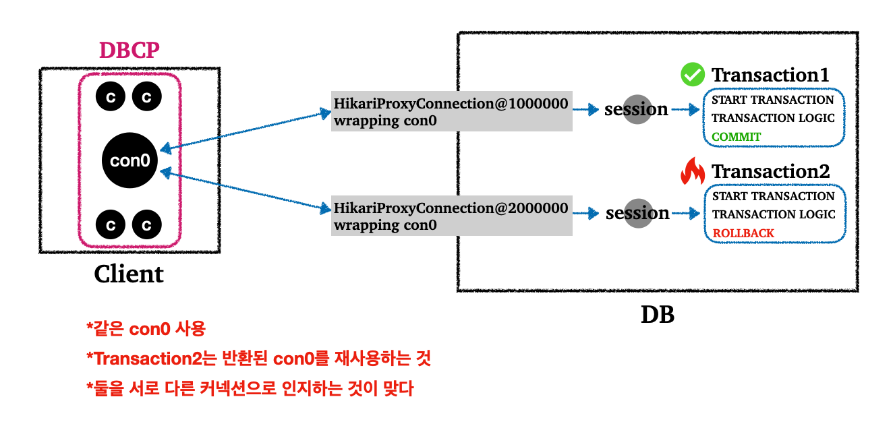
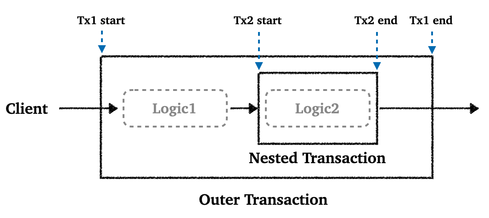
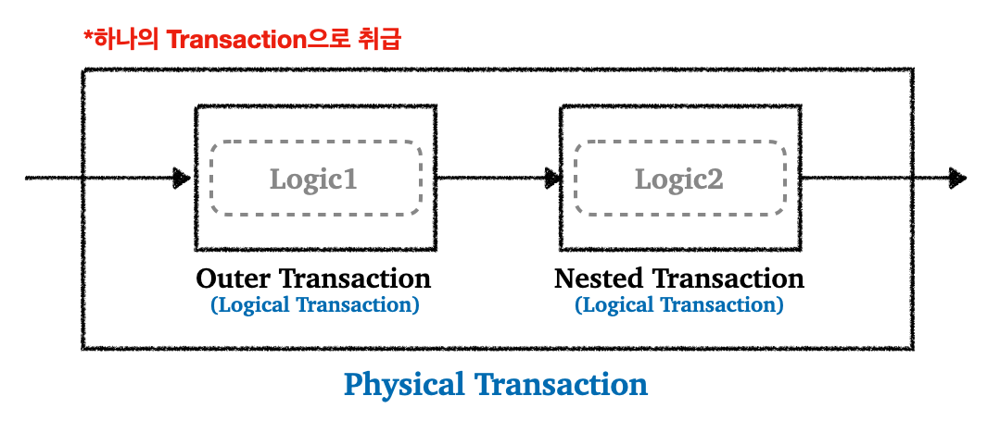
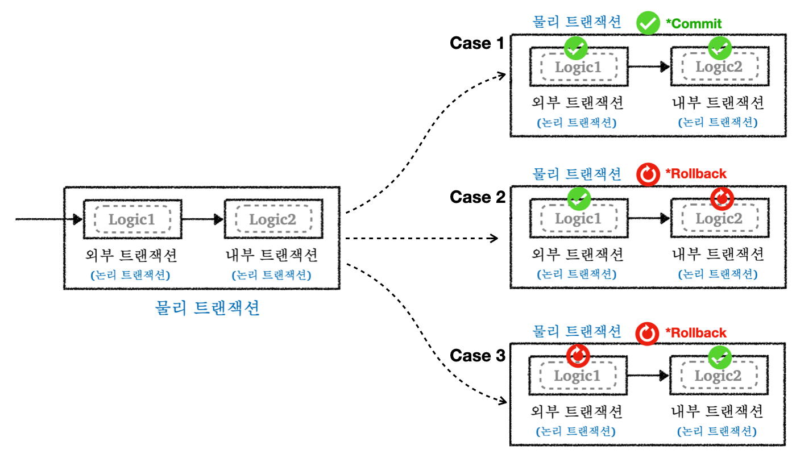

---

## 1. 두 트랜잭션을 따로 관리

트랜잭션이 둘 이상 있을 때 어떻게 동작하는지 자세히 알아보고, 스프링이 제공하는 트랜잭션 전파(propagation)라는 개념도 알아보자.

먼저 복습하는 차원에서 `트랜잭션1`이 수행되고 `트랜잭션2`가 수행되는 상황을 살펴보자. 쉽게 말해서 트랜잭션이 각각 따로 사용되는 상황이다.

<br>

```java
@Test
void double_commit_rollback() {
  
    log.info("트랜잭션1 시작");
    TransactionStatus tx1 = txManager.getTransaction(new DefaultTransactionAttribute());
    log.info("트랜잭션1 커밋"); txManager.commit(tx1);
  
    log.info("트랜잭션2 시작");
    TransactionStatus tx2 = txManager.getTransaction(new DefaultTransactionAttribute());
    log.info("트랜잭션2 롤백");
    txManager.rollback(tx2);
  
}
```


<br>



<p align="center">트랜잭션이 따로 사용되는 상황</p>

* `트랜잭션1`이 수행되고 `commit` 후에 `con0` 반환
* `트랜잭션2`가 시작하면서 반환된 `con0` 사용
* `트랜잭션2`에 대한 `rollback` 후에 `con0` 반환
* 이 처럼 `트랜잭션1`, `트랜잭션2`를 묶지 않고 각각 관리했기 때문에 `트랜잭션1`에서 수행한 결과는 저장되고, `트랜잭션2`에서 수행한 결과는 롤백된다

<br>

---

## 2. 전파 기본 옵션 (REQUIRED)

그러면 이번에는 트랜잭션을 각각 사용하는 것이 아니라, 트랜잭션이 이미 진행중인 상황에서 추가로 트랜잭션을 수행하면 어떻게 될까?

이렇게 트랜잭션 중에 새로운 트랜잭션이 수행되는 경우 어떻게 동작할지 결정하는 것을 트랜잭션 전파(Transaction Propogation)이라고 한다.

<br>

지금부터 설명할 동작은 전파의 기본 옵션인 `Required`일 때 일어나는 동작이다.

외부 트랜잭션의 수행중에 내부 트랜잭션이 수행된다고 가정하자. 이때 외부 트랜잭션이라는 것은 상대적으로 바깥쪽에 있는 트랜잭션이다. 제일 먼저 시작된 트랜잭션으로 이해하면 된다.

공식 문서 참고 : [https://docs.spring.io/spring-framework/reference/data-access/transaction/declarative/tx-propagation.html](https://docs.spring.io/spring-framework/reference/data-access/transaction/declarative/tx-propagation.html)

<br>



* 내부 트랜잭션(nested transaction)은 외부 트랜잭션이 수행되고 있는 도중에 호출되기 때문에 마치 내부에 있는 것 처럼 보여서 내부 트랜잭션이라고 한다

<br>

이런식으로 외부 트랜잭션이 수행되고 있는 중에 내부 트랜잭션이 도중에 참여하게 되면 스프링은 외부 트랜잭션과 내부 트랜잭션을 묶어서 하나의 트랜잭션으로 만들어준다. 다음 그림을 통해서 이해해보자. 

<br>



* 외부 트랜잭션과 내부 트랜잭션을 하나의 트랜잭션으로 묶는다
* 이때 하나로 묶인 전체 트랜잭션을 물리 트랜잭션이라고 취급하고, 물리 트랜잭션을 이루는 외부/내부 트랜잭션을 논리 트랜잭션이라고 하자


* 물리 트랜잭션은 우리가 이해하고 있는 실제 데이터베이스에 적용되는 트랜잭션을 말한다
  * 실제 커넥션을 통해 트랜잭션을 시작/커밋/롤백하는 단위로 생각하면 편하다


* 논리 트랜잭션은 트랜잭션 매니저를 통해 트랜잭션을 사용하는 단위이다
* 논리 트랜잭션 개념은 위 처럼 트랜잭션 진행 도중에 내부에 추가로 트랜잭션이 사용되어 기존 트랜잭션에 참여하는 경우 나타난다 

<br>

스프링의 트랜잭션 전파의 기본 옵션인 `Required`를 사용하는 경우, 다음의 기본 원칙에 의해 논리 트랜잭션과 물리 트랜잭션이 동작한다. 

* 모든 논리 트랜잭션이 커밋되어야 물리 트랜잭션이 커밋된다
* 하나의 논리 트랜잭션이라도 롤백되면 물리 트랜잭션(전체 트랜잭션)은 롤백된다

<br>

그림으로 나타내면 다음과 같다.

<br>



* 외부/내부 트랜잭션 모두 커밋 되면 물리 트랜잭션도 커밋
* 내부 트랜잭션이 롤백되면 물리 트랜잭션도 롤백
* 외부 트랜잭션이 롤백되면 물리 트랜잭션도 롤백

<br>

외부/내부 트랜잭션이 모두 커밋되는 경우를 코드로 살펴보자.

<br>

```java
@Test
void inner_commit() {
  
    log.info("외부 트랜잭션 시작");
    TransactionStatus outer = txManager.getTransaction(new DefaultTransactionAttribute());
    log.info("outer.isNewTransaction()={}", outer.isNewTransaction());
  
    log.info("내부 트랜잭션 시작");
    TransactionStatus inner = txManager.getTransaction(new DefaultTransactionAttribute());
    log.info("inner.isNewTransaction()={}", inner.isNewTransaction()); 
  
    log.info("내부 트랜잭션 커밋");
    txManager.commit(inner);
  
    log.info("외부 트랜잭션 커밋");
    txManager.commit(outer);
}
```

```
외부 트랜잭션 시작
Creating new transaction with name [null]:
PROPAGATION_REQUIRED,ISOLATION_DEFAULT
Acquired Connection [HikariProxyConnection@1943867171 wrapping conn0] for JDBC
transaction
Switching JDBC Connection [HikariProxyConnection@1943867171 wrapping conn0] to manual commit
outer.isNewTransaction()=true
내부 트랜잭션 시작
Participating in existing transaction inner.isNewTransaction()=false
내부 트랜잭션 커밋
외부 트랜잭션 커밋
Initiating transaction commit
Committing JDBC transaction on Connection [HikariProxyConnection@1943867171 wrapping conn0]
Releasing JDBC Connection [HikariProxyConnection@1943867171 wrapping conn0] after transaction
```

* `PROPAGATION_REQUIRED` : 전파 디폴트 옵션
* `Participating in existing transaction` : 내부 트랜잭션이 기존에 수행되는 외부 트랜잭션에 참여

<br>

스프링은 기본적으로 처음 트랜잭션을 시작한 외부 트랜잭션이 실제 물리 트랜잭션을 관리하도록 한다.

그러면 이런 궁금증을 가질 수도 있다. 

<br>

> *"외부 트랜잭션이 실제 물리 트랜잭션을 관리하면, 외부 트랜잭션이 커밋되는 경우, 전체 물리 트랜잭션도 커밋되어야 하는 것이 아닌가?"*

<br>

이 경우에는 내부 트랜잭션을 롤백하게 되면 기존 트랜잭션을 롤백 전용(`rollback-only`)로 표시한다. 이렇게 되면 외부 트랜잭션을 커밋해도, 전체 트랜잭션(물리 트랜잭션)이 `rollback-only`로 표시되어 있기 때문에 물리 트랜잭션을 롤백한다.

<br>

---

## 3. 전파 옵션 (REQUIRES_NEW)

외부 트랜잭션과 내부 트랜잭션을 완전히 분리해서 사용하는 방법에 대해 알아보자. 완전히 분리해서 별도의 물리 트랜잭션으로 사용하게 되면, 커밋과 롤백도 각각 별도로 이루어지게 된다.

코드로 살펴보자.

<br>

```java
@Test
void inner_rollback_requires_new() {
  
    log.info("외부 트랜잭션 시작");
    TransactionStatus outer = txManager.getTransaction(new DefaultTransactionAttribute());
    log.info("outer.isNewTransaction()={}", outer.isNewTransaction()); 
    
    log.info("내부 트랜잭션 시작");
    DefaultTransactionAttribute definition = new DefaultTransactionAttribute();
    definition.setPropagationBehavior(TransactionDefinition.PROPAGATION_REQUIRES_NEW); // 옵션 변경
  
    TransactionStatus inner = txManager.getTransaction(definition);
    log.info("inner.isNewTransaction()={}", inner.isNewTransaction());
  
    log.info("내부 트랜잭션 롤백"); 
    txManager.rollback(inner); //롤백
  
    log.info("외부 트랜잭션 커밋");
    txManager.commit(outer); //커밋 
  
}
```

* 내부 트랜잭션을 시작할 때 전파 옵션을 `PROPAGATION_REQUIRES_NEW` 옵션을 준다
* 이 옵션을 사용하게 되면, 내부 트랜잭션을 시작할 때 기존 트랜잭션에 참여하는 것이 아리나 새로운 물리 트랜잭션을 만들어서 시작하게 된다
* 이 옵션은 요청이 굉장히 많아지는 경우 성능에 영향을 끼칠 수 있다

<br>

---

## 4. 기타 전파 옵션

보통 트랜잭션 전파 옵션을 `REQUIRED`(기본 옵션)로 많이 사용한다. `REQUIRES_NEW`도 가끔 사용된다.

<br>

* `SUPPORT`
  * 트랜잭션을 지원한다
  * 기존 트랜잭션 없음 : 트랜잭션 없이 진행
  * 기존 트랜잭션 있음 : 트랜잭션에 참여한다

<br>

* `NOT_SUPPORT`
  * 기존 트랜잭션 없음 : 트랜잭션 없이 진행
  * 기존 트랜잭션 있음 : 트랜잭션 없이 진행 (기존 트랜잭션 보류)

<br>

* `MANDATORY`
  * 트랜잭션이 반드시 있어야 한다
  * 기존 트랜잭션 없음 : `IllegalTransactionStateException` 예외 발생
  * 기존 트랜잭션 있음 : 트랜잭션에 참여한다

<br>

* `NEVER`
  * 트랜잭션을 사용하지 않는다
  * 기존 트랜잭션 없음 : 트랜잭션 없이 진행한다
  * 기존 트랜잭션 있음 : `IllegalTransactionStateException` 예외 발생

---

## Reference

1. [인프런 - 김영한 : 스프링 완전 정복](https://www.inflearn.com/roadmaps/373)
