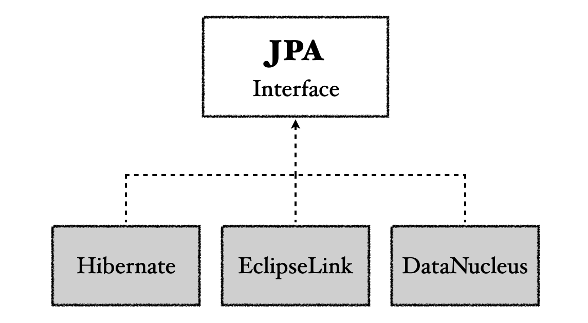
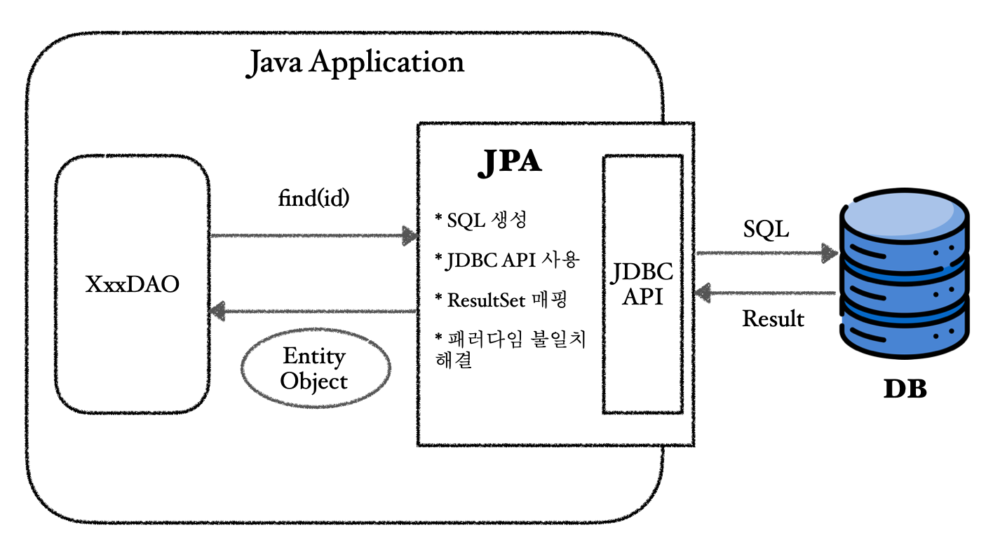
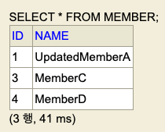

---

> 포스트에서 언급하는 JPA는 인터페이스라고 정확히 말하는 것이 아니라면 구현인 하이버네이트를 의미한다고 생각하면 편하다.
>
> 코드 편의상 롬복 `@Setter`로 설정자를 전부 열었다. 실제 개발시, 필요한 설정자만 열어두는 것을 권장한다.
>
> `@NoArgsConstructor`도 권장사항은`@NoArgsConstructor(access = AccessLevel.PROTECTED)`을 사용하는 것이지만, 편의상 아무런 속성을 설정하지 않고 사용했다.
> {: .prompt-warning }


---

## 1) JPA 소개

자바 퍼시스턴스(Java Persistence, 이전 이름: 자바 퍼시스턴스 API/Java Persistence API)는 객체 관계 매핑(ORM, Object Relational Mapping) 기술의 표준 인터페이스 모음이다. JPA를 구현하는 다양한 구현체들 중에서 대표적으로 Hibernate가 사용되며, 현재 포스트에서 추후 기술하는 사용법도 Hibernate를 기준으로 작성되었다. 이후 포스트에서 언급하는 JPA는 Hibernate과 동의어로 생각하면 된다.

<br>



<p align="center">JPA Interface</p>

<br>

JPA를 사용하는 여러 이유는 다음과 같다.

* SQL 중심적 개발을 객체 중심적 개발로 바꿀 수 있다
* 생산성과 유지보수
  * 여러 SQL과 관련된 보일러 플레이트(boiler-plate) 제거
* 관계형 데이터베이스의 테이블과 객체간의 패러다임 불일치 해결
* 벤더 독립성
  * 벤더 락인(vendor lock-in)을 피할 수 있다
  * JPA는 이론적으로 특정 데이터베이스에 종속적이지 않으며, DB 벤더를 변경해도 JPA 관련코드는 일절 바꾸지 않아도 된다고 한다(물론 이건 이론적인 이야기지 실제로 그냥 레고 놀이 하듯이 가능한건 아니다)

<br>

정말 쉽게 이야기하자면 JPA는 많은 기능을 추상화하여 제공하고, 개발자는 JPA를 통해서 SQL의 사용없이 쉽게 개발이 가능하다. 그러나 이것은 개발자가 아무런 이해 없이 JPA가 제공하는 마법과 같은 기능들을 완벽히 신뢰하면서 사용하라는 뜻은 아니다.

결국에 문제가 생기면 개발자는 관계형 데이터베이스(SQL), 객체, JPA의 내부 동작 방식을 잘 알고 있어야 효율적으로 JPA를 사용하고 문제 해결(trouble shooting)을 할 수 있다.

<br>


JPA는 JDBC API 위에서 동작한다.

<br>



<p align="center">JPA 내부 요약</p>

<br>

---

## 2) JPA 준비

### 2.1 프로젝트 setup

JPA를 사용하기 위한 프로젝트 준비. 이전의 JDBC에서 사용한것과 다르게 이번에는 H2 데이터베이스를 사용해보자.

H2 컨테이너를 위한 `docker-compose.yml`은 다음과 같다.

<br>

```yaml
services:
  db:
    container_name: h2-container
    image: oscarfonts/h2:latest # h2 latest version(2024/06/01 : 2.2.224)
    ports:
      - 1521:1521 # TCP database server
      - 8081:81 # Web Interface
    environment:
      H2_OPTIONS: -ifNotExists # If DB exists do not re-create
    volumes:
      - ./h2/:/opt/h2-data # Mount at ./h2
    restart: always
```

* H2 웹 콘솔을 `8081`로 접속하자
* 데이터베이스 포트는 `1521`을 사용하자

<br>

자바 17을 사용할 것이다.

Maven을 사용할 것이다. `pom.xml`은 다음과 같다.

<br>

```xml
<?xml version="1.0" encoding="UTF-8"?>
<project xmlns="http://maven.apache.org/POM/4.0.0"
         xmlns:xsi="http://www.w3.org/2001/XMLSchema-instance"
         xsi:schemaLocation="http://maven.apache.org/POM/4.0.0 http://maven.apache.org/xsd/maven-4.0.0.xsd">
    <modelVersion>4.0.0</modelVersion>

    <groupId>jpa-basic</groupId>
    <artifactId>ex1-hello-jpa</artifactId>
    <version>1.0.0</version>

    <properties>
        <maven.compiler.source>17</maven.compiler.source>
        <maven.compiler.target>17</maven.compiler.target>
        <project.build.sourceEncoding>UTF-8</project.build.sourceEncoding>
    </properties>

    <dependencies>
        <!-- JPA 하이버네이트 -->
        <dependency>
            <groupId>org.hibernate</groupId>
            <artifactId>hibernate-core</artifactId>
            <version>6.4.2.Final</version>
        </dependency>

        <dependency>
            <groupId>javax.xml.bind</groupId>
            <artifactId>jaxb-api</artifactId>
            <version>2.3.1</version>
        </dependency>

        <!-- H2 데이터베이스 -->
        <dependency>
            <groupId>com.h2database</groupId>
            <artifactId>h2</artifactId>
            <version>2.2.224</version>
        </dependency>
      
        <!-- lombok -->
        <dependency>
            <groupId>org.projectlombok</groupId>
            <artifactId>lombok</artifactId>
            <version>1.18.32</version>
            <scope>provided</scope>
        </dependency>

        <!-- logback -->
<!--
        <dependency>
            <groupId>ch.qos.logback</groupId>
            <artifactId>logback-classic</artifactId>
            <version>1.4.14</version>
        </dependency>
-->
    </dependencies>

</project>
```

* H2의 버전을 우리가 사용하는 버전과 맞추자
* 하이버네이트 버전은 `6.4.2.Final`

<br>

스프링 부트 없이 JPA를 사용하기 위해서는 `resources/META-INF/persistence.xml`를 만들어야 한다.

`persistence.xml`은 JPA를 위한 설정파일이다.

<br>

```xml
<?xml version="1.0" encoding="UTF-8"?>
<persistence version="2.2" xmlns="http://xmlns.jcp.org/xml/ns/persistence"
             xmlns:xsi="http://www.w3.org/2001/XMLSchema-instance"
             xsi:schemaLocation="http://xmlns.jcp.org/xml/ns/persistence http://xmlns.jcp.org/xml/ns/persistence/persistence_2_2.xsd">
    <persistence-unit name="hello">
        <properties>
            <!-- 필수 속성 -->
            <property name="jakarta.persistence.jdbc.driver" value="org.h2.Driver"/>
            <property name="jakarta.persistence.jdbc.user" value="sa"/>
            <property name="jakarta.persistence.jdbc.password" value=""/>
            <property name="jakarta.persistence.jdbc.url" value="jdbc:h2:tcp://localhost:1521/test"/>
            <property name="hibernate.dialect" value="org.hibernate.dialect.H2Dialect"/>

            <!-- 옵션 -->
            <property name="hibernate.show_sql" value="true"/>
            <property name="hibernate.format_sql" value="true"/>
            <property name="hibernate.use_sql_comments"  value="true"/>
            <!-- create 옵션은 SessionFactory 시작시 스키마 삭제후 재생성 -->
            <!-- <property name="hibernate.hbm2ddl.auto" value="create" /> -->
        </properties>
    </persistence-unit>

</persistence>
```

* `jdbc.url`은 H2 콘솔에서 확인한 주소인 `jdbc:h2:tcp://localhost:1521/test` 사용

<br>

지금은 `persistence.xml`을 사용하지만, 나중에 스프링 부트를 사용할 때는 JPA 관련 설정은 `application.properties` 파일에 추가하면 된다. 스프링 부트를 사용해보면 알겠지만, 상당수 귀찮은 설정 작업들도 자동화 시켜준다.

<br>

---

### 2.2 객체와 테이블 매핑

테이블을 생성하고, 해당 테이블과 매핑이 되는 객체를 만들자.

<br>

테이블 생성.

```sql
create table Member (
   id bigint not null,
   name varchar(255),
   primary key (id)
);
```

<br>

객체 생성.

```java
@Entity
@Getter @Setter
// @Table(name = "USER")
public class Member {
  
    @Id // PK 직접 할당, 데이터베이스 PK와 매핑
    private Long id;

    // @Column(name = "user_name")
    private String name;
}
```

* JPA는 기본적으로 객체와 테이블을 관례에 의해서 알아서 매핑해준다
* 편의상 `@Setter`를 사용했는데, 실제 구현할 때는 필요한 `setter`만 열어두는게 좋다
* 만약 실제 테이블 이름이 완전히 다르면 (`Member`가 아니라 `USER`라면) `@Table(name = "USER")` 처럼 지정할 수 있다
* attribute도 마찬가지이다, `@Column(name = "user_name")`으로 이름을 직접 지정하는 것이 가능하다

<br>

---

### 2.3 JPA 동작 확인

#### 2.3.1 JPA 정상 동작 체크

`JpaMain`을 만들어서 코드를 작성해보자.

<br>

```java
public class JpaMain {

    public static void main(String[] args) {

        /**
         * persistence.xml의 persistence-unit의 name을 넣어준다
         * EntityManagerFactory를 통해서 EntityManager를 생성한다
         */
        EntityManagerFactory emf = Persistence.createEntityManagerFactory("hello");
        EntityManager em = emf.createEntityManager();
        
        //code

        em.close();
        emf.close();
    }
}
```

* `EntityManagerFactory`는 하나만 생성해서 애플리케이션 전체에 공유한다
* `EntityManager`는 스레드간에 공유하지 않는다 (사용하고 버린다)
  * 실제 트랜잭션 단위의 행위(커넥션을 얻고 SQL을 날리고 종료를 하는 일괄적인 행위)를 할때 마다 `EntityManager`를 만들어줘야 함

<br>

---

#### 2.3.2 저장

이제 `Member` 객체를 한번 저장해보자.

<br>

```java
public class JpaMain {

    public static void main(String[] args) {
        
        /**
         * 스프링 부트 사용시 자동으로 처리해준다
         */
        EntityManagerFactory emf = Persistence.createEntityManagerFactory("hello");

        /**
         * 각 트랜잭션 별로 EntityManager를 만들어서 사용
         * 스프링 부트 사용시 자동으로 처리해준다
         */
        EntityManager em = emf.createEntityManager();

        /**
         * JPA에서 데이터를 변경하는 작업은 트랜잭션 단위 내에서 작업한다
         * 생성한 EntityManager에서 트랜잭션을 얻어서 사용
         */
        EntityTransaction tx = em.getTransaction();
        tx.begin(); // 트랜잭션 시작

        /**
         * 아래의 try-catch-finally는 스프링부트를 사용하면 전부 생략가능
         */
        try {
            Member member = new Member();
            member.setId(1L);
            member.setName("MemberA");

            em.persist(member); // 객체를 DB에 저장(실제로는 영속성 컨텍스트에 저장, 뒤에서 다룸)
            tx.commit(); // 성공하면 커밋
        } catch (RuntimeException e) {
            tx.rollback(); // 예외 발생시 롤백
        } finally {
            em.close();
        }

        emf.close(); // 전체 애플리케이션이 끝나면 EntityManagerFactory 종료
    }
}
```

* `Member` 객체를 생성해서 저장하는데 `id`는 `1`, `name`은 `MemberA`이다
* JPA에서는 트랜잭션 내에서 변경 작업을 해야한다
* JPA 설정에서 `<property name="hibernate.show_sql" value="true"/>`로 설정했기 때문에, 콘솔에서 해당 SQL을 확인할 수 있다
* `try-catch-finally` 같은 코드는 스프링 부트 사용시 자동으로 적용해준다
* 위의 주석에도 달았지만, 스프링 부트 사용시 JPA와 관련된 보일러 플레이트 코드를 상당수 제거할 수 있다

<br>

H2 콘솔에서 확인하면 결과가 제대로 반영된것을 확인할 수 있다. 이어서 `2`, `3`, `4`번 아이디로 멤버를 두 명 더 추가하자.

<br>

---

#### 2.3.3 조회

이번에는 특정 멤버를 찾아보자. 

```java
// PK가 2인 멤버 찾기
Member findMember = em.find(Member.class, 2L);
System.out.println("findMember.getId() = " + findMember.getId());
System.out.println("findMember.getName() = " + findMember.getName());
```

```
findMember.getId() = 2
findMember.getName() = MemberB
```

* `Member` 클래스의 객체이면서 아이디가 `2` 인 멤버 찾기
  * PK로 찾는다

<br>

---

#### 2.3.4 삭제

이번에는 멤버를 삭제해보자.

```java
Member findMember = em.find(Member.class, 2L);
em.remove(findMember);
```

* 찾은 멤버 `findMember`를 삭제한다
* 현재 스키마에 `auto increment`를 적용하지 않았기 때문에 아이디가 `1`, `3`, `4` 로 보일 것이다

<br>

---

#### 2.3.5 수정

이번에는 멤버를 수정 해보자. 

```java
Member findMember = em.find(Member.class, 1L);
findMember.setName("UpdatedMemberA");
```

* PK가 `1` 인 멤버의 `name`을 `UpdatedMemberA`로 수정한다
* 이때 `em.persist(findMember)`를 할 필요가 없다!
* JPA를 통해서 엔티티를 가져오는 경우, JPA가 관리를 한다. JPA는 이 엔티티가 트랜재션 내에서 변경이 됬는지 안됬는지 커밋되는 시점에서 항상 체크를 한다. 위의 경우, `findMember`라는 엔티티가 변경이 되었기 때문에 업데이트 쿼리가 나간다.

<br>

DB를 확인해보자.

<br>



<p align="center">지금까지 적용한 내용 확인</p>

<br>

---

#### 2.3.6 JPQL

그러면 단순히 `find()`로 특정 PK인 멤버를 찾는 것이 아니라, 복잡한 쿼리를 통해 조회하는 경우 어떻게 해야할까? 이 경우에 JPA의 JPQL을 사용한다.

JPQL의 장점을 간단히 소개하면 다음과 같다.

* 기존 SQL 처럼 테이블 대상으로 검색하는 것이 아닌 객체 대상으로 검색한다
* SQL을 어느정도 추상화를 해주기 때문에 다른 데이터베이스로 변경해도 JPQL을 수정할 필요가 없다
  * 쉽게 말해서 SQL에 의존적이지 않다

<br>

JPQL은 [이후 포스트]()에서 자세히 다룬다.

다음 포스트는 영속성 컨텍스트라는 JPA의 내부 동작 과정 일부에 대해서 알아볼 것이다.

---

## Reference

1. [인프런 : (김영한) 스프링 완전 정복](https://www.inflearn.com/roadmaps/373)
2. [Udemy - Spring Boot 3, Spring 6 & Hibernate](https://www.udemy.com/course/spring-hibernate-tutorial/?couponCode=ST8MT40924)

