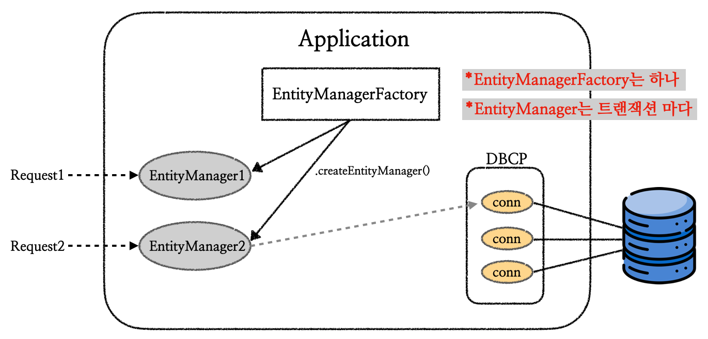
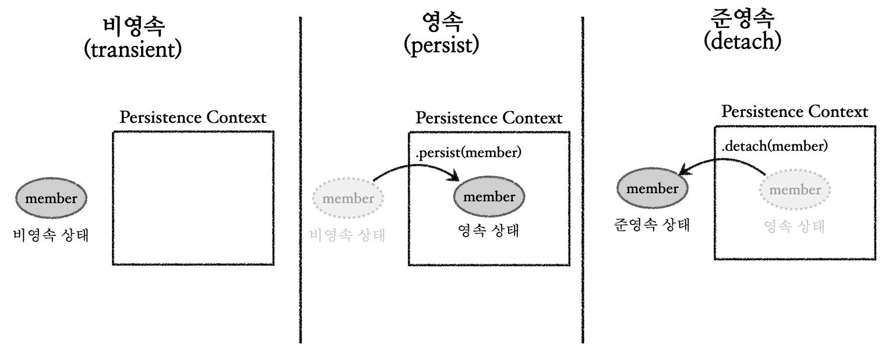
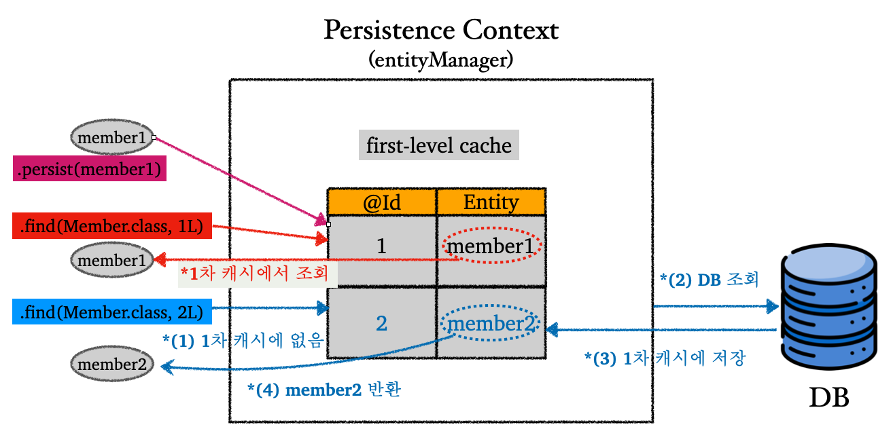
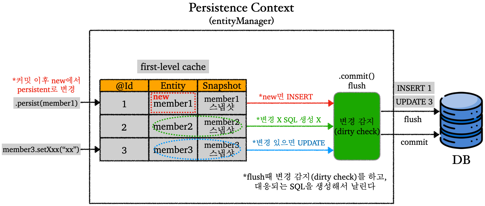

---

## 1. 영속성 컨텍스트(Persistence Context)란?

JPA의 내부 동작원리의 가장 중요한 부분인 영속성 컨텍스트(Pesistence Context)에 대해 알아보자.

먼저 `EntityManagerFactory`와 `EntityManager`에 대해 다시 알아보자.

<br>



<p align="center">EntityManagerFactory, EntityManager</p>

* 엔티티 매니저 팩토리는 하나만 생성해서 사용한다
* 엔티티 매니저 팩토리는 요청마다 엔티티 매니저를 생성하고, 엔티티 매니저는 내부적으로 커넥션풀(CP)의 커넥션을 통해서 DB를 사용한다

<br>

그러면 영속성 컨텍스트란 무엇일까? 일단 한줄로 정의하면, **"엔티티(Entity)를 영구 저장하는 환경"**이다.

이전에 우리는 JPA가 동작하는지 확인하면서 엔티티를 저장하는 코드를 사용해봤다. 그 코드는 다음과 같다.

```java
em.persist(member);
```

* `em` : `EntityManagerFactory`를 통해서 생성한 `EntityManager` 객체
* `member` : 저장하려고 한 엔티티

<br>

그 당시에 우리는 `persist()`를 통해서 엔티티를 저장하면 바로 데이터베이스에 저장하는 걸로 이해했다. 그러나 실제로는 그렇지 않다. **실제로는 `persist()`를 통해서 엔티티를 영속 컨텍스트에 집어넣는 것이다**.

영속성 컨텍스트는 JPA 내부에서 동작하는 논리적인 개념이며, `EntityManager`를 통해서 영속성 컨텍스트에 접근한다.

기본적으로 `EntityManager`를 생성하면 영속성 컨텍스트(`PersistenceContext`)도 하나 생성되며 1:1로 사용된다.

<br>

> 스프링과 같은 프레임워크에서는 `EntityManager`와 영속성 컨텍스트는 `N:1`을 이룬다. 이것에 대한 내용은 추후에 자세히 다룰 것이다. 지금은 일단 `EntityManager`와 영속성 컨텍스트는 `1:1`이라고 가정하고 진행하자.
{: .prompt-info }

<br>



<p align="center">Persistence Context</p>

* 비영속(new/transient)
  * 영속성 컨텍스트와 전혀 관계가 없는 새로운 상태
  * JPA와 아무 연관이 없는 상태로 생각하면 편하다
  * 예) 단순히 생성한 멤버 객체


* 영속(managed)
  * 영속성 컨텍스트에 관리되고 있는 상태
  * 엔티티가 영속성 컨텍스트에 들어가 있는 상황이라고 이해하면 편함
  * `persist()`로 엔티티를 영속성 컨텍스트에 집어 넣으면 영속 상태


* 준영속(detached)
  * 영속성 컨텍스트에 저장되었다가 분리된 상태
  * 영속성 컨텍스트에서 꺼내져서, 영속성 컨텍스트에 의해 관리받지 않는 상태
  * `detach()`로 준영속 상태로 만들 수 있다
  * 비영속 상태와 다른점은, 비영속 객체는 아직 데이터베이스의 테이블과 아무 연관이 없다는 것이고, 준영속 객체는 테이블과 관련있는 엔티티인데 단순히 영속성 컨텍스트에서 분리되었다는 것이다.


* 삭제(removed)
  * 삭제된 상태
  * `remove()`로 삭제. 완전히 없어지는 것이다.

<br>

이전에도 언급했지만, `persist()`는 비영속 상태를 영속 상태로 만들어주는 것이지, `pesist()`가 실행되는 시점에서 쿼리가 실행되고 데이터베이스에 반영되는 것이 아니다. 실제로 쿼리가 날라가서 반영되는 시점은 커밋이 완료되는 시점이다. 코드로 알아보자.

<br>

```java
EntityTransaction tx = em.getTransaction();

tx.begin(); // 트랜잭션 시작

try {
    /**
     * 단순히 멤버 객체 생성
     * 비영속 상태
     */
    Member member = new Member();
    member.setId(1L);
    member.setName("MemberA");
    
    /**
     * persist를 통해서 영속 상태로 전환
     * DB에 저장되지 않음
     */
    em.persist(member);
    
    /**
     * 작업이 모두 성공하면 커밋
     * 커밋되는 순간에 쿼리가 날아가서 DB에 반영이 됨
     */
    tx.commit(); 
} catch (RuntimeException e) {
    tx.rollback(); 
} finally {
    em.close();
}
```

* `persist()` 앞뒤로 `======`를 출력해서 확인해보면 쿼리가 날아가는 시점은 커밋 시점이다
* 뒤의 변경 감지와 플러시에서 자세히 다룬다

<br>

---

## 2. 영속성 컨텍스트를 사용하는 이유

그럼 영속성 컨텍스트는 왜 필요한 것일까? 영속성 컨텍스트의 몇 가지 이점과 필요한 이유에 대해 알아보자.

들어가기 전에 `Member`에 생성자를 추가하자. (참고로 하이버네이트에서 엔티티 클래스에는 기본 생성자를 필수로 추가해야한다)

<br>

### 2.1 1차 캐시

엔티티가 영속성 컨텍스트에 들어갈때 1차 캐시에 저장된다. 이때 1차 캐시의 수명은 `EntityManager`가 살아있는 동안이다. 사실 비즈니스 로직이 굉장히 복잡한 경우가 아닌 이상, 1차 캐시로 얻을 수 있는 성능상 이점은 크지 않다.

<br>



<p align="center">1차 캐시</p>

* `persist()`로 엔티티를 영속 상태로 만드는 것은 사실 영속성 컨텍스트의 1차 캐시에 넣는 것이다
* 1차 캐시에 존재하는 엔티티를 조회하는 경우 DB까지 가지 않고 바로 1차 캐시에서 조회한다
* 1차 캐시에 존재하지 않는 엔티티를 조회하는 경우 DB에서 조회한 결과를 1차 캐시에 저장하고 해당 엔티티를 반환한다
* 위에서는 표기하지 않았지만, 엔티티 말고도 각 엔티티의 초기 상태에 대한 스냅샷도 함께 저장된다. 자세한 내용은 변경 감지(`dirty-check`)에서 다룰 것이다. 

<br>

---

### 2.2 영속 엔티티의 동일성 보장

JPA는 영속 엔티티의 동일성을 보장한다. 쉽게 말해서 같은 PK(`Id`)로 조회하는 모든 엔티티는 동일하다고 보장해준다. 코드로 살펴보면 바로 이해가 갈 것이다.

<br>

```java
Member member1 = new Member(5L, "memberE");

Member findMember1 = em.find(Member.class, 5L);
Member findMember2 = em.find(Member.class, 5L);

System.out.println(findMember1 == findMember2); // 동일성 비교하면 같다고 나옴
```

* `true`가 출력된다
* 같은 `EntityManager`의 스코프 내에서 가능한 것이다!

<br>

---

### 2.3 쓰기 지연(Write-behind), 변경 감지(Dirty-check)

이것은 이전에도 설명했듯이, SQL을 데이터베이스로 날리는 시점은 `persist()`가 실행되는 시점이 아니다.(물론 예외적인 상황은 존재하지만, 이는 뒤에서 다룰 것이다). SQL을 보내는 시점은 모든 작업이 성공하고 `commit()`하고 `flush()`되는 순간이다. 이때 `commit` 호출 직후에 바로 `flush`가 트리거 된다. 이후에 커밋이 완료된다.

<br>

> 뒤에서 자세히 다루겠지만, 일단 `flush`는 영속성 컨텍스트의 변경내용을 데이터베이스에 반영하는 작업으로 생각하자.
{: .prompt-tip }


<br>

이것이 가능한 이유는 기본적으로 **변경 감지(dirty check)**가 가능하기 때문이다. 엔티티가 영속 상태가 되면, 영속성 컨텍스트의 1차 캐시와 함께 엔티티의 초기 상태를 스냅샷 떠서 보관하고, 이후 엔티티의 상태를 스냅샷과 비교해서 변경 내용을 감지할 수 있다. 이것을 JPA의 변경 감지(dirty-check)라고 한다.

그림을 통해서 이해해보자.

<br>



<p align="center">Write-behind, Dirty-check</p>

* **변경 감지(Dirty check)**
  * 엔티티가 영속 상태가 되면서 1차 캐시에 저장될때 초기 상태에 대한 스냅샷도 함께 저장된다
  * 엔티티 매니저가 관리하는 영속성 컨텍스트에서 스냅샷을 기준으로 엔티티에 대한 변경을 감지한다
    * dirty라는 이름이 붙은 이유가, 변경이 있는 엔티티를 더럽다(dirty)로 취급하기 때문
  * 변경 감지 시점은 `flush`가 발생할 때 일어난다
    * 예) 엔티티에 변경이 있으면 `UPDATE`로 취급
    * 예) 엔티티가 삭제되었다면 `DELETE`로 취급
    * 비영속 엔티티를 `persist()`를 이용해서 영속 엔티티로 변경할 때, 해당 엔티티는 `new`로 표시되고, `flush` 때 `INSERT`로 취급된다
  * 정리하면,  `commit()`이 호출되면 `flush`가 발동되어 변경 감지를 통해 변경 내용을 인지하고 SQL을 생성해서 DB로 날린다

<br>

여기서 엔티티를 수정하는 경우 `update(entity)`와 같은 코드를 사용할 것 같지만, 그렇지 않다. 단순히 영속 엔티티의 내용을 수정하는 것만으로도 엔티티를 수정하고 데이터베이스에 반영하는 것이 가능하다. 그 이유는 알다시피 위에서 다룬 변경 감지와 쓰기 지연 때문이다. 또한 `persist(entity)` 같은 코드를 추가할 필요도 없다.

<br>

```java
member1.setName("changedName"); // 영속 엔티티 데이터 수정
tx.commit();
```

* `commit()`이 호출되면 `flush`가 일어남
* 위 코드 처럼 엔티티 변경만으로 데이터 수정 가능

<br>

지금까지 변경 감지와 쓰기 지연에 대한 내용을 다루었다.

위에서 직접적으로 다루진 않았지만, 이런 쓰기 지연을 통해서 여러 SQL을 모아서 한번에 배치(batch)로 처리하는 것이 쉽다.

다음으로, 지금까지 여러번 등장한 `flush`에 대해 알아보자.

<br>

---

### 2.4 플러시(Flush)

플러시(flush)에 대해 알아보자.

플러시는 영속성 컨텍스트의 변경내용을 데이터베이스에 반영하는 작업이다. 플러시가 발생하면 다음이 일어난다.

* 변경 감지(dirty check)
* `new` 상태의 엔티티에 대해서 `INSERT` SQL 생성 + 지금까지의 변경 사항에 대한 SQL 생성
* SQL을 DB로 전송
* 엔티티의 스냅샷을 현재 엔티티의 상태로 업데이트

<br>

플러시는 영속성 컨텍스트를 비우거나 하는 일을 하지 않는다! 플러시는 영속성 컨텍스트와 DB를 동기화하는 작업으로 이해하면 편하다.

<br>

그러면 플러시는 언제 일어날까? 영속성 컨텍스트를 플러시하는 시점은 다음과 같다.

* `entityManager.flush()` : 직접 호출
* 트랜잭션 커밋 이후 : 자동 호출
* JPQL 쿼리 실행 : 자동 호출

<br>

JPQL 쿼리 후에는 왜 자동으로 플러시가 호출될까? 다음과 같은 코드가 있다고 가정해보자.

<br>

```java
/**
 * member1,2,3는 아직 new 상태
 * 데이터베이스에 반영되고 나서야 new에서 영속 상태로 변경
 */
em.persist(member1);
em.persist(member2);
em.persist(member3);

// JPQL 실행
query = em.createQuery("select m from Member m", Member.class);
List<Member> members = qeury.getResultList();
```

* 위의 JPQL이 `member1 ~ 3`이 반영(`INSERT`)되기 전에 사용되면 문제가 생길 수 있다. 그래서 JPQL이 실행되면 플러시를 먼저하고 JPQL이 날아가서 실행된다.

<br>

플러시 모드 옵션은 다음과 같이 설정할 수 있다.

<br>

```java
em.setFlushMode(FlushModeType.COMMIT);
```

* `FlushModeType.AUTO` (기본값) : 커밋이나 쿼리를 실행할 때 플러시
  * 기본값을 사용하는 것 권장
* `FlushModeType.COMMIT` : 커밋할 때만 플러시 

<br>

> 준영속 상태(detached state)
>
> * 이전에도 설명했지만, 영속 상태 엔티티가 영속성 컨텍스트에서 분리된 상태
> * 영속성 컨텍스트가 관리하지 않기 때문에, 제공하는 기능 사용 불가
>
> <br>
>
> 준영속 상태로 만드는 방법은 다음이 존재.
>
> * `em.detach(entity)` : 특정 엔티티만 준영속 상태로 전환
> * `em.clear()` : 영속성 컨텍스트 완전 초기화(삭제 아님!)
> * `em.close()` : 영속성 컨텍스트(엔티티 매니저) 종료
{: .prompt-info }


<br>

---

## Reference

1. [인프런 - 김영한 : 스프링 완전 정복](https://www.inflearn.com/roadmaps/373)
2. [김영한 : 자바 ORM 표준 JPA 프로그래밍](https://product.kyobobook.co.kr/detail/S000000935744)
3. [Udemy - Spring Boot 3, Spring 6 & Hibernate](https://www.udemy.com/course/spring-hibernate-tutorial/?couponCode=ST8MT40924)