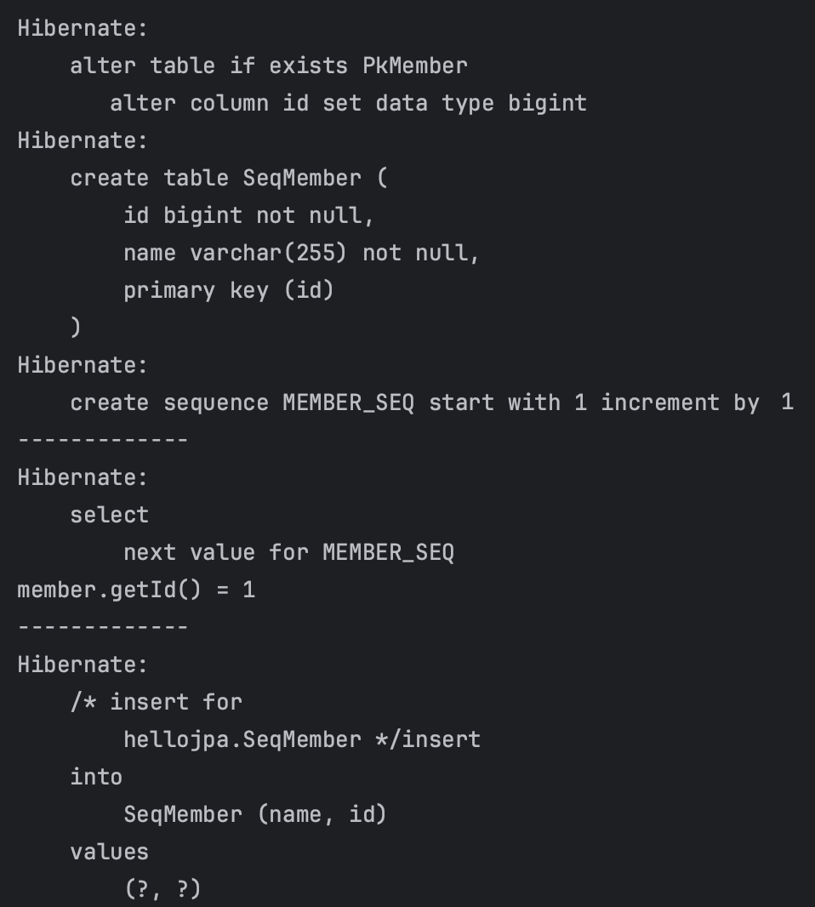

---


## 1. DB 스키마 자동 생성 (`hibernate.hbm2ddl.auto`)

들어가기 전에 JPA에서 지원하는 데이터베이스 스키마 자동 생성에 대해 알아보자. JPA는 DDL을 애플리케이션 실행 시점에 자동 생성되는 기능을 지원한다. 사용하는 방법은 다음과 같다.

<br>

JPA 설정을 위해 `persistence.xml`을 확인하자. 

다음과 같은 설정을 추가할 수 있다.

`예시`

```xml
<property name="hibernate.hbm2ddl.auto" value="OPTION" />
```

* `OPTION` 대신에 다음의 4가지 옵션 중 하나를 선택할 수 있다


* `create` : 기존 테이블 삭제 후 다시 생성 (`DROP` 그리고 `CREATE`)


* `create-drop` : `create` 옵션과 동일 + 종료시점에 테이블 `DROP`


* `update` : 변경 부분만 반영한다
  * 엔티티에 새로운 필드를 추가하고 애플리케이션을 재시작하면, 테이블에 새로운 컬럼이 추가되는 것을 확인할 수 있다


* `validate` : 엔티티와 테이블이 정상 매핑이 되었는지만 확인한다
  * 엔티티에 새로운 필드를 추가해서 애플리케이션을 실행해보면 실패하는 것을 확인할 수 있다


* `none` : 사용하지 않는다. 해당 설정을 주석처리하는 것도 방법이다.

<br>

스테이징 또는 운영 환경에서는 웬만하면 `validate` 또는 `none`을 사용한다.

<br>

> 옵션을 적용하는 경우는 개발 환경에서만 사용하자. (**운영 환경에서 절대 사용하면 안된다! 최대 `validate` 까지만 사용! 대참사 조심!**)
>
> * 개발 초기 단계에서만 `create`, `update` 사용하자
>   * `create`, `update`도 조심해서 사용!
>
> * 테스트 서버는 `update` 또는 `validate`
>   * `update`도 조심해서 사용!
>   * 테스트 서버에 `create`를 사용해버리면, 기존 테스트 서버에서 사용하던 데이터가 다 날라가버리는 참사가 일어남
    {: .prompt-warning }

<br>

---

## 2. 객체 - 테이블 매핑

JPA에서 `@Entity`가 붙은 클래스는 JPA가 관리하며, 엔티티라고 부른다. 테이블과 매핑할 클래스는 `@Entity`가 필수로 붙어있어야한다.

엔티티를 만들때 다음을 주의하자.

* 기본 생성자가 필수
* `final` 클래스, `ENUM`, `Interface`, 내부 클래스 사용 불가

<br>

코드를 통해 살펴보자.

<br>

```java
/**
 * JPA에서 사용할 엔티티 이름을 직접 지정 가능
 * 기본값 : 클래스 이름을 그대로 사용한다
 * 기본값 사용 권장
 */
// @Entity(name = "Customer")

/**
 * @Table을 통해서 엔티티와 매핑할 테이블 직접 지정 가능
 * name - 매핑할 테이블 이름
 * catalog - 데이터베이스 카탈로그 매핑
 * schema - 데이터베이스 스키마 매핑
 * uniqueConstraints - DDL 생성시에 유니크 제약 조건 생성
 */
// @Table(name="USERS")
@Entity
@Getter @Setter
@AllArgsConstructor
public class Customer {
    @Id
    private Long id;
  
    // @Column(length=20)
    private String name;
    private Integer age;

    // 기본 생성자 필수
    public Customer() {
    }

}
```

* `@Column`에 제약 조건을 추가할 수 있다

<br>

---

## 3. 필드 - 칼럼 매핑

`RoleType`에 대한 상수를 만들자.

```java
public enum RoleType {
    USER, ADMIN
}
```

* `USER`와 `ADMIN` 이 두가지 권한이 존재

<br>

```java
@Entity
@Getter @Setter
@AllArgsConstructor
public class Customer {

    @Id
    private Long id;

    /**
     * DB 컬럼명은 name 사용
     * 객체는 username 사용
     */
    @Column(name = "name")
    private String username;

    private Integer age;

    /**
     * 특정 필드를 컬럼에 매핑하지 않음(매핑 무시)
     */
    @Transient
    private Integer point;

    /**
     * enum 타입 매핑
     * DB는 보통 enum 타입이 없음
     */
    @Enumerated(EnumType.STRING)
    private RoleType roleType;

    /**
     * 닐짜 타입 매핑
     * TIMESTAMP는 날짜 + 시간 포함
     * 아래 처럼 Date, Calendar를 사용하는 경우 사용하고
     */
    @Temporal(TemporalType.TIMESTAMP)
    private Date createdDate;

    @Temporal(TemporalType.TIMESTAMP)
    private Date lastModifiedDate;

    /**
     * 만약 LocalDate, LocalDateTime을 사용하면 @Temporal 생략 가능
     */
    private LocalDateTime testLocalDateTime;

    /**
     * VarChar를 넘어가는 큰 데이터는 Lob사용(Clob, Blob)
     * String을 사용했으니 Clob으로 생성됨
     * 니머지는 Blob 매핑
     */
    @Lob
    private String description;

    public Customer() {
    }
}
```

<br>

이제 각 매핑과 관련된 기본적인 속성들을 알아보자.

* `@Column`
  * `name` : 필드와 매핑할 테이블의 컬럼 이름 (기본값 : 객체의 필드명)
  * `insertable`, `updatable` : 등록, 변경 가능 여부 (기본값 : `TRUE`)
  * DDL 관련 속성
    * `nullable` : `null` 값의 허용 여부 설정. `false`로 설정시 DDL 생성 시에 `not null` 제약이 붙는다
    * `unique` : `@Table`의 `uniqueConstraints`와 같다. 한 컬럼에 간단히 유니크 제약 조건을 걸 때 사용
      * 제약 조건의 이름을 식별하기 어려워서 잘 사용 안함, 사용한다면 `uniqueConstraints` 사용을 권장
    * `columnDefinition` : 데이터베이스 컬럼 정보를 직접 주는 것이 가능
      * 예) `varchar(100) default 'EMPTY'`
    * `length` : 문자 길이 제약 조건. `String` 타입에만 사용 (기본값 : `255`)
    * `precision`, `scale` : `BigDecimal` 타입에 사용가능. 정밀한 소수 다룰 때 사용. 

<br>

* `@Enumerated`
  * `enum` 타입을 매핑할 때 사용한다
  * 종류
    * `ORDINAL` : `enum` 순서를 DB에 저장
    * `STRING` : `enum` 이름을 DB에 저장
  * 기본값이 `EnumType.ORDINAL`이지만 사용을 권장하지 않는다!
    * 상수를 추가하거나 순서를 바꾸는 작업 등에서 문제가 생길 확률이 높다
  * `EnumType.STRING`을 사용하도록 하자

<br>

* `@Temporal`
  * 날짜 타입(`Date`, `Calendar`)을 매핑할 때 사용
  * 자바8 이후부터 사용하는 `LocalDate`, `LocalDateTime`을 사용한다면 생략 가능
  * `TemporalType.TIMESTAMP` : 날짜와 시간 모두 포함

<br>

* `@Transient`
  * 필드를 매핑하지 않을 경우 사용
  * `@Transient`가 붙은 필드는 데이터베이스에 저장, 조회 X
  * 보통 값을 DB에 저장하지 않고, 임시로 메모리에 보관해서 사용하고 싶은 경우 사용

<br>

---

## 4. 기본키(PK) 매핑

### 4.1 기본키 매핑 애노테이션 소개

기본키 매핑에 대해 알아보자. 

기본키 매핑에 사용하는 애노테이션은 다음과 같다.

* `@Id`
  * 직접 할당하는 경우 단독으로 `@Id`만 사용한다

<br>

* `@GeneratedValue`
  * 자동생성된 값을 사용한다
  * `strategy` 옵션을 설정해서 어떤 기본키 전략을 사용할지 정할 수 있다.

<br>

`@GeneratedValue` 사용 예시

```java
@Entity
@Getter @Setter
@NoArgsConstructor
@AllArgsConstructor
public class PkMember {

    @Id @GeneratedValue(strategy = GenerationType.IDENTITY)
    private Long id;

    @Column(name = "name", nullable = false)
    private String username;

}
```

* `IDENTITY` 전략 사용

<br>

`strategy` 옵션의 종류는 다음과 같다.

* `IDENTITY`
  * DB에 위임한다
  * 예) MySQL의 `auto_increment`


* `SEQUENCE`
  * DB 시퀀스 오브젝트 사용
  * 예) Oracle의 `sequence`
  * `@SequenceGenerator` 필요


* `TABLE`
  * 키 생성용 테이블 사용해서 시퀀스 흉내
  * 대부분 DB에서 적용 가능
  * `@TableGenerator` 필요
  * 성능이 다른 전략에 비해 좋지 않다


* `AUTO`
  * 사용하는 DB에 따라서 자동 지정
  * 기본값

<br>

> 권장 식별자 전략
>
> * `Long` 타입
> * 자연키를 사용하지 않고 대체키 사용
> * 키 생성전략 사용
{: .prompt-tip }


<br>

---

### 4.2 IDENTITY 전략

`IDENTITY` 전략에 대해 자세히 알아보자.

특징부터 살펴보자.

* 기본 키의 생성을 DB에 위임한다
* MySQL의 `auto_increment`같은 경우
* **JPA에서 `IDENTITY` 전략을 사용하는 경우 `persist()` 시점에 즉시 `INSERT` 쿼리를 실행하고 DB에서 식별자를 조회한다**

<br>

우리가 지금까지 JPA의 동작 방식을 살펴보면서 배운것은, JPA는 보통 트랜잭션의 커밋 시점(정확히는 `flush` 시점)에 `INSERT` SQL을 실행한다는 것이다. 그러나 `IDENTITY` 전략을 사용하면 `persist()` 시점에 `INSERT` 쿼리를 실행하는 이유는 무엇일까?

`auto_increment`를 사용하는 경우, DB에 `INSERT` 쿼리를 실행한 후에 `ID`값을 알 수 있다. 그런데 영속성 컨텍스트를 사용하기 위해서는 PK값을 알아야한다. 이 문제를 해결하기 위해서 `persist()` 호출 시점에 `INSERT` 쿼리를 실행해서 DB에 `ID`값이 생성되면, 해당 `ID`값을 가져와서 사용한다.

이러한 특징 때문에 `IDENTITY` 전략에서는 배치(batch)로 모아서 `INSERT` 하는 것이 불가능하다.(사실 그렇게 성능에 큰 영향을 끼치지는 않는다)

<br>

---

### 4.3 SEQUENCE 전략

`SEQUENCE` 전략에 대해 자세히 알아보자.

특징을 살펴보자.

* DB의 시퀀스 오브젝트 사용
* DB 시퀀스는 유일한 값을 순서대로 생성하는 특별한 데이터베이스 오브젝트이다
* Oracle의 `sequence`

<br>

코드를 살펴보자.

<br>

```java
@Entity
@Getter @Setter
@NoArgsConstructor
@SequenceGenerator(
        name = "MEMBER_SEQ_GENERATOR", // 식별자 생성기의 이름
        sequenceName = "MEMBER_SEQ", // 매핑할 DB 시퀀스의 이름
        initialValue = 1, allocationSize = 1
)
public class SeqMember {

    @Id
    @GeneratedValue(strategy = GenerationType.SEQUENCE,
                    generator = "MEMBER_SEQ_GENERATOR")
    private Long id;

    @Column(name = "name", nullable = false)
    private String username;

    public SeqMember(String username) {
        this.username = username;
    }
}
```

* `initialValue` : 시퀀스를 생성할 때 처음 시작하는 초기값. (기본값 = `1`)
* `allocationSize` : 시퀀스 한 번 호출에 증가하는 수. (기본값 = `50`)

<br>

```java
public class PKMappingMain {
    public static void main(String[] args) {
      
        EntityManagerFactory emf = Persistence.createEntityManagerFactory("hello");

        EntityManager em = emf.createEntityManager();
        EntityTransaction tx = em.getTransaction();
        tx.begin();

        try {

            SeqMember member = new SeqMember("memberA");

            System.out.println("-------------");
            em.persist(member);
            System.out.println("member.getId() = " + member.getId());
            System.out.println("-------------");

            tx.commit();

        } catch (RuntimeException e) {
            tx.rollback();
        } finally {
            em.close();
        }

        emf.close();
    }
}
```

<br>

코드를 실행하면 결과는 다음과 같다.(`hibernate.hbm2ddl.auto`는 현재 `update`)

<br>



* PK가 필요하기 때문에 `persist()` 호출 시점에서 `select next value for MEMBER_SEQ`가 실행된다
  * 쉽게 말해서 시퀀스의 다음값을 가져오고 있다


* `IDENTITY` 전략과 다르게 실제 트랜잭션이 커밋되는 시점에 `INSERT` 쿼리가 날아간다
  * 그렇게 때문에 `SEQUENCE`에서는 `INSERT` 쿼리를 배치로 모았다가 실행하는 것이 가능하다

<br>

이때, 어차피 `INSERT`는 실행될 것이고, 시퀀스 값을 가져오기 위한 요청은 괜히 네트워크 트래픽만 증가 시켜서 성능이 떨어지지 않을까라는 고민을 할 수 있다. `SEQUENCE`의 성능 최적화를 위해서 `allocationSize` 라는 속성이 존재한다.

우리의 코드에서는 `1`로 설정했지만, `allocationSize`의 기본값은 `50`이다. `50`으로 설정하게 되면, 미리 `1 ~ 51` 범위의 아이디를 메모리에 할당해서 사용하게 된다. 이렇게 되면, `1`로 설정했을 때와 다르게, 매 `persist()` 마다 시퀀스 값을 가져오는 요청을 할 필요가 없다. 

`allocationSize`는 `50` ~ `100` 정도 사용하는 것을 권장한다.

<br>

---

## Reference

1. [인프런 - 김영한 : 스프링 완전 정복](https://www.inflearn.com/roadmaps/373)
2. [김영한 : 자바 ORM 표준 JPA 프로그래밍](https://product.kyobobook.co.kr/detail/S000000935744)
3. [Udemy - Spring Boot 3, Spring 6 & Hibernate](https://www.udemy.com/course/spring-hibernate-tutorial/?couponCode=ST8MT40924)
