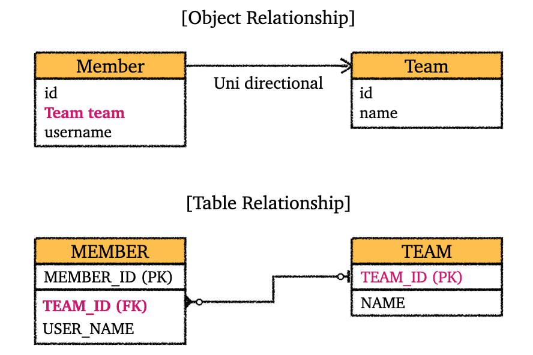
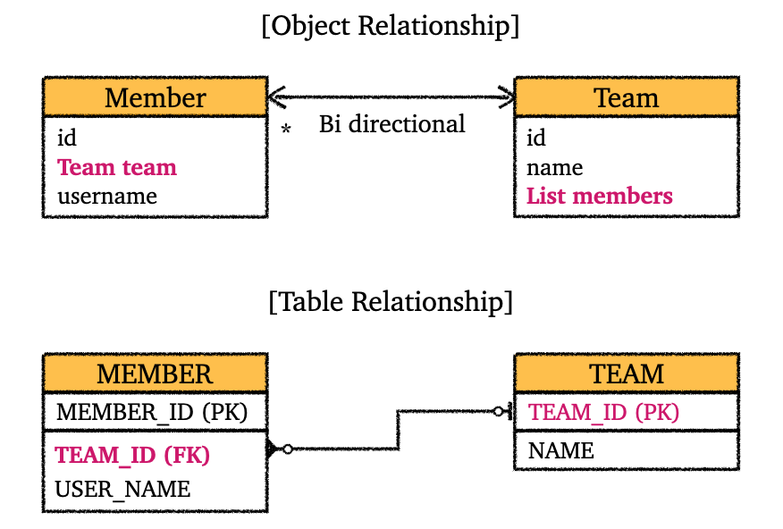

---

> **연관관계 매핑(Relationship Mapping)**
>
> 테이블은 FK로 조인을 해서 연관된 테이블을 찾는다. 반면에, **객체는 참조를 사용해서 연관된 객체를 찾는다**.
>
> 기존 테이블간의 관계와 객체간의 관계에 대한 **패러다임 불일치를 해결하기 위해서 연관관계 매핑이 필요**하다.
{: .prompt-info }

---

## 1. 단방향 연관관계(Uni-directional)

그러면 단방향 연관관계에 대해 알아보자. 객체의 연관관계와 테이블의 연관관계를 나타내면 다음과 같다.

<br>

_단방향 연관관계_

* 객체간 단방향 연관 관계와 테이블간 연관관계이다
* 객체간에는 FK 같은 개념이 없다
* 만약 연관관계 매핑을 사용하지 않는다면, `Member`에 `Team team` 필드가 아니라 `Long teamId` 필드를 이용해서 객체지향스럽지 않게 코딩했을 것이다

<br>

위의 그래프를 바탕으로 단방향 연관관계를 적용한 엔티티와 코드를 살펴보자.

```java
@Entity
@Getter @Setter
@NoArgsConstructor
public class UniDirTeam {

    @Id @GeneratedValue
    @Column(name = "TEAM_ID")
    private Long id;

    private String name;

    public UniDirTeam(String name) {
        this.name = name;
    }

}
```

<br>

```java
@Entity
@Getter @Setter
@NoArgsConstructor
public class UniDirMember {

    @Id @GeneratedValue
    @Column(name = "MEMBER_ID")
    private Long id;

    @Column(name = "USER_NAME", nullable = false)
    private String username;

    @ManyToOne
    @JoinColumn(name = "TEAM_ID")
    private UniDirTeam team;

    public UniDirMember(String username, UniDirTeam team) {
        this.username = username;
        this.team = team;
    }

}
```

* 다대일(N:1) 관계이기 때문에 `@ManyToOne`
* `TEAM_ID`를 통한 단방향 연관관계 매핑
  * `UniDirTeam team`: `UniDirTeam` 엔티티에 대한 참조
  * `UniDirMember`의 `TEAM_ID`는 FK로 사용된다

<br>

```java
// 팀 저장
UniDirTeam team = new UniDirTeam("TeamA");
em.persist(team);

// 멤버 저장
UniDirMember member = new UniDirMember("member1", team);
em.persist(member);

// DB에서 직접 가져오는 쿼리를 보고 싶으면 사용
// em.flush();
// em.clear();

// 조회
UniDirMember findMember = em.find(UniDirMember.class, member.getId());

// 참조를 이용한 연관 관계 조회
UniDirTeam findTeam = findMember.getTeam();
System.out.println("findTeam = " + findTeam.getName());
```

<br>

---

## 2. 양방향 연관관계(Bi-directional)

### 양방향 연관관계 소개

양방향 연관관계에 대해 알아보자.

우리가 이전에 살펴본 **단방향 연관관계에서는 `Member`에서 `Team`으로 갈 순 있지만, `Team`에서 `Member`로 가는 것은 불가능했다**. **양방향 연관관계라는 것은 결국 참조를 통해 양쪽으로 갈 수 있는 관계**라는 뜻이다.

테이블의 경우 양방향 연관 관계도 아니고, 그냥 FK(외래키)만 있으면 테이블간에 연관 관계를 가질 수 있다. 그러나 **객체에서는 단방향 연관 관계인 경우, 한쪽 방향으로 참조해서 연관 관계를 가질 수 있지만, 그 반대 방향은 불가능**하다. (FK를 가지는 엔티티에 해당하는 테이블에서 다른 테이블로 연관 관계는 가능하지만, 그 반대는 불가)

양방향 연관 관계가 성립하기 위해서는 **PK만 가지고 있던 엔티티에 반대 방향의 엔티티에 대한 리스트가 있어야 가능**하다. 그림으로 살펴보자.

<br>



<p align="center">양방향 연관관계</p>

<br>

해당 그래프를 바탕으로 기존 코드를 수정해서 양방향 연관관계로 만들어보자.

```java
@Entity
@Getter @Setter
@NoArgsConstructor
public class BiDirMember {

    @Id
    @GeneratedValue
    @Column(name = "MEMBER_ID")
    private Long id;

    @Column(name = "USER_NAME", nullable = false)
    private String username;

    @ManyToOne
    @JoinColumn(name = "TEAM_ID")
    private BiDirTeam team;

    public BiDirMember(String username, BiDirTeam team) {
        this.username = username;
        this.team = team;
    }
}
```

* `Member`의 경우 기존 단방향과 동일하다

<br>

```java
@Entity
@Getter @Setter
@NoArgsConstructor
public class BiDirTeam {

    @Id
    @GeneratedValue
    @Column(name = "TEAM_ID")
    private Long id;

    private String name;

    /**
     * Team이 One, Member가 Many
     * (mappedBy = "team"): 반대편에 대응되는 변수명 team
     */
    @OneToMany(mappedBy = "team")
    private List<BiDirMember> members = new ArrayList<>(); // add시 NPE 방지

    public BiDirTeam(String name) {
        this.name = name;
    }

    public BiDirTeam(String name, List<BiDirMember> members) {
        this.name = name;
        this.members = members;
    }
}
```

* `mappedBy`에 대한 내용은 뒤에서 더 자세히 다룰 예정이다

<br>

```java
BiDirTeam team = new BiDirTeam("TeamA");
em.persist(team);

BiDirMember member = new BiDirMember("member1", team);
em.persist(member);

em.flush();
em.clear();

BiDirMember findMember = em.find(BiDirMember.class, member.getId());
List<BiDirMember> members = findMember.getTeam().getMembers(); // 역방향 조회 가능

for (BiDirMember m : members) {
System.out.println("m.getUsername() = " + m.getUsername());
}
```

<br>

다음으로  `mappedBy`와 연관관계의 주인에 대한 내용을 알아보자.

<br>

---

### ⭐연관관계의 주인(Owning side of Relationship)

위의 양방향 연관관계를 사용하기 위해서 `Team`에 추가한 `List<Member> members`에 `@OneToMany(mappedBy = "team")`를 사용했다.

이제부터 **`mappedBy`와 연관관계의 주인**에 대한 내용을 알아보자.

먼저 객체끼리 연관관계를 맺는 경우와 테이블끼리 연관 관계를 맺는 경우를 살펴보자.

<br>

* **객체끼리 양방향 연관 관계**
  * `Member` → `Team`: 하나의 단방향 연관관계
  * `Team` → `Member`: 하나의 단방향 연관관계
  * 총 2개의 단방향 연관관계
    * 쉽게 말해서 객체에서는 한쪽 방향으로 가기 위한 참조가 필요

<br>

* **테이블 끼리 연관 관계**
  * `MEMBER` ↔ `TEAM`
  * 양방향 연관관계라기 보다는 FK를 통해 양쪽으로 `JOIN` 가능

<br>

객체끼리의 양방향 연관 관계는 결국 **서로에 대한 참조가 존재해야 가능**하다. 그렇기 때문에, 위의 양방향 연관관계에서도 `Team`에 `List<Member> members`를 추가 했었다. 

문제는 여기서부터다. 그러면 **어느쪽을 가지고 연관관계 매핑을 해야할까?** `team`을 가지고 연관관계 매핑을 해야할까, 아니면 `members`를 가지고 연관관계 매핑을 해야할까? **쉽게 말해서 어느값을 기준으로 바꿔야 FK를 업데이트 할 것인지 정해야한다**.

쉽게 이야기해서, `Member`의 `team`으로 FK를 관리할지, `Team`의 `List members`로 FK를 관리할지 정해야한다. 여기서 연관관계의 주인이라는 개념이 나온다.

<br>

---

### 양방향 매핑 규칙

**연관관계의 주인(owner of relationship)과 양방향 매핑의 규칙은 다음과 같다.**

* **연관관계의 주인만이 외래키(FK)를 관리**(등록, 수정)한다
* 객체의 **두 관계중 하나를 연관관계의 주인**으로 지정한다
* 주인이 아닌쪽은 읽기만 가능하다
* 주인은 `mappedBy` 속성을 사용하지 않는다
* **주인이 아닌쪽이 `mappedBy` 속성을 통해 주인을 지정한다**
  * 예: `@OneToMany(mappedBy = "team")`: `Team` 쪽에서 `Member`의 `team`을 주인으로 지정했다

<br>

연관관계의 주인이 무엇인지는 알았다. 그러나 누구를 주인으로 지정해야하는지에 대한 물음은 해결되지 않았다.

**단도직입적으로 이야기 하자면, FK가 있는 곳을 주인으로 정하는게 좋다.(Many쪽을 연관관계의 주인으로 지정)** 우리의 경우 `Member`의 `team`을 주인으로 지정하는 것.

<br>

---

### 양방향 매핑시 주의점, 권장사항

양방향 매핑시의 주의점에 대해 알아보자.

<br>

#### 연관관계의 주인에 값을 입력하지 않음

```java
BiDirTeam team = new BiDirTeam("TeamA");
em.persist(team);

// 이번에는 flush()와 clear() 사용 x

/**
 * 주인에 team 입력 필수
 * 입력하지 않으면 TEAM_ID가 null
 * 생성자를 이용하든, setter를 이용하든 입력해야함
 */
BiDirMember member = new BiDirMember("member1", team);
// 생성자 사용안하는 경우 아래 처럼할 수도 있음
// BiDirMember member = new BiDirMember();
// member.setName("member1");
// member.setTeam(team); // 이 부분이 필수
em.persist(member);

team.getMembers().add(member); // 역방향으로만 하면 문제가 생김
```

* **양방향이면 순수객체 상태를 고려해서 양쪽으로 값을 셋팅하는 것이 좋다**
  * `Member member = new Member("member1", team);`
    * 대신 `member.setTeam(team);` 사용 가능
  * `team.getMembers().add(member);`

<br>

---

#### 연관관계 편의 메서드를 생성하자

양쪽으로 값을 셋팅하는 것이 좋은데, **개발자는 사람이기 때문에 어떤 경우에 역방향으로 값을 입력하는 것을 까먹을 수 있다**. 이런 경우를 방지하기 위해서, **연관관계 주인 쪽의 값을 셋팅하는 `setXXX()` 메서드에 역방향의 값을 입력하는 로직까지 포함**시키면 편하게 해결할 수 있다.

코드로 살펴보자.

```java
public void setTeam(Team team) {
    this.team = team;
    // 아래 로직을 추가해서 편하게 사용
    team.getMembers().add(this); // this는 현재 Member의 객체
}
```

* 이제 `team.getMembers().add(member);`을 사용할 필요 없이, `member.setTeam(team);`만 사용해도 양방향으로 값이 셋팅됨
* 아마 실제 편의 메서드를 구현할 때 기존 연관관계를 끊어주는 로직도 필요한듯

<br>

생성자를 살짝 수정하고, 위 편의 메서드를 조금 더 개선해보자.

```java
public Member(String username) {
    this.username = username;
}

private void addTeam(Team team) {
    if (this.team != null) {
        this.team.getMembers().remove(this);
    }
    this.team = team;
    team.getMembers().add(this);
}
```

* 기존 `setTeam`을 `addTeam`이라는 이름으로 사용. `changeTeam` 같은 명칭도 ㄱㅊ

<br>

실제로 사용할 때 다음과 같이 사용.

```java
Team team = new Team("TeamA");
em.persist(team);
Member member = new Member("member1");
member.addTeam(team); // 이걸로 양방향 값 셋팅
em.persist(member);
```

<br>

`Member` 기준으로 편의메서드를 만들것인지, `Team` 기준으로 편의메서드를 만들것인지 상황 봐가면서 정하자.

<br>

---

#### 양방향 매핑시 무한루프 조심

* `toString()` 오버라이드시 조심
  * lombok 라이브러리 주의: 롬복의 `@toString` 사용하지 말자, 사용해도 사이드 이펙트를 주의하면서 사용하자
* JSON 생성 라이브러리 사용시 주의
  * 컨트롤러에서 바로 엔티티를 반환하면 안된다
  * 엔티티는 DTO로 변환해서 반환하자

<br>

---

### 양방향 매핑 정리

* 단방향 매핑으로도 연관관계 매핑은 거의 완료된다
* 양방향 매핑은 단방향 매핑에서 역방향 조회 기능이 추가된 것이다

<br>

권장 방식

* **단방향 매핑으로 먼저 설계하되, 필요한 경우 양방향 매핑으로 추가**한다(어차피 DB 테이블은 변하지 않음)
  * 단방향 매핑으로 설계해놓고, 역방향 조회가 필요하면 SQL 사용하는 것도 가능하다(물론 이것은 객체 중심적 접근은 아님)
  * 나중에 역방향 탐색이 많이 필요한 경우 추가하면 된다

<br>

---

## Reference

1. [인프런 - 김영한 : 스프링 완전 정복](https://www.inflearn.com/roadmaps/373)
2. [김영한 : 자바 ORM 표준 JPA 프로그래밍](https://product.kyobobook.co.kr/detail/S000000935744)
3. [Udemy - Spring Boot 3, Spring 6 & Hibernate](https://www.udemy.com/course/spring-hibernate-tutorial/?couponCode=ST8MT40924)