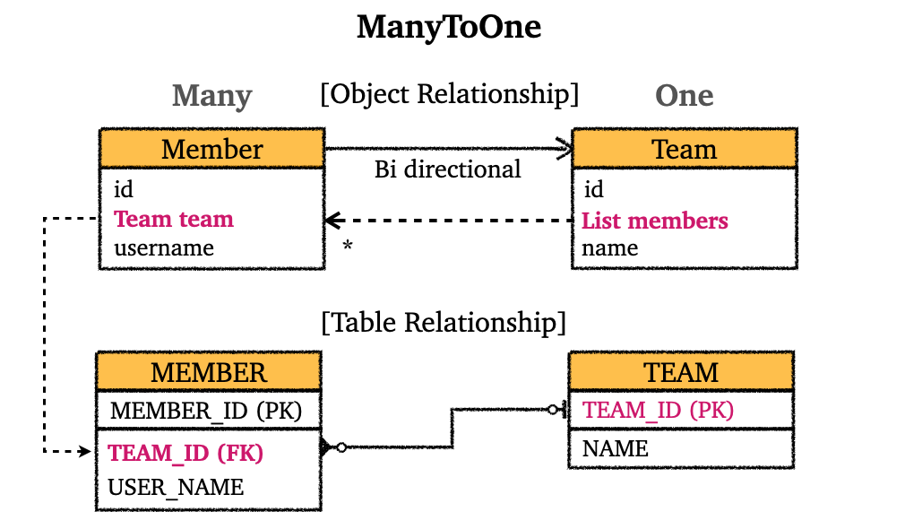
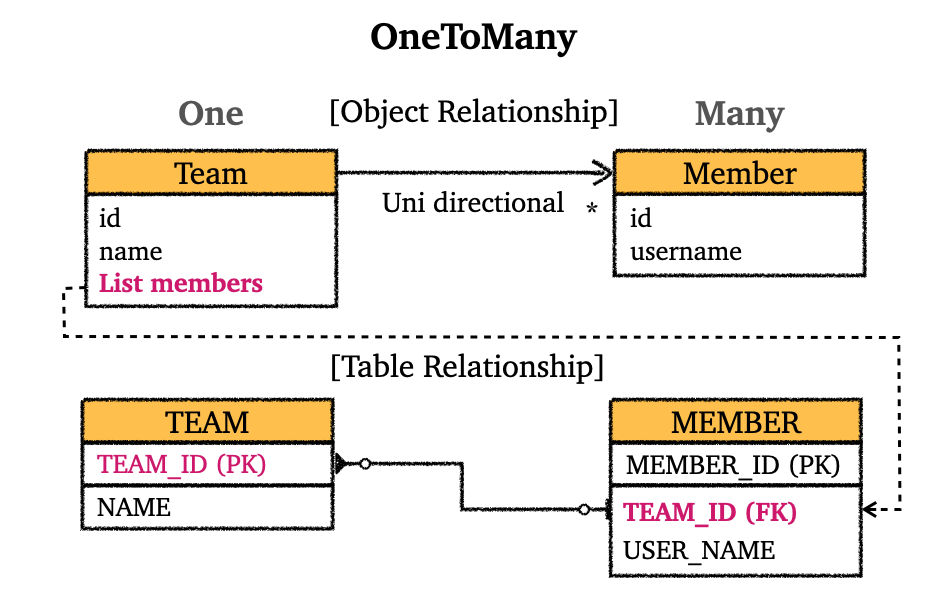

---

## 1. 연관관계 카디널리티(Cardinality)

연관관계 매핑시 개발자는 3가지 사항을 고려해야한다.

* 단방향 vs 양방향
* 연관관계의 주인 정하기
* 연관 관계의 카디널리티(cardinality)

 

연관 관계의 카디널리티에 대해 알아보자. 일단 카디널리티라는 것은 연관 관계에서 엔터티 집합의 엔터티가 관계 엔터티 집합에 참여하는 횟수를 의미한다.

예시를 통해서 설명하겠다. 우리가 이전에 사용한 `Member`와 `Team`을 생각해보자. 하나의 `Team`을 기준으로 `Member`는 여러명이 존재할 수 있다, 반면에 하나의 `Member`당 `Team`이 여러개 존재하지 않는다. 이것이 `Member`의 기준으로 다대일(`ManyToOne`, N:1) 관계이다.

반대로 생각하면 `Team` 기준으로 일대다(`OneToMany`, 1:N) 관계가 되는 것이다.

 

JPA는 이런 카디널리티에 대한 4가지 애노테이션을 제공한다.

* `@ManyToOne`
* `@OneToMany`
* `@OneToOne`
* `@ManyToMany`

 

> `@ManyToMany`는 실무에서 쓰이지 않는다. 뒤에서 다루겠지만, `@ManyToOne`, `@OneToMany`로 풀어낸다.
{: .prompt-tip }

 

* `@JoinColumn` 주요 속성
  * `@JoinColumn`은 FK를 매핑할 때 사용한다
  * `name` : 매핑할 FK의 이름
  * `referencedColumnName` : FK가 참조하는 대상 테이블의 컬럼명
  * `foreignKey` : FK의 제약조건을 직접 지정(DDL)

 

* `@ManyToOne` 주요 속성
  * `optional` : `false`로 설정시 연관된 엔티티가 항상 존재해야한다 (기본값 : `true`)
  * `fetch` : 글로벌 fetch 전략 지정
    * 기본 : `FetchType.EAGER`
  * `cascade` : 영속성 전이 기능 사용
  * `targetEntity` : 연관된 엔티티의 타입정보 설정(잘 사용 안함)

 

---

## 2. 다대일(N:1, @ManyToOne)

다대일 매핑에 대해 알아보자. 우리는 이미 이전에 단방향, 양방향을 설명하면서 다대일 관계에 대해 많이 보았다.

**다**대일(**Many**ToOne) 관계에서는 **다(Many)** 쪽이 연관 관계의 주인(FK 관리)이라는 뜻이다. 

이전에 봤던 그림으로 다시 복습해보자.

 

다대일 양방향 연관관계

 

---

## 3. 일대다(1:N, @OneToMany)

**일**대다(**One**ToMany) 관계에서는 **일(One)** 쪽이 연관 관계의 주인(FK 관리)이라는 뜻이다. 

일대다 관계의 문제점은 보통 테이블의 일대다 관계에서 다(N) 쪽에 FK(외래키)가 있다는 점이다. 이 때문에 일대다 관계를 사용하면 객체와 테이블의 차이점 때문에, 반대편 테이블의 FK를 관리하는 특이한 구조가 나온다.

 

일대다 단방향 연관관계

 

엔티티가 관리하는 FK가 다른 테이블에 존재하는 구조 때문에 `INSERT` 쿼리가 실행될 때 연관관계 관리를 위해 추가로 `UPDATE` 쿼리가 나가게되고, 이는 성능상 이점이 아무것도 없다.

만약에라도 객체 중심적 설계에서 일대다가 더 자연스러운 설계이더라도, 데이터베이스의 입장에서는 다(N) 쪽에서 FK를 관리하는 것이 자연스럽기 때문에, 대부분 상황에서는 일대다 단방향 매핑을 사용하지 않고 다대일 양방향 매핑을 사용하는 것을 권장한다.

 

> 일대다 양방향 연관관계도 work around로 구현할 수 있다.
{: .prompt-tip }

 

---

## 4. 일대일(1:1, @OneToOne)

* 일대일 관계는 주 테이블, 대상 테이블 중에 FK 선택 가능
* FK에 데이터베이스 유니크 제약조건을 추가해야한다

 

일대일 관계의 핵심은 결국 주 테이블에서 FK를 관리할지, 대상 테이블이 FK를 관리할지 결정하는 것이다.

* 주 테이블에 FK
  * 주 객체가 대상 객체의 참조를 가지는 것 처럼, 주 테이블에 FK를 두고 대상 테이블을 찾는다
  * JPA 매핑이 편리하다
  * 장점 : 주 테이블만 조회해도 대상 테이블에 데이터가 있는지 확인 가능하다
  * 단점 : 값이 없으면 FK에 `null` 값 허용

 

* 대상 테이블에 FK
  * 대상 테이블에 FK가 존재한다
  * 전통적인 DBA들이 선호한다
  * 장점 : 주 테이블과 대상 테이블을 일대일에서 일대다 관계로 변경할 때 테이블 구조 유지가능
  * 단점 : 프록시 기능의 한계로 지연로딩(lazy loading)으로 설정해도 항상 즉시 로딩(eager loading) 됨

 

> 일대일 관계에서 두 엔터티가 강력히 커플링(coupling) 되었다면, 두 엔터티를 하나로 합치는 것도 고려하자.
{: .prompt-tip }

 

---

## 5. 다대다(N:M, @ManyToMany)

@ManyToMany의 사용은 권장하지 않는다.

* DB와 다르게 객체 두 개는 컬렉션을 이용해서 서로 다대다가 가능하다
* DB는 중간에 연결 테이블이 있어야 다대다 관계가 가능하다
* 사용해보면 예상 못하는 이상한 쿼리들이 나가는 것을 확인할 수 있다
* 정말 필요하다면 연결 테이블에 해당하는 엔티티를 만들어서 `@OneToMany`, `@ManyToOne`을 이용하는 것을 권장한다

---

## Reference

1. [인프런 - 김영한 : 스프링 완전 정복](https://www.inflearn.com/roadmaps/373)
2. [김영한 : 자바 ORM 표준 JPA 프로그래밍](https://product.kyobobook.co.kr/detail/S000000935744)
3. [Udemy - Spring Boot 3, Spring 6 & Hibernate](https://www.udemy.com/course/spring-hibernate-tutorial/?couponCode=ST8MT40924)
