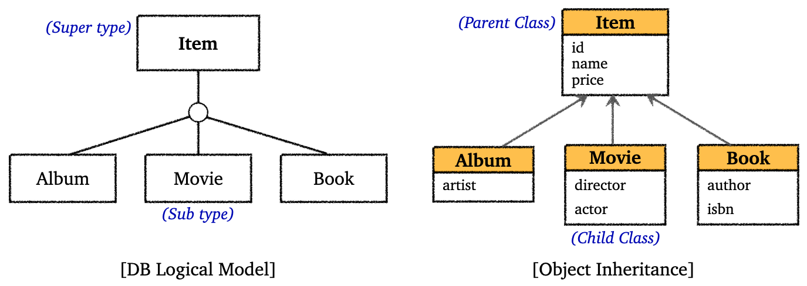
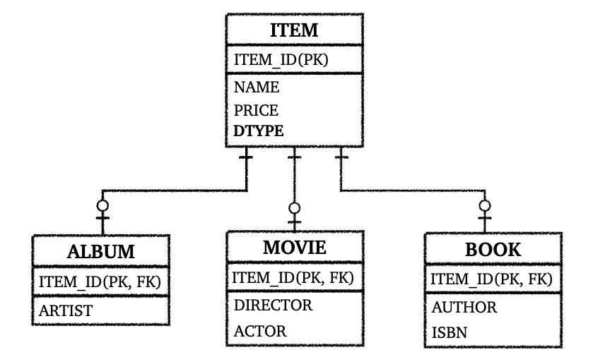
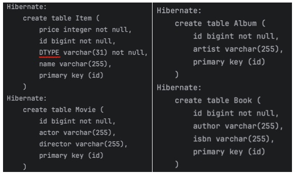
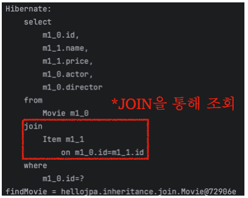
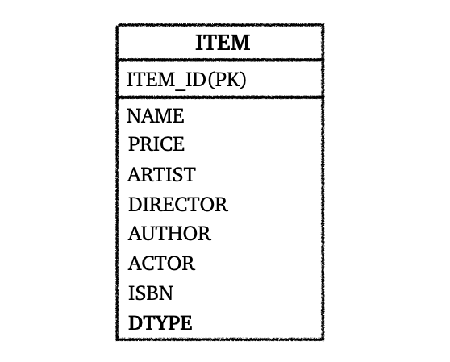
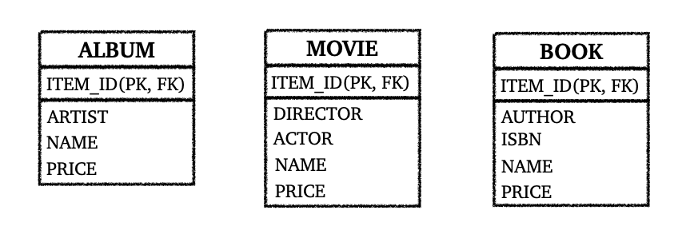
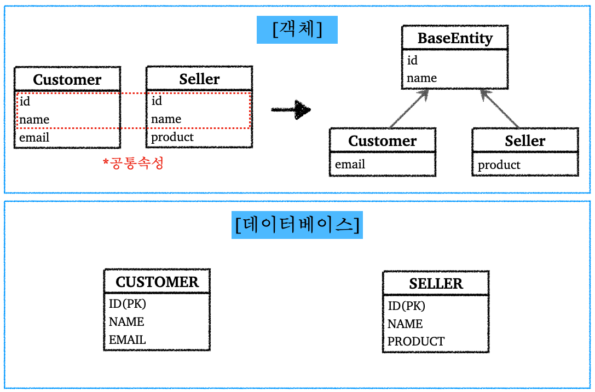

---

## 1. 상속 관계 매핑 소개

하이버네이트에서의 상속 관계 매핑(Inheritance Relationship Mapping)에 대해 알아보자.

객체에는 기본적으로 상속 관계가 존재한다. 그러나 데이터베이스에서는 상속 관계는 존재하지 않는다.(물론 상속 관계 비슷한 것을 지원하는 DB들도 존재하지만, 그것 마저도 실제 객체의 상속 관계와는 다르다.)

그나마 데이터베이스에서 객체의 상속 구조를 비슷하게 표현할 수 있는 것이 슈퍼타입(super-type)과 서브 타입(sub-type) 관계이다.

다음 그림으로 두 관계를 살펴보자. 

<br>



<p align="center">슈퍼-서브 타입 구조, 상속 구조</p>

<br>

이런 슈퍼 타입과 서브 타입 구조를 실제 물리적인 모델로 구현하기 위해 데이터베이스 입장에서 다음의 3가지 방법을 사용할 수 있다.

* 각각 테이블로 변환해서 조인해서 사용하는 전략
* 모두 하나의 테이블로 통합해서 단일 테이블을 사용하는 전략
* 서브 타입들을 모두 테이블로 변환해서 사용, 쉽게 말해서 구현 클래스마다 테이블을 사용하는 전략

<br>

Hibernate는 위 3가지 방법 모두 사용할 수 있도록 애노테이션을 제공한다. 이제 각 전략과 사용법에 대해 알아보자.

<br>

---

## 2. 조인 전략(JOINED)

조인 전략에 대해 알아보자. 물리 모델로 구현한 조인 전략을 그림으로 살펴보면 다음같다.

<br>



<p align="center">JOINED 전략</p>

<br>

코드로 살펴보자.

<br>

`Item` : 부모 클래스

```java
@Entity
@Setter @Getter
@NoArgsConstructor
@Inheritance(strategy = InheritanceType.JOINED)
public class abstract Item {

    @Id @GeneratedValue
    private Long id;

    private String name;
    private int price;

    public Item(String name, int price) {
        this.name = name;
        this.price = price;
    }
}
```

* `abstract` 클래스로 만든다 (단독으로 사용 방지)
* `@Inheritance(strategy = InheritanceType.JOINED)` : 조인 전략을 선택한다
* `@DiscriminatorColumn` : DTYPE 컬럼 생성
  * DTYPE에는 엔티티명이 들어가게 된다
  * 넣는 것을 권장한다

<br>

`Album`

```java
@Entity
@Setter
@NoArgsConstructor
// @DiscriminatorValue("A")
public class Album extends Item {
    private String artist;

    public Album(String name, int price, String artist) {
        super(name, price);
        this.artist = artist;
    }
}
```

* `@DiscriminatorValue("A")`를 통해서 DTYPE으로 들어가는 값을 바꿀수 있다. 기본값은 기존 엔티티명이다
  * 예) `"A"`로 설정하면, DTYPE에 `Album`은 `A`로 표기됨

<br>

`Movie`

```java
@Entity
@Setter
@NoArgsConstructor
public class Movie extends Item {

    private String director;
    private String actor;

    public Movie(String name, int price, String director, String actor) {
        super(name, price);
        this.director = director;
        this.actor = actor;
    }
}
```

<br>

`Book`

```java
@Entity
@Setter
@NoArgsConstructor
public class Book extends Item {

    private String author;
    public String isbn;

    public Book(String name, int price, String author, String isbn) {
        super(name, price);
        this.author = author;
        this.isbn = isbn;
    }
}
```

<br>

다음 코드를 실행해보자.

```java
Movie movie = new Movie("매트릭스", 12000, "워쇼스키", "키아누 리브스");

em.persist(movie);

em.flush();
em.clear();

Movie findMovie = em.find(Movie.class, movie.getId());
System.out.println("findMovie = " + findMovie);
```

* 테이블이 어떻게 생성되고, 조회를 어떻게 하는지 SQL을 확인해보자.

<br>



<p align="center">생성된 테이블</p>

* `JOINED` 전략에 맞게, 각 객체에 대한 테이블을 생성해서 서로 조인해서 사용할 수 있도록 한다

<br>



<p align="center">JOIN으로 조회</p>

* 조회하기 위해서 `JOIN`하는 것을 확인할 수 있다

<br>

조인 전략의 장점은 다음과 같다.

* 다른 전략에 비해 테이블들이 더 정규화되었다
  * 아주 쉽게 이야기하자면, 중복이 더 제거 된다
* 저장공간을 더 효율적으로 사용한다
* FK 참조 무결성 제약조건을 활용 할 수 있다
  * 예를 들어 주문 정보에서 물건을 확인할때, `Item`만 확인해서 조회하는 것이 가능하다. 굳이 서브 타입까지 내려가서 조회할 필요가 없다. 

<br>

단점은 다음과 같다.

* 조회시 조인을 많이 사용하게 될 수 있다
  * 조인이 많으면 성능 저하
* 조회 쿼리가 더 복잡하다
* 데이터 저장시 `INSERT` 쿼리 2번 호출

<br>

---

## 3. 단일 테이블 전략(SINGLE_TABLE)

단일 테이블 전략에 대해 알아보자. 물리 모델로 구현한 단일 테이블 전략을 그림으로 살펴보면 다음같다.

<br>



<p align="center">단일 테이블 전략</p>

* 단일 테이블 전략은 그림에서 볼 수 있듯이, 테이블을 나누지 않고 하나의 테이블에 다 때력박는 전략이다
* 조회 성능이 필요할 때 사용할 수도 있다. 장점과 단점에 대한 내용은 뒤에서 설명.

<br>

단일 테이블 전략을 사용하기 위해서는 `@Inheritance(strategy = InheritanceType.SINGLE_TABLE)`을 사용하면 된다.

<br>

단일 테이블 전략의 장점은 다음과 같다.

* 조인이 필요 없기 때문에 조회 성능이 빠르다
* 조회 쿼리가 단순하다

<br>

단점은 다음과 같다.

* 자식 엔티티가 매핑한 컬럼은 모두 `null`을 허용 해야한다
* 테이블이 불필요하게 커질 수 있다.
  * 상황에 따라서 오히려 성능이 떨어짐
  * 불필요한 공간 낭비

<br>

---

## 4. 클래스 마다 테이블 전략(TABLE_PER_CLASS)

클래스 마다 테이블을 만드는 전략에 대해 알아보자. 물리 모델로 구현한 클래스 마다 테이블 전략을 그림으로 살펴보면 다음같다.

<br>



<p align="center">클래스 마다 테이블 전략</p>

<br>

클래스 마다 테이블 전략은 `InheritanceType.TABLE_PER_CLASS`를 선택해서 사용하면 된다.

위의 그림에서도 확인할 수 있듯이, 각 구현마다 테이블을 생성해서 `Item`에 대한 속성도 전부 포함하고 있다. 굳이 객체로 따지자면, 반복되는 필드가 있어도 굳이 상속 받지 않고 그냥 각 클래스에 대해 테이블을 만드는 것이다.

<br>

`TABLE_PER_CLASS` 전략은 권장하지 않는다. 그냥 쓰지 말자.

<br>

장점

* 서브 타입을 명확하게 구분해서 처리할 때 효과적이다
* `not null` 제약 조건을 사용할 수 있다

<br>

단점

* 여러 자식 테이블과 함께 조회하면 성능이 느림
* 자식 테이블까지 통합해서 쿼리하는 것이 힘들다

<br>

---

## 5. @MappedSuperclass

`@MappedSuperclass`는 공통 매핑 정보가 필요할 때 사용한다. 다음 그림을 보면 바로 이해가 될 것이다.

<br>



<p align="center">공통 속성이 존재하는 경우</p>

<br>

이런 `@MappedSuperclass`는 상속관계 매핑이 아니며, 단순히 부모 클래스를 상속 받는 자식 클래스에 매핑 정보만 제공하고 싶을때 사용한다. 예를 들어서 등록일, 수정일, 등록자, 수정자와 같은 전체 엔티티에서 공통으로 적용하는 속성을 사용하고 싶을때 쉽게 적용할 수 있도록 해준다.

만약 `@MappedSuperclass` 기능이 없었다면, 이전과 같은 공통 속성들을 기존 엔티티에 복사 붙여넣기 하면서 고생했을 것이다. 

코드로 사용법을 알아보자.

<br>

공통 속성을 모아놓은 `BaseEntity` 부터 만들어보자.

```java
@MappedSuperclass
@Getter @Setter
public abstract class BaseEntity {

    private String createdBy;
    private LocalDateTime createdDate;
    private String lastModifiedBy;
    private LocalDateTime lastModifiedDate;

}
```

* 단독으로 생성해서 사용하지 할 필요 없기 때문에 `abstract` 클래스로 만든다
* `@MappedSuperclass`들은 보통 엔티티에서 공통으로 적용하는 속성들을 모아놓는다
* `@MappedSuperclass`는 조회나 검색이 불가능
* `@MappedSuperclass`는 엔티티가 아님, 단순히 속성만 제공해주는 애임

<br>

`BaseEntity`를 상속받아서 사용하기 위해서는 단순히 `extends`를 사용하면 된다.

```java
@Entity
@NoArgsConstructor
public class Seller extends BaseEntity {
    @Id @GeneratedValue
    private Long id;
    private String product;
}
```

* 테이블이 생성되는 SQL을 살펴보면 공통 속성까지 전부 포함해서 생성하는 것을 확인 가능

<br>

---

## Reference

1. [인프런 - 김영한 : 스프링 완전 정복](https://www.inflearn.com/roadmaps/373)
2. [김영한 : 자바 ORM 표준 JPA 프로그래밍](https://product.kyobobook.co.kr/detail/S000000935744)
3. [Udemy - Spring Boot 3, Spring 6 & Hibernate](https://www.udemy.com/course/spring-hibernate-tutorial/?couponCode=ST8MT40924)