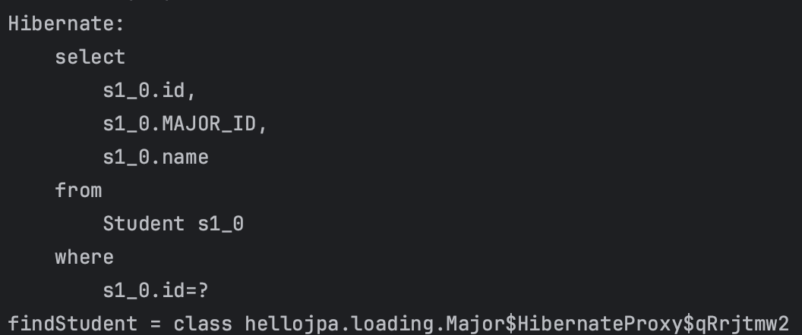
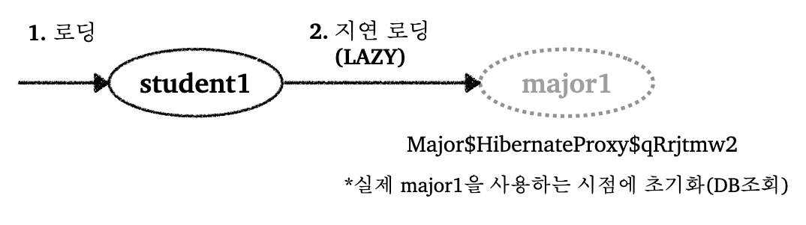
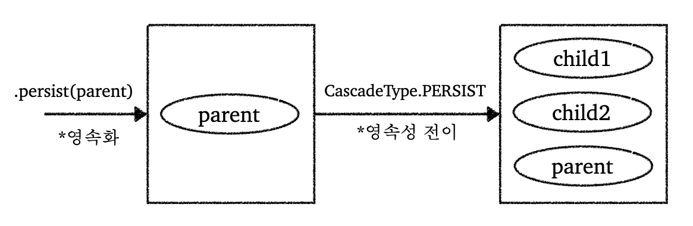

---

## 1. 즉시 로딩(EAGER), 지연 로딩(LAZY)

즉시 로딩과 지연 로딩에 대해 알아보자. 

다음 상황이라고 가정해보자, `Student`(학생) 엔티티에서 `Major`(전공) 엔티티로 단방향 `@ManyToOne` 연결 관계이다.

애플리케이션을 만들다보면 비즈니스 로직에서 `Student` 정보만 사용하고 `Major` 정보는 적은 빈도로 사용하는 상황이 있을 수 있다. 이때 `Student`와 함께 `Major`도 **함께 조회하는 것은 비효율적이기 때문에 하이버네이트는 지연 로딩(lazy loading) 기능을 제공**한다.

쉽게 말해서 **당장 필요한 데이터만 조회하고, 나중에 정말 필요할 때 다시 쿼리가 나가서 연관된 데이터를 가져오는 방식**이다.

<br>

코드를 통해 살펴보자.

```java
@Entity
@Getter @Setter
@NoArgsConstructor
public class Student {

    @Id @GeneratedValue
    private Long id;

    private String name;

    /**
     * LAZY : 지연 로딩
     * 기본값 : EAGER(즉시 로딩)
     * 즉시 로딩은 사용하지 말자
     */
    @ManyToOne(fetch = FetchType.LAZY)
    @JoinColumn(name = "MAJOR_ID")
    private Major major;

    public Student(String name, Major major) {
        this.name = name;
        this.major = major;
    }
}
```

* `@ManyToOne`, `@OneToOne`은 기본이 `EAGER`(즉시 로딩)이다
* `@OneToMany`, `@ManyToMany`는 기본이 `LAZY`
* 뒤에서 자세히 설명하겠지만 **즉시로딩을 사용하지 말고, 모든 상황에서 지연 로딩(`LAZY`)을 사용**하는 것을 권장한다

<br>

```java
@Entity
@Getter @Setter
@NoArgsConstructor
public class Major {

    @Id @GeneratedValue
    @Column(name = "MAJOR_ID")
    private Long id;

    private String name;

    public Major(String name) {
        this.name = name;
    }
}
```

<br>

지연 로딩이 적용된 상태에서 `student1`을 조회해보자.

```java
Major major1 = new Major("전자전기공학");
em.persist(major1);

Student student1 = new Student("김xx", major1);
em.persist(student1);

em.flush();
em.clear();

Student findStudent = em.find(Student.class, student1.getId()); // student1 조회
System.out.println("findStudent = " + findStudent.getMajor().getClass()); // major1 객체 클래스 조회
```

<br>

결과를 살펴보자.

_지연 로딩 결과_

* 지연 로딩을 적용한 결과 `major1` 까지 조회하지 않고 `student1`만 조회하는 것을 확인할 수 있다
* `major1` 객체의 클래스를 조회하면 프록시 객체라는 것을 확인할 수 있다

<br>

위 결과에서 확인할 수 있듯이, 지연로딩을 사용하면 조회하지 않을 엔티티는 프록시 객체를 사용해서 실제로 DB에 조회하지 않는다.

<br>



<br>

위에서도 언급했지만 가급적이면 지연 로딩(`LAZY`)만 사용하자. 즉시 로딩(`EAGER`) 사용시 발생할 수 있는 문제점은 다음과 같다.

* 즉시 로딩을 사용하는 경우 예상하지 못하는 SQL이 발생한다
  * 테이블이 적으면 조인이 한~두개로 끝날 수 있음. 그러나 실제로는 테이블이 많으며, 즉시 로딩을 사용하는 경우 정말 많은 조인으로 조회하게 된다


* 즉시 로딩은 JPQL에서 N+1 문제를 야기한다.
  * N+1 문제는 뒤의 [JPQL 포스트]()에서 더 자세히 다룰 예정
  * 아주 간단히 설명하자면, JPQL을 사용해서 전체 `Student`을 조회한다고 가정하자. 즉시 로딩으로 되어 있으면, `Student`를 조회한 후에 다시 각 `Student` 객체 대한 `Major`도 가져오기 위해서 다수의 쿼리가 요청 된다

<br>

그러면 그냥 한꺼번에 `Student`, `Major`를 가져오고 싶은 상황이면 어떻게 해야할까? 이때도 기본적으로 지연 로딩으로 설정되어 있어야한다. 나중에 자세히 다루겠지만, `fetch join`으로 해결이 가능하다. 

<br>

---

## 2. 영속성 전이(Cascade)

### 영속성 전이 설명

영속성 전이에 대해 알아보자.

영속성 전이는 **특정 엔티티를 영속 상태로 만들 때 연관된 엔티티도 함께 영속 상태로 만들고 싶을 때 사용**한다. (자료를 찾아보면 Parent 엔티티에서 Child 엔티티로 특정 연산을 전파할 수 있도록 해주는 기능으로 나오는데, 여기서 말하는 Parent과 Child는 상속과 관련된 용어가 아니라 단순히 연관 관계를 통해 연관된 엔티티를 뜻하고 있다. (보통 `다대일` 관계에서 `다`가 Child)

코드로 바로 알아보자. 먼저 `cascade`를 적용하지 않았을때의 동작을 알아보자.

<br>

`Parent`

```java
@Entity
@Getter @Setter
@NoArgsConstructor
public class Parent {

    @Id @GeneratedValue
    @Column(name = "PARENT_ID")
    private Long id;

    private String name;

    @OneToMany(mappedBy = "parent")
    private List<Child> childList = new ArrayList<>();

    public void addChild(Child child) {
        childList.add(child);
        child.setParent(this);
    }

    public Parent(String name) {
        this.name = name;
    }
}
```

<br>

`Child`

```java
@Entity
@Getter @Setter
@NoArgsConstructor
public class Child {

    @Id @GeneratedValue
    private Long id;

    private String name;

    // 연관관계의 주인
    @ManyToOne
    @JoinColumn(name = "PARENT_ID")
    private Parent parent;

    public Child(String name) {
        this.name = name;
    }
}
```

<br>

다음 코드를 실행해보자.

```java
Child child1 = new Child();
Child child2 = new Child();

Parent parent = new Parent();
parent.addChild(child1);
parent.addChild(child2);

em.persist(parent);
em.persist(child1);
em.persist(child2);
```

* `Parent`와 `Child` 엔티티를 만들어서 저장하고 있다

<br>

이때 개발자는 `Parent` 엔티티를 `persist()`하면서 자동으로 같이 `Child` 엔티티들을 같이 `persist()` 해주고 싶을 수 있다. 쉽게 말해서 **`Parent` 엔티티 쪽에서 `Child` 엔티티들에게 특정 연산을 전파하고 싶을 수 있다**. 이런것을 가능하게 해주는 것이 `cascade` 기능이다.

그럼 `cascade` 기능을 사용해보자.

<br>

`Parent` 클래스에서 다음과 같이 수정하면 된다.

```java
// @OneToMany(mappedBy = "parent")
@OneToMany(mappedBy = "parent", cascade = CascadeType.ALL)
```

* 뒤에서 `ALL`을 비롯한 옵션들에 대해 설명할 것이다
* `ALL`은 영속, 삭제 등의 작업을 모두 적용한다는 옵션

<br>

이제 `main` 코드에서 `Child` 엔티티를 `persist()`하지 않고 `Parent` 엔티티만 `persist()`하자.

```java
em.persist(parent);
// em.persist(child1);
// em.persist(child2);
```

<br>

코드를 실행해보면 `child1`, `child2` 까지 모두 `persist` 된것을 확인할 수 있다.

<br>

_영속성 전이_

<br>

정리하자면 영속성 전이(Cascade)는 연관 관계 매핑과는 관련이 없으며, 단지 **엔티티를 영속화(`persist`)할 때 연관된 엔티티(Child)도 함께 영속화하는 편리함을 제공하는 기능**이다! (**영속화만 가능한 것은 아니다, 여러가지 행동을 전파할 수 있다**)

<br>

---

### 영속성 전이를 사용하는 경우

`cascade` 에는 다음 옵션들이 존재한다.

* `CascadeType.ALL` : 모두 적용
* `CascadeType.PERSIST` : 영속
* `CascadeType.REMOVE` : 삭제
* `MERGE`, `REFRESH`, `DETACH` 등의 옵션도 존재한다
* 대부분 경우 `ALL`, `PERSIST` 정도를 사용한다

<br>

그러면 영속성 전이는 언제 사용할까? 

* `Child` 엔티티 입장에서 연관관계를 가지는 엔티티가 하나일 때 사용하는 것을 권장한다(소유자가 1개 일 때)
* 라이플 사이클이 굉장히 유사할 때 사용
  * 예) 게시물 등록/삭제

<br>

---

### 고아 객체 제거(orphanRemoval)

`orphanRemoval = true`로 하면, 고아 객체를 제거할 수 있다. 여기서 고아 객체를 제거한다는 뜻은, `Parent` 엔티티와 연관 관계가 끊어진 `Child` 엔티티를 자동으로 삭제한다는 뜻이다.

코드에서 `Child` 엔티티를 컬렉션에서 제거하면 해당 `Child` 엔티티를 삭제하는 것을 확인할 수 있다. 

<br>

`orphanRemoval`도 참조하는 곳이 하나일 때 사용해야 한다.

* 예) 게시판 포스트의 업로드 파일

<br>

`orphanRemoval`는 조심해서 사용해야 한다.

<br>

---

## Reference

1. [인프런 - 김영한 : 스프링 완전 정복](https://www.inflearn.com/roadmaps/373)
2. [김영한 : 자바 ORM 표준 JPA 프로그래밍](https://product.kyobobook.co.kr/detail/S000000935744)
3. [Udemy - Spring Boot 3, Spring 6 & Hibernate](https://www.udemy.com/course/spring-hibernate-tutorial/?couponCode=ST8MT40924)