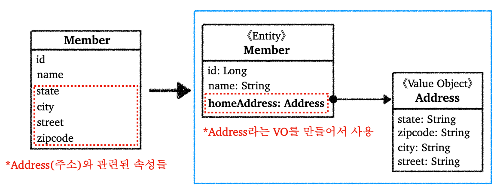

---

## 1. 값 타입(Value Object, Value Type)이란?

JPA는 기본적으로 데이터 타입을 다음의 두 가지 타입으로 분류한다.

* **엔티티 타입(Entity Type)**

  * `@Entity`로 정의하는 객체

  * 데이터가 변해도 식별자로 지속해서 추적 가능

  * 예) 특정 엔티티의 나이, 이름 등을 변경해도 식별자로 인식이 가능하다

<br>

* **값 타입(Value Type)**

  * `int`, `Integer`, `String` 처럼 단순히 값으로 사용하는 기본 타입이나 객체

  * 식별자가 없고 값만 있기 때문에 값을 변경시 추적 불가

  * 값 타입은 공유하면 안된다
    * 예) 회원 이름 변경시 다른 회원의 이름도 함께 변경되면 안됨(사이드 이펙트가 일어나면 안됨)

<br>

여기서 값 타입은 다음으로 분류할 수 있다.

* **기본 값 타입**
  * 자바 기본 타입(`int`, `double` ..)
  * 래퍼 클래스(`Integer`, `Float` ..)
  * `String`
  * 생명주기를 엔티티에 의존한다
    * 예) 회원 삭제시 해당 이름, 나이, 전화번호 필드도 함께 삭제
  * 자바의 기본 타입은 공유 안됨
    * 자바에서 기본 타입은 항상 값을 복사함
    * `Integer`같은 래퍼 클래스 또는 `String` 같은 특수 클래스는 공유 가능하지만 변경은 불가능

* **임베디드 타입(Embedded Type, 복합 값 타입)**
  * 새로운 값 타입을 직접 정의해서 사용하는 값 타입을 임베디드 타입
  * 기본 값 타입들을 모아서 사용하기 때문에 복합 값 타입이라고도 부름

* **컬렉션 값 타입(Collection Value Type)**

<br>

여기서 임베디드 타입이나 컬렉션 값 타입은 JPA에서 정의해서 사용해야 한다.

<br>

---

## 2. 임베디드 타입(Embedded Type) 사용

임베디드 타입을 사용하는 이유는 무엇일까? 다음 엔티티에서 주소(`address`)와 관련된 속성들이 존재한다고 가정해보자.

<br>



<p align="center">임베디드 타입</p>

<br>

위 그림에서 볼 수 있듯이, 연관된 공통 속성을 뽑아서 새로 `Address`라는 클래스를 뽑아서 임베디드 타입으로 사용하고 있다.

이런 임베디드 타입의 장점은 다음과 같다.

* 재사용성 증가
* 높은 응집도
* 해당 임베디드 타입에서 해당 값 타입만 사용하는 의미있는 메소드를 정의할 수 있다

<br>

임베디드 타입을 사용할 때, 해당 임베디드 타입을 포함한 모든 값 타입은, 값 타입을 소유한 엔티티에 생명주기를 의존한다. 또한 임베디드 타입을 사용한다고 해서 테이블의 설계가 변하는 것은 아니다. 애플리케이션 레벨에서 더 객체지향적으로 관리를 할 수 있게 되는 것 뿐이다.

임베디드 타입을 JPA에서 사용하는 방법에 대해 알아보자.

<br>

`Member` 엔티티는 다음과 같다.

```java
@Entity
@Getter @Setter
@NoArgsConstructor
public class Member {
  
  @Id @GeneratedValue
  private Long id;
  private String name;
  
  // 기존 주소와 관련된 속성들을 Address라는 임베디드 타입으로 만듬
  @Embedded // 값 타입을 사용하는 곳에 표시한다
  private Address homeAddress;
  
}
```

<br>

임베비드 타입 `Address`를 만들자.

```java
@Embeddable // 값 타입을 정의하는 곳에 표시한다
@Getter @Setter
@NoArgsConstructor
public class Address {
  
  private String state;
  private String zipcode;
  private String city;
  private String street;
  
  // 관련된 메서드를 정의할 수 있다
  
}
```

<br>

> 추가로
>
> * 임베디드 타입은 임베디드 타입을 가질 수 있다. 임베디드 타입 심지어 엔티티 타입을 가질 수도 있다.
> * 한 엔티티에서 같은 임베디드 타입을 사용하는 경우 중복이 일어난다
>   * 예) `Address` 타입을 가지는 필드 두 개
>   * `@AttributeOverrides` 애노테이션을 이용해서 컬럼명 속성을 재정의 할 수 있다
>   * 필요하면 검색해서 사용 ㄱ
    {: .prompt-info }

<br>

---

## Reference

1. [인프런 - 김영한 : 스프링 완전 정복](https://www.inflearn.com/roadmaps/373)
2. [김영한 : 자바 ORM 표준 JPA 프로그래밍](https://product.kyobobook.co.kr/detail/S000000935744)
3. [Udemy - Spring Boot 3, Spring 6 & Hibernate](https://www.udemy.com/course/spring-hibernate-tutorial/?couponCode=ST8MT40924)