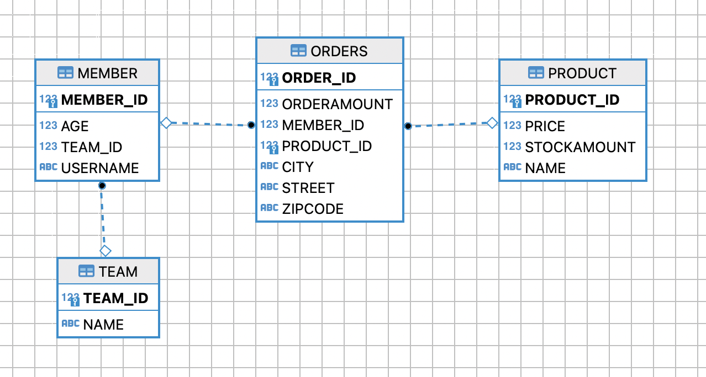
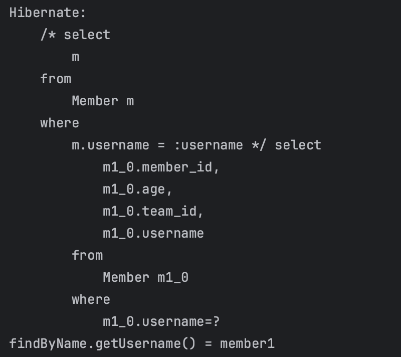

---

## 1. JPQL

### 1.1 JPQL 소개

JPA는 다양한 쿼리 방법을 지원한다.

* JPQL
* QueryDSL
* Native SQL
* JDBC API 직접 사용
* MyBatis, JdbcTemplate 사용
  * JDBC API, MyBatis, JdbcTemplate 등을 이용할 때 영속성 컨텍스트를 적절한 시점에 강제로 플러시할 필요가 있다
  * SQL 실행 직전에 수동으로 영속성 컨텍스트 수동 플러시
  * 위의 라이브러리나 API는 JPA의 라이프사이클이 관리하는 것들이 아니기 때문!
* 이외에도 다양한 쿼리 방법들이 존재한다.

<br>

JPQL에 대해 알아보자.

기존에 우리가 조회하던 방법은 `find()`를 이용해서 객체 그래프를 탐색하는 방식으로 조회했다.(`a.getB().getC()`) 

그러면 `나이가 20살 이상인 회원 조회`, `특정 날짜 사이에 가입한 회원 조회` 처럼 복잡하게 검색을 하고 싶은 경우 어떻게 할까? 

JPA의 경우 엔티티 객체를 중심으로 개발을 하게 된다. 이때 검색을 해도 테이블이 아닌 엔티티 객체를 대상으로 검색을 한다. 그러나 모든 DB 데이터를 객체로 변환해서 검색하는 것은 사실상 불가능하다.

우리는 애플리케이션이 필요한 데이터만 DB에서 불러오는, 검색 조건이 포함된 SQL이 필요하다. 이를 도와주기 위해서 JPA는 SQL을 추상화한 JPQL이라는 객체 지향 쿼리 언어를 제공한다. 왜 객체 지향 쿼리 언어냐면, JPQL은 엔티티 객체를 대상으로 쿼리를 하기 때문이다.

<br>

JPQL 사용 예시를 살펴보자.

```java
String jpql = "select m from Member m where m.age > 18";

List<Member> result = em.createQuery(jpql, Member.class)
        .getResultList();
```

* JPQL은 테이블이 아닌 객체를 대상으로 검색한다
* SQL을 추상화하기 때문에 특정 데이터베이스 벤더에 의존적이지 않다

<br>

위 JPQL이 SQL로 변환되어 DB에 요청이 날라간다. 실행된 SQL의 모습을 확인해보자.

```sql
select
    m.id as id,
    m.age as age,
    m.USERNAME as USERNAME,
    m.TEAM_ID as TEAM_ID
from
    Member m
where
    m.age>18
```

<br>

---

### 1.2 QueryDSL 소개

* JPQL은 동적 쿼리 작성이 어렵다는 단점이 있다
  * 조건에 따라 문자열을 더하고 생략하는 등의 작업은 실수를 하기 쉽다
* QueryDSL은 문자가 아닌 자바 코드로 JPQL을 작성할 수 있다
* JPQL 빌더 역할을 하고, 컴파일 시점에서 문법 오류를 찾을 수도 있다
* 이런 코드로 작성할 수 있다는 점에서 동적 쿼리의 작성도 편리하다

<br>

QueryDSL 사용 예시

```java
// JPQL 사용
// String jpql = "select m from Member m where m.age > 18"

// QueryDSL 사용
JPAFactoryQuery query = new JPAQueryFactory(em);
QMember m = QMember.member;

List<Member> list = query.selectFrom(m)
    .where(m.age.gt(18))
    .orderBy(m.name.desc())
    .fetch();
```

<br>

---

### 1.3 Native SQL 소개

* JPA에서 SQL을 직접 사용할 수 있는 기능이다
* JPQL로 해결할 수 없는 특정 DB에 의존적인 기능을 사용하거나, 아주 복잡한 SQL을 사용할 때 사용하는 것을 권장한다

<br>

NativeSQL 사용 예시

```java
String sql = "SELECT ID, AGE, TEAM_ID, NAME FROM MEMBER WHERE NAME = ‘kim’"; // 표준 SQL 사용

List<Member> resultList = em.createNativeQuery(sql, Member.class)
      .getResultList();
```

<br>

---

## 2. JPQL 기본 사용법

JPQL 문서 : [https://docs.oracle.com/cd/E11035_01/kodo41/full/html/ejb3_langref.html#ejb3_langref_select](https://docs.oracle.com/cd/E11035_01/kodo41/full/html/ejb3_langref.html#ejb3_langref_select)

JPQL의 기본 사용법에 대해 알아보자. 들어가기에 앞서 JPQL의 특징을 다시 살펴보자.

* JPQL은 테이블 대상으로 쿼리하는 것이 아니라 엔티티 객체를 대상으로 쿼리하는 객체지향 쿼리 언어
* JPQL은 특정 DB 벤더에 의존적이지 않도록 SQL을 추상화한다
* JPQL을 통해 쿼리를 할때 결국은 SQL로 변환되어서 DB에 쿼리 요청을 한다

<br>

JPQL 연습에 사용할 엔티티 클래스를 모두 만들고나서 DB의 테이블 관계도를 살펴보면 다음과 같다.

<br>



<br>

---

### 2.1 기본 select 문

JPQL의 `select`문의 문법은 다음과 같다.

```sql
select_query :: =
    select_clause
    from_clause
    [where_clause]
    [grouby_clause]
    [having_clause]
    [orderby_clause]
```

<br>

살펴보면 기존 SQL의 쿼리와 상당히 유사하다는 것을 알 수 있다. JPA에서 엔티티의 값만 바꾸는 경우, 트랜잭션의 커밋 시점에서  `update`과 `delete`를 할 수 있다. 그러나 한번에 대량의 대상을 업데이트/삭제하는 경우 JPA에서는 벌크 연산(bulk operation)이라고 해서 따로 존재한다.

<br>

다음 JPQL 예시를 통해 더 알아보자.

```sql
select m from Member as m where m.age > 18
```

* 엔티티와 속성은 대소문자를 구분한다
  * 예) `Member`와 `MEMBER`는 다르다


* JPQL 키워드는 대소문자를 구분하지 않는다
  * 예) `SELECT`와 `select`는 같다


* 테이블 이름이 아닌 엔티티 이름을 사용한다
  * 위 예시에서 `Member` 엔티티를 대상으로 한다
  * 만약 `@Entity(name="xxx")` 처럼 엔티티명을 변경했다면 해당 이름을 사용해야 함


* 별칭을 필수로 지정한다
  * 예) `Member as m` : 멤버 엔티티의 별칭을 `m`으로 지정했다
  * `as`는 생략가능하다

<br>

집합과 정렬은 다음 처럼 사용할 수 있다.

```sql
select
    COUNT(m), // 회원수
    SUM(m.age), // 나이 합
    AVG(m.age), // 평균 나이
    MAX(m.age), // 최대 나이
    MIN(m.age) // 최소 나이
from Member m
```

* 이외에도 `groupby`, `having`, `orderby` 모두 기존 SQL과 비슷하게 사용하면 된다

<br>

---

### 2.2 TypedQuery, Query

타입쿼리와 쿼리에 대해 알아보자.

* `TypedQuery` : 반환 타입이 명확할 때 사용
* `Query` : 반환 타입이 명확하지 않을 때 사용 

<br>

예시를 통해서 알아보자.

<br>

```java
/**
 * 1. TypedQuery : 반환 타입을 명시할 수 있음
 * Member 타입이라는 것을 명시할 수 있음
 * select를 통해 멤버를 조회
 */
TypedQuery<Member> typedQuery = em.createQuery("select m from Member m", Member.class);

/**
 * 2. Query : 반환 타입이 명확하지 않음
 * 만약 m.username만 조회한다면 TypedQuery<String>으로 타입을 명기할 수 있찌만
 * 그러나 지금은 username: String, age: int를 조회하고 있음
 */
Query query = em.createQuery("select m.username, m.age from Member m");
```

<br>

---

### 2.3 결과 조회

결과 조회 API는 다음과 같다.

* `query.getResultList()`
  * 결과가 하나 이상일 때 사용
  * 리스트를 반환함
  * 결과가 없으면 빈 리스트를 반환


* `query.getSingleResult()`
  * 결과가 정확히 하나일 때 사용
  * 단일 객체를 반환함
  * 결과가 없다면 `NoResultException`
  * 둘 아싱이면 `NonUniqueResultException`
  * 스프링 Data JPA에서는 예외 처리를 알아서 추상화해서 제공을 해줌
    * 예) 위의 예외가 발생하면 `null` 반환 등으로 처리해줌
  * 정확하게 하나만 반환할 때 사용하도록 하자

<br>

---

### 2.4 파라미터 바인딩(setParameter())

파라미터 바인딩 방법에 대해 알아보자.

코드를 통해 바로 알아보자.

<br>

```java
Member member = new Member("member1", 25);
em.persist(member);

// :username에 "member1"이 들어감
Member findByName = em.createQuery("select m from Member m where m.username = :username", Member.class)
                    .setParameter("username", "member1") // 파라미터 바인딩
                    .getSingleResult();
            
System.out.println("findByName.getUsername() = " + findByName.getUsername());
```

* `setParameter(field, parameter)` : 바인딩할 필드와 파라미터 명시
  * 위치 기반으로 파라미터 바인딩도 가능하지만 권장하지 않는다
* JDBC에서 `?`로 파라미터 바인딩 했던것과 비슷하다

<br>

결과와 해당 SQL을 확인해서 파라미터 바인딩이 정상적으로 수행됐는지 확인해보자.

<br>



<br>

---

### 2.5 프로젝션(Projection)

프로젝션이라는 것은 데이터베이스에서 필요한 속성만을 조회하는 것을 말한다.

쉽게 말하자면, `select`절에 조회할 속성을 지정하는 것이라고 보면 된다. 프로젝션의 대상은 엔티티, 임베디드 타입, 스칼라 타입(`int`, `String` ...)이 될 수 있다.

* `select m from Member m` : 엔티티 프로젝션
* `select m.team from Member m` : 엔티티 프로젝션
  * 뒤에서 설명하겠지만 `select t from Member m join m.team t` 같은 형식으로 사용하는 것을 권장한다
  * 명시적으로 `join`을 사용하는 것을 권장한다
  * 최대한 SQL과 비슷하게!
* `select m.address from Member m` : 임베디드 타입 프로젝션
* `select m.username, m.age from Member m` : 스칼라 타입 프로젝션
* `select distinct`로 중복 제거 가능

<br>

참고로 엔티티들을 조회할 때, 가져온 엔티티들은 전부 영속성 컨텍스트가 관리한다. 예를 들어서 다음의 코드 처럼 `Member` 엔티티를 전부 조회한다고 가정해보자.

```java
List<Member> result = em.createQuery("select m from Member m", Member.class)
  .getResultList();
```

* 조회한 엔티티가 1개이든 10개이든 100개이든 전부 영속성 컨텍스트에 넣어서 관리한다
* 해당 영속성 컨텍스트에서 관리하는 엔티티들을 수정하면 당연히 수정을 반영할 수 있다

<br>

프로젝션에 여러 값을 조회하는 방법에 대해 알아보자. JPQL 쿼리가 다음과 같다고 가정해보자.

```sql
select m.username, m.age from Member m
```

값을 조회할 때 여러가지 방법이 존재한다. 

* `Query`를 통해서 조회
* `new` 명령어를 통해서 조회

<br>

`new` 명령어를 통해서 조회하는 방법에 대해 알아보자. `new` 명령어를 통해서 조회하는 것은 단순 값을 `DTO`를 통해서 바로 조회하는 것이다.

코드를 통해 알아보자. 먼저 `MemberDTO` 클래스를 만들어보자.

<br>

```java
@Getter @Setter
public class MemberDTO {

    private String username;
    private int age;

    public MemberDTO(String username, int age) {
        this.username = username;
        this.age = age;
    }
}
```

<br>

이제 JPQL을 사용하는 코드를 만들어보자.

<br>

```java
List<MemberDTO> result = em.createQuery("select new hellojpa.jpql.projection.MemberDTO(m.username, m.age) from Member m", MemberDTO.class)
    .getResultList();

MemberDTO memberDTO = result.get(0);
System.out.println("memberDTO.getUsername() = " + memberDTO.getUsername());
System.out.println("memberDTO.getAge() = " + memberDTO.getAge());
```

* `new hellojpa.jpql.projection.MemberDTO(m.username, m.age)`를 통해서 사용한다
* 사용하기 위해서는 `DTO`에 순서와 타입이 일치하는 생성자가 필요하다 
* 단점은 패키지명을 전부 적어줘야한다
  * QueryDSL을 사용하면 간단하게 사용할 수 있다

<br>

---

### 2.6 페이징(Pagination)

JPA에서 페이징(paging)을 사용하는 방법에 대해 알아보자.

<br>

> Pagination은 조회 결과를 가져올 때, 결과를 분할해서 일부 데이터만 가져오도록 가져오는 기법을 말한다.
{: .prompt-info }

<br>

JPA에서는 페이징을 다음의 두 API로 추상화한다.

* `setFirstResult(int startPosition)` : 조회 시작 위치
* `setMaxResults(int maxResult)` : 조회할 데이터 수

<br>

JPA를 이용하면 몇 번째 시작 위치에서 몇 개 가져오고 싶은지 정하기만 하면 된다.

JPA는 이렇게 간단하게 추상화해서 제공하기 때문에, Oracle에서 페이징을 처리하는 것 보다 훨씬 쉽게 사용이 가능하다.

<br>

> Oracle에서의 페이징은  다음 처럼 복잡하게 사용해야한다.
>
> `예시`
>
> ```sql 
> SELECT * FROM (
>  SELECT a.*, ROWNUM rnum FROM (
>      SELECT m.* FROM Member m ORDER BY m.id
>  ) a WHERE ROWNUM <= :endRow
> ) WHERE rnum > :startRow;
> 
> ```
{: .prompt-info }


<br>

코드를 통해 사용법을 알아보자.

```java
em.createQuery("select m from Member m order by m.age desc", Member.class)
    .setFirstResult(0) // 0번 부터
    .setMaxResults(10) // 10개 가져온다
    .getResultList();
```

* `order by m.age desc` : 나이 내림차순 정렬

<br>

---

### 2.7 조인(JOIN)

JPQL에서의 조인에 대해 알아보자.

조인을 사용하는 예시를 살펴보자.

* **내부 조인(Inner Join)**
  * `select m from Member m inner join m.team t`
  * 관계형 데이터베이스에서 내부 조인은 조인 컨디션을 만족하는 튜플들로 결과 테이블을 만든다
  * `inner` 생략 가능


* **외부 조인(Outer Join)**
  * `select m from Member m left outer join m.team t`
  * `outer` 생략 가능
  * 관계형 데이터베이스에서 외부 조인은 조인 컨디션을 만족하지 않는 튜플들도 결과 테이블에 포함시켜서 만든다
    * `LEFT` : 왼쪽 테이블에서 컨디션에 매칭 되지 않는 튜플까지 포함해서 반환
    * `RIGHT` : 오른쪽 테이블의 튜플을 포함한다는 점을 제외하고 `LEFT` 와 동일

<br>

코드로 알아보자.

```java
String query = "select m from Member m inner join m.team t";
List<Member> resultList = em.createQuery(query, Member.class)
    .getResultList();
```

* 내부 조인 사용
* `select m.team from Member m` 와 동일하다. 그러나 이런 묵시적 조인은 사용을 권장하지 않는다

<br>

이번에는 `on` 절을 활용한 조인에 대해 알아보자. `on` 절을 사용하면 다음이 가능하다.

* 조인 대상 필터링
* 연관관계 없는 엔티티에 대한 외부 조인

<br>

조인 대상을 필터링하는 경우에 대해 알아보자. 조인 대상을 필터링한다는 것은 예를 들자면, `Member`와 `Team`을 조인하면서 팀 이름이 `teamA`인 팀에 대해서만 조인을 수행한다는 것이다. 쿼리는 다음과 같다.

<br>

```java
// 1. JPQL
String query = "select m, t from Member left join m.team t on t.name = 'teamA'";
```

```SQL
-- 2. SQL
SELECT m.*, t.* FROM
Member m LEFT JOIN Team t ON m.TEAM_ID=t.id abd t.name='teamA';
```

* `on t.name = 'teamA'` : 팀 이름이 `teamA`인 대상에 대해서만 외부 조인을 수행

<br>

연관관계가 없는 엔티티에 대해서 외부 조인도 가능하다.

```java
String query = "select m, t from Member left join Team t on m.username = t.name";
```

* `Member`의 `username`과 `Team`의 `name`이 동일한 경우에 대해서 조인

<br>

---

### 2.8 서브쿼리(Subquery)

JPQL에서 서브쿼리를 사용하는 방법에 대해 알아보자.

JPQL도 SQL과 비슷하게 서브쿼리를 사용하면 된다.

간단하게 예시를 들자면.

```java
String query = "select m from Member m" +
  " where m.age > (select avg(m2.age) from Member m2)";
```

* `()`안에 서브쿼리를 작성해서 사용하면 된다

<br>

서브쿼리 지원 함수에는 다음이 존재한다.

* `[NOT] EXISTS (subquery)`
  * 서브쿼리에 결과가 존재하면 참


* `{ALL | ANY | SOME} (subquery)`
  * `ALL` : 모두 만족하면 참
  * `ANY`, `SOME` : 조건을 하나라도 만족하면 참


* `[NOT] IN (subquery)`
  * 서브쿼리의 결과 중 하나라도 같은 것이 있으면 참

<br>

> 서브쿼리 사용시 주의점.
>
> * 서브쿼리는 가능하면 최대한 단순하고 이해하기 쉽게 짜자
> * `SELECT` 절이 아닌 `WHERE`나 `HAVING` 절에 사용하는 것이 성능면에서 좋다
> * 가능하다면 서브쿼리 보다는 `JOIN`으로 풀어서 사용하자
{: .prompt-warning }

<br>

---

### 2.9 조건식(Case)

JPQL의 조선식에 대해 알아보자.

<br>

**기본 `CASE`식**

```sql
select
    case when m.age <= 20 then 'student'
         when m.age >= 60 then 'elder'
         else 'standard'
    end
from Member m
```

* 조건을 만족하면 해당 결과 사용

<br>

**단순 `CASE`식**

```sql
select
    case t.name
        when 'teamA' then '110%'
        when 'teamB' then '120%'
        else '105%'
    end
from Team t
```

* 명시한 필드와 매칭이 되면 해당 결과 사용
* 위의 경우 `t.name`이 `teamA`와 일치하면 `110%`를 결과로 사용  

<br>

**`COALESCE`**

```sql
select coalesce(m.username, 'memberNull') from Member m
```

* 결과에 대해서 각 `Member` 엔티티 `m`의 `username` 필드를 검증해서 `null`이라면 `memberNull`이라는 값으로 대체 
  * 만약 `null`이 아니라면 진짜 `username` 값이 반환
  * `null`이라면 `memberNull`이 반환

<br>

**`NULLIF`**

```sql
select nullif(m.username, 'admin') from Member m
```

* `m.username`과 `'admin'`이 같다면 `null` 반환
* 같지않다면 기존 `username` 반환

<br>

---

### 2.10 JPQL 함수

JPQL의 기본 함수들에 대해서 알아보자.

JPQL에는 여러가지 기본 함수들도 제공한다.

문서 참고 : [https://docs.oracle.com/cd/E13189_01/kodo/docs40/full/html/ejb3_overview_query.html](https://docs.oracle.com/cd/E13189_01/kodo/docs40/full/html/ejb3_overview_query.html)

* CONCAT
* SUBSTRING
* TRIM
* LOWER, UPPER
* LENGTH
* LOCATE
* ABS, SQRT, MOD
* SIZE
* INDEX : `@OrderColumn`을 통해 매핑된 컬렉션의 요소의 인덱스를 구하기 위해서 사용
  * 사용을 권장하지 않는다

<br>

사용자 정의 함수를 만들어서 호출하는 것도 가능하다. 사용자 정의 함수를 사용하기 위해서는 다음을 해야한다.

* `Dialect`를 만들어서 사용하는 DB `Dialect`(방언)을 상속받고, 사용자 정의 함수를 등록해야 한다.
* 사용전에 만든 `Dialect`로 설정해야한다
  * `persistence.xml`의 `hibernate.dialect` 변경

<br>

---

## Reference

1. [인프런 - 김영한 : 스프링 완전 정복](https://www.inflearn.com/roadmaps/373)
2. [김영한 : 자바 ORM 표준 JPA 프로그래밍](https://product.kyobobook.co.kr/detail/S000000935744)
3. [Udemy - Spring Boot 3, Spring 6 & Hibernate](https://www.udemy.com/course/spring-hibernate-tutorial/?couponCode=ST8MT40924)