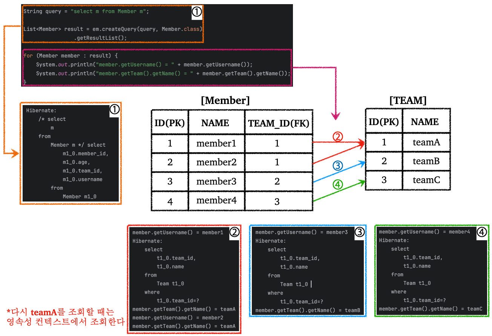

---

## 1. 경로 표현식(Path Expression)

경로 표현식에 대해 알아보자. 경로 표현식은 `.`을 찍어 객체 그래프를 탐색하는 것을 말한다.

경로 표현식에는 다음의 3가지 표현식이 존재한다.

```sql
select m.username -- 1. 상태 필드(state field)
   from Member m
      join m.team t -- 2. 단일 값 연관 필드(single value association field)
      join m.orders o -- 3. 컬렉션 값 연관 필드(collection value association field)
where t.name = 'teamA'
```


**상태 필드(state field)**

* 단순히 값을 저장하기 위한 필드
* 경로 탐색의 끝이다, 더이상 탐색이 불가능하다는 뜻이다 

<br>

**연관 필드(association field)** : 연관 관계를 위한 필드

* 단일 값 연관 필드(single value)
  * `@ManyToOne`, `@OneToOne`, 대상이 엔티티
  * 묵시적 내부 조인 발생
    * 조심하면서 사용해야 한다!
    * 웬만하면 사용하면 안된다
  * 탐색이 가능하다
    * 예) `m.team.name` 처럼 엔티티인 `team`의 필드로 다시 탐색이 가능하다


* 컬렉션 값 연관 필드(collection value)
  * `@OneToMany`, `@ManyToMany`, 대상이 컬렉션
  * 묵시적 내부 조인 발생
  * 탐색 불가능
    * 예) `t.members`에서 다시 `.`으로 탐색이 불가능하다
  * `from` 절에서 명시적 조인을 통해 별칭을 얻으면 별칭을 통해 탐색 가능
    * 예) `select m.username from Team t join t.members m`
    * `t.members`에 별칭 `m`을 부여해서 `m.username`으로 탐색을 했다

<br>

**묵시적 조인이 발생하는 경로 표현식은 최대한 사용하지 않는 것이 좋다.** 묵시적 조인을 사용하게 되면 조인이 일어나는 상황을 파악하기가 어렵다.

결론적으로 명시적 조인을 사용하는 것을 권장하고, 명시적 조인을 사용해야 나중에 쿼리 튜닝이나 추적이 쉽다.

<br>

---

## 2. ⭐페치 조인(JOIN FETCH)

### 2.1 페치 조인 소개

JPQL의 페치 조인에 대해 알아보자.

일단 JPQL의 페치 조인은 표준 SQL의 조인 종류에 해당하지 않는다. 페치 조인은 JPQL에서 성능 최적화를 위해 독자적으로 제공하는 기능이다. 페치 조인은 연관된 엔티티나 컬렉션을 SQL 한 번에 함께 조회할 수 있도록 해주는 기능이다.

여기서 한번에 조회한다는 것은 해당 데이터를 조회시 `fetch` 전략을 `EAGER`로 사용한다는 것으로 이해하면 된다.

<br>

 페치 조인을 사용하는 방법은 `join fetch`를 통해 사용할 수 있다

```sql
[left [outer] | inner] join fetch
```

<br>

예시를 통해 알아보자.

회원을 조회하면서 연관된 팀도 SQL 한번으로 함께 조회하고 싶다고 가정해보자. 페치 조인을 사용하면 이것이 가능하다.

```java
// 1. JPQL
String query = "select m from Member m join fetch m.team";
```

<br>

JPQL은 다음과 같은 SQL로 변환된다.

```sql
-- 2. SQL
SELECT M.*, T.* FROM MEMBER M
INNER JOIN TEAM T ON M.TEAM_ID=T.ID
```

<br>

여기서 다음과 같은 의문점을 가질 수 있다. 

> *"그래서 `join fetch`가 왜 필요한데? `select m from Member m join fetch m.team` 처럼 사용하지 않고 그냥 `select m from Member m`을 사용하고 필요한 팀 데이터만 `member.getTeam().name()`으로 사용하면 되는거 아닌가?"*

<br>

결론적으로 말하자며 페치 조인을 사용하는 이유는 `N+1` 문제라는 것을 해결하기 위해서 사용할 수 있다. 이 `N+1` 문제에 대해 알아보자.

<br>

---

### 2.2 N+1 문제

`N+1` 문제에 대해 알아보자.

다음의 코드를 살펴보자. `join fetch`를 사용하지 않는 경우를 살펴보자.

<br>

```java
Team teamA = new Team("teamA");
em.persist(teamA);

Team teamB = new Team("teamB");
em.persist(teamB);

Team teamC = new Team("teamC");
em.persist(teamC);

Member member1 = new Member("member1", 10);
member1.addTeam(teamA);
em.persist(member1);

Member member2 = new Member("member2", 20);
member2.addTeam(teamA);
em.persist(member2);

Member member3 = new Member("member3", 30);
member3.addTeam(teamB);
em.persist(member3);

Member member4 = new Member("member4", 40);
member4.addTeam(teamC);
em.persist(member4);

// 영속성 컨텍스트 비우기
em.flush();
em.clear();

// join fetch 사용 X
String query = "select m from Member m";

List<Member> result = em.createQuery(query, Member.class)
                .getResultList();

/**
 * 멤버의 팀의 정보를 조회한다
 * 우리는 기본적으로 fetch 전략을 LAZY로 사용하고 있다 (지연 로딩)
 */
for (Member member : result) {
    System.out.println("member.getUsername() = " + member.getUsername());
    System.out.println("member.getTeam().getName() = " + member.getTeam().getName());
}
```

<br>

실행해보면 다음의 결과와 SQL을 확인할 수 있다. (`insert` SQL 제외)

```
Hibernate: 
    /* select
        m 
    from
        Member m */ select
            m1_0.member_id,
            m1_0.age,
            m1_0.team_id,
            m1_0.username 
        from
            Member m1_0
member.getUsername() = member1
Hibernate: 
    select
        t1_0.team_id,
        t1_0.name 
    from
        Team t1_0 
    where
        t1_0.team_id=?
member.getTeam().getName() = teamA
member.getUsername() = member2
member.getTeam().getName() = teamA
member.getUsername() = member3
Hibernate: 
    select
        t1_0.team_id,
        t1_0.name 
    from
        Team t1_0 
    where
        t1_0.team_id=?
member.getTeam().getName() = teamB
member.getUsername() = member4
Hibernate: 
    select
        t1_0.team_id,
        t1_0.name 
    from
        Team t1_0 
    where
        t1_0.team_id=?
member.getTeam().getName() = teamC
```

<br>

여기서 확인할 수 있는 것은, 단지 팀의 정보를 확인하려고 하는데 `select` 쿼리가 총 4번 나가데 된다.

왜 이렇게 되는지 그림을 통해서 확인해보자.

<br>



* `fetch` 전략이 `LAZY`이기 때문에, `Team`과 `@ManyToOne` 관계인 `Member`를 조회할 때 `Member`만 일단 가져온다.
* `Team` 정보가 필요한 순간에, 가령 `member.getTeam().getName()`을 실행할 때 필요한 `Team` 정보를 조회하는 SQL을 보낸다
* 이미 조회한 `Team` 정보는 영속성 컨텍스트에 저장되기 때문에, 다시 해당 정보를 조회할 때는 SQL을 보내지 않는다

<br>

위 경우 처럼 첫 번째 SQL 요청 후에 반복문을 돌면서 SQL을 `N`번 더 요청하게 되는 문제를 `N+1` 문제라고 한다.  

이게 회원을 한 두 명이 아니라, 100명 또는 1000명 조회하게 되면, 날려야할 쿼리의 수도 그만큼 증가하기 때문에 아주 비효율적이다. 이런 문제를 해결하기 위해서 페치 조인(`join fetch`)을 사용하는 것이다.

<br>

페치 조인을 적용한 코드를 사용해보고 결과와 SQL을 확인해보자.

<br>

```java
// 페치 조인 사용
String query = "select m from Member m join fetch m.team";

List<Member> result = em.createQuery(query, Member.class)
                .getResultList();
            
// 페치 조인으로 회원과 팀을 함께 조회하기 때문에 지연 로딩 X
for (Member member : result) {
    System.out.println("member.getUsername() = " + member.getUsername());
    System.out.println("member.getTeam().getName() = " + member.getTeam().getName());
}
```

* `select m from Member m join fetch m.team`으로 페치 조인 사용

```
Hibernate: 
    /* select
        m 
    from
        Member m 
    join
        
    fetch
        m.team */ select
            m1_0.member_id,
            m1_0.age,
            t1_0.team_id,
            t1_0.name,
            m1_0.username 
        from
            Member m1_0 
        join
            Team t1_0 
                on t1_0.team_id=m1_0.team_id
member.getUsername() = member1
member.getTeam().getName() = teamA
member.getUsername() = member2
member.getTeam().getName() = teamA
member.getUsername() = member3
member.getTeam().getName() = teamB
member.getUsername() = member4
member.getTeam().getName() = teamC
```

<br>

결과를 확인해보면 SQL은 한번만 나가고, 반복문을 통해 `member.getTeam().getName()`를 사용할 때는 프록시를 통한 지연로딩을 사용하는 것이 아니라, 이미 가져온 데이터에서 조회하는 것 뿐이다.

<br>

---

### 2.3 컬렉션 페치 조인

이번에는 일대다(`OneToMany`) 관계에서 컬렉션에 대한 페치 조인에 대해 알아보자.

이전 예시에서 `Team`의 입장에서 `Member`에 대한 컬렉션과 페치 조인하는 상황을 생각하면 된다.

코드로 살펴보자.

<br>

```java
// 컬렉션 페치 조인 사용
String query = "select t from Team t join fetch t.members";

List<Team> result = em.createQuery(query, Team.class)
                .getResultList();
            
for (Team team : result) {
    System.out.println("team = " + team.getName() +
            ", member size = " + team.getMembers().size());
}
```

```
Hibernate: 
    /* select
        t 
    from
        Team t 
    join
        
    fetch
        t.members */ select
            t1_0.team_id,
            m1_0.team_id,
            m1_0.member_id,
            m1_0.age,
            m1_0.username,
            t1_0.name 
        from
            Team t1_0 
        join
            Member m1_0 
                on t1_0.team_id=m1_0.team_id
team = teamA, member size = 2
team = teamB, member size = 1
team = teamC, member size = 1
```

* 하이버네이트6 이전 버전에서는 `DISTINCT` 명령어로 중복 제거를 해야했지만, 버전 6부터는 애플리케이션에서 중복 제거가 자동으로 적용된다
  * 예) 중복 제거 전에는 `teamA`가 2 번 등장했을 것이다
  * `teamA` → `Member(name="member1", age=10, team=teamA)`
  * `teamA` → `Member(name="member2", age=20, team=teamA)`


* 참고로 하이버네이트6 이전의 `DISTINCT`는 기존 관계형 DB의 `DISTINCT`와는 기능이 살짝 다르다
  * RDB에서는 완전히 같아야 `DISTINCT`로 제거했다면, 6 이전 버전의 하이버네이트에서는 같은 식별자를 가진 엔티티도 제거해준다
  * 예) 똑같이 `teamA`를 가지고 있으면 `Team` 입장에서는 같은 식별자를 가지고 있다

<br>

---

 ### 2.4 페치 조인의 한계

페치 조인의 한계는 다음과 같다.

* 페치 조인 대상에는 별칭을 주는 것이 불가능하다
  * 하이버네이트에서는 가능하지만, 웬만하면 사용하지 않을 것을 권장한다


* 둘 이상의 컬렉션을 페치 조인하는 것은 안된다
  * 가능한 경우가 있어도 사용하지 않을 것을 권장한다


* 컬렉션을 페치 조인하는 경우, 페이징 API(`setFirstResult()`, `setMaxResultsI()`)를 사용하지 못한다
  * 일대다, 다대일 같은 단일값 연관 필드들은 페치 조인해도 페이징 가능
  * `@BatchSize`를 이용한 해결 방법 찾아보기!

<br>

페치 조인에 대한 추가적인 내용을 포함해서 정리하면 다음과 같다.

* 페치 조인을 통해서 연관된 엔티티들을 SQL 한 번으로 조회할 수 있다
  * 이를 통해서 성능 최적화가 가능하다


* 엔티티에 직접 적용하는 글로벌 로딩 전략보다 우선시 된다
  * 기본적으로 실무에서는 `@OneToMany(fetch=FetchType.LAZY)`를 사용한다 (지연 로딩)
  * 페치 조인을 사용하는 경우 이런 글로벌 로딩 전략보다 우선시 되어서 적용된다


* 최적화가 필요한 곳에 페치 조인을 적용하자
  * 예) `N+1` 문제 해결


* 여러 테이블을 조인해서 엔티티가 가진 모양이 아닌 전혀 다른 결과가 필요하다면, 페치 조인보다는 일반 조인을 사용하고 필요한 데이터들만 조회해서 DTO로 반환하는 것이 효과적일 수 있다
  * 페치 조인은 객체 그래프를 유지할 때 사용하는 것이 효과적이다!

<br>

---

## 3. @NamedQuery

`@NamedQuery`는 JPQL로 표현한 정적 쿼리를 미리 정의해놓고 사용하고 싶을때 사용할 수 있다.

쉽게 말해서 쿼리에 이름을 부여해서 사용할 수 있는 기능이라고 볼 수 있다.

그러면 `@NamedQuery`를 사용하는 이유는 뭘까? `@NamedQuery`의 특징은 다음과 같다.

* JPQL을 미리 정의해서 이름을 부여해서 사용할 수 있다
* 정적 쿼리이다(동적 쿼리 불가)
* 어노테이션 또는 xml에 정의해서 사용한다


* **애플리케이션 로딩 시점에 초기화 후 재사용이 가능하다**
  * 쿼리를 사용하기 위해서는 보통 파싱 작업이 필요하다
  * `@NamedQuery`를 사용하면 로딩 시점에 한번하고 캐시를 해두기 때문에 성능 최적화가 가능하다


* **애플리케이션 로딩 시점에 쿼리를 검증해준다**
  * 로딩 시점에서 문법 오류를 확인해준다고 보면 된다

<br>

애플리케이션 로딩 시점에 쿼리를 검증해준다는 기능을 코드를 통해 알아보자.

먼저 `Member` 엔티티에 `@NamedQuery`를 추가해보자.

<br>

```java
@Entity
@NamedQuery(
        name = "Member.findByUsername", // 관례: {엔티티명}.{지정한 쿼리 이름}
        query = "select m from Member m where m.username = :username"
)
@Getter
@NoArgsConstructor
public class Member {
    // 기존 클래스 엔티티
}
```

* `@NamedQuery`에 해당 쿼리를 식별할 수 있는 이름을 정하고, 해당 쿼리를 명시하면 된다
  * 관례로 보통 앞에 엔티티명을 붙여준다

<br>

사용을 해보자.

<br>

```java
// NamedQuery 사용
List<Member> resultList = em.createNamedQuery("Member.findByUsername", Member.class)
        .setParameter("username", "member3")
        .getResultList();

for (Member member : resultList) {
    System.out.println("member.getUsername() = " + member.getUsername());
    System.out.println("member.getAge() = " + member.getAge());
}
```

```
member.getUsername() = member3
member.getAge() = 30
```

<br>

정상적으로 동작하는 것을 확인할 수 있다. 그러나 `@NamedQuery`의 쿼리에 잘못된 쿼리(오타)를 작성해보고 코드를 다시 실행해보면, 로딩 시점에서 에러가 나는 것을 확인할 수 있다. 컴파일전에 에러를 알 수 있는 것이 제일 베스트긴 하지만, 이렇게 로딩 시점에 바로 에러를 알 수 있는 것도 큰 사고를 예방할 수 있도록 해준다.

<br>

> Spring Data JPA를 이용하면 인터페이스 메서드 바로 위에 `@Query`를 선언해서 `NamedQuery`를 사용할 수 있다.
>
{: .prompt-tip }


<br>

---

## 4. 벌크 연산(Bulk Operation)

JPQL의 벌크 연산에 대해 알아보자.

벌크 연산은 JPQL의 `update`, `delete` 연산이라고 생각하면 된다.

기존 JPA에서 수정, 삭제는 영속성 컨텍스트의 객체를 수정하면, 플러시가 실행되면 변경 감지(dirty-check)를 통해 SQL이 생성되고 데이터베이스에 요청을 보내서 반영을 했다. 또한 각 엔티티 한건 한건 마다 SQL이 나가는 방식이었다.

쉽게 말하자면, 만약 100개의 엔티티를 그냥 변경 감지를 통해 수정을 하려면 SQL도 100건이 나가게 된다. 이는 굉장히 비효율적이다.

이를 해결하기 위해서 JPA는 쿼리 한번에 여러 테이블의 로우(row)를 변경할 수 있는 벌크 연산(bulk operation)을 제공해준다.

<br>

코드를 통해 살펴보자.

<br>

```java
/**
 * 모든 멤버 엔티티에 대해 age를 50으로 변경
 * executeUpdate() : 결과로 영향받은 엔티티 수를 반환한다
 * UPDATE, DELETE 지원
 */
int resultCount = em.createQuery("update Member m set m.age = 50")
        .executeUpdate();

System.out.println("resultCount = " + resultCount);
```

```
Hibernate: 
    /* update
        Member m 
    set
        m.age = 50 */ update Member 
    set
        age=50
resultCount = 4
```

* `executeUpdate()`은 영향받은 엔티티의 수를 반환한다
* `UPDATE`, `DELETE`에 사용 가능
  * 하이버네이트의 경우 `INSERT` 지원
* 위의 예시를 실행시키고 DB를 확인하면 `MEMBER` 테이블의 모든 로우의 `AGE`가 `50`으로 변경이 된것을 확인할 수 있다.

<br>

이런 벌크 연산을 사용할 때 주의점이 있다. 벌크 연산은 영속성 컨텍스트를 무시하고 데이터베이스에 직접 쿼리한다. 벌크 연산을 잘못하는 경우 영속성 컨텍스트내의 엔티티들의 상태로 데이터베이스에 있는 엔티티들의 상태가 싱크가 안맞을 수 있다. 

이를 해결하기 위해서 다음 방법들을 권장한다.

* 벌크 연산을 먼저 실행
* 벌크 연산 수행 후 영속성 컨텍스트 초기화
  * 벌크 연산 자체는 JPQL이기 때문에 플러시가 자동 호출된다

<br>

그러면 문제가 일어나는 상황을 코드로 한번 살펴보자.

<br>

```java
Member member1 = new Member("member1", 10);
member1.addTeam(teamA);
em.persist(member1);

Member member2 = new Member("member2", 20);
member2.addTeam(teamA);
em.persist(member2);

Member member3 = new Member("member3", 30);
member3.addTeam(teamB);
em.persist(member3);

Member member4 = new Member("member4", 40);
member4.addTeam(teamC);
em.persist(member4);

// 벌크 연산 - 데이터베이스의 모든 엔티티의 age를 50으로 수정
int resultCount = em.createQuery("update Member m set m.age = 50")
        .executeUpdate();

// 영속성 컨텍스트에는 반영이 되지 않았기 때문에 50이 아니라 10으로 조회된다
System.out.println("member1.getAge() = " + member1.getAge());
```

```
member1.getAge() = 10
```

* 위 예시에서의 문제점은 벌크 연산 후 데이터베이스와 영속성 컨텍스트가 싱크되지 않았기 때문에, 데이터베이스에서는 `AGE`가 모두 `50`으로 수정되었어도, 영속성 컨텍스트에는 해당 수정이 반영되지 않았기 때문에 `age`를 조회하면 반영전의 데이터가 그대로 조회된다

<br>

이를 해결하기 위한 방법 중 하나는 다음 처럼 사용하는 것이다.

<br>

```java
// 벌크 연산 - 데이터베이스의 모든 엔티티의 age를 50으로 수정
int resultCount = em.createQuery("update Member m set m.age = 50")
        .executeUpdate();

// 영속성 컨텍스트 초기화
em.clear();
Member findMember = em.find(Member.class, member1.getId());

// 조회해보면 데이터베이스에 반영한 내용을 다시 가져왔기 때문에, 의도한대로 조회할 수 있다
System.out.println("member1.getAge() = " + findMember.getAge());
```

<br>

---

## Reference

1. [인프런 - 김영한 : 스프링 완전 정복](https://www.inflearn.com/roadmaps/373)
2. [김영한 : 자바 ORM 표준 JPA 프로그래밍](https://product.kyobobook.co.kr/detail/S000000935744)
3. [Udemy - Spring Boot 3, Spring 6 & Hibernate](https://www.udemy.com/course/spring-hibernate-tutorial/?couponCode=ST8MT40924)