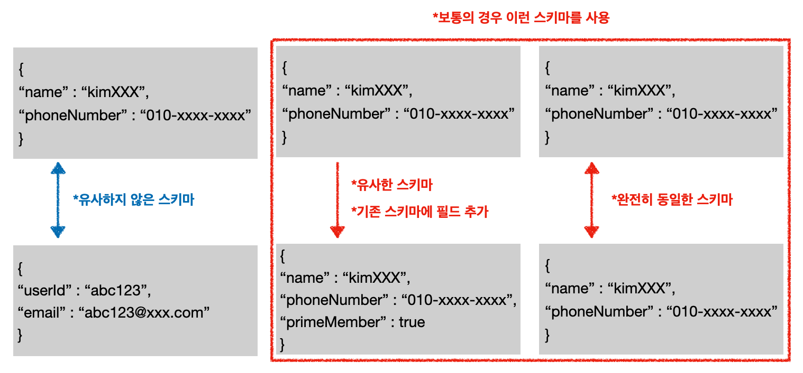
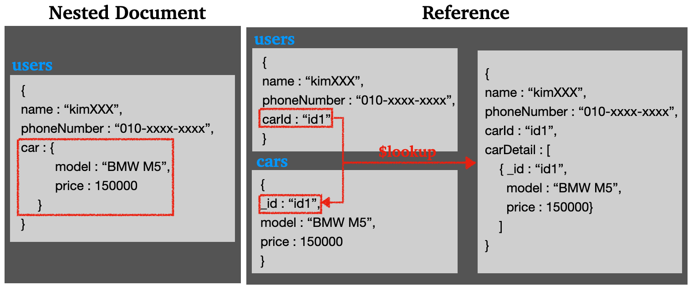
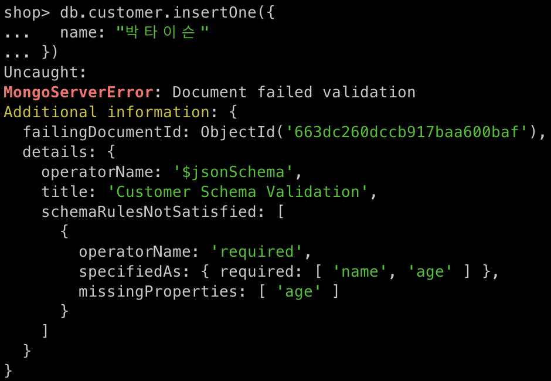
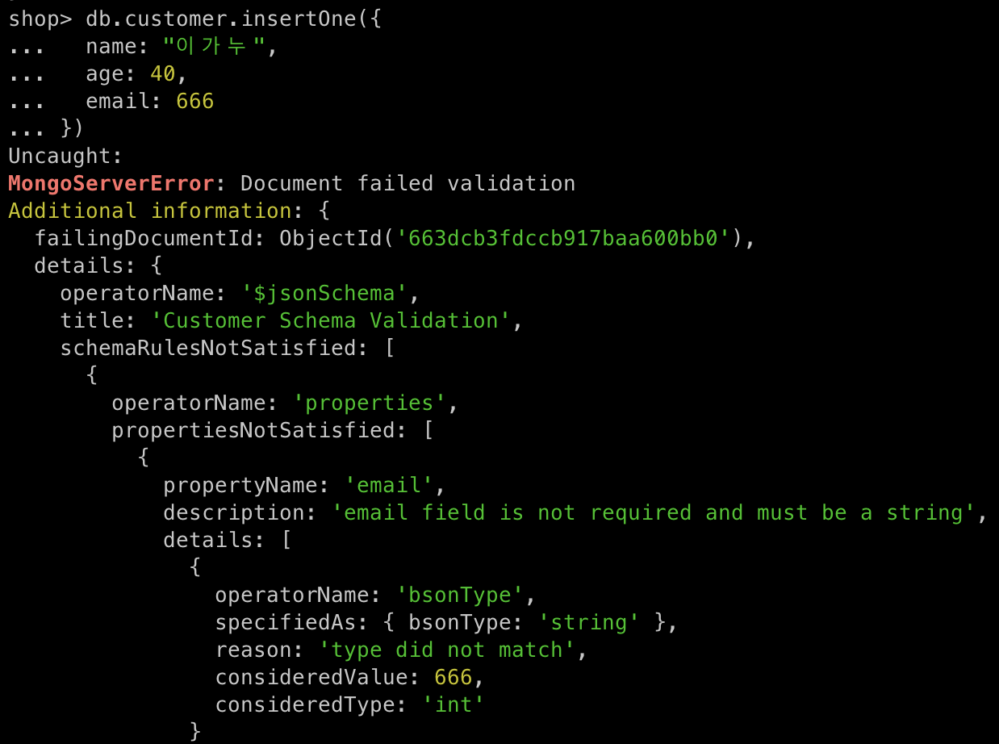
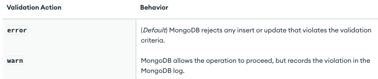
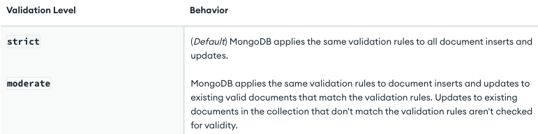

---

## 1. 스키마(Schema) 설계

스키마를 어떻게 설계하는 것이 좋을까? 

프로젝트나 서비스의 요구사항과 상황에 따라 다르겠지만, 거의 모든 경우 기준이 되는 고정된 스키마로 시작을 한다. 이때 사람들은 MongoDB와 같은 NoSQL 데이터베이스의 강점이 경직된 스키마가 아닌 유연한 스키마가 아니냐는 의문점을 가질것이다.

맞다. 그러나 그것이 스키마를 아무런 기준도 없이 마구잡이로 저장한다는 뜻은 아니다. 다음 그림을 살펴보자.

<br>



* 위 그림에서도 알 수 있듯이 오른쪽 방향으로 갈 수록 기존 SQL 데이터베이스의 정형화된 스키마를 사용하는 것을 확인할 수 있다

<br>

NoSQL이 가지는 유연한 스키마의 강점은 중간의 스키마 처럼 추가할 필드가 필요하면, 쉽게 추가가 가능하다는 점이다. 만약 기존의 RDBMS 데이터베이스를 사용하는 경우라면, 필드(RDBMS의 경우 속성)를 추가하기 위해서는 기존 테이블의 스키마 변경을 무조건 했어야한다. 이때, 이미 프로덕션에 들어가 있는 테이블에 스키마 변경을 시도하는 것은 쉽지 않은 일이다. 또한 이런 어려움을 피하려고, 핫픽스로 애플리케이션 레벨에서 수정을 하게 되면 점점 기술 부채가 늘어나게 된다. (한마디로 코드가 더러워진다!)

반면에 몽고DB에서는 처음 부터 애플리케이션 레벨에서 관리를 하고, 필드를 추가하는 경우에도 기존 도큐먼트에 대한 스키마 변경을 강제하지 않아도 된다는 장점이 있다.

<br>

그러면 좋은 스키마를 설계하기 위해선 어떻게 해야할까? 

좋은 스키마에는 정답이 없다. 애플리케이션이 필요하거나 생성하는 데이터의 종류, 회사가 사용할 수 있는 자원의 여유, 데이터의 양, 프로젝트 마감 기간, 등 여러가지 고려 사항이 있기 때문이다. 적절한 스키마를 찾기 위해서는 현재 처한 상황과 요구사항을 잘 파악하고 베스트 프랙티스로 나와있는 방법들을 고려하면서 설계하자.

<br>

---

## 2. 임베디드(중첩) 도큐먼트 vs Reference

스키마를 설계하면서 이런 고민을 맞닥뜨릴 것이다.

반복되는 데이터가 있어도 하나의 도큐먼트 안에 전부 저장할 것인지, 아니면 RDBMS 데이터베이스를 사용하는 것 처럼 참조를 이용해서 다른 컬렉션에서 데이터를 가져와서 사용할 것인지(RDBMS로 치면 `JOIN`을 사용할 것인지) 고민할 것이다.

<br>



* 보통의 경우 강한 `One-to-One` 관계이면 `Embedded(Nested) Document`를 사용
  * 예) 한 환자당 유일하게 존재하는 환자 진단서


* `One-to-Many`, `Many-to-Many` 관계에서 만약 자주 반복적으로 사용되는 중복 데이터가 있고, 이런 중복 데이터가 자주 변하는 경우라면 `Reference`를 사용하는 것이 편할 수 있다
  * 예) 특정 유저가 가지고 있는 책, 자동차에 대한 정보


* 이전 스키마 설계에서도 설명했듯이, 관계(relation) 설정도 결국에는 프로젝트 요구사항과 상황에 따라 어떤식으로 관계를 설정할 것인지 정하면 된다
  * 예1) 애자일하게 개발해야하는 상황이라면 `Nested Document`로 전부 저장했다가 추후에 사용자나 데이터가 많아지면 리팩토링하는 방향으로 진행할 수 있다
  * 예2) 자주 중복되는 내용이라도, `JOIN`이 필요없는 이점을 사용하기 위해서 `Nested Document`를 사용할 수 있다
  * 예3) 중복되는 내용이 자주 바뀌는 상황이라면, 따로 컬렉션으로 분리하고 `Reference`해서 사용할 수 있다


* `Reference`해서 사용하기 위해서는 `aggregate` 파이프라인의 `$lookup` 연산자를 사용해야한다
* `aggregate`에 대해서는 뒤에서 더더 자세히 다룰 예정이다 


* 위 그림에서 `$lookup`은 다음과 같이 사용한다

* ```js
  db.users.aggregate([
  	{
  		$lookup: {
  			from: "cars",
  			localField: "carId",
  			foreignField: "_id",
  			as: "carDetail"
  		}
  	}
  ])
  ```

  * `from` : `JOIN`을 수행할 타겟 컬렉션
  * `localField` : 기존 컬렉션에서 타겟 컬렉션인 `cars`의 `foreignField`와 매칭되어야 할 필드
  * `foreignField` :  타겟 컬렉션의 필드 중에 `localField`와 매칭될 필드
  * `as` : 기존 필드에 추가될 결과 배열 필드의 이름

<br>

`aggregate`와 `$lookup`에 대한 내용은 뒤에서 더 자세히 다룰 예정이다.

<br>

---

## 3. 스키마 검증(Validation)

스키마를 설계하면서, 어떤 경우에는 스키마를 강제하고 싶을 수 있다. 

이때 스키마 검증(Schema Validation)을 사용할 수 있다. 다음과 같은 경우들이 존재한다.

* `user` 컬렉션에 비밀번호(`password`)를 오로지 `string` 타입으로 입력하도록 강제하는 경우
* `post`라는 컬렉션에 반드시 `title`, `content`, `creator`라는 필드를 가지도록 강제하고, `tags`와 `comment`는 선택 사항으로 설계하고 싶은 경우

<br>

그러면 스키마 검증(schema validation)이 검증 레벨(validation level)과 검증 행동(validation action)에 따라 어떻게 동작하는지 알아보자.

먼저 스키마는 다음과 같이 설계하자.

* 컬렉션 : `customer`

* **필수 필드**

  * `name` : `String` 타입

  * `age` : `int` 타입
    * 범위 : `0 ~ 200`


* **선택 필드**
  * `email` : `String` 타입

<br>

---

### 3.1 스키마 검증 적용

컬렉션을 스키마 검증 규칙과 함께 생성하기 위해서는 `createCollection()`과 `$jsonSchema`를 사용한다.

`예시`

```js
db.createCollection("customer", {
  validator: {
    $jsonSchema: {
      bsonType: "object",
      title: "Customer Schema Validation",
      required: ["name", "age"],
      properties: {
        name: {
          bsonType: "string",
          description: "name field is required and must be a string"
        },
        age: {
          bsonType: "int",
          description: "age field is required and must be a integer"
        },
        email: {
          bsonType: "string",
          description: "email field is not required and must be a string"
        }
      }
    }
  }
})
```

* `title`: 설정한 검증 규칙에 대한 설명을 추가할 수 있다
* `description` : 특정 필드에 대한 검증 규칙을 설명을 추가할 수 있다


* `required` : 필수로 입력해야하는 필드를 명시한다
* `properties` : 특정 필드들이 가져야할 데이터 타입(`bsonType`), `description`을 명시한다
  * `enum`을 추가해서 특정 값만 올 수 있도록 제한할 수 있다. [참고](https://www.mongodb.com/docs/manual/core/schema-validation/specify-json-schema/specify-allowed-field-values/#std-label-schema-allowed-field-values) 

<br>

이제 위 명령어를 가지고 스키마 검증이 있는 컬렉션을 생성하고, 몇 가지 도큐먼트들을 생성해보자. 

<br>

먼저 검증 규칙을 모두 만족해서 정상적으로 도큐먼트가 생성되는 경우를 살펴보자. 

`첫 번째 도큐먼트`

```js
db.customer.insertOne({
  name: "김메시",
  age: 10
})
```

`두 번째 도큐먼트`

```js
db.customer.insertOne({
  name: "최날두",
  age: 20,
  email: "choinaldu1234@xxx.com"
})
```

* 위 두 경우는 검증 규칙을 모두 만족하기 때문에 정상적으로 도큐먼트가 생성된다

<br>

이번에는 필수 필드로 지정된 필드를 제외한 경우를 살펴보자.

`세 번째 도큐먼트`

```js
db.customer.insertOne({
  name: "박타이슨"
})
```

* 필수 필드인 `age`가 제외되었다
* 이 경우에는 `Document Failed Validation` 에러가 뜨면서 도큐먼트 생성이 거절된다

<br>



<p align="center">필수 필드인 age가 빠져서 검증 실패</p>

<br>

이번에는 지정한 데이터 타입외의 타입을 사용하는 경우를 살펴보자.

`네 번째 도큐먼트`

```js 
db.customer.insertOne({
  name: "이가누",
  age: 40,
  email: 666
})
```

* `email`을 `string`이 아닌 `int`를 입력했다
* 이 경우에도 검증이 실패하는 것을 확인 할 수 있다

<br>



<p align="center">필수 필드는 아니지만 email을 'string'이 아닌 'int'를 입력해서 검증 실패</p>

<br>

---

### 3.2 validationAction

검증이 실패하면 몽고DB는 기본적으로 문제가 생긴 필드들을 에러 결과에 포함해서 출력한다.

몽고DB는 검증이 실패한 도큐먼트에 대해서 어떻게 처리할 것인지 `validationAction`을 설정할 수 있도록 기능을 제공한다.

기본적으로 `validationAction`은 `error`로 설정되어 있다. [참고](https://www.mongodb.com/docs/manual/core/schema-validation/handle-invalid-documents/)

<br>



<p align="center">https://www.mongodb.com/docs/manual/core/schema-validation/handle-invalid-documents/</p>

<br>

`validationAction`을 설정하는 방법은 다음과 같다.

```예시```

```js
db.createCollection("customer", {
  validator: {
    $jsonSchema: {
      bsonType: "object",
      title: "Customer Schema Validation",
      required: ["name", "age"],
      properties: {
        name: {
          bsonType: "string",
          description: "name field is required and must be a string"
        },
        age: {
          bsonType: "int",
          description: "age field is required and must be a integer"
        },
        email: {
          bsonType: "string",
          description: "email field is not required and must be a string"
        }
      }
    }
  },
  validationAction: "warn"
})
```

* 기존 `validator` 다음에 `validationAction` 필드를 추가하면 된다

* `warn`으로 설정하는 경우 검증이 실패해도 도큐먼트 생성이나 변경 사항을 적용하지만, 검증 실패에 대한 기록을 몽고DB 로그에 추가한다. 

* 로그 확인

  * ``` js
    db.adminCommand(
       { getLog:'global'} ).log.forEach(x => { print(x) }
    )
    ```

<br>

---

### 3.3 validationLevel

 이번에는 `validationLevel`을 설정하는 방법에 대해서 알아보자.

`validationLevel`을 통해서 몽고DB가 어느 정도 수준으로 검증 규칙을 적용할 것인지 정할 수 있다. [참고](https://www.mongodb.com/docs/manual/core/schema-validation/specify-validation-level/#std-label-schema-specify-validation-level)

<br>



<p align="center">https://www.mongodb.com/docs/manual/core/schema-validation/specify-validation-level/</p>

<br>

적용 방법은 다음과 같다.

`예시`

```js
db.createCollection("customer", {
  validator: {
    $jsonSchema: {
      bsonType: "object",
      title: "Customer Schema Validation",
      required: ["name", "age"],
      properties: {
        name: {
          bsonType: "string",
          description: "name field is required and must be a string"
        },
        age: {
          bsonType: "int",
          description: "age field is required and must be a integer"
        },
        email: {
          bsonType: "string",
          description: "email field is not required and must be a string"
        }
      }
    }
  },
  validationAction: "error",
  validationLevel: "strict"
})
```

* `strict`
  * 디폴트 `validationLevel`
  * 도큐먼트가 생성되거나 업데이트할 때 항상 검증을 수행한다

* `moderate`
  * 기존에 존재하던 도큐먼트들 중에서 검증 규칙에 맞지 않았던(통과하지 못하는) 도큐먼트들은 업데이트를 적용시 검증을 수행하지 않는다

<br>

---

### 3.4 스키마 검증 규칙 변경

기존에 적용했던 스키마 검증에 대한 규칙을 변경하는 방법에 대해서 알아보자. [참고](https://www.mongodb.com/docs/manual/core/schema-validation/update-schema-validation/#std-label-schema-update-validation)

스키마 검증을 변경하기 위해서는 `collMod` 명령을 사용한다. 사용법은 다음과 같다. (기존 스키마를 이어서 사용하고 있다)

<br>

`예시`

```js
db.runCommand( { collMod: "customer",
  validator: {
    $jsonSchema: {
      bsonType: "object",
      title: "Customer Schema Validation",
      required: ["name", "age", "gender"],
      properties: {
        name: {
          bsonType: "string",
          description: "name field is required and must be a string"
        },
        age: {
          bsonType: "int",
          description: "age field is required and must be a integer"
        },
        email: {
          bsonType: "string",
          description: "email field is not required and must be a string"
        },
        gender: {
          bsonType: "string",
          description: "gender field is required and must be a string"
        }
      }
    }
  }
})
```

* 기존 스키마 검증 규칙에서 `required`에 `gender` 필드를 추가하고, 데이터 타입은 `string`을 사용하도록 검증 규칙을 변경하였다
* `collMod`를 이용해서 스키마 검증이 없던 기존의 컬렉션에 스키마 검증을 추가하는 것도 가능하다

<br>

---

## Reference

1. https://www.mongodb.com/docs/manual/core/schema-validation/update-schema-validation/#std-label-schema-update-validation
2. https://www.mongodb.com/docs/manual/core/schema-validation/specify-validation-level/
3. https://www.mongodb.com/docs/manual/core/schema-validation/handle-invalid-documents/
4. [https://www.mongodb.com/docs/manual/data-modeling/](https://www.mongodb.com/docs/manual/data-modeling/)
5. https://www.mongodb.com/developer/products/mongodb/mongodb-schema-design-best-practices/
6. https://www.mongodb.com/docs/manual/core/schema-validation/